Renting is Throwing Money Away … Right?

# Renting is Throwing Money Away … Right?

November 24, 2015 By [Paula Pant](https://affordanything.com/author/paula-pant-2/)  —[236 Comments](https://affordanything.com/is-renting-better-than-buying-should-i-rent-or-buy/#comments)

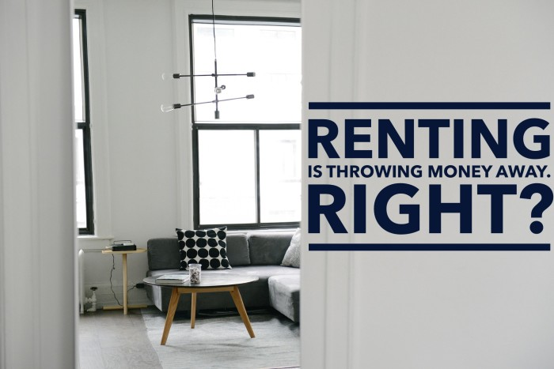
I’ve heard a lot of ridiculous statements:

- “I’m sure we’ll find parking.”
- “I’ll just check Facebook for five minutes.”
- “I’ll skip dessert.”

But perhaps the most absurd is the adage: “If you’re a renter, you’re throwing money away.”

Bulls**t.

You’ve heard those statements, right?

- “I’m sick of throwing money away on rent.”
- “Buying is always better than renting.”
- “Your home is your biggest investment.”

I’m going to explain why these clichés are ludicrous. Preposterous. Outlandish. Nonsensical.

(Somebody please take the thesaurus away from me.)

Let’s chat about the **“should I**  **rent or buy?” question** using logic, math and reason, rather than ill-informed clichés.

Before we jump in, let’s establish a few premises:

- This article is about your primary residence (the place where you sleep).
- This is **not*  *an article about real estate investing.
- As with all articles on Afford Anything, these high-level concepts can be applied anywhere. But specifics about laws, taxes, inflation, etc., are geared at a United States audience.

With that said, let’s begin.

## **“Renting is Throwing Money Away”**

Here are three popular arguments defending the “renting is throwing money away” myth.

#1: Rent is an expense. Mortgages build equity.
#2: Rent is forever. Mortgages end.
#3: Renters don’t benefit from rising home values. Homeowners do.
Let’s dismantle these, one-by-one.

## **Argument #1: “Rent is an expense. Mortgages build equity.”**

Here’s the argument, broken down:

- If you **rent**, 0% of your monthly payments build equity.
- If you **own**, X% of your monthly payments build equity.
- X > 0
- Equity is an asset.
- Assets are good.
- Therefore, owning is better than renting.

Here’s why this is flawed logic.

## **What is Home Equity?**

First, background information:
“Home equity” is measured as *what you own*, minus *what you owe*.

- **Home value:** $350,000
- **You owe:** $200,000
- **Your equity:** $150,000

Here’s the rub: Only a small slice of your mortgage payment builds equity.
Your mortgage consists of four parts:

- Principal (the equity-building piece)
- Interest
- Taxes
- Insurance

These are collectively called PITI, which leads to the geeky joke, “Mortgage? What a pity.” *(I probably shouldn’t attempt a stand-up comedy career … )*

**The “P” is equity; the “ITI” is an expense.** In other words, the “ITI” is money that you’re (also) “throwing away.”

How much of your monthly payment is consumed by ITI? Most of it, particularly during the first 15 years of your loan.

Mortgages are *amortized*, which means the overwhelming majority of your initial payments are applied towards *interest *rather than principal.

Let’s look at an example of a $250,000 house. Let’s image the following scenario:

- You make a $50,000 down payment.
- You borrow $200,000.
- You hold a 5 percent fixed-rate 30-year mortgage.
- Property taxes cost $3,000 per year.
- Homeowners insurance costs $1,500 per year.
- No mortgage insurance.

Your mortgage payment comes to **$1,448.64 per month.**

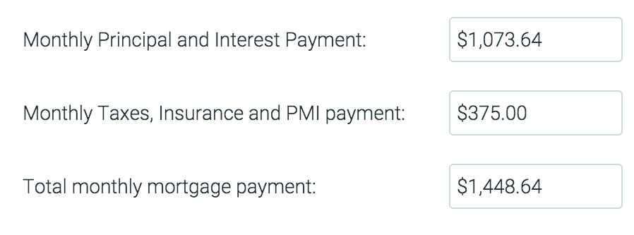

How do these payments break down?

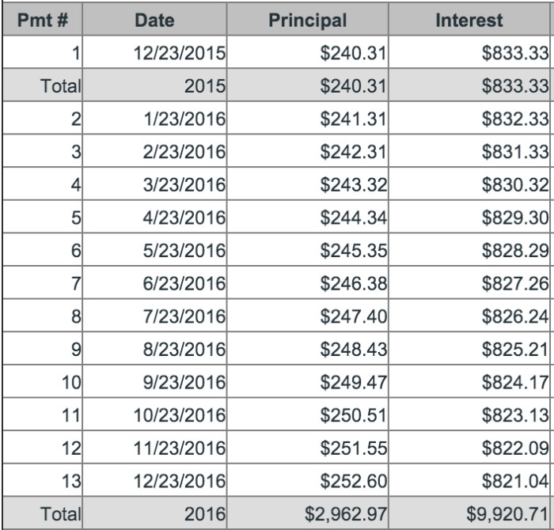

[Thanks to my friend Todd Tresidder at the blog Financial Mentor for this awesome [amortization calculator](http://financialmentor.com/calculator/mortgage-payment-calculator-amortization-schedule). Yes, I just used the word “awesome” to describe an amortization calculator. #ImNerdyAndIKnowIt ]

During the first year, **roughly 83 cents of every dollar** goes towards interest, taxes and insurance (ITI) in this example.

You’re not building $1,448 in equity with each payment. You’re building $250 at best.

After 13 payments, you’ll pay almost $15,000 in interest, taxes and insurance. ($14,795.71, to be exact.) And you’ll only hold an extra $2,963 in equity.

Yeowch.

**The tipping point**, when more money is applied to principal than interest, is based on your interest rate.

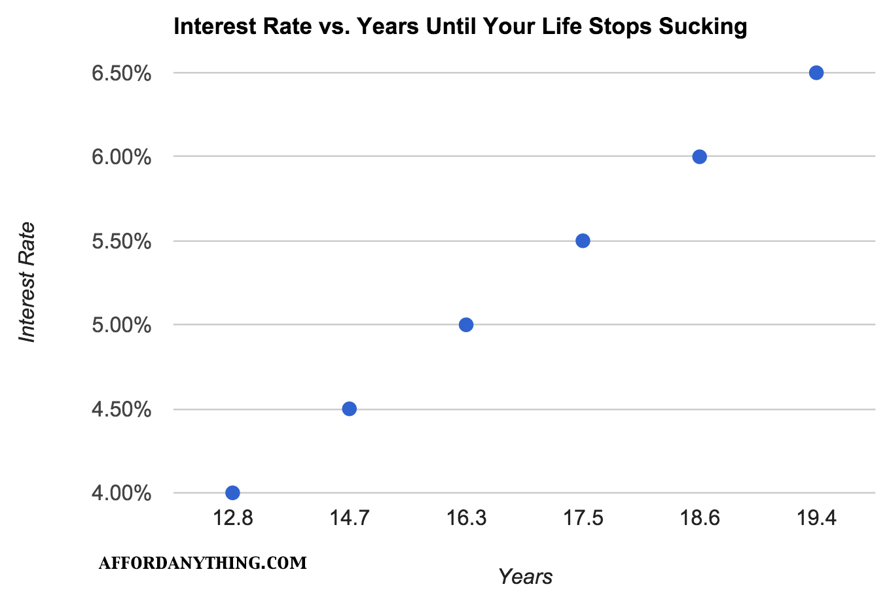

During that first 13-19 years of your mortgage, you’re buried deep in the ITI sandbox. You’ll spend the final decade of your mortgage building far more equity than you did during the first two decades.

*“What if I get a 15-year mortgage?”*
Your first 7 years are going to suck.

**Key Takeaway:** You’re not building much equity, especially during the first decade-and-a-half. Most of your mortgage payment gets “thrown away” on interest, taxes and insurance.

Now that we’ve established this background, let’s return to the original argument:

- If you **rent**, 0% of your monthly payments build equity.
- If you **own**, X% of your monthly payments build equity.
- X > 0

Okay, that logic still seems solid, right? Even if you’re not building much equity, surely *some equity* is better than none … right?

*Riiiighhht?*
Not necessarily. Here’s the real question you should ask:

**What’s the next best alternative? **Is building equity the highest-and-best use of your money? Or could you be doing something better with your limited resources?

Phrased another way: **What’s the opportunity cost **of this equity-building?
.

[The REAL question: What’s the opportunity cost?](https://twitter.com/share?text=The+REAL+question%3A+What%27s+the+opportunity+cost%3F&via=affordanything&related=affordanything&url=https://affordanything.com/is-renting-better-than-buying-should-i-rent-or-buy/)

[Click To Tweet](https://twitter.com/share?text=The+REAL+question%3A+What%27s+the+opportunity+cost%3F&via=affordanything&related=affordanything&url=https://affordanything.com/is-renting-better-than-buying-should-i-rent-or-buy/)

.
*“Uhhh …. Opportunity cost? What do you mean?”*
Okay, before we launch into this, here’s one more fact that you need to know:

## Home Values Keep Pace with Inflation

Home values historically keep pace with inflation. Nothing more.

When people say, “my home increased in value,” they’re really saying, “yay, inflation rose!”

Don’t take my word for it. Listen to Nobel-Prize winning Yale economist Robert Shiller, who gained public notoriety for predicting the Great Recession.

As early as 2005, Shiller started issuing warnings about an impending drop in real estate prices that could be as severe as 40 percent.

Did he have a crystal ball? Is he magical? How did he anticipate this?

His strategy is ridiculously simple, yet effective. Shiller simply looked at U.S. housing prices dating back to 1890, stripping away inflation. He “benchmarked” the 1890 prices at a value of 100 and tracked relative housing costs through the lens of inflation-adjusted dollars.

Through this, Shiller made a few observations:

- **A house in 1897 cost the same as a house in 1997,** adjusted for inflation.
- If you benchmark 1890 prices at a value of 100, you’ll notice that U.S. housing prices have stayed within the 100-120 range over the past century.
- In 1950, for example, the index stood at 105; in 1996 the index stood at 106. *Real estate didn’t make any gains (other than inflation) during that 46-year timespan.*
- Starting in 1997, an unprecedented bubble began forming.
- Every housing ‘peak,’ or bubble, is followed by a tragic, painful, ugly fall.

The New York Times [ran this scary chart](http://www.nytimes.com/imagepages/2006/08/26/weekinreview/27leon_graph2.html) in 2006 (before the recession), based on data from Shiller’s groundbreaking book *[Irrational Exuberance](http://www.amazon.com/gp/product/0691166269/ref=as_li_tl?ie=UTF8&camp=1789&creative=390957&creativeASIN=0691166269&linkCode=as2&tag=afforanyth-20&linkId=VRYSSNEO77CDULMT)*. (I’ve added red arrows for emphasis).

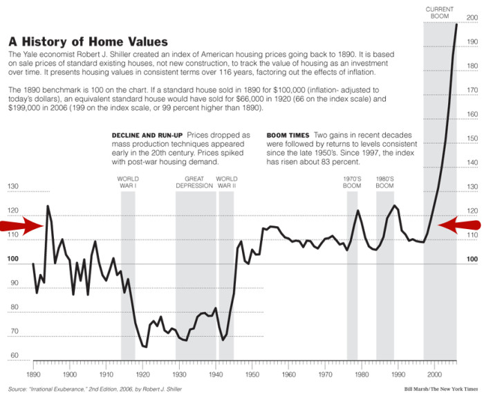

Image credit: The New York Times

As you can see, housing prices (adjusted for inflation) typically stay within a narrow range — around 100-120 on that chart.

There have been only two notable exceptions. The first was triggered by the austerity of World War I, ending with post-WWII prosperity. The second was the rampant housing boom that started in 1997. And, well, we know how that story ends.

*“But housing is booming now!”*

Sure, some people who bought at the bottom of the market in 2009 are now sipping champagne on the French Riviera. (I’m kidding. Kinda.)

Home prices in many parts of the nation have doubled since the 2008-2009 lows. **But in that same time period, the total U.S. stock market has nearly tripled.**

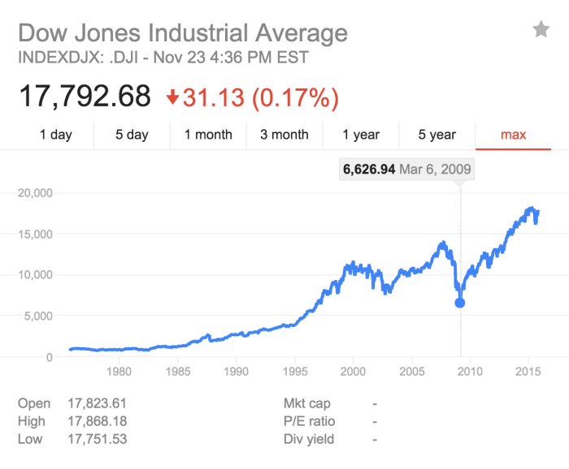

In March 2009, the Dow Jones (a measure of the largest U.S. stocks) was valued at 6,626. Today its worth 3x more.

**Key takeaway:** Housing keeps pace with inflation. And when it does produce real gains, it often underperforms the overall U.S. broad market.

- **If we cherry-pick dates,** we can find a specific sliver of the population that’s enjoyed runaway home values since 2009. Housing *underperformed* the overall stock market during that same period.
- **If we cherry-pick locations,** we can find specific towns or cities that enjoyed atypical growth, typically due to external influences like rapid job creation. This falls along a bell curve; we can also find towns and cities with unprecedented levels of decline. (Ahem, Detroit.)

When we stop cherry-picking and “zoom out” into a multi-decade macro view, we’re left with the uncomfortable truth that U.S. housing prices don’t substantially increase in value. They merely keep pace with inflation, and they *significantly* underperform the overall U.S. stock market.

## Should I Rent or Buy?

*“So what? Why are you comparing housing to stocks? You have to live somewhere. You don’t have to buy stocks.”*

We’re making this comparison because we’re asking the following question:
Are you better off:
1. Tying up your cash into a home
2. Finding an alternative investment, coupled with a rent payment?

Any cash that’s tied up in home equity, including the down payment, is locked into a lifetime of just-keeping-pace-with-inflation.

This opportunity cost, combined with the additional overhead of homeownership, can (in many markets) negate any advantage that comes from owning.

*“Paula, that sounded like whoomp –whoomp –whoomp. Like Charlie Brown’s teacher. I understood about 0.0000001% of whatever you just said.”*

Okay, let’s …
*“Seriously, Paula, this is too technical. It’s making my head hurt.”*
Alright, let’s walk through an example together.

*“Fine. But you’re competing with Miley Cyrus’ latest tweets. And I gotta say, those are WAY more racy.”*

Gotcha. Check this out:

## Meet Renter Rachel and Owner Owen

Let’s meet Rachel and Owen, two people who are both hardcore savers. They haven’t met, because they’re figments of my imagination.

**Obvious disclaimer:** This example is for illustrative purposes only. Your personal expenses will be different. *Duh.*

This example is meant to illustrate that homeownership is not the slam-dunk golden ticket that society likes to believe.

Here’s an illustrative example of one situation in which the buy vs. rent case isn’t so clear-cut.

Please DO NOT pitch a fit in the comments about *“waaahhh, my interest rate is lower!”* because this tells me you missed the point.

The point = **crunch the numbers using the specifics of your personal situation**, instead of making a six-figure decision based on an oversimplified cliche.

Intuitively, we all know that if you’re going to live somewhere for one year, renting is better. And if you’re going to live somewhere for 40 years, buying is better.

Somewhere between one year and 40 years is the crossover point, where buying becomes better than renting. It might be 5 years. It might be 10 years. It might be 15 years. It might be 20 years. It might be 25 years.

The question, then, is: **Where is that crossover point?** How can you solve this puzzle?

The solution comes from running scenarios based on a massive variety of factors, including the price-to-rent ratio in your area (we’ll dive into that concept later in this article), prevailing interest rates, tax brackets, utility costs, HOA fees, alternative investment opportunities and a long list of other factors.

Every human will have unique data points. That’s why every person should crunch the numbers based on their own personal situation.

If you don’t like the numbers in the example below, re-run the scenario using your own numbers. *That’s the point. *

Don’t buy into oversimplified cliches like “renting is throwing your money away.” Don’t oversimplify a six-figure decision.

Onto the example:

Rachel and Owen separately saved half of their income for the past few years. Now they each hold $102,500 in cash.

- **Rachel is a renter.** Her rent costs $2,500 per month.
- **Owen is an owner.** His mortgage costs $2,500 per month.

Rachel paid her landlord a security deposit of $2,500. She invested $100,000 into an [Total U.S. Stock Market Index Fund](http://affordanything.com/2014/06/10/the-ultimate-beginners-guide-to-financial-awesomeness/) that earns an 8 percent long-term annualized average.

Owen’s mortgage consists of $2,000 for principal and interest and $500 for taxes and insurance. He carries a 30-year fixed-rate mortgage with a 5 percent interest rate, which means his loan balance is $372,500 and the value of the home is $465,000.

***“Can Rachel and Owen live in equivalent homes?”*** — Yes, if the **price-to-rent ratio** in their area is 15.5.

We’ll deep-dive into the concept of price-to-rent (P/R) ratio later in this article. Stay tuned.

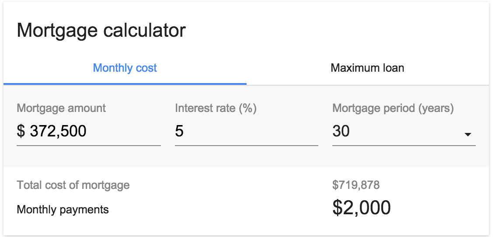

To buy this house, Owen made an initial payment of $102,500, which divides out as $92,500 for the down payment (which is 20 percent of the home value) plus another $10,000 for the buyer’s side of closing costs.

In other words:

- Both started with the same amount of money.
- Rachel used her money to invest in a broad-market index fund.
- Owen used his money to make a 20% down payment on a home.

Rachel and Owen both live in their respective homes for 10 years.
During that time:

- Rachel’s rent rises 2% per year.
- Owen’s home value climbs 2% per year.
- Inflation increases 2% per year.

Are you with me so far? Sweet.
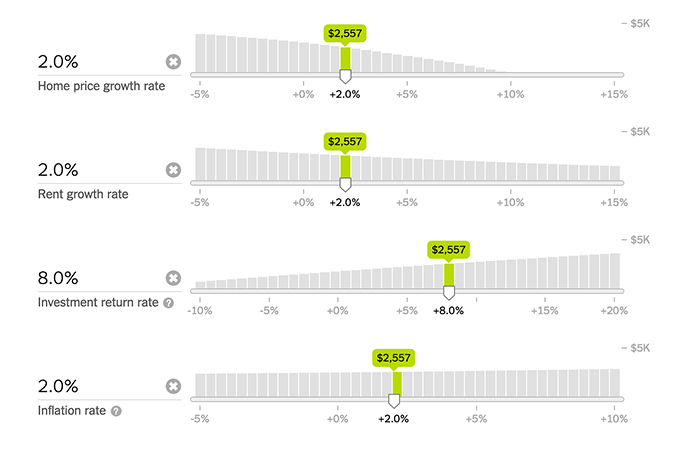
Let’s talk about Owen’s mortgage:

- Owen has a fixed-rate, 30-year mortgage.
- His principal and interest payments stay the same, so he repays his loan with increasingly cheaper dollars over time (as inflation kicks in).
- His property taxes and homeowner’s insurance premiums rise at the rate of inflation, which means his total mortgage payment climbs slightly.
- He sets aside one percent of the home value, or $4,650 per year, to take care of maintenance, repairs and renovations. (He loses much of this value to depreciation of fixtures and mechanicals, which he replaces and upgrades in 10 years before listing the home for sale.)
- He pays $300 per month in HOA dues.

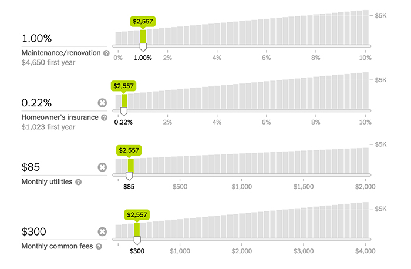

*(Note: I ran this scenario through multiple online calculators. Each one gave me a slightly different answer. I’m posting screenshots from the [NYTimes calculator](http://www.nytimes.com/interactive/2014/upshot/buy-rent-calculator.html). Please allow for slight variations, such as a $2,500 payment vs. a $2,557 payment, based on answers from divergent calculators. These minor differences don’t significantly affect the outcome.)*

Still with me? Let’s look at their utilities, maintenance and insurance:

- Owen and Rachel pay equal electricity, gas, cable and internet bills.
- Rachel’s landlord covers water, sewer and trash, while Owen pays $85 per month for these combined services.
- Rachel pays $307 per year in renter’s insurance.

Finally, let’s chat about taxes and fees:

- Owen pays a six percent commission to the real estate agent when he sells his home.
- Owen itemizes his tax deductions and deducts his mortgage interest.
- Both Rachel and Owen pay a 20 percent marginal tax rate.

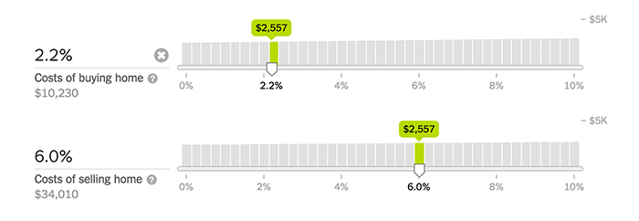
Any guesses on which person holds the upper hand?
Anyone?
Seriously, take a guess. C’mon now. Close your eyes …
Okay, got it?
Well, the results are in …. **Rachel and Owen performed about the same.**
They’re neck-and-neck.

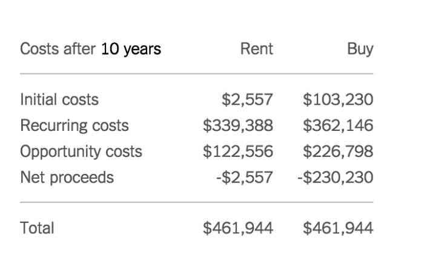

*“But I thought renting is throwing your money away?”*
How is this possible?
Both Rachel and Owen paid **opportunity costs.**

Rachel lost the opportunity to enjoy equity gains. This is exactly what people talk about when they make the argument that “buying is better than renting because you build equity.”

She missed the opportunity for equity gains from three sources:
(1) Principal contributions
(2) Renovations and upgrades
(3) Market growth
We’ll talk about these later in this article.

Owen, however, paid equal opportunity costs by missing out on the chance to invest $100,000 into an index fund. **He tied up cash in a non-performing asset.**

I’m going to repeat this one more time for emphasis, because it’s so crucial:

**Tying up your cash **in a nonperforming or weak-performing asset carries a giant freakin’ opportunity cost.

Can I repeat that again?
*Actually, can you tattoo that on your forehead?*
Tying up your cash in a nonperforming or weak-performing asset … sucks.
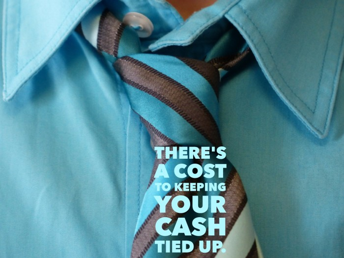

[Quick tangent: Many real estate investors cite this to support “no-money-down,” high-leverage strategies. But this (1) costs higher interest rates, (2) costs mortgage insurance, and (3) creates a frightening risk profile. Anyway, this *isn’t* an article about real estate investing, and most primary-residence homeowners want to build equity, so I’ll stop this tangent.]

Back to Owen and Rachel:

To be clear, *both *of them paid an opportunity cost. And in this specific example, with a specific set of assumptions, **their overall net result was the same.**

## “But I’m a Special Snowflake!”

“My situation is different,” you might be thinking. “My HOA is lower. I’m in a higher tax bracket. I can qualify for 4.5 percent interest instead of 5 percent.”

Yeah. *That’s the point.*
**

The myth that “renting is throwing your money away” misses this nuance and detail.**

Don’t oversimplify the biggest purchase of your life by claiming that building equity is always superior.

.

[Don’t oversimplify the biggest purchase of your life.](https://twitter.com/share?text=Don%27t+oversimplify+the+biggest+purchase+of+your+life.&via=affordanything&related=affordanything&url=https://affordanything.com/is-renting-better-than-buying-should-i-rent-or-buy/)

[Click To Tweet](https://twitter.com/share?text=Don%27t+oversimplify+the+biggest+purchase+of+your+life.&via=affordanything&related=affordanything&url=https://affordanything.com/is-renting-better-than-buying-should-i-rent-or-buy/)

.

You’re purchasing equity. And every purchase carries a tradeoff. When you buy equity, you necessarily *don’t* buy something else. Every dollar holds an opportunity cost.

*(Oh, don’t make me say it —)*

[You can afford anything, but not everything.](http://affordanything.com/2015/08/29/the-12-essential-lessons-i-want-to-share-about-money-and-life/)

*(There! I said it!)*

## “But I’m the Special-est Snowflake of All!”

[**UPDATE 11/30/2015:** I’m getting flack from a lot of Special Snowflakes in the comments. Their arguments are along the lines of: *“Waahh! I’m such a special snowflake! Your hypothetical illustration should have precisely reflected MY situation!”*

Are you having that same thought? Re-read this Special Snowflake section.
The headline of this article isn’t:

- “Housing might be a good deal if your interest rate is 4 percent instead of 5 percent!”
- “Housing might be a good deal if you live there until you die!”
- “Housing might be a good deal if the P/R ratio in your area is less than 15!”

Stop griping about the fact that your specific life doesn’t match the example. You *personally* may not have HOA fees, but that’s not true for everyone. **Furthermore, it’s irrelevant.**

Your Special Snowflake circumstances don’t change the fact that everyone is responsible for analyzing their own variables. Don’t base the biggest purchase of your life on an intellectually lazy cliche.

In this article:

- I give you the **exact tools and steps** to run these numbers for yourself.
- I give you a **framework for understanding** the myriad of variables that play into this decision.
- I **empower you** to conduct your own analysis and make your own decision, based on your own circumstances, rooted in logic and math.

Many people will grasp the lesson. And they’ll be richer for it.

Others, unfortunately, lack the ability to wade out of the details of a hypothetical illustration.

They’re more focused on nit-picking the deviations between themselves and one illustrative example — *“waaahhh! my HOA is smaller!”* — that they miss the bigger point.

And in doing so, they shortchange themselves from an opportunity to learn.

The next time you get social pressure to “stop throwing money away on rent,” come back to this article. [Crunch the numbers,](http://www.nytimes.com/interactive/2014/upshot/buy-rent-calculator.html?_r=0) using a calculator that lets you input a wide variety of variables.

Wealthy people think for themselves. Mediocre people cave to social pressure and lazy cliches.

.

[Don’t make six-figure choices based on social pressure. Think for yourself.](https://twitter.com/share?text=Don%27t+make+six-figure+choices+based+on+social+pressure.+Think+for+yourself.&via=affordanything&related=affordanything&url=https://affordanything.com/is-renting-better-than-buying-should-i-rent-or-buy/)

[Click To Tweet](https://twitter.com/share?text=Don%27t+make+six-figure+choices+based+on+social+pressure.+Think+for+yourself.&via=affordanything&related=affordanything&url=https://affordanything.com/is-renting-better-than-buying-should-i-rent-or-buy/)

.

## Three FAQ’s About Rachel and Owen

*> “Why is Owen paying 5 percent interest? Aren’t today’s interest rates around 4.6 percent? That’s a 0.4 percent difference!!”*

Let’s learn history, shall we?

From 1971 to 2015, [mortgage interest rates (APY)](http://www.freddiemac.com/pmms/pmms30.htm) ranged from a low of 4.6 percent to a high of 16.63 percent. During the majority of those years, average mortgage interest rates spanned between 6 to 10 percent.

If you object that Owen’s 5 percent interest rate seems outlandishly high, *learn history. *Owen’s interest rate reflects a near-record-breaking historical low.

*> “Why do they both move out in 10 years? They should live their homes until they die!”*

From 2001 to 2011, the average American stayed in their homes for [only 6 to 9 years](http://www.creditsesame.com/blog/how-long-are-americans-staying-in-their-homes/). If you object that the Rachel vs. Owen comparison should have assumed they’d live there until they die, *look at behavioral data.*

*> “Rachel’s landlord needs to make money. How could he/she possibly earn a profit under this scenario?”*

Here are many ways Rachel’s landlord could benefit:

- The landlord could purchase the property at a steep discount, such as through a foreclosure auction, short sale, estate sale, or by “driving for dollars” (making direct contact with the owners of distressed property.) This allows him/her to purchase the property significantly below market value.
- The landlord could be holding the property for the sake of inflation-protected wealth preservation, rather than as a cash flow investment. (Don’t assume all landlords share the goal of cash flow. Some simply want to diversify their assets.)
- The landlord could be making a speculative play on potential appreciation. (I don’t recommend this technique, but many landlords do this.)
- The landlord could have inherited the property.
- The landlord could have purchased the property decades ago, paid off the mortgage, and now enjoys the cash flow. They don’t want to sell/trade into a different property due to the hassle involved, so they let this property ride.

Okay, tangent finished. Back to our regularly-scheduled article, already in progress …

## **Argument #2: Rent is Forever. Mortgages End.**

Don’t worry. This next section won’t be as math-y.

Let’s revisit the beginning of this article. There are three arguments that justify the “renting is throwing your money away” myth:

#1: Rent is an expense. Mortgages build equity.
#2: Rent is forever. Mortgages end.
#3: Renters don’t benefit from rising home values. Homeowners do.

We’ve dismantled the first argument. Let’s deep-dive into the second: “You’ll pay rent forever. Your mortgage will eventually end.”

Here’s the breakdown:

- If you rent, you’ll always make rent payments.
- If you own, you’ll pay off your mortgage within 15-30 years.
- Fewer payments are better than more payments.
- Therefore, owning is better than renting.

Flawed logic strikes again.

This reasoning presupposes that **your mortgage is your only payment**. That’s plain wrong.

After you purchase 100% home equity, you own your home “free-and-clear.” This does *not* mean that you’ll never spend another dime on your home again. It merely means that you no longer need to make **principal and interest payments**, which are known as “P&I.”

However, P&I are only one of many home-related expenses. Your other costs include:

- Maintenance
- Repairs
- Renovations / Depreciation
- Property taxes
- Homeowner’s insurance
- Utility bills
- Municipal usage fees (water, sewer, trash)
- Homeowner association dues (if applicable)
- Transaction fees, commissions and closing costs
- Opportunity costs

How much can this cost? Depending on where you live, those expenses could cost ***equal to or more than rent*** on a comparable property.

Here’s an example for a $300,000 single-family home owned for 10 years:

- **Maintenance:** $50/month
- **Repairs / Renovations:** $250/month (1 percent of property value per year; includes major capital expenditures)
- **Property taxes:** $300/month (1.3 percent of property value per year)
- **Homeowner’s insurance:** $125/month (0.5 percent of property value per year)
- **Utility bills:** $50/month (beyond what a landlord covers in a comparable rental)
- **Municipal usage fees:** $75/month
- **HOA dues:** $250/month
- **Transaction fees:** $166/month (combined total of $20,000 out-of-pocket closing costs from both buying and selling with a 120-month holding period)
- **Opportunity costs:** $315/month (investment of a $60,000 down payment at a growth rate of 5 percent after inflation compounding annually; subtract the initial contribution and divide over 120 months, calculated via investor.gov)

Total cost: $1,581 per month.

In this example, owning a $300,000 home “free-and-clear” for 10 years costs $1,581 per month *without* a mortgage.

**Key takeaway:** Your principal and interest payments are not the total picture. Not by a long shot.

[Quick tangent: Unfortunately, many investors don’t do their homework. They jump blindly into the waters, assuming “if the rent covers the mortgage, I’m cool.” Then they lose their shirt.]

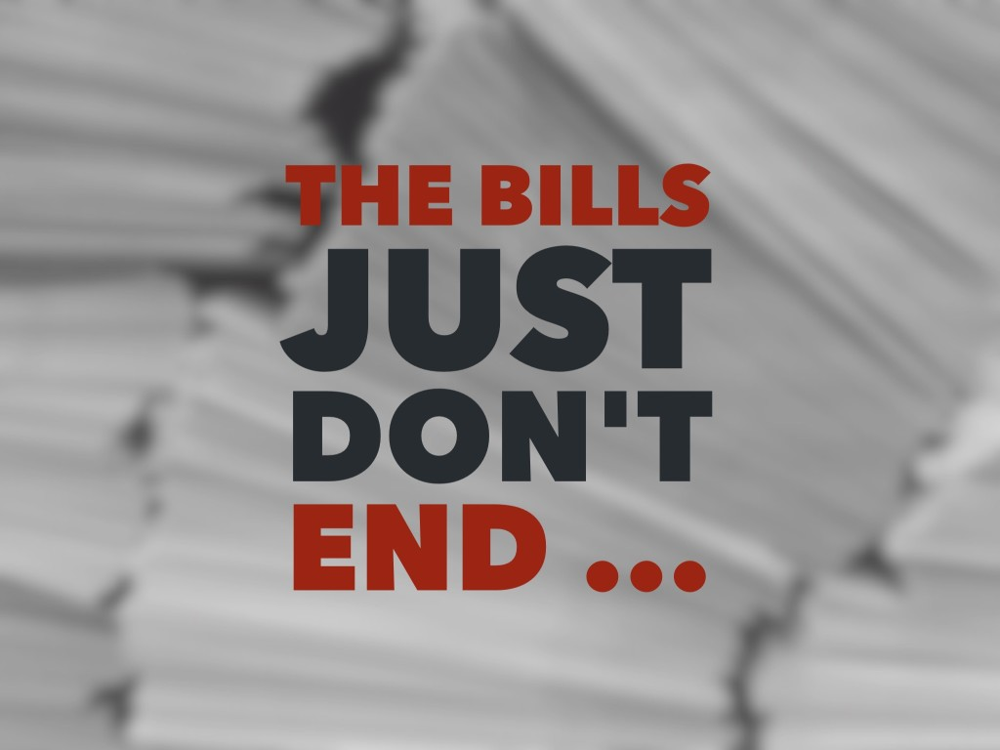

Humans have many cognitive biases in our understanding of money. One of these biases is that we emphasize **cash flow **rather than the whole picture.

- When money leaves our bank account (e.g., paying bills), we feel the pain. *It hurts! It hurts!*
- When expenses are “invisible” (e.g., opportunity cost), we ignore it. *You don’t miss what you never had.*
- When expenses are lump-sum (e.g., replacing the roof, windows, siding, floors, garage door, etc.), we convince ourselves that our monthly costs are absent of those figures. *“My costs are only $600 per month. Oh, and once every 20 years, I pay an extra $55,000.”*

In the example above, you won’t literally watch $1,581 depart your bank account every month. At least $731 of that figure comes in the form of intangibles or lump-sums, which means you’ll only see around $850 per month leave your checking account.

When that happens, it’s easy to fall into the cognitive trap of assuming that cash flow is the whole story. “*My expenses are only $850 per month!”* But it’s not.

Cash flow is a chapter in the novel. An important one. But as the Chief Human Responsible for Your Money, your job is to read and understand the whole book.

Zoom out and look at the big picture; make decisions accordingly.

In fact, if there’s one broad lesson from this entire article, it’s this: **zoom out.**

If you zoom out and look at the larger picture –inflation, investment gains, opportunity costs, legacy-building – you’ll start making smarter choices.

Back to the debunking the “rent is forever; your mortgage is not” argument:

Yes, your P&I payments will disappear after 15-30 years. But you’ll always pay for maintenance, taxes, insurance, renovations, care and operations of that house.

You’ll never be finished with home payments. Regardless of whether you rent or own, **you’ll spend your life paying for housing** in one form or another.

Death and taxes. And housing. And socks. These are life’s few certainties.

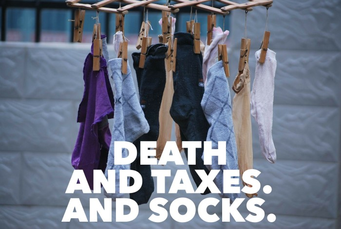

You’ll still need socks.
The question, then, isn’t: “How can I escape this perpetual payment?”

The question is: “*Which* of these two perpetual payments is more desirable? Would I rather pay rent in perpetuity? Or would I rather pay homeownership costs forever?”

Before you can answer that question, you’ll need to see which of those two numbers is bigger. And depending on where you live – Detroit or San Francisco? — the answer could go either way.

The myth that “renting is throwing money away” ignores the simple fact that the cost of rent, ***relative to the price of the property**,* occupies a HUGE range nationwide.

In some parts of the country, you can rent a $300,000 house for substantially less than $1,581 per month. Heck, the landlord will even throw in a free TV and send you a $25 Starbucks gift card.

In other parts of the country, you can’t dream of touching a property like this for less than $3,000+ per month in rent.

And this leads us to today’s actionable lesson: **Check the price-to-rent ratio**.

Don’t be a zombie who listens to oversimplified clichés. Spend 30 seconds doing a little bit of math.

*“Meth?”*
No, math.

The formula for calculating price-to-rent is (predictably) the price divided by annual rent.

**Price:** $300,000
**Rent:** $1,500 per month = $18,000 per year
**Price-to-Rent Ratio** = $300,000/$18,000 = 16.6
Cool. So what does that number mean?
Here are a few rules of thumb:

- If the P/R ratio is greater than 20, hesitate before buying the house.
- If the P/R ratio is greater than 25, don’t buy the house unless you have strong non-financial reasons.
- If the P/R ratio is greater than 30, run screaming in the other direction.

A house with a P/R ratio of 25 would equal a $300,000 house that rents for $1,000 per month. Or a $100,000 house that rents for $333 per month. Yeowch. That’s painful.

[To put this into perspective, my bare-minimum-criteria for any rental property that I purchase is a P/R ratio of 8.33.]

In the Rachel vs. Owen example, their homes carry a P/R ratio of 15.5.
Fun facts about P/R ratios you can use to impress your friends:

- The average is 11.95 nationwide.
- The median is 11.27 nationwide.
- Nationwide, P/R ratios range from a low of 2.84 (awesome for owners) to a jaw-dropping high of 46.38 (fantastic for renters).
- The highest P/R ratios (best spots to be a renter) are in southern California and the northeastern states, particularly in major cities with concentrated business clusters such as San Francisco, Seattle, and New York.
- The lowest P/R ratios (best spots to be an owner) are in the land-locked states. Many of the larger non-coastal cities, like Chicago, Atlanta, Miami, Phoenix and Las Vegas, hold P/R ratios favorable to owners.

When you’re calculating P/R ratio, follow these steps:

- Use the “total acquisition cost” – including purchase price, closing costs, and (if needed) upfront repairs to make the space minimally viable (e.g. if you bought a fixer-upper).
- Run three calculations: best-case, worst-case and mid-case.

For example:
Purchase price: $440,000
Upfront repairs: $10,000
Closing: $5,000
**Total Acquisition Cost:** $455,000

- Worst-Case Rent: $1,800 /mo = $21,600/year
- Mid-Case Rent: $2,000 /mo = $24,000/year
- Best-Case Rent: $2,200 /mo = $26,400/year
- Worst-Case P/R ratio: 21.06
- Mid-Case P/R ratio: 18.95
- Best-Case P/R ratio: 17.23

In this example, we have a property that would obviously make a terrible real estate investment. A quick glance at the numbers makes that abundantly clear.

But it’s a viable candidate for a primary residence, given that the P/R ratio still points in favor of owning. It dances on the edge of the razor blade, but the balance tips in favor of ‘buy.’

So anyway –

Now that I’ve given you some homework, let’s circle back to the justification that launched this conversation:

*“You’ll pay rent forever. Your mortgage will eventually end.”*
That’s false. *Nothing* ends.
You’ll be making house payments until the day you die.
(Sorry. But it’s true.)
(Hey, I’m available for parties!)

Here’s the smarter question that you should ask yourself: Will it be cheaper in the long-term to maintain a home or keep paying rent?

The answer is influenced by:

- Where you live
- What “income bracket” of housing you prefer
- The length of time you’ll hold onto the home
- The ancillary costs of homeownership

To find your answer, check out **the price-to-rent ratio,** and weigh those four other factors I’ve listed above.

.

[Make choices based on hard data, not hyped clichés.](https://twitter.com/share?text=Make+choices+based+on+hard+data%2C+not+hyped+clich%C3%A9s.&via=affordanything&related=affordanything&url=https://affordanything.com/is-renting-better-than-buying-should-i-rent-or-buy/)

[Click To Tweet](https://twitter.com/share?text=Make+choices+based+on+hard+data%2C+not+hyped+clich%C3%A9s.&via=affordanything&related=affordanything&url=https://affordanything.com/is-renting-better-than-buying-should-i-rent-or-buy/)

.

## **Argument #3: “Renters don’t benefit from rising home values. Owners do.”**

At this point, we’ve tackled two of the three misguided justifications for the cliché that “renting is throwing your money away.”

#1: Rent is an expense. Mortgages build equity. – Debunked!
#2: Rent is forever. Mortgages end. – Busted!

Let’s tackle the final rationalization: “Renters don’t benefit from rising home values. Owners do.”

Here’s the argument, broken down:

- Home values rise over time.
- Rising values result in equity gains*.*
- Homeowners benefit from equity gains.
- Renters don’t.
    - In fact, renters are penalized, because equity gains correlate with rising rents.
- Therefore, owning is better than renting.

Let’s dissect this argument. We’ll start with a deep-dive into the concept of equity.

## *“Mommy, where does equity come from?”*

Equity is created in three ways:

### **#1: Principal Reductions.**

Imagine that you sell junk on Craigslist. You earn an extra $500. You use this to make an extra mortgage payment. Congratulations – you now have an extra $500 worth of home equity.

This is called “principal reduction.” You’re trading cash for equity.

Every dollar that you spend on principal reduction carries an *opportunity cost*.

We talked about this at length earlier, so let’s move on to two other types of equity gains.

### **#2: Forced Appreciation.**

Imagine that you get a $10,000 bonus at work. Hooray!

You use this money to upgrade your kitchen. You’re an excellent manager, and you oversee a hyper-profitable renovation.

Your home is now worth $20,000 more, even though you only made a $10,000 investment. You’ve doubled your money.

Half this added value came from trading-cash-for-equity. But the other $10,000 came from *forced appreciation*, which is the result of knowledgeable, skilled management.

Forced appreciation comes from choosing the right property and managing it correctly. This is a real estate investor’s bread-and-butter.

Talented investors don’t sit around, hoping that the market might rise in value. They take matters into their own hands. They spend $X to remodel a home, create a value that’s greater than $X, and pocket the spread — either through higher rental income or via sales.

Here’s the question: Do you have what it takes to force appreciation?
*“Yeah, of course. I oversaw a bathroom remodel last year.”*
Well — that’s not exactly the same thing.

Smart investors don’t spend money based on personal desires – “*I’ve always loved this deep-blue granite!” *They make informed, rational decisions based on profit and loss. ([Remember this story?](http://affordanything.com/2015/08/07/behind-the-scenes-how-i-manage-real-estate-from-around-the-globe/))

Investors *don’t* say things like:

- “I love these maple cabinets!”
- “This hardwood would look great with our furniture.”
- “Let’s wallpaper the living room’s accent wall!”

Homeowners, by contrast, often make renovation decisions based on their personal tastes. This is a *far* less profitable strategy.

Forcing appreciation is a skill – just as playing guitar, dribbling a basketball and speaking Spanish are skills.

**Key takeaway:** You can create equity through forced appreciation. But don’t assume you’ll hit a home run on your first swing. You’ll need skill and strategy first.

### **#3: Market Gains.**

Market-based equity gains come from growth in the overall housing market.

Let’s say that you buy a house in January for $100,000. By December, that house is worth $102,000. Congratulations – you’ve gained $2,000 in equity.

Sounds amazing, right? Who doesn’t love something-for-nothing?
But here’s the tough truth about market gains: **You’re outta control.**

The housing market might rise, might fall, or might stagnate. It might do a combination of all three.

If home values climb, they may rise at a long-term annualized rate of 2 percent, 3 percent, 4 percent. Or maybe 10 percent. Who knows? There’s nothing you can do to affect these results.

Sure, you can purchase a home in a neighborhood that shows signs of appreciation: lots of new construction, permits and jobs are usually a good sign. Unless, of course, it’s 2007 and supply has drastically outpaced demand. Then you’re screwed.

You can’t control market gains. You have no influence over timing, scale, or direction.

“Buy-and-pray” is not a wealth strategy.

**Key takeaway:**  [Hope is not a plan](http://affordanything.com/2013/02/27/hope-is-not-a-plan/). And it shouldn’t drive a six-figure decision.

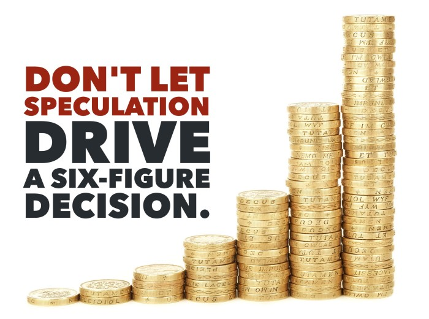

Back to the original argument: “Renters don’t benefit from rising home values. Owners do.”

Rising home values come from three sources:

- Principal reductions
- Forced appreciation
- Market gains

**What’s the cost of these?**

- One requires opportunity cost.
- One requires skill.
- One is outside of your control and historically keeps pace with inflation.

I’d hardly call this a “benefit.”
*“But renters get nothing at all. At least owners are getting some equity.”*
Let’s return to that conversation about opportunity costs. Renters are:

- Not tying up cash in a downpayment
- Not tying up cash in renovations, repairs and maintenance
- Potentially paying lower monthly costs

By doing so, renters enjoy:

- Greater flexibility
- Lower overhead
- Fewer responsibilities
- Opportunity to pursue higher returns elsewhere

So … yeah. Plenty of benefits on both sides.

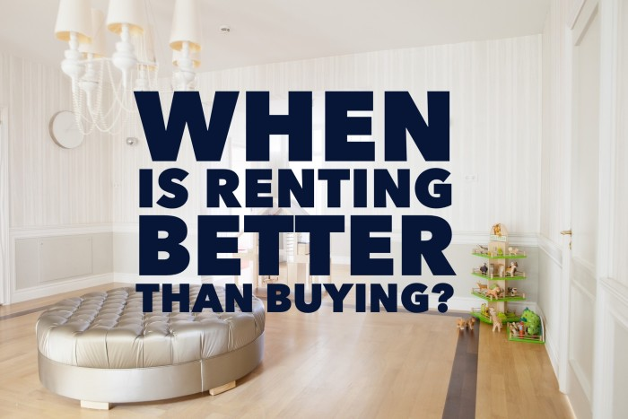

## Is Renting Better Than Buying?

What conclusions can we reach at the end of all of this?

Should you keep renting? Is renting better than buying? Or should you purchase a home? Is buying the better choice?

Your answer is going to depend on a *massive* number of factors, including:

- The local price-to-rent ratio.
- How long you’ll live there.
- Your alternative investment options.
- Your assumptions about inflation and investment gains.
- Maintenance, repair, insurance, property tax and capital expense costs.
- The rate at which rents rise.
- Et cetera, etc., etc.

You get the picture.

My goal is to impress upon you — once and for all — that this myth that **“renting is throwing money away”** is wrongheaded.

In fact, it’s dangerous.
It oversimplifies a life-changing, six-figure decision.

It’s probably caused thousands (or millions) of people to buy houses they later regret.

And it needs to stop.

The next time you hear a friend or family member repeat one of these cliches — *“I’m tired of throwing money away on rent”* — send them this article.

And the next time you catch yourself thinking the same thing (because we’re social creatures who internalize pop-mythology), come back and re-read this.

There’s no such thing as “throwing money away on rent” — not any more than you’re also throwing money away on cleaning gutters, paying property taxes, and for that matter, buying socks.

If you’re a homeowner (like me) and you enjoy it, good for you.
And if you’re a renter, stop feeling guilty.
Next time, we’ll focus on a different ridiculous statement:
*“I’ll skip dessert.”*
Yeah, right. I’m going to prove that one wrong right now.

**************
Take action!

- Track your [net worth](http://affordanything.com/personalcapital).
- Start a side hustle! How to [start a blog](http://affordanything.com/how-to-start-a-blog-and-make-money-on-bluehost/) in 5 minutes.
- Travel without paying for flights. Here are my favorite cards for [free airfare](http://affordanything.com/travel-cards/).

### Learn How To Escape the 9-5

Get free updates on building wealth and living to the fullest.
Zero spam.

 Your Best Email

 We use this field to detect spam bots. If you fill this in, you will be marked as a spammer.

[initialinitialinitial*s*initial Tweet](https://twitter.com/share?original_referer=/&text=Renting+is+Throwing+Money+Away+%E2%80%A6+Right%3F&url=https://affordanything.com/is-renting-better-than-buying-should-i-rent-or-buy/&via=affordanything)

[initialinitialinitial*j*initial Share](https://www.facebook.com/share.php?u=https%3A%2F%2Faffordanything.com%2Fis-renting-better-than-buying-should-i-rent-or-buy%2F)

[initialinitialinitial*b*initial Pin]()