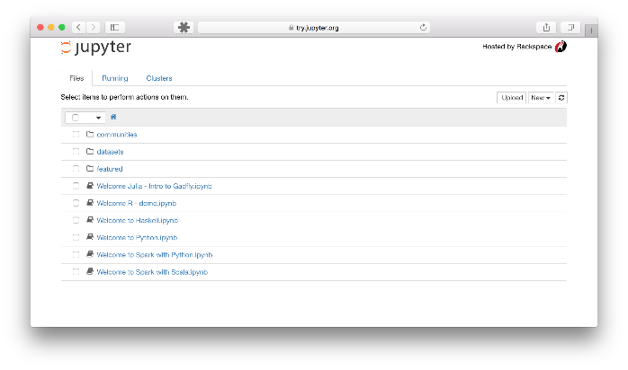

Running the Notebook — Jupyter Documentation 4.1.1 alpha documentation

# Running the Notebook[¶](https://jupyter.readthedocs.io/en/latest/running.html#running-the-notebook)

Contents

- [Basic Steps](https://jupyter.readthedocs.io/en/latest/running.html#basic-steps)
- [Starting the Notebook Server](https://jupyter.readthedocs.io/en/latest/running.html#starting-the-notebook-server)
- [Introducing the Notebook Server’s Command Line Options](https://jupyter.readthedocs.io/en/latest/running.html#introducing-the-notebook-server-s-command-line-options)
    - [How do I start the Notebook using a custom IP or port?](https://jupyter.readthedocs.io/en/latest/running.html#how-do-i-start-the-notebook-using-a-custom-ip-or-port)
    - [How do I start the Notebook server without opening a browser?](https://jupyter.readthedocs.io/en/latest/running.html#how-do-i-start-the-notebook-server-without-opening-a-browser)
    - [How do I get help about Notebook server options?](https://jupyter.readthedocs.io/en/latest/running.html#how-do-i-get-help-about-notebook-server-options)

## [Basic Steps](https://jupyter.readthedocs.io/en/latest/running.html#id1)[¶](https://jupyter.readthedocs.io/en/latest/running.html#basic-steps)

1. Start the notebook server from the [command line](https://jupyter.readthedocs.io/en/latest/glossary.html#term-command-line):

jupyter  notebook
2. You should see the notebook open in your browser.

## [Starting the Notebook Server](https://jupyter.readthedocs.io/en/latest/running.html#id2)[¶](https://jupyter.readthedocs.io/en/latest/running.html#starting-the-notebook-server)

After you have installed the Jupyter Notebook on your computer, you are ready to run the notebook server. You can start the notebook server from the[command line](https://jupyter.readthedocs.io/en/latest/glossary.html#term-command-line) (using [Terminal](https://jupyter.readthedocs.io/en/latest/glossary.html#term-terminal) on Mac/Linux,[Command Prompt](https://jupyter.readthedocs.io/en/latest/glossary.html#term-command-prompt) on Windows) by running:

jupyter  notebook

This will print some information about the notebook server in your terminal, including the URL of the web application (by default, `http://localhost:8888`):

$ jupyter notebook

[I 08:58:24.417 NotebookApp] Serving notebooks from local directory: /Users/catherine

[I 08:58:24.417 NotebookApp] 0 active kernels

[I 08:58:24.417 NotebookApp] The Jupyter Notebook is running at: http://localhost:8888/

[I 08:58:24.417 NotebookApp] Use Control-C to stop this server and shut down all kernels (twice to skip confirmation).

It will then open your default web browser to this URL.

When the notebook opens in your browser, you will see the [Notebook Dashboard](https://jupyter.readthedocs.io/en/latest/glossary.html#term-notebook-dashboard), which will show a list of the notebooks, files, and subdirectories in the directory where the notebook server was started. Most of the time, you will wish to start a notebook server in the highest level directory containing notebooks. Often this will be your home directory.

**Notebook Dashboard**

## [Introducing the Notebook Server’s Command Line Options](https://jupyter.readthedocs.io/en/latest/running.html#id3)[¶](https://jupyter.readthedocs.io/en/latest/running.html#introducing-the-notebook-server-s-command-line-options)

### [How do I start the Notebook using a custom IP or port?](https://jupyter.readthedocs.io/en/latest/running.html#id4)[¶](https://jupyter.readthedocs.io/en/latest/running.html#how-do-i-start-the-notebook-using-a-custom-ip-or-port)

By default, the notebook server starts on port 8888. If port 8888 is unavailable or in use, the notebook server searches the next available port. You may also specify a port manually. In this example, we set the server’s port to 9999:

jupyter  notebook  --port  9999

### [How do I start the Notebook server without opening a browser?](https://jupyter.readthedocs.io/en/latest/running.html#id5)[¶](https://jupyter.readthedocs.io/en/latest/running.html#how-do-i-start-the-notebook-server-without-opening-a-browser)

Start notebook server without opening a web browser:
jupyter  notebook  --no-browser

### [How do I get help about Notebook server options?](https://jupyter.readthedocs.io/en/latest/running.html#id6)[¶](https://jupyter.readthedocs.io/en/latest/running.html#how-do-i-get-help-about-notebook-server-options)

The notebook server provides help messages for other command line arguments using the `--help` flag:

jupyter  notebook  --help
See also

[Jupyter Installation, Configuration, and Usage](https://jupyter.readthedocs.io/en/latest/projects/content-projects.html#content-projects)

Detailed information about command line arguments, configuration, and usage.