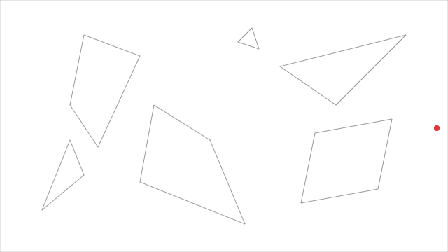
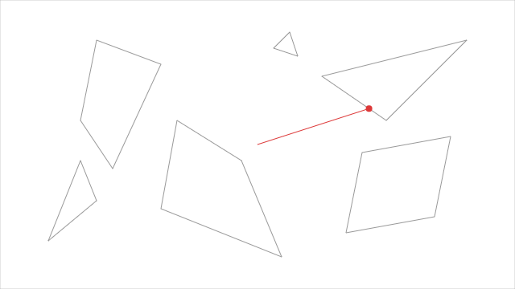
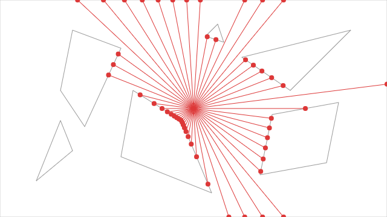
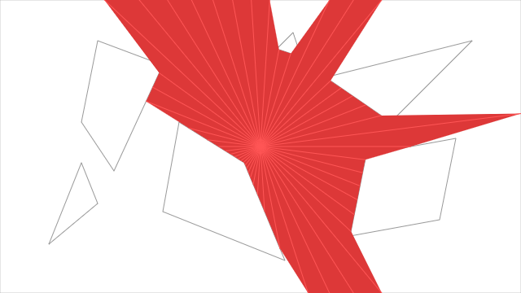
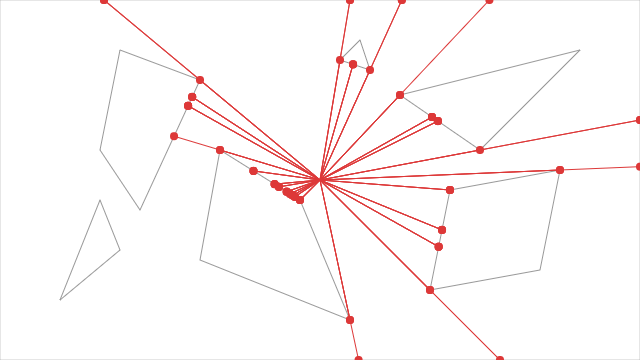
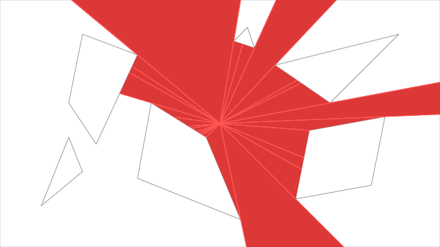
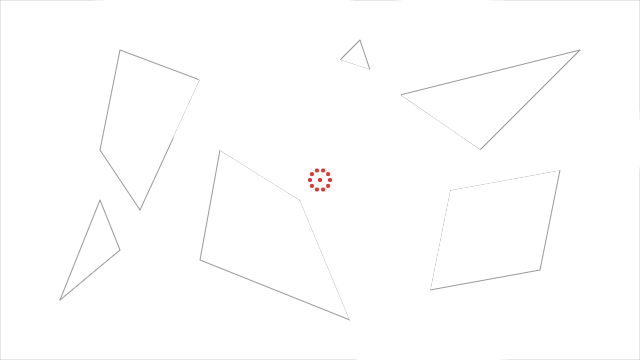
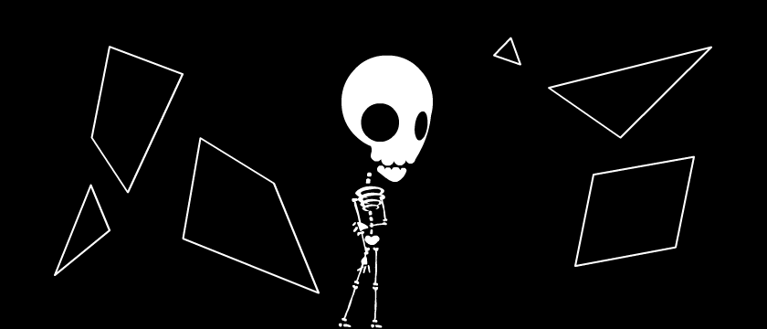
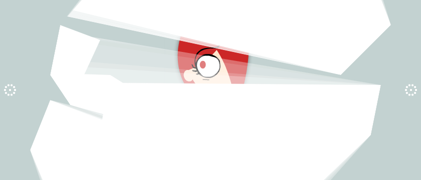

SIGHT & LIGHT - How to create 2D visibility/shadow effects for your game

Hello! Today, I will show you how to make something like this:
**(move your mouse around in the box below)**

This effect is used in my open-source indie game,[Nothing To Hide.](http://nothingtohide.cc/)It's also found in many other 2D games, like Monaco, Gish, and if this tutorial does its job... maybe *your* next game!

I will show the steps & mistakes I personally made while learning how to create this effect. First, some boilerplate code. The demo below just draws a bunch of line segments and tracks your mouse position. (note: there are four line segments for the box's border)

Next is the most math-y step. Don't worry, it'll be a refreshing refresher in algebra.

We need to find the closest intersection between the ray and all the line segments. Any line can be written in parametric form as:Point + Direction * T

This gives us 4 equations describing the x & y components of a ray & line segment:

Ray X = r_px+r_dx*T1
Ray Y = r_py+r_dy*T1
Segment X = s_px+s_dx*T2
Segment Y = s_py+s_dy*T2

NOTE: Before we do anything else, check to make sure that the Ray & Segment aren't parallel, that is, that the directions aren't the same. If they're parallel, there is no intersection. Alright, carry on.

If the ray & segment intersect, their X & Y components will be the same:
r_px+r_dx*T1 = s_px+s_dx*T2
r_py+r_dy*T1 = s_py+s_dy*T2
We do a little symbol-shifting dance to solve for T1 & T2...
// Isolate T1 for both equations, getting rid of T1
T1 = (s_px+s_dx*T2-r_px)/r_dx = (s_py+s_dy*T2-r_py)/r_dy

// Multiply both sides by r_dx * r_dy
s_px*r_dy + s_dx*T2*r_dy - r_px*r_dy = s_py*r_dx + s_dy*T2*r_dx - r_py*r_dx

// Solve for T2!
T2 = (r_dx*(s_py-r_py) + r_dy*(r_px-s_px))/(s_dx*r_dy - s_dy*r_dx)

// Plug the value of T2 to get T1
T1 = (s_px+s_dx*T2-r_px)/r_dx

Make sure that T1>0 and 0<T2<1. If they aren't, then the supposed intersection is not on the ray/segment, and there is no intersection after all. But if they are, great! You've found an intersect. Now just loop through all other line segments with the same ray, in order to find the closest intersection. (It will be the one with the lowest T1 value)

Here's what all that math looks like: **(move your mouse over the box)**

Whew! Now that that's over with, let's have some fun! I cast out 50 rays in all directions:

Then, I thought, I could just simply connect the dots, where rays intersect with line segments, and get a good visibility polygon. However, this is what it ended up looking like...

Darn. And it didn't matter even if I had 360 rays for 360 degrees, it still looked jittery. This was my biggest stumbling block, until I realized - I don't *have* to cast rays in all directions. I only need to cast them towards *the ends of each line segment*.

For each (unique) line segment end point, I cast a ray directly towards it, plus two more rays offset by +/- 0.00001 radians. The two extra rays are needed to hit the wall(s) behind any given segment corner.

Next, I sort the intersection points in order of their ray's angle. This lets me simply connect the dots clockwise, and draw a smooth visibility polygon like this:

Finally! Something that actually looks decent. By drawing extra visibility polygons, casting rays from a slightly offset position, I can create "fuzzy" shadows like the ones below. The red dots show each of the 11 origin points - yes, there are 11 visibility polygons!

And just to top it all off, I drew these two images...

...and blended them together, using the fuzzy shadows as an alpha mask. I already showed you the creepy result of that at the top of this page, so here is a different iteration, with *multiple* light sources.

Multiple light sources. Casting shadows. A giant laser bomb. Showing what your player/enemies can or can't see. The 2D visibility/lighting effect can be very flexible, and with the right creative touch, can add a lot of extra *oomph** to your game.

**LET THERE BE LIGHT**

* totally a real technical term

* * *

[Fork this on Github](https://github.com/ncase/sight-and-light)||[Share on Twitter](https://twitter.com/share?via=ncasenmare&url=http%3A%2F%2Fncase.github.io%2Fsight-and-light&text=Sight%20%26%20Light%20-%20How%20to%20create%202D%20visibility%2Fshadow%20effects%20for%20your%20game)||[Share on Facebook](https://www.facebook.com/sharer/sharer.php?u=http%3A%2F%2Fncase.github.io%2Fsight-and-light&t=Sight%20%26%20Light%20-%20How%20to%20create%202D%20visibility%2Fshadow%20effects%20for%20your%20game)||[Share on Reddit](http://www.reddit.com/submit?url=http%3A%2F%2Fncase.github.io%2Fsight-and-light&title=Sight%20%26%20Light%20-%20How%20to%20create%202D%20visibility%2Fshadow%20effects%20for%20your%20game)