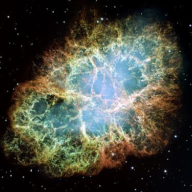
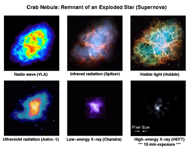
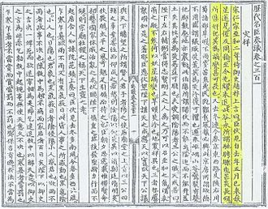
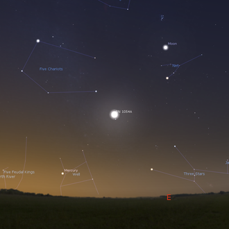
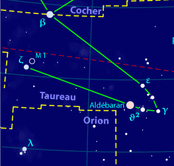
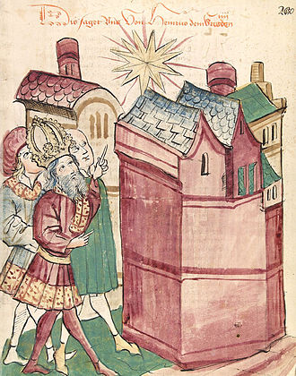
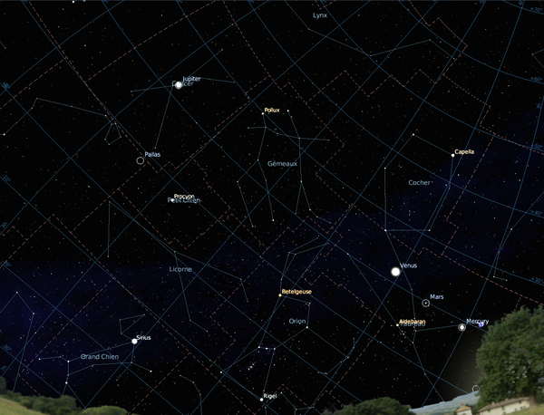
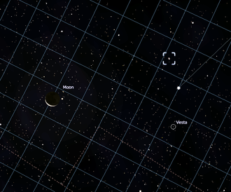
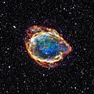

SN 1054 - Wikipedia

 [              Wiki Loves Love: Documenting festivals and celebrations of love on Commons.  Help Wikimedia and win prizes by sending photos.](https://commons.wikimedia.org/wiki/Special:MyLanguage/Commons:Wiki_Loves_Love_2019)

# SN 1054

From Wikipedia, the free encyclopedia

[Jump to navigation](https://en.wikipedia.org/wiki/SN_1054#mw-head)[Jump to search](https://en.wikipedia.org/wiki/SN_1054#p-search)

|     |
| --- |
|  Giant picture mosaic of the [Crab Nebula](https://en.wikipedia.org/wiki/Crab_Nebula), remnant of SN 1054, taken by the [Hubble Space Telescope](https://en.wikipedia.org/wiki/Hubble_Space_Telescope) in [visible light](https://en.wikipedia.org/wiki/Visible_light). Credit: [NASA](https://en.wikipedia.org/wiki/NASA)/[ESA](https://en.wikipedia.org/wiki/ESA). |
| Other designations | PSR B0531+21.9, SN 1054, PSR 0532, SN 1054A, PSR 0531, PSR B0532+21, 2MASS J05343194+2200521, PSR B0531+21, PSR J0534+2200, CSI+21-05315, PLX 1266, V* CM Tau |
| Event type | [Supernova](https://en.wikipedia.org/wiki/Supernova), [star](https://en.wikipedia.org/wiki/Star)  |
| [Spectral class](https://en.wikipedia.org/wiki/Spectral_class) | [Type II](https://en.wikipedia.org/wiki/Supernova#Type_II) |
| Date | [4 July](https://en.wikipedia.org/wiki/4_July)  [1054](https://en.wikipedia.org/wiki/1054) |
| [Constellation](https://en.wikipedia.org/wiki/Constellation) | [Taurus](https://en.wikipedia.org/wiki/Taurus_(constellation)) |
| [Right ascension](https://en.wikipedia.org/wiki/Right_ascension) | 5h 34.5m |
| [Declination](https://en.wikipedia.org/wiki/Declination) | +22° 01' |
| [Epoch](https://en.wikipedia.org/wiki/Epoch_(astronomy)) | ?   |
| [Galactic coordinates](https://en.wikipedia.org/wiki/Galactic_coordinate_system) | G.184.6–5.8 |
| Distance | 6.5 [kly](https://en.wikipedia.org/wiki/Light-year#Definitions) (2.0 [kpc](https://en.wikipedia.org/wiki/Parsec#Parsecs_and_kiloparsecs)) |
| Remnant | [Nebula](https://en.wikipedia.org/wiki/Nebula) |
| Host | [Milky Way](https://en.wikipedia.org/wiki/Milky_Way) |
| Progenitor | Unknown |
| Progenitor type | Unknown |
| [Colour](https://en.wikipedia.org/wiki/B-V_colour)  (B-V) | Unknown |
| Peak [apparent magnitude](https://en.wikipedia.org/wiki/Apparent_magnitude) | −6[[1]](https://en.wikipedia.org/wiki/SN_1054#cite_note-SEDS-SN1054-1) |
| Preceded by | [SN 1006](https://en.wikipedia.org/wiki/SN_1006) |
| Followed by | [SN 1181](https://en.wikipedia.org/wiki/SN_1181) |
|   [Related media on Wikimedia Commons](https://commons.wikimedia.org/wiki/Category:SN_1054) |
| [[edit on Wikidata](https://www.wikidata.org/wiki/Q32037)] |

**SN 1054** is a [supernova](https://en.wikipedia.org/wiki/Supernova) that was first observed on [4 July](https://en.wikipedia.org/wiki/4_July)  [1054](https://en.wikipedia.org/wiki/1054), and remained visible for around two years. The event was recorded in contemporary [Chinese astronomy](https://en.wikipedia.org/wiki/Chinese_astronomy), and references to it are also found in a later (13th-century) Japanese document, and in a document from the [Arab world](https://en.wikipedia.org/wiki/Arab_world). Furthermore, there are a number of proposed, but doubtful, references from European sources recorded in the 15th century, and perhaps a pictograph associated with the [Ancestral Puebloan](https://en.wikipedia.org/wiki/Ancestral_Puebloan) culture found near the [Peñasco Blanco](https://en.wikipedia.org/wiki/Pe%C3%B1asco_Blanco) site in New Mexico.

The [remnant](https://en.wikipedia.org/wiki/Supernova_remnant) of SN 1054, which consists of debris ejected during the explosion, is known as the [Crab Nebula](https://en.wikipedia.org/wiki/Crab_Nebula). It is located in the sky near the star [Zeta Tauri](https://en.wikipedia.org/wiki/Zeta_Tauri) (ζ Tauri). The core of the exploding star formed a [pulsar](https://en.wikipedia.org/wiki/Pulsar), called the [Crab Pulsar](https://en.wikipedia.org/wiki/Crab_Pulsar) (or PSR B0531+21). The nebula and the pulsar that it contains are some of the most studied astronomical objects outside the [Solar System](https://en.wikipedia.org/wiki/Solar_System). It is one of the few [Galactic](https://en.wikipedia.org/wiki/Milky_Way) supernovae where the date of the explosion is well known. The two objects are the most luminous in their respective categories. For these reasons, and because of the important role it has repeatedly played in the modern era, SN 1054 is the best known supernova in the history of [astronomy](https://en.wikipedia.org/wiki/Astronomy).

The Crab Nebula is easily observed by amateur astronomers thanks to its brightness, and was also catalogued early on by professional astronomers, long before its true nature was understood and identified. When the French astronomer [Charles Messier](https://en.wikipedia.org/wiki/Charles_Messier) watched for the return of [Halley's Comet](https://en.wikipedia.org/wiki/Halley%27s_Comet) in 1758, he confused the nebula for the comet, as he was unaware of the former's existence. Motivated by this error, he created his catalogue of non-cometary nebulous objects, the [Messier Catalogue](https://en.wikipedia.org/wiki/Messier_Catalogue), to avoid such mistakes in the future. The nebula is catalogued as the first Messier object, or [M1](https://en.wikipedia.org/wiki/Crab_Nebula).

## Contents

[hide]

- [1  Identification of the supernova](https://en.wikipedia.org/wiki/SN_1054#Identification_of_the_supernova)
- [2  Historical records](https://en.wikipedia.org/wiki/SN_1054#Historical_records)
    - [2.1  Chinese astronomy](https://en.wikipedia.org/wiki/SN_1054#Chinese_astronomy)
        - [2.1.1  Sources](https://en.wikipedia.org/wiki/SN_1054#Sources)
        - [2.1.2  Identity of *Tianguan*](https://en.wikipedia.org/wiki/SN_1054#Identity_of_Tianguan)
        - [2.1.3  Position relative to Tianguan](https://en.wikipedia.org/wiki/SN_1054#Position_relative_to_Tianguan)
            - [2.1.3.1  Meaning of units](https://en.wikipedia.org/wiki/SN_1054#Meaning_of_units)
            - [2.1.3.2  Problems with description](https://en.wikipedia.org/wiki/SN_1054#Problems_with_description)
    - [2.2  Meigetsuki (Japan)](https://en.wikipedia.org/wiki/SN_1054#Meigetsuki_(Japan))
    - [2.3  Ibn Butlan (Iraq)](https://en.wikipedia.org/wiki/SN_1054#Ibn_Butlan_(Iraq))
    - [2.4  Suggested European sightings](https://en.wikipedia.org/wiki/SN_1054#Suggested_European_sightings)
        - [2.4.1  The *Cronaca Rampona*](https://en.wikipedia.org/wiki/SN_1054#The_Cronaca_Rampona)
        - [2.4.2  Hayton of Corycus](https://en.wikipedia.org/wiki/SN_1054#Hayton_of_Corycus)
        - [2.4.3  Other](https://en.wikipedia.org/wiki/SN_1054#Other)
    - [2.5  Suggested records in North American petroglyphs](https://en.wikipedia.org/wiki/SN_1054#Suggested_records_in_North_American_petroglyphs)
    - [2.6  Suggested records in Aboriginal oral tradition](https://en.wikipedia.org/wiki/SN_1054#Suggested_records_in_Aboriginal_oral_tradition)
- [3  Media references](https://en.wikipedia.org/wiki/SN_1054#Media_references)
- [4  References](https://en.wikipedia.org/wiki/SN_1054#References)
- [5  External links](https://en.wikipedia.org/wiki/SN_1054#External_links)

## Identification of the supernova[[edit](https://en.wikipedia.org/w/index.php?title=SN_1054&action=edit&section=1)]

Further information: [Crab Nebula § Modern astronomy](https://en.wikipedia.org/wiki/Crab_Nebula#Modern_astronomy)

The [Crab Nebula](https://en.wikipedia.org/wiki/Crab_Nebula) was identified as the [supernova remnant](https://en.wikipedia.org/wiki/Supernova_remnant) of SN 1054 between 1921 and 1942, at first speculatively (1920s), with some plausibility by 1939, and beyond reasonable doubt by [Jan Oort](https://en.wikipedia.org/wiki/Jan_Oort) in 1942.

In 1921, [Carl Otto Lampland](https://en.wikipedia.org/wiki/Carl_Lampland) was the first to announce that he had seen changes in the structure of the Crab Nebula.[[2]](https://en.wikipedia.org/wiki/SN_1054#cite_note-2) This announcement occurred at a time when the nature of the nebulas in the sky was completely unknown. Their nature, size and distance were subject to debate. Observing changes in such objects allows astronomers to determine whether their spatial extension is "small" or "large", in the sense that notable fluctuations to an object as vast as our [Milky Way](https://en.wikipedia.org/wiki/Milky_Way) cannot be seen over a small time period, such as a few years, whereas such substantial changes are possible if the size of the object does not exceed a diameter of a few light-years. Lampland's comments were confirmed some weeks later by [John Charles Duncan](https://en.wikipedia.org/w/index.php?title=John_Charles_Duncan&action=edit&redlink=1), an astronomer at the [Mount Wilson Observatory](https://en.wikipedia.org/wiki/Mount_Wilson_Observatory). He benefited from photographic material obtained with equipment and emulsions that had not changed since 1909; as a result the comparison with older snapshots was easy and emphasized a general expansion of the cloud. The points were moving away from the centre, and did so faster as they got further from it.[[3]](https://en.wikipedia.org/wiki/SN_1054#cite_note-3)

Also in 1921, [Knut Lundmark](https://en.wikipedia.org/wiki/Knut_Lundmark) compiled the data for the "guest stars" mentioned in the Chinese chronicles known in the West.[[4]](https://en.wikipedia.org/wiki/SN_1054#cite_note-4) He based this on older works, having analysed various sources such as the *[Wenxian Tongkao](https://en.wikipedia.org/wiki/Wenxian_Tongkao)*, studied for the first time from an astronomical perspective by [Jean-Baptiste Biot](https://en.wikipedia.org/wiki/Jean-Baptiste_Biot) in the middle of the 19th century. Lundmark gives a list of 60 *suspected novae*, then the generic term for a stellar explosion, in fact covering what is now understood as two distinct phenomena, [novae](https://en.wikipedia.org/wiki/Nova) and supernovae. The *nova* of 1054, already mentioned by the Biots in 1843,[[5]](https://en.wikipedia.org/wiki/SN_1054#cite_note-biot-5) is part of the list. It stipulates the location of this guest star in a note at the bottom of the page as being "close to NGC 1952", one of the names for the Crab Nebula, but it does not seem to create an explicit link between them.

In 1928, [Edwin Hubble](https://en.wikipedia.org/wiki/Edwin_Hubble) was the first to note that the changing aspect of the Crab Nebula, which was growing bigger in size, suggests that it is the remains of a stellar explosion. He realised that the apparent speed of change in its size signifies that the explosion which it comes from occurred only nine centuries ago, which puts the date of the explosion in the period covered by Lundmark's compilation. He also noted that the only possible nova in the region of the Taurus constellation (where the cloud is located) is that of 1054, whose age is estimated to correspond to an explosion dating from the start of the second millennium.

Hubble therefore deduced, correctly, that this cloud was the remains of the explosion which was observed by Chinese astronomers.[[6]](https://en.wikipedia.org/wiki/SN_1054#cite_note-6)

Hubble's comment remained relatively unknown as the physical phenomenon of the explosion was not known at the time. Eleven years later, when the fact that supernovae are very bright phenomena was highlighted by [Walter Baade](https://en.wikipedia.org/wiki/Walter_Baade) and [Fritz Zwicky](https://en.wikipedia.org/wiki/Fritz_Zwicky)[[7]](https://en.wikipedia.org/wiki/SN_1054#cite_note-7) and when their nature was suggested by Zwicky,[[8]](https://en.wikipedia.org/wiki/SN_1054#cite_note-8)  [Nicholas Mayall](https://en.wikipedia.org/wiki/Nicholas_Mayall) proposed that the star of 1054 was actually a supernova,[[9]](https://en.wikipedia.org/wiki/SN_1054#cite_note-9) based on the speed of expansion of the cloud, measured by spectroscopy, which allows astronomers to determine its physical size and distance, which he estimated at 5000 [light-years](https://en.wikipedia.org/wiki/Light-year). This was under the assumption that the velocities of expansion along the line of sight and perpendicularly to it were identical.[[10]](https://en.wikipedia.org/wiki/SN_1054#cite_note-10) Based on the reference to the brightness of the star which featured in the first documents discovered in 1934, he deduced that it was a supernova rather than a nova.

This deduction was subsequently refined, which pushed Mayall and [Jan Oort](https://en.wikipedia.org/wiki/Jan_Oort) in 1942 to analyse historic accounts relating to the guest star more closely (see [§ Historical records](https://en.wikipedia.org/wiki/SN_1054#Historical_records) below). These new accounts, globally and mutually concordant, confirm the initial conclusions by Mayall and Oort in 1939 and the identification of the guest star of 1054 is established beyond all reasonable doubt. Most other historical supernovas are not confirmed so conclusively: supernovas of the first millennium ([SN 185](https://en.wikipedia.org/wiki/SN_185), [SN 386](https://en.wikipedia.org/wiki/SN_386) and [SN 393](https://en.wikipedia.org/wiki/SN_393)) are established on the basis of a single document each, and so they cannot be confirmed; in relation to the supposed historical supernova which followed the one in 1054, [SN 1181](https://en.wikipedia.org/wiki/SN_1181), there are legitimate doubts concerning the proposed remnant ([3C58](https://en.wikipedia.org/wiki/3C_58)) and an object of less than 1000 years of age. Other historical supernovae of which there are written accounts which precede the invention of the [telescope](https://en.wikipedia.org/wiki/Telescope) ([SN 1006](https://en.wikipedia.org/wiki/SN_1006), [SN 1572](https://en.wikipedia.org/wiki/SN_1572) and [SN 1604](https://en.wikipedia.org/wiki/SN_1604)) are however established with certitude. Telescope-era supernovae are of course associated with their remnant, when one is observed, with full certitude, but none is known within the [Milky Way](https://en.wikipedia.org/wiki/Milky_Way).

## Historical records[[edit](https://en.wikipedia.org/w/index.php?title=SN_1054&action=edit&section=2)]

[(L)](https://en.wikipedia.org/wiki/File:800crab.png)

The [Crab Nebula](https://en.wikipedia.org/wiki/Crab_Nebula) is a remnant of an exploded star. This is the Crab Nebula in various energy bands, including a hard X-ray image from the HEFT data taken during its 2005 observation run. Each image is 6′ wide.

_in_the_Lidai_mingchen_zouyi_(%E5%8E%86%E4%BB%A3%E5%90%8D%E8%87%A3%E5%A5%8F%E8%AE%AE).jpg)

[(L)](https://en.wikipedia.org/wiki/File:Chinese_report_of_guest_star_identified_as_the_supernova_of_1054_(SN_1054)_in_the_Lidai_mingchen_zouyi_(%E5%8E%86%E4%BB%A3%E5%90%8D%E8%87%A3%E5%A5%8F%E8%AE%AE).jpg)

The [guest star](https://en.wikipedia.org/wiki/Guest_star_(astronomy)) reported by Chinese astronomers in 1054 is identified as SN 1054. The highlighted passages refer to the supernova.

SN 1054 is one of eight [supernovae](https://en.wikipedia.org/wiki/Supernovae) in the [Milky Way](https://en.wikipedia.org/wiki/Milky_Way) that can be identified because written testimony describing the explosion has survived. In the nineteenth century, astronomers began to take an interest in the historic records. They compiled and examined the records as part of their research on recent [novae](https://en.wikipedia.org/wiki/Nova), comets, and later, the supernovae.

The first people to attempt a systematic compilation of records from China were the father and son Biot. In 1843, the [sinologist](https://en.wikipedia.org/wiki/Sinologist)  [Édouard Biot](https://en.wikipedia.org/wiki/%C3%89douard_Biot) translated for his father, the astronomer [Jean-Baptiste Biot](https://en.wikipedia.org/wiki/Jean-Baptiste_Biot), passages from the astronomical treatise of the 348-volume Chinese encyclopaedia, the *[Wenxian Tongkao](https://en.wikipedia.org/wiki/Wenxian_Tongkao)*.

Almost 80 years later, in 1921, [Knut Lundmark](https://en.wikipedia.org/wiki/Knut_Lundmark) undertook a similar effort based on a greater number of sources. In 1942, [Jan Oort](https://en.wikipedia.org/wiki/Jan_Oort), convinced that the Crab Nebula was the "guest star" of 1054 described by the Chinese, asked sinologist [J.J.L. Duyvendak](https://en.wikipedia.org/wiki/J.J.L._Duyvendak) to help him compile new evidence on the observation of the event.

### Chinese astronomy[[edit](https://en.wikipedia.org/w/index.php?title=SN_1054&action=edit&section=3)]

[(L)](https://en.wikipedia.org/wiki/File:SN_1054_4th_Jul_1054_043000_UTC%2B0800_Kaifeng.png)

Simulated image of supernova SN 1054 at the position of modern Crab Nebula, as presumably would have been observed from capital of [Song Dynasty](https://en.wikipedia.org/wiki/Song_Dynasty) at Kaifeng, China during the morning of July 4th, 1054.

Stars that appeared temporarily in the sky were generically called "[guest stars](https://en.wikipedia.org/wiki/Guest_star_(astronomy))" (*kè xīng* 客星) by Chinese astronomers. The guest star of 1054 occurred during the reign of the [Emperor Renzong](https://en.wikipedia.org/wiki/Emperor_Renzong_of_Song) of the [Song dynasty](https://en.wikipedia.org/wiki/Song_dynasty) (960–1279). The relevant year is recorded in Chinese documents as "the first year of the Zhihe era". *Zhihe* was an [era name](https://en.wikipedia.org/wiki/Chinese_era_name) used during the reign of Emperor Renzong, and corresponds to the years 1054–1056 C.E., so the first year of the Zhihe era corresponds to the year 1054 C.E.

Some of the Chinese accounts are well preserved and detailed. The oldest and most detailed accounts are from *[Song Huiyao](https://en.wikipedia.org/wiki/Song_Huiyao)* and *[Song Shi](https://en.wikipedia.org/wiki/History_of_Song)*, historiographical works of which the extant text was redacted perhaps within a few decades of the event. There are also some later records, redacted in the 13th century, which are not necessarily independent of the older ones. Three accounts are apparently related because they describe the angular distance from the guest star to Zeta Tauri as "perhaps several inches away", but they are in apparent disagreement about the date of appearance of the star. The older two mention the day *jichou* 己丑, but the third, the Xu Zizhi Tongjian Changbian, the day *yichou* 乙丑. These terms refer to the Chinese [sexagenary cycle](https://en.wikipedia.org/wiki/Sexagenary_cycle), corresponding to numbers 26 and 2 of the cycle, which corresponds, in the context where they are cited, respectively, to 4 July and 10 June. As the redaction of the third source is of considerably later date (1280) and the two characters are similar, this is easily explained as a transcription error, the historical date being *jichou* 己丑, 4 July.

The description of the guest star's location as "to the south-east of Tianguan, perhaps several inches away" has perplexed modern astronomers, because the Crab Nebula is not situated in the south-east, but to the north-west of Zeta Tauri.

The duration of visibility is explicitly mentioned in chapter 12 of *Song Shi*, and slightly less accurately, in the *Song Huiyao*. The last sighting was on 6 April 1056, after a total period of visibility of 642 days. This duration is supported by the *Song Shi*. According to the *Song Huiyao* the visibility of the guest star was for only 23 days, but this is after mentioning visibility during daylight. This period of 23 days applies in all likelihood solely to visibility during the day.

#### Sources[[edit](https://en.wikipedia.org/w/index.php?title=SN_1054&action=edit&section=4)]

The *Song Huiyao* (literally "Collected important documents of the Song dynasty") covers the period 960–1220. *Huiyao* is a traditional form of history books in China which aimed mainly to preserve [primary sources](https://en.wikipedia.org/wiki/Primary_source), and as such are important sources supplementing the official *[Twenty-Four Histories](https://en.wikipedia.org/wiki/Twenty-Four_Histories)*. The Song dynasty had a specific government department dedicated to compiling the *Huiyao*, and some 2,200 volumes were published in ten batches during the Song dynasty. However, most of these documents were lost by the time of the [Qing Dynasty](https://en.wikipedia.org/wiki/Qing_Dynasty) except for the synopsis and a relatively small portion preserved as part of the imperial *[Yongle Encyclopedia](https://en.wikipedia.org/wiki/Yongle_Encyclopedia)*. In 1809, the portion preserved in the *Yongle Encyclopedia* was extracted and re-published as the *Song Huiyao Jigao* (the "draft extract of the *Song Huiyao*"). Subsequent scholars have worked on the project further and the current edition dates from 1936.

This document recounts the observation of the guest star, focusing on the astrological aspect but also giving important information on the visibility of the star, by day and by night.

>  Zhihe era, first year, seventh lunar month, 22nd day. [...] Yang Weide declared: "I humbly observe that a guest star has appeared; above the star there is a feeble yellow glimmer. If one examines the divination regarding the Emperor, the interpretation [of the presence of this guest star] is the following: The fact that the star has not overrun > [> Bi](https://en.wikipedia.org/wiki/Net_(Chinese_constellation))>  and that its brightness must represent a person of great value. I demand that the Office of Historiography is informed of this." All officials congratulated the Emperor, who ordered his congratulations be [back] forwarded to the Office of Historiography. First year of the era of Jiayou, third lunar month, the director of the Astronomical Office said "The guest star has disappeared, which means the departure of the host [that it represents]." Previously, during the first year of the Zhihe era, during the fifth lunar month, it had appeared at dawn, in the direction of the east, under the watch of *> [> Tiānguān](https://en.wikipedia.org/wiki/Tianguan)*>  (天關, Zeta Tauri). It had been seen in daylight, like Venus. It had rays stemming in all directions, and its colour was reddish white. Altogether visible for 23 days.

The *Song Shi* is the official annals of the Song dynasty. Chapter 12 mentions the guest star, not its appearance but rather the moment of its disappearance. The corresponding entry dated 6 April 1056 indicates:

>  Jiayou era, first year, third lunar month, > [> xinwei](https://en.wikipedia.org/wiki/Xinwei)>  day, the director of the Office of Astronomy reported during the fifth lunar month of the first year of the Zhihe era, a guest star had appeared at dawn, in the direction of the east, under the watch of Tianguan. Now it has disappeared.

In chapter 56 ("Astronomical treaty") of the same document, the guest star is again mentioned in a chapter dedicated to this type of phenomenon, this time focusing on its appearance,

> Zhihe era of the reign, first year, fifth lunar month, > [> jichou](https://en.wikipedia.org/wiki/Jichou)>  day. A guest star has appeared to the south-east of Tianguan, perhaps several inches away. After a year or more, it gradually disappeared.

The *[Xu Zizhi Tongjian Changbian](https://en.wikipedia.org/wiki/Xu_Zizhi_Tongjian_Changbian)* ("Long compilation of the continuation of the *[Zizhi Tongjian](https://en.wikipedia.org/wiki/Zizhi_Tongjian)*"), a book covering the period of 960–1126 and written 40 years or so later by [Li Tao](https://en.wikipedia.org/wiki/Li_Tao_(historian)) (1114–1183), contains the oldest Chinese testimonies relating to the observation of the star. It was rediscovered in 1970 by the specialist in Chinese civilisations [Ho Peng Yoke](https://en.wikipedia.org/w/index.php?title=Ho_Peng_Yoke&action=edit&redlink=1) and collaborators.[*[citation needed](https://en.wikipedia.org/wiki/Wikipedia:Citation_needed)*]It is relatively imprecise in the case of the explosion of SN 1054. A loose translation of what was stated:

> First year of the Zhihe era, fifth lunar month, *> [> ji-chou](https://en.wikipedia.org/wiki/Sexagenary_cycle)*>  day. A guest star has appeared to the south-east of *> Tianguan*> , perhaps several inches away [of this star]. (The star disappeared in the third lunar month of the first year of the Jiayou era.)

There is an account of the star from the [Liao Dynasty](https://en.wikipedia.org/wiki/Liao_Dynasty), which ruled in the area around [northeast China](https://en.wikipedia.org/wiki/Northeast_China) from 907–1125. The book in question, the *[Qidan Guo Zhi](https://en.wikipedia.org/wiki/Qidan_Guo_Zhi)*, was compiled by [Ye Longli](https://en.wikipedia.org/w/index.php?title=Ye_Longli&action=edit&redlink=1) in 1247. It includes various astronomical notes, some of which are clearly copied from the *Song Shi*. This entry referring to the star of 1054 seems unique:[*[citation needed](https://en.wikipedia.org/wiki/Wikipedia:Citation_needed)*]

> Chongxi era of the reign of [King > [> Xingzong](https://en.wikipedia.org/wiki/Xingzong)> ], twenty-third year eighth lunar moon, the ruler of the realm is dead. It happened before a solar eclipse at noon, and a guest star appeared. The highest office at the Office of History, > [> Liu Yishou](https://en.wikipedia.org/w/index.php?title=Liu_Yishou&action=edit&redlink=1)>  had said "These are omens of the death of the King." This prediction has been realised.

The account of *Qidan Guo Zhi* alluded to the notable astronomical events that preceded the death of King Xingzong. Various historical documents allow us to establish the date of death of the Emperor [Xingzong](https://en.wikipedia.org/wiki/Xingzong) as 28 August 1055, during the eighth lunar month of the twenty-fourth (and not twenty-third) year of his reign. The dates of the two astronomical events mentioned (the eclipse and the appearance of the guest star) are not specified, but were probably before the obituary (2 or 3 years at most). Two solar eclipses were visible shortly before that date in the Khitan kingdom, on 13 November 1053 and 10 May 1054. Of these, only one occurred around noon, that of 13 November; it seems likely that this is what the document mentions. As for the guest star, only a rough estimate of location is given, corresponding to the moon mansion Mao. This mansion is situated just east of where the star appeared, as mentioned in the other testimonies. Since no other known significant astronomical event occurred in this region of the sky during the two years that preceded the death of Xingzong, it seems likely that the text is actually referring to the star of 1054.

The *Wenxian Tongkao* is the first East Asian source that came to the attention of Western astronomers; it was translated by Édouard Biot in 1843. This source, compiled by [Ma Duanlin](https://en.wikipedia.org/wiki/Ma_Duanlin) in 1280, is relatively brief. The text is very close to that of the *Song Shi*:

>  Zhihe era of the reign, first year, fifth lunar month, *> [> ji-chou](https://en.wikipedia.org/wiki/Sexagenary_cycle)*>  day. A > [> guest star](https://en.wikipedia.org/wiki/Guest_star_(astronomy))>  has appeared to the south-east of *> Tiānguān*> , perhaps several inches away. After a year or more, it gradually disappeared.

#### Identity of *Tianguan*[[edit](https://en.wikipedia.org/w/index.php?title=SN_1054&action=edit&section=5)]

Further information: [Zeta Tauri](https://en.wikipedia.org/wiki/Zeta_Tauri)

The [asterisms](https://en.wikipedia.org/wiki/Asterism_(astronomy)) (or "constellations") of Chinese astronomy were catalogued around the 2nd century BC. The asterisms with the brightest stars in the sky were compiled in a work called *[Shi Shi](https://en.wikipedia.org/wiki/Shi_Shen#Books)*, which also includes *Tianguan*. Identification of *Tianguan* is comparatively easy, as it is indicated that it is located at the foot of the [Five Chariots](https://en.wikipedia.org/wiki/Five_Chariots) asterism, the nature of which is left in hardly any doubt by representation on maps of the Chinese sky: it consists of a large pentagon containing the bright stars of the [Auriga](https://en.wikipedia.org/wiki/Auriga_(constellation)). As *Tianguan* is also represented to the north of the [Three Stars](https://en.wikipedia.org/wiki/Three_Stars_(Chinese_constellation)) asterism, the composition of which is well known, corresponding to the bright stars of [Orion](https://en.wikipedia.org/wiki/Orion_(constellation)), its possible localisation is strongly restricted to the immediate proximity of the star [ζ Tauri](https://en.wikipedia.org/wiki/Zeta_Tauri), located between "Five Chariots" and "Three Stars". This star, of medium brightness ([apparent magnitude](https://en.wikipedia.org/wiki/Apparent_magnitude) of 3.3), is the only star of its level of brightness in this area of the sky (there is no other star that is brighter than an apparent magnitude of 4.5 within 7 degrees of ζ Tauri), and therefore the only one likely to figure among the asterisms of "Shi Shi". All of these elements, along with some others, allow "Tianguan" to be confirmed beyond reasonable doubt as corresponding to the star ζ Tauri.

[(L)](https://en.wikipedia.org/wiki/File:Zeta_tauri_Beta_Tauri_and_M1.png)

Northeast region of the Taurus constellation, with ζ and β Tauri stars and the location of the supernova of 1054 between them (M1).

#### Position relative to Tianguan[[edit](https://en.wikipedia.org/w/index.php?title=SN_1054&action=edit&section=6)]

|     |     |
| --- | --- |
|  | This section **does not [cite](https://en.wikipedia.org/wiki/Wikipedia:Citing_sources) any [sources](https://en.wikipedia.org/wiki/Wikipedia:Verifiability)**. Please help [improve this section](https://en.wikipedia.org/w/index.php?title=SN_1054&action=edit) by [adding citations to reliable sources](https://en.wikipedia.org/wiki/Help:Introduction_to_referencing_with_Wiki_Markup/1). Unsourced material may be challenged and [removed](https://en.wikipedia.org/wiki/Wikipedia:Verifiability#Burden_of_evidence).  *(July 2018)** ([Learn how and when to remove this template message](https://en.wikipedia.org/wiki/Help:Maintenance_template_removal))* |

Three Chinese documents indicate that the guest star was located "perhaps a few inches" South-East of *Tianguan*. *Song Shi* and *Song Huiyao* stipulate that it "was standing guard" for the asterism, corresponding to the star ζ Tauri. The "South-East" orientation has a simple astronomical meaning, the celestial sphere having, like the Earth's globe, both north and south [celestial poles](https://en.wikipedia.org/wiki/Celestial_pole), the "South-East" direction thus corresponding to a "bottom-left" location in relation to the reference object (in this case, the star ζ Tauri) when it appears at the South. However, this "South-East" direction has long left modern astronomers[*[who?](https://en.wikipedia.org/wiki/Wikipedia:Manual_of_Style/Words_to_watch#Unsupported_attributions)*] perplexed in the context of this event: the logical remnant of the supernova corresponding to the guest star is the [Crab Nebula](https://en.wikipedia.org/wiki/Crab_Nebula), but it is not situated to the southeast of ζ Tauri, rather in the opposite direction, to the northwest.

The term "perhaps a few inches" (*ke shu cun* in the Latin transliteration) is relatively uncommon in Chinese astronomical documents. The first term, *ke*, is translated as "approximately" or "perhaps", the latter being currently preferred. The second term, *shu*, means "several", and more specifically any number between 3 and 9 (limits included). Finally, *[cun](https://en.wikipedia.org/wiki/Cun_(unit))* resembles a unit of measurement for angles translated by the term "inch". It is part of a group of three angular units, *zhang* (also written *chang*), *chi* ("foot") and *cun* ("inch"). Different astronomical documents indicate without much possible discussion that a *zhang* corresponds to ten *chi*, and that one *chi* corresponds to ten *cun*. The angular units are not the ones used to determine stars' coordinates, which are given in terms of *du*, an angular unit corresponding to the average angular distance travelled by the sun per day, which corresponds to around 360/365.25 degrees, in other words almost one degree. The use of different angular units can be surprising, but it is similar to the current situation in modern astronomy, where the angular unit used to measure angular distances between two points is certainly the same as for [declination](https://en.wikipedia.org/wiki/Declination) (the degree), but is different for [right ascension](https://en.wikipedia.org/wiki/Right_ascension) (which is expressed in angular hours; an angular hour corresponds to exactly 15 degrees. In Chinese astronomy, right ascension and declination have the same unit, which is not the one used for other angular distances. The reason for this choice to use different units in the Chinese world is not well known.

##### Meaning of units[[edit](https://en.wikipedia.org/w/index.php?title=SN_1054&action=edit&section=7)]

However, the exact value of these new units (*zhang*, *chi* and *cun*) was never stipulated, but can be deduced by the context in which they are used. For example, the spectacular passing of [Halley's comet](https://en.wikipedia.org/wiki/Halley%27s_comet) in 837 indicates that the tail of the comet measured 8 *zhang*. Even if it is not possible to know the angular size of the comet at the time it passed, it is certain that 8 *zhang* correspond to 180 degrees at the most (maximum visible angle on the celestial sphere), which means that one *zhang* can hardly exceed 20 degrees, and therefore one *cun* cannot exceed 0.2 degrees. A more rigorous estimation was made from 1972 on the basis of references of minimal separations expressed in *chi* or *cun* between two stars in the case of various conjunctions.[[11]](https://en.wikipedia.org/wiki/SN_1054#cite_note-11)The results suggest that one *cun* is between 0.1 and 0.2 degrees and that one *chi* is between 0.44 and 2.8 degrees, a range which is compatible with the estimations for one *cun*. A more solid estimation error is that it is generally accepted that one *chi* is in the order of one degree (or one *du*), and that one *cun* is in the order of one tenth of a degree. The expression “perhaps a few inches” therefore suggests an angular distance in the order of one degree or less.

##### Problems with description[[edit](https://en.wikipedia.org/w/index.php?title=SN_1054&action=edit&section=8)]

If all the available elements strongly suggest that the star of 1054 was a supernova, and that in the area next to where the star was seen, there is a remnant of a supernova which has all of the characteristics expected of an object that is around 1000 years old, a major problem arises: the new star is described as being to the South-East of *Tianguan*, while the Crab Nebula is to the North-East. This problem has been known since the 1940s and has long been unsolved. In 1972 for example, Ho Peng Yoke and his colleagues suggested that the Crab Nebula was not the product of the explosion of 1054, but that the true remnant was to the South-East, as indicated in several Chinese sources. For this, they envisaged that the angular unit *cun* corresponds to a considerable angle of 1 or 2 degrees, meaning that the distance from the remnant to ζ Tauri was therefore considerable. Aside from the fact that this theory does not account for the large angular sizes of certain comets, expressed in *zhang*, it comes up against the fact that there it does not make sense to measure the gap between a guest star and a star located so far away from it, when there are closer asterisms that could be used.

In their controversial article (see above) Collins and his colleagues make another suggestion:[[12]](https://en.wikipedia.org/wiki/SN_1054#cite_note-:0-12) on the morning of 4 July, the star ζ Tauri was not bright enough and too low on the horizon to be visible. If the guest star, which was located close to it, was visible, it is only because its brightness was comparable to Venus. However, there was another star, brighter and higher on the horizon, which was possibly visible, for reference: [Beta Tauri](https://en.wikipedia.org/wiki/Beta_Tauri) (β Tauri). This star is located at around 8 degrees north-north-west of ζ Tauri. The Crab Nebula is south-south-east of β Tauri. *Collins et al.* suggest therefore that at the time of its discovery, the star was seen to the south-east of β Tauri, and that as the days passed and visibility improved, astronomers were able to see that it was in fact a lot closer to ζ Tauri, but that the direction "south-east" used for the first star was kept in error.

The solution to this problem was suggested (without proof) by A. Breen and D. McCarthy in 1995.[[13]](https://en.wikipedia.org/wiki/SN_1054#cite_note-:1-13) and proved very convincingly by D. A. Green et F. R. Stephenson (2003) The term "stand on guard" obviously signifies a proximity between the two stars, but also means a general orientation: a guest star "standing on guard" for a fixed star is systematically located below it. In order to support this theory, Green and Stephenson investigated other entries in *Song Shi*, which also includes reference to "standing on guard". They selected entries relating to conjunctions betweens the stars identified and planets, of which the trajectory can be calculated without difficulty and with great precision on the indicated dates. Of the 18 conjunctions analysed, spreading from 1172 (the [Jupiter](https://en.wikipedia.org/wiki/Jupiter)–[Regulus](https://en.wikipedia.org/wiki/Regulus) conjunction on 5 December) to 1245 (the [Saturn](https://en.wikipedia.org/wiki/Saturn)–[Gamma Virginis](https://en.wikipedia.org/wiki/Gamma_Virginis) conjunction on 17 May), the planet was more to the north (in the sense of a lower declination) in 15 cases, and in the three remaining cases, it was never in the south quadrant of the star.

In addition, Stephenson and Clark (1977) had already highlighted such an inversion of direction in a planetary conjunction: on 13 September 1253, an entry in the astronomical report *[Koryo-sa](https://en.wikipedia.org/wiki/Koryo-sa)* indicated that [Mars](https://en.wikipedia.org/wiki/Mars) had hidden the star to the south-east of the twenty-eight mansions sign *[Ghost (Chinese constellation)](https://en.wikipedia.org/wiki/Ghost_(Chinese_constellation))* ([Delta Cancri](https://en.wikipedia.org/wiki/Delta_Cancri)), while in reality, it approached the star north-west of the asterism ([Eta Cancri](https://en.wikipedia.org/wiki/Eta_Cancri)).[[14]](https://en.wikipedia.org/wiki/SN_1054#cite_note-14)

### Meigetsuki (Japan)[[edit](https://en.wikipedia.org/w/index.php?title=SN_1054&action=edit&section=9)]

The oldest and most detailed record from Japan is in the *Meigetsuki*, the diary of [Fujiwara no Teika](https://en.wikipedia.org/wiki/Fujiwara_no_Teika) (1162–1241), a poet and courtier. There are two other Japanese documents, presumably dependent on the *Meigetsuki*:

- The 14th century *Ichidai Yoki*:[*[citation needed](https://en.wikipedia.org/wiki/Wikipedia:Citation_needed)*] The description is very similar to the Meigetsuki, omitting several details (hour of apparition, and possibly erroneous parts of the lunar month). The short text also contains many typographical[*[clarification needed](https://en.wikipedia.org/wiki/Wikipedia:Please_clarify)*] errors.[*[citation needed](https://en.wikipedia.org/wiki/Wikipedia:Citation_needed)*]
- The 17th-century [Dainihonshi](https://en.wikipedia.org/wiki/Dainihonshi), containing very little information. The brevity contrasts with the more detailed descriptions of "guest stars" (supernovas) of 1006 and 1181.[*[citation needed](https://en.wikipedia.org/wiki/Wikipedia:Citation_needed)*]

The Meigetsuki places the event in the fourth lunar moon, one month earlier than the Chinese texts. Whatever the exact date during this month, there seems to be a contradiction between this period and the observation of the guest star: the star was close to the sun, making daytime and nighttime observation impossible.[*[citation needed](https://en.wikipedia.org/wiki/Wikipedia:Citation_needed)*] The visibility in daylight as described by the Chinese texts is thus validated by the Japanese documents, and is consistent with a period of moderate visibility, which implies that the star's period of diurnal visibility was very short. In contrast, the day of the cycle given in the Chinese documents is compatible with the months that they state, reinforcing the idea that the month on the Japanese document is incorrect.[*[citation needed](https://en.wikipedia.org/wiki/Wikipedia:Citation_needed)*]The study of other medieval supernovas ([SN 1006](https://en.wikipedia.org/wiki/SN_1006) and [SN 1181](https://en.wikipedia.org/wiki/SN_1181)) reveals a proximity in the dates of discovery of a guest star in China and Japan, although clearly based on different sources.[*[clarification needed](https://en.wikipedia.org/wiki/Wikipedia:Please_clarify)*]

Fujiwara no Teika's interest in the guest star seems to have come accidentally whilst observing a comet in December 1230, which prompted him to search for evidence of past guest stars, among those SN 1054 (as well as [SN 1006](https://en.wikipedia.org/wiki/SN_1006) and [SN 1181](https://en.wikipedia.org/wiki/SN_1181), the two other historic supernovas from the early second millennium). The entry relating to SN 1054 can be translated as:[*[citation needed](https://en.wikipedia.org/wiki/Wikipedia:Citation_needed)*]

> [> Tengi era](https://en.wikipedia.org/wiki/Tengi)>  of the emperor > [> Go-Reizei](https://en.wikipedia.org/wiki/Go-Reizei)> , second year, fourth lunar month, after the middle period of ten days. At *> chou*>  [a Chinese term for 1–3am], a guest star appeared in the degrees of the moon mansions of > [> Zuixi](https://en.wikipedia.org/wiki/Turtle_Beak_(Chinese_constellation))>  and > [> Shen](https://en.wikipedia.org/wiki/Three_Stars_(Chinese_constellation))> . It has been viewed in the direction of the East and has emerged from the Tianguan star. It was as big as Jupiter.

The source used by Fujiwara no Teika is the records of Yasutoshi Abe (Onmyōdō doctor), but it seems to have been based, for all the astronomical events he has recorded, on documents of Japanese origin. The date he gives is prior to the third part of ten days of the lunar month mentioned, which corresponds to the period of between 30 May and 8 June 1054 of the Julian calendar, which is around one month earlier than Chinese documentation. This difference is usually attributed to an error in the lunar months (fourth place and fifth place). The location of the guest star, clearly straddling the moon mansions Shen and Zuixi, corresponds to what would be expected of a star appearing in the immediate vicinity of Tianguan.

### Ibn Butlan (Iraq)[[edit](https://en.wikipedia.org/w/index.php?title=SN_1054&action=edit&section=10)]

While [SN 1006](https://en.wikipedia.org/wiki/SN_1006), which was significantly brighter than SN 1054, was mentioned by several Arab chroniclers, there exist no Arabic reports relating to the rather faint [SN 1181](https://en.wikipedia.org/wiki/SN_1181). Only one Arabic account has been found concerning SN 1054, whose brightness is between those of the last two stars mentioned. This account, discovered in 1978, is that of a Nestorian Christian doctor, [Ibn Butlan](https://en.wikipedia.org/wiki/Ibn_Butlan), transcribed in the [Uyun al-Anba](https://en.wikipedia.org/wiki/Uyun_al-Anba), a book on detailed biographies of physicians in the [Islamic World](https://en.wikipedia.org/wiki/Islamic_World) compiled by [Ibn Abi Usaybi'a](https://en.wikipedia.org/wiki/Ibn_Abi_Usaybi%27a) (1194–1270) in the mid-thirteenth century. This is a translation of the passage in question:

> I copied the following hand written testimony [that of Ibn Butlan]. He stated: "One of the famous epidemics of our time has occurred when a spectacular star appeared in [the zodiac star] Gemini, of the year 446 [of the Muslim calendar]. In the autumn of that year, fourteen thousand people were buried in Constantinople. Thereafter, in the middle of the summer of 447, the majority of the > [> Fostat](https://en.wikipedia.org/wiki/Fostat)>  people [Le Caire] and all foreigners died". He [Ibn Butlan] continues: "While this spectacular star appeared in the sign of Gemini [...] it caused the epidemic of the Fostat by the Nile being low when it appeared in 445 [sic]."> [> [15]](https://en.wikipedia.org/wiki/SN_1054#cite_note-15)>   > [> [16]](https://en.wikipedia.org/wiki/SN_1054#cite_note-16)

The three years cited ([AH](https://en.wikipedia.org/wiki/Anno_Hegirae) 445, 446, 447) refer, respectively, to: 23 April 1053 – 11 April 1054, 12 April 1054 – 1 April 1055, and 2 April 1055 – 20 March 1056. There is an apparent inconsistency in the year of occurrence of the star, first announced as 446, then 445. This problem is solved by reading other entries in the book, which quite explicitly specify that the Nile was low at 446. This year of the Muslim calendar ran from 12 April 1054 to 1 April 1055, which is compatible with the appearance of the star in July 1054, as its location (admittedly rather vague), is in the astrological sign of Gemini (which, due to [axial precession](https://en.wikipedia.org/wiki/Axial_precession), covers the eastern part of the Constellation Taurus).The date of the event in 446 is harder to determine, but the reference to the level of the Nile refers to the period preceding its annual flood, which happens during the summer.

### Suggested European sightings[[edit](https://en.wikipedia.org/w/index.php?title=SN_1054&action=edit&section=11)]

.jpg)

[(L)](https://en.wikipedia.org/wiki/File:Heinrich_III._sieht_den_neuen_Stern_%C3%BCber_der_Stadt_Tivoli_(Tyburtina).jpg)

[Henry](https://en.wikipedia.org/wiki/Henry_III,_Holy_Roman_Emperor) before [Tivoli](https://en.wikipedia.org/wiki/Tivoli,_Lazio) pointing up at a new star.

Since 1980, several European documents have been identified as possible observations of the supernova.[[12]](https://en.wikipedia.org/wiki/SN_1054#cite_note-:0-12)[[17]](https://en.wikipedia.org/wiki/SN_1054#cite_note-:2-17)[[18]](https://en.wikipedia.org/wiki/SN_1054#cite_note-will-18)[[19]](https://en.wikipedia.org/wiki/SN_1054#cite_note-ital-19)[[20]](https://en.wikipedia.org/wiki/SN_1054#cite_note-:3-20)

The first such suggestion was made in 1980 by Umberto Dall'Olmo (1925–1980).[[17]](https://en.wikipedia.org/wiki/SN_1054#cite_note-:2-17) The following passage which reports an astronomical sighting is taken from an account compiled by [Jacobus Malvecius](https://en.wikipedia.org/wiki/Jacobus_Malvecius) in the 15th century:

>  And in those days, an immensely bright star appeared in the circle of the moon, around the first day of its separation from the sun.> [*> [> citation needed](https://en.wikipedia.org/wiki/Wikipedia:Citation_needed)*> ]

The date this passage refers to is not explicit, however, and by means of a reference to an earthquake in [Brescia](https://en.wikipedia.org/wiki/Brescia) 11 April 1064, it would seem ten years too late, attributed by Dall'Olmo to a transcription error.[*[clarification needed](https://en.wikipedia.org/wiki/Wikipedia:Please_clarify)*]Another candidate is the *[Cronaca Rampona](https://en.wikipedia.org/wiki/Cronaca_Rampona)*, proposed in 1981, which however also indicates a date several years after the event, in 1058 instead of 1054.

The European candidate documents are all very imprecise, and remain unconvincing from an astronomical perspective even when collated; they would be impossible to interpret in the sense of an observation of a supernova if no information had been preserved from the Chinese accounts.

Conversely, the lack of accounts from European chroniclers has long raised questions. In fact, it is known that [supernova of 1006](https://en.wikipedia.org/wiki/SN_1006) was recorded in a large number of European documents, albeit not in astronomical terms. Among the proposed explanations for the lack European accounts of SN 1054, its concurrence with the [East-West Schism](https://en.wikipedia.org/wiki/East-West_Schism) is prominent.[[21]](https://en.wikipedia.org/wiki/SN_1054#cite_note-Collins-etc-21) In fact, the date of the excommunication of the [Patriarch of Constantinople](https://en.wikipedia.org/wiki/Ecumenical_Patriarch_of_Constantinople)  [Michael I Cerularius](https://en.wikipedia.org/wiki/Michael_I_Cerularius) (16 July) corresponds to the star reaching its maximum brightness and being visible in the daytime. Among the six proposed European documents, one does not seem to correspond to the year of the supernova (the chronicle of Jacobus Malvecius). Another (the Cronaca Rampona) has large dating and internal coherence problems. The four others are relatively precisely dated, but contradict the Chinese documents: they date from Spring and not Summer 1054, that is to say before the conjunction between the supernova and the sun. Three of the documents (the chronicle of Jacobus Malvecius, the Cronaca Rampona and the Armenian chronicle) make reference relatively explicitly to conjunctions between the moon and stars, of which one is identified (Jupiter, in the Armenian chronicle). The three other documents are very unclear and have almost unusable astronomical content.

In 1999, George W. Collins and his colleagues[[12]](https://en.wikipedia.org/wiki/SN_1054#cite_note-:0-12) defended the plausibility of European sighting of SN 1054. They argue that the records suggest that European sightings even predate Chinese and Japanese reports by more than two months (April 1054). These authors emphasize the problems associated with the Chinese reports, especially the position of the supernova relative to Zeta Tauri. They also adduce a [Khitan](https://en.wikipedia.org/wiki/Khitan_people) document which they suggest might establish observation of the supernova at the time of the solar eclipse of 10 May 1054 (which would corrobate the "late" date of Chinese observation of the event). Conversely, they interpret the European documents, taken in conjunction, as plausibly establishing that an unusual astronomical phenomenon was visible in Europe in the spring of 1054, i.e. even before the Sun's conjunction with Zeta Tauri. They also surmise that the correct year in the report by Ibn Butlan is AH 445 (23 April 1053 – 11 April 1054) rather than AH 446 (12 April 1054 – 1 April 1055).

The publication by Collins et al. was criticised by Stephenson and Green (2003). These authors insist that the problems with the Chinese and Japanese documents can easily be resolved philologically (as common copyists' mistakes) and need not indicate unreliability of the Chinese observations. Stephenson and Green condemn attempts at uncovering European sightings of the supernova as it were at any cost as suffering from confirmation bias, "anxious to ensure that this event was recorded by Europeans".[[22]](https://en.wikipedia.org/wiki/SN_1054#cite_note-:4-22) They also reject the idea of the Khitan document referring to the supernova as a mistake based in a translation of the document, and as inconsistent with astronomical reality. Green and Stephenson (2003) thus argue for the standing majority consensus established by 1995, to the effect that the European documents do not offer themselves to an interpretation as sightings of SN 1054.[[13]](https://en.wikipedia.org/wiki/SN_1054#cite_note-:1-13)The thesis of Collins et al. upon publication was reviewed in the magazine *[Ciel & Espace](https://en.wikipedia.org/w/index.php?title=Ciel_et_Espace&action=edit&redlink=1)* with some enthusiasm[[23]](https://en.wikipedia.org/wiki/SN_1054#cite_note-23) but it has not received much attention since its rejection by Stephenson and Green (2003).[[24]](https://en.wikipedia.org/wiki/SN_1054#cite_note-24)

#### The *Cronaca Rampona*[[edit](https://en.wikipedia.org/w/index.php?title=SN_1054&action=edit&section=12)]

The account of a supernova sighting which is considered the most feasible comes from a medieval chronicle from the region of [Bologna](https://en.wikipedia.org/wiki/Bologna), the [Cronaca Rampona](https://en.wikipedia.org/wiki/Cronaca_Rampona). This text, a subject of astronomers' attention since 1972,[[25]](https://en.wikipedia.org/wiki/SN_1054#cite_note-:5-25) was interpreted as a possible sighting of the supernova in 1981,[[18]](https://en.wikipedia.org/wiki/SN_1054#cite_note-will-18) and again in 1999.[[12]](https://en.wikipedia.org/wiki/SN_1054#cite_note-:0-12) The part of the chronicle that was highlighted translates to:

> In AD 1058, > [> Pope Stephen IX](https://en.wikipedia.org/wiki/Pope_Stephen_IX)>  has come to the throne [...] Also in this year of Christ 1058, > [> Henry III](https://en.wikipedia.org/wiki/Henry_III,_Holy_Roman_Emperor)>  reigned [or "lived"]> [*> [> clarification needed](https://en.wikipedia.org/wiki/Wikipedia:Please_clarify)*> ]>  for 49 years. He went to Rome for the first time in the month of May. At this time, famine and death was upon the whole world. He stayed in the province of > [> Tibur](https://en.wikipedia.org/wiki/Tivoli,_Lazio)>  for three days in the month of June [...] At that time, a very brightly-shining star (*> stella clarissima*> ) entered into the circle [or the circuit] of the new moon, in the thirteenth calends at the beginning of the night.> [> [26]](https://en.wikipedia.org/wiki/SN_1054#cite_note-26)

Without even discussing the last, astronomical part of the passage, skeptics point out at least two discrepancies in the following: [Pope Stephen IX](https://en.wikipedia.org/wiki/Pope_Stephen_IX) became Pope in 1057, not 1058, and Emperor Henry III who is mentioned, actually [Henry III, Holy Roman Emperor](https://en.wikipedia.org/wiki/Henry_III,_Holy_Roman_Emperor), was born in 1017, 39 and not 49 years before 1058, his reign having started in 1039 ([King of the Romans](https://en.wikipedia.org/wiki/King_of_the_Romans), then as emperor of the Romans from 1046 after being consecrated by Pope [Clement II](https://en.wikipedia.org/wiki/Clement_II) during the course of his brief pontificate). Henry III, therefore, was dead in 1056, and his reign could not have coincided with that of Stephen IX. It seems more likely that the text was the subject of various alterations, as the date format (for example, the number 1058 is written as *Ml8*, with a mix of Roman and Arab characters, common in the period when the Cronaca Rampona was written (15th century) but not in the 11th century.[[18]](https://en.wikipedia.org/wiki/SN_1054#cite_note-will-18) Furthermore, associating the event described with the sighting of a supernova in 1054 would require the supposition that the Cronaca Rampona entry was in the wrong place in relation to the rest of the document, as the different entries are in chronological order and several previous entries are later than 1054 (in order, the previous entries refer to 1046, 1049, 1051, 1055, 1056, written in a mix of Arab and Roman characters, namely Mxl6, Mxl9, Mli, Mlv and Ml6). Additionally, there is a discrepancy with the date of the new moon. The term [calends](https://en.wikipedia.org/wiki/Calends), which refers to the [Roman calendar](https://en.wikipedia.org/wiki/Roman_calendar), can be written in the ordinary form of the [Gregorian calendar](https://en.wikipedia.org/wiki/Gregorian_calendar), and the phase of the moon can be calculated from it. It is clear that the new moon did not occur on the thirteenth day of the Calends in any month in 1054. All of this is in strong opposition to the precision of the dates of references to [eclipses](https://en.wikipedia.org/wiki/Eclipses) in medieval European chronicles: a study of 48 partial or total [solar eclipses](https://en.wikipedia.org/wiki/Solar_eclipse) from 733 to 1544, reveals that 42 dates out of 48 are correct, and of the six remaining, three are incorrect by one of two days and the three others give the correct day and month, but not the year.[[27]](https://en.wikipedia.org/wiki/SN_1054#cite_note-27)[[28]](https://en.wikipedia.org/wiki/SN_1054#cite_note-28)

Finally, even considering that the stated event corresponds to May or June 1054 nevertheless, and describes a conjunction between the already visible supernova and the moon, another problem arises: during those months, the moon did not pass very close to the location of the supernova. Therefore, it is possible that the account describes an approach or a concealment of a planet by the moon, contemporary to the suggested date (1058). This scenario is corroborated by two contemporary documents which are perfectly dated and describe a conjunction and a planetary concealment by the moon in relatively similar terms. These two documents, unearthed by [Robert Russell Newton](https://en.wikipedia.org/wiki/Robert_Russell_Newton),[[25]](https://en.wikipedia.org/wiki/SN_1054#cite_note-:5-25) are taken from the [Annales Cavenses](https://en.wikipedia.org/wiki/Annales_Cavenses), Latin chronicles from [la Trinità della Cava](https://en.wikipedia.org/wiki/La_Trinit%C3%A0_della_Cava) ([Province of Salerno](https://en.wikipedia.org/wiki/Province_of_Salerno)). They mention "a bright star that entered into the circle of the (new) moon" for both 17 February 1086 (*[Martii incipiente nocte] stella clarissima in circulum lunae primae ingressa est*) and for 6 August 1096 (*stella clarissima venit in circulum lunae*). The first event can be verified as Venus being eclipsed by the moon, the second as the Moon passing Jupiter at a distance of less than one degree after a [lunar eclipse](https://en.wikipedia.org/wiki/Lunar_eclipse) which was also mentioned in the chronicle.[[22]](https://en.wikipedia.org/wiki/SN_1054#cite_note-:4-22)

#### Hayton of Corycus[[edit](https://en.wikipedia.org/w/index.php?title=SN_1054&action=edit&section=13)]

The *Cronaca Rampona* account is apparently also reflected in the Armenian chronicle of [Hayton of Corycus](https://en.wikipedia.org/wiki/Hayton_of_Corycus) (written before 1307).[[29]](https://en.wikipedia.org/wiki/SN_1054#cite_note-29)[[30]](https://en.wikipedia.org/wiki/SN_1054#cite_note-30) The relevant passage translated from the Armenian manuscript reads:[[31]](https://en.wikipedia.org/wiki/SN_1054#cite_note-:6-31)

> AD 1048. There was the 5th year, 2nd month, 6th day of Pope Leo in Rome. Robert Kijart arrived in Rome and sieged the Tiburtina town. There was starvation over the whole world. That year a bright star appeared within the circle of the Moon, the Moon was new, on May 14th, in the first part of the night.

[Vahe Gurzadyan](https://en.wikipedia.org/wiki/Vahe_Gurzadyan)'s proposal connecting the Hayton of Corycus's chronicle with *Cronaca Rampona* and SN 1054 dates to 2012.[[31]](https://en.wikipedia.org/wiki/SN_1054#cite_note-:6-31)

#### Other[[edit](https://en.wikipedia.org/w/index.php?title=SN_1054&action=edit&section=14)]

.png)

[(L)](https://en.wikipedia.org/wiki/File:Possible_SN1054_sighting_on_19_apr_1054_(vivid).png)

View of the sky at dusk on the day of the death of Pope Leo IX. The three planets Mercury, Mars, and Venus are seen together on the West-South-West horizon (at the bottom-right of the image), with Jupiter the furthest away (top right), all next to the constellation of Orion (centre-bottom) and its bright peripheral stars (notably Sirius, bottom-left, and Capella, top right). They could be "countless lamps" caused by Albertus cited in *De Obitus Leonis*, that the supernova had been present or not.

In a work entitled *De Obitus Leonis* ("On the Death of [Pope] Leo") by one subdeacon *Libuinus*, there is a report of an unusual celestial phenomenon. A certain Albertus, leading a group of pilgrims in the region of [Todi](https://en.wikipedia.org/wiki/Todi), [Umbria](https://en.wikipedia.org/wiki/Umbria), reportedly confirmed having seen, on the day that [Pope Leo IX](https://en.wikipedia.org/wiki/Pope_Leo_IX) died, a phenomenon described as

> quasi stratam palliis fulgentibus adornatam at innumeris coruscantem lampadibus.

> [Translation:] like a path clothed in brightness and adorned by countless gleaming lamps.> [*> [> citation needed](https://en.wikipedia.org/wiki/Wikipedia:Citation_needed)*> ]

Guidoboni et al. (1994),[[19]](https://en.wikipedia.org/wiki/SN_1054#cite_note-ital-19) proposed that this may relate to SN 1054, and was endorsed by Collins et al. (1999).[[12]](https://en.wikipedia.org/wiki/SN_1054#cite_note-:0-12)

Guidoboni et al. (1994) also proposed a Flemish text as an account of a sighting of the supernova.[[19]](https://en.wikipedia.org/wiki/SN_1054#cite_note-ital-19) The text, from Saint Paul's church—no longer extant—in the [Flemish](https://en.wikipedia.org/wiki/Flanders) town of [Oudenburg](https://en.wikipedia.org/wiki/Oudenburg), describes the death of Pope Leo IX in Spring 1054 (the date described corresponds to 14 April 1054).

> On the eighteenth calends of May, on the second day of the week at around midday, the soul [of Pope Leo IX] departed. At the moment it left his body, in Rome, where he rests, but "also everywhere on earth, a circle of extraordinary brightness appeared in the sky for half an hour."> [> [32]](https://en.wikipedia.org/wiki/SN_1054#cite_note-32)>

McCarthy and Breen (1997) proposed an extract from an [Irish chronicle](https://en.wikipedia.org/wiki/Irish_annals)[[33]](https://en.wikipedia.org/wiki/SN_1054#cite_note-33) as a possible European sighting of the supernova.[[20]](https://en.wikipedia.org/wiki/SN_1054#cite_note-:3-20) This chronicle indicates the following for 1054:

> A round circle of fire was seen at Ros Ela on the Sunday of the feast day of > [> Saint George](https://en.wikipedia.org/wiki/Saint_George)>  over five hours during the day, and countless black birds passed before it, in the centre of which there was a larger bird [...]

The date of the event corresponds to 24 April: ([Saint George's Day](https://en.wikipedia.org/wiki/Saint_George%27s_Day) is 23 April and fell on a Saturday in 1054. Thus the mention of the "Sunday of Saint George's Day" corresponds to the next day, 24 April) long before the sighting noted by the Chinese. The astronomical nature of the account remains very uncertain, and interpretation as a [solar halo](https://en.wikipedia.org/wiki/Halo_(optical_phenomenon)) or [aurora](https://en.wikipedia.org/wiki/Aurora_(astronomy)) seems at least as probable.

### Suggested records in North American petroglyphs[[edit](https://en.wikipedia.org/w/index.php?title=SN_1054&action=edit&section=15)]

.png)

[(L)](https://en.wikipedia.org/wiki/File:SN_1054_5jul_zoom_(vivid).png)

The sky on the morning of 5 July, showing the conjunction between the supernova (blue square) and the moon. If the orientation of the phenomenon does not correspond to the petroglyph, the relative orientation of the crescent moon in relation to the star corresponds, along with the order of size of the angular distance between the two stars.

Two [Native American](https://en.wikipedia.org/wiki/Indigenous_peoples_of_the_Americas) paintings in [Arizona](https://en.wikipedia.org/wiki/Arizona) show a crescent moon located next to a circle that could represent a star.[[34]](https://en.wikipedia.org/wiki/SN_1054#cite_note-34) It has been proposed[*[by whom?](https://en.wikipedia.org/wiki/Wikipedia:Manual_of_Style/Words_to_watch#Unsupported_attributions)*] that this represents a [conjunction](https://en.wikipedia.org/wiki/Conjunction_(astronomy_and_astrology)) between the moon and the supernova, made possible by the fact that, seen from the [Earth](https://en.wikipedia.org/wiki/Earth), the supernova occurred in the path of the [Ecliptic](https://en.wikipedia.org/wiki/Ecliptic). This theory is compatible with the datings in these paintings. In fact, on the morning of 5 July, the moon was located in the immediate proximity of the supernova, which could reinforce the idea that it was this proximity that had been represented in these paintings. This interpretation cannot be confirmed. The dating of the paintings is extremely imprecise (between the 10th and 12th century), and only one of them shows the crescent moon with the correct orientation in relation to the supernova. Moreover, this type of drawing could well represent a proximity of the moon with [Venus](https://en.wikipedia.org/wiki/Venus) or [Jupiter](https://en.wikipedia.org/wiki/Jupiter).[[35]](https://en.wikipedia.org/wiki/SN_1054#cite_note-35)[[36]](https://en.wikipedia.org/wiki/SN_1054#cite_note-36)[[37]](https://en.wikipedia.org/wiki/SN_1054#cite_note-37)[[38]](https://en.wikipedia.org/wiki/SN_1054#cite_note-38)

Another, better known document was updated during the 1970s at the [Chaco Canyon](https://en.wikipedia.org/wiki/Chaco_Culture_National_Historical_Park) site ([New Mexico](https://en.wikipedia.org/wiki/New_Mexico)), occupied around 1000 AD by the [Ancestral Pueblo Peoples](https://en.wikipedia.org/wiki/Ancient_Pueblo_Peoples). On the flat underside of an overhang, it represents a hand, below which there is a crescent moon facing a star at the bottom-left. On the wall underneath the petroglyph there is a drawing which could be the core and tail of a comet. Apart from the petroglyph, which could represent the configuration of the moon and supernova on the morning of 5 July 1054, this period corresponds to the apogee of the Anasazi civilisation. It seems possible to propose an interpretation of the other petroglyph, which, if it is more recent than the other one, could possibly correspond to the passing of [Halley's Comet](https://en.wikipedia.org/wiki/Halley%27s_Comet) in 1066. Although plausible, this interpretation is impossible to confirm and does not explain why it was the supernova of 1054 that was represented, rather than the [supernova of 1006](https://en.wikipedia.org/wiki/SN_1006), which was brighter and also visible to this civilisation.

### Suggested records in Aboriginal oral tradition[[edit](https://en.wikipedia.org/w/index.php?title=SN_1054&action=edit&section=16)]

The Aboriginal people of the region around [Ooldea](https://en.wikipedia.org/wiki/Ooldea,_South_Australia) have passed in oral tradition a detailed account of their mythology of the constellation [Orion](https://en.wikipedia.org/wiki/Orion_(constellation)) and the [Pleiades](https://en.wikipedia.org/wiki/Pleiades).[[39]](https://en.wikipedia.org/wiki/SN_1054#cite_note-39) The anthropologist [Daisy Bates](https://en.wikipedia.org/wiki/Daisy_Bates_(Australia)) was the first to attempt to compile records of this story. Work done by her and others[[40]](https://en.wikipedia.org/wiki/SN_1054#cite_note-40)[[41]](https://en.wikipedia.org/wiki/SN_1054#cite_note-41) has shown that all of the protagonists of the story of *Nyeeruna and the Yugarilya* correspond to individual stars covering the region around Orion and the Pleiades, with the exception of *Baba*, the father dingo, which is a major protagonist of the story and of the yearly re-enactments of the myth by the local people:

>  Again Nyeeruna's magic comes back in great force and brightness, and when Kambugudha sees the strong magic in arm and body, she calls to a father dingo (horn of the Bull) to come and humiliate Nyeeruna and Babba the Dingo rushes over to Nyeeruna and shakes and swings him east and west by his middle and Kambugudha points at him and laughs but her frightened little sisters hide their heads under their little mountain devil neck humps until Babba loosens his hold and returns to his place again.

It has been suggested by Leaman and Hamacher[[42]](https://en.wikipedia.org/wiki/SN_1054#cite_note-42) that the location usually assigned to *Baba* by the locals (recorded by Bates as being at the "horn of the bull") is more likely to correspond to SN 1054 than to a faint star of that region such as β or ζ Tauri. This is motivated by the reference to *Babba* "returning to his place again" after attacking *Nyeeruna* which could refer to a transient star, as well as the fact that important characters of the myth are associated with bright stars. However, Leaman and Hamacher clarify there is no solid evidence to support this interpretation, which remains speculative. Hamacher[[43]](https://en.wikipedia.org/wiki/SN_1054#cite_note-43) demonstrates the extreme difficulty in identifying supernovae in indigenous oral traditions.

Other elements of the story which have been found to correspond to astronomical elements by these authors include: awareness by the Aboriginal people of the different colors of the stars, possible awareness of the variability of [Betelgeuse](https://en.wikipedia.org/wiki/Betelgeuse), observations of meteors in the [Orionid meteor shower](https://en.wikipedia.org/wiki/Orionids) and the possibility that the rite associated with the myth is held at a time of astronomical significance, corresponding to the few days in the year when due to the Sun’s proximity to Orion, it is unseen throughout the night, but is always in the sky during the daytime.

## Media references[[edit](https://en.wikipedia.org/w/index.php?title=SN_1054&action=edit&section=17)]

The supernova is mentioned in [Ayreon](https://en.wikipedia.org/wiki/Ayreon)'s song *To the Quasar*, from the album *[Universal Migrator Part 2: Flight of the Migrator](https://en.wikipedia.org/wiki/Universal_Migrator_Part_2:_Flight_of_the_Migrator)*, and is also the subject of Elen Cora's song *Astronomers in China*.

## References[[edit](https://en.wikipedia.org/w/index.php?title=SN_1054&action=edit&section=18)]

1. **[^](https://en.wikipedia.org/wiki/SN_1054#cite_ref-SEDS-SN1054_1-0)**  SEDS, [Supernova 1054 – Creation of the Crab Nebula](http://messier.seds.org/more/m001_sn.html)

2. **[^](https://en.wikipedia.org/wiki/SN_1054#cite_ref-2)**  [Lampland, C.O.](https://en.wikipedia.org/wiki/Carl_Otto_Lampland) (April 1921). ["Observed Changes in the Structure of the "Crab" Nebula (N. G. C. 1952)"](http://iopscience.iop.org/article/10.1086/123039/pdf). *[Publications of the Astronomical Society of the Pacific](https://en.wikipedia.org/wiki/Publications_of_the_Astronomical_Society_of_the_Pacific)*. **33** (192): 79–84. [Bibcode](https://en.wikipedia.org/wiki/Bibcode):[1921PASP...33...79L](http://adsabs.harvard.edu/abs/1921PASP...33...79L). [doi](https://en.wikipedia.org/wiki/Digital_object_identifier):[10.1086/123039](https://doi.org/10.1086%2F123039).

3. **[^](https://en.wikipedia.org/wiki/SN_1054#cite_ref-3)**  Duncan, John C. (June 1921). ["Changes Observed in the Crab Nebula in Taurus"](http://www.pnas.org/content/pnas/7/6/179.full.pdf)  (PDF). *[Proceedings of the National Academy of Sciences of the United States of America](https://en.wikipedia.org/wiki/Proceedings_of_the_National_Academy_of_Sciences_of_the_United_States_of_America)*. **7** (6): 179–180.1. [Bibcode](https://en.wikipedia.org/wiki/Bibcode):[1921PNAS....7..179D](http://adsabs.harvard.edu/abs/1921PNAS....7..179D). [doi](https://en.wikipedia.org/wiki/Digital_object_identifier):[10.1073/pnas.7.6.179](https://doi.org/10.1073%2Fpnas.7.6.179). [PMC](https://en.wikipedia.org/wiki/PubMed_Central) [1084821](https://www.ncbi.nlm.nih.gov/pmc/articles/PMC1084821).

4. **[^](https://en.wikipedia.org/wiki/SN_1054#cite_ref-4)**  [Lundmark, Knut](https://en.wikipedia.org/wiki/Knut_Lundmark) (October 1921). ["Suspected New Stars Recorded in Old Chronicles and Among Recent Meridian Observations"](http://iopscience.iop.org/article/10.1086/123101/pdf). *[Publications of the Astronomical Society of the Pacific](https://en.wikipedia.org/wiki/Publications_of_the_Astronomical_Society_of_the_Pacific)*. **33** (195): 225–238. [Bibcode](https://en.wikipedia.org/wiki/Bibcode):[1921PASP...33..225L](http://adsabs.harvard.edu/abs/1921PASP...33..225L). [doi](https://en.wikipedia.org/wiki/Digital_object_identifier):[10.1086/123101](https://doi.org/10.1086%2F123101).

5. **[^](https://en.wikipedia.org/wiki/SN_1054#cite_ref-biot_5-0)**  [Édouard Biot](https://en.wikipedia.org/wiki/%C3%89douard_Biot), "Catalogue des étoiles extraordinaires observées en Chine depuis les temps anciens jusqu’à l’an 1203 de notre ère", published in *Connaissance des temps ou des mouvements célestes, à l’usage des astronomes et des navigateurs, pour l’an 1846*. 1843. (in French)

6. **[^](https://en.wikipedia.org/wiki/SN_1054#cite_ref-6)**  [Hubble, Edwin](https://en.wikipedia.org/wiki/Edwin_Hubble) (1928). ["Novae or Temporary Stars"](http://articles.adsabs.harvard.edu/cgi-bin/nph-iarticle_query?db_key=AST&bibcode=1928ASPL....1...55H&letter=.&classic=YES&defaultprint=YES&whole_paper=YES&page=55&epage=55&send=Send+PDF&filetype=.pdf)  (PDF). *[Astronomical Society of the Pacific Leaflets](https://en.wikipedia.org/wiki/Astronomical_Society_of_the_Pacific_Leaflets)*. **1** (14): 55–58. [Bibcode](https://en.wikipedia.org/wiki/Bibcode):[1928ASPL....1...55H](http://adsabs.harvard.edu/abs/1928ASPL....1...55H).

7. **[^](https://en.wikipedia.org/wiki/SN_1054#cite_ref-7)**  [Baade, W.](https://en.wikipedia.org/wiki/Walter_Baade); [Zwicky, F.](https://en.wikipedia.org/wiki/Fritz_Zwicky) (May 1934). ["On Super-novae"](http://www.pnas.org/content/pnas/20/5/254.full.pdf)  (PDF). *[Proceedings of the National Academy of Sciences of the United States of America](https://en.wikipedia.org/wiki/Proceedings_of_the_National_Academy_of_Sciences_of_the_United_States_of_America)*. **20** (5): 254–259. [Bibcode](https://en.wikipedia.org/wiki/Bibcode):[1934PNAS...20..254B](http://adsabs.harvard.edu/abs/1934PNAS...20..254B). [doi](https://en.wikipedia.org/wiki/Digital_object_identifier):[10.1073/pnas.20.5.254](https://doi.org/10.1073%2Fpnas.20.5.254).

8. **[^](https://en.wikipedia.org/wiki/SN_1054#cite_ref-8)**  [Zwicky, F.](https://en.wikipedia.org/wiki/Fritz_Zwicky) (November 1938). ["On Collapsed Neutron Stars"](http://articles.adsabs.harvard.edu/cgi-bin/nph-iarticle_query?db_key=AST&bibcode=1938ApJ....88..522Z&letter=.&classic=YES&defaultprint=YES&whole_paper=YES&page=522&epage=522&send=Send+PDF&filetype=.pdf)  (PDF). *[Astrophysical Journal](https://en.wikipedia.org/wiki/Astrophysical_Journal)*. **88**: 522–525. [Bibcode](https://en.wikipedia.org/wiki/Bibcode):[1938ApJ....88..522Z](http://adsabs.harvard.edu/abs/1938ApJ....88..522Z). [doi](https://en.wikipedia.org/wiki/Digital_object_identifier):[10.1086/144003](https://doi.org/10.1086%2F144003).

9. **[^](https://en.wikipedia.org/wiki/SN_1054#cite_ref-9)**  [Mayall, Nicholas U.](https://en.wikipedia.org/wiki/Nicholas_Mayall) (1939). ["The Crab Nebula, a Probable Supernova"](http://articles.adsabs.harvard.edu/cgi-bin/nph-iarticle_query?db_key=AST&bibcode=1939ASPL....3..145M&letter=.&classic=YES&defaultprint=YES&whole_paper=YES&page=145&epage=145&send=Send+PDF&filetype=.pdf)  (PDF). *[Astronomical Society of the Pacific Leaflets](https://en.wikipedia.org/wiki/Astronomical_Society_of_the_Pacific_Leaflets)*. **3** (119): 145–154. [Bibcode](https://en.wikipedia.org/wiki/Bibcode):[1939ASPL....3..145M](http://adsabs.harvard.edu/abs/1939ASPL....3..145M).

10. **[^](https://en.wikipedia.org/wiki/SN_1054#cite_ref-10)**  Rossi, B.B. (1 October 1969). ["The Crab Nebula Ancient History and Recent Discoveries"](https://ntrs.nasa.gov/search.jsp?R=19700008151). *NASA*. NTRS. Retrieved 17 June 2011.

11. **[^](https://en.wikipedia.org/wiki/SN_1054#cite_ref-11)**  Kiang, T. (1972). ["The past orbit of Halley's Comet"](http://articles.adsabs.harvard.edu/cgi-bin/nph-iarticle_query?db_key=AST&bibcode=1972MmRAS..76...27K&letter=.&classic=YES&defaultprint=YES&whole_paper=YES&page=27&epage=27&send=Send+PDF&filetype=.pdf)  (PDF). *[Memoirs of the Royal Astronomical Society](https://en.wikipedia.org/wiki/Memoirs_of_the_Royal_Astronomical_Society)*. **76**: 27–66. [Bibcode](https://en.wikipedia.org/wiki/Bibcode):[1972MmRAS..76...27K](http://adsabs.harvard.edu/abs/1972MmRAS..76...27K).

12. ^ [Jump up to: ***a***](https://en.wikipedia.org/wiki/SN_1054#cite_ref-:0_12-0)  [***b***](https://en.wikipedia.org/wiki/SN_1054#cite_ref-:0_12-1)  [***c***](https://en.wikipedia.org/wiki/SN_1054#cite_ref-:0_12-2)  [***d***](https://en.wikipedia.org/wiki/SN_1054#cite_ref-:0_12-3)  [***e***](https://en.wikipedia.org/wiki/SN_1054#cite_ref-:0_12-4)  Collins, George W., II; Claspy, William P.; Martin, John C. (July 1999). ["A Reinterpretation of Historical References to the Supernova of A.D. 1054"](http://iopscience.iop.org/article/10.1086/316401/pdf). *[Publications of the Astronomical Society of the Pacific](https://en.wikipedia.org/wiki/Publications_of_the_Astronomical_Society_of_the_Pacific)*. **111** (761): 871–880. [arXiv](https://en.wikipedia.org/wiki/ArXiv):[astro-ph/9904285](https://arxiv.org/abs/astro-ph/9904285). [Bibcode](https://en.wikipedia.org/wiki/Bibcode):[1999PASP..111..871C](http://adsabs.harvard.edu/abs/1999PASP..111..871C). [doi](https://en.wikipedia.org/wiki/Digital_object_identifier):[10.1086/316401](https://doi.org/10.1086%2F316401).

13. ^ [Jump up to: ***a***](https://en.wikipedia.org/wiki/SN_1054#cite_ref-:1_13-0)  [***b***](https://en.wikipedia.org/wiki/SN_1054#cite_ref-:1_13-1)  Breen, A.; McCarthy, D. (1995). "A Re-evaluation of the Eastern and Western Records of the Supernova of 1054". *Vistas in Astronomy*. **39** (3): 363–379. [Bibcode](https://en.wikipedia.org/wiki/Bibcode):[1995VA.....39..363B](http://adsabs.harvard.edu/abs/1995VA.....39..363B). [doi](https://en.wikipedia.org/wiki/Digital_object_identifier):[10.1016/0083-6656(95)96619-S](https://doi.org/10.1016%2F0083-6656%2895%2996619-S).

14. **[^](https://en.wikipedia.org/wiki/SN_1054#cite_ref-14)**  Clark, David H.; Stephenson, F. Richard (1 January 1977). *The Historical Supernovae*. Oxford, UK: [Pergamon Press](https://en.wikipedia.org/wiki/Pergamon_Press). p. 152. [ISBN](https://en.wikipedia.org/wiki/International_Standard_Book_Number) [0-0802-1639-0](https://en.wikipedia.org/wiki/Special:BookSources/0-0802-1639-0).

15. **[^](https://en.wikipedia.org/wiki/SN_1054#cite_ref-15)**  Ibn Abi Usaybia. ["Uyun Al-Anba"](http://www.al-eman.com/%D8%A7%D9%84%D9%83%D8%AA%D8%A8/%D8%B9%D9%8A%D9%88%D9%86%20%D8%A7%D9%84%D8%A3%D9%86%D8%A8%D8%A7%D8%A1%20%D9%81%D9%8A%20%D8%B7%D8%A8%D9%82%D8%A7%D8%AA%20%D8%A7%D9%84%D8%A3%D8%B7%D8%A8%D8%A7%D8%A1%20(%D9%86%D8%B3%D8%AE%D8%A9%20%D9%85%D9%86%D9%82%D8%AD%D8%A9)/%D8%A5%D8%A8%D8%B1%D8%A7%D9%87%D9%8A%D9%85%20%D8%A8%D9%86%20%D8%A8%D9%83%D8%B3:/i821&d1115249&c&p1).

16. **[^](https://en.wikipedia.org/wiki/SN_1054#cite_ref-16)**  Ibn Abi Usaybia. ["Uyun Al-Anba"](http://shamela.ws/browse.php/book-6687#page-313).

17. ^ [Jump up to: ***a***](https://en.wikipedia.org/wiki/SN_1054#cite_ref-:2_17-0)  [***b***](https://en.wikipedia.org/wiki/SN_1054#cite_ref-:2_17-1)  Dall'Olmo, Umberto (1980). ["Latin Terminology Relating to Aurorae Comets Meteors and Novae"](http://articles.adsabs.harvard.edu/cgi-bin/nph-iarticle_query?db_key=AST&bibcode=1980JHA....11...10D&letter=.&classic=YES&defaultprint=YES&whole_paper=YES&page=10&epage=10&send=Send+PDF&filetype=.pdf)  (PDF). *[Journal for the History of Astronomy](https://en.wikipedia.org/wiki/Journal_for_the_History_of_Astronomy)*. **11**: 10–27. [Bibcode](https://en.wikipedia.org/wiki/Bibcode):[1980JHA....11...10D](http://adsabs.harvard.edu/abs/1980JHA....11...10D).

18. ^ [Jump up to: ***a***](https://en.wikipedia.org/wiki/SN_1054#cite_ref-will_18-0)  [***b***](https://en.wikipedia.org/wiki/SN_1054#cite_ref-will_18-1)  [***c***](https://en.wikipedia.org/wiki/SN_1054#cite_ref-will_18-2)  [L. P. Williams](https://en.wikipedia.org/w/index.php?title=L._P._Williams&action=edit&redlink=1), *The Supernova of 1054: A Medieval Mystery*. In [H. Woolf](https://en.wikipedia.org/w/index.php?title=H._Woolf&action=edit&redlink=1) (ed.), *The Analytic Spirit: Essays in the History of Science in Honor of Henry Guerlac*, [Cornell University Press](https://en.wikipedia.org/wiki/Cornell_University_Press), [Ithaca](https://en.wikipedia.org/wiki/Ithaca) (1981), [ISBN](https://en.wikipedia.org/wiki/International_Standard_Book_Number) [0-8014-1350-8](https://en.wikipedia.org/wiki/Special:BookSources/0-8014-1350-8), pp. 329–349

19. ^ [Jump up to: ***a***](https://en.wikipedia.org/wiki/SN_1054#cite_ref-ital_19-0)  [***b***](https://en.wikipedia.org/wiki/SN_1054#cite_ref-ital_19-1)  [***c***](https://en.wikipedia.org/wiki/SN_1054#cite_ref-ital_19-2)  [Guidoboni, E.](https://en.wikipedia.org/w/index.php?title=Emanuela_Guidoboni&action=edit&redlink=1); Marmo, C.; Polcaro, V. F. (1994). "Do we need to redate the birth of the Crab Nebula?". *Memorie della Società Astronomia Italiana*. **65** (2): 623–637. [Bibcode](https://en.wikipedia.org/wiki/Bibcode):[1994MmSAI..65..623G](http://adsabs.harvard.edu/abs/1994MmSAI..65..623G). [ISSN](https://en.wikipedia.org/wiki/International_Standard_Serial_Number) [1824-016X](https://www.worldcat.org/issn/1824-016X).

20. ^ [Jump up to: ***a***](https://en.wikipedia.org/wiki/SN_1054#cite_ref-:3_20-0)  [***b***](https://en.wikipedia.org/wiki/SN_1054#cite_ref-:3_20-1)  McCarthy, D.; Breen, A. (1997). "An evaluation of astronomical observations in the Irish annals". *Vistas in Astronomy*. **41** (1): 117–138. [Bibcode](https://en.wikipedia.org/wiki/Bibcode):[1997VA.....41..117M](http://adsabs.harvard.edu/abs/1997VA.....41..117M). [doi](https://en.wikipedia.org/wiki/Digital_object_identifier):[10.1016/S0083-6656(96)00052-9](https://doi.org/10.1016%2FS0083-6656%2896%2900052-9).

21. **[^](https://en.wikipedia.org/wiki/SN_1054#cite_ref-Collins-etc_21-0)**  See the references in *Collins et al.* (1999)

22. ^ [Jump up to: ***a***](https://en.wikipedia.org/wiki/SN_1054#cite_ref-:4_22-0)  [***b***](https://en.wikipedia.org/wiki/SN_1054#cite_ref-:4_22-1)  Stephenson, F. Richard; Green, David A. (June 2003). ["Was the supernova of AD 1054 reported in European history?"](http://articles.adsabs.harvard.edu/cgi-bin/nph-iarticle_query?db_key=AST&bibcode=2003JAHH....6...46S&letter=.&classic=YES&defaultprint=YES&whole_paper=YES&page=46&epage=46&send=Send+PDF&filetype=.pdf)  (PDF). *[Journal of Astronomical History and Heritage](https://en.wikipedia.org/wiki/Journal_of_Astronomical_History_and_Heritage)*. **6** (1): 46–52. [Bibcode](https://en.wikipedia.org/wiki/Bibcode):[2003JAHH....6...46S](http://adsabs.harvard.edu/abs/2003JAHH....6...46S). [ISSN](https://en.wikipedia.org/wiki/International_Standard_Serial_Number) [1440-2807](https://www.worldcat.org/issn/1440-2807).

23. **[^](https://en.wikipedia.org/wiki/SN_1054#cite_ref-23)**  Serge Jodra, « Contre-enquête sur la mort d'une étoile », *[Ciel & Espace](https://en.wikipedia.org/w/index.php?title=Ciel_et_Espace&action=edit&redlink=1)* No.355, 58–63 (1999). [Yaël Nazé](https://en.wikipedia.org/wiki/Ya%C3%ABl_Naz%C3%A9), [« 1054 : les mystères de l'étoile invitée »](http://www.groupeastronomiespa.be/supernova1054.pdf), Public conference for an astronomy group in [Spa](https://en.wikipedia.org/w/index.php?title=Spa_(city)&action=edit&redlink=1)

24. **[^](https://en.wikipedia.org/wiki/SN_1054#cite_ref-24)**  The [ADS](https://en.wikipedia.org/wiki/Astrophysics_Data_System) database lists five citations as of 2013 [(list)](http://adsabs.harvard.edu/cgi-bin/nph-ref_query?bibcode=1999PASP..111..871C&refs=CITATIONS&db_key=AST).

25. ^ [Jump up to: ***a***](https://en.wikipedia.org/wiki/SN_1054#cite_ref-:5_25-0)  [***b***](https://en.wikipedia.org/wiki/SN_1054#cite_ref-:5_25-1)  [Newton, Robert R.](https://en.wikipedia.org/wiki/Robert_Russell_Newton) (1 May 1972). *Medieval Chronicles and the Rotation of the Earth*. [Johns Hopkins University Press](https://en.wikipedia.org/wiki/Johns_Hopkins_University_Press). [Bibcode](https://en.wikipedia.org/wiki/Bibcode):[1972mcre.book.....N](http://adsabs.harvard.edu/abs/1972mcre.book.....N). [ISBN](https://en.wikipedia.org/wiki/International_Standard_Book_Number) [0-8018-1402-2](https://en.wikipedia.org/wiki/Special:BookSources/0-8018-1402-2).

26. **[^](https://en.wikipedia.org/wiki/SN_1054#cite_ref-26)**  *Huius tempore stella clarissima in circuitu prime lune ingressa tercio decimo kalendas in noctis initio*, Martinus Polonus. Codex Saec. XIII. Teplenus, Pragae 1859.

27. **[^](https://en.wikipedia.org/wiki/SN_1054#cite_ref-27)**  F. Richard Stephenson, *Historical Eclipses and Earth's Rotation*, [Cambridge University Press](https://en.wikipedia.org/wiki/Cambridge_University_Press), 1997, 573 pages, [ISBN](https://en.wikipedia.org/wiki/International_Standard_Book_Number) [0-521-46194-4](https://en.wikipedia.org/wiki/Special:BookSources/0-521-46194-4)

28. **[^](https://en.wikipedia.org/wiki/SN_1054#cite_ref-28)**  Stephenson, F. Richard (1997). *Historical Eclipses and Earth's Rotation*. [Cambridge University Press](https://en.wikipedia.org/wiki/Cambridge_University_Press). [ISBN](https://en.wikipedia.org/wiki/International_Standard_Book_Number) [0-521-46194-4](https://en.wikipedia.org/wiki/Special:BookSources/0-521-46194-4).

29. **[^](https://en.wikipedia.org/wiki/SN_1054#cite_ref-29)**  Astapovich, I.S.; Tumanyan, B.E. (1969). "Selected records of astronomical phenomena (meteor events) from old Armenian chronicles". *Uch. zap. Erevansk. un-t. Estestv. n*. **2** (111): 40–47. [Bibcode](https://en.wikipedia.org/wiki/Bibcode):[1969UcZEE...2...40A](http://adsabs.harvard.edu/abs/1969UcZEE...2...40A).

30. **[^](https://en.wikipedia.org/wiki/SN_1054#cite_ref-30)**  Astapovich, I.S. (1974). "The earliest observations of SN 1054 in Tau in Armenia". *Astronomicheskii Tsirkulyar* (826): 6–8. [Bibcode](https://en.wikipedia.org/wiki/Bibcode):[1974ATsir.826....6A](http://adsabs.harvard.edu/abs/1974ATsir.826....6A).

31. ^ [Jump up to: ***a***](https://en.wikipedia.org/wiki/SN_1054#cite_ref-:6_31-0)  [***b***](https://en.wikipedia.org/wiki/SN_1054#cite_ref-:6_31-1)  Gurzadyan, V.G. (October 2012). ["The Supernova of 1054AD, the Armenian chronicle of Hetum, and Cronaca Rampona"](https://arxiv.org/ftp/arxiv/papers/1207/1207.3865.pdf)  (PDF). *[The Observatory](https://en.wikipedia.org/wiki/The_Observatory_(journal))*. **132** (5): 338–339. [arXiv](https://en.wikipedia.org/wiki/ArXiv):[1207.3865](https://arxiv.org/abs/1207.3865). [Bibcode](https://en.wikipedia.org/wiki/Bibcode):[2012Obs...132..338G](http://adsabs.harvard.edu/abs/2012Obs...132..338G).

32. **[^](https://en.wikipedia.org/wiki/SN_1054#cite_ref-32)**  *Verum etiam in toto orbe terrarum circulus eximiae claritatis hominibus apparuit in caelo per spatium fere mediae horae*

33. **[^](https://en.wikipedia.org/wiki/SN_1054#cite_ref-33)**  Annals of the Four Masters http://www.ucc.ie/celt/published/T100005B/ M1054.10

34. **[^](https://en.wikipedia.org/wiki/SN_1054#cite_ref-34)**  Miller, William C. (1955). ["Two Prehistoric Drawings of Possible Astronomical Significance"](http://articles.adsabs.harvard.edu/cgi-bin/nph-iarticle_query?db_key=AST&bibcode=1955ASPL....7..105M&letter=.&classic=YES&defaultprint=YES&whole_paper=YES&page=105&epage=105&send=Send+PDF&filetype=.pdf)  (PDF). *[Astronomical Society of the Pacific Leaflets](https://en.wikipedia.org/wiki/Astronomical_Society_of_the_Pacific_Leaflets)*. **7** (314): 105–112. [Bibcode](https://en.wikipedia.org/wiki/Bibcode):[1955ASPL....7..105M](http://adsabs.harvard.edu/abs/1955ASPL....7..105M).

35. **[^](https://en.wikipedia.org/wiki/SN_1054#cite_ref-35)**  Mayer, Dorothy (1979). ["Miller's Hypothesis: Some California and Nevada Evidence"](http://articles.adsabs.harvard.edu/cgi-bin/nph-iarticle_query?db_key=AST&bibcode=1979JHAS...10...51M&letter=.&classic=YES&defaultprint=YES&whole_paper=YES&page=51&epage=51&send=Send+PDF&filetype=.pdf)  (PDF). *[Journal for the History of Astronomy](https://en.wikipedia.org/wiki/Journal_for_the_History_of_Astronomy), Archaeoastronomy Supplement*. **10** (1): S51–S74. [Bibcode](https://en.wikipedia.org/wiki/Bibcode):[1979JHAS...10...51M](http://adsabs.harvard.edu/abs/1979JHAS...10...51M).

36. **[^](https://en.wikipedia.org/wiki/SN_1054#cite_ref-36)**  Wellmann, Klaus F. ["Further Remarks on an Astronomical Petroglyph in Capitol Reef National Park, Utah"](http://articles.adsabs.harvard.edu/cgi-bin/nph-iarticle_query?db_key=AST&bibcode=1979JHAS...10...75W&letter=.&classic=YES&defaultprint=YES&whole_paper=YES&page=75&epage=75&send=Send+PDF&filetype=.pdf)  (PDF). *[Journal for the History of Astronomy](https://en.wikipedia.org/wiki/Journal_for_the_History_of_Astronomy), Archaeoastronomy Supplement*. **10** (1): S75–S77. [Bibcode](https://en.wikipedia.org/wiki/Bibcode):[1979JHAS...10...75W](http://adsabs.harvard.edu/abs/1979JHAS...10...75W).

37. **[^](https://en.wikipedia.org/wiki/SN_1054#cite_ref-37)**  Brandt, John C.; Williamson, Ray A. (1979). ["The 1054 Supernova and Native American Rock Art"](http://articles.adsabs.harvard.edu/cgi-bin/nph-iarticle_query?db_key=AST&bibcode=1979JHAS...10....1B&letter=.&classic=YES&defaultprint=YES&whole_paper=YES&page=1&epage=1&send=Send+PDF&filetype=.pdf)  (PDF). *[Journal for the History of Astronomy](https://en.wikipedia.org/wiki/Journal_for_the_History_of_Astronomy), Archaeoastronomy Supplement*. **10** (1): S1–S38. [Bibcode](https://en.wikipedia.org/wiki/Bibcode):[1979JHAS...10....1B](http://adsabs.harvard.edu/abs/1979JHAS...10....1B).

38. **[^](https://en.wikipedia.org/wiki/SN_1054#cite_ref-38)**  Koenig, Seymour H. (1979). ["Stars, Crescents, and Supernovae in Southwestern Indian Art"](http://articles.adsabs.harvard.edu/cgi-bin/nph-iarticle_query?db_key=AST&bibcode=1979JHAS...10...39K&letter=.&classic=YES&defaultprint=YES&whole_paper=YES&page=39&epage=39&send=Send+PDF&filetype=.pdf)  (PDF). *[Journal for the History of Astronomy](https://en.wikipedia.org/wiki/Journal_for_the_History_of_Astronomy), Archaeoastronomy Supplement*. **10** (1): S39–S50. [Bibcode](https://en.wikipedia.org/wiki/Bibcode):[1979JHAS...10...39K](http://adsabs.harvard.edu/abs/1979JHAS...10...39K).

39. **[^](https://en.wikipedia.org/wiki/SN_1054#cite_ref-39)**  [Daisy Bates (Australia)](https://en.wikipedia.org/wiki/Daisy_Bates_(Australia)), *1921b. The Great Plain’s Edge, The Australasian, 27 August 1921, p. 418*

40. **[^](https://en.wikipedia.org/wiki/SN_1054#cite_ref-40)**  Berndt, R.M., 1941. Tribal Migrations and Myths Centring on Ooldea, South Australia, Oceania, 12(1), 1–20

41. **[^](https://en.wikipedia.org/wiki/SN_1054#cite_ref-41)**  [Hill, Ernestine](https://en.wikipedia.org/wiki/Ernestine_Hill) (1973). *Kabbarli: A Personal Memoir of Daisy Bates*. Sydney, AU: [Angus & Robertson](https://en.wikipedia.org/wiki/Angus_%26_Robertson). [ISBN](https://en.wikipedia.org/wiki/International_Standard_Book_Number) [0-2071-2478-7](https://en.wikipedia.org/wiki/Special:BookSources/0-2071-2478-7).

42. **[^](https://en.wikipedia.org/wiki/SN_1054#cite_ref-42)**  Leaman, Trevor M.; Hamacher, Duane W. (July 2014). ["Aboriginal Astronomical Traditions from Ooldea, South Australia. Part 1: Nyeeruna and 'The Orion Story'"](http://www.narit.or.th/en/files/2014JAHHvol17/2014JAHH...17..180L.pdf)  (PDF). *[Journal of Astronomical History and Heritage](https://en.wikipedia.org/wiki/Journal_of_Astronomical_History_and_Heritage)*. **17** (2): 180–194. [arXiv](https://en.wikipedia.org/wiki/ArXiv):[1403.7849](https://arxiv.org/abs/1403.7849). [Bibcode](https://en.wikipedia.org/wiki/Bibcode):[2014JAHH...17..180L](http://adsabs.harvard.edu/abs/2014JAHH...17..180L). [ISSN](https://en.wikipedia.org/wiki/International_Standard_Serial_Number) [1440-2807](https://www.worldcat.org/issn/1440-2807).

43. **[^](https://en.wikipedia.org/wiki/SN_1054#cite_ref-43)**  Hamacher, Duane W. (July 2014). ["Are Supernovae Recorded in Indigenous Astronomical Traditions"](http://www.narit.or.th/en/files/2014JAHHvol17/2014JAHH...17..161H.pdf)  (PDF). *[Journal of Astronomical History and Heritage](https://en.wikipedia.org/wiki/Journal_of_Astronomical_History_and_Heritage)*. **17** (2): 161–170. [arXiv](https://en.wikipedia.org/wiki/ArXiv):[1404.3253](https://arxiv.org/abs/1404.3253). [Bibcode](https://en.wikipedia.org/wiki/Bibcode):[2014JAHH...17..161H](http://adsabs.harvard.edu/abs/2014JAHH...17..161H). [ISSN](https://en.wikipedia.org/wiki/International_Standard_Serial_Number) [1440-2807](https://www.worldcat.org/issn/1440-2807).

## External links[[edit](https://en.wikipedia.org/w/index.php?title=SN_1054&action=edit&section=19)]

-  Media related to [SN 1054](https://commons.wikimedia.org/wiki/Category:SN_1054) at Wikimedia Commons

| [[hide]()] - [v](https://en.wikipedia.org/wiki/Template:Supernovae) · - [t](https://en.wikipedia.org/wiki/Template_talk:Supernovae) · - [e](https://en.wikipedia.org/w/index.php?title=Template:Supernovae&action=edit) [Supernovae](https://en.wikipedia.org/wiki/Supernova) |
| --- |
| Classes | - [Type Ia](https://en.wikipedia.org/wiki/Type_Ia_supernova) · - [Type Ib and Ic](https://en.wikipedia.org/wiki/Type_Ib_and_Ic_supernovae) · - [Type II (IIP, IIL, IIn, and IIb)](https://en.wikipedia.org/wiki/Type_II_supernova) |   |
| Physics of | - [Calcium-rich supernovae](https://en.wikipedia.org/wiki/Calcium-rich_supernovae) · - [Carbon detonation](https://en.wikipedia.org/wiki/Carbon_detonation) · - [Pair-instability supernova](https://en.wikipedia.org/wiki/Pair-instability_supernova) · - [Phillips relationship](https://en.wikipedia.org/wiki/Phillips_relationship) · - [P-nuclei](https://en.wikipedia.org/wiki/P-nuclei) · - [P-process](https://en.wikipedia.org/wiki/P-process) · - [R-process](https://en.wikipedia.org/wiki/R-process) · - [Supernova nucleosynthesis](https://en.wikipedia.org/wiki/Supernova_nucleosynthesis) · - [Supernova neutrinos](https://en.wikipedia.org/wiki/Supernova_neutrino) |
| Related | - [Supernova impostor](https://en.wikipedia.org/wiki/Supernova_impostor)     - ([Pulsational pair-instability supernova](https://en.wikipedia.org/wiki/Pulsational_pair-instability_supernova)) · - [Foe](https://en.wikipedia.org/wiki/Foe_(unit)) · - [Gamma-ray burst](https://en.wikipedia.org/wiki/Gamma-ray_burst) · - [Failed supernova](https://en.wikipedia.org/wiki/Failed_supernova) · - [Hypernova](https://en.wikipedia.org/wiki/Hypernova) · - [Kilonova](https://en.wikipedia.org/wiki/Kilonova) · - [Nova](https://en.wikipedia.org/wiki/Nova) · - [Symbiotic nova](https://en.wikipedia.org/wiki/Symbiotic_nova) · - [Luminous red nova](https://en.wikipedia.org/wiki/Luminous_red_nova) · - [Near-Earth supernova](https://en.wikipedia.org/wiki/Near-Earth_supernova) · - [Pulsar kick](https://en.wikipedia.org/wiki/Pulsar_kick) · - [Quark-nova](https://en.wikipedia.org/wiki/Quark-nova) |
| Progenitors | - [Hypergiant](https://en.wikipedia.org/wiki/Hypergiant)     - ([Yellow](https://en.wikipedia.org/wiki/Yellow_hypergiant)) · - [Luminous blue variable](https://en.wikipedia.org/wiki/Luminous_blue_variable) · - [Supergiant](https://en.wikipedia.org/wiki/Supergiant_star)     - ([Blue](https://en.wikipedia.org/wiki/Blue_supergiant) ·     - [Red](https://en.wikipedia.org/wiki/Red_supergiant) ·     - [Yellow](https://en.wikipedia.org/wiki/Yellow_supergiant)) · - [White dwarf](https://en.wikipedia.org/wiki/White_dwarf)     - ([Related links](https://en.wikipedia.org/wiki/Template:White_dwarf)) · - [Wolf–Rayet star](https://en.wikipedia.org/wiki/Wolf%E2%80%93Rayet_star) |
| Remnants | - [Supernova remnant](https://en.wikipedia.org/wiki/Supernova_remnant)     - ([Pulsar wind nebula](https://en.wikipedia.org/wiki/Pulsar_wind_nebula)) · - [Neutron star](https://en.wikipedia.org/wiki/Neutron_star)     - ([Pulsar](https://en.wikipedia.org/wiki/Pulsar) ·     - [Magnetar](https://en.wikipedia.org/wiki/Magnetar) ·     - [Related links](https://en.wikipedia.org/wiki/Template:Neutron_star)) · - [Stellar black hole](https://en.wikipedia.org/wiki/Stellar_black_hole)     - ([Related links](https://en.wikipedia.org/wiki/Template:Black_holes)) · - [Compact star](https://en.wikipedia.org/wiki/Compact_star)     - ([Quark star](https://en.wikipedia.org/wiki/Quark_star) ·     - [Exotic star](https://en.wikipedia.org/wiki/Exotic_star)) · - [Zombie star](https://en.wikipedia.org/wiki/Zombie_star) · - [Local Bubble](https://en.wikipedia.org/wiki/Local_Bubble) · - [Superbubble](https://en.wikipedia.org/wiki/Superbubble)     - ([Orion–Eridanus](https://en.wikipedia.org/wiki/Orion%E2%80%93Eridanus_Superbubble)) |
| Discovery | - [Guest star](https://en.wikipedia.org/wiki/Guest_star_(astronomy)) · - [History of supernova observation](https://en.wikipedia.org/wiki/History_of_supernova_observation) · - [Timeline of white dwarfs, neutron stars, and supernovae](https://en.wikipedia.org/wiki/Timeline_of_white_dwarfs,_neutron_stars,_and_supernovae) |
| Lists | - [Candidates](https://en.wikipedia.org/wiki/List_of_supernova_candidates) · - [Notable](https://en.wikipedia.org/wiki/List_of_supernovae) · - [Massive stars](https://en.wikipedia.org/wiki/List_of_most_massive_stars) · - [Most distant](https://en.wikipedia.org/wiki/List_of_most_distant_supernovae) · - [Remnants](https://en.wikipedia.org/wiki/List_of_supernova_remnants) · - [In fiction](https://en.wikipedia.org/wiki/Supernovae_in_fiction) |
| Notable | - [Barnard's Loop](https://en.wikipedia.org/wiki/Barnard%27s_Loop) · - [Cassiopeia A](https://en.wikipedia.org/wiki/Cassiopeia_A) · - [Crab]()     - ([Crab Nebula](https://en.wikipedia.org/wiki/Crab_Nebula)) · - [iPTF14hls](https://en.wikipedia.org/wiki/IPTF14hls) · - [Tycho's](https://en.wikipedia.org/wiki/SN_1572) · - [Kepler's](https://en.wikipedia.org/wiki/Kepler%27s_Supernova) · - [SN 1987A](https://en.wikipedia.org/wiki/SN_1987A) · - [SN 185](https://en.wikipedia.org/wiki/SN_185) · - [SN 1006](https://en.wikipedia.org/wiki/SN_1006) · - [SN 2003fg](https://en.wikipedia.org/wiki/SN_2003fg) · - [Remnant G1.9+0.3](https://en.wikipedia.org/wiki/G1.9%2B0.3) · - [SN 2007bi](https://en.wikipedia.org/wiki/SN_2007bi) · - [SN 2011fe](https://en.wikipedia.org/wiki/SN_2011fe) · - [SN 2014J](https://en.wikipedia.org/wiki/SN_2014J) · - [SN Refsdal](https://en.wikipedia.org/wiki/SN_Refsdal) · - [Vela Remnant](https://en.wikipedia.org/wiki/Vela_Supernova_Remnant) |
| Research | - [ASAS-SN](https://en.wikipedia.org/wiki/All_Sky_Automated_Survey_for_SuperNovae) · - [Calán/Tololo Survey](https://en.wikipedia.org/wiki/Cal%C3%A1n/Tololo_Survey) · - [High-Z Supernova Search Team](https://en.wikipedia.org/wiki/High-Z_Supernova_Search_Team) · - [Katzman Automatic Imaging Telescope](https://en.wikipedia.org/wiki/Katzman_Automatic_Imaging_Telescope) · - [Monte Agliale Supernovae and Asteroid Survey](https://en.wikipedia.org/wiki/Monte_Agliale_Supernovae_and_Asteroid_Survey) · - [Nearby Supernova Factory](https://en.wikipedia.org/wiki/Nearby_Supernova_Factory) · - [Sloan Supernova Survey](https://en.wikipedia.org/wiki/Sloan_Digital_Sky_Survey#Sloan_Supernova_Survey) · - [Supernova/Acceleration Probe](https://en.wikipedia.org/wiki/Supernova/Acceleration_Probe) · - [Supernova Cosmology Project](https://en.wikipedia.org/wiki/Supernova_Cosmology_Project) · - [Supernova Early Warning System](https://en.wikipedia.org/wiki/Supernova_Early_Warning_System) · - [Supernova Legacy Survey](https://en.wikipedia.org/wiki/Supernova_Legacy_Survey) · - [Texas Supernova Search](https://en.wikipedia.org/wiki/Texas_Supernova_Search) |
| - **  [Book:Supernovae](https://en.wikipedia.org/wiki/Book:Supernovae)** · - **  [Category:Supernovae](https://en.wikipedia.org/wiki/Category:Supernovae)** · - **  [Commons:Supernovae](https://commons.wikimedia.org/wiki/Category:Supernovae)** |

| [Authority control](https://en.wikipedia.org/wiki/Help:Authority_control)  [(L)](https://www.wikidata.org/wiki/Q32037) | - [BNF](https://en.wikipedia.org/wiki/Biblioth%C3%A8que_nationale_de_France): [cb135127769](https://catalogue.bnf.fr/ark:/12148/cb135127769)  [(data)](http://data.bnf.fr/ark:/12148/cb135127769) · - [LCCN](https://en.wikipedia.org/wiki/Library_of_Congress_Control_Number): [sh99004045](https://id.loc.gov/authorities/subjects/sh99004045) |
| --- | --- |

[Categories](https://en.wikipedia.org/wiki/Help:Category):

- [1054](https://en.wikipedia.org/wiki/Category:1054)
- [11th-century natural events](https://en.wikipedia.org/wiki/Category:11th-century_natural_events)
- [Astronomical objects discovered in the Middle Ages](https://en.wikipedia.org/wiki/Category:Astronomical_objects_discovered_in_the_Middle_Ages)
- [11th century in science](https://en.wikipedia.org/wiki/Category:11th_century_in_science)
- [Crab Nebula](https://en.wikipedia.org/wiki/Category:Crab_Nebula)
- [Supernovae](https://en.wikipedia.org/wiki/Category:Supernovae)
- [Taurus (constellation)](https://en.wikipedia.org/wiki/Category:Taurus_(constellation))