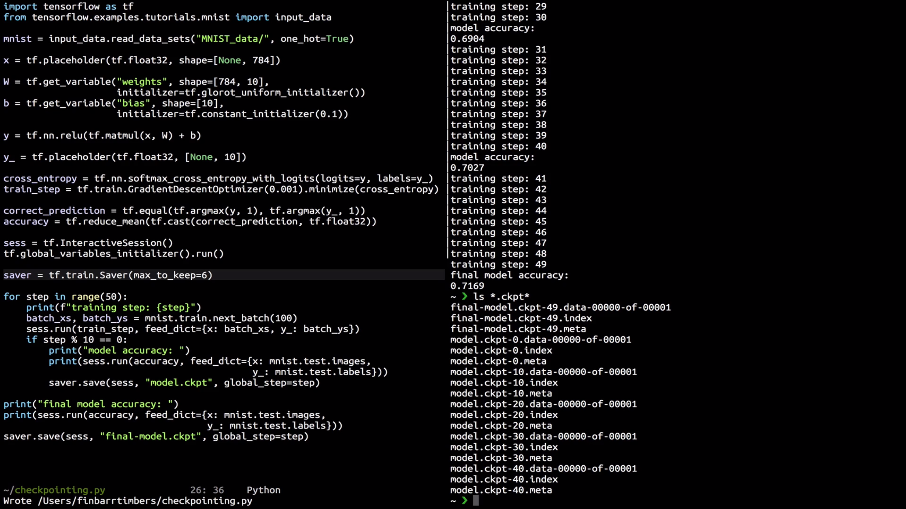

Save The State Of A TensorFlow Model With Checkpointing

# Save The State Of A TensorFlow Model With Checkpointing

3:27

-
    -
    -
    -
    -
    -
    -
    -
-
    -
    -
    -
    -
    -
    -
    -
-

1:08

* * *

## Save The State Of A TensorFlow Model With Checkpointing

Save The State Of A TensorFlow Model With Checkpointing Using The TensorFlow Saver Variable To Save The Session Into TensorFlow ckpt Files.

 Instructor:  [ Finbarr Timbers](https://www.aiworkbox.com/instructors/finbarr-timbers)

 Duration:      3:27

 Technologies:   [TensorFlow](https://www.aiworkbox.com/technologies/tensorflow), [Python](https://www.aiworkbox.com/technologies/python)

* * *

### Transcript:

Today, we’re going to show how we can take an existing model that is working in training as we would like and how to save the states of the model so that we can use it in a separate script.

This is called checkpointing.

We're going to start with a file that contains a neural network with some simple accuracy reporting.

	# create-simple-feedforward-network.py
	#
	# to run
	# python numpy-arrays-to-tensorflow-tensors-and-back.py
	#
	import tensorflow as tf
	from tensorflow.examples.tutorials.mnist import input_data

	mnist = input_data.read_data_sets("MNIST_data/", one_hot=True)

	x = tf.placeholder(tf.float32, shape=[None, 784])

	W = tf.get_variable("weights", shape=[784, 10],
	                    initializer=tf.glorot_uniform_initializer())

	b = tf.get_variable("bias", shape=[10],
	                    initializer=tf.constant_initializer(0.1))

	y = tf.nn.relu(tf.matmul(x, W) + b)

	y_ = tf.placeholder(tf.float32, [None, 10])

	cross_entropy = tf.nn.softmax_cross_entropy_with_logits(logits=y, labels=y_)
	train_step = tf.train.GradientDescentOptimizer(0.001).minimize(cross_entropy)

	correct_prediction = tf.equal(tf.argmax(y, 1), tf.argmax(y_, 1))
	accuracy = tf.reduce_mean(tf.cast(correct_prediction, tf.float32))

	sess = tf.InteractiveSession()
	tf.global_variables_initializer().run()

	for step in range(50):
	    print(f"training step: {step}")
	    batch_xs, batch_ys = mnist.train.next_batch(100)
	    sess.run(train_step, feed_dict={x: batch_cs, y_:batch_ys})
	    if step % 10 == 0:
	        print("model accuracy: ")
	        print(sess.run(accuracy, feed_dict={x: mnist.test.images,
	                                            y_: mnist.test.labels}))

	print("final model accuracy: ")
	print(sess.run(accuracy, feed_dict={x: mnist.test.images,
	                                    y_: mnist.test.labels}))

If you’re interested in creating a file that does something similar to this, you can check out the previous screencast ([Add Metrics Reporting To Improve Your TensorFlow Neural Network Model](https://www.aiworkbox.com/lessons/add-metrics-reporting-to-improve-your-tensorflow-neural-network-model))

To give you an understanding of what this does, let's run the script.

	# Command line
	python checkpointing.py

As you can see, what happens here is that TensorFlow trains our model to be able to make predictions, and it does so with relatively decent accuracy.

Our final model is 60% accurate.

Let's say that we’ve done that and we would like to save our model and use it somewhere else.

Maybe we think that this is perfect and we want to put this into some sort of server, maybe TensorFlow server.

The first thing that we’re going to do is we're going to create a Saver variable.

	saver = tf.train.Saver(max_to_keep=100)

This is an instance of Saver class and it is the main way that you save variables in TensorFlow.

We're passing one option here which is that we keep to see 100 checkpoints.

Once we’ve initialized it, we're then going to add in a step at every sample reporting point where we're going to save our current session to the model.ckpt file.

	saver.save(sess, "model.ckpt", global_step=step)

The global_step variable here is a variable that the TensorFlow Saver uses to name the file.

The ckpt file extension is the standard name that you use for TensorFlow checkpoints.

One thing you'll note here is that TensorFlow saves the session.
TensorFlow doesn’t save individual variables.

What that means is that TensorFlow, if we call the Saver in this way, is going to save a copy of every variable that’s in our current session.

Then it’s going to save that graph to file.

Once we have that, we also want to save the final version of our models.

	saver.save(sess, "fina-model.ckpt", global_step=step)

So we'll add a call to saver.save at the end of our model.
This one we'll call final-model.ckpt.

What's going to happen is that because we hit the reporting checkpoint every 10 steps, this is going to be called five times throughout the course of running our script.

As we can see, there are no ckpt files in our current folder.

	# Command line
	ls *.ckpt*

Let's run our script.

	# Command line
	python checkpointing.py

Now, let’s see how many ckpt files there are.

	# Command line
	ls *.ckpt*

So let's note that there are five here, one for each time that we called the saver.save.

What you'll notice is that there's actually three files for each checkpoint.

That’s because TensorFlow has three separate files, each containing the information for each check.

When you go to use them, which we'll cover in a future screencast, all you need to do is refer to them at the model.ckpt-0 with the appropriate path and then it'll run automatically.

We'll cover them in a future lesson.

One thing to note is that the max_to_keep variable is very important.

	saver = tf.train.Saver(max_to_keep=1)

If we were to change that to only have 1, you would see that TensorFlow would automatically overwrite our checkpoints as we run them.

	# Command line
	rm *.ckpt*

This can be very helpful if you are running a model which trains for a large amount of time.

	# Command line
	python checkpointing.py

I've trained models that run for several weeks.

In that case, you might want to have a checkpoint every day but you only want to keep the most recent ones for the last three days.

Then if you have a particularly interesting result, maybe you'll copy that one.
But you don’t want to store everyone.

Let's see again.

	# Command line
	ls *.ckpt*

Here, we only have actually 1 that’s kept.

If we change this to 6, we'll see that all of our checkpoints are kept.

	saver = tf.train.Saver(max_to_keep=6)

	# Command line
	rm *.ckpt*

	# Command line
	python checkpointing.py

	# Command line
	ls *.ckpt*

Here, we have each checkpoint for when we added the reporting step and then the final.

That can be very useful for long-running models.

Full Source Code For Lesson

	# create-simple-feedforward-network.py
	#
	# to run
	# python numpy-arrays-to-tensorflow-tensors-and-back.py
	#
	import tensorflow as tf
	from tensorflow.examples.tutorials.mnist import input_data

	mnist = input_data.read_data_sets("MNIST_data/", one_hot=True)

	x = tf.placeholder(tf.float32, shape=[None, 784])

	W = tf.get_variable("weights", shape=[784, 10],
	                    initializer=tf.glorot_uniform_initializer())

	b = tf.get_variable("bias", shape=[10],
	                    initializer=tf.constant_initializer(0.1))

	y = tf.nn.relu(tf.matmul(x, W) + b)

	y_ = tf.placeholder(tf.float32, [None, 10])

	cross_entropy = tf.nn.softmax_cross_entropy_with_logits(logits=y, labels=y_)
	train_step = tf.train.GradientDescentOptimizer(0.001).minimize(cross_entropy)

	correct_prediction = tf.equal(tf.argmax(y, 1), tf.argmax(y_, 1))
	accuracy = tf.reduce_mean(tf.cast(correct_prediction, tf.float32))

	sess = tf.InteractiveSession()
	tf.global_variables_initializer().run()

	saver = tf.train.Saver(max_to_keep=6)

	for step in range(50):
	    print(f"training step: {step}")
	    batch_xs, batch_ys = mnist.train.next_batch(100)
	    sess.run(train_step, feed_dict={x: batch_cs, y_:batch_ys})
	    if step % 10 == 0:
	        print("model accuracy: ")
	        print(sess.run(accuracy, feed_dict={x: mnist.test.images,
	                                            y_: mnist.test.labels}))
	        saver.save(sess, "model.ckpt", global_step=step)

	print("final model accuracy: ")
	print(sess.run(accuracy, feed_dict={x: mnist.test.images,
	                                    y_: mnist.test.labels}))
	saver.save(sess, "final-model.ckpt", global_step=step)