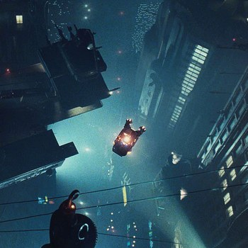

Scientists Now Know How Sleep Cleans Toxins From the Brain

[Sara Harrison](https://www.wired.com/contributor/sara-harrison)
[Science](https://www.wired.com/category/science)
10.31.2019 02:00 PM

# Scientists Now Know How Sleep Cleans Toxins From the Brain

The synchronized brain waves of non-REM sleep may play a key role in preventing toxins from accumulating in a person's brain.

​Photograph: Jamie Hodgson/Getty Images

- 
- 
- 

Laura Lewis and her team of researchers have been putting in [late nights](https://www.wired.com/story/youre-not-getting-enough-sleep-and-its-killing-you/) in their Boston University lab. Lewis ran tests until around 3:00 in the morning, then ended up sleeping in the next day. It was like she had [jet lag](https://www.wired.com/story/timeshifter-jet-lag-app/), she says, without changing time zones. It’s not that Lewis doesn’t appreciate the merits of a good night’s sleep. She does. But when you’re trying to map what’s happening in a slumbering human’s brain, you end up making some sacrifices. “It’s this great irony of sleep research,” she says. “You’re constrained by when people sleep.”

Her results, [published](https://science.sciencemag.org/cgi/doi/10.1126/science.aax5440) today in the journal *Science,* show how our bodies clear toxins out of our brains while we sleep and could open new avenues for treating and preventing neurodegenerative diseases like Alzheimer’s.

When we [sleep](https://www.wired.com/story/a-new-gene-helps-explain-why-some-people-need-less-sleep/) our brains travel through several phases, from a light slumber to a deep sleep that feels like we’ve fallen unconscious, to rapid eye movement (REM) sleep, when we’re more likely to have dreams. Lewis’ work looks at non-REM sleep, that deep phase which generally happens earlier in the night and which has already been associated with memory [retention](https://www.ncbi.nlm.nih.gov/pmc/articles/PMC3522106/). One important 2013 study on mice [showed](https://www.ncbi.nlm.nih.gov/pubmed/24136970) that while the rodents slept, toxins like beta amyloid, which can contribute to Alzheimer’s disease, got swept away.

Lewis was curious how those toxins were cleared out and why that process only happened during sleep. She suspected that cerebrospinal fluid, a clear, water-like liquid that flows around the brain, might be involved. But she wasn’t sure what was unique about sleep. So her lab designed a study that measured several different variables at the same time.

Study participants had to lie down and fall asleep inside an MRI machine. To get realistic sleep cycles, the researchers had to run the tests at midnight, and they even asked subjects to stay up late the night before so people would be primed to drift off once the test began.

Lewis outfitted the participants with an EEG cap so she could look at the electrical currents flowing through their brains. Those currents showed her which stage of sleep the person was in. Meanwhile, the MRI measured the blood oxygen levels in their brains and showed how much cerebrospinal fluid was flowing in and out of the brain. “We had a sense each of these metrics was important, but how they change during sleep and how they relate to each other during sleep was uncharted territory for us,” she says.

What she discovered was that during non-REM sleep, large, slow waves of cerebrospinal fluid were washing over the brain. The EEG readings helped show why. During non-REM sleep, neurons start to synchronize, turning on and off at the same time. “First you would see this electrical wave where all the neurons would go quiet,” says Lewis. Because the neurons had all momentarily stopped firing, they didn’t need as much oxygen. That meant less blood would flow to the brain. But Lewis’s team also observed that cerebrospinal fluid would then rush in, filling in the space left behind.

“It’s a fantastic paper,” says Maiken Nedergaard, a neuroscientist at the University of Rochester who led the 2013 study that first described how sleep can clear out toxins in mice. “I don’t think anybody in their wildest fantasy has really shown that the brain’s electrical activity is moving fluid. So that’s really exciting.”

One big contribution of the paper is it helps show that the systems Nedergaard has been studying in mice are present and hugely important for humans too. “It’s telling you sleep is not just to relax,” says Nedergaard. “Sleep is actually a very distinct function.” Neurons don't all turn off at the same time when we're awake. So brain blood levels don't drop enough to allow substantial waves of cerebrospinal fluid to circulate around the brain and clear out all the metabolic byproducts that accumulate, like beta amyloid.

Most Popular

- 

Gear

[ What Google's Fitbit Buy Means for the Future of Wearables](https://www.wired.com/story/google-fitbit-future-of-wearables/#intcid=recommendations_wired-right-rail-popular_f1570e18-36c3-4a96-8867-30a68ad841fa_cral-top3-1)

Lauren Goode

- 

Culture

[ Los Angeles, *Blade Runner*, and the Theory of Relativity](https://www.wired.com/story/los-angeles-blade-runner-theory-relativity/#intcid=recommendations_wired-right-rail-popular_f1570e18-36c3-4a96-8867-30a68ad841fa_cral-top3-1)

Adam Rogers

- 

Security

[ Inside Olympic Destroyer, the Most Deceptive Hack in History](https://www.wired.com/story/untold-story-2018-olympics-destroyer-cyberattack/#intcid=recommendations_wired-right-rail-popular_f1570e18-36c3-4a96-8867-30a68ad841fa_cral-top3-1)

Andy Greenberg and Excerpt
-

- 

Culture

[ Let's Unravel the Time Travel Paradox of *Terminator: Dark Fate*](https://www.wired.com/story/terminator-dark-fate-time-travel/#intcid=recommendations_wired-right-rail-popular_f1570e18-36c3-4a96-8867-30a68ad841fa_cral-top3-1)

Angela Watercutter

Advertisement

The study also could have clinical applications for treating Alzheimer’s. Recent attempts at developing medications have targeted beta amyloid. But drugs that looked promising at first all [failed](https://www.sciencemag.org/news/2019/03/another-major-drug-candidate-targeting-brain-plaques-alzheimer-s-disease-has-failed) once they got into clinical trials. “This opens a new avenue,” says Nedergaard. Instead of trying to act on one particular molecule, new interventions might instead focus on increasing the amount of cerebrospinal fluid that washes over the brain.

That would help clear out beta amyloid but also could help with other molecules like [tau](https://www.nia.nih.gov/health/what-happens-brain-alzheimers-disease), a protein that gets tangled in Alzheimer’s patients’ brains and harms the connections between neurons. Finding a way to clear out all of that garbage could be much more powerful than just focusing on one piece of the problem. “Aging is not just about one molecule,” says Nedergaard. “Everything fails.”

These discoveries bring along their own set of questions. Lewis didn’t study what happens during other stages of sleep, and she only looked at healthy young adults. But the methods she used were entirely noninvasive—or as noninvasive as having people sleep in an MRI while hooked up to lots of machines can be. She didn’t even inject any dye. That will make it easier to start studying older participants who may be developing neurodegenerative diseases.

It also probably means many more late nights in the lab for Lewis.

* * *

More Great WIRED Stories

- In flying flags, [emoji become political](https://www.wired.com/story/flag-emoji-politics-tibet-china/?itm_campaign=BottomRelatedStories_Sections_3)
- The delicate ethics of [using facial recognition in schools](https://www.wired.com/story/delicate-ethics-facial-recognition-schools/?itm_campaign=BottomRelatedStories_Sections_3)
- Why Zuckerberg’s embrace of Mayor Pete [should worry you](https://www.wired.com/story/why-zuckerbergs-embrace-of-mayor-pete-should-worry-you/?itm_campaign=BottomRelatedStories_Sections_3)
- [RIP Dashboard, the macOS feature](https://www.wired.com/story/dashboard-macos-catalina-rip/?itm_campaign=BottomRelatedStories_Sections_3) I don't want to live without
- The quiet, intentional fires [that shape Northern California](https://www.wired.com/story/the-quiet-intentional-fires-northern-california/?itm_campaign=BottomRelatedStories_Sections_3)
- Prepare for the [deepfake era of video](https://www.wired.com/story/prepare-deepfake-era-web-video/?itm_campaign=BottomRelatedStories_Sections_3); plus, check out the [latest news on AI](https://www.wired.com/category/business/artificial-intelligence/?itm_campaign=BottomRelatedStories_Sections_3)
- Upgrade your work game with our Gear team’s [favorite laptops](https://www.wired.com/gallery/best-laptops/?itm_campaign=BottomRelatedStories), [keyboards](https://www.wired.com/story/top-3-mechanical-keyboards/?itm_campaign=BottomRelatedStories), [typing alternatives](https://www.wired.com/story/best-keyboard-alternatives/?itm_campaign=BottomRelatedStories), and [noise-canceling headphones](https://www.wired.com/gallery/best-noise-canceling-headphones/?itm_campaign=BottomRelatedStories)