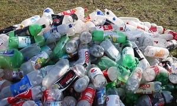
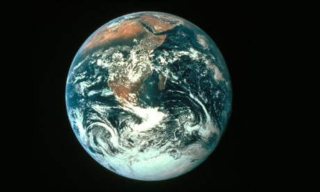
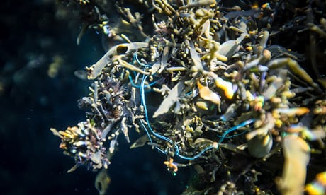

Scientists accidentally create mutant enzyme that eats plastic bottles

[Plastics](https://www.theguardian.com/environment/plastic)

# Scientists accidentally create mutant enzyme that eats plastic bottles

The breakthrough, spurred by the discovery of plastic-eating bugs at a Japanese dump, could help solve the global plastic pollution crisis

[Damian Carrington](https://www.theguardian.com/profile/damiancarrington) Environment editor

[@dpcarrington](https://twitter.com/dpcarrington)
Mon 16 Apr 2018 20.00 BST

- [(L)](https://www.facebook.com/dialog/share?app_id=180444840287&href=https%3A%2F%2Fwww.theguardian.com%2Fenvironment%2F2018%2Fapr%2F16%2Fscientists-accidentally-create-mutant-enzyme-that-eats-plastic-bottles%3FCMP%3Dshare_btn_fb)
- [(L)](https://twitter.com/intent/tweet?text=Scientists%20accidentally%20create%20mutant%20enzyme%20that%20eats%20plastic%20bottles&url=https%3A%2F%2Fwww.theguardian.com%2Fenvironment%2F2018%2Fapr%2F16%2Fscientists-accidentally-create-mutant-enzyme-that-eats-plastic-bottles%3FCMP%3Dshare_btn_tw)
- [(L)](https://www.theguardian.com/environment/2018/apr/16/scientists-accidentally-create-mutant-enzyme-that-eats-plastic-bottlesmailto:?subject=Scientists%20accidentally%20create%20mutant%20enzyme%20that%20eats%20plastic%20bottles&body=https%3A%2F%2Fwww.theguardian.com%2Fenvironment%2F2018%2Fapr%2F16%2Fscientists-accidentally-create-mutant-enzyme-that-eats-plastic-bottles%3FCMP%3Dshare_btn_link)

-

### Shares

132

The enzymes could enable plastic bottles to be fully recycled for the first time. Photograph: Lynne Cameron/PA

Scientists have created a mutant enzyme that breaks down plastic drinks bottles – by accident. The breakthrough could help solve the global plastic pollution crisis by enabling for the first time the full recycling of bottles.

The new research was spurred by the discovery in 2016 of the first [bacterium that had naturally evolved to eat plastic](https://www.theguardian.com/environment/2016/mar/10/could-a-new-plastic-eating-bacteria-help-combat-this-pollution-scourge), at a waste dump in Japan. Scientists have now revealed the detailed structure of the crucial enzyme produced by the bug.

The international team then tweaked the enzyme to see how it had evolved, but tests showed they had inadvertently made the molecule even better at breaking down the PET (polyethylene terephthalate) plastic used for soft drink bottles. “What actually turned out was we improved the enzyme, which was a bit of a shock,” said Prof John McGeehan, at the University of Portsmouth, UK, who led the research. “It’s great and a real finding.”

The mutant enzyme takes a few days to start breaking down the plastic – far faster than the centuries it takes in the oceans. But the researchers are optimistic this can be speeded up even further and become a viable large-scale process.

“What we are hoping to do is use this enzyme to turn this plastic back into its original components, so we can literally recycle it back to plastic,” said McGeehan. “It means we won’t need to dig up any more oil and, fundamentally, it should reduce the amount of plastic in the environment.”

 

#   [Sign up to the Green Light email to get the planet's most important stories]()

Read more

 [(L)](https://www.theguardian.com/environment/2015/oct/19/sign-up-to-the-green-light-email)

About [1m plastic bottles are sold each minute](https://www.theguardian.com/environment/2017/jun/28/a-million-a-minute-worlds-plastic-bottle-binge-as-dangerous-as-climate-change) around the globe and, with just [14% recycled](http://science.sciencemag.org/content/351/6278/1154), many end up in the oceans where they have polluted even the [remotest parts](https://www.theguardian.com/environment/2017/may/15/38-million-pieces-of-plastic-waste-found-on-uninhabited-south-pacific-island), harming marine life and potentially people who eat seafood. “It is incredibly resistant to degradation. Some of those images are horrific,” said McGeehan. “It is one of these wonder materials that has been made a little bit too well.”

However, currently even those bottles that are recycled can only be turned into opaque fibres for clothing or carpets. The new enzyme indicates a way to recycle clear plastic bottles back into clear plastic bottles, which could slash the need to produce new plastic.

“You are always up against the fact that oil is cheap, so virgin PET is cheap,” said McGeehan. “It is so easy for manufacturers to generate more of that stuff, rather than even try to recycle. But I believe there is a public driver here: perception is changing so much that companies are starting to look at how they can properly recycle these.”

The new research, published in the journal [Proceedings of the National Academy of Sciences](http://www.pnas.org/cgi/doi/10.1073/pnas.1718804115), began by determining the precise structure of the enzyme produced by the Japanese bug. The team used the [Diamond Light Source](http://www.diamond.ac.uk/Home.html), near Oxford, UK, an intense beam of X-rays that is 10bn times brighter than the sun and can reveal individual atoms.

Advertisement

The structure of the enzyme looked very similar to one evolved by many bacteria to break down cutin, a natural polymer used as a protective coating by plants. But when the team manipulated the enzyme to explore this connection, they accidentally improved its ability to eat PET.

“It is a modest improvement – 20% better – but that is not the point,” said McGeehan. “It’s incredible because it tells us that the enzyme is not yet optimised. It gives us scope to use all the technology used in other enzyme development for years and years and make a super-fast enzyme.”

Industrial enzymes are widely used in, for example, washing powders and biofuel production, They have been made to work up to 1,000 times faster in a few years, the same timescale McGeehan envisages for the plastic-eating enzyme. A patent has been filed on the specific mutant enzyme by the Portsmouth researchers and those from the US [National Renewable Energy Laboratory](https://www.nrel.gov/) in Colorado.

One possible improvement being explored is to transplant the mutant enzyme into an “extremophile bacteria” that can survive temperatures above the 70C melting point of PET – the plastic is likely to degrade 10-100 times faster when molten.

Earlier work had shown that [some fungi can break down PET plastic](https://www.ncbi.nlm.nih.gov/pubmed/26291558), which makes up about 20% of global plastic production. But bacteria are far easier to harness for industrial uses.

Other types of plastic could be broken down by bacteria currently evolving in the environment, McGeehan said: “People are now searching vigorously for those.” PET sinks in seawater but some scientists have conjectured that plastic-eating bugs might one day be sprayed on the huge plastic garbage patches in the oceans to clean them up.

 

#   [Microplastic pollution in oceans is far worse than feared, say scientists]()

Read more

 [(L)](https://www.theguardian.com/environment/2018/mar/12/microplastic-pollution-in-oceans-is-far-greater-than-thought-say-scientists)

“I think [the new research] is very exciting work, showing there is strong potential to use enzyme technology to help with society’s growing waste problem,” said Oliver Jones, a chemist at RMIT University in Melbourne, Australia, and not part of the research team.

“Enzymes are non-toxic, biodegradable and can be produced in large amounts by microorganisms,” he said. “There is still a way to go before you could recycle large amounts of plastic with enzymes, and reducing the amount of plastic produced in the first place might, perhaps, be preferable. [But] this is certainly a step in a positive direction.”

Prof Adisa Azapagic, at the University of Manchester in the UK, agreed the enzyme could be useful but added: “A full life-cycle assessment would be needed to ensure the technology does not solve one environmental problem – waste – at the expense of others, including additional greenhouse gas emissions.”

##  Since you’re here …

… we have a small favour to ask. More people are reading the Guardian than ever but advertising revenues across the media are falling fast. And unlike many news organisations, we haven’t put up a paywall – we want to keep our journalism as open as we can. So you can see why we need to ask for your help. The Guardian’s independent, investigative journalism takes a lot of time, money and hard work to produce. But we do it because we believe our perspective matters – because it might well be your perspective, too.

>  I appreciate there not being a paywall: it is more democratic for the media to be available for all and not a commodity to be purchased by a few. I’m happy to make a contribution so others with less means still have access to information. >  Thomasine, Sweden >

If everyone who reads our reporting, who likes it, helps fund it, our future would be much more secure. **For as little as £1, you can support the Guardian – and it only takes a minute. Thank you.**

 [Support The Guardian](https://support.theguardian.com/contribute?REFPVID=jg2n1f1qb89uwz6367q0&INTCMP=gdnwb_copts_memco_kr1_epic_ask_four_earning_control&acquisitionData=%7B%22source%22%3A%22GUARDIAN_WEB%22%2C%22componentId%22%3A%22gdnwb_copts_memco_kr1_epic_ask_four_earning_control%22%2C%22componentType%22%3A%22ACQUISITIONS_EPIC%22%2C%22campaignCode%22%3A%22gdnwb_copts_memco_kr1_epic_ask_four_earning_control%22%2C%22abTest%22%3A%7B%22name%22%3A%22ContributionsEpicAskFourEarning%22%2C%22variant%22%3A%22control%22%7D%2C%22referrerPageviewId%22%3A%22jg2n1f1qb89uwz6367q0%22%2C%22referrerUrl%22%3A%22https%3A%2F%2Fwww.theguardian.com%2Fenvironment%2F2018%2Fapr%2F16%2Fscientists-accidentally-create-mutant-enzyme-that-eats-plastic-bottles%22%7D)

 

Topics

- [Plastics/](https://www.theguardian.com/environment/plastic)
- [Oceans/](https://www.theguardian.com/environment/oceans)
- [Pollution/](https://www.theguardian.com/environment/pollution)
- [Microbiology/](https://www.theguardian.com/science/microbiology)
- [Biology/](https://www.theguardian.com/science/biology)
- [(L)](https://www.facebook.com/dialog/share?app_id=180444840287&href=https%3A%2F%2Fwww.theguardian.com%2Fenvironment%2F2018%2Fapr%2F16%2Fscientists-accidentally-create-mutant-enzyme-that-eats-plastic-bottles%3FCMP%3Dshare_btn_fb)
- [(L)](https://twitter.com/intent/tweet?text=Scientists%20accidentally%20create%20mutant%20enzyme%20that%20eats%20plastic%20bottles&url=https%3A%2F%2Fwww.theguardian.com%2Fenvironment%2F2018%2Fapr%2F16%2Fscientists-accidentally-create-mutant-enzyme-that-eats-plastic-bottles%3FCMP%3Dshare_btn_tw)
- [(L)](https://www.theguardian.com/environment/2018/apr/16/scientists-accidentally-create-mutant-enzyme-that-eats-plastic-bottlesmailto:?subject=Scientists%20accidentally%20create%20mutant%20enzyme%20that%20eats%20plastic%20bottles&body=https%3A%2F%2Fwww.theguardian.com%2Fenvironment%2F2018%2Fapr%2F16%2Fscientists-accidentally-create-mutant-enzyme-that-eats-plastic-bottles%3FCMP%3Dshare_btn_link)
- [Share on LinkedIn](http://www.linkedin.com/shareArticle?mini=true&title=Scientists%20accidentally%20create%20mutant%20enzyme%20that%20eats%20plastic%20bottles&url=https%3A%2F%2Fwww.theguardian.com%2Fenvironment%2F2018%2Fapr%2F16%2Fscientists-accidentally-create-mutant-enzyme-that-eats-plastic-bottles)
- [Share on Pinterest](http://www.pinterest.com/pin/find/?url=https%3A%2F%2Fwww.theguardian.com%2Fenvironment%2F2018%2Fapr%2F16%2Fscientists-accidentally-create-mutant-enzyme-that-eats-plastic-bottles)
- [Share on Google+](https://plus.google.com/share?url=https%3A%2F%2Fwww.theguardian.com%2Fenvironment%2F2018%2Fapr%2F16%2Fscientists-accidentally-create-mutant-enzyme-that-eats-plastic-bottles%3FCMP%3Dshare_btn_gp&amp;hl=en-GB&amp;wwc=1)
- [Share on WhatsApp](https://www.theguardian.com/environment/2018/apr/16/scientists-accidentally-create-mutant-enzyme-that-eats-plastic-bottleswhatsapp://send?text=%22Scientists%20accidentally%20create%20mutant%20enzyme%20that%20eats%20plastic%20bottles%22%20https%3A%2F%2Fwww.theguardian.com%2Fenvironment%2F2018%2Fapr%2F16%2Fscientists-accidentally-create-mutant-enzyme-that-eats-plastic-bottles%3FCMP%3Dshare_btn_wa)
- [Share on Messenger](https://www.theguardian.com/environment/2018/apr/16/scientists-accidentally-create-mutant-enzyme-that-eats-plastic-bottlesfb-messenger://share?link=https%3A%2F%2Fwww.theguardian.com%2Fenvironment%2F2018%2Fapr%2F16%2Fscientists-accidentally-create-mutant-enzyme-that-eats-plastic-bottles%3FCMP%3Dshare_btn_me&app_id=180444840287)