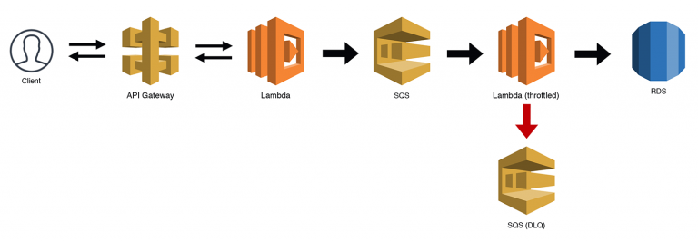
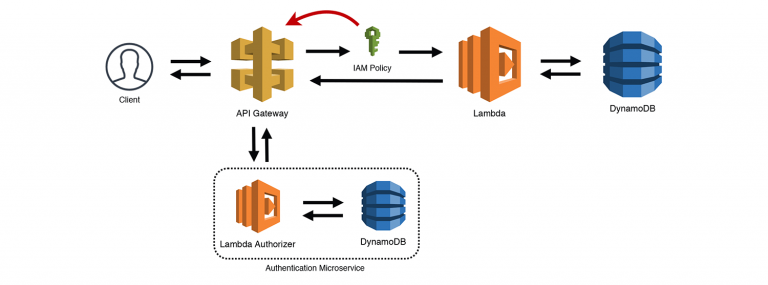
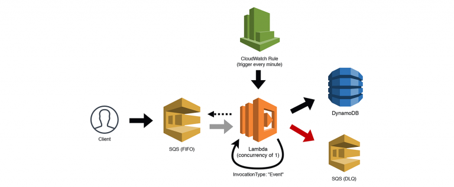
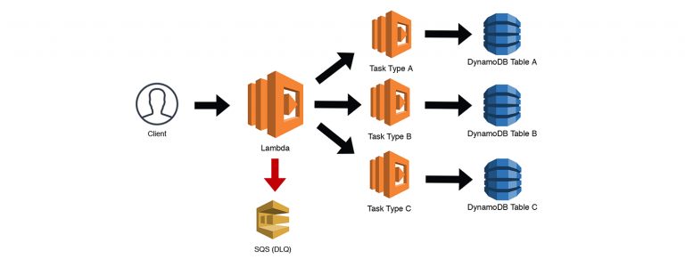
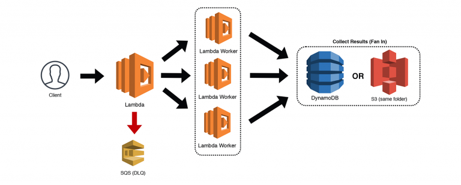
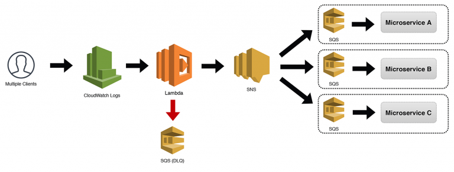

Serverless Microservice Patterns for AWS - Jeremy Daly

# Serverless Microservice Patterns for AWS

Posted in [Programming](https://www.jeremydaly.com/programming/) & [Serverless](https://www.jeremydaly.com/serverless/) on August 23, 2018

**Last Updated:** January 4, 2019

- **
- **
- **
- **
- **
- **
- **

I’m a huge fan of building microservices with serverless systems. Serverless gives us the power to focus on just the code and our data without worrying about the maintenance and configuration of the underlying compute resources. Cloud providers (like AWS), also give us a huge number of managed services that we can stitch together to create incredibly powerful, and massively scalable serverless microservices.

I’ve read a lot of posts that mention serverless microservices, but they often don’t go into much detail. I feel like that can leave people confused and make it harder for them to implement their own solutions. Since I work with serverless microservices all the time, I figured I’d compile a list of design patterns and how to implement them in AWS. I came up with 19 of them, though I’m sure there are plenty more.

In this post we’ll look at all 19 in detail so that you can use them as templates to start designing your own serverless microservices.

*Audio Version:*

 [(L)](https://soundcloud.com/jeremydalyaudio/serverless-microservice)

 [Jeremy Daly](https://soundcloud.com/jeremydalyaudio)

 [Serverless Microservice Patterns for AWS](https://soundcloud.com/jeremydalyaudio/serverless-microservice)

 [![](data:image/svg+xml,%3csvg xmlns='http://www.w3.org/2000/svg' width='100' height='14' data-evernote-id='81' class='js-evernote-checked'%3e %3cdefs data-evernote-id='82' class='js-evernote-checked'%3e %3clinearGradient id='logo_hover_22' x1='0%25' y1='0%25' x2='0%25' y2='100%25' spreadMethod='pad' data-evernote-id='83' class='js-evernote-checked'%3e %3cstop offset='0%25' stop-color='%23ff7700' stop-opacity='1' data-evernote-id='84' class='js-evernote-checked'%3e%3c/stop%3e %3cstop offset='100%25' stop-color='%23ff3300' stop-opacity='1' data-evernote-id='85' class='js-evernote-checked'%3e%3c/stop%3e %3c/linearGradient%3e %3c/defs%3e %3cpath class='logo__path js-evernote-checked' d='M10.517 3.742c-.323 0-.49.363-.49.582 0 0-.244 3.591-.244 4.641 0 1.602.15 2.621.15 2.621 0 .222.261.401.584.401.321 0 .519-.179.519-.401 0 0 .398-1.038.398-2.639 0-1.837-.153-4.127-.284-4.592-.112-.395-.313-.613-.633-.613zm-1.996.268c-.323 0-.49.363-.49.582 0 0-.244 3.322-.244 4.372 0 1.602.119 2.621.119 2.621 0 .222.26.401.584.401.321 0 .581-.179.581-.401 0 0 .081-1.007.081-2.608 0-1.837-.206-4.386-.206-4.386 0-.218-.104-.581-.425-.581zm-2.021 1.729c-.324 0-.49.362-.49.582 0 0-.272 1.594-.272 2.644 0 1.602.179 2.559.179 2.559 0 .222.229.463.552.463.321 0 .519-.241.519-.463 0 0 .19-.944.19-2.546 0-1.837-.253-2.657-.253-2.657 0-.22-.104-.582-.425-.582zm-2.046-.358c-.323 0-.49.363-.49.582 0 0-.162 1.92-.162 2.97 0 1.602.069 2.496.069 2.496 0 .222.26.557.584.557.321 0 .581-.304.581-.526 0 0 .143-.936.143-2.538 0-1.837-.206-2.96-.206-2.96 0-.218-.198-.581-.519-.581zm-2.169 1.482c-.272 0-.232.218-.232.218v3.982s-.04.335.232.335c.351 0 .716-.832.716-2.348 0-1.245-.436-2.187-.716-2.187zm18.715-.976c-.289 0-.567.042-.832.116-.417-2.266-2.806-3.989-5.263-3.989-1.127 0-2.095.705-2.931 1.316v8.16s0 .484.5.484h8.526c1.655 0 3-1.55 3-3.155 0-1.607-1.346-2.932-3-2.932zm10.17.857c-1.077-.253-1.368-.389-1.368-.815 0-.3.242-.611.97-.611.621 0 1.106.253 1.542.699l.981-.951c-.641-.669-1.417-1.067-2.474-1.067-1.339 0-2.425.757-2.425 1.99 0 1.338.873 1.736 2.124 2.026 1.281.291 1.513.486 1.513.923 0 .514-.379.738-1.184.738-.65 0-1.26-.223-1.736-.777l-.98.873c.514.757 1.504 1.232 2.639 1.232 1.853 0 2.668-.873 2.668-2.163 0-1.477-1.193-1.845-2.27-2.097zm6.803-2.745c-1.853 0-2.949 1.435-2.949 3.502s1.096 3.501 2.949 3.501c1.852 0 2.949-1.434 2.949-3.501s-1.096-3.502-2.949-3.502zm0 5.655c-1.097 0-1.553-.941-1.553-2.153 0-1.213.456-2.153 1.553-2.153 1.096 0 1.551.94 1.551 2.153.001 1.213-.454 2.153-1.551 2.153zm8.939-1.736c0 1.086-.533 1.756-1.396 1.756-.864 0-1.388-.689-1.388-1.775v-3.897h-1.358v3.916c0 1.978 1.106 3.084 2.746 3.084 1.726 0 2.754-1.136 2.754-3.103v-3.897h-1.358v3.916zm8.142-.89l.019 1.485c-.087-.174-.31-.515-.475-.768l-2.703-3.692h-1.362v6.894h1.401v-2.988l-.02-1.484c.088.175.311.514.475.767l2.79 3.705h1.213v-6.894h-1.339v2.975zm5.895-2.923h-2.124v6.791h2.027c1.746 0 3.474-1.01 3.474-3.395 0-2.484-1.437-3.396-3.377-3.396zm-.097 5.472h-.67v-4.152h.719c1.436 0 2.028.688 2.028 2.076 0 1.242-.651 2.076-2.077 2.076zm7.909-4.229c.611 0 1 .271 1.242.737l1.26-.582c-.426-.883-1.202-1.503-2.483-1.503-1.775 0-3.016 1.435-3.016 3.502 0 2.143 1.191 3.501 2.968 3.501 1.232 0 2.047-.572 2.513-1.533l-1.145-.68c-.358.602-.718.864-1.329.864-1.019 0-1.611-.932-1.611-2.153-.001-1.261.583-2.153 1.601-2.153zm5.17-1.192h-1.359v6.791h4.083v-1.338h-2.724v-5.453zm6.396-.157c-1.854 0-2.949 1.435-2.949 3.502s1.095 3.501 2.949 3.501c1.853 0 2.95-1.434 2.95-3.501s-1.097-3.502-2.95-3.502zm0 5.655c-1.097 0-1.553-.941-1.553-2.153 0-1.213.456-2.153 1.553-2.153 1.095 0 1.55.94 1.55 2.153.001 1.213-.454 2.153-1.55 2.153zm8.557-1.736c0 1.086-.532 1.756-1.396 1.756-.864 0-1.388-.689-1.388-1.775v-3.794h-1.358v3.813c0 1.978 1.106 3.084 2.746 3.084 1.726 0 2.755-1.136 2.755-3.103v-3.794h-1.36v3.813zm5.449-3.907h-2.318v6.978h2.211c1.908 0 3.789-1.037 3.789-3.489 0-2.552-1.565-3.489-3.682-3.489zm-.108 5.623h-.729v-4.266h.783c1.565 0 2.21.706 2.21 2.133.001 1.276-.707 2.133-2.264 2.133z' data-evernote-id='86'%3e%3c/path%3e %3c/svg%3e)](https://soundcloud.com/jeremydalyaudio/serverless-microservice)

 [Download](https://api.soundcloud.com/tracks/491906652/download?client_id=LBCcHmRB8XSStWL6wKH2HPACspQlXg2P)

 [(L)](https://w.soundcloud.com/player/?url=https%3A//api.soundcloud.com/tracks/491906652&color=%23ff5500&auto_play=false&hide_related=false&show_comments=true&show_user=true&show_reposts=false&show_teaser=true)

### A quick word about communication between microservices

Before we jump in, I want to make sure we’re clear on the very important distinction between *synchronous* and *asynchronous* communication. I wrote a post about [Mixing VPC and Non-VPC Lambda Functions for Higher Performing Microservices](https://www.jeremydaly.com/mixing-vpc-and-non-vpc-lambda-functions-for-higher-performing-microservices/) that goes into more detail about communication types, eventual consistency, and other microservice topics. Might be worth a read if you are unfamiliar with these things.  Here is a quick recap of communication types:

**Synchronous Communication

**Services can be invoked by other services and must wait for a reply. This is considered a blocking request, because the invoking service cannot finish executing until a response is received.

**Asynchronous Communication

**This is a *non-blocking* request. A service can invoke (or trigger) another service directly or it can use another type of communication channel to queue information. The service typically only needs to wait for confirmation (ack) that the request was sent.

Great! Now that we’re clear on that, let’s jump right in.

## Serverless Microservice Patterns

The following 19 patterns represent several common microservice designs that are being used by developers on AWS. The vast majority of these I’ve used in production, but they all are valid ways (IMO) to build serverless microservices. Some of these have legitimate names that people have coined over the years. If the pattern was highly familiar, and I knew the name, I used the actual name. In many of these cases, however, I had to have a little fun making them up.

For clarity and consistency, the diagrams below all use the same symbols to represent communication between components. A large black arrow represents an *asynchronous *request. The two smaller black arrows represents a *synchronous* request. Red arrows indicate errors. Enjoy!

### The Simple Web Service

This is the most basic of patterns you’re likely to see with serverless applications. The Simple Web Service fronts a Lambda function with an API Gateway. I’ve shown DynamoDB as the database here because it scales nicely with the high concurrency capabilities of Lambda.

Simple Web Service Pattern

### The Scalable Webhook

If you’re building a webhook, the traffic can often be unpredictable. This is fine for Lambda, but if you’re using a “less-scalable” backend like RDS, you might just run into some bottlenecks. There are [ways to manage this](https://www.jeremydaly.com/manage-rds-connections-aws-lambda/), but now that Lambda supports [SQS triggers](https://www.jeremydaly.com/serverless-consumers-with-lambda-and-sqs-triggers/), we can throttle our workloads by queuing the requests and then using a throttled (low concurrency) Lambda function to work through our queue. Under most circumstances, your throughput should be near real time. If there is some heavy load for a period of time, you might experience some small delays as the throttled Lambda chews through the messages. (Be sure to handle your own Dead Letter Queues (DLQs) for bad messages when you use SQS triggers with throttled Lambdas. Otherwise the throttling may cause redrive policies to prematurely DLQ a message.) SQS triggers for Lambda functions [now work correctly with throttling](https://www.jeremydaly.com/serverless-consumers-with-lambda-and-sqs-triggers/), so it is no longer necessary to manage your own redrive policy.

Scalable Webhook Pattern

### The Gatekeeper

This is a variation on the Simple Web Service pattern. Using API Gateway’s “Lambda Authorizers”, you can connect a Lambda function that processes the `Authorization` header and returns an IAM policy. API Gateway then uses that policy to determine if it is valid for the resource and either routes the request, or rejects it. API Gateway caches the IAM policy for a period of time, so you could also classify this as the “Valet Key” pattern. As I point out in the diagram below, Lambda Authorizers are microservices in their own right. Your “Authorization Service” could have multiple interfaces into it to add/remove users, update permissions, and so forth.

Authorizer/Valet Key Pattern

### The Internal API

The Internal API pattern is essentially a web service without an API Gateway frontend. If you are building a microservice that only needs to be accessed from within your AWS infrastructure, you can use the AWS SDK and access Lambda’s HTTP API directly. If you use an `InvocationType` of `RequestResponse`, then a *synchronous* request will be sent to the destination Lambda function and the calling script (or function) will wait for a response. Some people say that functions calling other functions is an *anti-pattern*, but I disagree. HTTP calls from within microservices are a standard (and often necessary) practice. Whether you’re calling DynamoDB (http-based), an external API (http-based) or another internal microservice (http-based), your service will most likely have to wait for HTTP response data to achieve its directive.

Internal API Pattern

### The Internal Handoff

Like the Internal API, the Internal Handoff pattern uses the AWS SDK to access Lambda’s HTTP API. However, in this scenario we’re using an `InvocationType` of `Event`, which disconnects as soon as we get an ack indicating the request was successfully submitted. The Lambda function is now receiving an *asynchronous* event, so it will automatically utilize the built-in retry mechanism. This means two things, 1) it is possible for the event to be processed *more than once*, so we should be sure that our events are idempotent. And 2) Since we disconnected from our calling function, we need to be sure to capture failures so that we can analyze and potentially replay them. Attaching a Dead Letter Queue (DLQ) to asynchronous Lambda functions is always a good idea. I like to use an SQS Queue and monitor the queue size with CloudWatch Metrics. That way I can get an alert if the failure queue reaches a certain threshold.

Internal Handoff Pattern

### The Aggregator

Speaking of internal API calls, the Aggregator is another common microservice pattern. The Lambda function in the diagram below makes three synchronous calls to three separate microservices. We would assume that each microservice would be using something like the Internal API pattern and would return data to the caller. The microservices below could also be *external* services, like third-party APIs. The Lambda function then aggregates all the responses and returns a combined response to the client on the other side of the API Gateway.

Aggregator Pattern

### The Notifier

I’ve had this debate with many people, but I consider an SNS topic (Simple Notification Service) to be its own microservice pattern. A important attribute of microservices is to have a “well-defined API” in order for other services and systems to communicate with them. SNS (and for that matter, SQS and Kinesis) have standardized APIs accessible through the AWS SDK. If the microservice is for internal use, a standalone SNS topic makes for an extremely useful microservice. For example, if you have multiple billing services (e.g. one for products, one for subscriptions, and one for services), then it’s highly likely that several services need to be notified when a new billing record is generated. The aforementioned services can post an event to the “Billing Notifier” service that then distributes the event to subscribed services. We want to keep our microservices decoupled, so dependent services (like an invoicing service, a payment processing service, etc.) are responsible for subscribing to the “Billing Notifier” service on their own. As new services are added that need this data, they can subscribe as well.

Notifier Pattern

### The FIFOer

Let’s get a little more complex. [SQS trigger support for Lambda](https://www.jeremydaly.com/serverless-consumers-with-lambda-and-sqs-triggers/) is awesome, but unfortunately it doesn’t work with FIFO (first in, first out) SQS queues. This makes sense, since the triggers are meant to process messages in parallel, not one at a time. However, we can build a completely serverless FIFO consumer with a little help from CloudWatch Rules and the Lambda concurrency settings. In the diagram below we have a client that is sending messages to a FIFO queue. Since we can’t trigger our consumer automatically, we add a CloudWatch Rule (aka crontab) that invokes our function (asynchronously) ever minute. We set our Lambda function’s concurrency to `1` so that we aren’t attempting to run competing requests in parallel. The function polls the queue for (up to 10) ordered messages and does whatever processing it needs to do, e.g. write to a DynamoDB table.

Once we’ve completed our processing, the function removes the messages from the queue, and then invokes itself again (asynchronously) using the AWS SDK  to access the Lambda HTTP API with the `Event` invocation type. This process will repeat until all the items have been removed from the queue. Yes, this has a cascading effect, and I’m not a huge fan of using this for any other purpose, but it does work really well in this scenario.  If the Lambda function is busy processing a set of messages, the CloudWatch Rule will fail because of the Lambda concurrency setting. If the self-invocation is blocked  for any reason, the retry will continue the cascade. Worst case scenario, the processing stops and is then started again by the CloudWatch rule.

If the message is bad or causes a processing error, be sure to dump it into a Dead Letter Queue for further inspection and the ability to replay it.

FIFOer Pattern

### The “They Say I’m A Streamer”

Another somewhat complex pattern is the continuous stream processor. This is very useful for capturing clickstreams, IoT data, etc. In the scenario below, I’m using API Gateway as a Kinesis proxy. This uses the “AWS Service” integration type that API Gateway provides (learn more [here](https://docs.aws.amazon.com/apigateway/latest/developerguide/integrating-api-with-aws-services-kinesis.html)). You could use any number of services to pipe data to a Kinesis stream, so this is just one example. Kinesis will distribute data to however many shards we’ve configured and then we can use Kinesis Firehose to aggregate the data to S3 and bulk load it into Redshift. There are other ways to accomplish this, but surprisingly, this will end up being cheaper when you get to higher levels of scale (vs SNS for example).

“They Say I’m A Streamer” or Continuous Stream Pattern

### The Strangler

The Strangler is another popular pattern that let’s you incrementally replace pieces of an application with new or updated services. Typically you would create some sort of a “Strangler Facade” to route your requests, but API Gateway can actually do this for us using “AWS Service” and “HTTP” integration types. For example, an existing API (front-ended by an Elastic Load Balancer) can be routed through API Gateway using an “HTTP” integration. You can have all requests default to your *legacy *API, and then direct specific routes to new *serverless* service as you add them.

Strangler Pattern

### The State Machine

It is often the case that Serverless architectures will need to provide some sort of orchestration. [AWS Step Functions](https://aws.amazon.com/step-functions/) are, without a doubt, the best way to handle orchestration within your AWS serverless applications. If you’re unfamiliar with Step functions, check out these [two sample projects](https://docs.aws.amazon.com/step-functions/latest/dg/create-sample-projects.html) in the AWS docs. State Machines are great for coordinating several tasks and ensuring that they properly complete by implementing retries, wait timers, and rollbacks. However, they are exclusively *asynchronous*, which means you can’t wait for the result of a Step Function and then respond back to a *synchronous* request.

AWS advocates using Step Functions for orchestrating entire workflows, i.e. coordinating multiple microservices. I think this works for certain *asynchronous* patterns, but it will definitely not work for services that need to provide a *synchronous* response to clients. I personally like to encapsulate step functions *within* a microservice, reducing code complexity and adding resiliency, but still keeping my services decoupled.

State Machine Pattern

### The Router

The State Machine pattern is powerful because it provides us with simple tools to manage complexity, parallelism, error handling and more. However, Step Functions are not free and you’re likely to rack up some huge bills if you use them for everything. For less complex orchestrations where we’re less concerned about state transitions, we can handle them using the Router pattern.

In the example below, an *asynchronous* call to a Lambda function is determining which task type should be used to process the request. This is essentially a glorified `switch` statement, but it could also add some additional context and data enrichment if need be. Note that the main Lambda function is only invoking **one** of the three possible tasks here. As I mentioned before, asynchronous Lambdas should have a DLQ to catch failed invocations for replays, including the three “Task Type” Lambdas below. The tasks then do their jobs (whatever that may be). Here we’re simply writing to DynamoDB tables.

Router Pattern

### The Robust API

The Router pattern works great when clients don’t know how to split the requests across separate endpoints. However, often the client will know how to do this, like in the case of a REST API. Using API Gateway, and its ability to route requests based on methods and endpoints, we can let the client decide which “backend” service it wants to interact with. The example below uses a *synchronous* request from a client, but this would be just as effective for *asynchronous* requests as well.

While this is somewhat similar to the Simple Web Service pattern, I consider this the Robust API pattern since we are adding more complexity by interacting with additional services within our overall application. It’s possible, as illustrated below, that several functions may share the same datasource, functions could make *asynchronous* calls to other services, and functions could make *synchronous* calls to other services or external APIs and require a response. Also important to note, if we build services using the Internal API pattern, we can frontend them using API Gateway if we ever want to expose them to the public.

Robust API Pattern

### The Frugal Consumer

We’ve already mentioned [SQS Triggers](https://www.jeremydaly.com/serverless-consumers-with-lambda-and-sqs-triggers/) and how they let us throttle requests to “less-scalable” services like RDS. The Frugal Consumer is essentially just the Scalable Webhook pattern without the API Gateway and preprocessing Lambda function. I consider this a separate pattern since it could exist as a standalone service. Like with SNS, SQS has a well-defined API accessible via the AWS SDK. Multiple services could post messages directly to the queue and have the throttled Lambda function process their requests. (I hate repeating myself, but be sure to handle your own Dead Letter Queues (DLQs) for bad messages when you use SQS triggers with throttled Lambdas. Otherwise the throttling may cause redrive policies to prematurely DLQ a message.) SQS triggers for Lambda functions [now work correctly with throttling](https://www.jeremydaly.com/serverless-consumers-with-lambda-and-sqs-triggers/), so it is no longer necessary to manage your own redrive policy.

Frugal Consumer Pattern

### The Read Heavy Reporting Engine

Just as there are limitations getting data **IN** to a “less-scalable” service like RDS, there can be limitations to getting data **OUT** as well. Amazon has done some pretty amazing stuff in this space with Aurora Read Replicas and [Aurora Serverless](https://www.jeremydaly.com/aurora-serverless-the-good-the-bad-and-the-scalable/), but unfortunately, hitting the `max_connections` limit is still very possible, especially with applications with heavy *READ* requirements. Caching is a tried and true strategy for mitigating *READS* and could actually be implemented as part of several patterns that I’ve outline in this post. The example below throws an Elasticache cluster (which can handle tens of thousands of connections) in front of our RDS cluster. Key points here are to make sure that TTLs are set appropriately, cache-invalidation is included (maybe as a subscription to another service), and new RDS connections are *ONLY* made if the data isn’t cached.

**NOTE:** Elasticache doesn’t talk directly to RDS, I was simply trying to make the caching layer clear. The Lambda function would technically need to communicate with both services.

Read Heavy Reporting Engine Pattern

### The Fan-Out/Fan-In

This is another great pattern, especially for batch jobs. Lambda functions are limited to 15 minutes of total execution time, so large ETL tasks and other time intensive processes can easily exceed this limitation. To get around this limitation, we can use a single Lambda function to split up our big job into a series of smaller jobs. This can be accomplished by invoking a Lambda “Worker” for each smaller job using the `Event` type to disconnect the calling function. This is known as “fan-out” since we are distributing the workload.

In some cases, fanning-out our job may be all we need to do. However, sometimes we need to aggregate the results of these smaller jobs. Since the Lambda Workers are all detached from our original invocation, we will have to “fan-in” our results to a common repository. This is actually easier than it sounds. Each worker simply needs to write to a DynamoDB table with the main job identifier, their subtask identifier, and the results of their work. Alternatively, each job could write to the same job folder in S3 and the data could be aggregated from there. Don’t forget your Lambda DLQs to catch those failed invocations.

Fan-out/Fan-in Pattern

### The Eventually Consistent

Microservice rely on the concept of “eventual consistency” in order to replicate data across other services. The small delay is often imperceptible to end users since replication typically happens very quickly. Think about when you change your Twitter profile picture and it take a few seconds for it to update in the header. The data needs to be replicated and the cache needs to be cleared. Using the same data for different purposes in microservices often means we have to store the same data more than once.

In the example below, we are persisting data to a DynamoDB table by calling some endpoint routed to a Lambda function by our API Gateway. For our frontend API purposes, a NoSQL solution works just fine. However, we also want to use a copy of that data with our reporting system and we’ll need to do some joins, making a relational database the better choice. We can set up another Lambda function that subscribes to the DynamoDB table’s *Stream* which will trigger events whenever data is added or changed.

DynamoDB streams work like Kinesis, so batches will be [retried over and over again](https://docs.aws.amazon.com/lambda/latest/dg/retries-on-errors.html) (and stay in order). This means we can throttle our Lambda function to make sure we don’t overwhelm our RDS instance. Make sure you manage your own DLQ to store invalid updates, and be sure to include a `last_updated` field with every record change. You can use that to limit your SQL query and ensure that you have the latest version.

Eventually Consistent Pattern

### The Distributed Trigger

The standalone SNS topic (aka The Notifier pattern) that I mentioned before is extremely powerful given its ability to serve so many masters. However, coupling an SNS topic directly to a microservice has its benefits too. If the topic truly has a single purpose, and only needs to receive messages from within its own microservice, the Distributed Trigger pattern outlined below works really well.

We’re using CloudWatch Logs as an example here, but it technically could use any event type that was supported. Events trigger our Lambda function (which has our attached DLQ), and then sends the event to an SNS topic. In the diagram below, I show three microservices with SQS buffers being notified. However, the subscriptions to the SNS topic would be the responsibility of the individual microservices.

Distributed Trigger Pattern

### The Circuit Breaker

I saved the best for last! This is one of my favorite patterns since I am often using a number of third-party APIs within my serverless applications. The Circuit Breaker pattern keeps track of the number of failed (or slow) API calls made using some sort of a state machine. For our purposes, we’re using an Elasticache cluster to persist the information (but DynamoDB could also be used if you wanted to avoid VPCs).

Here’s how it works. When the number of failures reaches a certain threshold, we “open” the circuit and send errors back to the calling client immediately without even trying to call the API. After a short timeout, we “half open” the circuit, sending just a few requests through to see if the API is finally responding correctly. All other requests receive an error. If the sample requests are successful, we “close” the circuit and start letting all traffic through. However, if some or all of those requests fail, the circuit is opened again, and the process repeats with some algorithm for increasing the timeout between “half open” retry attempts.

This is an incredibly powerful (and cost saving) pattern for any type of *synchronous* request. You are accumulating charges whenever a Lambda function is running and waiting for another task to complete. Allowing your systems to self-identify issues like this, provide incremental backoff, and then self-heal when the service comes back online makes you feel like a superhero!

Circuit Breaker Pattern

## Where do we go from here?

The 19 patterns I’ve identified above should be a good starting point for you when designing your serverless microservices. The best advice I can give you is to think long and hard about what each microservice actually needs to do, what data it needs, and what other services it needs to interact with. It is tempting to build lots of small microservices when you would have been better off with just a few.

Much like the term “serverless”, there is no formal, agreed upon definition of what a “microservice” actually consists of. However, serverless microservices should at least adhere to the following standards:

- **Services should have their own private data**

If your microservice is sharing a database with another service, either separate/replicate the data, or combine the services. If none of those work for you, rethink your strategy and architecture.

- **Services should be independently deployable**

Microservices (especially serverless ones) should be completely independent and self-contained. It’s fine for them to be dependent on other services or for others to rely on them, but those dependencies should be entirely based on well-defined communication channels between them.

- **Utilize eventual consistency

**Data replication and denormalization are core tenets within microservices architectures. Just because Service A needs some data from Service B, doesn’t mean they should be combined. Data can be interfaced in realtime through synchronous communication if feasible, or it can be replicated across services. Take a deep breath relational database people, this is okay.

- **Use asynchronous workloads whenever possible

**AWS Lambda bills you for every 100 ms of processing time you use. If you are waiting for other processes to finish, you are paying to have your functions wait. This *might* be necessary for lots of use cases, but if possible, hand off your tasks and let them run in the background. For more complicated orchestrations, use Step Functions.

- **Keep services small, but valuable**

It’s possible to go too small, but it is also likely that you can go too big. Your “microservices” architecture shouldn’t be a collection of small “monoliths” that handle large application components. It is okay to have a few functions, database tables, and queues as part of a single microservice. If you can limit the size, but still provide sufficient business value, you’re probably where you need to be.

Good luck and have fun building your serverless microservices. Are there any patterns you’re using that you’d like to share? Are there legitimate names for some of these patterns instead of the ones I just made up? Leave a comment or connect with me on [Twitter](https://twitter.com/jeremy_daly) to let me know.

**Tags:**  [api gateway](https://www.jeremydaly.com/tag/api-gateway/), [aws](https://www.jeremydaly.com/tag/aws/), [aws lambda](https://www.jeremydaly.com/tag/aws-lambda/), [aws-sdk](https://www.jeremydaly.com/tag/aws-sdk/), [dynamodb](https://www.jeremydaly.com/tag/dynamodb/), [microservices](https://www.jeremydaly.com/tag/microservices/), [rds](https://www.jeremydaly.com/tag/rds/)

* * *

Did you like this post?   Do you want more?   Follow me on [Twitter](https://twitter.com/jeremy_daly) or check out some of the [projects](https://www.jeremydaly.com/current-projects/) I’m working on. You can sign up for my WEEKLY newsletter too. You'll get links to my new posts (like this one), industry happenings, project updates and much more! 

### Sign Up for my WEEKLY email newsletter

I respect your privacy and I will **NEVER** sell, rent or share your email address.

 This post was originally published on August 23, 2018 by Jeremy Daly.