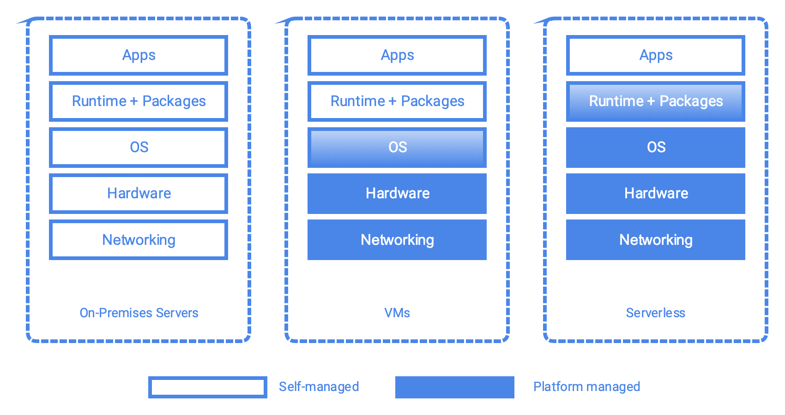
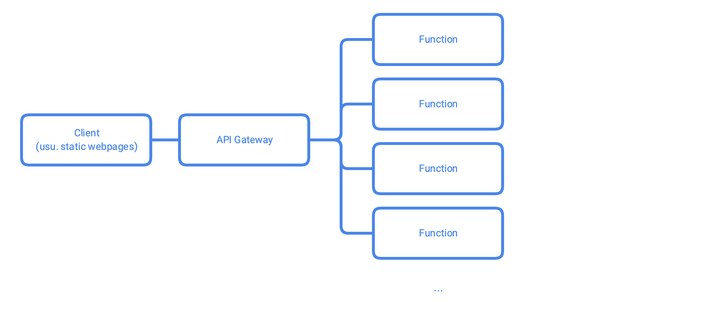
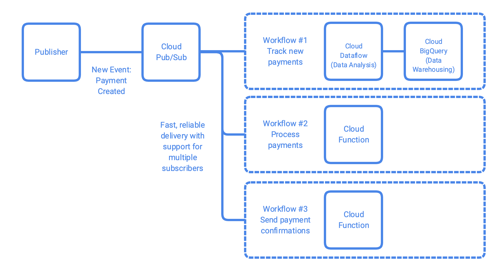
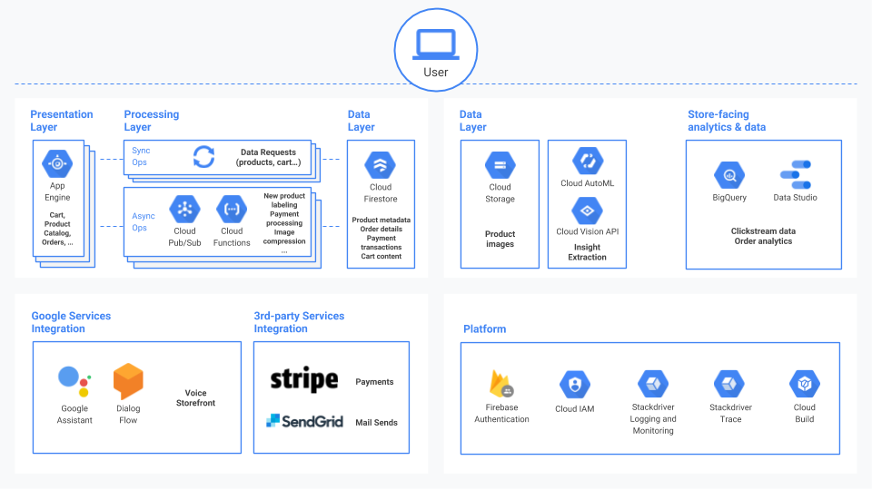

Serverless on Google Cloud Platform: an Introduction with Serverless Store Demo

# Serverless on Google Cloud Platform: an Introduction with Serverless Store Demo

[Ratros Y.](https://medium.com/@ratrosy?source=post_page-----41992dec085----------------------)

[Jan 24](https://medium.com/google-cloud/serverless-on-google-cloud-platform-an-introduction-with-serverless-store-demo-41992dec085?source=post_page-----41992dec085----------------------) · 8 min read

> This document is the opening piece of the *> Serverless on Google Cloud Platform: an Introduction with Serverless Store Demo How-to Guide*> . It discusses briefly serverless computing and its patterns in the context of Serverless Store, a web e-commerce demo app for showcasing serverless products and services on Google Cloud Platform. **> Serverless Store is not an official Google product.**

> Serverless Store is featured in > [> Google Cloud Global Digital Conference 2019](https://cloudonair.withgoogle.com/events/app-dev)> . View the keynote and breakout recordings to learn more.

# What’s a server?

Deploying a service used to be a tremendous commitment: to get everything up and running, developers and operators have to build a server, setup OS and network, install a variety of dependencies and prepare for years (if not longer) of upgrade and maintenance ahead. Nowadays many developers choose to use virtual machines (VMs) provided by Google, Amazon, and other cloud service providers instead, leveraging their experience in hardware and networking for better, more secure and more reliable service deployments. Nonetheless, VMs are still servers; the fact that they are running on the cloud in a virtualized form does not eliminate heavy server management workload. Additionally, VM deployments require careful capacity planning and they are charged per-second; in other words, every idling core and unit of RAM are a waste of budget.

Serverless computing promises a pay-as-you-go future with (almost) no server management at all. Serverless platforms take the code from developers and perform all the deployment tasks (networking, dependencies, maintenance, etc.) automatically behind the scenes. The greatest advantage serverless computing provides is that the deployment scales itself without additional configuration; your apps will always have exactly what they need computationally (within an understandable margin of error, of course) when running.

This is not saying that serverless computing is an ideal solution for every use case. Going serverless implies that you trust Google Cloud Platform, AWS, or other cloud service providers to manage a large portion of your computing stack for you and expect them to perform as you hope, which may not be the case in some scenarios. More importantly, the architecture of your app has a great impact on how well serverless computing keeps its no-server-management easily-scalable promise: for example, if you use a VM-based database backend solution, such as a [Cloud SQL](https://cloud.google.com/sql/) instance, with your serverless function deployment, its scalability will be heavily limited by the performance of the SQL instance, and [unexpected errors may occur](https://cloud.google.com/functions/docs/sql#best_practices_for_cloud_sql_in_cloud_functions) if you are not careful enough.

## Serverless and FaaS (Function as a Service)

The ever growing popularity of AWS Lambda and Google Cloud Functions leads many to believe that FaaS (Function as a Service) is a synonym for serverless computing. FaaS platforms take a function from developers, build it into an app, and deploy it in the cloud; it advocates a quite special pattern for app development, where an app is broken down into a collection of functions, grouped by a (managed) gateway, and accessed by users via static HTML files served online:

Effectively transforming the backend into an API service, this signature architecture enjoys all the benefits of serverless computing (little to none server management, scalability, low cost), and enables team collaboration on a different level (UI design, for instance, is now decoupled; team members may each work on their own functions as opposed to a full app). Many developers have successfully adopted the pattern and created compelling experiences with minimal amount of effort.

But there is a catch. This distinct design is, as with serverless computing in general, not perfect for all use cases, and bears the risk of gruesome fragmentation: without careful coordination developers may end up with a large number of functions difficult to assess, monitor, maintain, orchestrate, and keep a complete picture of, in many ways akin to a 100,000-piece jigsaw puzzle. The architecture is also fairly new; it takes some time for developers and teams to adapt to, and they may need to overhaul their workflows to accommodate.

[Serverless and FaaS are not necessarily the same](https://hackernoon.com/the-serverless-series-what-is-serverless-d651fbacf3f4), and it would be dangerous to force a function mindset. It is recommended that developers experiment with serverless solutions and integrate them into their apps to the extent they are most comfortable with. For teams with a comprehensive knowledge of serverless computing, it might be OK to build a service from ground up using nothing but functions; those who are interested in but not yet very comfortable with serverless computing should, however, consider taking a hybrid approach and migrating some select compatible workload to serverless platforms first. Serverless is, after all, a flexible misnomer.

# Event-driven computing

Generally speaking, code in an app is executed sequentially. The sequence (or execution path) is essentially a contract crystalized in the deployment, triggered by an input (request) and finishes with an output (response). The input, output, and the sequence are bundled inseparably together in the contract; once deployed, it cannot be modified. Developers will have to modify the code and re-deploy.

Event-driven computing plans to break the contract and free all the parts involved in the sequence. Parts now emit an event (a piece of message with execution contexts) at the time of completion; they cares little about what happens next, and leaves the following step at the discretion of whatever delivers the event, which, for cloud-native applications, is usually a data/event streaming solution, such as [Google Cloud Pub/Sub](https://cloud.google.com/pubsub/) and [Apache Kafka](https://kafka.apache.org/). Parts that send events are event publishers, and those that receive events become event subscribers.

This publisher/subscriber pattern grants greater development freedom and easier team collaboration. It is now possible to hot plug/swap blocks of code without redeployment, and developers can easily add multiple subscribers to the same event stream, creating a fan-out structure. One of the most prominent use cases of such structures is real-time data analytics:

Traditionally, data analysts process data in batch, usually via auto-generated log files. The application executes a sequence, writes the details to logging agents (as a step of the sequence), and data analytics team extracts insight from them, with an understandable delay. In event-driven systems, however, once connected to the event stream as one of the subscribers, data analytics team can get the data they need in real time without interrupting normal operations. If connected to real-time data processing and warehousing solutions such as [Google Cloud Dataflow](https://cloud.google.com/dataflow/) and [Google BigQuery](https://cloud.google.com/bigquery/), developers can have analysis done in real-time as well.

The data/event streaming solutions themselves also offer great help in application development. You can set up Google Cloud Pub/Sub, for example, to reattempt delivery automatically when one of the subscribers is experiencing temporary technical difficulties. Cloud Pub/Sub also supports [snapshot](https://cloud.google.com/pubsub/docs/reference/rest/v1/Snapshot), enabling developers to go back in time and replay events, which can be particularly helpful when testing new pieces of code.

Event-driven computing works particularly well with serverless computing. Events are natural triggers for serverless deployments; more importantly, the (almost) infinite scalability of serverless computing platforms allows message queues to pass events around as fast as possible, saving the trouble of capacity planning commonly witnessed in VM-based deployments.

## Synchronous operations

Breaking the contract of sequential code execution has some serious complications, with the most important being the dissociation of inputs (requests) and outputs (responses). In the world of event-driven computing, requests and responses arrive in two separate dimensions; whoever sends the request are not naturally guaranteed a response. For asynchronous operations it is usually fine: when people post a new photo in their social feeds they usually do not expect it to show up in the feeds of their friends immediately; quick feedback is appreciated but not required. Synchronous operations, however, are a different story. When people open a website, they expect the page to load as quickly as possible; no other actions can be performed until the contents show up. Event-driven computing, unfortunately, does not work well in this scenario, as the request is considered served when the event is published; developers have to manually retrieve the response.

There are many solutions that address this issue, though none of them is perfect. Common strategies include using statically generated pages throughout the app, polling the system for results right after event publishing, and setting up dedicated asynchronous routines for synchronous operations when required (for example, when people request a webpage, prepare it synchronously first, then publish an event to the message queue so that event subscribers can track the action). Once again, it is up to developers themselves to decide how far they would like to go with event-driven computing; for some apps it may be a heavenly solution.

# About Serverless Store Demo

As introduced earlier, Serverless Store is an e-commerce app designed to showcase serverless products and services on Google Cloud Platform. Note that it is for demonstration purposes only and does not necessarily reflect best practices in the app development.

Serverless Store features a fully serverless architecture. It runs on two Google provided serverless computing platforms, [Google App Engine](https://cloud.google.com/appengine/) and [Google Cloud Functions](https://cloud.google.com/functions/), with all of its components, storage, data analytics, machine learning/AI, etc., supported by managed services. There are no VMs involved at all. The app is scalable, and you pay only what the app uses.

Serverless Store consists of both app and functions. It is a hybrid, featuring a standard (traditional, if you may) Python [flask](http://flask.pocoo.org/) web app as the centerpiece, with many critical and supplementary features served by Cloud Functions. For people who prefer the FaaS pattern, with a relatively small amount of effort it is possible to make Serverless Store purely function-based; you can also easily revert it back to a web app with no Cloud Function workers at all, ready for VM deployment.

Additionally, Serverless Store adopts event-driven computing for all asynchronous operations in the app. Synchronous operations, such as listing products, are still performed in a sequential manner. It is hoped that this approach can help interested developers ease into event-driven computing, a fairly new pattern, and better discover its benefits and limitations.

# Architecture at a glance

You can view live demos of Serverless Store [in these keynotes](https://cloudonair.withgoogle.com/events/app-dev/).

[Download the project here](https://github.com/GoogleCloudPlatform/serverless-store-demo).

# Before you begin

- Create a new Google Cloud Platform project. Skip this step if you prefer using an existing one:

1. Sign into [Google Cloud Console](https://console.cloud.google.com/) with your Google Account.

2. Click **Select a project** or the name of your existing project at the top of the page.

3. Click **New project** and follow the prompts on screen.

- Enable Billing. Google Cloud Platform provides $300 credit for new customers, and your usage may be eligible for Google Cloud Platform free-tier. For more information, see [GCP Free Tier](https://cloud.google.com/free/).
- [Install Google Cloud SDK](https://cloud.google.com/sdk/).

# What’s next

Guides below introduces briefly each product and service used in the Serverless Store demo app and explains how they are integrated in the app. Follow them to set up Serverless Store:

- [Set up Serverless Store: Auth, Storage, Event Streaming, and Third-Party APIs](https://medium.com/@ratrosy/set-up-serverless-store-part-1-auth-storage-event-streaming-and-third-party-apis-c4274a408574) (Firebase Authentication, Cloud Storage, Cloud Firestore, Cloud Pub/Sub and Third-Party APIs)
- [Set up Serverless Store: Machine Learning, AI, Data Analytics, and Data Visualization](https://medium.com/@ratrosy/set-up-serverless-store-part-2-machine-learning-api-data-analytics-and-data-visualization-c1399f92b4c8) (Cloud Vision API, Cloud AutoML, DialogFlow +Google Assistant integration, BigQuery and Data Studio)
- [Set up Serverless Store: Serverless Computing, Management Tools, and Cron Jobs](https://medium.com/@ratrosy/set-up-serverless-store-part-3-computing-cron-jobs-and-management-tools-34d51475df70) (App Engine, Cloud Functions, Cloud Scheduler, Stackdriver Logging, Stackdriver Monitoring, and Stackdriver Tracing)

See [Further Discussions](https://medium.com/@ratrosy/set-up-serverless-store-further-discussion-ea6c4d04167a) for some tips and notes about Serverless Store.

[Watch Google Global Digital Conference 2019](https://cloudonair.withgoogle.com/events/app-dev).