Simple Binary Data Visualization |

# Introduction

A few days ago I ran across [this discussion on Hacker News](https://news.ycombinator.com/item?id=15164166), which referred to[this article](https://codisec.com/binary-visualization-explained/) on binary data visualization. The folks at [Codisec](https://codisec.com/) have developed a tool called Veles for visualizing binary files. The idea is to help detect patterns in the data, which in some cases are useful for e.g,. security-related analysis.

The technique described was surprisingly simple, in that it looks at digrams or trigrams in the file, and then it analyses their frequency and spatial distribution within the data. This is not unlike the use of *n-grams* in computational linguistics, or *k-mers* in computational genomics. The idea is to analyze and model sequences of elements (be it words, phonemes, or DNA bases). A fun application of this type of analysis is the creation of Markov chain text generators, which use the probability distribution of n-grams in a text corpus to synthesize text with similar characteristics. A couple of popular examples of these generators is the creation of [parody post-modernist writings](http://www.elsewhere.org/pomo/), or [bogus scientific papers](https://pdos.csail.mit.edu/archive/scigen/#about) (many of which have been accepted to predatory conferences and journals, to the amusement and dismay of many).

Basically, the approach taken in Veles is to take byte trigrams of the form (i,i+1,i+2)(i,i+1,i+2) from the file, and use them to represent points in a 3D space (a digram-based 2D version is also described). Being sequences of bytes, the space is limited to a 256x256x256 cube. The Veles visualization uses luminance to represent the (normalized) frequency of each point in the file, resulting in very nice-looking, and surprisingly structured visualizations. The tool also assigns different hues to points, based on their position in the file (which is divided into 256 equally-sized bins for this purpose).

# A Simple Take on Binary Visualization

In this post, I'll show how a similar type of visualization can be simply created in a few lines of R, using `ggplot2`. We'll make 2d plots instead of the (admittedly nicer looking) 3d ones that Veles does, but similar information about the structure of the files can be gleaned from them.

## Getting Our Data in Shape

Our data will be the bytes in the file, repeated twice next to each other with an offset of one for each repetition. This is a common pattern for example in Haskell and Lisp, basically `zip='ping a list with its own tail. In R, we can use the =lead` or `lag` functions provided in Hadley Wickham's `dplyr` package.

	  library(tidyverse)

	  a <- 1:10
	  lead(a)

Loading tidyverse: ggplot2
Loading tidyverse: tibble
Loading tidyverse: tidyr
Loading tidyverse: readr
Loading tidyverse: purrr
Loading tidyverse: dplyr

Conflicts with tidy packages ---------------------------------------------------

filter(): dplyr, stats
lag(): dplyr, stats
[1] 2 3 4 5 6 7 8 9 10 NA

We can see that `lead` has shifted `a` to the left, introducing a `NA` value at the end. If we create a dataframe of tibble with `a`, `lead(a)` and `lead(lead(a))` , we will obtain a table of trigrams.

	 zipped <- as.tibble(cbind(a, lead(a), lead(a,2)))
	 glimpse(zipped)

Observations: 10
Variables: 3
$ a  1, 2, 3, 4, 5, 6, 7, 8, 9, 10
$ ``  2, 3, 4, 5, 6, 7, 8, 9, 10, NA
$ ``  3, 4, 5, 6, 7, 8, 9, 10, NA, NA

This is close to what we need, except for the `NA` values, which we can easily remove with `drop_na`, `na.omit`, or `filter`.

	 zipped %>% drop_na()

# A tibble: 8 x 3

a `` ``     1 1 2 3
2 2 3 4
3 3 4 5
4 4 5 6
5 5 6 7
6 6 7 8
7 7 8 9
8 8 9 10

## Plotting

We will use a basic scatter plot to visualize our data. In order to make up for the lack of a third dimension in the plots, we will use a couple of tricks to add more information. First, we'll use a low alpha value, which will help us get a notion of density in the plot (we'll later add actual density plots, too). The more times an (x,y)(x,y) pair (corresponding to bytes (i,i+1)(i,i+1) in the file) is found in the data, the more opaque it'll show on the scatter plot. Second, we'll use the zz (corresponding to byte i+2i+2) to determine the color of the point. In this way, we will pack more information into the plot. We will also discuss other possible alternatives for visualizing this information at the end of the post.

For the time being, we won't consider the location within the file, though as we will see, it would be simple to add this information as well.

Let us quickly see how we can setup the visualization.

	  x <- sample(0:255, size=50000, replace = TRUE)
	  y <- lead(x)
	  z <- lead(x,2)
	  data <- cbind(x,y,z) %>% as.tibble() %>% na.omit()
	  binplot <- data %>% ggplot(aes(x=x, y=y)) +
	             geom_point(mapping = aes(color = z), alpha = 1/20) +
	             scale_color_gradient(low="blue", high="orange") +
	  ggsave("testplot.png")

Saving 7 x 7 in image
We can now look at the resulting plot:
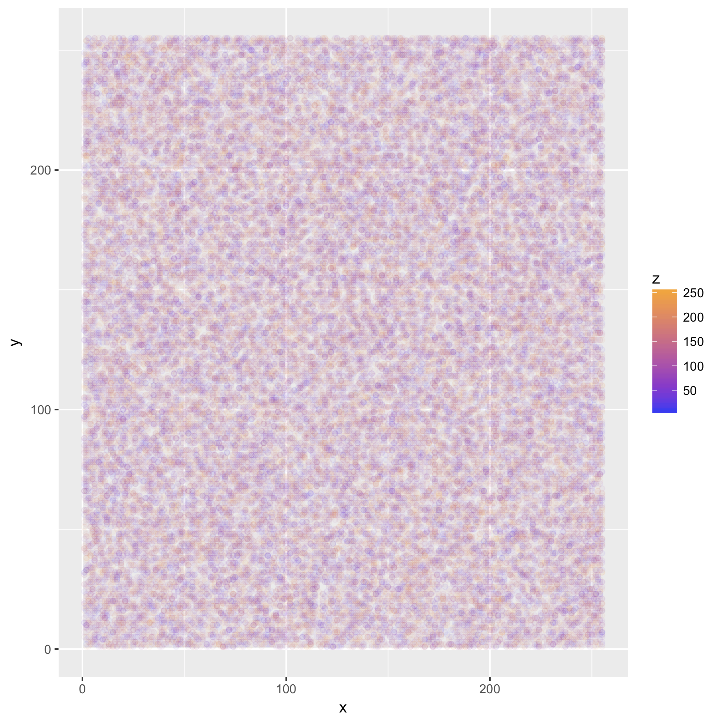

The plot does not look like much, because we sampled uniformly distributed random data. However, if we read a file with some structure, we will see something more interesting. For some extra "meta-ness", we'll use the source for this post as an input.

	  filesize <- file.size("post_draft.org")
	  x <- readBin("post_draft.org", integer(), n=filesize, size = 1, signed = FALSE)
	  y <- lead(x)
	  z <- lead(x,2)
	  data <- as.tibble(cbind(x,y,z)) %>% na.omit()
	  binplot <- data %>% ggplot(aes(x=x, y=y)) +
	             geom_point(mapping = aes(color = z), alpha = 1/20) +
	             scale_color_gradient(low="blue", high="orange", limits = c(0,255)) +
	             coord_cartesian(xlim = c(0,255), ylim = c(0, 255))
	  ggsave("testplot2.png")

Saving 7 x 7 in image
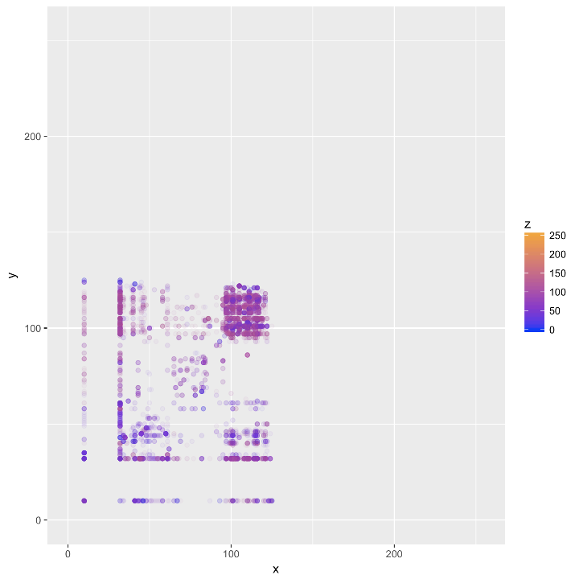

Now this is a bit more interesting! What we can see here, is that most of the data is confined to a small section of our space. In particular, we can see both from the points' color, and areas where points appear, that most values are in the ASCII range (which is to be expected, this mostly being English text, and ASCII codes stay the same even in an UTF-8 encoded file), with most trigrams comprising characters in the (97—122) range, corresponding to `[a-z]` (and to a lesser degree those in `[A-z]` ) and spaces (32). Where we see more transparent points, we can infer the presence of punctuation and tokens found in the R code and org-mode mark-up.

In some cases, using a different coordinate system may be useful in distinguishing structure. We can use, for instance, polar coordinates.

	   polar_plot <- binplot + coord_polar()
	   ggsave("testplot2_polar.png")

Saving 7 x 7 in image
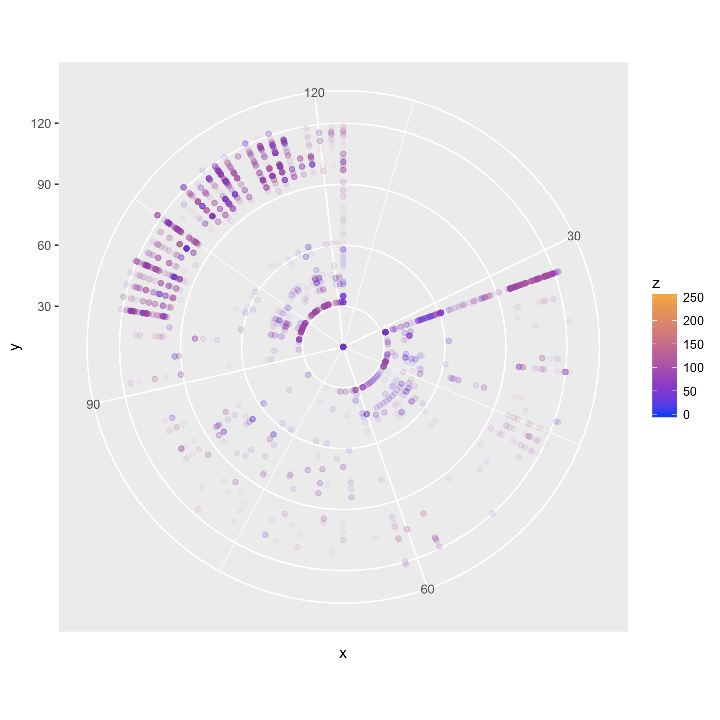

Here we can also clearly see the predominance of digrams in the `[A-z]` range, and of combinations of those and spaces (the line pointing towards 32 in the NE quadrant, and the segment of arc at 32 in the NW quadrant).

We can also think about looking purely at the density of digrams. To this end, we use a different geometry and stat in our plot.

	  dens_plot <- data %>% ggplot(mapping = aes(x,y)) +
	               stat_density2d(aes(fill = ..density..), geom="raster", contour = FALSE) +
	               scale_fill_gradient(low="steelblue4", high="sienna2") +
	               coord_fixed(ratio = 1)
	  ggsave("testplot2_density.png")

Saving 7 x 7 in image
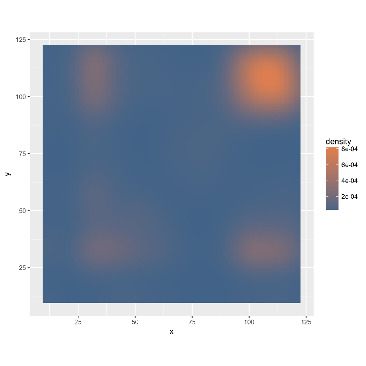

In this case, the density plot does not provide much additional information, but it could be useful if we were for instance to facet the plot based on where in the file the digrams occur, or in more complex files, where the trigram-based coloring may obscure some of the structure.

The density plot is also more resource-intensive, and when dealing with large files, it may be desirable to work only on parts of the data, even for the basic trigram-based plots. In order to do this, we can uniformly sample the data, and thus obtain a lower resolution, but still informative view of it.

# A More Complete Solution

Before putting this to practice with larger, more complex files, let us put the ideas for processing and visualizing the data into a bit more complete form in R code.

We will create a small set of functions that allow us to play around with these kinds of visualizations, and output the plots with an automated and systematic naming scheme, which we could use for automatic report generation or some such at a later stage.

	library(tidyverse)

	# binviz Veles-like binary visualizaiton
	binViz2d <- function(filename, alpha = 1/100, maxsize = 5000000,
	                    save = TRUE, polar = FALSE, sample = FALSE,
	                    sample_size = 2000000, do_density = FALSE){

	  # setting dens_plot as NA simplifies the logic below a bit
	  dens_plot = NA

	  # we read the file as a stream of bytes, and prepare our tibble
	  # We'll add a column indexing the trigram position in the file
	  # This will come in handy later if we want to facet the plot by position
	  # as done in the Veles article. We'll just mutate binViz here, to save memory.
	  rawdata          <- readBin(filename, integer(), n=maxsize, size = 1, signed = FALSE)
	  size             <- rawdata %>% as.tibble %>% nrow
	  binViz           <- cbind(0:(size - 1),rawdata, lead(rawdata), lead(rawdata,n=2L))
	  colnames(binViz) <- c('idx', 'x', 'y', 'z')

	  # We then remove any missing values from the dataset
	  toplot <- binViz %>% as.tibble %>% na.omit

	  # If sampling is required, we do it now. Sampling is important
	  # if doing the density plots, as going beyond 1M points gets SLOW
	  if(sample){
	   toplot <- toplot %>% sample_n(min(count(toplot), sample_size))
	  }

	  # The actual plotting
	  theplot <- binViz2d_do_plot(toplot, alpha, polar) +
	    ggtitle(title_spec(filename, sample, sample_size))
	  if(do_density){
	    dens_plot <- binViz2d_do_density_plot(toplot, polar)
	  }

	  # Saving the plots
	  if(save){
	    namespec <- name_spec(filename, sample, sample_size, polar)
	    binViz2d_save(namespec, theplot, dens_plot)
	  }
	  return(list(binViz_plot = theplot, dens_plot = dens_plot))
	}

The main functionality of our code is succinctly described in the `binViz2d` function above. It takes a number of parameters, summarized in the table below:

Parameter Name
Description
[object Object]
File to visualize
[object Object]

Alpha level (transparency) of the dots (lower values are useful for larger files)

[object Object]
Maximum number of bytes to read from the file, if not sampling
[object Object]
Determines whether the plot should be saved to a file
[object Object]
Determines whether the plot should use polar coordinates
[object Object]
Determines whether the file should be sampled
[object Object]
The number of samples to take, if sampling
[object Object]
Whether to do an additional density plot (sampling is *strongly advised*

The function returns the visualization and density plots (note that the density plot may be `NA`) in a list (this list can be easily destructured using the `zeallot` package).

The main plotting functions are as follows.

	binViz2d_do_plot <- function(data, alpha, polar){
	  theplot <- data  %>% ggplot(mapping = aes(x,y)) +
	    geom_point(mapping = aes(color=z), alpha = alpha, size = 0.75) +
	    scale_color_gradient(low="blue", high="orange") +
	    coord_fixed(ratio = 1)+
	    labs(x="i", y="i+1", z="i+2")

	  if(polar){
	    theplot <- theplot + coord_polar()
	  }
	  return(theplot)
	}

	binViz2d_do_density_plot <- function(toplot, polar){
	  dens_plot <- toplot  %>% ggplot(mapping = aes(x,y)) +
	    stat_density2d(aes(fill = ..density..), geom="raster", contour = FALSE) +
	    scale_fill_gradient(low="steelblue4", high="sienna2") +
	    coord_fixed(ratio = 1)+
	    labs(x="i", y="i+1")
	  return(dens_plot)
	}

These are pretty much the same as we had done above, only in function form.

The remaining auxiliary functions take care of generating suitable titles and filenames, as well as saving the plots.

	title_spec <- function(name, sampled, nsamples){
	  if(sampled){
	    title <- paste(name, "-", nsamples, "samples.")
	  }else{
	    title <- name
	  }
	  return(title)
	}

	# We create a name separated by underscores, this simplifies later parsing
	# of file names, if needed, to automate e.g., reports creation
	name_spec <- function(name, sampled, nsamples, polar){
	  polar_str     <- ""
	  if(polar){
	    polar_str   <- "polar"
	  }
	  sampled_str   <- ""
	  if(sampled){
	    sampled_str <- paste("sampled", nsamples, sep="_")
	  }
	  basename <- chartr('/.', '::',
	                     paste("plot", polar_str, sampled_str, name, sep = "_"))
	  return(paste(basename, ".png", sep=""))
	}

	binViz2d_save <- function(namespec, binViz_plot, dens_plot){
	    png(namespec, width = 15, height = 15, units = "cm", res = 300)
	    print(binViz_plot)
	    dev.off()
	    if(!is.na(dens_plot)){
	      png(paste("density",namespec,sep="_"), width = 15, height = 15,
	          units = "cm", res = 300)
	      print(dens_plot)
	      dev.off()
	    }
	}

Like this, in under 100 lines of R (under 75 if removing comments and blank lines), we can create nice and informative visualization for binary data.

# Going a Bit Further

As mentioned above, the Veles solution does some nice things, such as coloring points based on their location in the file, and also they do a tomography-like view of the 2d digram plot, by layering the plots for different parts of the file on top of each other.

We can achieve comparable effects by adding facets to our plots. In the code above, we have added some meta-data in the form of an index column. We can use that column to create a *cut* of the data, and then facet on this.

	#let's load the code we wrote above
	source("binViz2d/binViz2d.r")
	library(zeallot)
	c(p,d) %<-% binViz2d("post_draft.org", save=FALSE)
	fp <- p + facet_wrap(~cut(idx, 10, labels=FALSE))
	ggsave("testplot2_faceted_idx.png", width = 20, height = 20, units = "cm")

Loading tidyverse: ggplot2
Loading tidyverse: tibble
Loading tidyverse: tidyr
Loading tidyverse: readr
Loading tidyverse: purrr
Loading tidyverse: dplyr

Conflicts with tidy packages ---------------------------------------------------

filter(): dplyr, stats
lag(): dplyr, stats
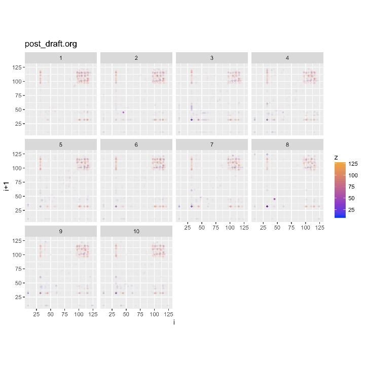

Adding the facets to the plot allows us to see how the structure of the file varies along its length. For this case, there isn't a noticeable difference, since the file is just text.

We can do another neat thing, which is to facet on the value of the `z` byte in the trigram, and that will show us the densities of different levels in the file contents. In the case of this post draft, we should be able to see areas with

	c(p,d) %<-% binViz2d("post_draft.org", save=FALSE)
	lp <- p + facet_wrap(~cut(z, 10))
	ggsave("testplot2_faceted_value.png", width = 20, height = 20, units = "cm")

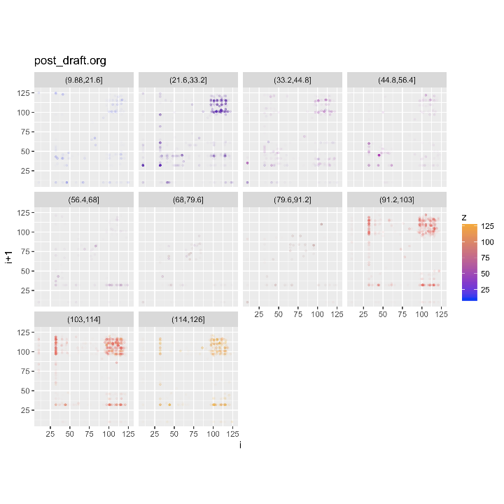

Here we can clearly see again that most of the file's contents seems to fall in the ASCII range, with concentrations of space characters, and other characters in the `[A-z]` range, plus some occurrences of punctuation.

# More Interesting Examples

More interesting examples of this type of visualization are possible when looking at more complex files. Below we show a few of these.

## Executable Code and Libraries

The plots below show the structure of (Darwin) executable and library files.

	 binViz2d("emacsclient", alpha=1/20)
	 binViz2d("libasan.4.dylib", alpha=1/150)
	 binViz2d("libR.dylib", alpha=1/150)

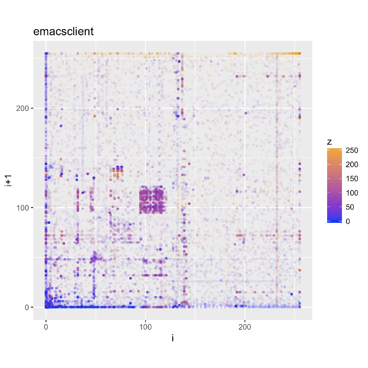
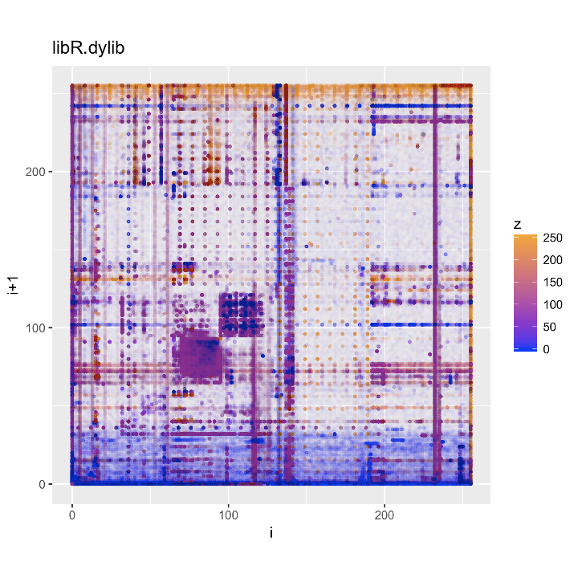
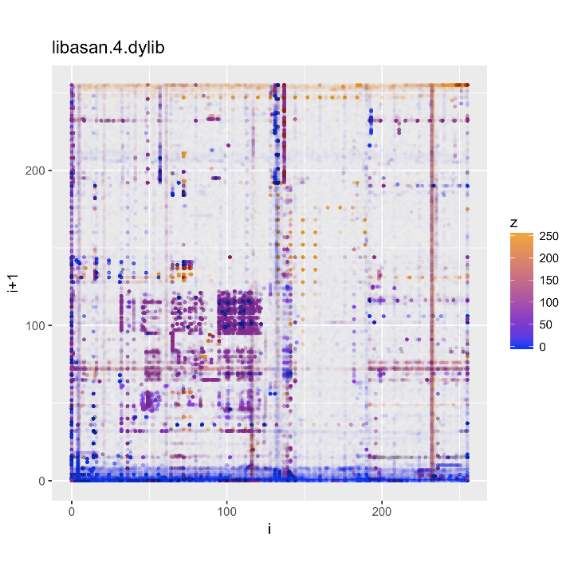

We can see that these files have more structure to them, and exhibit some common patterns, such as much higher frequencies for low values and values corresponding to upper-case ASCII characters, as well as a significant amount of points in the `[a-z]` range, as well. Looking at the strings in those binaries, we can find very many upper-case constant names, along with e.g., error messages, which help explain the observed value distribution.

For a different perspective, we can look at the polar projection of one of these plots.

	 binViz2d("libR.dylib", alpha=1/150, polar=TRUE)

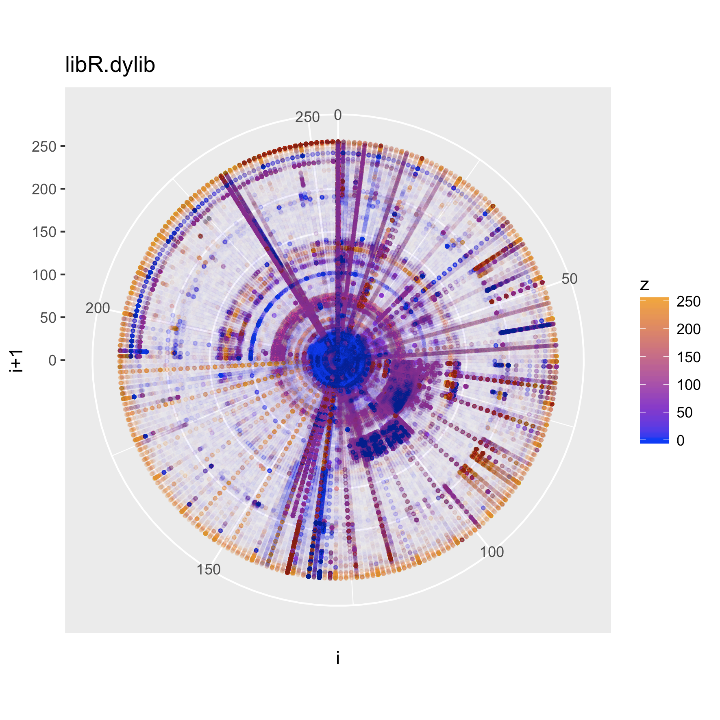

We can also look at a faceted version of a plot, looking at how the trigrams change throughout the file.

	c(p,d) %<-% binViz2d("emacsclient", save=FALSE)
	lp <- p + facet_wrap(~cut(idx, 20))
	ggsave("emacsclient_faceted_idx.png", width = 20, height = 20, units = "cm")

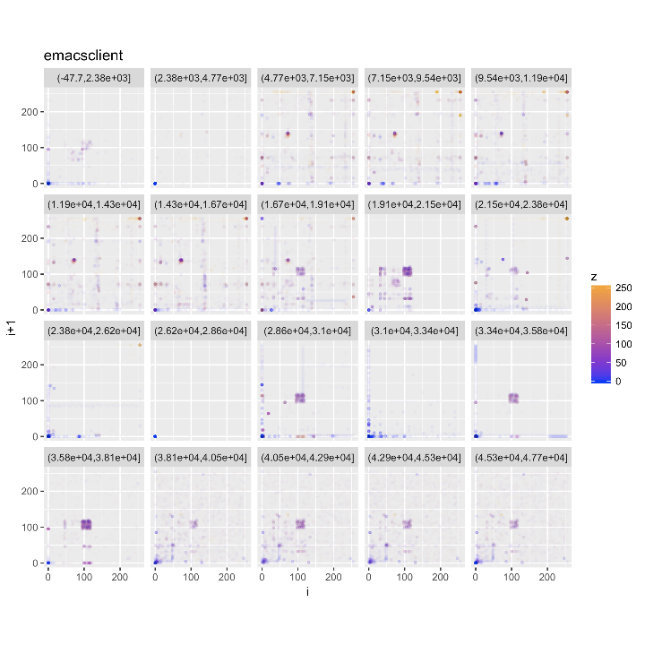

## PDF Content

PDF files show very distinctive properties as well. Here we look at a scientific paper and a programming book.

	 binViz2d("tommSurvey.pdf", alpha=1/150)
	 binViz2d("cookbook.pdf", alpha=1/150)

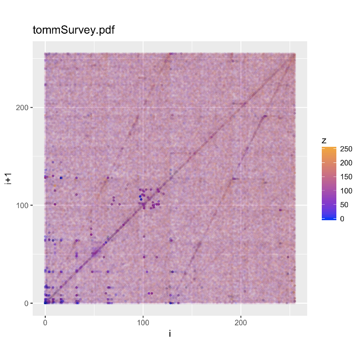
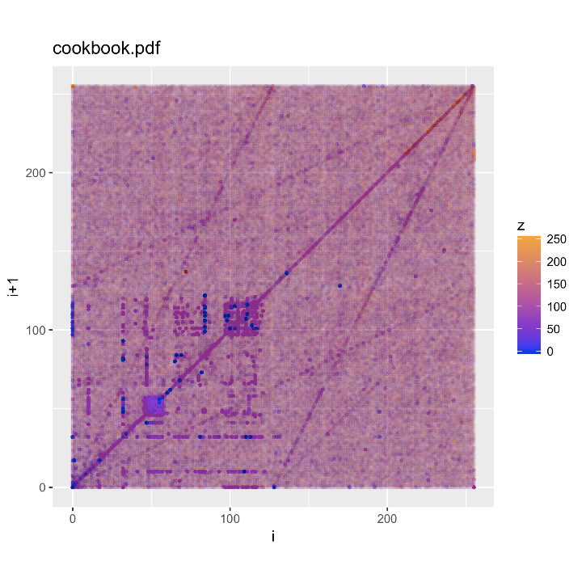

We notice that there are quite striking similarities among the plots. In particular, a set of "lines" appear along the main diagonal of the plot, and from the (0,0) and (255,255) points towards the mid-range of each axis. As expected, there's also a large concentration of trigrams in the character parts of the ASCII range.

We can look at a faceted view of the plot to see if the distribution changes either on the index or the values observed.

	c(p,d) %<-% binViz2d("tommSurvey.pdf", save=FALSE)
	lp <- p + facet_wrap(~cut(z, 12))
	ggsave("tommSurvey_faceted_value.png", width = 20, height = 20, units = "cm")
	ip <- p + facet_wrap(~cut(idx, 12))
	ggsave("tommSurvey_faceted_idx.png", width = 20, height = 20, units = "cm")

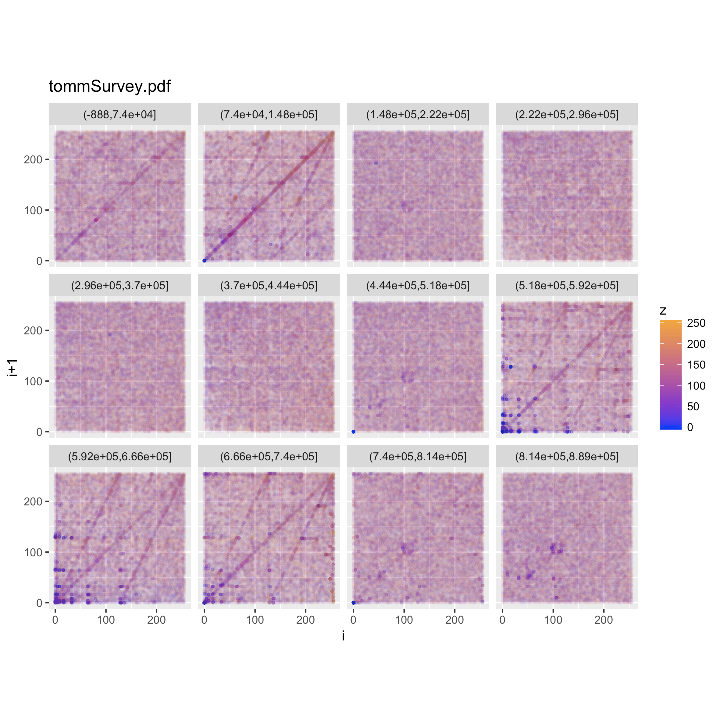

When looking at how the line structure is noticeable throughout the file, we can see that there are portions of the file in which it vanishes, whereas in others it (or a part of it) becomes more prominent.

Looking at the values below, however, shows that a) all the range of values is nearly uniformly represented throughout the file, and b) the main diagonal line structure is noticeable for all the value ranges, but the secondary ones are visible only in certain value ranges. Finding out the actual meaning of this would probably be a non-trivial task, left as an exercise to the reader ;).

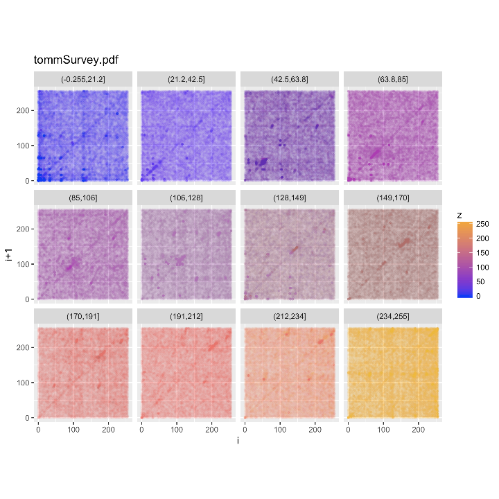

## Audio

When looking at media files, which tend to be large, it is good to try sampling the content, in order to reduce the time (and memory) required for creating the visualizations. We will look at a music clip, uncompressed, and then encoded as MP3 and FLAC.

	 binViz2d("Test_File_2_0_STEREO_PCM.wav", alpha=1/100,
	                                          sample = TRUE, sample_size = 400000)
	 binViz2d("Test_File_2_0_STEREO_MP3.mp3", alpha=1/100,
	                                          sample = TRUE, sample_size = 400000)
	 binViz2d("Test_File_2_0_STEREO_FLAC.flac", alpha=1/100,
	                                          sample = TRUE, sample_size = 400000)

We note that the relative resolution of each plot will be different, as we are sampling the same amount of data out of files of very different size. In the case of the uncompressed audio, the sample is less than 1% of the total file, whereas for the FLAC it's a bit under 5 percent, and for the MP3 version it is almost 20 percent. Still, the patterns observed in the plots are quite constant, even varying the sampling size between 25% and 500% of the value chosen here.

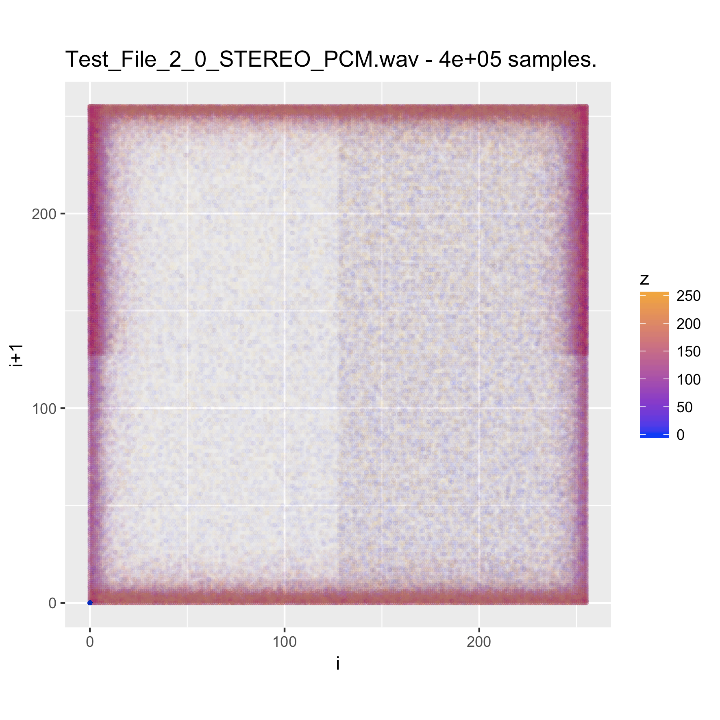

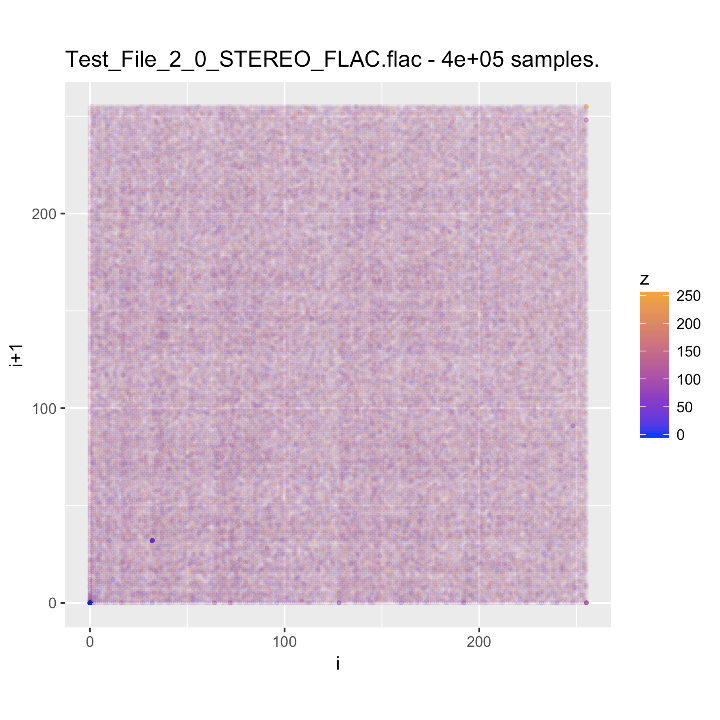

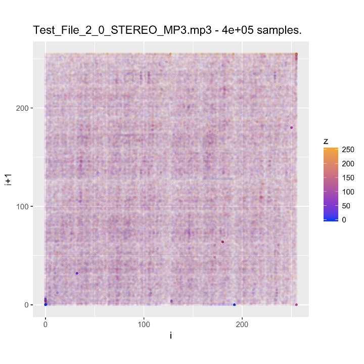

It's interesting to note that while the uncompressed file has a very clear structure, the compressed versions seem almost random. This pattern is also visible for compressed images, and of course, for encrypted files. Between the compressed versions, it seems like the FLAC-encoded one shows less structure than the MP3-encoded one, where some patches of the space are denser. I suspect that this is probably related to the lossy nature of MP3 encoding, but haven't yet delved into it.

# Conclusions

I hope you have found this post interesting, and maybe caught an idea or two about how this type of approach could be useful, and more importantly, how a simple visualization technique can yield interesting plots that reveal "hidden" structure in data.

The code used to generate the plots can be found in the gist below, and it's free to be used.

|     |     |
| --- | --- |
| 1   | library(tidyverse) |
| 2   |     |
| 3   | # binviz Veles-like binary visualizaiton |
| 4   | binViz2d  <-  function(filename, alpha  =  1/100, maxsize  =  5000000, |
| 5   |  save  =  TRUE, polar  =  FALSE, sample  =  FALSE, |
| 6   |  sample_size  =  2000000, do_density  =  FALSE){ |
| 7   |     |
| 8   |  # setting dens_plot as NA simplifies the logic below a bit |
| 9   |  dens_plot  =  NA |
| 10  |     |
| 11  |  # we read the file as a stream of bytes, and prepare our tibble |
| 12  |  # We'll add a column indexing the trigram position in the file |
| 13  |  # This will come in handy later if we want to facet the plot by position |
| 14  |  # as done in the Veles article. We'll just mutate binViz here, to save memory. |
| 15  |  rawdata  <- readBin(filename, integer(), n=maxsize, size  =  1, signed  =  FALSE) |
| 16  |  size  <-  rawdata %>% as.tibble %>% nrow |
| 17  |  binViz  <- cbind(0:(size  -  1),rawdata, lead(rawdata), lead(rawdata,n=2L)) |
| 18  | colnames(binViz) <- c('idx', 'x', 'y', 'z') |
| 19  |     |
| 20  |     |
| 21  |  # We then remove any missing values from the dataset |
| 22  |  toplot  <-  binViz %>% as.tibble %>% na.omit |
| 23  |     |
| 24  |  # If sampling is required, we do it now. Sampling is important |
| 25  |  # if doing the density plots, as going beyond 1M points gets SLOW |
| 26  |  if(sample){ |
| 27  |  toplot  <-  toplot %>% sample_n(min(count(toplot), sample_size)) |
| 28  | }   |
| 29  |     |
| 30  |  # The actual plotting |
| 31  |  theplot  <- binViz2d_do_plot(toplot, alpha, polar) + |
| 32  | ggtitle(title_spec(filename, sample, sample_size)) |
| 33  |  if(do_density){ |
| 34  |  dens_plot  <- binViz2d_do_density_plot(toplot, polar) |
| 35  | }   |
| 36  |     |
| 37  |  # Saving the plots |
| 38  |  if(save){ |
| 39  |  namespec  <- name_spec(filename, sample, sample_size, polar) |
| 40  | binViz2d_save(namespec, theplot, dens_plot) |
| 41  | }   |
| 42  |  return(list(binViz_plot  =  theplot, dens_plot  =  dens_plot)) |
| 43  | }   |
| 44  |     |
| 45  | binViz2d_do_plot  <-  function(data, alpha, polar){ |
| 46  |  theplot  <-  data %>% ggplot(mapping  = aes(x,y)) + |
| 47  | geom_point(mapping  = aes(color=z), alpha  =  alpha, size  =  0.75) + |
| 48  | scale_color_gradient(low="blue", high="orange") + |
| 49  | coord_fixed(ratio  =  1)+ |
| 50  | labs(x="i", y="i+1", z="i+2") |
| 51  |     |
| 52  |  if(polar){ |
| 53  |  theplot  <-  theplot  + coord_polar() |
| 54  | }   |
| 55  |  return(theplot) |
| 56  | }   |
| 57  |     |
| 58  | binViz2d_do_density_plot  <-  function(toplot, polar){ |
| 59  |  dens_plot  <-  toplot %>% ggplot(mapping  = aes(x,y)) + |
| 60  | stat_density2d(aes(fill  = ..density..), geom="raster", contour  =  FALSE) + |
| 61  | scale_fill_gradient(low="steelblue4", high="sienna2") + |
| 62  | coord_fixed(ratio  =  1)+ |
| 63  | labs(x="i", y="i+1") |
| 64  |  return(dens_plot) |
| 65  | }   |
| 66  |     |
| 67  | title_spec  <-  function(name, sampled, nsamples){ |
| 68  |  if(sampled){ |
| 69  |  title  <- paste(name, "-", nsamples, "samples.") |
| 70  | }else{ |
| 71  |  title  <-  name |
| 72  | }   |
| 73  |  return(title) |
| 74  | }   |
| 75  |     |
| 76  | # We create a name separated by underscores, this simplifies later parsing |
| 77  | # of file names, if needed, to automate e.g., reports creation |
| 78  | name_spec  <-  function(name, sampled, nsamples, polar){ |
| 79  |  polar_str  <-  "" |
| 80  |  if(polar){ |
| 81  |  polar_str  <-  "polar" |
| 82  | }   |
| 83  |  sampled_str  <-  "" |
| 84  |  if(sampled){ |
| 85  |  sampled_str  <- paste("sampled", nsamples, sep="_") |
| 86  | }   |
| 87  |  basename  <- chartr('/.', '::', |
| 88  | paste("plot", polar_str, sampled_str, name, sep  =  "_")) |
| 89  |  return(paste(basename, ".png", sep="")) |
| 90  | }   |
| 91  |     |
| 92  | binViz2d_save  <-  function(namespec, binViz_plot, dens_plot){ |
| 93  | png(namespec, width  =  15, height  =  15, units  =  "cm", res  =  300) |
| 94  | print(binViz_plot) |
| 95  | dev.off() |
| 96  |  if(!is.na(dens_plot)){ |
| 97  | png(paste("density",namespec,sep="_"), width  =  15, height  =  15, |
| 98  |  units  =  "cm", res  =  300) |
| 99  | print(dens_plot) |
| 100 | dev.off() |
| 101 | }   |
| 102 | }   |

 [view raw](https://gist.github.com/mvarela/e3b868fe36d232a39bf5d87796c8ac28/raw/b4c4d31f562179573f58b7d8a48ef6d9286aba32/binVis2d.r)  [binVis2d.r](https://gist.github.com/mvarela/e3b868fe36d232a39bf5d87796c8ac28#file-binvis2d-r) hosted with ❤ by [GitHub](https://github.com/)