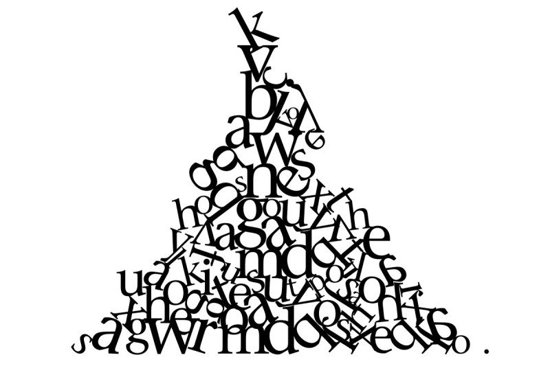

Smart-reading: How to read faster and comprehend more

[Feature](https://www.newscientist.com/article_type/feature/)

8 February 2017

# Smart-reading: How to read faster and comprehend more

With the rise of the internet and social media we've never had so much to read. What's the best way to get the most from the deluge of words?

By Emma Young

THE onslaught of words begins the moment you wake up. Even before dressing, you may check your emails, peruse the morning news online, respond to texts and skim your Twitter feed. Then, at work, there are reports, memos or articles to be read and more emails to deal with. You might even dip into some prose for the sheer pleasure of it.

With the rise of the internet and social media, many of us encounter far more written information than earlier generations. This daily deluge of text can be overwhelming. Whether you’re struggling to cope or would just like to read even more, it’s tempting to wonder whether there are better methods.

We know that the human brain is capable of amazing feats. “People are now memorising decks of cards in less than 20 seconds, and an individual recently solved eight Rubik’s cubes under water in a single breath,” says David Balota of Washington University in St Louis, Missouri. “It’s interesting to speculate whether such training may be achievable within the reading domain.”

Realistically, most of us can never hope to challenge six-times world speed-reading champion Anne Jones, who has clocked up rates of 4251 words a minute. But there are ways anyone can get more from what they read. To read more efficiently and more accurately, you just need to know which advice to follow and which to ignore.

The average university-educated person reads between 200 and 400 words per minute. Historically, reading better has been synonymous with reading faster. Since US teacher Evelyn Wood pioneered the concept of speed-reading in the 1950s, there has been a proliferation of