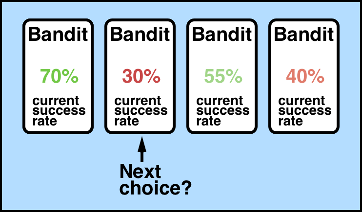
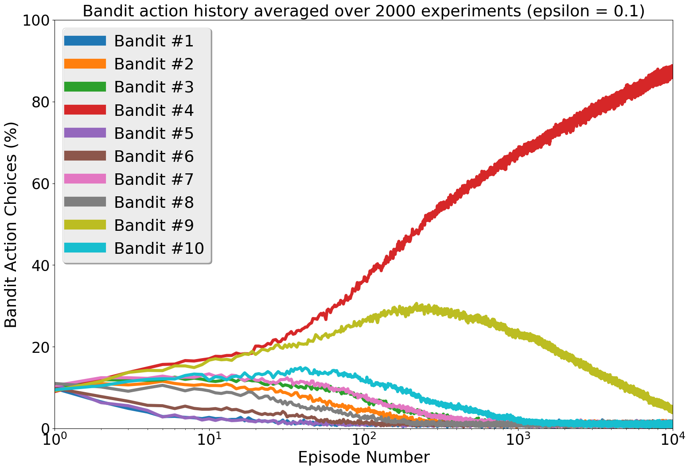

Solving the Multi-Armed Bandit Problem – Towards Data Science

# Solving the Multi-Armed Bandit Problem

[Anson Wong](https://towardsdatascience.com/@ankonzoid)
Sep 24, 2017·6 min read

The multi-armed bandit problem is a classic reinforcement learning example where we are given a slot machine with *n* arms (bandits) with each arm having its own rigged probability distribution of success. Pulling any one of the arms gives you a stochastic reward of either R=+1 for success, or R=0 for failure. Our objective is to pull the arms one-by-one in sequence such that we maximize our total reward collected in the long run.

The non-triviality of the multi-armed bandit problem lies in the fact that we (the agent) cannot access the true bandit probability distributions — all learning is carried out via the means of trial-and-error and value estimation. So the question is:

**How can we design a systematic strategy that adapts to these stochastic rewards?**

This is our goal for the multi-armed bandit problem, and having such a strategy would prove very useful in many real-world situations where one would like to select the “best” bandit out of a group of bandits *i.e. A/B testing, line-up optimization, evaluating social media influence*.

In this article, we approach the multi-armed bandit problem with a classical reinforcement learning technique of an *epsilon-greedy agent* with a learning framework of *reward-average sampling* to compute the action-value Q(a) to help the agent improve its future action decisions for long-term reward maximization. The Python code implementation of this multi-armed bandit algorithm solution can be found at my Github at:

> [**> https://github.com/ankonzoid/LearningX/tree/master/classical_RL/MAB**](https://github.com/ankonzoid/LearningX/tree/master/classical_RL/MAB)

Please refer to our Appendix for more details about the epsilon-greedy agent, and how the reward-average sampling method is used to iteratively update Q(a). In the next section, we explain the results of deploying such an agent in the multi-armed bandit environment.

More of my blogs, tutorials, and projects on Deep Learning and Reinforcement Learning can be found at my [**Medium**](https://medium.com/@ankonzoid)**  **and at my [**Github**](https://github.com/ankonzoid)**.**

### Results: Which Bandits did the Agent choose?

Consider our Python code example of 10 hard-coded bandits each with their own individual success probabilities (remember that our agent is blind to these numbers, it can only realize them via sampling the bandits individually):

Bandit #1 = 10% success rate
Bandit #2 = 50% success rate
Bandit #3 = 60% success rate
**Bandit #4 = 80% success rate (best)**
Bandit #5 = 10% success rate
Bandit #6 = 25% success rate
Bandit #7 = 60% success rate
Bandit #8 = 45% success rate
**Bandit #9 = 75% success rate (2nd best)**
**Bandit #10 = 65% success rate (3rd best)**

By inspection, we will be expecting our the agent in the long-term to pick out Bandit #4 as the strongest signal, with Bandit #9 following second, and Bandit #10 following third, etc.

Now to the results. We performed 2,000 experiments for the agent to start from scratch with epsilon exploration probability of 10%, and trained the agent for 10,000 episodes per experiment. The average proportion of bandits chosen by the agent as a function of episode number is depicted in Fig 1.

Fig 1) Bandit choices by the epsilon-greedy agent (epsilon = 10%) throughout its training

In Fig 1, we can see that that the selection choice of bandits is uniformly distributed at ~10% amongst all bandits near the beginning of training (< 10 episodes) as it is in its exploratory phase of not knowing which bandits to take advantage of yet. It is until we reach later episodes (> 100 episodes) do we see a clear greedy mechanism take precedence in deciding which bandits should get more priority because of the rewards sampled so far. As expected Bandits #4, #9, #10 at this mid-to-late training phase are the ones that get chosen by the agent. Lastly and almost inevitably, the agent tends to almost always choose Bandit #4 as the “best” bandit at the end of training with a plateau of ~90% (since ~10% should always remain because of the fixed epsilon exploration parameter).

Although the optimal policy is to select Bandit #4 in this problem, you will notice that this does not mean that pulling Bandit #4 will always beat any other bandit on a given pull since the rewards are stochastic; it is in the long-term reward average that you will find Bandit #4 to dominate. Also, there is nothing particularly special about using our agent to approach this problem— it is just one of many methods that can adaptively maximize the collection of long-term rewards. There definitely exists situations where a completely exploratory (epsilon = 100%), or a completely greedy agent (epsilon = 0%), or anything in between, could end up collecting more rewards for a finite number of episodes than our epsilon=10%-greedy agent. The main appeal of deploying such an agent in my perspective is for the automation of minimizing re-choosing bandits that have already shown some evidence of failure. From a business and practical perspective, this can save a lot of time and resources that would be otherwise wasted in the optimization process of finding the “best” bandit.

### Appendix: The Epsilon-greedy Agent “personality” and Reward-Averaging Sampling “learning rule”

In a nutshell, the epsilon-greedy agent is a hybrid of a (1) completely-exploratory agent and a (2) completely-greedy agent. In the multi-armed bandit problem, a completely-exploratory agent will sample all the bandits at a uniform rate and acquire knowledge about every bandit over time; the caveat of such an agent is that this knowledge is never utilized to help itself to make better future decisions! On the other extreme, a completely-greedy agent will choose a bandit and stick with its choice for the rest of eternity; it will not make an effort to try out other bandits in the system to see whether they have better success rates to help it maximize its long-term rewards, thus it is very narrow-minded!

To get a somewhat desirable agent that possesses the best of both worlds, the epsilon-greedy agent is designed to give an epsilon chance (say for example 10%) towards exploring bandits randomly at any state, and acts greedily on its current ‘best’ bandit value estimate for all other times. The intuition surrounding this is that the greedy-mechanism can help the agent focus on its currently most “successful” bandits, and the exploratory-mechanism gives the agent to explore for better bandits that might be out there.

The only thing left is: how do we define a notion of “value” of a bandit to the agent so that it can choose greedily? Borrowing from reinforcement learning, we can define the action-value function Q(s, a) to represent the expected long-term reward of taking action **a** from state **s**. In our case of the multi-armed bandit, each action brings the agent to a terminal state so long-term rewards are exactly the immediate rewards and we simplify the notation of the definition of the action-value as

where **k** is the counter for how many times action **a **(bandit) was chosen in the past, and **r** are the stochastic rewards for each time that bandit was chosen. With some extra arithmetic manipulation, this definition can be re-written recursively as

As we do not know start off knowing the “true” values of Q(a), we can use this recursive definition as an iterative tool for approximating Q(a) at the end of every episode.

To pair up the epsilon-greedy agent with our action-values Q(a) estimates, we let the epsilon-greedy agent choose a bandit at random epsilon-probability of the time, and let the agent use greedily choose an action from our Q(a) estimates for the rest of the times

With these two concepts down, we can now go about solving the multi-armed bandit problem!