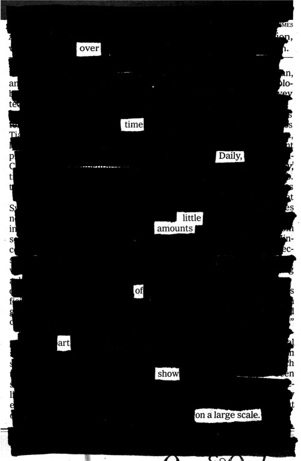
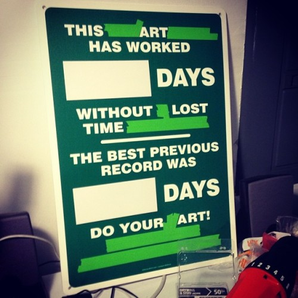

Something small, every day - Austin Kleon

# Something small, every day

Sunday, December 29, 2013

It takes time to do anything worthwhile, but thankfully, we don’t need it all in one chunk. So this year, forget about the year as a whole. Forget about months and forget about weeks.

Focus on *days*.

The day is the only unit of time that I can really get my head around. Seasons change, weeks are completely human-made, but the day has a rhythm. The sun goes up; the sun goes down. I can handle that.

There’s a reason many recovering alcoholics adopt “one day at a time” as their way of being. Here’s Richard Walker in *[Twenty-Four Hours A Day](http://www.amazon.com/exec/obidos/ASIN/1614270953/wwwaustinkleo-20/ref=nosim/):*

> “

> Anyone can fight the battles of just one day. It is only when you and I add the battles of those two awful eternities, yesterday and tomorrow, that we break down. It is not the experience of today that drives us mad. It is the remorse or bitterness for something that happened yesterday or the dread of what tomorrow may bring. Let us therefore do our best to live but one day at a time.

Building a body of work (or a life) is all about the slow accumulation of a day’s worth of effort over time. Writing a page each day doesn’t seem like much, but do it for 365 days and you have enough to fill a novel.

The comedian Jerry Seinfeld has a calendar method that helps him stick to his daily joke writing. He suggests that you get a wall calendar that shows you the whole year. Then, you break your work into daily chunks. Each day, when you’re finished with your work, make a big fat X in the day’s box. Every day, instead of just getting work done, your goal is to just fill a box. “After a few days you’ll have a chain. Just keep at it and the chain will grow longer every day. You’ll like seeing that chain, especially when you get a few weeks under your belt. Your only job next is to not break the chain.”

Every day, no matter what, [I make a poem and post it online](http://austinkleon.com/2013/09/02/a-poem-a-day/). Most days they’re mediocre, some days they’re great, and some days they’re awful. (Jerry Garcia: “You go diving for pearls every night but sometimes you end up with clams.”) But it doesn’t matter to me whether the day’s poem was good or not, what matters is that it got done. I did the work. I didn’t break the chain. If I have a shitty day, I go to sleep and know that tomorrow I get to take another whack at it.

The past couple of months, I haven’t worried too much about keeping a calendar, because I’ve got myself pretty well trained. But there’s always the temptation to skip a day, so when I moved into a new studio space last week, one of the first things I did was hang (a modified version) of one of these [workplace safety scoreboard signs](http://www.amazon.com/exec/obidos/ASIN/B00CBNF932/wwwaustinkleo-20/ref=nosim/) on the wall. We’ll see how long of a streak I can go on.

Anyways, if you make a New Year’s resolution, make it this: **something small, *every day*.**

Figure out what your little daily chunk of work is, and every day, no matter what, make sure it gets done.

Don’t say you don’t have enough time. We’re all busy, but we all get 24 hours a day. People often ask me, “How do you find the time for the work?” And I answer, “I look for it.” You find time the same place you find spare change: in the nooks and crannies. You find it in the cracks between the big stuff—your commute, your lunch break, the few hours after your kids go to bed. You might have to miss an episode of your favorite TV show, you might have to miss an hour of sleep, but you can find the time to work if you look for it.

What I usually recommend: get up *early*. Get up early and work for a couple hours on the thing you really care about. When you’re done, go about your day: go to school, go to your job, make your family breakfast, whatever. Your teacher or your boss or your kids can’t take your work away from you, because you already did it. And you know you’ll get to do it tomorrow morning, as long as you make it through today.

Do the work every day. Fill the boxes on your calendar. Don’t break the chain.

And should you start to despair at your progress, always keep in mind the words of Harvey Pekar: “Every day is a new deal. Keep working and maybe something will turn up.”

Happy New Year.

*This post contains adapted excerpts from my books [Steal Like An Artist](http://steallikeanartist.com/) and [Show Your Work!](http://showyrwork.com/) Subscribe to [my newsletter](http://austinkleon.com/subscribe) to get new writing and art every week.*

Filed Under: [Notes on writing and drawing](https://austinkleon.com/category/writing/)  Tagged: [NOTES ON WRITING AND DRAWING](https://austinkleon.com/tag/notes-on-writing-and-drawing/), [routine](https://austinkleon.com/tag/routine/)