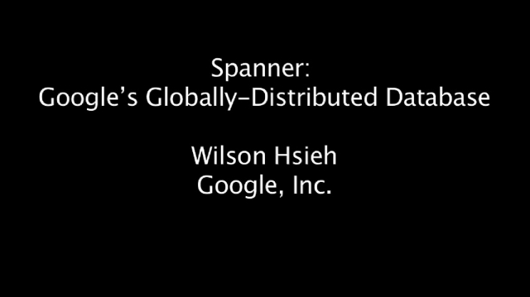

Spanner: Google’s Globally-Distributed Database | USENIX

.

#### connect with us.

 http://twitter.com/usenix

 https://www.facebook.com/events/284007718333937/

 http://www.linkedin.com/groups/USENIX-Association-49559/about

 http://www.youtube.com/user/USENIXAssociation

#  Spanner: Google’s Globally-Distributed Database

 .

Authors:

James C. Corbett, Jeffrey Dean, Michael Epstein, Andrew Fikes, Christopher Frost, JJ Furman, Sanjay Ghemawat, Andrey Gubarev, Christopher Heiser, Peter Hochschild, Wilson Hsieh, Sebastian Kanthak, Eugene Kogan, Hongyi Li, Alexander Lloyd, Sergey Melnik, David Mwaura, David Nagle, Sean Quinlan, Rajesh Rao, Lindsay Rolig, Yasushi Saito, Michal Szymaniak, Christopher Taylor, Ruth Wang, and Dale Woodford, *Google, Inc.*

***Awarded Jay Lepreau Best Paper!***

 .

 .

 .

 .

 .

 .

 .

 .

 .

 .

 .

 .

 .

 .

 .

 .

 .

 .

 .

 .

 .

 .

 .

 .

 .

 .

## Open Access Content

USENIX is committed to Open Access to the research presented at our events. Papers and proceedings are freely available to everyone once the event begins. Any video, audio, and/or slides that are posted after the event are also free and open to everyone. [Support USENIX](https://www.usenix.org/annual-fund) and our commitment to Open Access.

 [Corbett PDF](https://www.usenix.org/system/files/conference/osdi12/osdi12-final-16.pdf)

[View the slides](https://www.usenix.org/sites/default/files/conference/protected-files/corbett_osdi12_slides.pptx)

BibTeX
Abstract:

Spanner is Google’s scalable, multi-version, globally distributed, and synchronously-replicated database. It is the first system to distribute data at global scale and support externally-consistent distributed transactions. This paper describes how Spanner is structured, its feature set, the rationale underlying various design decisions, and a novel time API that exposes clock uncertainty. This API and its implementation are critical to supporting external consistency and a variety of powerful features: nonblocking reads in the past, lock-free read-only transactions, and atomic schema changes, across all of Spanner.

Award:

[Jay Lepreau Best Paper](https://www.usenix.org/category/award/jay-lepreau-best-paper)

.

#### Presentation Video

[Download Video](https://2459d6dc103cb5933875-c0245c5c937c5dedcca3f1764ecc9b2f.ssl.cf2.rackcdn.com/osdi12/corbett.mp4)

#### Presentation Audio

       [MP3 Download](https://2459d6dc103cb5933875-c0245c5c937c5dedcca3f1764ecc9b2f.ssl.cf2.rackcdn.com/osdi12/corbett.mp3)  [OGG Download](https://2459d6dc103cb5933875-c0245c5c937c5dedcca3f1764ecc9b2f.ssl.cf2.rackcdn.com/osdi12/corbett.ogg)

[Download Audio](https://2459d6dc103cb5933875-c0245c5c937c5dedcca3f1764ecc9b2f.ssl.cf2.rackcdn.com/osdi12/corbett.mp3)

- [Log in](https://www.usenix.org/user/login?destination=comment/reply/170855%23comment-form) or    [Register](https://www.usenix.org/user/register?destination=comment/reply/170855%23comment-form) to post comments

.
 .
.
 .

.