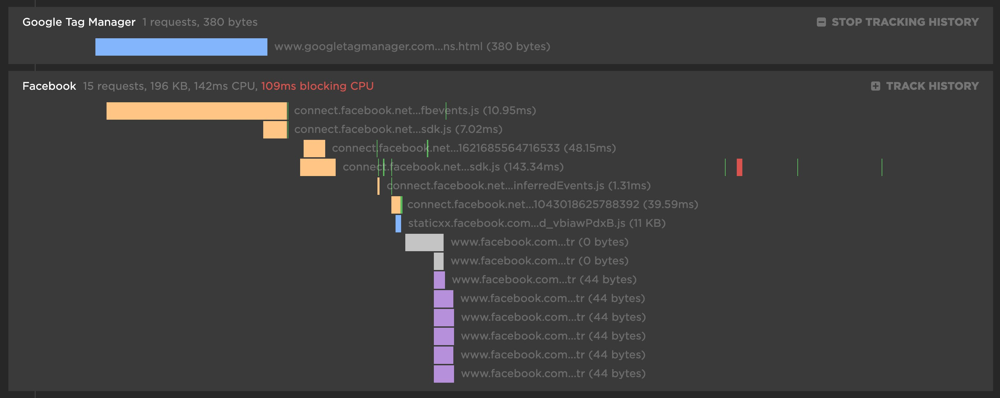
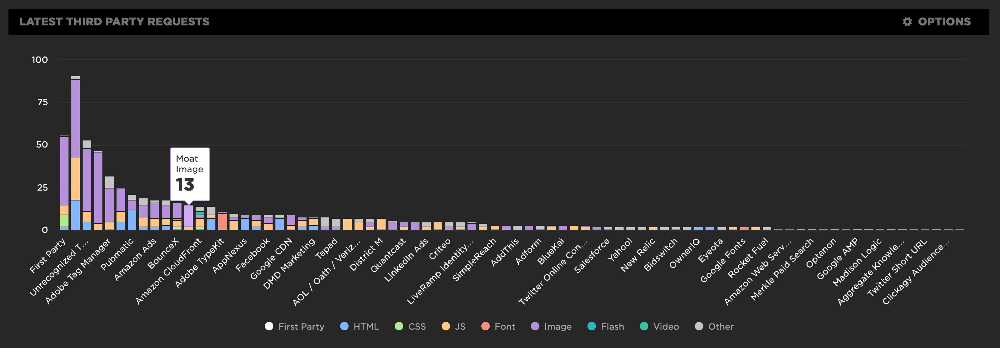
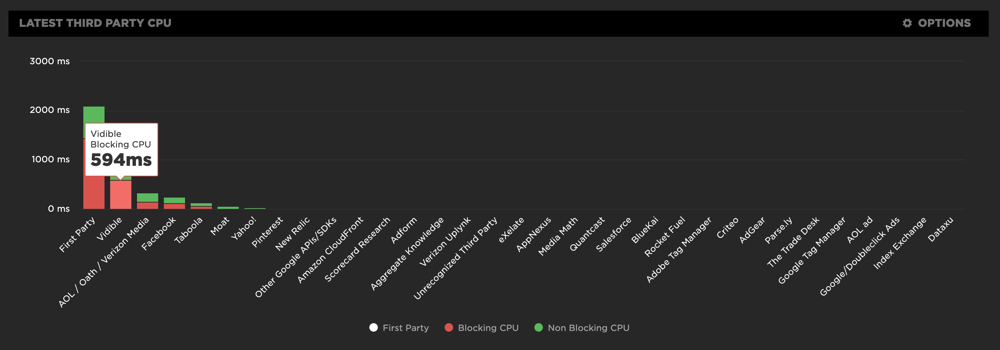
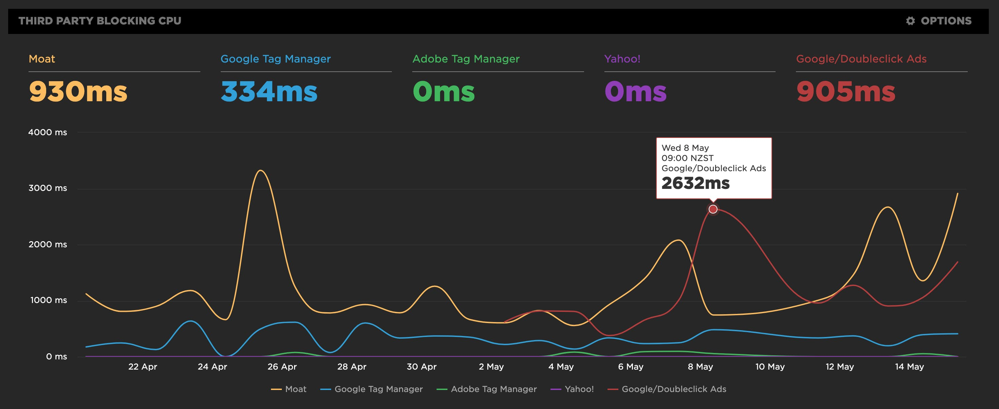

SpeedCurve | Third party blame game

# Third party blame game

WEDNESDAY 15TH OF MAY 2019

Our third party metrics and dashboard have had an exciting revamp. With new metrics like blocking CPU, you can now see exactly who is really to blame for a crappy user experience. We've also given you the ability to monitor individual third parties over time and create performance budgets for them.

## It's not you, it's me

Or is it really you, and not me? We now automatically group all the requests in our third party waterfall chart, letting you easily identify all the third party services used on your website.

For each third party, you get the number of requests and size for each content type. There's also a first party comparison you can toggle on/off to see what proportion of your requests come from first party vs third party.

## Blocking JS, CSS & CPU

People love to hate on third parties and blame all their user experience issues on them.

> Look at all those requests, it must be them!

We don't believe that just looking at the number of requests or the size of requests a third party makes is a good enough indicator that they are a bad actor. A well-built web page that manages its requests can easily negate any issues by delaying those request till after the page is rendered and interactive.

**What really matters is how a third party might be blocking the rendering or the interactivity of the page. **

So for each third party, we show you if it includes any blocking JS or CSS requests. This tells you if the rendering of the page is being delayed by a blocking request from a third party. We also look for any blocking CPU caused by a third party. Blocking CPU is any JS function that takes longer than 50ms (also known as a [long task](https://github.com/w3c/longtasks)), which often leads to [page jank.](https://speedcurve.com/blog/measuring-jank-and-ux/) Blocking CPU stops your users from smoothly interacting with your page and delays other metrics like [First CPU Idle](https://developers.google.com/web/tools/lighthouse/audits/first-cpu-idle) and [Time To Interactive.](https://github.com/WICG/time-to-interactive#definition) These third party blocking metrics are a far better indicator of who might be causing real issues on your page.

In this example, Vidible has 594ms of blocking CPU, causing jank on the page, while all the other third parties don't trigger any signifiant CPU activity at all. This helps you quickly focus in on which third parties are causing real user experience problems.

## Collect the evidence!

For any third party in your waterfall, you can turn on "Track History" and we'll collect detailed third party metrics every time we run a test. You can then monitor a third party over time and set performance budgets and alerts. This is a great way to keep an eye on any changes a third party might be making and alerting you to impacts on your page. You could even agree to an SLA with a third party and then use SpeedCurve to monitor and enforce it, keeping everyone honest and on the same page.

## Track any request

Even though it's called third party, you can actually build your own custom filters and track any group of requests you like. You can even track the history and set performance budget and get alerts for a single request. If your task is to trim down a specific JS request and make sure its size or CPU usage is within budget, then you can setup a specific filter and monitor your improvements.

## Contribute

We used to have our own in-house library for identifying third parties but we've now switched to [third-party-web](https://github.com/patrickhulce/third-party-web) by Patrick Hulce, which has a quickly growing list of third parties. Many people in the perf community, such as Simon Hearne of [requestmap](https://simonhearne.com/2015/find-third-party-assets/) fame, have been identifying and contributing third parties to third-party-web – and we've recently added a bunch, too! If you see any "Unrecognized Third Party" requests in your waterfall charts, then you can [contribute them to the project.](https://github.com/patrickhulce/third-party-web#contributing)

## Getting started

If you already use SpeedCurve, then you can start tracking your third parties straight away in your Settings or on the Synthetic > Third Party dashboard. Otherwise, [kick off a free trial](https://speedcurve.com/setup/trial/) to see if it's a third party that's eating up your bandwidth and CPU, or your own requests.

[third party](https://speedcurve.com/blog/tag/third-party/)  [jank](https://speedcurve.com/blog/tag/jank/)  [RSS](https://speedcurve.com/blog/rss/)

- [0 comments]()
- [**SpeedCurve**](https://disqus.com/home/forums/speedcurve/)
- [Login](https://disqus.com/embed/comments/?base=default&f=speedcurve&t_u=https%3A%2F%2Fspeedcurve.com%2Fblog%2Fthird-party-blame-game%2F&t_d=Third%20party%20blame%20game&t_t=Third%20party%20blame%20game&s_o=default#)
- [](https://disqus.com/home/inbox/)
- [ Recommend  1](https://disqus.com/embed/comments/?base=default&f=speedcurve&t_u=https%3A%2F%2Fspeedcurve.com%2Fblog%2Fthird-party-blame-game%2F&t_d=Third%20party%20blame%20game&t_t=Third%20party%20blame%20game&s_o=default#)
- tTweetfShare
- [Sort by Best](https://disqus.com/embed/comments/?base=default&f=speedcurve&t_u=https%3A%2F%2Fspeedcurve.com%2Fblog%2Fthird-party-blame-game%2F&t_d=Third%20party%20blame%20game&t_t=Third%20party%20blame%20game&s_o=default#)

Start the discussion…

###### Log in with

-
-
-
-

######  or sign up with Disqus

?

### Disqus is a discussion network

- Disqus never moderates or censors. The rules on this community are its own.
- Don't be a jerk or do anything illegal. Everything is easier that way.

[Read full terms and conditions](https://docs.disqus.com/kb/terms-and-policies/)

Be the first to comment.

## Also on **SpeedCurve**

- [

### The average web page is 3MB. How much should we care?

    - 17 comments •

    - 2 years ago

[ Patrice Midori —  Good article if you have fiber optics. We still have DSL 1MB/S so .... a 3 MB page, i just don't load it fully, …](https://disq.us/?url=https%3A%2F%2Fspeedcurve.com%2Fblog%2Fweb-performance-page-bloat%2F&key=7R8Yr25GYIz7GnFv5UQ6BQ)](https://disq.us/?url=https%3A%2F%2Fspeedcurve.com%2Fblog%2Fweb-performance-page-bloat%2F&key=7R8Yr25GYIz7GnFv5UQ6BQ)

- [

### SpeedCurve | Rendering Metrics

    - 6 comments •

    - a year ago

[ benhastings —  Synthetic monitoring falls into the category of services that tools like Webpagetest afford to site …](https://disq.us/?url=https%3A%2F%2Fspeedcurve.com%2Fblog%2Frendering-metrics%2F&key=mSYz9oJktKbApYhrdmP_tg)](https://disq.us/?url=https%3A%2F%2Fspeedcurve.com%2Fblog%2Frendering-metrics%2F&key=mSYz9oJktKbApYhrdmP_tg)

- [

### An analysis of Chromium's paint timing metrics

    - 5 comments •

    - 8 months ago

[ jason —  Oh that way I understand, I just got stuck on how to run a synthetic test for real users because the metrics are …](https://disq.us/?url=https%3A%2F%2Fspeedcurve.com%2Fblog%2Fan-analysis-of-chromiums-paint-timing-metrics%2F&key=qbbUG98iYLswxbWJ-tbuUA)](https://disq.us/?url=https%3A%2F%2Fspeedcurve.com%2Fblog%2Fan-analysis-of-chromiums-paint-timing-metrics%2F&key=qbbUG98iYLswxbWJ-tbuUA)

- [

### Metrics from 1M Sites

    - 1 comment •

    - 5 months ago

[ Julio C. Guevara —  Hi Steve, very interesting insight. I am working on something fairly similar right now. I am …](https://disq.us/?url=https%3A%2F%2Fspeedcurve.com%2Fblog%2Fmetrics-from-1m-sites%2F&key=vTDrS9Pm0bk_LFmzBEPjjA)](https://disq.us/?url=https%3A%2F%2Fspeedcurve.com%2Fblog%2Fmetrics-from-1m-sites%2F&key=vTDrS9Pm0bk_LFmzBEPjjA)

- [Powered by Disqus](https://disqus.com/)
- [*✉*Subscribe*✔*](https://disqus.com/embed/comments/?base=default&f=speedcurve&t_u=https%3A%2F%2Fspeedcurve.com%2Fblog%2Fthird-party-blame-game%2F&t_d=Third%20party%20blame%20game&t_t=Third%20party%20blame%20game&s_o=default#)
- [*d*Add Disqus to your site](https://publishers.disqus.com/engage?utm_source=speedcurve&utm_medium=Disqus-Footer)
- [**Disqus' Privacy Policy](https://help.disqus.com/customer/portal/articles/466259-privacy-policy)