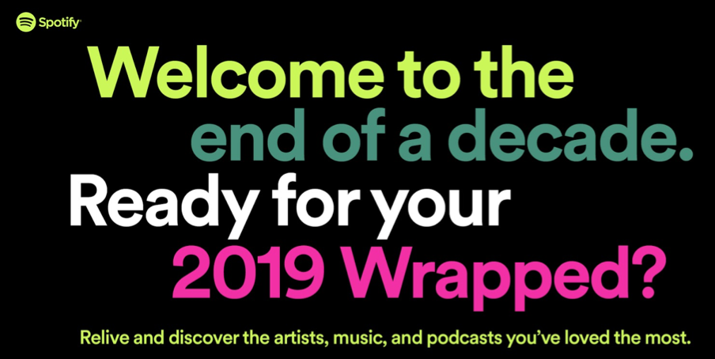
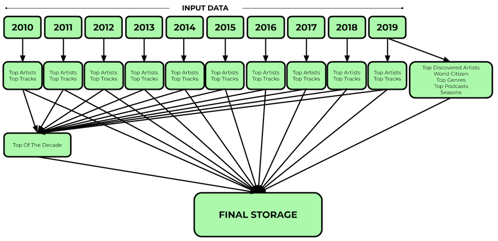
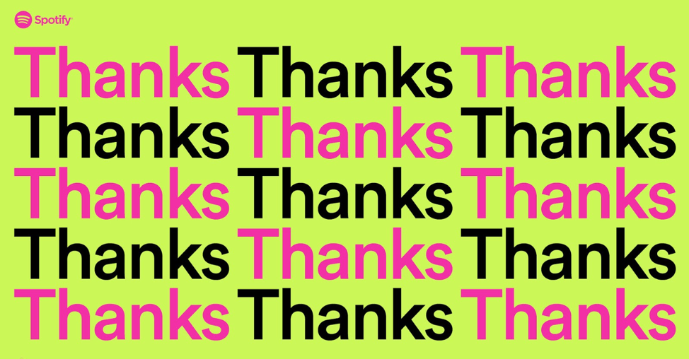
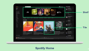

Spotify Unwrapped: How we brought you a decade of data | Labs

# Spotify Unwrapped: How we brought you a decade of data

Posted on February 18, 2020 by [Bindia Kalra](https://labs.spotify.com/author/bindiakalra/), [Catie Edwards](https://labs.spotify.com/author/cayedwards1/) and [Zoe Tiet](https://labs.spotify.com/author/zoetiet/)

|     |     |
| --- | --- |
|     | 97 people like this.  [Sign Up](https://www.facebook.com/ad_campaign/landing.php?campaign_id=137675572948107&partner_id=labs.spotify.com&placement=like_plugin&extra_1=https%3A%2F%2Flabs.spotify.com%2F2020%2F02%2F18%2Fwrapping-up-the-decade-a-data-story%2F&extra_2=GB) to see what your friends like. |

The [Spotify Wrapped Campaign](https://newsroom.spotify.com/2019-12-05/spotify-wrapped-2019-reveals-your-streaming-trends-from-2010-to-now/) is one of Spotify’s largest marketing and social campaigns of the year. It enables our users to see a detailed breakdown of their listening habits over the past year. Since 2019 was the end of the decade, we wanted to do something special for our users. As one of the few streaming platforms that has existed since before 2010, Spotify had a unique opportunity to be able to provide users with a review of their listening habits over the entire decade. This was an ambitious goal and one that posed many engineering challenges.

Because Wrapped is such a massive effort, the Wrapped Team itself encompasses many sub-teams that are responsible for everything from marketing, legal, and design, to data, frontend and backend engineering. Many of these teams are spun up in the months’ prior launch, and are largely made up of volunteers who put aside their day-to-day work to focus entirely on launching Wrapped. In this post, we will focus on how our team–the User Wrapped data engineering team–managed to process ~5x the amount of data compared to that of 2018’s Wrapped campaign at a fraction of the cost.

## Scope

For 2019’s Wrapped, there were multiple statistics that we wanted to highlight individually for our users. In this post, we will refer to each of these separate statistics as a “data story”, because it is a statistic, or story, we are telling the user through their historical listening data. For example, Your Top Artists, Your Top Songs, and Your Top Podcasts are considered three separate data stories. Individually, each of these data stories can be very computationally expensive. To bring you a Decade Wrapped, we had to process these data stories over 10 years’ worth of data for all of our monthly active users (MAU), of which we have over 248 million. Therefore, the biggest challenge we faced for Wrapped 2019 was scale.

In 2018, the Wrapped Campaign data pipeline had one of the largest Dataflow jobs to ever run on GCP (Google Cloud Platform), which resulted in limits around the amount of data we were able to shuffle. The amount of data we tried to process for just 2018 with basic pipeline design struggled to complete at the scale we were attempting. Due to the scope of the work, we had to work closely with Google Cloud to implement the ability to handle the data at such a large scale. From the prior Wrapped Team’s experience, we took learnings, which heavily influenced our decisions in designing the architecture for the 2019 campaign.

## Architecture

In Wrapped 2019, the main challenges we faced with respect to the decade concept were getting the listening history and summarizing thousands of historical data points per user over 10 years in a cost-effective manner while ensuring data quality.

### Reading the Data

Spotify has user listening analytics data dating back to our first years as a streaming platform, but it is difficult to read this amount of data in a single job. Coupled with how we store user data, with a focus on protecting user privacy, there ends up being a potential of resource capacity issues. We knew we wanted several separate statistics drawn from each year of the decade, and that required having access to the user listening analytics data for each individual year. Fortunately, we have a system developed internally to help us accomplish this in an efficient fashion by giving us access to time series data. This data lake is backed by Google Cloud Bigtable and is highly optimized for aggregating data over an arbitrary time range. We were able to use this listening history/analytics data source to get and summarize user stories for not only each year of the decade, but also for targeted windows of each season of 2019.

### Processing the Data

The biggest change in design from 2018 involved storing the data in a way that would reduce the amount of shuffles needed to group all the data stories on a user level. This was especially important, since in 2019, we were working with about 5x the amount of data over 10 years. To reduce the amount of shuffles, we decided to use Bigtable as our final data store. Because additional logic needed to be implemented on top of these data stories, we chose to store the intermediate output in a separate Bigtable instance and performed additional processing at the end before final storage. Having one row per user in Bigtable and storing the output from different data story jobs to that same row but separate column families gave us the benefit of having that data pre-grouped and colocated on a user level.

Image 1: The architecture for our data pipelines for 2019 Wrapped.

As most of the data stories weren’t dependent on each other, we were able to write separate jobs to compute them and save the outputs to the same row in Bigtable. This allowed us to run and iterate on individual data story jobs in a parallel fashion, saving us a lot of time. This also prevented us from having to re-run all jobs if a mistake was made, or if there were any last-minute requirement changes. The exception would be calculating the statistics for the top of the decade as that required us to process all 10 years of data together. However, since we already had metrics pre-grouped and aggregated for each year in our Bigtable, we decided to go with the approach of reading and combining that data to get top of the decade metrics. This not only saved us the time and cost of processing and aggregating all that data in one job but also made testing easier by giving us a means to pull a sub-sample of the decade data.

### Data QA

In order to iterate fast and to ensure the quality of our data, we needed a tool to be able to access data directly from our intermediate and final storage. To achieve this, we wrote a python library that used Cloud Bigtable APIs to read data from our Bigtable. Having this resource not only enabled us to eyeball the data for sanity checks but also helped us catch and validate bugs quickly.

## Key Takeaway’s

- **Leverage the right system design and data store to reduce cost**

We processed ~5X the amount of data compared to the Wrapped 2018 campaign while spending 25% less overall for processing  This was achieved by designing our system in a way that reduced group-by key operations, and reused the output of yearly jobs to produce top of the decade metrics.

- **Decouple data processes to improve iteration speed**

Because we were able to break down the users’ summaries into smaller data stories and workflows, we ended up with a much more flexible system that allowed for quick iteration and exploration. Therefore, any last-minute requirement changes were isolated to individual data stories and workflows, and had no impact on the rest of the data stories.

### Acknowledgments

The data-engineering team, called Time-Turners for their ability to transport users back in time through their listening history, was made up of a group of engineers from Spotify’s Personalization Mission. The team included [Catie Edwards](https://www.linkedin.com/in/cayedwards/) (Data/ML Engineer), [Zoe Tiet](https://www.linkedin.com/in/zoetiet/) (Data/Backend Engineer), [Bindia Kalra](https://www.linkedin.com/in/bindiakalra/) (Data/Backend Engineer), Erin Palmer (Senior Data Engineer), Alissa Deak (Data Scientist), Owen Heneghan (Staff Engineer), Maya Hristakeva (Engineering Manager), and Marc Tollin (Product Manager). A big shout out to this amazing team and our friends in Data Curation and T-Rex who worked tirelessly to bring you your Decade Wrapped.

|     |     |
| --- | --- |
|     | 97 people like this.  [Sign Up](https://www.facebook.com/ad_campaign/landing.php?campaign_id=137675572948107&partner_id=labs.spotify.com&placement=like_plugin&extra_1=https%3A%2F%2Flabs.spotify.com%2F2020%2F02%2F18%2Fwrapping-up-the-decade-a-data-story%2F&extra_2=GB) to see what your friends like. |

### Share this:

- [Twitter](https://labs.spotify.com/2020/02/18/wrapping-up-the-decade-a-data-story/?share=twitter&nb=1)
- [Facebook](https://labs.spotify.com/2020/02/18/wrapping-up-the-decade-a-data-story/?share=facebook&nb=1)
- [LinkedIn](https://labs.spotify.com/2020/02/18/wrapping-up-the-decade-a-data-story/?share=linkedin&nb=1)
- [Email](https://labs.spotify.com/2020/02/18/wrapping-up-the-decade-a-data-story/?share=email&nb=1)

-

### *Related*

#### [For Your Ears Only: Personalizing Spotify Home with Machine Learning](https://labs.spotify.com/2020/01/16/for-your-ears-only-personalizing-spotify-home-with-machine-learning/)

In "Labs"

#### [My Beat: Anna Smith](https://labs.spotify.com/2020/01/18/my-beat-anna-smith/)

In "Labs"
[(L)](https://labs.spotify.com/2013/03/20/how-we-use-python-at-spotify/)

#### [How we use Python at Spotify](https://labs.spotify.com/2013/03/20/how-we-use-python-at-spotify/)

The most frequent question we heard at PyCon this weekend, was how do we use Python at Spotify. Hopefully this post answers the question! At Spotify the main two places we use Python are backend services and data analysis. Python has a habit of turning up in other random places,…

In "Labs"

This entry was posted in [Labs](https://labs.spotify.com/category/labs/). Bookmark the [permalink](https://labs.spotify.com/2020/02/18/wrapping-up-the-decade-a-data-story/).