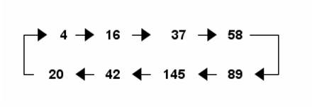

Squared digit sum cycle

# Squared digit sum

Take any positive integer *n* and sum the squares of its digits. If you repeat this operation, eventually you’ll either end at 1 or cycle between the eight values 4, 16, 37, 58, 89, 145, 42, and 20.

For example, pick *n* = 389. Then 3² + 8² + 9² = 9 + 64 + 81 = 154.

Next, 1² + 5² + 4² = 1 + 25 + 16 = 42, and now we’re at one of the eight special values. You can easily verify that once you land on one of these values you keep cycling.

The following code shows that the claim above is true for numbers up to 1,000.
def square_digits(n):
return sum([int(c)**2 for c in str(n)])
attractors = [1, 4, 16, 37, 58, 89, 145, 42, 20]
for n in range(1, 1000):
m = n
while m not in attractors:
m = square_digits(m)
print("Done")

For a proof that the claim is true in general, see “A Set of Eight Numbers” by Arthur Porges, The American Mathematical Monthly, Vol. 52, No. 7, pp. 379-382.

***

By the way, the cycle image above was created with Emacs org-mode using the following code.

#+BEGIN_SRC ditaa :file square_digit_sum_cycle.png
+-> 4 -> 16 -> 37 -> 58---+

| |
| |

+- 20 <- 42 <- 145 <- 89 <-+ #+END_SRC

It’s not the prettiest output, but it was quick to produce. More on producing ASCII art graphs [here](https://www.johndcook.com/blog/2016/06/15/ascii-art-diagrams-in-emacs-org-mode/).