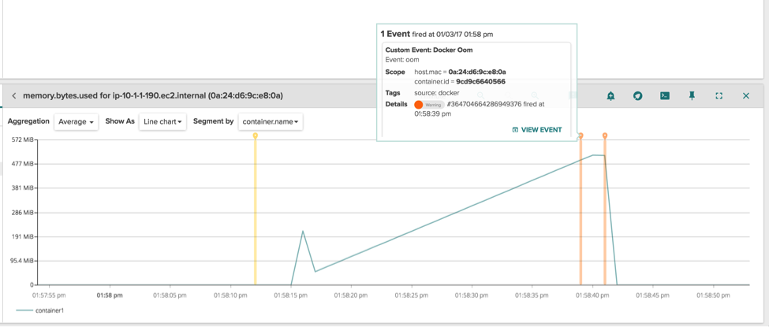
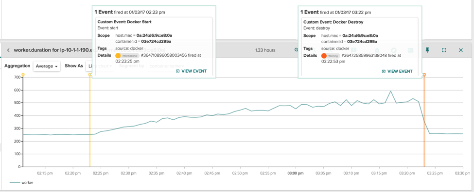
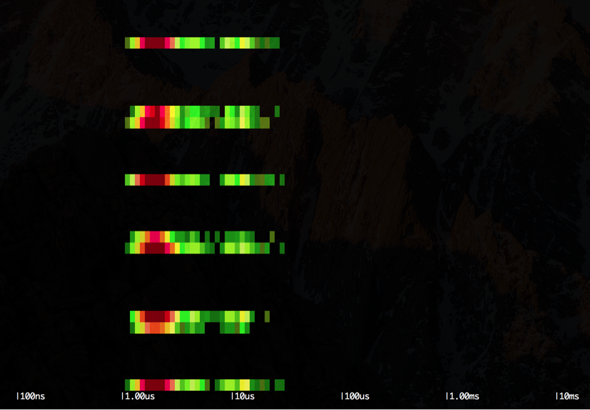
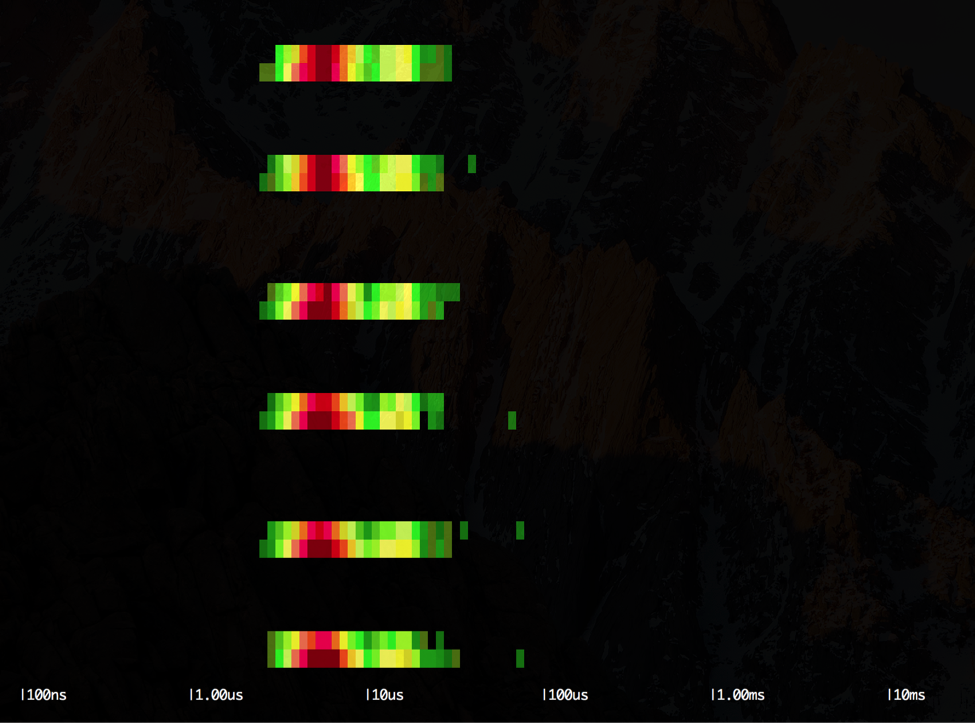

Sysdig | Container isolation gone wrong

#  Container isolation gone wrong

By [Gianluca Borello](https://sysdig.com/blog/author/gianluca/) on May 22, 2017

### Introduction

One of the main advantages of embracing containers is “lightweight virtualization”. Since each container is just a thin layer around the containerized processes, The user gains enormous efficiencies, for example by increasing the container density per host, or by spinning containers up and down at a very fast pace.

However, as the troubleshooting story in the article will show, this lightweight virtualization comes at the cost of sharing the underlying kernel among all containers, and in some circumstances this can lead to surprising and undesirable effects that container users typically don’t think about.

This troubleshooting tale is rather involved. I’ve started from the basics and worked up to the more complex material in the hope that readers at all levels can get value out of it.

### Isolation: the good parts

Let’s start with the basics of containerization, and for these examples we are going to use the very familiar Docker container runtime. As all container users are well aware, once a container is created there is a pretty good amount of isolation by default: the containerized file system is isolated from the outside (via mount namespaces), the processes in the container appear as if they were the only ones on the host (via PID namespaces) and so on.

With some additional options, it’s also possible to limit the amount of physical resources a container can consume. This is achieved via cgroups, and imposing these constraints is of critical importance when deploying multiple containers per host. For example, let’s run two containers, making sure the first one can just consume 10% of the CPU of the system:

	$ sudo docker run --cpu-quota=80000 --name container1 stress
	$ sudo docker run --name container2 stress

We used the –cpu-quota parameter to specify the CPU limit in absolute terms (relative to my 8 core host), but both cgroups and Docker support other ways to set such limits, for example by assigning relative weights. We can then verify with a container monitoring tool that the limits are correctly enforced:

Indeed, the first container is not able to go beyond 10% of global CPU consumption. [Read this article on monitoring greedy containers for more details on CPU and Memory limit enforcement](https://sysdig.com/blog/monitoring-greedy-containers-part-1/).

We can also limit the docker container memory usage to 512MB:
`$ sudo docker run -m 512m --name container1 stress`

Running a program that quickly allocates memory inside the docker container, we can see the container is soon killed and Docker generates a container OOM (Out Of Memory) event.

These are the basic primitives for limiting resources: the kernel enforces them for all the running containers, exactly like a traditional hypervisor would apply those to the running virtual machines. However, the tight coupling between containers and kernel poses other challenges, explored in the next section.

### Isolation: the bad parts

A few days ago, one of our customers came to us with a problem: the performance of a containerized application seemed to heavily depend on which other containers were simultaneously scheduled on the same host. In particular, when the cluster orchestrator (Kubernetes in this case) decided to schedule two specific types of container images (we will call them “worker” and “trasher”) on the host, the performance of the containerized applications would slowly and steadily deteriorate.

At first, the problem seemed as trivial as making sure that the containers were properly limited in terms of CPU/memory/IO, using the cgroup primitives explored above. Upon deeper inspection, it turned out the containers were already limited by Kubernetes and, most important, none of them were using many system resources to begin with. The clash between the two containers had to be more subtle.

### Initial observations

As mentioned earlier, one of the affected applications is called “worker”. The worker is a background process that scans a directory for changes every few seconds, and does a little work when some files are changed (sample code: https://github.com/gianlucaborello/dcache-experiments/blob/master/worker/main.go).

The loop to scan the directories always has very predictable timing, and this value is periodically exported as a StatsD metric for charting and alerting.. The metric is called “worker.duration,” and we can see how its value stabilizes immediately after the container is started. Notice how the duration of the loop is always in the order of 250ms:

On the same infrastructure, there is another application, called “trasher”, whose goal is to do asynchronous processing of some files (sample code: https://github.com/gianlucaborello/dcache-experiments/blob/master/trasher/main.go). Both applications are spun up as separate containers by Kubernetes and, since both have pretty conservative resource limits set (10% of CPU and 512MB of container memory), Kubernetes very often decides to schedule them on the same node. When that happens, the StatsD metric tracking the latency of the worker becomes:

The most obvious observation here is that, during the timespan of one hour, the performance of the worker application degraded from 250ms per loop to 500-600ms per loop, and this is consistent with the performance hit the customer was describing. The other more interesting observation, is that the performance hit is exactly confined between the start and stop of the container 03e724cd295a, which is the trasher container. When it is killed, the performance of the worker go back to normal.

This is indeed very weird behavior, especially considering that the container resources are capped by Kubernetes via the cgroup mechanism. Perhaps the resource limitation didn’t work? Let’s take a look at the overall CPU and docker memory consumed by the containers:

Very little, the containers are nowhere near to even hitting their imposed limits.

Looking around at other system and container metrics, the only odd things I noticed is the memory usage for the whole host:

We have a lot of memory used that is not accounted for by any process or docker container (otherwise it would have shown up in the previous table). This somehow means the memory is being used by the kernel itself. Also, there is a very strict correlation between the amount of memory used and the lifetime of the trasher container (two vertical markers, with the same semantics as the previous chart), even if that memory is not accounted to it. This must definitely be related to the original issue, so it’s time to shed some light on this by doing more advanced troubleshooting.

### Advanced troubleshooting in the kernel

It’s worth starting the analysis by studying the behavior of the two applications from a system call point of view. Let’s start with the worker: as initially described, the worker scans every few seconds the content of a (large) directory, and does nothing else in case the files in it didn’t change. The Go code posted earlier is trivial to understand, but we can also study its behavior with [sysdig](http://www.sysdig.org/), looking for oddities. We can use sysdig’s filters to only see activity from the container in question:

	$ sudo sysdig container.name=worker
	40 00:00:55.399833958 1 worker (28770) > openat dirfd=-100(AT_FDCWD) name=/linux/.git flags=4097(O_RDONLY|O_CLOEXEC) mode=0
	41 00:00:55.399848791 1 worker (28770) < openat fd=5(/linux/.git)
	42 00:00:55.399850625 1 worker (28770) > getdents64 fd=5(/linux/.git)
	43 00:00:55.399856095 1 worker (28770) < getdents64 res=368
	44 00:00:55.399857525 1 worker (28770) > getdents64 fd=5(/linux/.git)
	45 00:00:55.399857757 1 worker (28770) < getdents64 res=0
	46 00:00:55.399858115 1 worker (28770) > close fd=5(/linux/.git)
	47 00:00:55.399859325 1 worker (28770) < close res=0
	48 00:00:55.399861598 1 worker (28770) > lstat
	49 00:00:55.399863830 1 worker (28770) < lstat res=0 path=/linux/.git/HEAD
	50 00:00:55.399864970 1 worker (28770) > lstat
	51 00:00:55.399866903 1 worker (28770) < lstat res=0 path=/linux/.git/branches
	52 00:00:55.399867659 1 worker (28770) > openat dirfd=-100(AT_FDCWD) name=/linux/.git/branches flags=4097(O_RDONLY|O_CLOEXEC) mode=0
	53 00:00:55.399869646 1 worker (28770) < openat fd=5(/linux/.git/branches)
	54 00:00:55.399872678 1 worker (28770) > getdents64 fd=5(/linux/.git/branches)
	55 00:00:55.399874549 1 worker (28770) < getdents64 res=48
	56 00:00:55.399875068 1 worker (28770) > getdents64 fd=5(/linux/.git/branches)
	57 00:00:55.399875313 1 worker (28770) < getdents64 res=0
	58 00:00:55.399875678 1 worker (28770) > close fd=5(/linux/.git/branches)
	59 00:00:55.399876455 1 worker (28770) < close res=0
	60 00:00:55.399877616 1 worker (28770) > lstat
	61 00:00:55.399879736 1 worker (28770) < lstat res=0 path=/linux/.git/config
	62 00:00:55.399880751 1 worker (28770) > lstat
	63 00:00:55.399882783 1 worker (28770) < lstat res=0 path=/linux/.git/description
	64 00:00:55.399883671 1 worker (28770) > lstat
	65 00:00:55.399885448 1 worker (28770) < lstat res=0 path=/linux/.git/hooks
	66 00:00:55.399886060 1 worker (28770) > openat dirfd=-100(AT_FDCWD) name=/linux/.git/hooks flags=4097(O_RDONLY|O_CLOEXEC) mode=0
	67 00:00:55.399887827 1 worker (28770) < openat fd=5(/linux/.git/hooks)
	...
	168568 00:00:55.685306400 4 worker (28776) > write fd=2(/5) size=49
	168569 00:00:55.685307968 4 worker (28776) < write res=49 data=2017/01/04 00:00:55 entries: 61133, size: 2522MB.

The program is indeed pretty simple. First, it opens a directory with the openat() system call. In this case, the directory is a git repository (/linux). Then, with the getdents64() call, it lists all the entries in the directory (e.g. files and subdirectories) and, for each file, it calls the lstat() system call, which gets some metadata about the specific file (e.g. /linux/.git/HEAD). If a subdirectory is found (e.g. /linux/.git/branches), the code descends into that patdh and repeats the loop, visiting the entire tree. Ultimately, at the end of the loop, it prints on standard error the number of entries found (61133) as well as the cumulative size of the directory (2.5GB), and it also tracks the duration of the loop as a StatsD metric. After a few seconds, it runs the loop again. This is a very typical pattern, especially in system programs.

On the other side, we have the trasher application. This one is a bit different:

	$ sudo sysdig container.name=trasher
	540 00:37:37.874017593 2 trasher (30256) > openat dirfd=-100(AT_FDCWD) name=/tmp/24857e6e-4828-45f2-b881-dd40ccf796bd flags=4097(O_RDONLY|O_CLOEXEC) mode=0
	541 00:37:37.874023344 2 trasher (30256) < openat fd=-2(ENOENT)
	542 00:37:37.874024702 2 trasher (30256) > openat dirfd=-100(AT_FDCWD) name=/tmp/97695cfb-7ee2-49bf-bbf2-7f20401371c3 flags=4097(O_RDONLY|O_CLOEXEC) mode=0
	543 00:37:37.874029699 2 trasher (30256) < openat fd=-2(ENOENT)
	544 00:37:37.874030994 2 trasher (30256) > openat dirfd=-100(AT_FDCWD) name=/tmp/df83fa8c-986b-4296-9867-23e7586dbd13 flags=4097(O_RDONLY|O_CLOEXEC) mode=0
	545 00:37:37.874036261 2 trasher (30256) < openat fd=-2(ENOENT)
	546 00:37:37.874037578 2 trasher (30256) > openat dirfd=-100(AT_FDCWD) name=/tmp/6529a4ac-5581-4ba8-ba3f-af3eba0643c2 flags=4097(O_RDONLY|O_CLOEXEC) mode=0
	547 00:37:37.874043110 2 trasher (30256) < openat fd=-2(ENOENT)
	...
	894 00:37:37.880770733 1 trasher (30285) > switch next=0 pgft_maj=0 pgft_min=1 vm_size=129240 vm_rss=5080 vm_swap=0
	...
	1227 00:37:39.374028344 2 trasher (30256) > openat dirfd=-100(ENETDOWN) name=/tmp/356eb968-88e8-43bf-ba29-d4523577d48e flags=4097(O_RDONLY|O_CLOEXEC) mode=0
	1228 00:37:39.374036781 0 trasher (30285) > switch next=0 pgft_maj=0 pgft_min=1 vm_size=129240 vm_rss=5080 vm_swap=0
	1229 00:37:39.374037001 2 trasher (30256) < openat fd=-2(ENOENT)
	1230 00:37:39.374040261 2 trasher (30256) > openat dirfd=-100(AT_FDCWD) name=/tmp/aa1a3a04-89b1-4a3f-a9de-fc6493e72517 flags=4097(O_RDONLY|O_CLOEXEC) mode=0
	1231 00:37:39.374049996 2 trasher (30256) < openat fd=-2(ENOENT)
	1232 00:37:39.374052676 2 trasher (30256) > openat dirfd=-100(AT_FDCWD) name=/tmp/5e0be7a3-dba9-4b63-a1b3-83b7ec38a448 flags=4097(O_RDONLY|O_CLOEXEC) mode=0
	1233 00:37:39.374060593 2 trasher (30256) < openat fd=-2(ENOENT)
	...

Notice how this program tries to open a bunch of random files with the pattern /tmp/UUID (e.g. /tmp/356eb968-88e8-43bf-ba29-d4523577d48e), but none of them exist, and so it simply goes to sleep (context switch event) and retries after a while with a new set of file names. The original application was more complicated and had a legit business logic behind opening those non-existing files, but this is the core of it.

How can these two applications interfere with each other? Yes, they are both operating on files, but they are not sharing any path name and, as shown before, the resources they are consuming are ridiculously low: from the chart above, the trasher container is consuming 2.5% of CPU. It’s highly unlikely that a container with so little activity can heavily affect another container.

The next step is to try to figure out which system calls are causing the delay in the worker loop from 250ms to 500-600ms. This is as easy as creating a sysdig trace file capturing the worker activity before and during the slowdown, and then using a summary chisel to show the cumulative latency of the system calls in both cases in the hope of spotting some pattern:

	$ sysdig -r worker1.scap -r worker2.scap -c topscalls_time
	Time                Syscall
	--------------------------------------------------------------------------------
	...
	1.64s               lstat
	318ms               getdents64
	101ms               openat
	59ms                close
	...

	Time                Syscall
	--------------------------------------------------------------------------------
	...
	4.20s               lstat
	295ms               getdents64
	152ms               openat
	55ms                close
	...

From this output, it’s pretty obvious that the lstat() system call is the one that introduced the biggest delay, adding almost 3 seconds to the whole execution (whereas the timing for the other system calls didn’t change much). Considering that these specific trace files captured the activity of the worker over 60 seconds and that the worker loop ran every 5 seconds, those 3 seconds correspond to a 3s / (60s / 5s) = 250ms per loop, which is exactly the performance hit of 250-350ms we can see in the original charts. So we are on the right track.

As a further qualitative feedback of this analysis, we can study the variance of the latencies for all the lstat() system call executions, using the sysdig spectrogram, starting from the first scenario (fast one):

`$ sysdig -r worker1.scap -c spectrogram evt.type=lstat`

Each row of the output represents one second of execution of the worker container. We can see that we have one colored band interleaved by roughly five empty bands: the colored bands represent the execution of the loop and the distribution of the latencies for the lstat() system call, whereas the empty bands represent the time the application sleeps without doing anything. We can see how the majority of the lstat() system calls are clustered around the 1us latency. Let's compare this with the other scenario (slow one):

`$ sysdig -r worker2.scap -c spectrogram evt.type=lstat`

[(L)](http://478h5m1yrfsa3bbe262u7muv-wpengine.netdna-ssl.com/wp-content/uploads/2017/05/blog-8.png)

 [(L)](http://478h5m1yrfsa3bbe262u7muv-wpengine.netdna-ssl.com/wp-content/uploads/2017/05/blog-8.png)

 [(L)](http://478h5m1yrfsa3bbe262u7muv-wpengine.netdna-ssl.com/wp-content/uploads/2017/05/blog-8.png)[**Tweet This](https://sysdig.com/blog/container-isolation-gone-wrong/#)

In this case, the output is very similar to the previous, but the bulk of the lstat() system calls are now clustered more towards the 10us latency.

What could cause the calls to lstat() to become slower? Even the low volume of I/O activity going on among all the containers is not enough to justify such a slowdown.

### More advanced troubleshooting with perf

At this point, it’s worth switching troubleshooting tools once again and go one level deeper, this time using perf, the performance tracking tool shipped with the kernel. Its interface is a bit hostile, but it does a wonderful job at profiling the kernel activity.

To get a clue about where those lstat() system calls are spending their time, we can just grab the pid of the worker process and pass it to perf top, which has been previously set up with kernel debugging symbols and such:

	$ sudo perf top -p 18189 -d 60 --stdio
	    55.03%  [kernel]          [k] __d_lookup
	     4.80%  [kernel]          [k] __link_path_walk
	     2.06%  [kernel]          [k] inode_has_perm
	     1.55%  [kernel]          [k] generic_fillattr
	     1.34%  [kernel]          [k] _spin_lock
	     ...

Perf will then instrument the execution of the worker process, and will show us which functions, either in user space or in kernel space (executing on behalf of the process) the majority of time is spent in.

From this quick profiling, it seems the bulk of the worker process execution time (when not idle) is spent in kernel space, and specifically in the function __d_lookup. Armed with patience, we can explore the kernel sources and see what that function does, and it’s mostly a relatively simple hash table lookup function. Always using perf and exploring the stack trace of the profiled area, the picture starts to get clear.

Every time we call lstat(), passing to it the full path of the file we are interested in, the kernel has to segment the path in each component (e.g. from “/linux/.git/.branches” to “/”, “linux”, “.git”, “.branches”, ...) and start traversing each one until the final file is found. During this process, a bunch of metadata for each component is looked up (e.g. permissions, inode location, …). Since this path resolution is a very time consuming and tricky process (relatively speaking when compared to its high occurrence frequency in a typical system), the kernel makes aggressive use of caching and puts each individual component of the path (called directory entry or “dentry”) in a very big hash table (dentry cache). With this cache, the kernel doesn’t have to go to the actual file system every time that component is looked up again, which is a fairly common scenario when iterating through a directory.

The __d_lookup function is indeed a very simple function that does nothing more than looking up a specific dentry in this hash table. The hash table is implemented as a fixed array of linked lists. Each linked list contains all the dentry objects that hash to the same value. Typically, the array is pretty big and statically allocated at boot. In my system, the array holds 4 millions linked lists:

	$ dmesg | grep Dentry
	Dentry cache hash table entries: 4194304 (order: 13, 33554432 bytes)

Could it then be that the lookup becomes slower because the dentry hash table grows out of proportion during the trasher execution? That might seem a plausible explanation, especially considering the very last chart showing how the host memory went up to 28GB, and none of that was accounted to a process or a container. Since each dentry object is pretty big and their usage in the system is very frequent, the kernel keeps such data allocated in object pools whose size can be seen using the slabtop tool:

	$ sudo slabtop -o
	Active / Total Size (% used)       : 25794823.07K / 25797551.05K (100.0%)
	OBJS ACTIVE  USE OBJ SIZE  SLABS OBJ/SLAB CACHE SIZE NAME
	102714300 102713715  16%    0.19K 5135715       20  20542860K dentry
	...

Surprisingly, 26GB of memory are occupied by object pools, of which 20GB are taken by dentry objects, for a total of 103 million dentry objects. Of course, all those are then inserted in the hash table, which then becomes huge and that’s certainly putting a toll on the performance of the lookup process.

How is it possible that so many dentry objects were created? My host is a very standard Linux distribution, and the file system doesn’t have anywhere near millions of files, even when counting all the containers running on it. By looking at the code and researching online, the answer is pretty clear: every time the trasher process tries to lookup one of those non-existing files in /tmp, the kernel decides to cache the dentry objects about the missing file anyway. Over time, all those objects add up, and doing the math it takes just a dozen random open attempts per second on average in order to create that amount of dentry objects over few hours/days. Of course, a dozen failed open attempts per second is just noise, it doesn’t consume any system resource at all (file descriptors, cpu, memory, disk I/O, ...) and so it will completely slip under the radar of any traditional monitoring tool focused on typical system metrics.

Overall, this is a very interesting behavior. One might wonder why is the kernel caching information about non-existing files. The reason should be obvious to an eye trained to system call troubleshooting: whenever we run a process, it’s pretty typical to observe several expected failed open attempts (e.g. libraries in different paths, custom configuration files, ...), so caching non-existent files has some benefits, especially considering the lengthy path lookup process in case of a cache miss.

It’s also very important to notice that those 20GB are not really taken away from the user. Whenever a new process/container runs and allocates some memory, the kernel quickly and transparently shrinks the object pool and the hash table in order to make space for the user. In other words, the kernel is making an efficient use of memory that would otherwise be sitting unused. This is a very common pattern, and it’s found in other kernel subsystems, most famously the page cache, which keeps a copy of the recent I/O activity into memory to exploit cache locality.

In this unfortunate case, my two containers require an absolutely trivial amount of docker memory usage in order to run (they are even capped by Kubernetes at 512MB each), and this means the kernel is able to use almost all of the 32GB of my host memory to accumulate a large amount of dentry objects, affecting the performance of the worker application.

Also, let’s explain the behavior observed in the tail of the chart: when we delete the trasher container, the kernel removes from the dentry cache all the entries that were referring to the mount namespace of the container, since that namespace is going to be deleted as well, and this is why we see the performance go back to the original value in the chart. Indeed, after deleting the container, a new look at the object pool shows how the dentry objects are now occupying just 14MB, with 70.000 entries.

	$ sudo slabtop -o
	Active / Total Size (% used)       : 133135.83K / 135607.47K (98.2%)
	OBJS ACTIVE  USE OBJ SIZE  SLABS OBJ/SLAB CACHE SIZE NAME
	...
	 69680  69680 100%    0.19K   3484       20     13936K dentry
	...

An important distinction: if we just kill the trasher process running inside the trasher container, but not the container itself, all those objects will not be released and the performance hit will keep happening. This happens because the dentry objects are not a property of the offending process, they entirely belong to the kernel and their lifetime is separate from the life cycle of the process that triggered their creation.

As a last step, we can try to quantify the performance hit from the hash table point of view. To recap, the lookup in the hash table becomes slower because the array of buckets is of fixed size and it’s never resized at runtime, since it’s very large to begin with. As we put more objects inside the table, the length of the linked lists in each bucket will inevitably increase, and this will cause more iterations on average in order to find the object we are looking for.

We can verify all this with perf. Using perf probe, we can see which lines inside the __d_lookup function we can attach a tracing counter to, and all this can happen at runtime:

	$ sudo perf probe -L __d_lookup
	      0  struct dentry * __d_lookup(struct dentry * parent, struct qstr * name)
	      1  {
	      2         unsigned int len = name->len;
	      3         unsigned int hash = name->hash;
	      4         const unsigned char *str = name->name;
	      5         struct hlist_head *head = d_hash(parent,hash);
	                struct dentry *found = NULL;
	                struct hlist_node *node;
	                struct dentry *dentry;

	                rcu_read_lock();

	     12         hlist_for_each_entry_rcu(dentry, node, head, d_hash) {
	                        struct qstr *qstr;

	     15                 if (dentry->d_name.hash != hash)
	                                continue;
	     17                 if (dentry->d_parent != parent)
	                                Continue;
	...

Luckily, the function is very simple and we can quickly identify, at line 12, the loop that iterates over the linked list containing all the dentry objects matching the hash of the path component that is being looked up. We can then add two dynamic trace points: one at the beginning of the function (__d_lookup) and one at the beginning of the loop (__d_lookup_loop). This way, we’ll be able to really tell how many list iterations were done on average for each path lookup:

	$ sudo perf probe --add __d_lookup
	Added new event:
	  probe:__d_lookup     (on __d_lookup)

	$ sudo perf probe --add __d_lookup_loop=__d_lookup:15
	Added new events:
	  probe:__d_lookup_loop (on __d_lookup:15)

And we can then run perf another time to actually instrument the kernel while we simulate the two scenarios:

	$ sudo perf stat -p 18189 -e "probe:__d_lookup" -e "probe:__d_lookup_loop" -- sleep 60
	 Performance counter stats for process id '18189':

	         2,763,816      probe:__d_lookup
	        75,503,432      probe:__d_lookup_loop

	      60.001285559 seconds time elapsed

	$ sudo perf stat -p 18189 -e "probe:__d_lookup" -e "probe:__d_lookup_loop" -- sleep 60
	 Performance counter stats for process id '18189':

	         3,800,247      probe:__d_lookup
	         3,811,830      probe:__d_lookup_loop

	      60.002976808 seconds time elapsed

The results are very interesting, but not surprising at this point. In the first scenario (the slow one), the hash table is clearly clogged and there are almost 30 collisions for each lookup (75M loop iterations / 2.7M lookups = ~30). In the last one, the hash table is correctly empty, and there are almost no collisions since each dentry lookup takes one single iteration in the list (3.8M loop iterations / 3.8M lookups = 1), resulting in a faster execution of the lstat() system call.

### Conclusions

To recap, we just witnessed how a container has been able to affect another container in a non-obvious way, even if they weren’t really competing over any physical resource.

The core lesson of this story: just because you are using containers and you get the impression that your applications are perfectly virtualized and isolated, don’t assume the kernel is fully isolating every underlying resource at a container granularity. As with any large piece of software, the kernel implementation is the result of a vast amount of engineering trade-offs. In this specific case, the kernel development community decided that introducing a dentry cache per container was not worth the effort, and it was a good call. The presented use case could be easily considered “kernel abuse” and it’s not common at all (although it effectively proves a point!)

Even if we ignore this specific case, we have to remember that these kinds of shared components are all over the place. Another typical example, widely used throughout many kernel subsystems, are global kernel locks: while a container is executing a system call that takes a global lock, none of the other containers will be able to execute a piece of code that requires that specific lock instance. Depending on the workflows and on the density of the containers, this can create a scalability bottleneck or a performance penalty that is very difficult to spot to begin with, and the cluster orchestrators don’t have enough control on the system to effectively take that under account when making scheduling decisions.

Luckily, the solution is there and rather simple: make sure to deeply monitor all your applications. Just like Netflix benchmarks every new VM that gets spinned up by AWS in order to preventively detect noisy neighbors and quickly get rid of “lemons”, we can do the same with containers. If wemake sure to keep track of the expected value of the operational metrics for our containerized applications, and then actively compare those baseline values against the ones generated by running containers, we will know if we have problems. That is essentially is what the customer did here by tracking the loop duration as a StatsD metric.

As a last addendum to the story, this specific behavior of the dentry cache was fixed in more recent versions of the kernel. In particular, allocations in the kernel object pools are now tied to the limits of the memory cgroups that requested them, if any. This means that the trasher application wouldn’t have been able to generate all those invalid dentry objects to begin with. Unfortunately, the customer ran on a pretty old, but popular among enterprise customers, distribution and kernel version that didn’t contain those improvements (2.6.32 on RHEL 6).

And this brings us to the last consideration: just because your workflow is focused around containers, don’t take for granted the kernel and the core distribution. They are not an afterthought, but rather the underlying core pieces that enable the containers to run and properly perform, so it’s important to keep them up to date and use state-of-the-art container distributions.

 [ just because your workflow is focused around containers, don’t take for granted the kernel and the core distribution         **Click to tweet](https://sysdig.com/blog/container-isolation-gone-wrong/#)