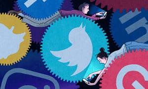

Take it from the insiders: Silicon Valley is eating your soul | John Harris

Illustration by Bill Bragg
[Internet](https://www.theguardian.com/technology/internet)
[Opinion](https://www.theguardian.com/uk/commentisfree)

# Take it from the insiders: Silicon Valley is eating your soul

[John Harris](https://www.theguardian.com/profile/johnharris)

Former Google and Facebook executives are sounding the alarm about the pervasive power of tech. Will we listen?

Contact author
[@johnharris1969](https://twitter.com/johnharris1969)
Mon 1 Jan ‘18 06.00 GMTLast modified on Mon 1 Jan ‘18 11.56 GMT

- [(L)](https://www.facebook.com/dialog/share?app_id=180444840287&href=https%3A%2F%2Fwww.theguardian.com%2Fcommentisfree%2F2018%2Fjan%2F01%2Fsilicon-valley-eating-soul-google-facebook-tech%3FCMP%3Dshare_btn_fb)
- [(L)](https://twitter.com/intent/tweet?text=Take%20it%20from%20the%20insiders%3A%20Silicon%20Valley%20is%20eating%20your%20soul%20%7C%20John%20Harris&url=https%3A%2F%2Fwww.theguardian.com%2Fcommentisfree%2F2018%2Fjan%2F01%2Fsilicon-valley-eating-soul-google-facebook-tech%3FCMP%3Dshare_btn_tw)
- [(L)](https://www.theguardian.com/commentisfree/2018/jan/01/silicon-valley-eating-soul-google-facebook-techmailto:?subject=Take%20it%20from%20the%20insiders%3A%20Silicon%20Valley%20is%20eating%20your%20soul%20%7C%20John%20Harris&body=https%3A%2F%2Fwww.theguardian.com%2Fcommentisfree%2F2018%2Fjan%2F01%2Fsilicon-valley-eating-soul-google-facebook-tech%3FCMP%3Dshare_btn_link)

-

### Shares

2,783

One source of angst came close to being 2017’s signature subject: how the internet and the tiny handful of companies that dominate it are affecting both individual minds and the present and future of the planet. The old idea of the online world as a burgeoning utopia looks to have peaked around the time of the Arab spring, and is in retreat.

If you want a sense of how much has changed, picture the president of the US tweeting his latest provocation in the small hours, and consider an array of words and phrases now freighted with meaning: [Russia](https://www.theguardian.com/uk-news/2017/dec/18/russia-linked-twitter-accounts-tried-to-divide-uk-after-terrorist-attacks), [bots](https://www.theguardian.com/commentisfree/2017/oct/16/bots-social-media-threaten-democracy-technology), [troll farms](https://www.theguardian.com/technology/2017/nov/14/british-mp-calls-on-twitter-to-release-russian-troll-factory-tweets), [online abuse](https://www.theguardian.com/technology/2016/apr/12/online-abuse-how-harrassment-revenge-pornography-different-countries-deal-with-it), [fake news](https://www.theguardian.com/media/2016/dec/18/what-is-fake-news-pizzagate), [dark money](https://www.theguardian.com/commentisfree/2017/feb/02/corporate-dark-money-power-atlantic-lobbyists-brexit).

#           [When Facebook asks if social media is bad for us, it’s time to listen]()

Nigel Kendall

Read more

 [(L)](https://www.theguardian.com/commentisfree/2017/dec/19/facebook-social-media-cold-turkey-devices)

Another sign of how much things have shifted is a volte-face by Silicon Valley’s most powerful man. Barely more than a year ago the Facebook founder, Mark Zuckerberg, seemed still to be rejoicing in his company’s imperial phase, blithely dismissing the idea that fabricated news carried by his platform had affected the outcome of the 2016 US election as a [“pretty crazy idea”](https://www.theguardian.com/technology/2016/nov/10/facebook-fake-news-us-election-mark-zuckerberg-donald-trump). Now scarcely a week goes by without some Facebook pronouncement or other, either updating the wider world about its latest quest to put its operations beyond criticism or assuring us that its belief in an eternally upbeat, fuzzily liberal ethos is as fervent as ever.

The company has reached a fascinating point in its evolution; it is as replete with importance and interest as any political party. Facebook is at once massively powerful and also suddenly defensive. Its deeply questionable tax affairs [are being altered](https://www.theguardian.com/technology/2017/dec/12/facebook-ad-revenue-countries-earned-ireland); 1,000 new employees have been hired to monitor its advertising. At the same time, it still seems unable to provide any answers to worries about its effects on the world beyond more and more Facebook. [A pre-Christmas statement claimed](https://newsroom.fb.com/news/2017/12/hard-questions-is-spending-time-on-social-media-bad-for-us/) that although “passive” use of social media could harm users, “actively interacting with people” online was linked not just to “improvements in wellbeing”, but to “joy”. In short, if Facebook does your head in, the solution is apparently not to switch off, but more Facebook.

> Former Facebook president Sean Parker warned that it 'literally changes your relationship with society, with each other'

While Zuckerberg and his colleagues do ethical somersaults, there is rising noise from a group of people who made headlines towards the year’s end: the former insiders at tech giants who now loudly worry about what their innovations are doing to us. The former Facebook president Sean Parker [warned in November](https://www.theguardian.com/technology/2017/nov/09/facebook-sean-parker-vulnerability-brain-psychology) that its platform “literally changes your relationship with society, with each other … God only knows what it’s doing to our children’s brains.”

At around the same time, the former Facebook executive Chamath Palihapitiya held a public interview at Stanford University in which he did not exactly mince his words. “The short-term, dopamine-driven feedback loops that we have created are destroying how society works,” [he said](https://www.gsb.stanford.edu/insights/chamath-palihapitiya-why-failing-fast-fails). “No civil discourse, no cooperation, misinformation, mistruth … So we are in a really bad state of affairs right now, in my opinion.” (Strangely, around a week later he seemed to recant, claiming he had only meant to “start an important conversation”, and that Facebook was still a company he “loved”.)

Then there is Tristan Harris, a former high-up at Google who is now hailed as “the closest thing Silicon Valley has to a conscience”. Under the banner of a self-styled “movement” called [Time Well Spent](http://www.timewellspent.io/), he and his allies are urging software developers to tone down the compulsive elements of their inventions, and the millions who find themselves hooked to change their behaviour.

#   [  Guardian Masterclasses](https://adclick.g.doubleclick.net/pcs/click?xai=AKAOjssxd4NJChPXrfrdnLsJKjD6HuTWPJFcZOuvqn2hmECM5Aak3Rb2YgzFQxvvplIu6B1i3kds58Ps7P_vX9EFplZLC9BfuDaB2yvZSNDQl13aIYyrKzHdwkGVrjbv5bndvtyRmCTi83DbJZCIJEJJTYrm8-AO1T5Wug5ZwfDhIX2dqVR9lFcJz96g1pM83I5yiO994z25xglrmnAInoWb7avC7EU3eIV1Js3w8ekyxrmXMSEw3W_JB60Axb46SxbP8zNO70E4Pf2i6mTFQecDngyG0Yz1d3y-fA&sig=Cg0ArKJSzOeAZD_TyB1DEAE&urlfix=1&adurl=https://membership.theguardian.com/event/a-day-with-leading-guardian-writers-everything-you-need-to-know-about-journalism-39327797501?INTCMP=gdnwb_copts_merchinline_mstrs_masterclasses_tracking_a_day_with_Guardian_writers_inline)

 [ ## A day with leading Guardian writers: Everything you need to know about journalism            Don’t miss cracking advice from Stuart Heritage, Decca Aitkenhead, Paula Cocozza and Kira Cochrane about interviewing, writing and pitching your stories to editors. Saturday 27 January 2018, 10am–4pm The Guardian, London   Book tickets](https://adclick.g.doubleclick.net/pcs/click?xai=AKAOjssxd4NJChPXrfrdnLsJKjD6HuTWPJFcZOuvqn2hmECM5Aak3Rb2YgzFQxvvplIu6B1i3kds58Ps7P_vX9EFplZLC9BfuDaB2yvZSNDQl13aIYyrKzHdwkGVrjbv5bndvtyRmCTi83DbJZCIJEJJTYrm8-AO1T5Wug5ZwfDhIX2dqVR9lFcJz96g1pM83I5yiO994z25xglrmnAInoWb7avC7EU3eIV1Js3w8ekyxrmXMSEw3W_JB60Axb46SxbP8zNO70E4Pf2i6mTFQecDngyG0Yz1d3y-fA&sig=Cg0ArKJSzOeAZD_TyB1DEAE&urlfix=1&adurl=https://membership.theguardian.com/event/a-day-with-leading-guardian-writers-everything-you-need-to-know-about-journalism-39327797501?INTCMP=gdnwb_copts_merchinline_mstrs_masterclasses_tracking_a_day_with_Guardian_writers_inline)

What they are up against, meanwhile, is apparently personified by Nir Eyal, a Stanford lecturer and tech consultant who could be a character from the brilliant [HBO sitcom Silicon Valley](https://www.theguardian.com/tv-and-radio/tvandradioblog/2014/aug/06/silicon-valley-mike-judge-sitcom). In 2013 he published Hooked: How To Build Habit-Forming Products. His inspiration for the book is the behaviourist psychology pioneered by BF Skinner. Among his pearls of wisdom is one both simple and chilling: “For new behaviours to really take hold, they must occur often.” But on close inspection, even he sounds somewhat ambivalent: last April, at something called the Habit Summit, he told his audience that at home he had installed a device that cut off the internet at a set time every day.

Good for him. The reality for millions of other people is a constant experience that all but buries the online world’s liberating possibilities in a mess of alerts, likes, messages, retweets and internet use so pathologically needy and frantic that it inevitably makes far too many people vulnerable to pernicious nonsense and real dangers.

Thanks to manipulative ephemera, WhatsApp users anxiously await the ticks that confirm whether a message has been read by a receiver; and, a turbocharged version of the addictive dots that flash on an iPhone when a friend is replying to you, Snapchat now alerts its users when a friend starts typing a message to them. And we all know what lies around the corner: a world of Sensurround virtual reality, and an internet wired into just about every object we interact with. As the repentant Facebookers say: if we’re not careful, we will soon be at risk of being locked into mindless behavioural loops, craving distraction even from other distractions.

There is a possible way out of this, of course. It resides not in some luddite fantasy of an army of people carrying old Nokia phones and writing each other letters, but the possibility of a culture that actually embraces the idea of navigating the internet with a discriminating sensibility and an emphasis on basic moderation. We now know – don’t we? – that the person who begins most social encounters by putting their phone on the table is either an addict or an idiot.

#           [How a half-educated tech elite delivered us into chaos]()

John Naughton

Read more

 [(L)](https://www.theguardian.com/commentisfree/2017/nov/19/how-tech-leaders-delivered-us-into-evil-john-naughton)

There is also a mounting understanding that one of the single most important aspects of modern parenting is to be all too aware of how much social media can mess with people’s minds, and to limit our children’s screen time. This, after all, is what [Bill Gates](https://www.theguardian.com/technology/billgates) and Steve Jobs did, as evidenced by one of the latter’s most pithy statements. In 2010 he was asked about his children’s opinion of the iPad. “They haven’t used it,” he said. “We limit how much technology our kids use at home.”

Two billion people actively use Facebook; at least 3.5 billion are now reckoned to be online. Their shared habits, compulsions and susceptibilities will clearly have a huge influence on the world’s progress, or lack of it. So we ought to listen to Tristan Harris and his campaign. “Religions and governments don’t have that much influence over people’s daily thoughts,” [he recently told Wired magazine](https://www.wired.com/story/our-minds-have-been-hijacked-by-our-phones-tristan-harris-wants-to-rescue-them/). “But we have three technology companies” – he meant Facebook, Google and Apple – “who have this system that frankly they don’t even have control over … Right now, 2 billion people’s minds are already jacked in to this automated system, and it’s steering people’s thoughts toward either personalised paid advertising or misinformation or conspiracy theories. And it’s all automated; the owners of the system can’t possibly monitor everything that’s going on, and they can’t control it.”

And then came the kicker. “This isn’t some kind of philosophical conversation. This is an urgent concern happening right now.” Amid an ocean of corporate sophistry and doublethink, those words have the distinct ring of truth.

• John Harris is a Guardian columnist
Topics

- [Internet/](https://www.theguardian.com/technology/internet)
- [Opinion/](https://www.theguardian.com/uk/commentisfree)
- [Facebook/](https://www.theguardian.com/technology/facebook)
- [Social networking/](https://www.theguardian.com/media/socialnetworking)
- [Apple/](https://www.theguardian.com/technology/apple)
- [Computing/](https://www.theguardian.com/technology/computing)
- [Steve Jobs/](https://www.theguardian.com/technology/stevejobs)
- [comment/](https://www.theguardian.com/tone/comment)
- [(L)](https://www.facebook.com/dialog/share?app_id=180444840287&href=https%3A%2F%2Fwww.theguardian.com%2Fcommentisfree%2F2018%2Fjan%2F01%2Fsilicon-valley-eating-soul-google-facebook-tech%3FCMP%3Dshare_btn_fb)
- [(L)](https://twitter.com/intent/tweet?text=Take%20it%20from%20the%20insiders%3A%20Silicon%20Valley%20is%20eating%20your%20soul%20%7C%20John%20Harris&url=https%3A%2F%2Fwww.theguardian.com%2Fcommentisfree%2F2018%2Fjan%2F01%2Fsilicon-valley-eating-soul-google-facebook-tech%3FCMP%3Dshare_btn_tw)
- [(L)](https://www.theguardian.com/commentisfree/2018/jan/01/silicon-valley-eating-soul-google-facebook-techmailto:?subject=Take%20it%20from%20the%20insiders%3A%20Silicon%20Valley%20is%20eating%20your%20soul%20%7C%20John%20Harris&body=https%3A%2F%2Fwww.theguardian.com%2Fcommentisfree%2F2018%2Fjan%2F01%2Fsilicon-valley-eating-soul-google-facebook-tech%3FCMP%3Dshare_btn_link)
- [Share on LinkedIn](http://www.linkedin.com/shareArticle?mini=true&title=Take%20it%20from%20the%20insiders%3A%20Silicon%20Valley%20is%20eating%20your%20soul%20%7C%20John%20Harris&url=https%3A%2F%2Fwww.theguardian.com%2Fcommentisfree%2F2018%2Fjan%2F01%2Fsilicon-valley-eating-soul-google-facebook-tech)
- [Share on Pinterest](http://www.pinterest.com/pin/find/?url=https%3A%2F%2Fwww.theguardian.com%2Fcommentisfree%2F2018%2Fjan%2F01%2Fsilicon-valley-eating-soul-google-facebook-tech)
- [Share on Google+](https://plus.google.com/share?url=https%3A%2F%2Fwww.theguardian.com%2Fcommentisfree%2F2018%2Fjan%2F01%2Fsilicon-valley-eating-soul-google-facebook-tech%3FCMP%3Dshare_btn_gp&amp;hl=en-GB&amp;wwc=1)
- [Share on WhatsApp](https://www.theguardian.com/commentisfree/2018/jan/01/silicon-valley-eating-soul-google-facebook-techwhatsapp://send?text=%22Take%20it%20from%20the%20insiders%3A%20Silicon%20Valley%20is%20eating%20your%20soul%20%7C%20John%20Harris%22%20https%3A%2F%2Fwww.theguardian.com%2Fcommentisfree%2F2018%2Fjan%2F01%2Fsilicon-valley-eating-soul-google-facebook-tech%3FCMP%3Dshare_btn_wa)
- [Share on Messenger](https://www.theguardian.com/commentisfree/2018/jan/01/silicon-valley-eating-soul-google-facebook-techfb-messenger://share?link=https%3A%2F%2Fwww.theguardian.com%2Fcommentisfree%2F2018%2Fjan%2F01%2Fsilicon-valley-eating-soul-google-facebook-tech%3FCMP%3Dshare_btn_me&app_id=180444840287)