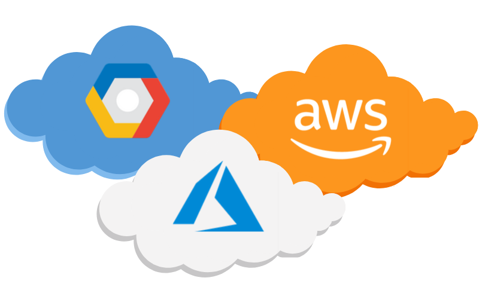

Team Solutions for Jupyter Notebook - Towards Data Science

## [DATA ENGINEERING 101](https://towardsdatascience.com/tagged/data-engineering-101)

# Team Solutions for Jupyter Notebook

## A hand-picked list of solutions for enabling team collaboration on Jupyter Notebook.

[Xinran Waibel](https://towardsdatascience.com/@xinran.waibel?source=post_page-----4c8f4612fcd5----------------------)

[Mar 2](https://towardsdatascience.com/team-solutions-for-jupyter-notebook-4c8f4612fcd5?source=post_page-----4c8f4612fcd5----------------------) · 4 min read

Photo by [Annie Spratt](https://unsplash.com/@anniespratt?utm_source=unsplash&utm_medium=referral&utm_content=creditCopyText) on [Unsplash](https://unsplash.com/s/photos/team?utm_source=unsplash&utm_medium=referral&utm_content=creditCopyText)

[Jupyter Notebook](https://jupyter.org/), the de facto notebook framework in the data science community, is widely adopted for data exploration, analysis, and visualization. In the real world, Jupyter is not only used in local development but also in production, which means notebook files need to be shared among team members like any other code. In addition, since Jupyter notebooks are often used like reports and dashboards to be presented to business teams and executives, it is also important for non-engineering company members to be able to easily reproduce notebook results without heavy setup processes.

You’ll likely need some kind of hosted Jupyter service in order to enable team collaboration on Jupyter in a data organization. In this blog post, I will evaluate several options for hosting Jupyter Notebook to help you find the perfect team solution for your data science team.

*(Not sure if Jupyter is right for your data science team? Check out my guide on *[*How to Pick the Right Notebook for Data Science*](https://towardsdatascience.com/how-to-pick-the-right-notebook-for-data-science-7dc418c4da57)*.)*

* * *

*...*

## JupyterHub

Source: [JupyterHub](https://jupyter.org/hub)

As part of [Project Jupyter](https://jupyter.org/index.html), [JupyterHub](https://jupyterhub.readthedocs.io/en/stable/) is a multi-user Hub that spawns, manages, and proxies multiple instances of a single-user Jupyter notebook server. It allows users to access their own Jupyter server and storage in a browser without any local installation. JupyterHub is highly scalable: it can either support a small data team [using a single server](https://github.com/jupyterhub/the-littlest-jupyterhub) or a big organization of thousands of users by [leveraging Kubernetes](https://github.com/jupyterhub/zero-to-jupyterhub-k8s).

One big advantage of JupyterHub is flexibility. It is integrated with many user interfaces including [JupyterLab](https://jupyterlab.readthedocs.io/en/stable/) and [nteract](https://nteract.io/) and a variety of kernels in different programming languages. Authentication is customizable too as it supports common protocols such as OAuth and GitHub.

## Binder

Source: [Binder](https://mybinder.org/)

[Binder](https://jupyter.org/binder) is a web-based tool that allows users to share Jupyter notebooks along with a custom computing environment via a single link. Binder is powered by [BinderHub](https://binderhub.readthedocs.io/en/latest/), an open-source framework for spawning custom computing environments to be shared by many remote users.

Using Binder to share interactive Jupyter notebooks is super easy. First, create a Git repository that has notebooks along with [environment configuration files](https://mybinder.readthedocs.io/en/latest/introduction.html). Then, simply provide the Github URL to Binder and Binder will set up everything and give you a sharable link to your Jupyter environment. Anyone with the link can run your notebooks in a browser without any local setups.

*(*[*mybinder.org*](https://mybinder.org/)* is a free public Binder server run by Project Jupyter. Try it out!)*

## Colab

Source: [Colab](https://colab.research.google.com/)

[Colab](https://colab.research.google.com/) is a hosted Jupyter Notebook provided by Google and is free-to-use for anyone with a Google account. Sharing notebooks in Colab is exactly like sharing files in Google Drive because notebook files are stored in Google Drive. Colab is integrated with Github and users can easily clone, compare, and commit notebooks via UI. Currently, it only supports Python, R, and SQL.

As of today, Colab has a limitation of 20GB of memory per user and there is no paid option to scale beyond it. As Colab is fully-managed by Google, users don’t have many options for customizing Jupyter environments.

## Cloud-specific solutions

Source: [ParkMyCloud](https://www.parkmycloud.com/blog/cloud-providers/)

**Google Cloud Platform**: [DataLab](https://cloud.google.com/datalab) is an exclusive tool on GCP that creates single-server Jupyter Notebooks that users can remotely access. It currently only supports Python and SQL. I personally would not recommend this DataLab for large teams because GCP admins will need to create one DataLab instance per user and users need to use the GCP CLI tool in order to connect to DataLab. Moreover, the current UI of DataLab is hard to use.

**Microsoft Azure**: [Azure Notebooks](https://notebooks.azure.com/) is a fully-managed Jupyter Notebook service on Azure and it has Python, R, and F# kernels. It also supports a couple of popular Jupyter extensions such as JupyterLab.

**Amazon Web Services**: [Amazon SageMaker](https://docs.aws.amazon.com/sagemaker/latest/dg/whatis.html) is a full-managed ML tool for developing, training and deploying machine learning models. One of the many features offered by SageMaker is [SageMaker Studio](https://docs.aws.amazon.com/sagemaker/latest/dg/gs-studio.html): a web-based hosted Jupyter service built around JupyterLab. Users can easily access Studio via a URL using AWS credentials and each user has its own home directory. SageMaker Studio offers a selection of [pre-configured computing environments](https://docs.aws.amazon.com/sagemaker/latest/dg/notebooks-create-notebook.html) for notebooks but currently, it only supports Python 3 kernel.

* * *

*...*

Jupyter Notebook has potentials far beyond just data exploration and ad-hoc data analysis. In fact, I am seeing many data teams starting to use notebooks as scripts in production. Check out my guide on how to [Build Data Pipelines with Apache Airflow](https://towardsdatascience.com/https-medium-com-xinran-waibel-build-data-pipelines-with-apache-airflow-808a4de79047).

Want to learn more about Data Engineering? Check out my [Data Engineering 101](https://towardsdatascience.com/tagged/data-engineering-101) column on Towards Data Science:

[ ## Data Engineering 101 - Towards Data Science  ###  Read writing about Data Engineering 101 in Towards Data Science. A Medium publication sharing concepts, ideas, and…     ####  towardsdatascience.com](https://towardsdatascience.com/tagged/data-engineering-101)