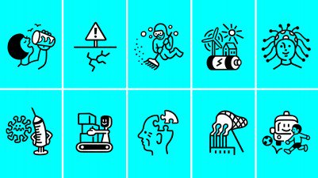
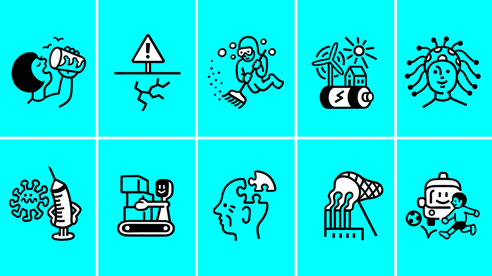

Ten big global challenges technology could solve

Illustrations by Tomi Um

###   [Sustainable Energy](https://www.technologyreview.com/topic/sustainable-energy/)

# Ten big global challenges technology could solve

## None is easy, but all are incredibly important.

- by[The Editors](https://www.technologyreview.com/profile/the-editors/)
- February 27, 2019
- [**](https://www.technologyreview.com/s/612951/ten-big-global-challenges-technology-could-solve/?linkId=64912372#)
- [**](https://www.technologyreview.com/s/612951/ten-big-global-challenges-technology-could-solve/?linkId=64912372#)
- [**](https://www.technologyreview.com/s/612951/ten-big-global-challenges-technology-could-solve/?linkId=64912372#)
- [**](https://www.technologyreview.com/s/612951/ten-big-global-challenges-technology-could-solve/?linkId=64912372#)
- [**](https://www.technologyreview.com/s/612951/ten-big-global-challenges-technology-could-solve/?linkId=64912372#)
- [**](https://www.technologyreview.com/s/612951/ten-big-global-challenges-technology-could-solve/?linkId=64912372#)

- [**](https://www.technologyreview.com/s/612951/ten-big-global-challenges-technology-could-solve/?linkId=64912372#)
- [**](https://www.technologyreview.com/s/612951/ten-big-global-challenges-technology-could-solve/?linkId=64912372#)
- [**](https://www.technologyreview.com/s/612951/ten-big-global-challenges-technology-could-solve/?linkId=64912372#)
- [**](https://www.technologyreview.com/s/612951/ten-big-global-challenges-technology-could-solve/?linkId=64912372#)
- [**](https://www.technologyreview.com/s/612951/ten-big-global-challenges-technology-could-solve/?linkId=64912372#)
- [**](https://www.technologyreview.com/s/612951/ten-big-global-challenges-technology-could-solve/?linkId=64912372#)

**Carbon sequestration**

Cutting greenhouse-gas emissions alone won’t be enough to prevent sharp increases in global temperatures. We’ll also need to remove vast amounts of carbon dioxide from the atmosphere, which not only would be incredibly expensive but would present us with the thorny problem of [what to do with all that CO2](https://www.technologyreview.com/s/612928/one-mans-two-decade-quest-to-suck-greenhouse-gas-out-of-the-sky/). A growing number of startups are exploring ways of recycling carbon dioxide into products, including synthetic fuels, polymers, carbon fiber, and concrete. That’s promising, but what we’ll really need is a cheap way to permanently store the billions of tons of carbon dioxide that we might have to pull out of the atmosphere.

**Grid-scale energy storage**

Renewable energy sources like wind and solar are becoming cheap and more widely deployed, but they don’t generate electricity when the sun’s not shining or wind isn’t blowing. That limits how much power these sources can supply, and how quickly we can move away from steady sources like coal and natural gas. The cost of building enough batteries to back up entire grids for the days when renewable generation flags would be astronomical. Various scientists and startups are working to develop cheaper forms of grid-scale storage that can last for longer periods, including flow batteries or tanks of molten salt. Either way, we desperately need a cheaper and more efficient way to store vast amounts of electricity.

This story is part of our March/April 2019 Issue

[See the rest of the issue](https://www.technologyreview.com/magazine/2019/03/)
[Subscribe](https://www.technologyreview.com/subscribe/)

##### Recommended for You

1. [The mass shooting in New Zealand shows how broken social media is](https://www.technologyreview.com/the-download/613132/the-mass-shooting-in-new-zealand-shows-how-broken-social-media-is/)

2. [A quantum experiment suggests there’s no such thing as objective reality](https://www.technologyreview.com/s/613092/a-quantum-experiment-suggests-theres-no-such-thing-as-objective-reality/)

3. [IBM’s photo-scraping scandal shows what a weird bubble AI researchers live in](https://www.technologyreview.com/the-download/613131/ibms-photo-scraping-scandal-shows-what-a-weird-bubble-ai-researchers-live-in/)

4. [No, scientists didn’t just “reverse time” with a quantum computer](https://www.technologyreview.com/s/613123/no-ibm-didnt-just-reverse-time-with-a-quantum-computer/)

5. [The collision of two distant galaxies was caught in this new Hubble image](https://www.technologyreview.com/the-download/613116/the-collision-of-two-distant-galaxies-was-caught-in-this-new-hubble-image/)

**Universal flu vaccine**

Pandemic flu is rare but deadly. At least 50 million people died in the 1918 pandemic of H1N1 flu. More recently, about a million people died in the 1957-’58 and 1968 pandemics, while something like half a million died in a 2009 recurrence of H1N1. The recent death tolls are lower in part because the viruses were milder strains. We might not be so lucky next time—a particularly potent strain of the virus could replicate too quickly for any tailor-made vaccine to effectively fight it. A universal flu vaccine that protected not only against the relatively less harmful variants but also against a catastrophic once-in-a-century outbreak is a crucial public health challenge.

**Dementia treatment**

More than one in 10 Americans over the age of 65 has Alzheimer’s; a third of those over 85 do. As people’s life spans lengthen, the number of people living with the disease—in the US and around the world—is likely to skyrocket. Alzheimer’s remains poorly understood: conclusive diagnoses are possible only after death, and even then, doctors debate the distinction between Alzheimer’s and other forms of dementia. However, advances in neuroscience and genetics are beginning to shed more light. That understanding is providing clues to how it might be possible to slow or even shut down the devastating effects of the condition.

**Ocean clean-up**

Billions of tiny pieces of plastic—so-called “microplastics”—are now floating throughout the world’s oceans. Much of this waste comes from bags or straws that have been broken up over time. It’s poisoning birds, fish, and humans. Researchers fear that the effects on both human health and the environment will be profound, and it may take centuries to clean up the hundreds of millions of tons of plastic that have accumulated over the decades. Because the pollution is so diffuse, it’s difficult to clean up, and while there are prototype methods for tackling the massive oceanic garbage patches, there is no solution for coasts, seas, and waterways.

**Energy-efficient desalination**

There is about 50 times as much salt water on earth as there is fresh water. As the world’s population grows and climate change intensifies droughts, the need for fresh water is going to grow more acute. Israel has built the world’s biggest reverse-osmosis desalination facilities and now gets most of its household water from the sea, but that method is too energy intensive to be practical worldwide. New types of membranes might help; electrochemical techniques may also help to make brackish water useful for irrigation. As far as climate-change adaptation technologies go, creating drinking water from the ocean ought to be a top priority.

**Safe driverless car**

Autonomous vehicles have been tested for millions of miles on public roads. Pilot programs for delivery and taxi services are under way in places like the suburbs of Phoenix. But driverless cars still aren’t ready to take over roads in general. They have trouble handling chaotic traffic, and difficulty with weather conditions like snow and fog. If they can be made reliably safe, they might allow a wholesale reimagining of transportation. Traffic jams might be eliminated, and cities could be transformed as parking lots give way to new developments. Above all, self-driving cars, if widely deployed, are expected to eliminate most of the 1.25 million deaths a year caused by traffic accidents.

**Embodied AI**

Last fall a video of Atlas, designed by Boston Dynamics, swept the internet. It showed the robot jumping up steps like a commando. This came only two years after AlphaGo beat the world’s best Go player. Atlas can’t play Go (it is embodied, but not intelligent), and AlphaGo can’t run (it’s intelligent, in its own way, but lacks a body). So what happens if you put AlphaGo’s mind in Atlas’s body? Many researchers say true general artificial intelligence might depend on an ability to relate internal computational processes to real things in the physical world, and that an AI would acquire that ability by learning to interact with the physical world as people and animals do.

We can predict hurricanes days and sometimes weeks in advance, but earthquakes still come as a surprise. Predicting them with confidence could save millions of lives.

**Earthquake prediction**

Over 100,000 people died in the 2010 Haiti earthquake, and the 2004 Indian Ocean tsunami—triggered by one of the most powerful earthquakes ever recorded—killed nearly a quarter of a million people in Indonesia, Sri Lanka, India, and elsewhere. We can predict hurricanes days and sometimes weeks in advance, but earthquakes still come as a surprise. Predicting earthquakes with some confidence over the medium term would allow planners to figure out durable solutions. At least giving a few hours’ warning would allow people to evacuate unsafe areas, and could save millions of lives.

Sign up for **The Download**

Your daily dose of what's up in emerging technology

*

Stay updated on MIT Technology Review initiatives and events?*

- Yes
- No

**Brain decoding**

Our brains remain a deep mystery to neuroscientists. Everything we think and remember, and all our movements, must somehow be coded in the billions of neurons in our heads. But what is that code? There are still many unknowns and puzzles in understanding the way our brains store and communicate our thoughts. Cracking that code could lead to breakthroughs in how we treat mental disorders like schizophrenia and autism. It might allow us to improve direct interfaces that communicate directly from our brains to computers, or even to other people—a life-changing development for people who are paralyzed by injury or degenerative disease.

Keep up with the latest in artificial intelligence at EmTech Digital.

The Countdown has begun.
March 25-26, 2019
San Francisco, CA

[Register now](https://events.technologyreview.com/emtech/digital/19?utm_medium=trsite&utm_source=instory&utm_campaign=emtech_digital_2019.unpaid.acquisition&utm_content=tags&discount=TAGINST#section-register)

' data-evernote-id='752' class='js-evernote-checked'%3e %3canimateTransform attributeName='transform' type='rotate' from='0 16 16' to='360 16 16' dur='0.8s' repeatCount='indefinite' data-evernote-id='753' class='js-evernote-checked'%3e%3c/animateTransform%3e %3c/path%3e %3c/svg%3e)

From Our Advertisers

- [In association with**VMware**  Digital transformation sparks innovation in networking](https://www.technologyreview.com/s/612364/digital-transformation-sparks-innovation-in-networking/)
- [In association with**Google**  For data-savvy marketers, there’s a new keyword: Intent](https://www.technologyreview.com/s/612244/for-data-savvy-marketers-theres-a-new-keyword-intent/)
- [In association with**Google**  Machine learning teaches marketers to cultivate a growth mindset](https://www.technologyreview.com/s/611994/machine-learning-teaches-marketers-to-cultivate-a-growth-mindset/)
- [In association with**Oracle and Intel**  Machine learning - driven analytics: Key to digital transformation](https://www.technologyreview.com/s/611996/machine-learning-driven-analytics-key-to-digital-transformation/)

### Share

- [**](https://www.technologyreview.com/s/612951/ten-big-global-challenges-technology-could-solve/?linkId=64912372#)
- [**](https://www.technologyreview.com/s/612951/ten-big-global-challenges-technology-could-solve/?linkId=64912372#)
- [**](https://www.technologyreview.com/s/612951/ten-big-global-challenges-technology-could-solve/?linkId=64912372#)
- [**](https://www.technologyreview.com/s/612951/ten-big-global-challenges-technology-could-solve/?linkId=64912372#)
- [**](https://www.technologyreview.com/s/612951/ten-big-global-challenges-technology-could-solve/?linkId=64912372#)
- [**](https://www.technologyreview.com/s/612951/ten-big-global-challenges-technology-could-solve/?linkId=64912372#)

### Tagged

[clean energy](https://www.technologyreview.com/g/clean-energy/),[artificial intelligence](https://www.technologyreview.com/g/artificial-intelligence/),[carbon sequestration](https://www.technologyreview.com/g/carbon-sequestration/),[climate change](https://www.technologyreview.com/g/climate-change/),[Tech and health](https://www.technologyreview.com/g/tech-and-health/)

### Credit

Illustrations by Tomi Um
[The Editors](https://www.technologyreview.com/profile/the-editors/)