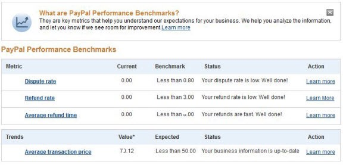
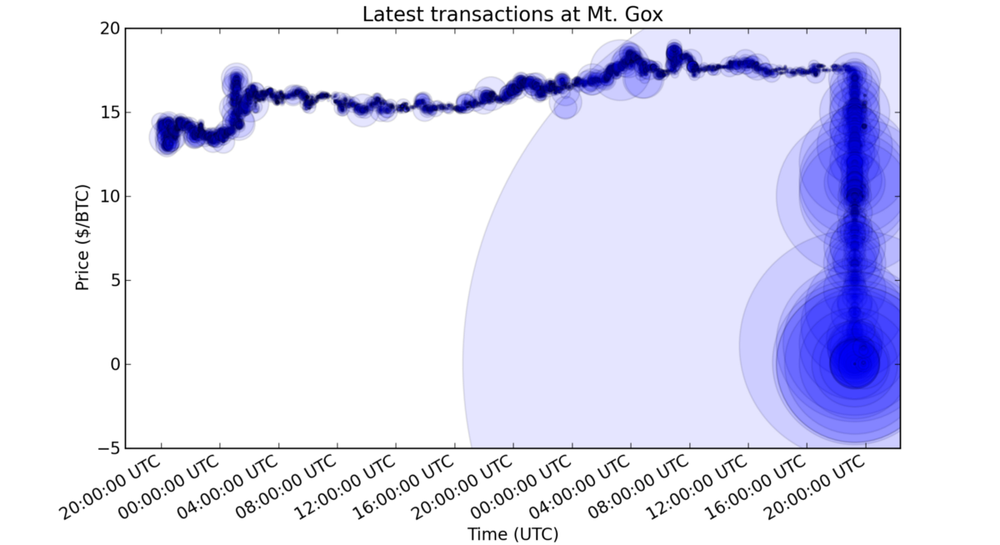
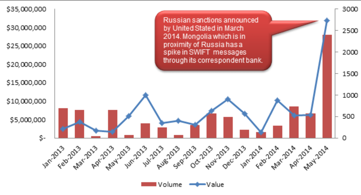
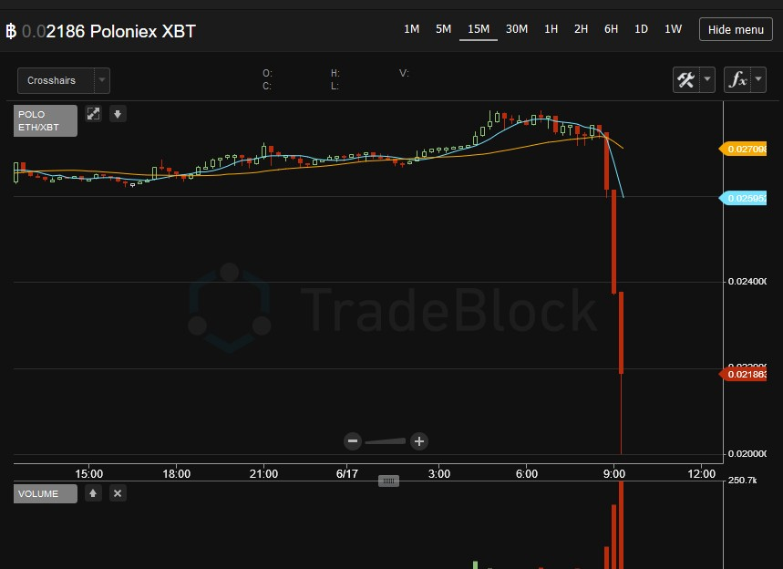
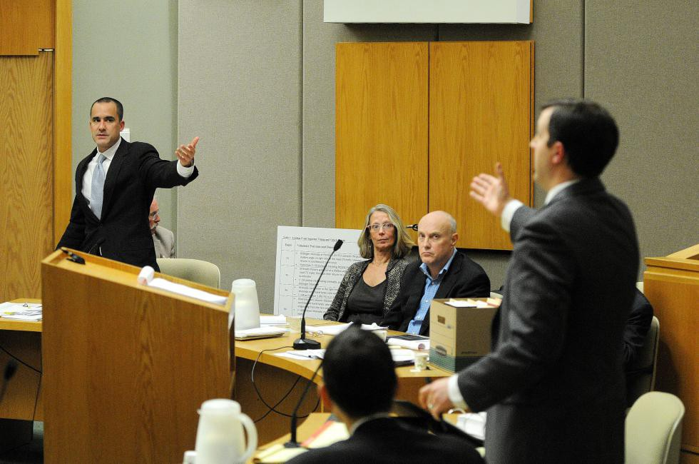
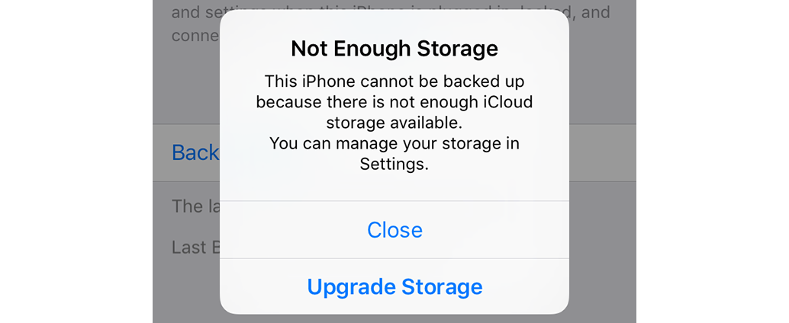

Ten years in, nobody has come up with a use for blockchain

# **Ten years in, nobody has come up with a use for blockchain**

*Everyone says the blockchain, the technology underpinning cryptocurrencies such as bitcoin, is going to change EVERYTHING. And yet, after years of tireless effort and billions of dollars invested, nobody has actually come up with a use for the blockchain—besides currency speculation and illegal transactions.*

*Each purported use case — from payments to legal documents, from escrow to voting systems—amounts to a set of contortions to add a distributed, encrypted, anonymous ledger where none was needed. **What if there isn’t actually any use for a distributed ledger at all? What if, ten years after it was invented, the reason nobody has adopted a distributed ledger at scale is because nobody wants it?*

### **Payments and banking**

The original intended use of the blockchain was to power currencies like bitcoin — a way to store and exchange value much like any other currency. Visa and MasterCard were dinosaurs, everyone proclaimed, because there was now a costless, instant way to exchange value without the middleman taking a cut. A revolution in banking was just the start… governments, unable to issue currency by fiat anymore, would take a back seat as individual citizens transacted freely outside any national system.

The killer feature: knowing you can get your money back

It didn’t take long for that dream to fall apart. For one thing, there’s already a costless, instant way to exchange value without a middleman: cash. Bitcoins substitute for dollars, but Visa and MasterCard actually sit on top of dollar-based banking transactions, providing a set of value-added services like enabling banks to track fraud disputes, and verifying the identity of the buyer and seller. It turns out that for the person paying for a product, the key feature of a new payment system — think of PayPal in its early days — is the confidence that if the goods aren’t as described you’ll get your money back. And for the person accepting payment, basically the key feature is that their customer has it, and is willing to use it. Add in points, credit lines, and a free checked bag on any United flight and you have something that consumers choose and merchants accept. Nobody actually wants to pay with bitcoin, which is why it hasn’t taken off.

> The key feature of a new payment system — think of PayPal in its early days — is the confidence that if the goods aren’t as described you’ll get your money back.

It would take 5,000 nuclear reactors to run Visa on the blockchain.

Plus, it’s not actually that good a payment system — Visa can handle sixty thousand transactions per second, while Bitcoin historically taps out at seven. There are technical modifications going on to improve Bitcoin’s efficiency, but as a starting point, you have something that’s about 0.01% as good at clearing transactions. (And, worth noting, for those seven transactions a second Bitcoin is already estimated to use 35 times as much energy as Visa. If you brought Bitcoin’s transaction volume up to Visa’s it would be using as much electricity as the rest of the world put together.)

### **Freedom to transact without government supervision**

In many countries, and often our own, a little bit of ability to keep a few things private from the authorities probably makes the world a better place. In places like Cuba or Venezuela, many prefer to transact in dollars, and bitcoin could in theory serve a similar function. Yet there are two reasons this hasn’t been the panacea it’s assumed: the advantages of government to the individual, and the advantages of government to society.

Mt Gox loses all its customers’ money

The government-backed banking system provides FDIC guarantees, reversibility of ACH, identity verification, audit standards, and an investigation system when things go wrong. Bitcoin, by design, has none of these things. I saw a remarkable message thread by someone whose bitcoin account got drained because their email had been hacked and their password was stolen. They were stunned to have no recourse! And this is widespread — in 2014, the then-#1 bitcoin trader, Mt. Gox, also lost $400m of investor money due to security failures. The subsequent #1 bitcoin trader, Bitfinex, also shut down after a loss of customer funds. Imagine the world if more banks had been drained of customer funds than not. Bitcoin is what banking looked like in the middle ages — “here’s your libertarian paradise, have a nice day.”

> Bitcoin is what banking looked like in the middle ages — “here’s your libertarian paradise, have a nice day.”

Mongolian banks experienced +400% transaction volume with new sanctions against Russia. New slogan –“Bitcoin: less cops than Mongolia.”

Second, government policies are designed to disrupt terrorist financing and organized crime, and prevent traffic in illegal goods like stolen credit card numbers or child pornography. The mainstream preference is to have transactions private but not *undiscoverable under warrant* — ask “should the government have a list everyone you’ve paid money to,” and most will say no; ask “should the government be able under warrant to get a list everyone a child pornography collector has paid money to,” and most will say yes. Nobody wants bitcoin to 100x the total traffic in goods and services our government defines as illegal — as one bitcoin enthusiast pointed out to me, “If you invented cash today, it would be illegal too.”

### **Micropayments and bank-to-bank transfers**

It’s worth noting two particular payment use cases where people are particularly excited about blockchain-based currencies: micropayments and bank-to-bank transfers. In terms of micropayments, people enthuse that bitcoin transactions are free and instant. Actually, they take about eight minutes to clear and cost about four cents to process. People have proposed that you will use bitcoins for micropayments — for example, paying two cents to a musician to listen to their song on the internet, or four cents to read a newspaper article. Yet the infrastructure to do this — for example, advance authorization with the source of funds so you don’t have to wait eight minutes to read the article you just clicked — actually eliminates the need for bitcoin at all. If you’re happy to pay four cents an article or two cents a song, you can set it up to bill once a month from your bank account and read to your heart’s content. And in practice, people prefer subscription services to micropayments.

Three years in, Ripple is to SWIFT what toothpicks are to the US GDP

In terms of interbank payments, many people mention Ripple as a promising way to transfer money between banks. Over the last 30 days it processed two billion dollars (as of this writing) worth of interbank and interpersonal transactions — about 40 seconds’ worth of volume on the SWIFT interbank network — after three years of being available to banks to trade 90% of the world’s high-volume currencies. This is like the proportion of US GDP comprised by toothpick sales. Why haven’t banks preferred this new technology? The answer is that setting up a Ripple Gateway isn’t actually much different than using the existing corresponding-account system — except that a lost password or security token can lead to much larger and more instant actual losses — which, as a reminder, has happened to more leading bitcoin exchanges than have managed to avoid it. The same features that make the banking system attractive to end users also make it attractive to banks. They already have ledgers, and don’t need to distribute them, anonymize them, encrypt them, publish them, and make them irreversible.

### **“Smart” contracts**

“Smart” contracts are contracts written as software, rather than written as legal text. Because you can encode them directly on the blockchain, they can involve the transfer of value based directly on the cryptographic consent of the parties involved — in other words, they are “self-executing.” And in theory, contracts written in software are cheaper to interpret — because their operation is literally mathematical and automatic, there are no two ways to interpret them, which means there’s no need for expensive legal battles.

The DAO loses all its customers’ money

And yet the real-world examples show the ways this is problematic. The most prominent and largest smart contract to date, an investment vehicle called the Distributed Autonomous Organization (DAO), enabled its members to invest directly using their private cryptographic keys to vote on what to invest in. No lawyers, no management fees, no opaque boardrooms, the DAO “removes the ability of directors and fund managers to misdirect and waste investor funds.” And yet, due to a software bug, the DAO “voted” to “invest” $50m, a third of its members’ money, into a vehicle controlled by very clever programmers who knew a lot about recursion issues during balance updates. Some said this was a hack or an exploit because the software had not functioned as intended, while others said that there was no such thing as a hack — *the whole point* was that the software made decisions autonomously and there were no two ways to interpret it, and if you didn’t understand how the software worked you shouldn’t have participated. In the end, everyone got together and voted to retroactively amend the software contract and move the money back to its original owners. What’s the takeaway? *Even the most die-hard blockchain enthusiasts actually want a bunch of humans arguing about the underlying intention behind a contract, rather than letting the software self-execute.* Maybe the “dumb” way is smart after all?

Even crypto enthusiasts want to argue about what their contracts mean

The DAO was an illustrative experiment, but what about for routine transactions at big companies? The investors and startups in the smart-contract space promise that the block chain will enable super-fast execution and payment — for example that in healthcare applications, “instead of waiting 90–180 days for a claim to be processed, or spending hours on the phone trying to get your bill paid, it can in theory be processed on the spot.” But that’s true for any software-enabled purchasing system. My company’s Amazon servers scale automatically based on website traffic and bill us for how much we use. The idea that smart contracts would change this is a fallacy — it conflates the legal arrangement being *put into effect*  *with software* with the legal arrangement itself being *coded as software*. Amazon’s terms of service are not a smart contract, but the billing system that implements those terms is automated. To the extent that health insurance billing, for example, is not automated, the problem isn’t that existing software isn’t “smart” enough to handle submitting claims and paying them electronically, it’s that the insurance company is slow moving, either by accident or because they on-purpose prefer a human review.

Can bitcoin make this go faster please?

In the end, everyone from blockchain enthusiasts to health insurers actually wants to argue out in human language what the business relationship is and interpret it on an ongoing basis, and then to write software that handles the fulfillment and payment. That already exists — it’s the status quo.

### **Distributed storage, computing, and messaging**

Another implausible idea is using the blockchain as a distributed storage mechanism. On its face it makes sense — you break your document up into “blocks”, encrypt them, and put them in a distributed ledger… it’s backed up across multiple locations, it’s secure, and easy to track everything that happened.

Yet there are multiple excellent ways to break up files, encrypt them, and replicate them across multiple storage media in different locations. There is already a company that bills itself as a cheaper, distributed Dropbox, which encrypts and stores files across multiple users’ hard drives and pays them a small fee for the free space on their hard drives. The block chain is just a particularly inefficient and insecure way of doing this.

Ha! Can your blockchain do *THIS?*

There are four additional problems with a blockchain-driven approach. First, you’re relying on single-point encryption — your own private keys — rather than a more sophisticated system that might involve two-factor authorization, intrusion detection, volume limits, firewalls, remote IP tracking, and the ability to disconnect the system in an emergency. Second, price tradeoffs are entirely implausible — the bitcoin blockchain has consumed almost a billion dollars worth of electricity to hash an amount of data equivalent to about a sixth of what I get for my ten dollar a month dropbox subscription. Fourth, systematically choosing where and how much to replicate data is an advantage in the long run — the blockchain’s defaults on data replication just aren’t that smart. And finally, Dropbox and Box.com and Google and Microsoft and Apple and Amazon and everyone else provide a set of valuable other features that you don’t actually want to go develop on your own. Analogous to Visa, the problem isn’t storing data, it’s managing permissions, un-sharing what you shared before, getting an easy-to-view document history, syncing it on multiple devices, and so on.

The same argument holds for proposed distributed computing and secure messaging applications. Encrypting it, storing it forever, and replicating it across the entire network is just a ton of overhead relative to what you’re actually trying to accomplish. There are excellent computing, messaging, and storage solutions out there that have all the encryption and replication anyone needs — actually better than blockchain based solutions — and have plenty of other great features in addition.

### **Stock issuance**

It was much-heralded when NASDAQ launched an internal blockchain-driven exchange for privately-held stocks. But wait: correct me if I’m wrong, but the whole purpose of NASDAQ (or the DTCC trade clearing system, for example) is that it has a ledger of who owns what stocks? Were they *nervous* that their systems, absent blockchain, would soon be unable to keep track of who owns what?

Similar to other transaction-tracking problems such as customer-to-merchant payments, the difference between NASDAQ’s ledger and blockchain’s ledger is that blockchain is distributed — it addresses the problem of lack of a trusted intermediary. And yet (for legal transactions) the company itself, its transfer agent of record, a clearinghouse, or an exchange are all trusted intermediaries and typically provide value-added services in addition. The reason NASDAQ is the right home for a blockchain-driven exchange is that they’re expert in the compliance and security aspects of trading stock. Cut out the middleman (here, NASDAQ itself) and the government and you’ll ultimately be limited to companies that choose to make an end-run around the legal, compliance, and tracking systems common to the mainstream market. As people who trade in unlisted stocks will tell you, that’s a recipe for getting your money stolen.

Why you want to file securities paperwork when you issue securities

And we’re already seeing this. New companies have also begun creating blockchain-based “coins” convertible into company stock, and selling them to the public in Initial Coin Offerings, or ICOs, as a cheaper and more flexible way to raise money than a traditional Initial Public Offering of stocks on an exchange. It will be interesting to see how long this craze lasts — among other things, offering tokens convertible to stock counts as a securities offering, and so the SEC rules presumably apply to these securities offerings just like any other. Either the “coins” are just less-secure electronic stock certificates — protected by however carefully you store your password, rather than by the laws and protections of a securities exchange — or it’s another attempt to do an end-run around the law.

### **Authenticity verification**

Another plausible use of the blockchain is that if you want to make a public, unalterable, undeleteable signed statement, you can “publish” it to the block chain — thinking of the distributed ledger as more like a diary than a way to buy and sell. In theory you could use this for recording vote tallies, verifying the origin of diamonds or brand-name gear, verifying people’s identity, resolving the ownership of domain names, keeping items in escrow, disclosing provisional patents under seal, notarizing documents, and so on.

One vote per person. Bitcoin wallets are harder to count!

Without diving too thoroughly into the details of each of these, it seems the use cases all fall apart pretty quickly. For voting, the status quo is recording the total number of ballots cast, with the voter dropping a visible paper ballot in a box, and journalists and observers from both sides watching the ballot boxes the whole time. The tough problem in voting is keeping who voted for who anonymous and yet making sure that voters and votes are one to one. Paper does this *so* much better than blockchain.

For a public notary or similar, verifying your driver’s license or having witnesses known to you present means that it wasn’t signed with a stolen password or private key — but, if a password or private key is adequate, you can just publish it signed with a PGP key. For establishing the authenticity of brand name goods like watches or handbags, or that a diamond was ethically mined, the ledger being distributed and encrypted doesn’t add any value — the originating company can just include a certificate you can verify online, just as they have done in the past. In cases of escrow, a smart contract can automatically pay for the goods without a need for a third party to verify and hold the funds, but you still need a trusted party to verify that the goods are delivered and as-promised.

Proving you know something, in the modern world

And finally, if you want to irrefutably prove that you knew X at time Y without disclosing the actual knowledge publicly, encrypt it and email it to yourself at both a gmail and a hotmail address or post it on bitbucket, or print it out and notarize it, or postmark it by mailing it to yourself, or tweet an md5 of it, or whatever. But then again, how large is the irrefutably-prove-you-knew-X-at-time-Y-without-disclosing-X industry? Can you think of any leading company, or any company at all, that provides this service?

For domain resolution — the process of figuring out whose servers get to see the traffic and respond to your requests when you type a URL into your address bar — it’s promising to imagine that an all-digital record of smart contracts, where the actual act of payment being published to the ledger also updates who the domain resolves to, obviating the need for domain escrow services. Yet in practice, as with the DAO or other smart contracts, if valuable domains change hands due to theft or security issues, you actually need a way to override the ledger — as the result of a court order, for example. Just like with government-backed, law-backed bank accounts, real companies won’t prefer a situation in which a security breach or stolen password could result in someone else permanently and irrevocably owning bankofamerica.com or disney.com or sony.com or whatever. Adopting block chain technology makes theft or impersonation more likely rather than less. It sounds hypothetical until you realize more leading bitcoin exchanges have been hacked than not — something that very rarely happens with the leading domain name providers.

### **So what’s left?**

Washing machines of the future will be able to order their own detergent

Each of these seems trivial — yes, everyone knows handbags already come with certificates of authenticity with an ID number you can look up online — except that in each case, millions if not tens of millions of dollars have been spent on entire companies dedicated to just that particular use case. And you can get even more esoteric — Second Life on the blockchain, or blockchain-enabled appliances so your washing machine can smart-contract for its own detergent, or a sports league where the coaching decisions are written on the blockchain. (For real!)

In the end, the advantages of the existing human and software systems surrounding transactions — from verifying identity with a driver’s license to calling and clarifying the statements made in a credit disputed transaction to automatically billing your credit card for a newspaper subscription — outweigh the purported benefits, as well as hidden costs, of irrevocable, automated execution. Blockchain enthusiasts often act as if the hard part is getting money from A to B or keeping a record of what happened. In each case, moving money and recording the transaction is actually the cheap, easy, highly-automated part of a much more complex system.

> Nobody went out and did a survey about whether most credit card users would be willing to give up their frequent flyer miles in return for also losing the ability to dispute a transaction.

Which leaves us where we started — currency speculation and illegal transactions — along with perhaps a lesson. In conversations with bitcoin entrepreneurs and investors and consultants, there was often a lack of knowledge or even interest in how the jobs were being done today or what the value to the end user was. With all the money spent on bitcoin cash registers, nobody went out and did a survey about whether most credit card users would be willing to give up their frequent flyer miles in return for also losing the ability to dispute a transaction. Presumably, they thought, the reason IPOs are so expensive or venture fund formation paperwork is so onerous is because all those lawyers and accountants are just getting rich sitting around pushing paper… a bunch of smart engineers in their 20s with no industry experience could certainly do their jobs, automatically, in a matter of months, with just a few million bucks of venture capital.

So far, not so much.

Don’t smart contract me, bro!

*Kai Stinchcombe is CEO and cofounder of True Link Financial, a banking and investment service for seniors. In his spare time he enjoys hoping that, post singularity, a detergent delivery drone doesn’t self-execute a smart contract on his life, bitbleaching him from the sky into a hissing pool of unstructured data in exchange for a handful of bitcoins.*