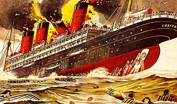
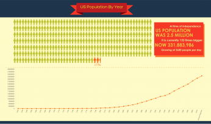

The 10 Worst Epidemics In History - WorldAtlas.com

[World Facts](https://www.worldatlas.com/world-facts/)

# The 10 Worst Epidemics In History

The Plague of Justinian, an epidemic that afflicted the Eastern Roman Empire, claimed nearly 10,00,00,000 lives.

The bacteria yersinia pestis was responsible for the Bubonic Plague, or the Black Plague.

- [](https://www.worldatlas.com/articles/the-10-worst-epidemics-in-history.html#u=https://www.worldatlas.com/articles/the-10-worst-epidemics-in-history.html)
- [](https://www.worldatlas.com/articles/the-10-worst-epidemics-in-history.html#u=https://www.worldatlas.com/articles/the-10-worst-epidemics-in-history.html)
- [](https://www.worldatlas.com/articles/the-10-worst-epidemics-in-history.html#u=https://www.worldatlas.com/articles/the-10-worst-epidemics-in-history.html&media=https://www.worldatlas.com/upload/27/a4/bd/shutterstock-242816119.jpg&description=The%20Plague%20of%20Justinian,%20an%20epidemic%20that%20afflicted%20the%20Eastern%20Roman%20Empire,%20claimed%20nearly%2010,00,00,000%20lives.)
- [](#)
- [](https://www.worldatlas.com/articles/the-10-worst-epidemics-in-history.html#goToCom)
- [World Records](https://www.worldatlas.com/topics/world-records/)

Throughout history, epidemics have been responsible for hundreds of thousands of lives lost. The reason epidemics have claimed so many lives is that they are usually highly communicable diseases which reach large populations in very short times. The number of cases of the disease quickly exceeds what would normally be expected within the population. These diseases could be viral, bacterial, or other health events (like obesity). Some epidemics have been so great that they left a permanent impact on the population at the time. Some of the worst of these can be found below.

## Epidemics With the Highest Number of Deaths

### [Plague of Justinian](https://www.worldatlas.com/articles/what-was-the-plague-of-justinian.html) (Byzantine Empire, 541 - 750)

The Plague of Justinian hit humanity between 541 and 542 AD. It was responsible for the highest number of lives lost in an epidemic in history. Estimates believe 100 million people died during this time which was half the world population. This plague was able to spread so quickly because it was carried on the backs of rodents, whose fleas were infected with the bacteria. These rats traveled all over the world on trading ships and helped spread the infection from [China](https://www.worldatlas.com/webimage/countrys/asia/cn.htm) to Northern Africa and all over the Mediterranean. The Plague of Justinian is attributed with having weakened the Byzantine Empire in several ways. The military lost power and was no longer able to fend off intruders. Farmers became sick, and agricultural production declined. With a smaller agricultural base, income taxes declined. Thousands of people died daily at the height of the destructive plague.

### [Black Plague](https://www.worldatlas.com/articles/what-was-the-black-death.html) (Mostly Europe, 1346 to 1350)

The Black Plague claimed the lives of 50 million people from 1346 to 1350. The outbreak began in Asia and, once again, was carried throughout the world by rats covered with infected fleas. After its arrival in Europe, it spread death and destruction. Europe lost 60% of its population to the Black Death. Symptoms of this disease began with swelling of the lymph nodes, either in the groin, armpit or neck. After 6 to 10 days of infection and sickness, 80% of infected people die. The infection was spread via blood and airborne particles. This epidemic changed the course of European history. The lack of understanding of the origin of the disease led the Christian population to blame the Jewish population of poisoning the water wells, as a result of this accusation, thousands of Jews were killed. Others believed it was punishment dealt from Heaven for leading sinful lives. The world saw agricultural shortages as in the Plague of Justinian and malnutrition and hunger was rampant. After the ending of the Black Death, the decline in population resulted in increased wages and cheap land. The available land was used for animal husbandry and meat consumption throughout the region increased.

### [HIV/AIDS](https://www.worldatlas.com/articles/countries-with-the-highest-rates-of-hiv-aids.html) (Worldwide, 1960- Present)

The HIV/AIDS epidemic began in 1960 and continue to the present day although the scariest moments happened during the 1980s when the world became informed of its existence. So far, this virus has caused the death of 39 million people. By the 1980s, HIV was believed to infect somebody on every continent. Rare lung infections, rapidly advancing cancers, and unexplained immune deficiencies were rampant among gay men and at the time, doctors believed it was caused by same-sex activity. A large number of Haitians were also carriers of the virus which were not named until 1982. Cases were identified in Europe and Africa, in 1983, it was discovered that transmission occurred via heterosexual activities as well. Medicine for treatment was not available until 1987. Today, there are about 37 million people living with HIV. For those individuals with access to antiretroviral medicines, life expectancy has been extended. Currently, this virus is particularly aggressive in Sub-Saharan Africa where at least 68% of all global HIV/AIDS infections are found. The reasons for this are many but stem from poor economic conditions and little to no sex education.

### Other Epidemics

Other epidemics that have resulted in numerous deaths include the: 1918 Flu (20 million deaths); Modern Plague, 1894-1903 (10 million); Asian Flu, 1957-1958 (2 million); Sixth Cholera Pandemic, 1899-1923 (1.5 million); Russian Flu, 1889-1890 (1 million); [Hong Kong](https://www.worldatlas.com/webimage/countrys/asia/hk.htm) Flu, 1968-1969 (1 million); and the Fifth Cholera Pandemic, 1881-1896 (981,899).

## Future Epidemics

The next global epidemic is the fear of many public health professionals. Given the ease of mobility and absolute globalization of today, a rapidly spreading disease that could wipe out the population is easy to imagine. The likelihood that this epidemic would come from animals is very high. New infectious pathogens are being discovered every day. Large farms pose the greatest danger because of the constant contact between animals and people; the potential of cross-contagion is increased. It is important that governments and public health officials maintain a strong, vigilant network to prevent widespread diseases in the future.

Q

### What Was the Worst Epidemic in History?

A

The Plague of Justinian, an epidemic that afflicted the Eastern Roman Empire, claimed nearly 10,00,00,000 lives. It was the worst epidemic in history, followed by the Black Plague.

## The 10 Worst Epidemics In History

| Rank | Epidemic | Period In History | Estimated Number of Deaths |
| --- | --- | --- | --- |
| 1   | Plague of Justinian | 541-542 | 100,000,000 |
| 2   | Black Plague | 1346-1350 | 50,000,000 |
| 3   | HIV/AIDS | 1960-present | 39,000,000 |
| 4   | 1918 Flu (Spanish Flu) | 1918-1920 | 20,000,000 |
| 5   | Modern Plague | 1894-1903 | 10,000,000 |
| 6   | Asian Flu | 1957-1958 | 2,000,000 |
| 7   | Sixth Cholera Pandemic | 1899-1923 | 1,500,000 |
| 8   | Russian Flu | 1889-1890 | 1,000,000 |
| 9   | Hong Kong Flu | 1968-1969 | 1,000,000 |
| 10  | Fifth Cholera Pandemic | 1881-1896 | 981,899 |

## About the Author

- Amber Pariona
- Writer

Amber is a freelance writer, English as a foreign language teacher, and Spanish-English translator. She lives with her husband and 3 cats.

This page was last updated on **August 23, 2019**.

By Amber Pariona

## Citations

- [MLA]()
- [APA]()
- [Chicago]()
- [Harvard]()

### Your MLA Citation

- [](https://www.worldatlas.com/articles/the-10-worst-epidemics-in-history.html#u=https://www.worldatlas.com/articles/the-10-worst-epidemics-in-history.html)
- [](https://www.worldatlas.com/articles/the-10-worst-epidemics-in-history.html#u=https://www.worldatlas.com/articles/the-10-worst-epidemics-in-history.html)
- [](https://www.worldatlas.com/articles/the-10-worst-epidemics-in-history.html#u=https://www.worldatlas.com/articles/the-10-worst-epidemics-in-history.html&media=https://www.worldatlas.com/upload/27/a4/bd/shutterstock-242816119.jpg&description=The%20Plague%20of%20Justinian,%20an%20epidemic%20that%20afflicted%20the%20Eastern%20Roman%20Empire,%20claimed%20nearly%2010,00,00,000%20lives.)
- [](#)
- [](https://www.worldatlas.com/articles/the-10-worst-epidemics-in-history.html#goToCom)

On WorldAtlas.com

## More in [World Facts](https://www.worldatlas.com/world-facts/)

- [What are People From the Netherlands Called?](https://www.worldatlas.com/articles/what-are-people-from-the-netherlands-called.html)
- [Where Does The President Of Uruguay Live?](https://www.worldatlas.com/articles/where-does-the-president-of-uruguay-live.html)
- [​What Sunk the Lusitania? If you Think it was a Torpedo, Think Again](https://www.worldatlas.com/articles/what-sunk-the-lusitania.html)
- [United States Population By Year](https://www.worldatlas.com/articles/what-is-the-population-of-the-united-states.html)
- [Countries That Will Lead Drone Warfare In The Future](https://www.worldatlas.com/articles/countries-that-will-lead-drone-warfare-in-the-future.html)
- [What Are Bioweapons?](https://www.worldatlas.com/articles/what-are-bioweapons.html)