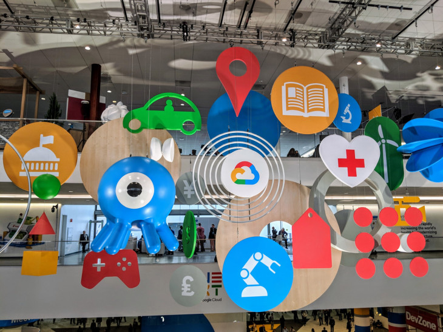

The 6 most important announcements from Google Cloud Next 2019 – TechCrunch

# The 6 most important announcements from Google Cloud Next 2019

[Frederic Lardinois](https://techcrunch.com/author/frederic-lardinois/)[@fredericl](https://twitter.com/fredericl) / 1 month ago

[Google i](https://crunchbase.com/organization/google) is hosting its [annual Cloud Next developer conference](https://techcrunch.com/tag/google-cloud-next-2019/) in San Francisco this week. While the event is still in full swing, with a mystery concert capping off most of the programming tonight, the flood of news has now subsided, so here is our list of the most important announcements from the event.

## Anthos

**What is it?** [Anthos](https://techcrunch.com/2019/04/09/googles-anthos-hybrid-cloud-platform-is-coming-to-aws-and-azure/) is the new name of the Google Cloud Services Platform, Google’s managed service for allowing enterprises to run applications in their private data center and in Google’s cloud. Google decided to give the service a new name, Anthos, but also expanded support to AWS and Azure, its competitors’ cloud platforms. This will allow enterprises to use a single platform, running on Google’s cloud, to deploy and manage their applications on any cloud. Enterprises will get a single bill and have a single dashboard to manage their applications. All of this, unsurprisingly, is powered by containers and Kubernetes.

**Why does it matter?** It’s still highly unusual for the big cloud competitors to launch a product that allows users to run applications on other platforms. The money, after all, is in charging fees for compute time and storage allocations. Google argues that this is something its customers want and that it solves a real problem. Google, however, is also chasing its competitors and looking for ways to differentiate its approach from them. I don’t think we’ll see AWS and Azure react with similar tools, but if they do, it’s a good thing for their customers.

[Google’s hybrid cloud platform is coming to AWS and Azure](https://techcrunch.com/2019/04/09/googles-anthos-hybrid-cloud-platform-is-coming-to-aws-and-azure/)

Google’s Cloud Services Platform for managing hybrid clouds that span on-premise data centers and the Google cloud is coming out of beta today. The company is also changing the product’s name to Anthos, a name that either refers to a lost Greek tragedy, the name of an obscure god in the Marvel universe or rosemary. … [Continue reading Google’s hybrid cloud platform is coming to AWS and Azure](https://techcrunch.com/2019/04/09/googles-anthos-hybrid-cloud-platform-is-coming-to-aws-and-azure/)

[TechCrunch](https://techcrunch.com/)

[0 Comments](https://techcrunch.com/2019/04/09/googles-anthos-hybrid-cloud-platform-is-coming-to-aws-and-azure/#respond)

-
-
Copy and paste this URL into your WordPress site to embed

## Open-source integrations into the Google Cloud Console

**What is it? **Google announced that it would deeply integrate the products of a number of open-source companies into its cloud and essentially make them first-party services. These partners are Confluent, DataStax, Elastic, InfluxData, MongoDB, Neo4j and Redis Labs, with others likely to follow over time.

**Why does it matter?** These integrations are a boon for Google Cloud customers who are likely already using some of these services. They’ll get a single bill and access to support from these companies, all while managing the services from a single console. The subtext here, though, is a bit more complicated and reveals Google’s approach to open source and puts it into contrast with AWS. Many of the companies that are participating here are highly critical of AWS’s treatment of open source and quite public about it. Google is working with them while the perception is that AWS simply uses the code and doesn’t give back.

[Google Cloud challenges AWS with new open-source integrations](https://techcrunch.com/2019/04/09/google-gives-aws-the-open-source-middle-finger/)

Google today announced that it has partnered with a number of top open-source data management and analytics companies to integrate their products into its Google Cloud Platform and offer them as managed services operated by its partners. The partners here are Confluent, DataStax, Elastic, InfluxData, MongoDB, Neo4j and Redis Labs. The idea here, Google says, … [Continue reading Google Cloud challenges AWS with new open-source integrations](https://techcrunch.com/2019/04/09/google-gives-aws-the-open-source-middle-finger/)

[TechCrunch](https://techcrunch.com/)

[0 Comments](https://techcrunch.com/2019/04/09/google-gives-aws-the-open-source-middle-finger/#respond)

-
-
Copy and paste this URL into your WordPress site to embed

## Google’s AI Platform

**What is it? **Google sees its AI prowess as one of its main differentiators in its fight against AWS, Azure and Co. The company already offered a wide range of AI tools, ranging from developer tools and services for advanced data scientists to AutoML, a service that can automatically train models and doesn’t require a PhD. The new AI Platform offers an end-to-end solution for more advanced developers that allows them to go from ingesting data to training and testing their models, to putting them into production. The platform can also use pre-built models.

**Why does it matter? **AI (and machine learning) is the major focus for all big cloud providers, but the developer experience leaves lots of room for improvement. Having an end-to-end solution is obviously a major step forward here and opens up the promise of machine learning to a wider range of potential users.

[Google launches an end-to-end AI platform](https://techcrunch.com/2019/04/10/google-expands-its-ai-services/)

As expected, Google used the second day of its annual Cloud Next conference to shine a spotlight on its AI tools. The company made a dizzying number of announcements today, but at the core of all of these new tools and services is the company’s plan to democratize AI and machine learning with pre-built models … [Continue reading Google launches an end-to-end AI platform](https://techcrunch.com/2019/04/10/google-expands-its-ai-services/)

[TechCrunch](https://techcrunch.com/)

[1 Comment](https://techcrunch.com/2019/04/10/google-expands-its-ai-services/#comments)

-
-
Copy and paste this URL into your WordPress site to embed

## Your Android phone is now a security key

**What is it? **Instead of using a physical security key to enable two-factor authentication, you’ll now be able to use any Android 7+ phone as a security key, too. You set it up in your Google Account and your phone will then use Bluetooth (but without the hassle of creating a Bluetooth connection) to provide your second factor. For now, this only works with Chrome, but Google hopes to turn this into a standard that other browsers and mobile operating system vendors will also support. Google also recommends you still use a regular key as a backup for that inevitable day when you lose your phone.

**Why it matters? **Two-factor authentication is inherently safer than just using a login and password. Systems that use SMS and push-notifications are still vulnerable to phishing attacks while security keys — and this new Android-based system uses the same standards as existing keys — prevent this by ensuring that you are on a legitimate site. This new system takes the hassle out of using a physical key and may just convince more people to use two-factor authentication.

[Google turns your Android phone into a security key](https://techcrunch.com/2019/04/10/google-turns-your-android-phone-into-a-security-key/)

Your Android phone could soon replace your hardware security key to provide two-factor authentication access to your accounts. As the company announced at its Cloud Next conference today, it has developed a Bluetooth-based protocol that will be able to talk to its Chrome browser and provide a standards-based second factor for access to its services, … [Continue reading Google turns your Android phone into a security key](https://techcrunch.com/2019/04/10/google-turns-your-android-phone-into-a-security-key/)

[TechCrunch](https://techcrunch.com/)

[1 Comment](https://techcrunch.com/2019/04/10/google-turns-your-android-phone-into-a-security-key/#comments)

-
-
Copy and paste this URL into your WordPress site to embed

## Google Cloud Code

**What is it? **Cloud Code is a set of plugins and extensions for popular IDE’s like IntelliJ and VS Code. The general idea here is to provide developers with all of the necessary tools to build cloud-native applications — all without having to deal with any of the plumbing work and configuration that comes with that. Using Cloud Code, developers can simply write their applications like before, but then package them as cloud-native apps and ship them to a Kubernetes cluster for testing or production.

**Why does it matter? **Writing cloud-native apps is complicated and usually involves writing complex configuration files. Cloud Code ideally makes all of this so easy that it’ll be far easier for developers — and the companies that employ them — to make this move to a modern infrastructure.

[Google launches Cloud Code to make cloud-native development easier](https://techcrunch.com/2019/04/10/google-launches-cloud-code-to-make-cloud-native-development-easier/)

Google today launched a set of plugins for popular development environments like IntelliJ and Visual Studio Code that promise to make building cloud-native applications significantly easier. You can’t say “cloud-native” without saying Kubernetes, so it’s no surprise that the focus here is on helping developers build, debug and deploy their code to a Kubernetes cluster … [Continue reading Google launches Cloud Code to make cloud-native development easier](https://techcrunch.com/2019/04/10/google-launches-cloud-code-to-make-cloud-native-development-easier/)

[TechCrunch](https://techcrunch.com/)

[2 Comments](https://techcrunch.com/2019/04/10/google-launches-cloud-code-to-make-cloud-native-development-easier/#comments)

-
-
Copy and paste this URL into your WordPress site to embed

## Google Cloud aims at retailers

**What is it?** The news here is that Google is launching a vertical solution that’s squarely aimed at retailers. That doesn’t sound all that earth-shattering, does it? But Google Cloud plans to offer more of these specialized solutions over time.

**Why does it matter? **Google Cloud CEO Thomas Kurian told us that customers are asking for these kinds of integrated solutions that package some of the companies existing tools into integrated solutions that these enterprises can deploy. This is essentially the first time it is doing so (with maybe the exception of healthcare), but it’ll likely offer more of these over time and they could become a major factor in growing the platform’s user base.

[Google Cloud takes aim at verticals starting with new set of tools for retailers](https://techcrunch.com/2019/04/10/google-cloud-takes-aim-at-verticals-starting-with-new-set-of-tools-for-retailers/)

Google might not be Adobe or Salesforce, but it has a particular set of skills, which fit nicely with retailer requirements and can over time help improve the customer experience, even if that means just simply making sure the website or app is running, even on peak demand. Today, at Google Cloud Next, the company … [Continue reading Google Cloud takes aim at verticals starting with new set of tools for retailers](https://techcrunch.com/2019/04/10/google-cloud-takes-aim-at-verticals-starting-with-new-set-of-tools-for-retailers/)

[TechCrunch](https://techcrunch.com/)

[0 Comments](https://techcrunch.com/2019/04/10/google-cloud-takes-aim-at-verticals-starting-with-new-set-of-tools-for-retailers/#respond)

-
-
Copy and paste this URL into your WordPress site to embed

### Bonus

We also got a chance to sit down with Google Cloud’s new CEO Thomas Kurian to put some of the announcements into context and talk about his vision for Google Cloud going forward.

[Google Cloud’s new CEO on gaining customers, startups, supporting open source and more](https://techcrunch.com/2019/04/09/google-clouds-new-ceo-on-gaining-customers-startups-supporting-open-source-and-more/)

After Thomas Kurian, Google Cloud’s recently minted CEO, joined the company, he took hundreds of meetings to learn what the company’s prospective and current customers were looking for. The overarching theme of those conversations was always similar, he told me during an interview at Google’s Cloud Next conference: “Love the technology — amazed at it. … [Continue reading Google Cloud’s new CEO on gaining customers, startups, supporting open source and more](https://techcrunch.com/2019/04/09/google-clouds-new-ceo-on-gaining-customers-startups-supporting-open-source-and-more/)

[TechCrunch](https://techcrunch.com/)

[0 Comments](https://techcrunch.com/2019/04/09/google-clouds-new-ceo-on-gaining-customers-startups-supporting-open-source-and-more/#respond)

-
-
Copy and paste this URL into your WordPress site to embed

[## Disrupt SF 2019](https://techcrunch.com/events/disrupt-sf-2019/?ref=rightrailpromo#tickets)

[48 Hour Flash Sale Happening Now](https://techcrunch.com/events/disrupt-sf-2019/?ref=rightrailpromo#tickets)

San FranciscoOct 2 - 4

[Get Passes Now](https://techcrunch.com/events/disrupt-sf-2019/?ref=rightrailpromo#tickets)

