The 9-Minute Strength Workout

[(L)](https://www.nytimes.com/)[Well](https://www.nytimes.com/section/well)
[*g*]()

- [The Workout]()
- [Make it Complete]()
- [What You Need]()
- [How to Progress]()
- [No More Excuses]()

# The 9-Minute Strength Workout

By [Dr. Jordan Metzl](http://drjordanmetzl.com/)  and  [Karen Barrow](https://www.nytimes.com/by/karen-barrow)

 [*f*  Save for Later](https://www.nytimes.com/well/guides/strength-training-plyometrics)

- [*a* Facebook](http://www.facebook.com/sharer/sharer.php?u=https://www.nytimes.com/well/guides/strength-training-plyometrics)
- [*b* Twitter](http://twitter.com/intent/tweet?text=NY%20Times%20%7C%20Well%3A%20The%209-Minute%20Strength%20Workout&url=https://www.nytimes.com/well/guides/strength-training-plyometrics)
- [*c* Email](https://www.nytimes.com/well/guides/strength-training-plyometricsmailto:?subject=NY%20Times%20%7C%20Well%3A%20The%209-Minute%20Strength%20Workout&body=Strength%20training%20is%20the%20key%20to%20flexibility%2C%20mobility%2C%20improved%20performance%20and%20lower%20injury%20risk.%20And%20it%20doesn%27t%20have%20to%20take%20hours%20at%20the%20gym%20to%20see%20results.%20It%E2%80%99ll%20take%20only%20nine%20minutes%20of%20exertion%20to%20complete%20a%20full-body%20strength-building%20workout.%20%0A%0Ahttps://www.nytimes.com/well/guides/strength-training-plyometrics?utm_source%3Dsharetools%26utm_medium%3Demail%26utm_campaign%3Dwebsite)

No matter your age or athletic ability, strength training is the key to flexibility, mobility, improved performance and lower injury risk. Anyone, at any fitness level, can and should strength train. And it doesn't have to take hours at the gym to see results. We’ll teach you the basics of strength training in the comfort of your own home. It’ll take only nine minutes of exertion to complete a full-body strength-building workout. Grab a towel and get ready to feel strong.

Advertisement

## 9 Minutes for Strength Training

The following nine moves are strength training exercises that you may have seen before. Alone, they work a set group of muscles, but strung together in one-minute intervals, these nine exercises become a complete, whole-body workout.

We’ve broken down the nine exercises into three sets of three. Before you begin each set, set a timer (or work out near a watch with a second hand). If you are just starting to work out, do each exercise as hard as you can for one minute, followed by the next, until you complete the first set. Then, take a one-minute break before moving onto set 2, in which the exercises should also be performed for one minute each.

Ultimately, you’ll complete the whole workout, having completed nine minutes of training with two minutes of breaks in between.

Do this workout two to three times a week for maximum benefits.
Ready to give it a try? Lace up your sneakers and let’s do it.

 [   ### Worksheet  #### The 9 Minute Strength Workout   Click here to download a simple chart of the 9-Minute Strength Workout. Save it to your desktop or print it so you can easily complete this workout, no matter where you are.](https://static01.nyt.com/packages/pdf/health/strength-training-chart-r5.pdf)

## Set #1: Bodyweight Squat, Push-Ups and Mountain Climbers

Do each of the exercises in this set for one minute each, not stopping between exercises.

### Bodyweight Squat

You squat every time you sit or stand, but don’t take this exercise for granted. It works your legs and your glutes, the most powerful muscle group in the body.

**Be careful: **Done incorrectly, squats can be hard on your knees. As you squat, keep your butt pushed out, like you are about to sit on a chair. Use the muscles in your hips and thighs to push yourself up; don’t press your knees forward as you move. If you’re doing it correctly, your knees will move only during the first half of the squat; your hips will finish the movement.

**Challenge yourself: **You can add some plyometric motion to a squat by jumping from the lowest position back into your starting stance.

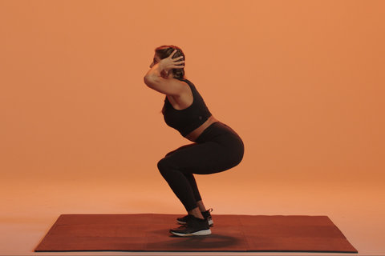

#### How to Do a Bodyweight Squat

A fundamental exercise that builds strength in your legs and glutes.

### Push-Up

There’s a reason push-ups are a go-to exercise for body builders. They effectively work the muscles in your shoulders and chest.

**Modify it:** If standard push-ups are too challenging, try them with your knees on the floor. That will reduce the amount of weight you need to lift.

**Challenge yourself:** If basic push-ups are too easy, place your feet on a step or block to increase the intensity.

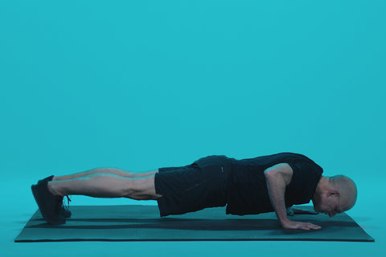

#### How to Do a Push-Up

Build the muscles in your shoulders and chest with this foundational exercise.

### Mountain Climbers

This exercise mimics the motion climbers make as they climb steep peaks, except it’s done on the soft, flat surface of your floor. Mountain climbers are total body workouts, building strength in your core, back, arms and legs — not to mention your heart.

**Modify it: **If this exercise puts too much strain on your wrists, try elevating your upper body by placing your hands on a step to reduce the weight being placed on your arms.

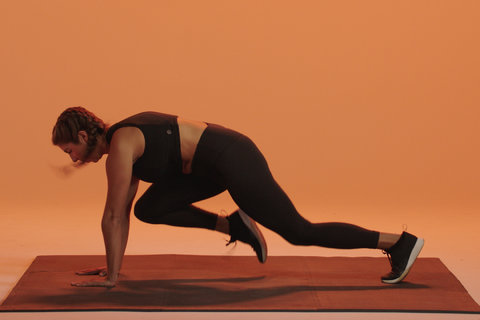

#### How to Do Mountain Climbers

Work your entire body with this simple exercise.

## Set #2: Plank, Bodyweight Split Squat and Single-Leg Hip Raise

Take a one-minute break after the first set of exercises. Now you’re ready for set #2.

### Plank

A commonly seen exercise, plank helps build strength in the core, shoulders, arms and legs. Plank tones your abs and builds strength in your upper body. Additionally, planks strengthen both the abdominal and low back muscles simultaneously and can have a beneficial effect for people with low back pain.

**Be careful: **Plank pose can be hard on your wrists, which is why we suggest doing a plank on your forearm.

**Modify it: **Place your knees on the floor as you do plank to reduce the weight resting on your forearms.

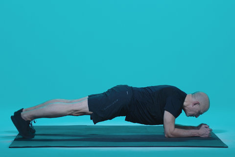

#### How to Do a Forearm Plank

Build strength in your core and upper body without moving a muscle — well, sort of.

### Bodyweight Split Squat

This variation on a squat really targets (the quadricep and hamstring muscles in your legs as well as the glutes. Jumping into your starting position from the lowest point in your squat also adds a plyometric boost.

**Be careful:** If balance is an issue, you can do this exercise close to a wall, resting your hand on it for support.

**Modify it:** Omit the plyometric jump if you find this exercise too hard on your knees.

**Challenge yourself: **Jump higher to really get your heart pumping and build more strength.

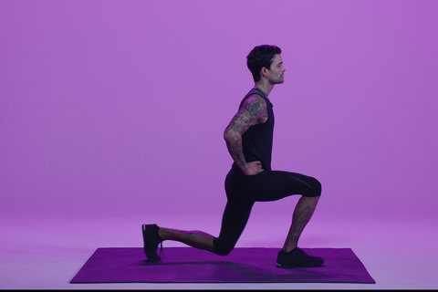

#### How to Do a Bodyweight Split Squat

This exercise will strengthen the muscles in your upper legs.

### ​Single-Leg Hip Raise

This exercise is adapted from yoga and targets the muscles in your glutes and abs.

**Be careful:** Keep your foot firmly planted on the floor as you do this exercise.

**Challenge yourself: **Place your stable foot on a step or bench as you do this exercise to allow you to raise your hips even higher..

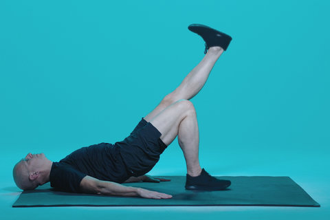

#### How to Do the Single-Leg Hip Raise

Increase the strength in your hips, glutes and abs.

## Set #3: Burpee With Push-Up, Single-Leg Toe Touches and Leg Raises

Good news! You’re almost done. Take a one-minute break after the second set. Then start the third set, again performing each exercise for one minute each.

### Burpee With Push-Up

Fun to say, but also great for your body, this total body exercise will get your heart pumping fast, but don’t sacrifice form for speed. Keep your body in control as you move through the exercise.

**Be careful: **If you do burpees too quickly, you will soon be gasping for breath. Try to pace yourself and your breathing. Take an in breath before you squat and breathe out during the push-up.

**Modify it:** Add leg modifications to make this more difficult. Leg modifications can include putting the right leg into a 3 o’clock position and then bringing it back to center, then bringing the left leg to a 9 o’clock position and then bringing it back to center, and then doing a push-up. We call this the 3 o’clock 9 o’clock burpee.

**Challenge yourself: **To move faster through your burpees, start stretching your legs back before your hands hit the ground. Also don’t arch your back as you move, to allow your legs full range of motion.

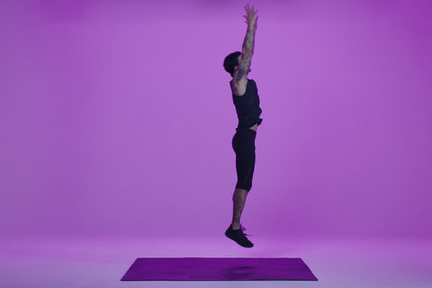

#### How to Do a Burpee With Push-Up

This is a full-body, heart pumping exercise.

### Single-Leg Toe Touches

This exercise is a great way to tone your lower body. It helps to improve balance, while also targeting your hamstrings.

**Be careful:** If you have balance issues, do this exercise near a wall that you can hang onto for support if you need to.

**Challenge Yourself:** To make this more difficult, put a little hop in your planted leg when you stand up. This turns this exercise from isokinetic to plyometric and increases the degree of difficulty.

#### How to Do Single-Leg Toe Touches

This exercise will tone your lower body and test your balance.

### Leg Raises

Build your core strength without getting off the floor. The legs down exercise is great for lower back pain, but be sure move your legs in a controlled manner throughout the exercise.

**Be careful:** As you raise your legs, press your lower back into the floor and engage your ab muscles. This will ensure that your core is doing most of the work, not your hips.

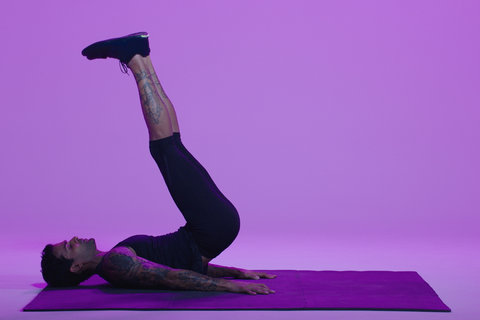

#### How to Do Leg Raises

Build your core while lying down.

## Want a Complete Workout With Cardio?

Add some cardiovascular exercise before your strength training for a complete exercise routine.

### Add a Warm-Up

If you want to turn this strength training workout into a full-body workout,** begin with three minutes each** of the following exercises for an additional nine minutes of cardiovascular exercise. They will add a dose of heart-pumping cardio into your routine, and get your body ready for the weight-bearing exercises.

You are most likely already familiar with these foundational exercises, and for good reason: They are great for a boost of heart-pounding, lung-expanding cardiovascular exercise. Best of all, you can do them all in a pretty small space.

After you cycle through these three exercises, take a one-minute rest before moving on to the strength training workout.

**Be careful:** If you have knee or ankle pain, focus on your form, not your speed. Always try to land on the front of your foot, with your knees bent, to be sure that your muscles, and not your joints, are bearing the brunt of these exercises.

**Modify it:** Well-cushioned sneakers can also help alleviate the strain of jumping jacks on your joints.

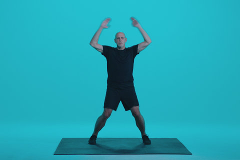

#### How to Do a Jumping Jack

A basic, cardiovascular exercise that can be done in limited space.

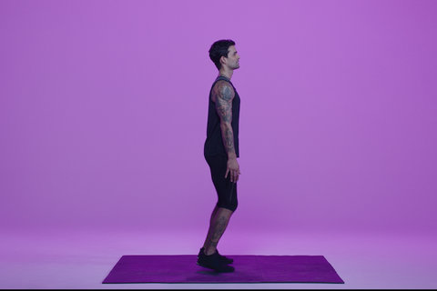

#### How to Do Pogo Hops

A controlled, modified jump for cardiovascular health.

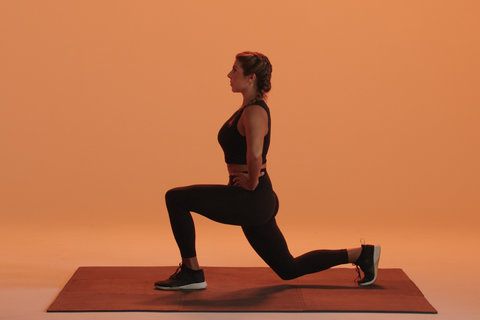

#### How to Do Reverse Lunges

Compared to a[basic lunge](http://www.fitsugar.com/How-Do-Lunge-22901753), this exercise places less stress on the knees while still toning your entire leg.

### More on Strength Training

[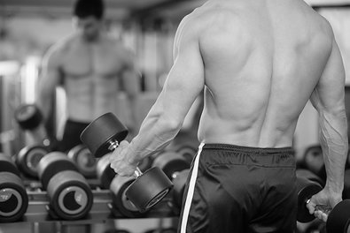   #### Lighter Weights Can Be Just as Effective as Heavy Ones   In a study, participants' muscles got bigger and stronger whether they lifted heavy or light weights -- with a catch.](https://well.blogs.nytimes.com/2016/07/20/lifting-lighter-weights-can-be-just-as-effective-as-heavy-ones/)

Share

[a](http://www.facebook.com/sharer/sharer.php?u=https://well.blogs.nytimes.com/2016/07/20/lifting-lighter-weights-can-be-just-as-effective-as-heavy-ones/)[b](http://twitter.com/intent/tweet?text=NY%20Times%20%7C%20Well%3A%20Lighter%20Weights%20Can%20Be%20Just%20as%20Effective%20as%20Heavy%20Ones&url=https://well.blogs.nytimes.com/2016/07/20/lifting-lighter-weights-can-be-just-as-effective-as-heavy-ones/)[c](https://www.nytimes.com/well/guides/strength-training-plyometricsmailto:?subject=NY%20Times%20%7C%20Well%3A%20Lighter%20Weights%20Can%20Be%20Just%20as%20Effective%20as%20Heavy%20Ones&body=Insight%20from%20Well%3A%0ALighter%20Weights%20Can%20Be%20Just%20as%20Effective%20as%20Heavy%20Ones%0A%0Ahttps://well.blogs.nytimes.com/2016/07/20/lifting-lighter-weights-can-be-just-as-effective-as-heavy-ones/?utm_source%3Dsharetools%26utm_medium%3Demail%26utm_campaign%3Dwebsite)

[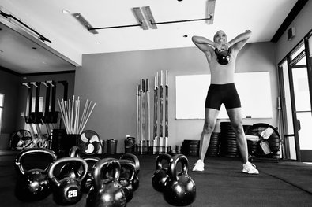   #### Lifting Weights May Aid the Brain   Light resistance training a few times a week may also slow the age-related shrinking of some parts of our brains.](https://well.blogs.nytimes.com/2015/10/21/lifting-weights-twice-a-week-may-aid-the-brain/)

Share

[a](http://www.facebook.com/sharer/sharer.php?u=https://well.blogs.nytimes.com/2015/10/21/lifting-weights-twice-a-week-may-aid-the-brain/)[b](http://twitter.com/intent/tweet?text=NY%20Times%20%7C%20Well%3A%20Lifting%20Weights%20May%20Aid%20the%20Brain&url=https://well.blogs.nytimes.com/2015/10/21/lifting-weights-twice-a-week-may-aid-the-brain/)[c](https://www.nytimes.com/well/guides/strength-training-plyometricsmailto:?subject=NY%20Times%20%7C%20Well%3A%20Lifting%20Weights%20May%20Aid%20the%20Brain&body=Insight%20from%20Well%3A%0ALifting%20Weights%20May%20Aid%20the%20Brain%0A%0Ahttps://well.blogs.nytimes.com/2015/10/21/lifting-weights-twice-a-week-may-aid-the-brain/?utm_source%3Dsharetools%26utm_medium%3Demail%26utm_campaign%3Dwebsite)

[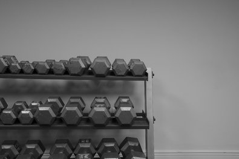   #### How Weight Training Can Help You Keep the Weight Off   Exercise can help keep the pounds off after weight loss, and that includes weight training.](https://well.blogs.nytimes.com/2015/01/28/how-weight-training-can-help-you-keep-the-weight-off/?_r=0)

Share

[a](http://www.facebook.com/sharer/sharer.php?u=https://well.blogs.nytimes.com/2015/01/28/how-weight-training-can-help-you-keep-the-weight-off/?_r=0)[b](http://twitter.com/intent/tweet?text=NY%20Times%20%7C%20Well%3A%20How%20Weight%20Training%20Can%20Help%20You%20Keep%20the%20Weight%20Off&url=https://well.blogs.nytimes.com/2015/01/28/how-weight-training-can-help-you-keep-the-weight-off/?_r=0)[c](https://www.nytimes.com/well/guides/strength-training-plyometricsmailto:?subject=NY%20Times%20%7C%20Well%3A%20How%20Weight%20Training%20Can%20Help%20You%20Keep%20the%20Weight%20Off&body=Insight%20from%20Well%3A%0AHow%20Weight%20Training%20Can%20Help%20You%20Keep%20the%20Weight%20Off%0A%0Ahttps://well.blogs.nytimes.com/2015/01/28/how-weight-training-can-help-you-keep-the-weight-off/?_r=0?utm_source%3Dsharetools%26utm_medium%3Demail%26utm_campaign%3Dwebsite)

[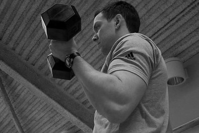   #### Simple Advice for Better Weight Training   Scientists are closely studying how each of us can optimize our time in the gym.](https://well.blogs.nytimes.com/2012/06/26/simple-advice-for-better-weight-training/)

Share

[a](http://www.facebook.com/sharer/sharer.php?u=https://well.blogs.nytimes.com/2012/06/26/simple-advice-for-better-weight-training/)[b](http://twitter.com/intent/tweet?text=NY%20Times%20%7C%20Well%3A%20Simple%20Advice%20for%20Better%20Weight%20Training&url=https://well.blogs.nytimes.com/2012/06/26/simple-advice-for-better-weight-training/)[c](https://www.nytimes.com/well/guides/strength-training-plyometricsmailto:?subject=NY%20Times%20%7C%20Well%3A%20Simple%20Advice%20for%20Better%20Weight%20Training&body=Insight%20from%20Well%3A%0ASimple%20Advice%20for%20Better%20Weight%20Training%0A%0Ahttps://well.blogs.nytimes.com/2012/06/26/simple-advice-for-better-weight-training/?utm_source%3Dsharetools%26utm_medium%3Demail%26utm_campaign%3Dwebsite)

-
-
-
-

## How Are We Doing?

[Take Survey](https://nyt.qualtrics.com/jfe/form/SV_5tqml0O1N5jgUMR?guide=strengthtrainingworkout&AgentID=2bcaad9fae1e41a23226f35b12b19672)

## What You Need to Strength Train

You most likely already have all you need for this workout in your closet.

### Workout Gear

**Shoes: **A pair of comfortable sneakers will do. In a pinch, you can also do this workout barefoot on a non-slippery surface.

**Timer:** You can use a stopwatch, the timer on your phone, or a clock with a secondhand to time yourself.

**Clothes:** Keep your clothes loose and breathable.
**Space: **Any 7-foot by 3-foot area will work.

### Get a Boost With Workout Music

Creating a workout playlist of high-energy tunes you love will not make your workout feel easier, but it may cause you to[*exercise harder without even realizing it.*](http://well.blogs.nytimes.com/2014/10/22/how-music-can-boost-a-high-intensity-workout/) Best of all, you need only three or four great tunes to get you through this workout. If you are willing to try something a bit different, make your own music as you exercise. Sing, hum, clap your hands, whatever you can do to jam along to your playlist.[*It may give you an extra boost to finish strong.*](http://well.blogs.nytimes.com/2013/10/23/how-music-can-boost-our-workouts/?_php=true&_type=blogs&_r=0)[**](http://well.blogs.nytimes.com/2013/10/23/how-music-can-boost-our-workouts/?_php=true&_type=blogs&_r=0)

## How to Progress

This workout can be adapted to your changing fitness level.

### Getting Stronger

The best part of the nine-minute strength training workout is that as you improve, you don’t need to start a whole new exercise routine to keep challenging yourself. You will, however, have to add more time to your workout to keep building your strength and cardiovascular health.

### The Intermediate and Advanced Workout

Once the 9-Minute Strength Training Workout starts to feel a little bit easy, start to increase the amount of time you do each exercise. Keep resting one minute between each set and you can tack on a 20-30 minute cardio warm-up as well.

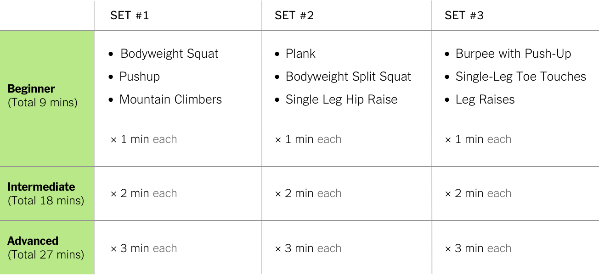

 [   ### Worksheet  #### The 9 Minute Strength Workout   Click here to download a simple chart of the 9-Minute Strength Workout. Save it to your desktop or print it so you can easily complete this workout, no matter where you are.](https://static01.nyt.com/packages/pdf/health/strength-training-chart-r5.pdf)

## Why Strength Training Works

There's a science behind this exercise routine.

### Understanding H.I.I.T.

This workout combines interval training, which has been [*scientifically proven to be most efficient in improving your health,*](http://well.blogs.nytimes.com/2014/02/26/how-to-get-fit-in-a-few-minutes-a-week/?_r=0) with weight-bearing exercises to strengthen your muscles. The result? A full-body workout that will strengthen your heart, lungs and muscles without a trip to the gym or a single piece of equipment. It’s based on the principles of high-intensity interval training — known as H.I.I.T. — which uses short bursts of strenuous exercise to make a big impact on the body. If moderate exercise — like a 20-minute jog — is good for your heart, lungs and metabolism, H.I.I.T. packs the benefits of that workout and more into a few minutes. It may sound too good to be true, but [*learning this exercise technique and adapting it to your life can mean saving hours at the gym. *](http://well.blogs.nytimes.com/2015/01/26/sweaty-answer-to-chronic-illness/)[*  *](http://well.blogs.nytimes.com/2015/01/26/sweaty-answer-to-chronic-illness/)

### ​The Benefits of Body Weight Exercises

The body is by far the most portable gym known to humankind, and although technology has evolved tremendously over the past 200 years, the design of the human body has been the same for thousands of years. You don’t need any fancy equipment to get fit. The benefits of body weight training are obvious: These exercises can be done anywhere, anytime, and for free.

However, there is an added benefit to training with just your body weight. Learning to tap into your body’s potential can help you master your own body, as our muscles control every movement we make from the tip of our toes to the top of our heads. We don’t walk around carrying barbells, but we do need to be able to support our own body throughout every movement we make. Training the body to better support its own weight can reduce injury risk and help us remain flexible as we age.

### More on Interval Training

[ #### Interval training improves speed and endurance.  *d*](https://well.blogs.nytimes.com/2012/02/15/how-1-minute-intervals-can-improve-our-health/)

Share

[a](http://www.facebook.com/sharer/sharer.php?u=https://well.blogs.nytimes.com/2012/02/15/how-1-minute-intervals-can-improve-our-health/)[b](http://twitter.com/intent/tweet?text=NY%20Times%20%7C%20Well%3A%20Interval%20training%20improves%20speed%20and%20endurance.&url=https://well.blogs.nytimes.com/2012/02/15/how-1-minute-intervals-can-improve-our-health/)[c](https://www.nytimes.com/well/guides/strength-training-plyometricsmailto:?subject=NY%20Times%20%7C%20Well%3A%20Interval%20training%20improves%20speed%20and%20endurance.&body=Insight%20from%20Well%3A%0AInterval%20training%20improves%20speed%20and%20endurance.%0A%0Ahttps://well.blogs.nytimes.com/2012/02/15/how-1-minute-intervals-can-improve-our-health/?utm_source%3Dsharetools%26utm_medium%3Demail%26utm_campaign%3Dwebsite)

[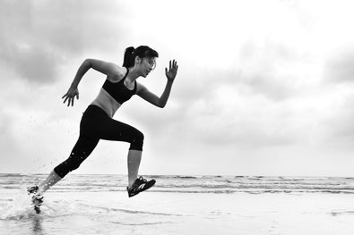   #### Get Fit and Also Have Fun   A new approach to intense interval training that could appeal to those of us who have been disinclined to push ourselves during exercise.](https://well.blogs.nytimes.com/2015/07/29/a-way-to-get-fit-and-also-have-fun/)

Share

[a](http://www.facebook.com/sharer/sharer.php?u=https://well.blogs.nytimes.com/2015/07/29/a-way-to-get-fit-and-also-have-fun/)[b](http://twitter.com/intent/tweet?text=NY%20Times%20%7C%20Well%3A%20Get%20Fit%20and%20Also%20Have%20Fun&url=https://well.blogs.nytimes.com/2015/07/29/a-way-to-get-fit-and-also-have-fun/)[c](https://www.nytimes.com/well/guides/strength-training-plyometricsmailto:?subject=NY%20Times%20%7C%20Well%3A%20Get%20Fit%20and%20Also%20Have%20Fun&body=Insight%20from%20Well%3A%0AGet%20Fit%20and%20Also%20Have%20Fun%0A%0Ahttps://well.blogs.nytimes.com/2015/07/29/a-way-to-get-fit-and-also-have-fun/?utm_source%3Dsharetools%26utm_medium%3Demail%26utm_campaign%3Dwebsite)

[ #### Even one minute of exercise can improve your health.  *d*](https://well.blogs.nytimes.com/2014/12/10/one-minute-workout/)

Share

[a](http://www.facebook.com/sharer/sharer.php?u=https://well.blogs.nytimes.com/2014/12/10/one-minute-workout/)[b](http://twitter.com/intent/tweet?text=NY%20Times%20%7C%20Well%3A%20Even%20one%20minute%20of%20exercise%20can%20improve%20your%20health.&url=https://well.blogs.nytimes.com/2014/12/10/one-minute-workout/)[c](https://www.nytimes.com/well/guides/strength-training-plyometricsmailto:?subject=NY%20Times%20%7C%20Well%3A%20Even%20one%20minute%20of%20exercise%20can%20improve%20your%20health.&body=Insight%20from%20Well%3A%0AEven%20one%20minute%20of%20exercise%20can%20improve%20your%20health.%0A%0Ahttps://well.blogs.nytimes.com/2014/12/10/one-minute-workout/?utm_source%3Dsharetools%26utm_medium%3Demail%26utm_campaign%3Dwebsite)

-
-
-
-
-

## No More Excuses

Have concerns about strength training? We'll eliminate them.

**I don’t want big muscles. **You see the word strength and instantly think of big, bulky muscles. This workout will build functional strength through natural body movements you perform everyday without thinking about it. They will leave you feeling strong and toned, but not looking like a bodybuilder.

**I’m too [insert your excuse here] to strength train. **These exercises are suitable for all ages and abilities, from kids to grandparents. Exercise is medicine and strength training is a very healthy part of a prescription for any body – it makes you stronger, faster, more flexible and it can be helpful with injuries, arthritis, osteoporosis and much more.

**Should I talk to my doctor?** Most people don’t need to. Almost anyone can do these exercises. But if you’re over 40 and if you’ve been inactive for a while it’s probably a good idea to check with your doctor before jumping head-first into a strength program. This is particularly true when talking about H.I.I.T.

**I’m just too busy to work out. **That can’t really be true. Just 10 minutes of exercise per day can help people of all ages and fitness abilities improve strength, fitness and cellular metabolism. You can perform this workout in a conference room at work, in your bathroom before you shower or in your living room as you watch TV.

## Get Inspired

Even if your schedule is filled from sunrise to nightfall, there’s always time for strength training.

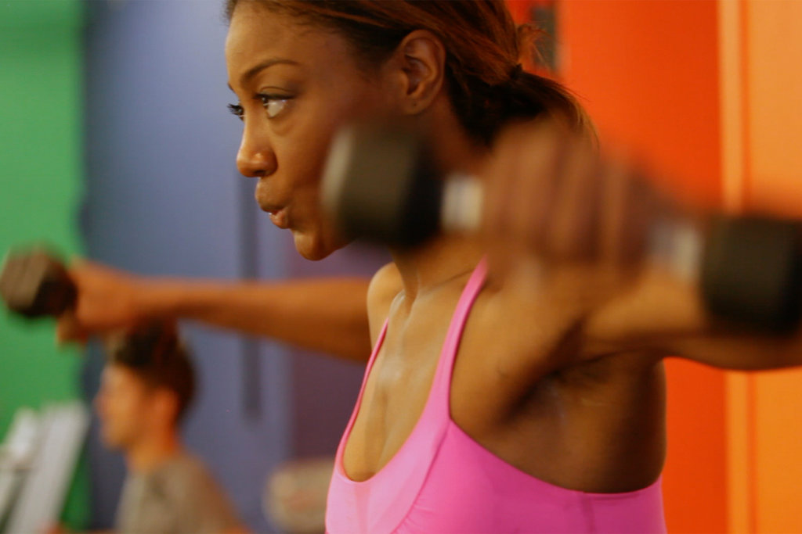

> “Being able to just feel confident in my body and look at myself and know that I put all this work into my body and my health, makes me feel really good.”> —Patina Miller, Tony Award-winning performer from > [*> The Workout*> .](http://well.blogs.nytimes.com/2013/08/15/patina-millers-broadway-workout/)> [(L)](http://well.blogs.nytimes.com/2013/08/15/patina-millers-broadway-workout/)>

## Sound Like a Pro

Here are some commonly-heard fitness terms

Functional strength:

Exercises designed to strengthen multiple muscle groups simultaneously. Instead of a single muscle exercise, such as a bicep curl, functional strength exercises, such as a push-up, strengthen all of the muscles in the shoulder simultaneously. When you move normally, muscles work together, so it just makes more logical sense to exercise them together as well.

High Intensity Interval Training (H.I.I.T.):

An exercise method that includes a series of short bursts of intense exercise. Increasingly, the benefits of H.I.I.T. are being recognized as equal to or sometimes even more effective than longer bouts of exercise.

Isokinetic strengthening:

Muscle strengthening exercises that involve muscle lengthening and shortening, such as lunges and squats.

​Isometric strengthening:

Muscle strengthening exercises in which the muscle length does not change, such as a plank.

​Plyometric strengthening:

This is the most effective means of muscle strengthening. It involves rapid muscle elongation and contraction cycles, such as adding a jump to a squat to make it into a plyometric jump squat.

## About the Authors

[Jordan D. Metzl, M.D.](https://www.nytimes.com/well/guides/www.DrJordanMetzl.com) is a sports medicine physician at Hospital for Special Surgery in New York City. He is the author of 5 books, including Dr. Jordan Metzl’s Workout Prescription.

Karen Barrow is a senior staff editor for Well at The New York Times.

 Video by Bows & Arrows

 [(L)](https://www.nytimes.com/)

- [NYTimes.com](https://www.nytimes.com/)
- |[Well](https://www.nytimes.com/section/well)
- |[Send us Feedback](https://nyt.qualtrics.com/jfe/form/SV_7VuAQJbpWqaxzUh?AGENT_ID=2bcaad9fae1e41a23226f35b12b19672)
- [Privacy Policy](http://www.nytimes.com/privacy)
- |[Terms of Service](http://www.nytimes.com/ref/membercenter/help/agree.html)
- |[© The New York Times Company](http://www.nytimes.com/content/help/rights/copyright/copyright-notice.html)

[(L)](https://www.nytimes.com/well/guides/strength-training-plyometrics#)Window size:  x

Viewport size:  x