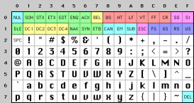
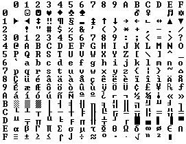

The Absolute Minimum Every Software Developer Absolutely, Positively Must Know About Unicode and Character Sets (No Excuses!) – Joel on Software

[October 8, 2003](https://www.joelonsoftware.com/2003/10/08/the-absolute-minimum-every-software-developer-absolutely-positively-must-know-about-unicode-and-character-sets-no-excuses/)* by *  [Joel Spolsky](https://www.joelonsoftware.com/author/joelonsoftware/)

# The Absolute Minimum Every Software Developer Absolutely, Positively Must Know About Unicode and Character Sets (No Excuses!)

- [Top 10](https://www.joelonsoftware.com/category/reading-lists/top-10/), [New developer](https://www.joelonsoftware.com/category/reading-lists/new-developer/), [News](https://www.joelonsoftware.com/category/news/)

Ever wonder about that mysterious Content-Type tag? You know, the one you’re supposed to put in HTML and you never quite know what it should be?

Did you ever get an email from your friends in Bulgaria with the subject line “???? ?????? ??? ????”?

I’ve been dismayed to discover just how many software developers aren’t really completely up to speed on the mysterious world of character sets, encodings, Unicode, all that stuff. A couple of years ago, a beta tester for [FogBUGZ](http://www.fogcreek.com/FogBUGZ) was wondering whether it could handle incoming email in Japanese. Japanese? They have email in Japanese? I had no idea. When I looked closely at the commercial ActiveX control we were using to parse MIME email messages, we discovered it was doing exactly the wrong thing with character sets, so we actually had to write heroic code to undo the wrong conversion it had done and redo it correctly. When I looked into another commercial library, it, too, had a completely broken character code implementation. I corresponded with the developer of that package and he sort of thought they “couldn’t do anything about it.” Like many programmers, he just wished it would all blow over somehow.

But it won’t. When I discovered that the popular web development tool PHP has almost [complete ignorance of character encoding issues](http://ca3.php.net/manual/en/language.types.string.php), blithely using 8 bits for characters, making it darn near impossible to develop good international web applications, I thought, *enough is enough*.

So I have an announcement to make: if you are a programmer working in 2003 and you don’t know the basics of characters, character sets, encodings, and Unicode, and I *catch* you, I’m going to punish you by making you peel onions for 6 months in a submarine. I swear I will.

And one more thing:
**IT’S NOT THAT HARD.**

In this article I’ll fill you in on exactly what *every working programmer* should know. All that stuff about “plain text = ascii = characters are 8 bits” is not only wrong, it’s hopelessly wrong, and if you’re still programming that way, you’re not much better than a medical doctor who doesn’t believe in germs. Please do not write another line of code until you finish reading this article.

Before I get started, I should warn you that if you are one of those rare people who knows about internationalization, you are going to find my entire discussion a little bit oversimplified. I’m really just trying to set a minimum bar here so that everyone can understand what’s going on and can write code that has a *hope* of working with text in any language other than the subset of English that doesn’t include words with accents. And I should warn you that character handling is only a tiny portion of what it takes to create software that works internationally, but I can only write about one thing at a time so today it’s character sets.

**A Historical Perspective**
The easiest way to understand this stuff is to go chronologically.

You probably think I’m going to talk about very old character sets like EBCDIC here. Well, I won’t. EBCDIC is not relevant to your life. We don’t have to go that far back in time.

Back in the semi-olden days, when Unix was being invented and K&R were writing [The C Programming Language](http://cm.bell-labs.com/cm/cs/cbook/), everything was very simple. EBCDIC was on its way out. The only characters that mattered were good old unaccented English letters, and we had a code for them called [ASCII](http://www.robelle.com/library/smugbook/ascii.html) which was able to represent every character using a number between 32 and 127. Space was 32, the letter “A” was 65, etc. This could conveniently be stored in 7 bits. Most computers in those days were using 8-bit bytes, so not only could you store every possible ASCII character, but you had a whole bit to spare, which, if you were wicked, you could use for your own devious purposes: the dim bulbs at WordStar actually turned on the high bit to indicate the last letter in a word, condemning WordStar to English text only. Codes below 32 were called *unprintable* and were used for cussing. Just kidding. They were used for control characters, like 7 which made your computer beep and 12 which caused the current page of paper to go flying out of the printer and a new one to be fed in.

And all was good, assuming you were an English speaker.

Because bytes have room for up to eight bits, lots of people got to thinking, “gosh, we can use the codes 128-255 for our own purposes.” The trouble was, *lots* of people had this idea at the same time, and they had their own ideas of what should go where in the space from 128 to 255. The IBM-PC had something that came to be known as the OEM character set which provided some accented characters for European languages and [a bunch of line drawing characters](http://www.jimprice.com/ascii-dos.gif)… horizontal bars, vertical bars, horizontal bars with little dingle-dangles dangling off the right side, etc., and you could use these line drawing characters to make spiffy boxes and lines on the screen, which you can still see running on the 8088 computer at your dry cleaners’. In fact  as soon as people started buying PCs outside of America all kinds of different OEM character sets were dreamed up, which all used the top 128 characters for their own purposes. For example on some PCs the character code 130 would display as é, but on computers sold in Israel it was the Hebrew letter Gimel (), so when Americans would send their résumés to Israel they would arrive as rsums. In many cases, such as Russian, there were lots of different ideas of what to do with the upper-128 characters, so you couldn’t even reliably interchange Russian documents.

Eventually this OEM free-for-all got codified in the ANSI standard. In the ANSI standard, everybody agreed on what to do below 128, which was pretty much the same as ASCII, but there were lots of different ways to handle the characters from 128 and on up, depending on where you lived. These different systems were called *[code pages](http://www.i18nguy.com/unicode/codepages.html#msftdos)*. So for example in Israel DOS used a code page called 862, while Greek users used 737. They were the same below 128 but different from 128 up, where all the funny letters resided. The national versions of MS-DOS had dozens of these code pages, handling everything from English to Icelandic and they even had a few “multilingual” code pages that could do Esperanto and Galician *on the same computer! Wow!* But getting, say, Hebrew and Greek on the same computer was a complete impossibility unless you wrote your own custom program that displayed everything using bitmapped graphics, because Hebrew and Greek required different code pages with different interpretations of the high numbers.

Meanwhile, in Asia, even more crazy things were going on to take into account the fact that Asian alphabets have thousands of letters, which were never going to fit into 8 bits. This was usually solved by the messy system called DBCS, the “double byte character set” in which *some* letters were stored in one byte and others took two. It was easy to move forward in a string, but dang near impossible to move backwards. Programmers were encouraged not to use s++ and s– to move backwards and forwards, but instead to call functions such as Windows’ AnsiNext and AnsiPrev which knew how to deal with the whole mess.

But still, most people just pretended that a byte was a character and a character was 8 bits and as long as you never moved a string from one computer to another, or spoke more than one language, it would sort of always work. But of course, as soon as the Internet happened, it became quite commonplace to move strings from one computer to another, and the whole mess came tumbling down. Luckily, Unicode had been invented.

**Unicode**

Unicode was a brave effort to create a single character set that included every reasonable writing system on the planet and some make-believe ones like Klingon, too. Some people are under the misconception that Unicode is simply a 16-bit code where each character takes 16 bits and therefore there are 65,536 possible characters. **This is not, actually, correct.** It is the single most common myth about Unicode, so if you thought that, don’t feel bad.

In fact, Unicode has a different way of thinking about characters, and you have to understand the Unicode way of thinking of things or nothing will make sense.

Until now, we’ve assumed that a letter maps to some bits which you can store on disk or in memory:

A -> 0100 0001

In Unicode, a letter maps to something called a *code point* which is still just a theoretical concept. How that code point is represented in memory or on disk is a whole nuther story.

In Unicode, the letter A is a platonic ideal. It’s just floating in heaven:
A

This platonic A is different than B, and different from a, but the same as A and ***A*** and A. The idea that A in a Times New Roman font is the same character as the A in a Helvetica font, but *different* from “a” in lower case, does not seem very controversial, but in some languages just figuring out what a letter *is* can cause controversy. Is the German letter ß a real letter or just a fancy way of writing ss? If a letter’s shape changes at the end of the word, is that a different letter? Hebrew says yes, Arabic says no. Anyway, the smart people at the Unicode consortium have been figuring this out for the last decade or so, accompanied by a great deal of highly political debate, and you don’t have to worry about it. They’ve figured it all out already.

Every platonic letter in every alphabet is assigned a magic number by the Unicode consortium which is written like this: **U+0639**.  This magic number is called a *code point*. The U+ means “Unicode” and the numbers are hexadecimal. **U+0639** is the Arabic letter Ain. The English letter A would be **U+0041**. You can find them all using the **charmap** utility on Windows 2000/XP or visiting [the Unicode web site](http://www.unicode.org/).

There is no real limit on the number of letters that Unicode can define and in fact they have gone beyond 65,536 so not every unicode letter can really be squeezed into two bytes, but that was a myth anyway.

OK, so say we have a string:
**Hello**
which, in Unicode, corresponds to these five code points:
U+0048 U+0065 U+006C U+006C U+006F.

Just a bunch of code points. Numbers, really. We haven’t yet said anything about how to store this in memory or represent it in an email message.

**Encodings**
That’s where *encodings* come in.

The earliest idea for Unicode encoding, which led to the myth about the two bytes, was, hey, let’s just store those numbers in two bytes each. So Hello becomes

00 48 00 65 00 6C 00 6C 00 6F
Right? Not so fast! Couldn’t it also be:
48 00 65 00 6C 00 6C 00 6F 00 ?

Well, technically, yes, I do believe it could, and, in fact, early implementors wanted to be able to store their Unicode code points in high-endian or low-endian mode, whichever their particular CPU was fastest at, and lo, it was evening and it was morning and there were already *two* ways to store Unicode. So the people were forced to come up with the bizarre convention of storing a FE FF at the beginning of every Unicode string; this is called a [Unicode Byte Order Mark](http://msdn.microsoft.com/library/default.asp?url=/library/en-us/intl/unicode_42jv.asp) and if you are swapping your high and low bytes it will look like a FF FE and the person reading your string will know that they have to swap every other byte. Phew. Not every Unicode string in the wild has a byte order mark at the beginning.

For a while it seemed like that might be good enough, but programmers were complaining. “Look at all those zeros!” they said, since they were Americans and they were looking at English text which rarely used code points above U+00FF. Also they were liberal hippies in California who wanted to *conserve (sneer)*. If they were Texans they wouldn’t have minded guzzling twice the number of bytes. But those Californian wimps couldn’t bear the idea of *doubling* the amount of storage it took for strings, and anyway, there were already all these doggone documents out there using various ANSI and DBCS character sets and who’s going to convert them all? *Moi?* For this reason alone most people decided to ignore Unicode for several years and in the meantime things got worse.

Thus was [invented](http://www.cl.cam.ac.uk/~mgk25/ucs/utf-8-history.txt) the brilliant concept of [UTF-8](http://www.utf-8.com/). UTF-8 was another system for storing your string of Unicode code points, those magic U+ numbers, in memory using 8 bit bytes. In UTF-8, every code point from 0-127 is stored *in a single byte*. Only code points 128 and above are stored using 2, 3, in fact, up to 6 bytes.

This has the neat side effect that English text looks *exactly the same in UTF-8 as it did in ASCII,* so Americans don’t even notice anything wrong. Only the rest of the world has to jump through hoops. Specifically, **Hello**, which was U+0048 U+0065 U+006C U+006C U+006F, will be stored as 48 65 6C 6C 6F, which, behold! is the same as it was stored in ASCII, and ANSI, and every OEM character set on the planet. Now, if you are so bold as to use accented letters or Greek letters or Klingon letters, you’ll have to use several bytes to store a single code point, but the Americans will never notice. (UTF-8 also has the nice property that ignorant old string-processing code that wants to use a single 0 byte as the null-terminator will not truncate strings).

So far I’ve told you *three* ways of encoding Unicode. The traditional store-it-in-two-byte methods are called UCS-2 (because it has two bytes) or UTF-16 (because it has 16 bits), and you still have to figure out if it’s high-endian UCS-2 or low-endian UCS-2. And there’s the popular new UTF-8 [standard](http://www.zvon.org/tmRFC/RFC2279/Output/chapter2.html) which has the nice property of also working respectably if you have the happy coincidence of English text and braindead programs that are completely unaware that there is anything other than ASCII.

There are actually a bunch of other ways of encoding Unicode. There’s something called UTF-7, which is a lot like UTF-8 but guarantees that the high bit will always be zero, so that if you have to pass Unicode through some kind of draconian police-state email system that thinks 7 bits are *quite enough, thank you* it can still squeeze through unscathed. There’s UCS-4, which stores each code point in 4 bytes, which has the nice property that every single code point can be stored in the same number of bytes, but, golly, even the Texans wouldn’t be so bold as to waste *that* much memory.

And in fact now that you’re thinking of things in terms of platonic ideal letters which are represented by Unicode code points, those unicode code points can be encoded in any old-school encoding scheme, too! For example, you could encode the Unicode string for Hello (U+0048 U+0065 U+006C U+006C U+006F) in ASCII, or the old OEM Greek Encoding, or the Hebrew ANSI Encoding, or any of several hundred encodings that have been invented so far, *with one catch:* some of the letters might not show up! If there’s no equivalent for the Unicode code point you’re trying to represent in the encoding you’re trying to represent it in, you usually get a little question mark: ? or, if you’re *really* good, a box. Which did you get? -> �

There are hundreds of traditional encodings which can only store *some* code points correctly and change all the other code points into question marks. Some popular encodings of English text are Windows-1252 (the Windows 9x standard for Western European languages) and [ISO-8859-1](http://www.htmlhelp.com/reference/charset/), aka Latin-1 (also useful for any Western European language). But try to store Russian or Hebrew letters in these encodings and you get a bunch of question marks. UTF 7, 8, 16, and 32 all have the nice property of being able to store *any* code point correctly.

**The Single Most Important Fact About Encodings**

If you completely forget everything I just explained, please remember one extremely important fact. **It does not make sense to have a string without knowing what encoding it uses**. You can no longer stick your head in the sand and pretend that “plain” text is ASCII.

***There Ain’t No Such Thing As Plain Text.***

If you have a string, in memory, in a file, or in an email message, you have to know what encoding it is in or you cannot interpret it or display it to users correctly.

Almost every stupid “my website looks like gibberish” or “she can’t read my emails when I use accents” problem comes down to one naive programmer who didn’t understand the simple fact that if you don’t tell me whether a particular string is encoded using UTF-8 or ASCII or ISO 8859-1 (Latin 1) or Windows 1252 (Western European), you simply cannot display it correctly or even figure out where it ends. There are over a hundred encodings and above code point 127, all bets are off.

How do we preserve this information about what encoding a string uses? Well, there are standard ways to do this. For an email message, you are expected to have a string in the header of the form

**> Content-Type: text/plain; charset="UTF-8"**

For a web page, the original idea was that the web server would return a similar **Content-Type** http header along with the web page itself — not in the HTML itself, but as one of the response headers that are sent before the HTML page.

This causes problems. Suppose you have a big web server with lots of sites and hundreds of pages contributed by lots of people in lots of different languages and all using whatever encoding their copy of Microsoft FrontPage saw fit to generate. The web server itself wouldn’t really *know* what encoding each file was written in, so it couldn’t send the Content-Type header.

It would be convenient if you could put the Content-Type of the HTML file right in the HTML file itself, using some kind of special tag. Of course this drove purists crazy… how can you *read* the HTML file until you know what encoding it’s in?! Luckily, almost every encoding in common use does the same thing with characters between 32 and 127, so you can always get this far on the HTML page without starting to use funny letters:

**> <html>
> <head>

****> <> meta>   > http-equiv> => "Content-Type">   > content> => "text/html; charset=utf-8"> >**

But that meta tag really has to be the very first thing in the <head> section because as soon as the web browser sees this tag it’s going to stop parsing the page and start over after reinterpreting the whole page using the encoding you specified.

What do web browsers do if they don’t find any Content-Type, either in the http headers or the meta tag? Internet Explorer actually does something quite interesting: it tries to guess, based on the frequency in which various bytes appear in typical text in typical encodings of various languages, what language and encoding was used. Because the various old 8 bit code pages tended to put their national letters in different ranges between 128 and 255, and because every human language has a different characteristic histogram of letter usage, this actually has a chance of working. It’s truly weird, but it does seem to work often enough that naïve web-page writers who never knew they needed a Content-Type header look at their page in a web browser and it *looks ok*, until one day, they write something that doesn’t exactly conform to the letter-frequency-distribution of their native language, and Internet Explorer decides it’s Korean and displays it thusly, proving, I think, the point that Postel’s Law about being “conservative in what you emit and liberal in what you accept” is quite frankly not a good engineering principle. Anyway, what does the poor reader of this website, which was written in Bulgarian but appears to be Korean (and not even cohesive Korean), do? He uses the View | Encoding menu and tries a bunch of different encodings (there are at least a dozen for Eastern European languages) until the picture comes in clearer. If he knew to do that, which most people don’t.

For the latest version of [CityDesk](http://www.fogcreek.com/CityDesk), the web site management software published by [my company](http://www.fogcreek.com/), we decided to do everything internally in UCS-2 (two byte) Unicode, which is what Visual Basic, COM, and Windows NT/2000/XP use as their native string type. In C++ code we just declare strings as **wchar_t** (“wide char”) instead of **char** and use the **wcs** functions instead of the **str** functions (for example **wcscat** and **wcslen** instead of **strcat** and **strlen**). To create a literal UCS-2 string in C code you just put an L before it as so: **L"Hello"**.

When CityDesk publishes the web page, it converts it to UTF-8 encoding, which has been well supported by web browsers for many years. That’s the way all [29 language versions](https://www.joelonsoftware.com/navLinks/OtherLanguages.html) of *Joel on Software* are encoded and I have not yet heard a single person who has had any trouble viewing them.

This article is getting rather long, and I can’t possibly cover everything there is to know about character encodings and Unicode, but I hope that if you’ve read this far, you know enough to go back to programming, using antibiotics instead of leeches and spells, a task to which I will leave you now.