The Best Hybrid Bike

Our pick

[Our favorite hybrid bike](https://wclink.co/link/18110/94104/3/31477)
[Marin Fairfax SC1](https://wclink.co/link/18110/94104/3/31477)

This Marin is a capable commuter bike that would be equally comfortable on longer weekend rides—and it’s more fun to ride than its competitors.

[$490from Marin Bikes](https://wclink.co/link/18110/94104/3/31477/1995224144.1496565492)

.

Priced at $489, our top pick, the [Marin Fairfax SC1](https://wclink.co/link/18110/0/3/31467/), ticks all the boxes on our hybrid-bike checklist: durable-enough Shimano components, a steel fork that’s forgiving on potholes and rough city streets, rack and fender mounts, and grippy, Kevlar-reinforced tires that should help deter flats. Plus, it earns extra credit for its internal shifter-cable routing, hill-friendly low-gearing (this is the only bike we tested that uses this setup), and an exceptionally well-designed aluminum frame that provides more agile handling and zippier acceleration than the competition. What the SC1 doesn’t come with—although most of its more-expensive siblings in the Fairfax line do—is disc brakes, but that’s an upgrade that we believe is unnecessary for most riders.

Runner-up

[$490from Fuji](https://wclink.co/link/18112/94106/3/31478)

[If you need disc brakes](https://wclink.co/link/18112/94106/3/31478)
[Fuji Absolute 1.9](https://wclink.co/link/18112/94106/3/31478)

Although this bike sells for the same price as the Marin and shares many of the same components—plus disc brakes—it lacks the design finesse of the Marin and rides a bit heavier as a result.

.

Our runner-up is the [Fuji Absolute 1.9](https://wclink.co/link/18112/0/3/31468/), which currently retails for the same $489 as our top pick and is very similar in many ways: steel fork, internal cable routing, and a firm, sporty saddle. However, you get disc brakes instead of rim brakes. If you plan to commute in bad weather, or anticipate going off-pavement, you’ll appreciate the way that disc brakes maintain their stopping power in the rain (they also don’t get clogged with mud or slush the way rim brakes can). On the downside, the Fuji is heavier than the Marin (not surprising, as disc brakes tend to add weight), has gearing not as well-suited to going up hills, and feels less sprightly—a byproduct of the aluminum frame’s more relaxed geometry. Also, its tires are from a Fuji house brand that you can’t buy independently, so even if you like them, once they wear out you’ll have to replace them with a different brand of tire.

Also great

[$530from Jamis](https://wclink.co/link/8621/24922/3/31479)

[Still the smooth one](https://wclink.co/link/8621/24922/3/31479)
[Jamis Coda Sport](https://wclink.co/link/8621/24922/3/31479)

As we said in 2015, this steel framed bike provides a comfortable ride, but the trade-off is maneuverability—and an uptick in price.

.

Although the list price for the [Jamis Coda Sport](https://wclink.co/link/8621/0/3/13635/) has gone up ($520 to $529) in the past year, it’s still a very good option if you’re looking for the comfort of a steel frame—steel does a much better job than aluminum in dampening the vibrations caused by rough pavement—without the weight penalty that lower-priced steel frames often impose. That means you can still carry it up stairs and lift it onto bus- or car-mounted bike racks. It even comes with well-rated Vittoria Randonneur tires and steel-wrapped resin pedals. The main drawback with this bike is maneuverability—it’s still not quite as nimble as the other bikes we tested, which could be a function of its geometry (we’ll get into that in the [How we picked and tested](http://thesweethome.com/reviews/best-hybrid-commuter-bike/#how-we-picked-and-tested) section).

Upgrade pick

[$900from Priority Bicycles](https://wclink.co/link/18113/94107/3/31480)

[For the neatnik DIYer](https://wclink.co/link/18113/94107/3/31480)
[Priority Continuum](https://wclink.co/link/18113/94107/3/31480)

If you’ve been waiting for belt-drive hybrids to come down in price, this bike is the answer to your prayers—but you’ll have to assemble it yourself (or pay someone to).

.

For commuters, belt-drive systems make a lot of sense: The belts don’t wear out as quickly as chains; they don’t need to be oiled, so there’s less bike grease in your life and on your clothes; and the internally geared rear hubs let you change gears when you’re standing still (like at a traffic light). Though it’s hard to find a hybrid bike with a belt drive that costs less than $1,000, the aluminum [Priority Continuum](https://wclink.co/link/18113/0/3/31469/) retails for $899—pricey compared with our other picks, but a bargain for its category. And it comes with hydraulic disc brakes, the well-respected Gates Carbon Drive belt, and a NuVinci continuous gearing rear hub. But it’s also only available for purchase online, which means you have to deal with getting it assembled and fine-tuned.

### Never buy junk again

Get our weekly newsletter so we can save your life from the clutter of inferior things.

### Table of contents

- [Who this is for](http://thesweethome.com/reviews/best-hybrid-commuter-bike/#who-this-is-for)
- [Why you should trust me](http://thesweethome.com/reviews/best-hybrid-commuter-bike/#why-you-should-trust-me)
- [How we picked and tested](http://thesweethome.com/reviews/best-hybrid-commuter-bike/#how-we-picked-and-tested)
- [Our pick](http://thesweethome.com/reviews/best-hybrid-commuter-bike/#our-pick)
- [Flaws but not dealbreakers](http://thesweethome.com/reviews/best-hybrid-commuter-bike/#flaws-but-not-dealbreakers)
- [Runner-up](http://thesweethome.com/reviews/best-hybrid-commuter-bike/#runnerup)
- [Also great](http://thesweethome.com/reviews/best-hybrid-commuter-bike/#also-great)
- [Upgrade pick](http://thesweethome.com/reviews/best-hybrid-commuter-bike/#upgrade-pick)
- [The competition](http://thesweethome.com/reviews/best-hybrid-commuter-bike/#the-competition)
- [Care and maintenance](http://thesweethome.com/reviews/best-hybrid-commuter-bike/#care-and-maintenance)
- [What to look forward to](http://thesweethome.com/reviews/best-hybrid-commuter-bike/#what-to-look-forward-to)

### Who this is for

If you’d like to start riding to work or school regularly, and your ride will last a half an hour or more, you’ll probably want what’s often called a fitness hybrid bike, or a performance hybrid. That term gets you what is basically a road bike with flat, mountain-bike-style handlebars. A bike like this will be agile enough to maneuver around the potholes you see, tough enough to weather the ones you don’t, and speedy enough that you can roll it out on the weekend to get some exercise with the family, or even join a charity ride. But it’s not as twitchy, in terms of handling, as an actual drop-bar road bike would be and, given that you’ll be sitting up rather than hunched over, it’ll be a lot more comfortable to ride. And should you get to the point where you are snagging all the local [KOMs or QOMs](https://support.strava.com/hc/en-us/articles/216917137-Achievement-Awards-Glossary) (translation: you’ve bought a fancy road bike) or shredding the singletrack gnar (translation: you’ve bought a fancy mountain bike), you can still use your trusty hybrid as your townie bike—the one you can load down with groceries (hurray, rack mounts!) or lock up outside without too much fear of theft (hurray, low price!).

If you start searching online for “hybrid bikes,” by the way, you’ll no doubt discover that the term covers a vast range of options. For super-short commutes—a couple of miles or so—you could get away with one of those cruiser-type “comfort hybrids” where you sit up straight in a big squishy saddle, but on anything longer, that kind of seat will soon become a literal pain in the posterior. Your sit bones, as the yoga teachers call them, need a firm base to support the rest of you. And if you’re never going to use the bike for anything but commuting, you could get an urban or utility hybrid, which come outfitted in integrated racks and fenders and lights, but you’ll pay more for accessories that might not suit your particular needs—and you’ll have to get another bike for your fun rides.

### Why you should trust me

For this review, I interviewed mechanics and proprietors at shops specializing in commuter bikes all over the country—from Boston to Washington, DC, to New Orleans to Chicago to Minneapolis to San Francisco—who see and repair bikes ridden in all kinds of conditions. I also talked to bike manufacturers and component suppliers, spent two days surveying every booth at this year’s vast Interbike convention, and, of course, checked in with everyday riders, including members of San Francisco’s local bike coalition.

Seven years ago, I myself started riding to my downtown office from San Francisco’s Bernal Heights on an eight-speed hybrid, and long after I’d switched to a road bike for a longer commute, I kept the sturdy little bike around as my city ride. In the past year, I’ve written about [bike tools](http://thesweethome.com/reviews/best-bike-repair-kit/) and [bike repair stands](http://thesweethome.com/reviews/best-bike-repair-stand/) for The Sweethome, and I also work part-time at my local bike shop, where part of my duties are to advise the shop’s commuter clientele on fenders, racks, and panniers—and install them too.

### How we picked and tested

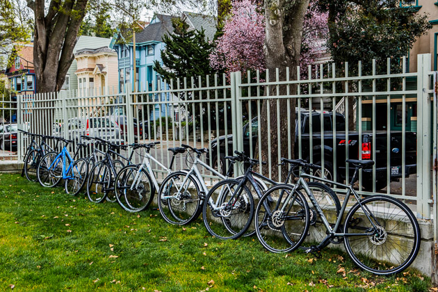

The market for performance hybrids is huge: Nationwide surveys note that the number of people in cities large and small who take up riding to work is increasing by [7.5 percent](http://www.bikewalkalliance.org/download-the-2014-benchmarking-report)[per year](http://www.bikewalkalliance.org/download-the-2014-benchmarking-report), and, according to a US Department of Transportation report from 2009, [75 percent of bike commuters ride about five miles](https://dupress.deloitte.com/dup-us-en/industry/public-sector/smart-mobility-trends-bike-commuting.html#endnote-5) per trip. Still, we’ve found no publication, online or print, that does any kind of systematic review of the category. Consumer Reports used to, but as of 2010, it stopped reviewing bikes altogether, although it keeps an [archival version of a basic buyer’s guide](http://www.consumerreports.org/cro/bikes/buying-guide.htm) on its website.

Because it’s not a niche market, hybrids don’t attract the kind of enthusiasts that keep endless threads going on road-bike or mountain-bike forums, debating the merits and flaws of different brands and models. Magazines like [Bicycling](http://www.bicycling.com/bikes-gear/reviews/16-for-2016-the-years-best-city-bikes) and [Outside](http://www.outsideonline.com/1857171/3-best-womens-commuter-bikes-2013#slide-2) and [Men’s Journal](http://www.mensjournal.com/expert-advice/the-best-road-bikes-you-can-buy-under-1-000-20150512/fuji-sportif-1-5-disc) will occasionally recommend a hybrid in the context of a larger bike roundup, but that’s the extent of their coverage of the category. [RoadBikeReview](http://www.roadbikereview.com/cat/latest-bikes/hybrid-bike/pls_5672_00crx.aspx#productlisting), a website that aggregates user reviews of road bikes, does include hybrids in the mix, though only 14 of the 200 fitness-hybrid models listed have accumulated 10 or more reviews, and 141 of them have no reviews at all. UK-based [Bike Radar](http://www.bikeradar.com/us/gear/category/bikes/urban/) reviews fitness hybrids in its “urban” section, but at a rate of about two or three per year, and some of them aren’t available here in the States. Still, we dug up what reviews we could find, looking for praise and dings. And, of course, we included the current incarnations of the bikes we looked at the last time around.

As we soon discovered, $500 is still the sweet spot for a starter bike like this—drop much lower, and you’ll get stuck with outmoded or truly poorly made parts (that’s the bike you bought at Walmart) that might be hard to replace (or upgrade) once they wear out. If you spend more, you can get a nicer bike, with lighter components, but that defeats the purpose of a starter bike. Also, as components get more expensive—and lighter—they don’t necessarily get more durable. In fact, it’s occasionally just the opposite: Pros don’t really care how often they (or their team’s mechanics) have to replace the bike’s featherweight tires or cassettes or cranks, just as long as they make it safely through a day’s race.

After consulting buyers’ guides both online (Consumer Reports, Bike Radar) and in print (our library of more than a dozen bike-repair manuals) and after interviewing our commuters, bike shop owners, and mechanics, we settled on our criteria for a good, basic hybrid-fitness bike.

**Fitness-appropriate geometry:** When bike people talk about “geometry,” they’re talking about the angles at which the tubes that make up the bike’s frame meet. Change the degrees of the angles, and you change the way the bike handles on corners and going up and down hills. The more vertical the head tube is—that’s the tube connecting the handlebars to the front fork and wheel—the more quickly the bike will turn. Which sounds good, but if the bike is too responsive, it could feel squirrelly and unstable. For efficiency’s sake, the design of your hybrid’s frame should be closer to that of a road bike than that of a comfort bike or a *porteur*-style retro bike (the ones with swept-back handlebars and, sometimes, a front rack like the ones Parisian newsboys once used). You don’t want to sit straight up, especially on a longer weekend ride. Why? You’ll have to fight the wind more if you’re sitting up, and, adds [Kevin Womac of downtown Chicago’s Boulevard Bikes](http://boulevardbikeshop.com/), “If you lean over, you can use more of your core muscles to pedal, so your legs aren’t getting as tired.”

**Flat handlebars:** These are definitely more user-friendly than the drop bars you see on a road bike, and as you will be more upright, your field of vision will be broader—a plus in city traffic.

**Safe, strong brakes:** On a flat-bar bike like this, you’ll have a choice of traditional V brakes or disc brakes. Although mechanical (or cable-actuated) disc brakes are becoming more and more common on low-priced hybrids, we don’t see them as a necessity—more a nice thing to have if you live in a place with a lot of rain and snow and hills. As [Loren Copsey, co-owner of The Daily Rider](http://thedailyriderdc.com/) in Washington, DC, said, “On these bikes you’re going to get entry-level disc brakes, which are hard to set up and hard to keep adjusted, and lower-quality pads—and they’re not necessarily even more powerful than rim brakes. So you might get more value at that price point with the one that has the V brake and the nicer drive train.” Also, bikes with disc brakes are almost always heavier than comparable bikes with rim brakes, and a lighter bike is easier to ride uphill, and easier to lift onto a bike rack, or carry up a flight of stairs. As it turned out, I never had any problem stopping the rim-brakes bikes I was testing, even in the rain.

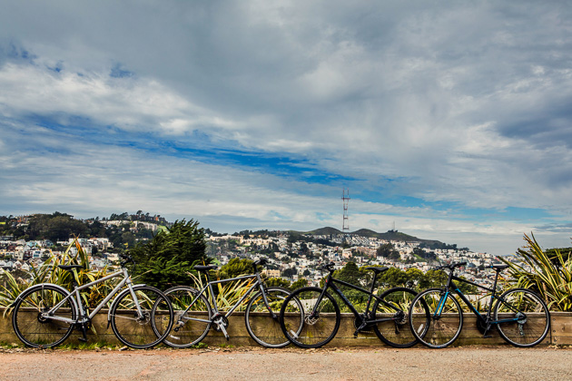

**Fender and rack mounts:** Using panniers attached to a rear rack instead of a backpack to carry your laptop or groceries lowers your center of gravity, which is a good thing. Also, no sweaty back. Fenders will keep you (and your riding companions) at least a little drier when you’re riding in the rain—or on wet roads after the rain has ended.

**Puncture-resistant tires:** Such tires are heavier and slower than the speedy slicks you’d use on a road bike, but any time you might lose due to the extra weight is time you’ll probably gain back (and more!) by not having to stop to fix a flat.

**Gearing appropriate for your terrain:** By this we mean, for the most part, that the bike should have gears and not be a single-speed. Not that single speeds don’t have their place. In parts of the country that are flat and have vicious winters—hello, Minnesota!—the fewer moving parts in a drive train, the better. But most of us have at least a few hills to climb, or headwinds to battle, and gears will come in handy. Almost all geared fitness-hybrids come with a triple front derailleur and seven or eight gears in the back, for a total of 21 or 24 gears, which would give you enough options for pretty much anywhere you’ll be riding.

**A sturdy yet reasonably lightweight frame:** You do want to be able to carry your bike up steps or down into the subway or lift it onto a bus or a bike rack, but you also want something that can withstand being knocked around a little. So you’ll probably be looking at an aluminum frame. Aluminum’s a third the weight of steel, and doesn’t cost nearly as much as carbon, though the ride can be stiff and a bit jarring. Steel provides a cushier ride, but as we’ve said in the past, a good-quality, lightweight steel frame will not be cheap. Almost all of the bikes we looked at, though, do have steel-bladed forks—the slight increase in weight they add is worth the vibration dampening they provide.

**Decent-quality components:** Here, it’s a matter of finding the right balance of price, quality, and durability. Most of the front and rear derailleurs on these bikes—and shifters and brake levers too—are made by Shimano, and although they’re not top (or even middle) of the line, they’ll work just fine, and last at least a few commuting seasons. “If you’re not racing, a slightly heavier derailleur isn’t going to make a big difference. I don’t think somebody’s going to notice performance issues right off the bat, and when the derailleur needs to be replaced, the cost will be fairly minimal—$20 to $30,” said Womac. “Yes, cheaper derailleurs do look uglier, but that’s just aesthetics.” One thing we did avoid, though, were bikes that come with [old-fashioned freewheel cogsets](http://www.sheldonbrown.com/free-k7.html) on the rear wheel instead of the more modern cassettes. A common complaint on the few hybrid user threads we’d found was being stuck with a wheel whose hub was only compatible with freewheel cogs, which are becoming hard to find, especially high-level ones. And what you really don’t want to buy is a bike with a freewheel and disc brakes. If that rear wheel gets stolen or irreparably damaged, good luck replacing it, said Copsey: “You just can’t find those two things on an off-the-shelf wheel.”

**Wide rims: **The wider the rims on the wheels, the wider the tire you can use, and the lower the air pressure you need, which gives you a more comfortable ride. “A big fat tire is the poor man’s suspension,” said [Michael Ferrand, owner of Bicycle Michael’s](http://www.bicyclemichaels.com/), in New Orleans. The norm for these bikes is 32 mm—you’ll want at least that. Speaking of suspension, none of our experts would recommend getting a $500 bike with front suspension, no matter how bad the roads are in your city. These models are often called dual-sport hybrids. [As Emily Thibodeau, owner of Hub Bicycle](http://hubbicycle.com/), in Cambridge, Massachusetts, put it, “At this price point, the shocks you’d get are really heavy and can’t be adjusted—it’s like having a glorified pogo stick on the front of your bike.”

When we started building our spreadsheet of possible bikes to test, it reconfirmed what we’d learned the last time around: These bikes are, for the most part, nearly identical. They use similar components and have similar geometry—even the frames almost all come from the [same clusters of factories in Asia](http://cyclingiq.com/2012/02/14/shadow-optic-the-manufacturing-partner-paradox/). So, as we did last time, we filtered our master list of 45 bikes using the above requirements, a budget of $500 (plus or minus about $20), and a basic standard level of drive-train componentry. (That would be Shimano Tourney for the front derailleur and Shimano Acera—which is two steps up in Shimano’s taxonomy from the Tourney—for the rear.) The result was a Venn diagram with, at the center, 16 bikes with comparable components at that price, and then the outliers: bikes that offered the standard level of components but at a higher price, or a lower level of components for the standard price. Those, we eliminated. We also investigated “boutique brands,” such as Public Bikes and Linus, that have begun to offer a more traditional geared hybrid bike, but despite the supposed economies of direct sales, you pay a $200 to $300 style tax for these rigs. Pretty as they are—disqualified!

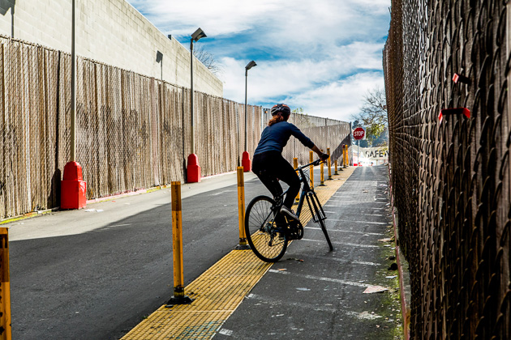
Unlike most slaloms, the Supermarket Slalom goes uphill as well as down.

Next came the test-riding stage, which actually involved not only riding the bikes but seeing how the top choices worked with the rack, panniers, and basket that we recommended in our most recent [commuter-gear review](http://thesweethome.com/reviews/best-bike-rack-basket-panniers/). The highlight of the testing process was what I like to call the Supermarket Slalom: riding up and down a steep little driveway leading to my local Safeway while weaving in and out of the soft-hit poles that separate the cars from the pedestrians to test the bikes’ handling. (I promise: No pedestrians were harmed, or startled, in the course of researching this story.) San Francisco even obliged with a few early-fall rainstorms, which made the abundant broken glass in the parking lot even more appealing to tires, and the pedestrian walkway’s plastic surface even more slippery, and allowed me to vet all the bikes’ brakes for wet-weather performance.

One reminder: You should absolutely test ride any bike you’re considering buying—how a bike feels to you, and how your body feels while riding it, is an intensely personal thing. Which raises the question of women-specific design (aka WSD). Though most companies do offer step-through or low-rise versions of each bike, more than a few are now offering parallel models (or even complete brands of bikes) designed for smaller riders with proportionally shorter arms, narrower shoulders, longer legs, and smaller hands. Usually, these riders are women, which means that these models and brands have tended to come in what the companies believe are female-friendly colors. (And sometimes, sadly, not quite as good components.) Still, if you’re a man and your body resembles the description above, you’d be smart to try out WSD models too—you might just find a bike that fits you perfectly. Conversely, if you’re a tall woman with broad shoulders, WSD might not be for you.

### Our pick

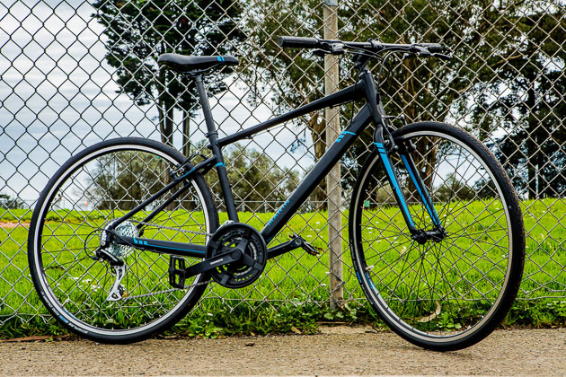

Our pick

[$490from Marin Bikes](https://wclink.co/link/18110/94104/3/31477)

[Our favorite hybrid bike](https://wclink.co/link/18110/94104/3/31477)
[Marin Fairfax SC1](https://wclink.co/link/18110/94104/3/31477)

This Marin is a capable commuter bike that would be equally comfortable on longer weekend rides—and it’s more fun to ride than its competitors.

.

The [Marin Fairfax SC1](https://wclink.co/link/18110/0/3/31467/) landed at the top of our list for many reasons, the first being its gearing. Like all the bikes we tested—other than the belt-drive ones, that is—the Fairfax has a Shimano Tourney triple set of chainrings. But the Fairfax’s chainrings have 42, 34, and 24 teeth, whereas the others all have 48, 38, and 28. This matters because the more teeth you have on your front chainrings, and therefore the bigger your chainrings are, the faster you can go—and the harder it is to pedal. This is why pros use chainrings of up to 55 teeth. You’re probably not a pro, though, and you don’t need to win every block of your commute. What you do need is help going up hills and into headwinds while schlepping your groceries, and for that, you’ll want smaller chainrings with fewer teeth.

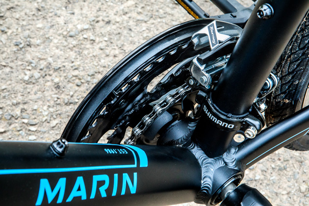
The Fairfax’s triple chainring is geared, so to speak, for climbing hills.

Then there are its tires, which are from Schwalbe, one of the most respected tire makers in the business. In the past few years, bike companies have started touting the puncture-resistance of the stock tires they’re shipping with bikes. The only problem is, many of those stock tires are made specifically for (or by) the companies and sold only with bikes. Sometimes, they’re less-durable or puncture-resistant copies of aftermarket tires; it is tough to determine which version of a tire comes stock on a bike. This isn’t a trivial issue: These compromised tires are going to need rapid replacement, and you’ll be out anywhere from $50 to $100 in the process. That’s why Marin gets huge props for including easily identifiable, same-as-store-bought Schwalbe tires with this bike. True, the [Road Cruisers](https://www.schwalbe.com/en/tour-reader/road-cruiser.html) that come with the Fairfax SC1 aren’t even close to the burliest tires that Schwalbe makes—those would be the almost impenetrable Marathon Plus ($65), which every last mechanic we spoke to recommends to his or her commuting customers. But Road Cruisers are made with a tightly meshed fabric (technically, the term is “50 EPI carcass”—the EPI stands for “ends per inch,” aka TPI or “threads per inch”) and an extra layer of protective Kevlar fiber, which you can read all about on [Schwalbe’s website](https://www.schwalbe.com/en/reifenaufbau.html). (They also average 4.6 stars out of five across 97 reviews on [Amazon’s UK site](https://www.amazon.co.uk/product-reviews/B001WEZHFQ/?tag=thesweethome-20&linkCode=xm2&ascsubtag=SH4282).) During testing, the grippy tread on the Road Cruisers handled the wet plastic of the Safeway pedestrian walkway with aplomb.

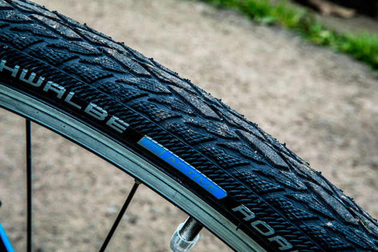

Grippy tread and a layer of Kevlar make the Fairfax’s tires good for year-round city riding.

The third reason was how it felt when I rode it. At 25½ pounds, the 17-inch Fairfax is one of the two lightest bikes we tested, and its geometry—that is, the design of the bike’s very frame—compounds that benefit. When I first got on the bike and pedaled off down the street, the bike felt quick—not in a nervous, edgy way, but sprightly. Accelerating felt easy. When I measured the bike’s chainstays (the parts of the frame that connect the rear wheel to the bottom bracket), they were definitely shorter than, for instance, those on the runner-up bike, the Fuji. (The bikes were otherwise the same size.) A quick look at the geometry diagram for each confirmed this: The Fairfax’s chain stay length is 432 mm; the Fuji’s, 448 mm. As a rule, the shorter the chain stay, the quicker the bike accelerates and the easier it climbs—at least until the front wheel starts lifting off the ground. Also, the Fairfax chain stays are flattened, which is meant to increase stiffness (i.e., more of your pedaling power makes it to the rear wheel), and the seat stays (the parts of the frame that connect the rear wheel to the seat tube) join the seat tube at a relatively low point, tightening the rear triangle, which also increases the bike’s responsiveness.

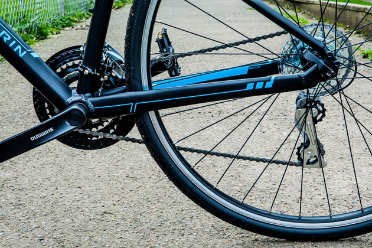

In this photo, the chainstays are the two horizontal tubes with blue trim.

Two other things we like about the Fairfax are its saddle, which is firm with a deep channel—a plus for most riders, male or female—and its internally routed shifter cables, a design detail once reserved for very high-end bikes. Running the shifter or brake cables inside the frame tubes protects the cables from damage in much the way that cable housing does, only better. (Grit can work its way in between the cable and the housing and make your bike’s shifting slow or ragged.)

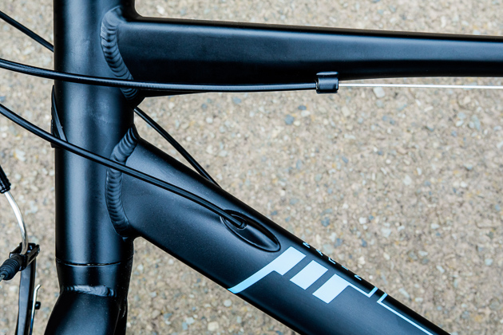

On the Fairfax, the shifter cables are internally routed—see how they disappear into the diagonal part of the frame?—but the brake cable (at the top of the photo) isn’t.

Who else likes this bike? It’s hard to find anyone saying anything bad about the various iterations of the Fairfax in [bikeforums.net](http://www.bikeforums.net/hybrid-bicycles/958724-marin-fairfax-anybody-have-experience.html), and the same goes for the reviews from [Bike Radar](http://www.bikeradar.com/us/commuting/gear/category/bikes/urban/product/review-marin-fairfax-sc2-ig-49876/), [Bicycling](http://www.bicycling.com/bikes-gear/reviews/16-for-2016-the-years-best-city-bikes), [The Guardian](https://www.theguardian.com/lifeandstyle/2016/apr/17/marin-fairfax-sc6-dlx-bite-size-bike-review-observer-martin-love), and [Outside](http://www.outsideonline.com/1962216/first-look-marin-fairfax-sc6-dlx), though none of them were specifically for the SC1. Full disclosure: My own “adventure” bike—that is, a cyclocross bike with compact road gearing—is a Marin Cortina from 2009 that I bought third-hand a couple years back, and it’s served me well on many epic gravel rides. (It’s also saved my hide on a few epically dumb escapades, like that all-night solstice dirt ride up and down Mount Tam.) Its previous owner, who rides it whenever she’s back in the country, has demanded the right of first refusal should I ever sell it. So chalk up another two yes votes in the Marin column.

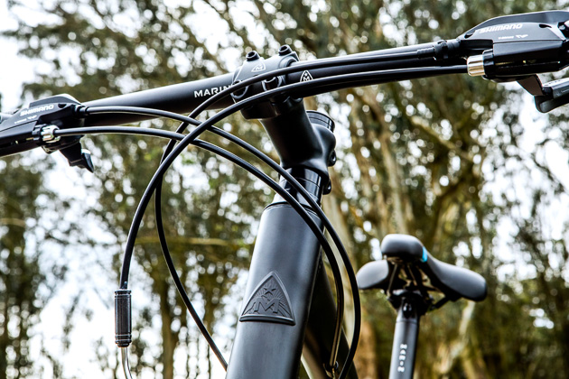

### Flaws but not dealbreakers

One area in which the runner-up, the Fuji Absolute, outscores the Fairfax is in the front derailleur: The Absolute has an Altus, one level up from the Fairfax’s. That said, Tourney front derailleurs are the standard for this level of bike, front derailleurs not being nearly as finicky and in need of adjustment as rear derailleurs. Another area where Marin cut some costs is in the pedals: Like the Absolute, the Fairfax has plastic platform pedals. They work well enough, but as Michael Ferrand said, “All plastic pedals are designed to die. Generally speaking, on a bike that costs under $600, replace the pedals.” (A decent set of metal platform pedals should cost you no more than $30.)

### Runner-up

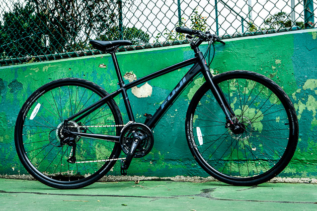

Runner-up

[$490from Fuji](https://wclink.co/link/18112/94106/3/31478)

[If you need disc brakes](https://wclink.co/link/18112/94106/3/31478)
[Fuji Absolute 1.9](https://wclink.co/link/18112/94106/3/31478)

Although this bike sells for the same price as the Marin and shares many of the same components—plus disc brakes—it lacks the design finesse of the Marin and rides a bit heavier as a result.

.

As I was sorting through the test bikes, assessing each bike’s strengths and weaknesses, I first pegged the [Absolute](https://wclink.co/link/18112/0/3/31468/)—given that it has disc brakes—as the right choice for someone who lives on a steep hill. But the chainrings that came with it are definitely not as good for climbing as the Fairfax’s. (Though, to be fair to Fuji, the Fairfax is the only bike among the 16 bikes we test rode that doesn’t have a 48/38/28 triple.) And then I rode both bikes and realized that the geometry and weight of the Fuji (27.29 pounds for the 15-inch bike, which is two pounds heavier than the Fairfax) put it at even more of a disadvantage when climbing. Still, as long as you don’t have to ride up a lot of hills, the Fuji is an excellent option at $489.

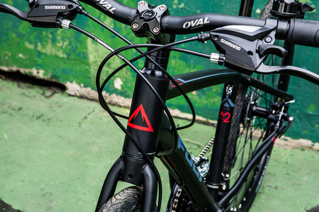

After all, the Absolute shares many of the virtues of the Fairfax—steel fork, internal shifter-cable routing, a firm saddle (though the channel is shallower)—and even outdoes it on a few counts. Its synthetic rubber handlebar grips are more ergonomically shaped than the ones on the Fairfax, and it has those mechanical disc brakes, which do allow for better modulation, and don’t get clogged by snow and mud the way rim brakes do.

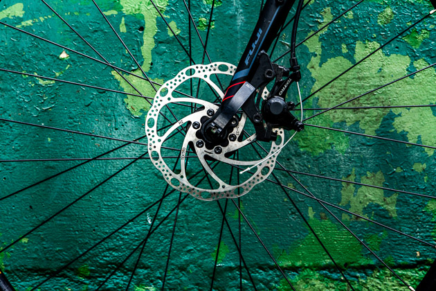

Disc brakes can be helpful if you’re riding in mud or snow, which can cling to a tire and get in the way of rim brakes. The Fuji uses mechanical discs, which are actuated by a cable, rather than a hydraulic line.

The tires, though, are a bit of a black box. Unlike the Schwalbes, it isn’t easy to tell what’s going on inside the Absolute’s Vera CityWide tires or what their “Phalanx flat protection” really consists of, as the tires are made by Fuji’s parent company, Advanced Sports International. As such, they are not available in stores or online. This doesn’t mean they are bad tires, but we weren’t able to find any independent evaluations of them—not even on bike discussion boards. When we asked Fuji to explain what its flat-protection feature actually was, a representative told us that the tires include a “kevlar/rubber” layer. That’s good, but the low TPI of 30 means greater permeability and a less supple ride. That said, they did survive the “supermarket slalom” glassfest unscathed, however, and although their tread isn’t quite as deep or grippy as that of the Schwalbe Road Cruisers, they didn’t slip on the plastic walkway.

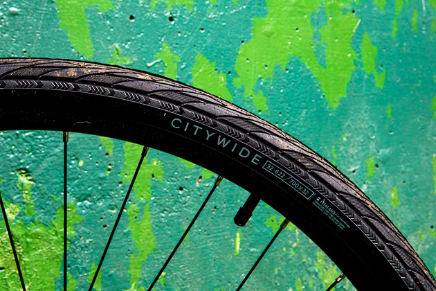

Vera CityWide tires come with the Fuji Absolute, but when they wear out, you’ll have to switch to another tire—they aren’t available for retail purchase.

### Also great

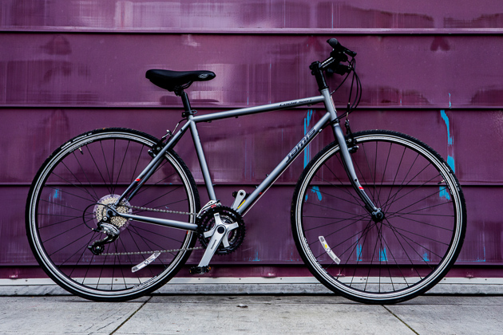

Also great

[$530from Jamis](https://wclink.co/link/8621/24922/3/31479)

[Still the smooth one](https://wclink.co/link/8621/24922/3/31479)
[Jamis Coda Sport](https://wclink.co/link/8621/24922/3/31479)

As we said in 2015, this steel framed bike provides a comfortable ride, but the trade-off is maneuverability—and an uptick in price.

.

In the two years since we last tested the [Jamis Coda Sport](https://wclink.co/link/8621/0/3/13635/), the bike’s specs haven’t changed in any substantive way, though the price did go up from $520 to $529. It still has the hybrid-standard-issue Shimano Tourney front and Acera rear derailleurs, and it still comes with Vittoria Randonneur tires—that is, tires from a “real” tire company that you can buy in a bike shop—and steel-wrapped resin pedals. And the heart of the Coda Sport is still its relatively lightweight—27.9 pounds—19-inch steel frame that quiets the road chatter you might otherwise feel while riding on rough pavement.

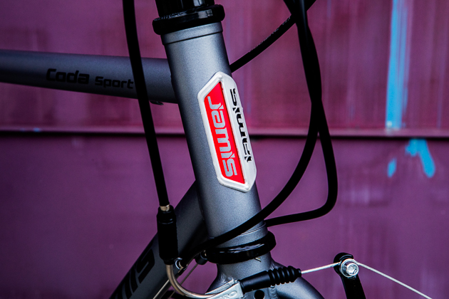

Digging into those spec changes from the 2015 and 2016 models, the bike’s crankset (the chainrings and the cranks, which hold the pedals, that is) is now a slightly different flavor of Shimano’s Tourney model; the brake levers are now Tektros, not Shimano (the V brakes themselves were Tektros all along); and the cassette is (once again) the Shimano version of the previous SRAM eight-cog, 11-32-tooth cassette—this last change actually reverses one that had been made in 2015.

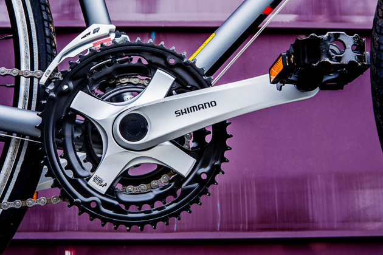

A bike’s crankset is the combination of the crank arms (here, the piece labeled Shimano), the spiders (the cross-shaped pieces that the arms are attached to), and the chainrings (the three sprockets with all the teeth).

Along with its silky ride feel, another advantage steel offers is that it if it bends, it can be bent back. So, if the hanger that attaches the rear derailleur to the frame gets bent, as can happen if the bike is in a crash or even, say, jostled roughly on a train, it can be straightened again with no risk that it’ll snap. With aluminum, sometimes such an operation is successful and sometimes … not. Which is why modern bikes with aluminum frames—like all of the aluminum hybrids we tested—use replaceable derailleur hangers, which can be swapped out if they get bent. These aren’t expensive parts to replace, but they come in a bewildering array of sizes and shapes, so it can be a minor pain, even for a professional mechanic, to identify the hanger that’s on your bike and then to find a new one.

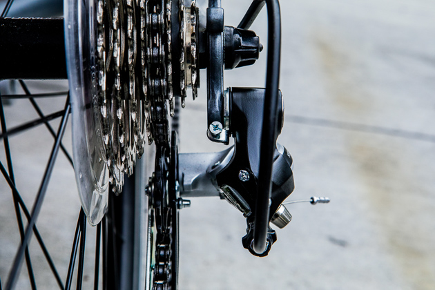

The gray vertical piece of metal in the top center of the photo is the derailleur hanger; the rear derailleur (the shiny black object that has the cable feeding into it) literally hangs from it.

In terms of acceleration, the Coda Sport’s relatively short chain stays—at 435 mm they’re just 3 millimeters more than the Marin’s—make it a bit sprightlier than the run-of-the-mill steel bike. When it comes to nimbleness, though, the bike didn’t navigate the supermarket slalom as handily as the Marin or the Fuji. So, our recommendation from last time holds: As long as you don’t plan to be riding in heavy, erratic traffic—or competing in your own slalom—the Coda Sport could be the bike for you.

### Upgrade pick

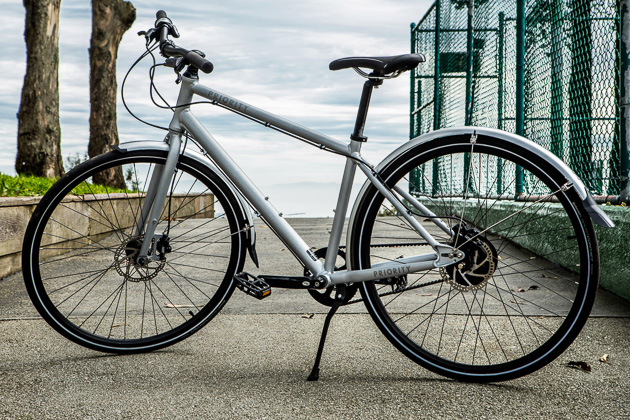

Upgrade pick

[$900from Priority Bicycles](https://wclink.co/link/18113/94107/3/31480)

[For the neatnik DIYer](https://wclink.co/link/18113/94107/3/31480)
[Priority Continuum](https://wclink.co/link/18113/94107/3/31480)

If you’ve been waiting for belt-drive hybrids to come down in price, this bike is the answer to your prayers—but you’ll have to assemble it yourself (or pay someone to).

.

Although the aluminum-framed [Priority Continuum](https://wclink.co/link/18113/0/3/31469/), currently at $899, retails for nearly twice the cost of the Marin Fairfax or the Fuji Absolute, it’s actually inexpensive for a belt-drive hybrid. Affordability isn’t the only appeal of the Continuum, though. The bike comes with hydraulic disc brakes, an aluminum fork, a Gates Carbon Drive belt (Gates being the most well-made option from a quality manufacturer; the Shimano of belt drives) and, most intriguingly, a NuVinci continuous/internally geared rear hub drive instead of the cassette-and-derailleur system on the regular fitness hybrids we researched. But it’s also available only through the Priority website, which means diving into the problematic world of online bike shopping.

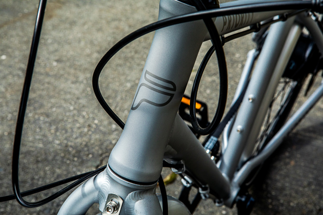

One plus of using a carbon belt to turn your bike’s gears and wheels is that a belt is far cleaner than a chain, as a belt drive doesn’t need to be lubricated, so it doesn’t pick up dirt the way chain lube does. (No bike grease on your pants leg!) However, belt-drive hybrids tend to be quite a bit more expensive than traditional hybrids, because using a belt drive requires using an internally geared rear hub, which can cost anywhere from about $75 for a three-speed Sturmey Archer to $1,400 for a Rohloff 14-speed. (Compare this with $45 for the Shimano eight-speed cassette and hubs that are on most of the bikes we looked at.)

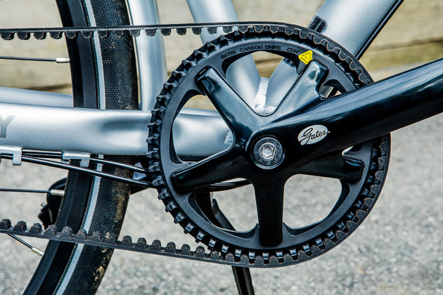

The Gates belt drive system uses a notched belt made of carbon fibers instead of a metal chain.

More affordable belt-drive bikes are definitely a trend: Both Marin and Trek also offer models that cost less than $1,100—way under the usual $1,500 price that we’re used to seeing. What sets the Continuum apart is the kind of internally geared rear hub it has, and how you buy the bike.

Rather than changing gears one by one, with an audible click, you twist the grip shifter of the Continuum smoothly in one direction to make the pedals easier to turn (and the bike easier to ride up hills) and in the other to make the pedals harder to turn (which will make the bike go faster on flat ground). The [workings of ordinary internally geared hubs](http://www.bicycling.com/bikes-gear/previews/the-mechanical-magic-of-internally-geared-hubs) are difficult enough to grasp—picture something like the inside of an [old, expensive watch](http://www.bicycling.com/bikes-gear/previews/the-mechanical-magic-of-internally-geared-hubs)—and when you add in the concept of continuous gearing, with no indexing, it seems like magic. However, the hub does have upper and lower limits in terms of ease and difficulty: According to NuVinci, the range of “gears” is broader than a Shimano Nexus eight-speed hub, which is what Marin’s [SC4 Belt](http://www.marinbikes.com/us/bikes/description/2017-fairfax-sc4-belt) ($1,039) comes with—and the Priority does seem to climb just a little bit better. It definitely tackles hills better than the [Trek Zektor i3](https://wclink.co/link/18111/0/3/31470/) ($1,100), but that shouldn’t be surprising, as the Zektor i3 has only a Shimano Nexus three-speed hub, meant for riding on relatively flat terrain.

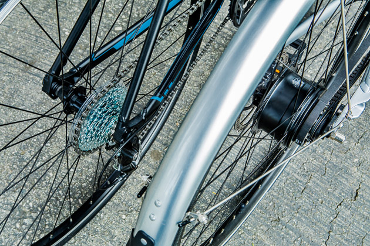

A cassette’s sprockets are out in the open (that’s the Fairfax, on the left); with an internally geared rear hub (this one, on the right, belongs to the Priority), all the shifting happens inside the hub.

The downside to buying a Continuum is that you’re buying a bike online. There are many, many reasons to be wary of doing so, which we’ve described at great length in our last hybrid bike review, not the least of which is that you can’t test ride the bike ahead of time to make sure you like it and that it fits you. And once the bike arrives, you have to finish putting it together. One advantage of an internally geared hub and a belt drive is that at least you don’t have to fiddle with derailleurs; you do, however, still need to make sure your brakes are set up correctly and your bike is bolted together properly.

The bike we tested came from Priority in fine shape, and the hydraulic brakes didn’t need to be bled. But for safety’s sake, we would always recommend that you either have a bike shop assemble your bike for you, or at least check your work. You should expect to pay the shop its standard service rate and maybe even a “corkage” fee—a small fee for bringing in your own bike instead of purchasing one at the shop. If so, pay it, and don’t be a jerk about it. As Michael Ferrard points out, bringing in a bike you’ve bought online for them to put together is like “driving your meat to McDonald’s, and asking them to fry it up and put some porcini and portabella mushrooms on it.”

### The competition

As we’ve said before, the bikes in this category do tend to be very similar, which means that if you can’t find any of the bikes above, you’ll probably be just fine with one of the following four options:

Our top pick for the past two years under the name FX 7.2—what is now called the [Trek FX 2](https://wclink.co/link/8619/0/3/13631/)—is still a terrific bike. Out on the road, the new version feels as good as the old one, and it aced our slalom test. The FX 2 is equipped with the same front and rear derailleurs as the Marin and an upgraded cassette (Shimano instead of the Marin’s SunRace), but unlike the Marin, the Trek’s frame has no internal routing, its chainring gearing isn’t as good for climbing as the Marin’s, and this year, its tires have been downgraded to Bontrager’s standard H2s. You no longer get the Hard Case H2s, which have a puncture-resistant barrier. Meanwhile—and this is one reason the FX 2 wasn’t our choice this year—its MSRP jumped from $480 to $520. The FX 2 does come with a couple of interesting extras: the company’s proprietary Blendr stem and DuoTrap S capability (which the FX 7.2 had too). The first lets you fasten Blendr-compatible mounts for lights or bike computers or cameras to the handlebar end of the stem, freeing up valuable real estate on your handlebars. The second means that you can install Bontrager’s DuoTrap S speed and cadence sensor into the chainstay—no zip ties!—but if you’re that interested in tracking performance metrics, odds are you’ll soon be graduating from a hybrid to a road bike anyway.

The MSRP of the [Specialized Sirrus](https://wclink.co/link/8620/0/3/13633/), one of our “also great” picks from last year, actually dropped from $520 to $500. However, Specialized still gives you only the lower-level Shimano Altus for the rear derailleur, not the Acera. It rides nicely, though, and has snappy reflective graphics on the seat stays. If the Sirrus fits you better than the Marin or the Fuji, buying this bike makes sense.

In the past, we’ve criticized the well-priced [Giant Escape 2](https://wclink.co/link/18114/0/3/31471/) ($415) for its aluminum fork and its Giant S-X3 tires, which at the time weren’t the puncture-resistant version. As of 2016, they are—although, as these are OEM tires that you can’t buy off the shelf, you can’t find many details about what, exactly, helps them resist punctures. Riding the 2017 incarnation, however, confirmed our previous testers’ impressions: I could feel any roughness in the pavement coming up through the handlebars to a much greater extent than with the other bikes I tested, all of which had steel forks. I might have swapped the Escape 2 for the $340 Escape 3, which does have a steel fork, except that the 3 comes with a less-desirable freewheel cogset instead of a cassette.

Making a laudable commitment to women’s cycling, Giant launched an entire women’s specific brand, called Liv, in 2011. On the road, Liv’s equivalent to the Escape 2, which is called the [Alight 2](https://wclink.co/link/18115/0/3/31472/), performed much like its sibling: It handled the slalom well, but the aluminum fork wasn’t doing much to dampen the pavement noise. Unfortunately, when you look closely at the two bikes, the Alight falls a little short, despite having the same MSRP (currently $415). First, the Alight 2 that we were testing weighed 26.12 pounds to the Escape 2’s 25.55—even though the Alight 2 was a small and the Escape 2 a medium. Second, the Escape 2 has internally routed brake and shifter cables, whereas the Alight’s cables are all external. Also, the Alight comes with a soft, squishy saddle, the kind I’d expect to find on a comfort hybrid. The Escape’s saddle, on the other hand, was firm. Finally, the Alight still comes with the version of the S-X3 tires lacking flat protection.

Then there were the bikes, many from well-known brands, that didn’t make the first cut. Some, like the [Breezer Liberty 6R](https://wclink.co/link/18116/0/3/31475/) and the [Jamis Allegro Sport](https://wclink.co/link/18117/0/3/31476/), sell for the same price as the Marin and the Fuji, but come with a lower level of components. Others changed specs or prices as we were doing our research: For instance, the price of the [Raleigh Cadent 2](https://wclink.co/link/18132/0/3/31544/) went from $470 to $550, which knocked it out of contention.

One concern we had about the [Cannondale Quick 7](https://wclink.co/link/18118/0/3/31474/) was that it costs $520 for the same component mix as you’d get for $489 with the Marin. (True, the front derailleur is the Shimano Altus, not the Tourney, and the cassette is Shimano, not Sunrace, but that’s a total price difference of a couple dollars.) But what set off alarm bells was that none of my local Cannondale dealers have chosen to stock it. One salesperson (who asked that we not identify her shop or give her name) said, “We like to sell our customers bikes that will last,” reflecting a general—though admittedly vague—consensus that this particular Cannondale isn’t as good as its similarly priced competitors.

### Care and maintenance

Like all mechanical things, bicycles will be a lot happier, and last a lot longer, with a little regular basic maintenance. For a list of what you should do—or have a shop do—and how frequently, check out the “How we picked” section of our [bike repair kit review](http://thesweethome.com/reviews/best-bike-repair-kit/). You’ll also find out what tools you should invest in—and which ones to skip. Another big element of bike “care” is keeping it from being stolen. Check out our [newly revised bike lock guide here](http://thesweethome.com/reviews/best-bike-lock/).

### What to look forward to

Sadly, one of the new bikes we were most looking forward to riding is dead in the water. In 2014, the [Oregon Manifest Bike Design Project](http://oregonmanifest.com/) held a competition to create the ultimate city bike, with the promise that Fuji would bring the winning design to market. After the winner was announced—it was [the Denny](http://www.dennybike.com/#about), the product of a [coalition of Seattle designers](http://oregonmanifest.com/teams/seattle/)—everyone got to work, but in June 2016, the Denny team announced that the [project had run into insurmountable production problems](http://www.dennybike.com/news/2016/6/2/a-sad-day-for-denny) and was being shelved. However, the Denny wasn’t the only interesting bike hoping to fill that urban utility niche. An outfit named [Fortified](http://fortifiedbike.com/) is selling what it calls a theft-proof bike: the Invincible. At this point, though, it’s available only online; if you want to take a test ride, the company will try to put you in touch with a local “ambassador,” but so far that’s only possible in Boston, New York City, and San Francisco. A Dutch startup, VanMoof, is borrowing an idea from the e-bike world and building GPS connectivity into its [SmartBike](https://wclink.co/link/18119/0/3/31473/), which should make it possible to track your bike if it’s stolen—we’re hoping to see this technology spread further. And in the “back to the future” category, a hybrid from Specialized called [the Alibi](https://www.specialized.com/us/en/bikes/fitness/fitness/alibi) features airless Nimbus tires. Way back in the beginning of bicycle history, tires were made of solid rubber, which resulted a horrible, jolting ride. The Nimbus Airless tires, though, use a honeycomb of tiny air cells, which act as a cushion—the entry-level Alibi ($490) we test-rode feels very much like a normal bike. The inevitable cost-saving trade-offs, though, mean the bike comes with a freewheel, not a cassette, and a Tourney rear derailleur—neither of which we’d recommend. The website copy for the bike, too, aims at women in a way that’s not particularly enlightened—hey, Specialized, a lot of men don’t like changing flats either.

*(Photos by Christie Hemm Klok.)*
.