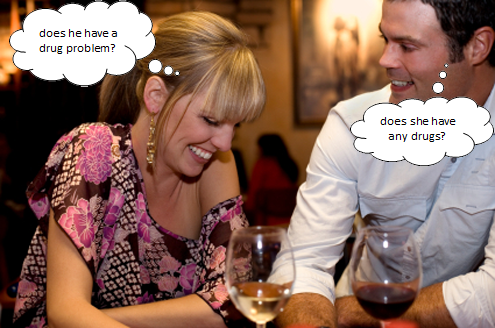
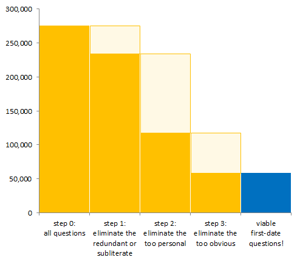
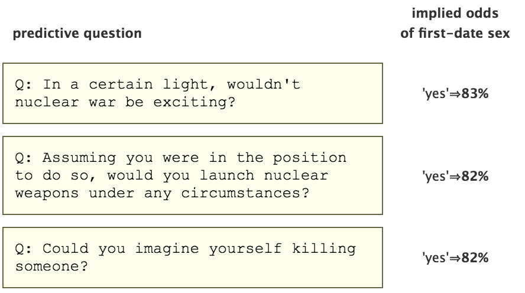
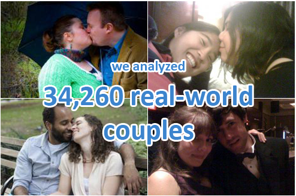
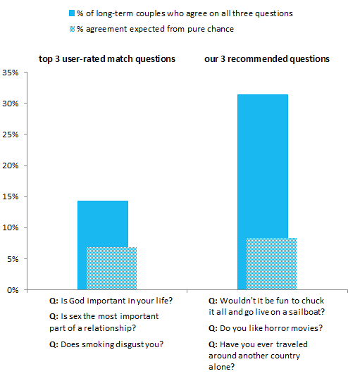
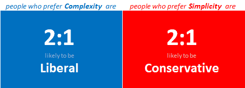

The Best Questions For A First Date

# The Best Questions For A First Date

## How asking certain questions can reveal much more

[OkCupid](https://theblog.okcupid.com/@okcupid?source=post_page-----dba6adaa9df2----------------------)

[Follow](https://medium.com/m/signin?operation=register&redirect=https%3A%2F%2Ftheblog.okcupid.com%2Fthe-best-questions-for-a-first-date-dba6adaa9df2&source=post_page-4485df771923----dba6adaa9df2----------------------)

[Apr 20, 2011](https://theblog.okcupid.com/the-best-questions-for-a-first-date-dba6adaa9df2?source=post_page-----dba6adaa9df2----------------------) · 5 min read

First dates are awkward. There is so much you want to know about the person across the table from you, and yet so little you can directly ask.

This post is our attempt to end the mystery. We took OkCupid’s database of 275,294 match questions — probably the biggest collection of relationship concerns on earth — and the 776 *million* answers people have given us, and we asked:

> What questions are **> easy to bring up**> , yet correlate to the deeper, unspeakable, issues people actually care about?

Love, sex, a soulmate, an argument, whatever you’re looking for, we’ll show you the polite questions to find it. We hope they’ll be useful to you in the real world.

## First — define “easy to bring up”

Before we could go looking for correlations to deeper stuff, our first task was to decide which questions were even first-date appropriate. I know each person has his own opinion on what’s okay to talk about with a stranger. I also know that if I had to wade through hundreds of thousands of user-submitted questions like these verbatim examples:

> Q: If you were to be eaten by cannibal, how would you like to be prepaired?
> Q: do u own 3 or more dildos in your room?
> Q: Do you hsve a desent job?

I would go fucking insane. The basic currency of the Internet is human ignorance, and, frankly, our database holds a strong cash position!

So, instead of judging each question’s first-date appropriateness subjectively, I turned to statistics. I decided our candidates were the ones that **(a)** most people were comfortable discussing publicly, and **(b)** were mathematically likely to tell you something you couldn’t just guess. I sliced OkCupid’s question pool like this:

That blue rectangle is our highest-quality, least-invasive questions, and we next examined each of them for interesting correlations. (If you’re interested in knowing more about the above graph, you can [drop-down an explanation here](https://blog.okcupid.com/index.php/the-best-questions-for-first-dates/#false), complete with an **interactive scatter plot** that took me forever to make.)

Now let’s get right to the results. This is **the shallow stuff to ask when you want to know something deep**:

* * *

*...*
Okay, if you want to know…
> Will my date have sex on the first date?
Ask…
> Do you like the taste of beer?
Because…

Among all our casual topics, whether someone likes the taste of beer is the single best predictor of if he or she has sex on the first date.

No matter their gender or orientation, beer-lovers are 60% more likely to be okay with sleeping with someone they’ve just met. Sadly, this is the only question with a meaningful correlation for women. For men there are a few others:

First, I have to give guys credit for logical thinking: in the post-apocalypse, THERE ARE NO SECOND DATES.

Also, I will never look at fingerless gloves the same way again.
If you want to know…
> Do my date and I have long-term potential?
Ask your date (and yourself!)…
> Do you like horror movies?
> Have you ever traveled around another country alone?
> Wouldn’t it be fun to chuck it all and go live on a sailboat?

Of all questions appropriate to a first date, the three listed above were the ones couples most often **agreed** on.

Here’s how we know…

When someone deletes their OkCupid account, they have the option of giving us a reason, and if that reason is ‘**I met somebody on OkCupid**,’ they can give us their significant other’s username. Many hundreds of people a day go through the trouble of doing this, so we’ve compiled an excellent dataset of real-world couples. Agreement on these three questions correlated best to an actual relationship.

In fact, **32%** of successful couples agreed on all of them — which is **3.7×** the rate of simple coincidence. These questions as a trio even out-performs OkCupid’s top three user-rated match questions.

*Turistas*: the best date movie of all time?

* * *

*...*
If you want to know…
> Do my date and I have the same politics?
Ask your date (and yourself!)…
> Do you prefer the people in your life to be simple or complex?
Because…

We were very surprised to find that this *one* question very strongly predicts a person’s ideas on these divisive issues:

> Should burning your country’s flag be illegal?
> Should the death penalty be abolished?
> Should gay marriage be legal?
> Should Evolution and Creationism be taught side-by-side in schools?

In each case, complexity-preferrers are 65–70% likely to give the Liberal answer. And those who prefer simplicity in others are 65–70% likely to give the Conservative one.

This correlation is for a nationwide dataset; it won’t be as useful in places where one ideology is much more prevalent than the other. For example, in New York City there are lots of people who like simplicity and yet have Liberal politics.

* * *

*...*

## If you want to know…

> Is my date religious?
Ask your date (and yourself!)…
> Do spelling and grammar mistakes annoy you?

If your date answers ‘no’ — i.e. is okay with bad grammar and spelling — the odds of him or her being at least moderately religious is **slightly better than 2:1**.

As someone who is not himself a believer, I found it rather heartening that tolerance, even on something trivial like this, correlated with belief in God, although I should’ve figured out that religious people are okay with small mistakes. Next to intelligent design, what’s a couple typos?

It’s also nice when two completely independent datasets corroborate each other. Last summer, we analyzed the profile text of half a million user profiles, comparing religion and writing-level. For every one of the faith-based belief systems listed, the people who were the least serious wrote at the highest level.

* * *

*...*

*We know you’re more substance than just selfie. Give *[*OkCupid.com*](https://www.okcupid.com/?utm_source=blog)* a try to connect with people as individual as you are.*