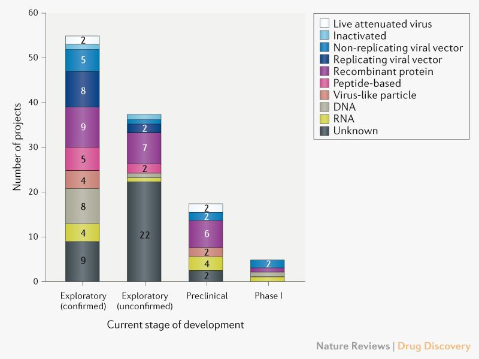
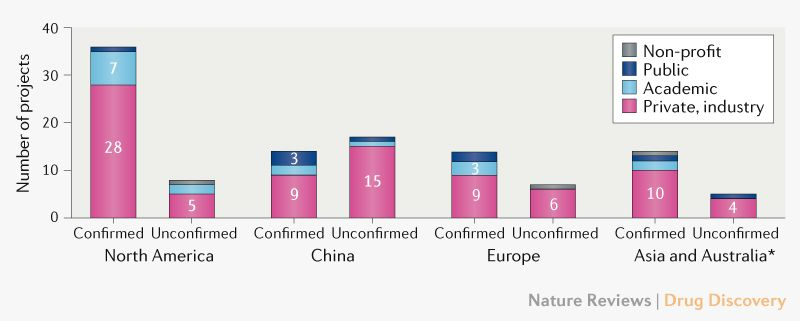

The COVID-19 vaccine development landscape

The genetic sequence of SARS-CoV-2, the coronavirus that causes COVID-19, was published on 11 January 2020, triggering intense global R&D activity to develop a vaccine against the disease. The scale of the humanitarian and economic impact of the COVID-19 pandemic is driving evaluation of next-generation vaccine technology platforms through novel paradigms to accelerate development, and the first COVID-19 vaccine candidate [entered human clinical testing](https://www.modernatx.com/modernas-work-potential-vaccine-against-covid-19) with unprecedented rapidity on 16 March 2020.

The Coalition for Epidemic Preparedness Innovations (CEPI) is working with global health authorities and vaccine developers to support the development of vaccines against COVID-19. To facilitate this effort, we have developed and are continuously maintaining an overview of the global landscape of COVID-19 vaccine development activity. Our landscape database includes vaccine development programmes reported through the WHO’s authoritative and [continually updated list](https://www.who.int/blueprint/priority-diseases/key-action/novel-coronavirus-landscape-ncov.pdf), along with other projects identified from publicly available and proprietary sources (see Supplementary Box 1). The landscape provides insights into key characteristics of COVID-19 vaccine R&D and serves as a resource for ongoing portfolio management at CEPI. We have also shared our landscape information with others in the global health ecosystem to help improve coordination in the COVID-19 outbreak response and enable global resources and capabilities to be directed towards the most promising vaccine candidates.

## COVID-19 vaccine R&D landscape

As of 8 April 2020, the global COVID-19 vaccine R&D landscape includes 115 vaccine candidates (Fig. 1), of which 78 are confirmed as active and 37 are unconfirmed (development status cannot be determined from publicly available or proprietary information sources). Of the 78 confirmed active projects, 73 are currently at exploratory or preclinical stages. The most advanced candidates have recently moved into clinical development, including [mRNA-1273](https://clinicaltrials.gov/ct2/show/NCT04283461) from Moderna, [Ad5-nCoV](https://clinicaltrials.gov/ct2/show/NCT04313127) from CanSino Biologicals, [INO-4800](http://ir.inovio.com/news-and-media/news/press-release-details/2020/INOVIO-Initiates-Phase-1-Clinical-Trial-Of-Its-COVID-19-Vaccine-and-Plans-First-Dose-Today/default.aspx) from Inovio, [LV-SMENP-DC](https://clinicaltrials.gov/ct2/show/NCT04276896) and [pathogen-specific aAPC](https://clinicaltrials.gov/ct2/show/NCT04299724) from Shenzhen Geno-Immune Medical Institute (Table 1). Numerous other vaccine developers have [indicated plans to initiate human testing in 2020](https://www.nature.com/articles/d41587-020-00005-z).

 

Fig. 1 | **Pipeline of COVID-19 vaccine candidates**  **by technology platform**. Exploratory projects (split into confirmed and unconfirmed) are in the early planning stage with no in-vivo testing, and preclinical projects are at the stage of in-vivo testing and/or manufacturing clinical trials material.

## Table 1 | Clinical-phase vaccine candidates for COVID-19

|     |     |     |     |
| --- | --- | --- | --- |
| **Candidate** | **Vaccine characteristics** | **Lead developer** | **Status** |
| mRNA-1273 | LNP-encapsulated mRNA vaccine encoding S protein | Moderna | Phase I ([NCT04283461](https://clinicaltrials.gov/ct2/show/NCT04283461)) |
| Ad5-nCoV | Adenovirus type 5 vector that expresses S protein | CanSino Biologicals | Phase I ([NCT04313127](https://clinicaltrials.gov/ct2/show/NCT04313127)) |
| INO-4800 | DNA plasmid encoding S protein delivered by electroporation | Inovio Pharmaceuticals | Phase I ([NCT04336410](https://clinicaltrials.gov/ct2/show/record/NCT04336410)) |
| LV-SMENP-DC | DCs modified with lentiviral vector expressing synthetic minigene based on domains of selected viral proteins; administered with antigen-specific CTLs | Shenzhen Geno-Immune Medical Institute | Phase I ([NCT04276896](https://clinicaltrials.gov/ct2/show/NCT04276896)) |
| Pathogen-specific aAPC | aAPCs modified with lentiviral vector expressing synthetic minigene based on domains of selected viral proteins | Shenzhen Geno-Immune Medical Institute | Phase I ([NCT04299724](https://clinicaltrials.gov/ct2/show/NCT04299724)) |

aAPC, artificial antigen-presenting cell; CTL, cytotoxic T lymphocyte; DC, dendritic cell; LNP, lipid nanoparticle; S protein, SARS-CoV-2 spike protein. Source: ClinicalTrials.gov website; WHO.

***Diversity of technology platforms***. A striking feature of the vaccine development landscape for COVID-19 is the range of technology platforms being evaluated, including nucleic acid (DNA and RNA), virus-like particle, peptide, viral vector (replicating and non-replicating), recombinant protein, live attenuated virus and inactivated virus approaches (Fig. 1). Many of these platforms are not currently the basis for licensed vaccines, but experience in fields such as oncology is encouraging developers to exploit the opportunities that next-generation approaches offer for increased speed of development and manufacture. It is conceivable that some vaccine platforms may be better suited to specific population subtypes (such as the elderly, children, pregnant women or immunocompromised patients).

Considering the candidates in Table 1, the [novel platforms based on DNA or mRNA](https://www.frontiersin.org/articles/10.3389/fimmu.2018.00600/full) offer great flexibility in terms of antigen manipulation and potential for speed. Indeed, Moderna started clinical testing of its mRNA-based vaccine mRNA-1273 just 2 months after sequence identification. Vaccines based on viral vectors offer a high level of protein expression and long-term stability, and induce strong immune responses. Finally, there are already licensed vaccines based on recombinant proteins for other diseases, and so such candidates could take advantage of existing large-scale production capacity.

For some platforms, adjuvants could enhance immunogenicity and make lower doses viable, thereby enabling vaccination of more people without compromising protection. So far, at least 10 developers have indicated plans to develop adjuvanted vaccines against COVID-19, and vaccine developers including [GlaxoSmithKine](https://www.gsk.com/en-gb/media/press-releases/cepi-and-gsk-announce-collaboration-to-strengthen-the-global-effort-to-develop-a-vaccine-for-the-2019-ncov-virus/), [Seqirus](https://www.cslbehring.com/vita/2020/our-offer-to-help-battle-coronavirus) and [Dynavax](http://investors.dynavax.com/news-releases/news-release-details/dynavax-and-cepi-announce-collaboration-support-global-effort) have committed to making licensed adjuvants (AS03, MF59 and CpG 1018, respectively) available for use with novel COVID-19 vaccines developed by others.

Public information on the specific SARS-CoV-2 antigen(s) used in vaccine development is limited. Most candidates for which information is available aim to induce neutralizing antibodies against the viral spike (S) protein, preventing uptake via the human ACE2 receptor. However, it is unclear how different forms and/or variants of the S protein used in different candidates relate to each other, or to the genomic epidemiology of the disease. Experience with SARS vaccine development indicates the potential for immune enhancement effects of different antigens, which is [a topic of debate](https://www.pnas.org/content/early/2020/03/27/2005456117) and could be relevant to vaccine advancement.

***Profile of vaccine developers***. Of the confirmed active vaccine candidates, 56 (72%) are being developed by private/industry developers, with the remaining 22 (28%) of projects being led by academic, public sector and other non-profit organizations (Fig. 2). Although a number of large multinational vaccine developers (such as [Janssen](https://www.jnj.com/johnson-johnson-announces-a-lead-vaccine-candidate-for-covid-19-landmark-new-partnership-with-u-s-department-of-health-human-services-and-commitment-to-supply-one-billion-vaccines-worldwide-for-emergency-pandemic-use), [Sanofi](https://www.sanofi.com/en/about-us/our-stories/sanofi-s-response-in-the-fight-against-covid-19), [Pfizer](https://www.pfizer.com/news/press-release/press-release-detail/pfizer_and_biontech_to_co_develop_potential_covid_19_vaccine) and [GlaxoSmithKine](https://www.gsk.com/en-gb/media/press-releases/cepi-and-gsk-announce-collaboration-to-strengthen-the-global-effort-to-develop-a-vaccine-for-the-2019-ncov-virus/)) have engaged in COVID-19 vaccine development, many of the lead developers are small and/or inexperienced in large-scale vaccine manufacture. So, it will be important to ensure coordination of vaccine manufacturing and supply capability and capacity to meet demand.

 

Fig. 2 | **Profile of COVID-19 vaccine developers by type and geographic location.** For partnerships, the location is that of the lead developer. *Excluding China.

Most COVID-19 vaccine development activity is in North America, with 36 (46%) developers of the confirmed active vaccine candidates compared with 14 (18%) in China, 14 (18%) in Asia (excluding China) and Australia, and 14 (18%) in Europe (Fig. 2). Additional vaccine development efforts have been reported for China, and CEPI is in dialogue with the Chinese Ministry of Science and Technology to confirm their status.

Lead developers of active COVID-19 vaccine candidates are distributed across 19 countries, which collectively account for over three-quarters of the global population. However, there is currently no public information on vaccine development activity in Africa or Latin America, although vaccine manufacturing capacity and regulatory frameworks exist in these regions. The epidemiology of COVID-19 might differ by geography, and it is likely that effective control of the pandemic will require greater coordination and involvement of the southern hemisphere in vaccine R&D efforts.

## Outlook

The global vaccine R&D effort in response to the COVID-19 pandemic is unprecedented in terms of scale and speed. Given the imperative for speed, there is an indication that vaccine could be available under emergency use or similar protocols [by early 2021](https://www.hhs.gov/about/news/2020/03/30/hhs-accelerates-clinical-trials-prepares-manufacturing-covid-19-vaccines.html). This would represent a fundamental step change from the traditional vaccine development pathway, which [takes on average over 10 years](https://journals.plos.org/plosone/article?id=10.1371/journal.pone.0057755), even compared with the accelerated 5-year timescale [for development of the first Ebola vaccine](https://www.who.int/news-room/detail/12-11-2019-who-prequalifies-ebola-vaccine-paving-the-way-for-its-use-in-high-risk-countries), and will [necessitate novel vaccine development paradigms](https://science.sciencemag.org/content/367/6485/1407) involving parallel and adaptive development phases, innovative regulatory processes and scaling manufacturing capacity.

Industry benchmarks for traditional vaccine development paradigms [cite attrition rates for licensed vaccines of more than 90%](https://journals.plos.org/plosone/article?id=10.1371/journal.pone.0057755). The approaches being applied for COVID-19 development — which involve a new virus target and often novel vaccine technology platforms and novel development paradigms as well — are likely to increase the risks associated with delivering a licensed vaccine, and will require careful evaluation of effectiveness and safety at each step. In order to assess vaccine efficacy, [COVID-19 specific animal models are being developed](https://www.who.int/blueprint/priority-diseases/key-action/WHO-ad-hoc-Animal-Model-Working-Group_Summary.pdf), including ACE2-transgenic mice, hamsters, ferrets and non-human primates. Biosafety-level 3 containment measures are needed for animal studies involving live-virus challenges, and the demand for these capabilities is likely to require international coordination to ensure that sufficient laboratory capacity is available.

Finally, [strong international coordination and cooperation](https://doi.org/10.1016/S0140-6736(20)30763-7) between vaccine developers, regulators, policymakers, funders, public health bodies and governments will be needed to ensure that promising late-stage vaccine candidates can be manufactured in sufficient quantities and equitably supplied to all affected areas, particularly low-resource regions. CEPI has recently [issued a call for funding](https://doi.org/10.1016/S0140-6736(20)30763-7) to support global COVID-19 vaccine development efforts guided by three imperatives: speed, manufacture and deployment at scale, and global access. We maintain a dynamic portfolio management approach, and will make our enabling science resources available globally. We urge the global vaccine community to collectively mobilize the technical and financial support needed to successfully address the COVID-19 pandemic through a global vaccination programme, and provide a strong base to tackle future pandemics.

doi: 10.1038/d41573-020-00073-5

**Acknowledgements**

The authors thank F. Kristensen, N. Lurie, and M. Christodoulou from CEPI and D. Vaughn from BMGF for guidance and inputs. We thank the WHO for making the COVID-19 landscape data available.

### Supplementary Information

1.   [Supplementary Box 1](https://www.nature.com/magazine-assets/d41573-020-00073-5/17881100)

### Competing Financial Interests

CEPI is a funder of some of the vaccine projects highlighted in this article. M.S. owns stock in a COVID-19 vaccine developer that is not funded by CEPI.

# Nature Briefing

An essential round-up of science news, opinion and analysis, delivered to your inbox every weekday.

Email address

Yes! Sign me up to receive the daily *Nature Briefing* email. I agree my information will be processed in accordance with the *Nature* and Springer Nature Limited [Privacy Policy](https://www.nature.com/info/privacy).