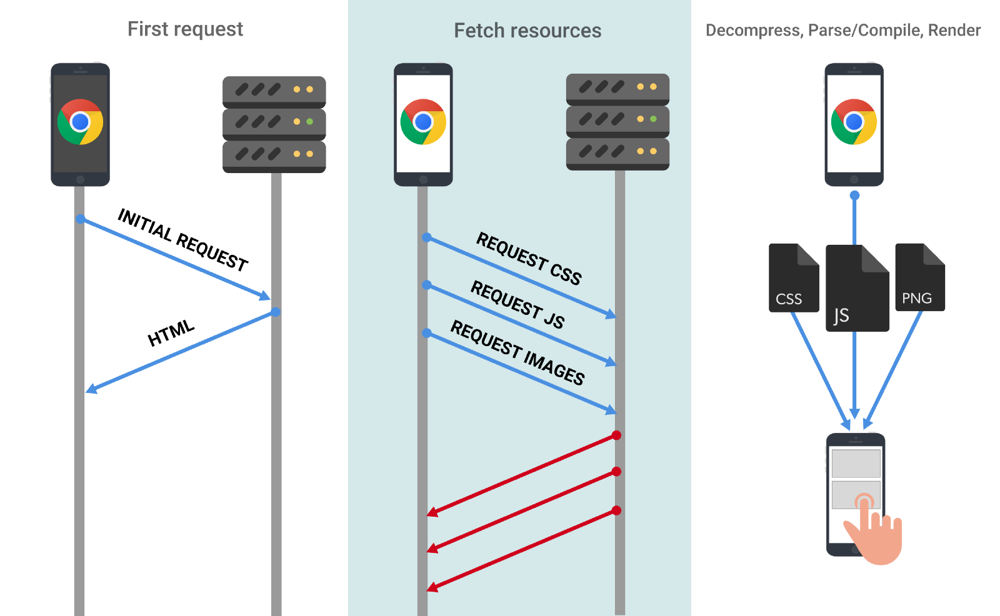

The Cost Of JavaScript – Dev Channel – Medium

# The Cost Of JavaScript

As we build sites more heavily reliant on JavaScript, we sometimes pay for what we send down in ways that we can’t always easily see. In this post, I’ll cover why a little **discipline **can help if you’d like your site to load & be interactive quickly on mobile devices.

**tl;dr: less code = less parse/compile + less transfer + less to decompress**

#### **Network**

When most developers think about the cost of JavaScript, they think about it in terms of the **download & execution cost. **Sending more bytes of JavaScript over the wire takes longer the slower a user’s connection is.

This can be a problem, even in first-world countries, as the **effective network connection type** a user has might not actually be 3G, 4G or WiFi. You can be on coffee-shop Wifi but connected to a cellular hotspot with 2G speeds.

You can **reduce** the network transfer cost of JavaScript by:

- •**Only shipping the code a user needs**. Code-splitting can help here.
- •[**Minifying**](https://developers.google.com/web/fundamentals/performance/optimizing-content-efficiency/optimize-encoding-and-transfer)** it** (Uglify for ES5, [babel-minify](https://github.com/babel/minify) or [uglify-es](https://www.npmjs.com/package/uglify-es) for ES2015)
- •[**Compressing it heavily**](https://developers.google.com/web/fundamentals/performance/optimizing-content-efficiency/optimize-encoding-and-transfer) (using [Brotli](https://www.smashingmagazine.com/2016/10/next-generation-server-compression-with-brotli/) ~[q11](https://twitter.com/paulcalvano/status/924660429846208514), Zopfli or gzip). Brotli outperforms gzip on compression ratio. It helped CertSimple save [17%](https://speakerdeck.com/addyosmani/the-browser-hackers-guide-to-instant-loading?slide=30) on the size of compressed JS bytes and LinkedIn save [4%](https://engineering.linkedin.com/blog/2017/05/boosting-site-speed-using-brotli-compression) on their load times.
- •**Removing unused code**. Identify with [DevTools code coverage](https://developers.google.com/web/updates/2017/04/devtools-release-notes). For stripping code, see [tree-shaking](https://webpack.js.org/guides/tree-shaking/), [Closure Compiler](https://developers.google.com/closure/compiler/)’s advanced optimizations and library trimming plugins like [lodash-babel-plugin](https://github.com/lodash/babel-plugin-lodash) or Webpack’s [ContextReplacementPlugin](https://iamakulov.com/notes/webpack-front-end-size-caching/#moment-js) for libraries like Moment.js. Use babel-preset-env & browserlist to avoid transpiling features already in modern browsers. Advanced developers may find careful [analysis of their Webpack bundles](https://github.com/webpack-contrib/webpack-bundle-analyzer) helps identify opportunities to trim unneeded dependencies.
- •[**Caching it**](https://developers.google.com/web/fundamentals/performance/optimizing-content-efficiency/http-caching)** to minimize network trips. **Determine optimal lifetimes for scripts (max-age) & supply validation tokens (ETag) to avoid transferring unchanged bytes. Service Worker caching can make your app network resilient & give you eager access to features like [V8’s code cache](https://v8project.blogspot.com/2015/07/code-caching.html). Learn about long-term caching with [filename hashing](https://webpack.js.org/guides/caching/).

Best practices for reducing how much JavaScript you’re shipping down to users.

#### **Parse/Compile**

Once downloaded, one of JavaScript’s **heaviest** costs is the time for a JS engine to **parse/compile** this code. In Chrome DevTools, parse and compile are part of the yellow “Scripting” time in the Performance panel.

The Bottom-Up/Call Tree allow viewing exact Parse/compile timings:

Chrome DevTools Performance panel > Bottom-Up. With V8’s Runtime Call Stats enabled, we can see time spent in phases like Parse and Compile

But, why does this matter?

**Spending a long time parsing/compiling code can heavily delay how soon a user can interact with your site. The more JavaScript you send, the longer it will take to parse & compile it before your site is interactive.**

> Byte-for-byte, **> JavaScript is more expensive for the browser to process than the equivalently sized image or Web Font **> — Tom Dale

Compared to JavaScript, there are numerous costs involved in processing equivalently sized images (they still have to be decoded!) but on average mobile hardware, JS is more likely to negatively impact a page’s interactivity.

JavaScript and image bytes have very different costs. Images usually don’t block the main thread or prevent interfaces from getting interactive while being decoded and rasterized. JS however can delay interactivity due to parse, compile and execution costs.

When we talk about parse and compile being slow; context is important — we’re talking about **average** mobile phones here. **Average users can have phones with slow CPUs and GPUs, no L2/L3 cache and which may even be memory constrained.**

> Network capabilities and device capabilities don’t always match up. A user with an amazing Fiber connection doesn’t necessarily have the best CPU to parse and evaluate JavaScript sent to their device. This is also true in reverse..a terrible network connection, but a blazing fast CPU. — Kristofer Baxter, LinkedIn

In [JavaScript Start-up Performance](https://medium.com/reloading/javascript-start-up-performance-69200f43b201), I noted the cost of parsing ~1MB of decompressed (simple) JavaScript on low and high-end hardware. **There is a 2–5x difference in time to parse/compile code between the fastest phones on the market and average phones**.

**Parse times for a 1MB bundle of JavaScript (~250KB gzipped)** across desktop & mobile devices of differing classes. When looking at the cost of parse, it’s the **decompressed** figures to consider e.g ~250KB gzipped JS decompresses to ~1MB of code.

What about a real-world site, like CNN.com?

**On the high-end iPhone 8 it takes just ~4s to parse/compile CNN’s JS compared to ~13s for an average phone (Moto G4)**. This can significantly impact how quickly a user can fully interact with this site.

Parse times comparing the performance of Apple’s A11 Bionic chip to the Snapdragon 617 in more average Android hardware.

This highlights the importance of testing on **average** hardware (like the Moto G4) instead of just the phone that might be in your pocket. Context matters however: **optimize for the device & network conditions *your* users have.**

Analytics can provide insight into the [mobile device classes](https://crossbrowsertesting.com/blog/development/use-google-analytics-find-devices-customers-use/) your real users are accessing your site with. This can provide opportunities to understand the real CPU/GPU constraints they’re operating with.

**Are we really sending down too much JavaScript? Err, possibly :)**

Using HTTP Archive (top ~500K sites) to analyze the state of [JavaScript on mobile](http://beta.httparchive.org/reports/state-of-javascript#bytesJs), we can see that 50% of sites take over 14 seconds to get interactive. These sites spend up to 4 seconds just parsing & compiling JS.

Factor in the time it takes to fetch and process JS and other resources and it’s perhaps not surprising that users can be left waiting a while before feeling pages are ready to use. We can definitely do better here.

**Removing non-critical JavaScript from your pages can reduce transmission times, CPU-intensive parsing & compiling and potential memory overhead. This also helps get your pages interactive quicker.**

#### Execution time

It’s not just parse and compile that can have a cost. **JavaScript execution** (running code once parsed/compiled) is one of the operations that has to happen on the main thread. Long execution times can also push out how soon a user can interact with your site.

> If script executes for more than 50ms, time-to-interactive is delayed by the *> entire*>  amount of time it takes to download, compile, and execute the JS — Alex Russell

To address this, JavaScript benefits from being in **small chunks** to avoid locking up the main thread. Explore if you can reduce how much work is being done during execution.

#### Patterns for reducing JavaScript delivery cost

When you’re trying to keep parse/compile & network transmit times for JavaScript slow, there are patterns that can help like route-based chunking or [PRPL](https://developers.google.com/web/fundamentals/performance/prpl-pattern/).

PRPL is a pattern that optimizes for interactivity through aggressive code-splitting and caching:

Let’s visualize the impact it can have.

We analyze the load-time of popular mobile sites and Progressive Web Apps using V8’s Runtime Call Stats. As we can see, parse time (shown in orange) is a significant portion of where many of these sites spend their time:

[Wego](https://wego.com/), a site that uses PRPL, manages to maintain a low parse time for their routes, getting interactive very quickly. Many of the other sites above adopted code-splitting and performance budgets to try lowering their JS costs.

#### Other costs

JavaScript can impact page performance in other ways:

- •Memory. Pages can appear to jank or pause frequently due to GC (garbage collection). When a browser reclaims memory, JS execution is paused so a browser frequently collecting garbage can pause execution more frequently than we may like. Avoid memory leaks and frequent gc pauses to keep pages jank free.
- •During runtime, long-running JavaScript can block the main-thread causing pages that are unresponsive. Chunking up work into smaller pieces (using requestAnimationFrame() or requestIdleCallback() for scheduling) can minimize responsiveness issues.

**Progressive Bootstrapping**

Many sites optimize content visibility as the expensive of interactivity. To get a fast first paint when you do have large JavaScript bundles, developers sometimes employ server-side rendering; then “upgrade” it to attach event handlers when the JavaScript finally gets fetched.

Be careful — this has its own costs. You 1) generally send down a *larger* HTML response which can push our interactivity, 2) can leave the user in an uncanny valley where half the experience can’t actually be interactive until JavaScript finishes processing.

Progressive Bootstrapping may be a better approach. Send down a minimally functional page (composed of just the HTML/JS/CSS needed for the current route). As more resources arrive, the app can lazy-load and unlock more features.

[Progressive Bootstrapping](https://twitter.com/aerotwist/status/729712502943174657) visual by Paul Lewis

**Loading code proportionate to what’s in view is the holy grail. PRPL and Progressive Bootstrapping are patterns that can help accomplish this.**

#### Conclusions

**Transmission size is critical for low end networks. Parse time is important for CPU bound devices. Keeping these low matters.**

Teams have found success adopting strict performance budgets for keeping their JavaScript transmission & parse/compile times low. See Alex Russell’s “[Can You Afford It?: Real-world Web Performance Budgets](https://infrequently.org/2017/10/can-you-afford-it-real-world-web-performance-budgets/)” for guidance on budgets for mobile.

It’s useful to consider how much JS “headroom” the architectural decisions we make can leave us for app logic.

If you’re building a site that targets mobile devices, do your best to develop on representative hardware, keep your JavaScript parse/compile times low and adopt a Performance Budget for ensuring your team are able to keep an eye on their JavaScript costs.

#### Learn More

My Chrome Dev Summit 2017 talk covers the cost of JavaScript. Later on performance case studies are walked through for production sites like Pinterest and Tinder.

- •[JavaScript Start-up Performance](https://medium.com/reloading/javascript-start-up-performance-69200f43b201)
- •[Solving the web performance crisis](https://nolanlawson.github.io/frontendday-2016/) — Nolan Lawson
- •[Can you afford it? Real-world performance budgets](https://infrequently.org/2017/10/can-you-afford-it-real-world-web-performance-budgets/) — Alex Russell
- •[Evaluating web frameworks and libraries](https://twitter.com/kristoferbaxter/status/908144931125858304) — Kristofer Baxter
- •[Cloudflare’s Results of experimenting with Brotli](https://blog.cloudflare.com/results-experimenting-brotli/) for compression (note dynamic Brotli at a higher quality can delay initial page render so evaluate carefully. You probably want to statically compress instead.)
- •[Performance Futures](https://medium.com/@samccone/performance-futures-bundling-281543d9a0d5) — Sam Saccone

*With thanks to Nolan Lawson, Kristofer Baxter and Jeremy Wagner for their feedback.*