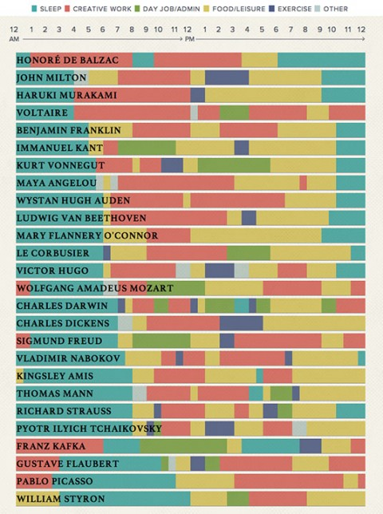

The Daily Routines of Famous Creative People, Presented in an Interactive Infographic

# The Daily Routines of Famous Creative People, Presented in an Interactive Infographic

in *Creativity* | January 13th, 2015 [3 Comments](http://www.openculture.com/2015/01/the-daily-routines-of-famous-creative-people-presented-in-an-interactive-infographic.html#comments)

Advertisement
[(L)](https://podio.com/site/creative-routines)

*Click the image above to access the interactive infographic.*

The daily life of great authors, artists and philosophers has long been the subject of fascination among those who look upon their work in awe. After all, life can often feel like, to quote Elbert Hubbard, “one damned thing after another” -- a constant muddle of obligations and responsibilities interspersed with moments of fleeting pleasure, wrapped in gnawing low-level existential panic. (Or, at least, it does to me.) Yet some people manage to transcend this perpetual barrage of office meetings, commuter traffic and the unholy allure of reality TV to create brilliant work. It’s easy to think that the key to their success is how they structure their day.

Mason Currey’s blog-turned-book [*Daily Rituals*](http://dailyroutines.typepad.com/daily_routines/) describes the workaday life of great minds from [W.H. Auden](http://www.poets.org/poetsorg/poet/w-h-auden) to [Immanuel Kant](http://www.friesian.com/kant.htm), from [Flannery O’Connor](http://www.georgiaencyclopedia.org/articles/arts-culture/flannery-oconnor-1925-1964) to [Franz Kafka](http://www.kafka.org/index.php?biography). The one thing that Currey’s project underlines is that there is no magic bullet. The daily routines are as varied as the people who follow them– though long walks, a ridiculously early wake up time and a stiff drink are common to many.

One school of thought for creating is summed up by [Gustave Flaubert](http://www.online-literature.com/gustave-flaubert/)’s maxim, “Be regular and orderly in your life, so that you may be violent and original in your work.” [Haruki Murakami](http://www.theparisreview.org/interviews/2/the-art-of-fiction-no-182-haruki-murakami) has a famously rigid routine that involves getting up at 4am and writing for nine hours straight, followed by a daily 10km run. “The repetition itself becomes the important thing; it’s a form of mesmerism. I mesmerize myself to reach a deeper state of mind. But to hold to such repetition for so long—six months to a year—requires a good amount of mental and physical strength. In that sense, writing a long novel is like survival training. Physical strength is as necessary as artistic sensitivity.” He admits that his schedule allows little room for a social life.

Then there’s the fantastically prolific Belgian author [George Simenon](http://en.wikipedia.org/wiki/Georges_Simenon), who somehow managed to crank out 425 books over the course of his career. He would go for weeks without writing, followed by short bursts of frenzied activity. He would also wear the same outfit everyday while working on his novel, regularly take tranquilizers and somehow find the time to have sex with up to four different women a day.

Most writers fall somewhere in between. [Toni Morrison](http://en.wikipedia.org/wiki/Toni_Morrison), for instance, has a routine that that seems far more relatable than the superman schedules of Murakami or Simeon. Since she juggled raising two children and a full time job as an editor at Random House, Morrison simply wrote when she could. “I am not able to write regularly,” she once told [*The Paris Review*](http://www.theparisreview.org/interviews/1888/the-art-of-fiction-no-134-toni-morrison). “I have never been able to do that—mostly because I have always had a nine-to-five job. I had to write either in between those hours, hurriedly, or spend a lot of weekend and predawn time.”

Above is a way cool infographic of the daily routines of 26 different creators, created by Podio.com. And if you want to see an interactive version of the same graphic but with rollover bits of trivia, [just click here](https://podio.com/site/creative-routines). You’ll learn that [Voltaire](http://en.wikipedia.org/wiki/Voltaire) slept only 4 hours a day and worked constantly. [Victor Hugo](http://en.wikipedia.org/wiki/Victor_Hugo) preferred to take a morning ice bath on his roof. And [Maya Angelou](http://mayaangelou.com/) preferred to work in an anonymous hotel room.

via [ThisisColossal](http://www.thisiscolossal.com/2015/01/the-daily-routines-of-famous-creative-people/)

**Related Content:**

[The Daily Habits of Highly Productive Philosophers: Nietzsche, Marx & Immanuel Kant](http://www.openculture.com/2013/10/the-daily-habits-of-highly-productive-philosophers.html)

[John Updike’s Advice to Young Writers: ‘Reserve an Hour a Day’](http://www.openculture.com/2013/07/john-updikes-advice-to-young-writers-reserve-an-hour-a-day.html)

[John Cleese’s Philosophy of Creativity: Creating Oases for Childlike Play](http://www.openculture.com/2013/09/john-cleeses-philosophy-of-creativity-creating-oases-for-childlike-play.html)

***Jonathan Crow** is a Los Angeles-based writer and filmmaker whose work has appeared in Yahoo!, The Hollywood Reporter, and other publications. You can follow him at [@jonccrow](http://twitter.com/jonccrow). And check out his blog [Veeptopus](http://www.jonathan-crow.com/), featuring lots of pictures of [badgers](https://www.etsy.com/shop/Veeptopus?section_id=16375115&ref=shopsection_leftnav_4) and even more pictures of [vice presidents ](http://www.jonathan-crow.com/)with octopuses on their heads.  The Veeptopus store is [here](https://www.etsy.com/shop/veeptopus).*