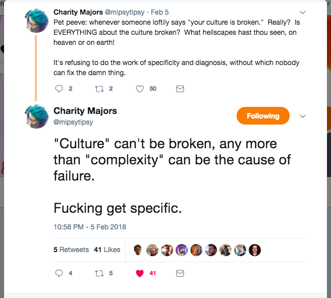
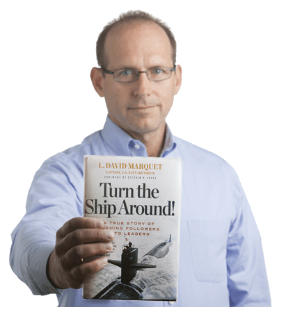
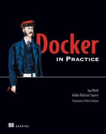

The First Non-Bullshit Book About Culture I’ve Read – zwischenzugs

# The First Non-Bullshit Book About Culture I’ve Read

[zwischenzugs](https://zwischenzugs.com/author/zwischenzugs/)[Uncategorized](https://zwischenzugs.com/category/uncategorized/)November 27, 20196 Minutes

I’ve always been frustrated that people often talk about culture without giving actionable or realistic advice, and was previously prompted by this tweet to write about [what I did](https://zwischenzugs.com/2018/02/24/5-things-i-did-to-change-a-teams-culture/) when put in charge of a broken team:

Then the other week I met a change management type at a dinner who’d previously worked in manufacturing, and I asked him to recommend me some books. One of them was [**Turn the Ship Around**](https://www.amazon.co.uk/Turn-Ship-Around-Building-Breaking/dp/0241250943) and it was exactly the book I wanted to read.

## The Story

The book tells the story of David Marquet, newly-elevated commander of the **[worst-performing nuclear submarine](https://en.wikipedia.org/wiki/USS_Santa_Fe_%28SSN-763%29)** in the US Navy. It was considered a basket case, and he was given it at the last moment, meaning his previous year’s meticulous preparation (for another ship) was for nought. He was under-prepared, and the odds were against him.

Report this ad

**Within a year he’d turned it round** to be the best-performing, with the staff going on to bigger and better things, and the ship sustaining its newly-acquired status.

Just the abstract blew my mind – it’s hard enough to turn around a group of IT types whose worst failure might be to lose some data. Never mind an *actual nuclear submarine*, where **as commander, you are *personally* responsible for anything that goes wrong**.

I was greatly intrigued as to how he did it, and the book did not disappoint.

## What Marquand Did

By his own account, what Marquand did was improvise. Faced with the constraints he had on delivering any improvement, given:

- The poor state of crew morale on arrival
- His relative lack of knowledge about the ship itself
- The lack of time available to show an improvement

Report this ad

he had little option but either to: fail to make a significant improvement and ‘get by’ with the traditional management techniques, or do something drastic.

As he explains, his drastic course of action was to **overthrow the principle of commander-control** the US navy had assumed to be the best form of management for generations. The US navy’s traditional approach had been to give the commander absolute authority and responsibility on a ship. This resulted in what Marquand calls a ‘leader-follower’ mentality, which in many ways is a great way to run things.

With good discipline (something the services excel at training for) and a highly trained leader, you can get good results, especially in a safety-critical environment. You can also get a demotivated, reactive, apathetic crew who develop a culture that focusses on ‘doing the minimum’. When the culture is broken, it’s hard to change this by simply shouting at the crew louder or doubling down on discipline.

#### Leader-Follower to Leader-Leader

Marquand sought to **replace the leader-follower culture with a leader-leader one**. Since Marquand didn’t even fully understand his own ship, he had to delegate authority and responsibility down the ship’s command structure.

This is brought home to him dramatically when he issues an order that was impossible to fulfil. He issues an order to a navigator to move the ship at a certain speed. He hears an ‘Aye, aye, sir!’, and then moments later wonders why his order doesn’t seem to have been followed. It turns out the ship he is on literally cannot move at that speed!

This impresses on him that he has to do two things:

- Abandon the pretence of his own omniscience
- Encourage his staff to feed back information to him

In other words, he has to ‘**give control**‘ to his crew **without endangering** the world in the process. The book discusses how he achieves this, and gives some retrospective structure to his actions that make it easier to apply his experience to different environments where culture needs to be changed.

## What Makes This Book So Different?

#### It’s Credible

Report this ad

Morquand talks not only about what he did, but his concerns about his actions as he carried them out. For example, he describes how when he made chiefs responsible for signing off leave (and removed several layers of bureaucracy in the process), he worried that they would misuse their new power, or just make mistakes he himself would not make.

In fact, these fears turned out to be unfounded, and by that action, he demonstrated that he wanted to make real change to the way the ship worked. This ceding of control had far more effect, he says, than any exhortation from above to more proactivity or responsibility from his underlings. He argues that such exhortations don’t work, as **people don’t take words anywhere near as seriously as actions** when making change.

Anyone who’s undergone any kind of corporate transformation effort when on the rank and file will know the difference between words and actions.

#### It’s Actionable

Far from offering vague advice, Marquand goes to the level of supplying specific sets of questions to put to your staff in meetings, and **useful advice** on how to implement the policies and encourage the behaviours you need in your team.

Early on in the process he uses a [CBT](https://www.nhs.uk/conditions/cognitive-behavioural-therapy-cbt/)-style technique of ‘act as though we are proud of the ship’ to kick-start the change he wants to see. Literally anyone in a leadership role looking to improve morale can implement something like that quickly.

#### It’s Honest

There’s very little sense of Marquand trying to sell a ‘perfect world’ story as he tells you what happened. In one vivid section, a normally dependable officer goes AWOL halfway through the year, and Marquand has to track him down. Marquand then takes the massive risk of letting the officer off, which further risks losing the respect of some of his subordinates, some of whom are hard-liners on discipline. None of this sounds like fun, or clear-cut.

Report this ad

In another section, he describes how an officer ‘just forgot’ about not flicking a switch even though there was a standard ‘red tag’ on it signalling that it shouldn’t be touched. Again, **rather than just punishing, he spent *8 hours* discussing with his team** how they can prevent a recurrence in a practical way.

After rejecting impractical solutions like ‘get sign off for every action from a superior’ their solution **reduced mistakes** like this massively. The solution was another implementable tactic: **‘deliberate action’**. Staff were required to call out what they are about to do, then pause before they do it, allowing others to intervene, while giving them literal pause for thought to correct their own mistakes.

#### It’s Well-Structured

The book ends up having a schema that is useful, and (mercifully) is not presented as a marketable framework, and which follows naturally from the story:

- He wants to give people control
- He can’t do that because: 1) they lack competence, and 2) they don’t know the broader context
- He gives control piece by piece, while working on 1) and 2) using various replicable techniques

Some of the techniques Marquand uses to achieve the competence and knowledge of context have been covered, but essentially **he’s in a constant state of training everyone** to be leaders rather than followers within their roles.

Some highlighted techniques:

- Encourage staff to ask for permission (‘I intend to […] because’) rather than wait for orders
- Don’t ‘brief’ people on upcoming tasks, ‘certify’ (give them their role, ask them to study, and test them on their competence)
- Creation of a creed (yes, a kind of ‘mission statement’, but one that’s in Q&A form and is also specific and actionable)
- Specify goals, not methods

Report this ad

All of this makes it very easy to apply these teachings to your own environment where needed.

## Caveats

Despite my enthusiasm, I was left with a few question marks in my mind about the story.

The first is that Marquand seems to have had great latitude to break the rules (indeed the subtitle of the book is ‘A True Story of Building Leaders by Breaking the Rules’). His superiors explicitly told him they were more focussed on outcomes than methods. This freedom isn’t necessarily available to everyone. Or maybe one of the points of the books is that **to lead effectively you have to be prepared to ‘go rogue’ to some extent** and take risks to effect real changes?

Another aspect I wondered about was that I suspected Marquand started from a point where he had **a workforce that were very strong in one particular direction: following orders**, and that it’s easier to turn such people around than a group of people who are not trained to follow orders so well. Or maybe it’s harder, who knows?

Also, the **ship was at rock bottom** in terms of morale and performance, and everyone on board knew it. So there was a crisis that needed to be tackled. This made making change easier, as his direct subordinates were prepared to make changes to achieve better things (and get promotion themselves).

**This makes me wonder whether a good way to make needed change as a leader when there is no obvious crisis is to artificially create one so that people get on board…**

* * *

***If you like this, you might like one of my books:
[Learn Bash the Hard Way](https://leanpub.com/learnbashthehardway?p=4369)***
***[Learn Git the Hard Way](https://leanpub.com/learngitthehardway?p=4369)***

***[Learn Terraform the Hard Way](https://leanpub.com/learnterraformthehardway)***

Report this ad

***[Get 39% off Docker in Practice with the code: 39miell2](https://www.manning.com/books/docker-in-practice-second-edition?a_aid=zwischenzugs&a_bid=550032fc)***

* * *

Advertisements

Report this ad
Advertisements

Bournemouth: New Laser Eye Treatment Is Actually Cheaper Than Contacts

Born before 1965? You’re Eligible For Revolutionary New Laser Eye Surgery

Report this ad

### Share this:

- [Email](https://zwischenzugs.com/2019/11/27/the-first-non-bullshit-book-about-culture-ive-read/?share=email&nb=1)

-

- [reddit](https://www.reddit.com/submit?url=https%3A%2F%2Fzwischenzugs.com%2F2019%2F11%2F27%2Fthe-first-non-bullshit-book-about-culture-ive-read%2F&title=The%20First%20Non-Bullshit%20Book%20About%20Culture%20I%27ve%20Read)

[Upvote](https://www.reddit.com/submit?url=https%3A%2F%2Fzwischenzugs.com%2F2019%2F11%2F27%2Fthe-first-non-bullshit-book-about-culture-ive-read%2F&title=The%20First%20Non-Bullshit%20Book%20About%20Culture%20I%27ve%20Read)[Downvote](https://www.reddit.com/submit?url=https%3A%2F%2Fzwischenzugs.com%2F2019%2F11%2F27%2Fthe-first-non-bullshit-book-about-culture-ive-read%2F&title=The%20First%20Non-Bullshit%20Book%20About%20Culture%20I%27ve%20Read)[(L)](https://www.reddit.com/submit?url=https%3A%2F%2Fzwischenzugs.com%2F2019%2F11%2F27%2Fthe-first-non-bullshit-book-about-culture-ive-read%2F&title=The%20First%20Non-Bullshit%20Book%20About%20Culture%20I%27ve%20Read)

- [**Tweet](https://twitter.com/intent/tweet?original_referer=https%3A%2F%2Fzwischenzugs.com%2F2019%2F11%2F27%2Fthe-first-non-bullshit-book-about-culture-ive-read%2F&ref_src=twsrc%5Etfw&related=wordpressdotcom&text=The%20First%20Non-Bullshit%20Book%20About%20Culture%20I%27ve%20Read&tw_p=tweetbutton&url=https%3A%2F%2Fzwischenzugs.com%2F2019%2F11%2F27%2Fthe-first-non-bullshit-book-about-culture-ive-read%2F&via=ianmiell)
- [ Post]()
- [*0*****  ****]()
- [(L)](https://www.facebook.com/sharer/sharer.php?kid_directed_site=0&sdk=joey&u=https%3A%2F%2Fzwischenzugs.com%2F2019%2F11%2F27%2Fthe-first-non-bullshit-book-about-culture-ive-read%2F&display=popup&ref=plugin&src=share_button)

-
.

[Like](https://widgets.wp.com/likes/index.html?ver=20190321#)
Be the first to like this.

### *Related*

[Things I Learned Managing Site Reliability for Some of the World's Busiest Gambling Sites](https://zwischenzugs.com/2017/04/04/things-i-learned-managing-site-reliability-for-some-of-the-worlds-busiest-gambling-sites/)With 21 comments

[Five Things I Did to Change a Team's Culture](https://zwischenzugs.com/2018/02/24/5-things-i-did-to-change-a-teams-culture/)With 13 comments

[My 20-Year Experience of Software Development Methodologies](https://zwischenzugs.com/2017/10/15/my-20-year-experience-of-software-development-methodologies/)With 59 comments

## Published by zwischenzugs

[View all posts by zwischenzugs](https://zwischenzugs.com/author/zwischenzugs/)

**Published**November 27, 2019