The Harry Potter guide to Edinburgh

# 'Harry Potter' guide to Edinburgh -- follow in J.K. Rowling's footsteps

Francesca Street, CNN • Updated 23rd June 2017
FacebookTwitterEmail

(CNN) — Ready to feel old? This month, Harry Potter turns 20. That's right, it's been two decades since J.K. Rowling's wildly successful series about the boy wizard first hit our shelves.

The anniversary is being marked with [new editions of the novels](http://www.harrypotter.bloomsbury.com/uk/harrypotter20/), as well as a large-scale [British Library exhibition](https://www.bl.uk/harry-potter/articles/harry-potter-exhibition-at-the-british-library-announcement), opening October 20. But perhaps the best way to mark this occasion is to take a trip to where it all began: Edinburgh, Scotland.

The beautiful Scottish capital is the adopted home of Rowling, who has lived there since the early 1990s.

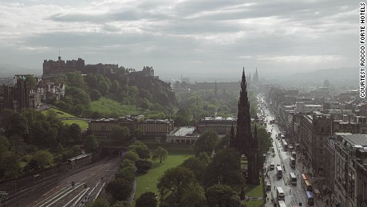

The best spot for a Harry Potter pilgrimage? Edinburgh.

It was in Edinburgh's cafes that Rowling first began writing about Harry Potter. She drew inspiration from the stunning city from its Gothic architecture to its graveyards.

Here's how to follow in Rowling's footsteps across Edinburgh:

### 1. Enjoy breakfast at The Elephant House Cafe

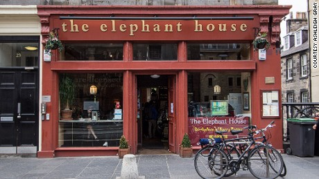

First stop: The Elephant House, the birthplace of Harry Potter.

[The Elephant House](http://www.elephanthouse.biz/index.html) is the self-proclaimed "birthplace of Harry Potter."

Edinburgh's a city of multiple levels and bridges and The Elephant House is situated on one of the capital's central walkways: George IV Bridge. (*The Elephant House, 21 George IV Bridge Edinburgh; +44 131 220 5355)*

Back in the 1990s when Rowling first put pen to paper, she was struggling to make ends meet. Legend has it she would frequent Edinburgh's cafes for their free heating and cozy atmosphere.

Many of the city's cafes claim to have hosted Rowling, but The Elephant House has proof: There's a (surprisingly low-key) wall inside with photos of Rowling writing and quotes from the author herself.

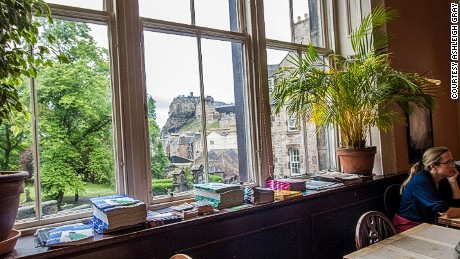

Grab the window seat at The Elephant House for maximum writing inspiration.

These were clearly posed for post-Potter fame, but if you step inside this snug cafe and you're lucky enough to grab a window seat with a view of [Edinburgh Castle](https://www.edinburghcastle.gov.uk/), it's easy to see why Rowling was inspired.

This elephant-themed cafe has since become a mecca for writers, poets and dreamers -- all keen to follow in the footsteps of Rowling. It's also a tourist hotspot: Edinburgh locals can't walk past the cafe without visitors taking selfies.

Fortunately the food's tasty too: A day of sightseeing/writing can be fueled with the hearty Elephant House Breakfast, with added Scottish haggis for an extra £1 (approximately $1.30).

The Elephant House's bathrooms are covered in Potter-themed graffiti.

A visit isn't complete without a trip to the restrooms. The white walls are covered in Harry Potter-themed graffiti -- everything from raunchy HP jokes to heartfelt odes to Rowling. The cafe used to crack down on these scribblings, but it's now [accepted it can't be stopped.](http://www.edinburghnews.scotsman.com/our-region/edinburgh/city-centre/jk-rowling-cafe-elephant-house-concedes-graffiti-defeat-1-4094723)

George IV Bridge is also home to the [National Library of Scotland](https://www.nls.uk/) and the[Edinburgh Central Library](https://www.edinburgh.gov.uk/directory_record/5079/central_library), making it a perfect spot for anyone looking to expand their literary horizons beyond Harry Potter.

### 2. Admire the spires of George Heriot's School

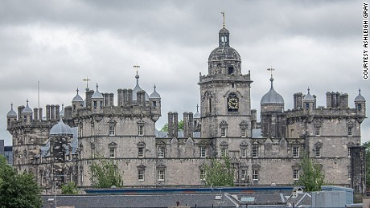

The Hogwarts-esque George Heriot's School.

The most important setting in the world of Harry Potter is, of course, Hogwarts School of Witchcraft and Wizardry. Once Harry gets his acceptance letter by owl in the first book, Hogwarts becomes the backdrop to the majority of the series' action.

Most modern British schools are nothing like Hogwarts -- but Edinburgh is home to several castle-like institutions that may have inspired Rowling, including [Stuart's Melville College](https://www.esms.org.uk/the-schools/stewarts-melville-college)and the David Bryce-designed [Fettes College](https://fettes.com/) (the alma mater of fictional hero James Bond).

[READ: Scotland's 10 best castles](http://travel/article/scottish-castles-for-tartan-day/index.html)

But it's [George Heriot's School](http://www.george-heriots.com/), in the city center, that's generally accepted as the chief inspiration for Hogwarts. The school is just around the corner from the The Elephant House and looks straight out of a fairy-tale.

Established in 1628, George Heriot's was founded as a school for "puire fatherless bairnes" -- in other words, fatherless babies and orphans.

Just like Harry Potter.

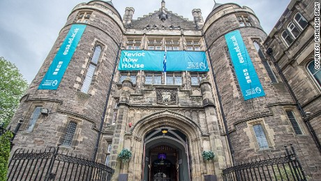

The University of Edinburgh's Teviot Row House has a distinctly Hogwarts vibe.

George Heriot's is a working school, so it's not open for tours. But its turrets can be glimpsed from the road and occasionally the institution hosts events for Edinburgh's famous summer[festivals](http://www.edinburghfestivalcity.com/). (*George Heriot's School, Lauriston Place, Edinburgh EH3 9EQ)*

The University of Edinburgh's [Teviot Row House](https://www.eusa.ed.ac.uk/our_venues/teviot/), the oldest purpose-built student union in the world, also has a Hogwarts vibe. However it's one of the university's other student union buildings,[Potterow,](https://www.eusa.ed.ac.uk/our_venues/potterrow/) that (by coincidence) has the appropriately on-theme name. (*Teviot Row House -- called the Gilded Balloon during the Edinburgh Fringe Festival -- 13 Bristo Square, Edinburgh EH8 9AJ)*

### 3. Hunt for Voldemort at Greyfriars Kirkyard

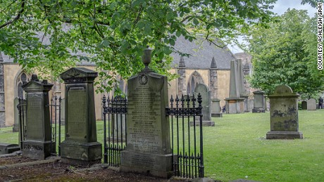

The atmospheric Greyfriars Kirkyard.

Few fans can forget the chilling moment in "Harry Potter and the Chamber of Secrets" when (spoiler alert!) the ghost of Tom Marvolo Riddle reveals his name to be an anagram of his adopted identity: Lord Voldemort.

Wondering where Rowling got the name from? The answer may lie in [Greyfriars Kirkyard](http://www.greyfriarskirk.com/news/harry-potter-fans-visit-greyfriars).

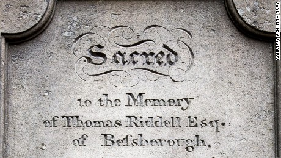

The gravestone commemorating Thomas Riddell, the namesake of Rowling's Voldemort.

This atmospheric graveyard is home to a tombstone marking the demise of Thomas Riddell, an Edinburgh gentleman who shares his name with the most notorious wizard in history. (*Greyfriars Kirkyard, Candlemaker Row, Edinburgh; +44 131 225 1900)*

Coincidence? Probably not.

The graveyard is also the resting place of [William McGonagall](http://www.mcgonagall-online.org.uk/), a famously bad poet who may have inspired the name of fan favorite character Professor McGonagall.

### 4. Stop for a coffee at Spoon

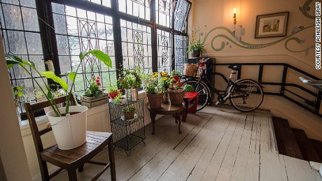

Spoon is a great airy space for a spot of writing.
A wander through the eerie kirkyard is enough to earn a coffee and cake break.

[Spoon](https://spoonedinburgh.co.uk/), a one-story-up restaurant/cafe in Edinburgh, is renowned for its healthy food and afternoon tea.

Back in the 1990s, the building played host to a different eatery, Nicolson's Cafe, another spot where Rowling is said to have spent hours penning Harry's adventures.

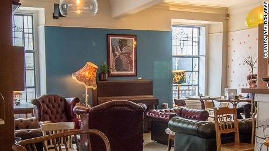

Rowling used to frequent Spoon in the 1990s.

"Writing and cafes are strongly linked in my brain," Rowling told [The Telegraph](http://www.telegraph.co.uk/culture/books/3666215/From-the-dole-to-Hollywood.html) in 1997. "I still write in longhand; I like physically shuffling around with papers; and you don't have to break off and go in the kitchen to make coffee."

When Nicolson's closed down, the building became a Chinese buffet, before returning to its cafe roots when Spoon set up shop in 2009. (*6a Nicolson Street Edinburgh; +44 131 623 1752)*

Now, the cafe has an attractive interior -- large and airy, thanks to its big windows and wide tables. It's the perfect spot to put pen to paper, watching the hustle and bustle of Nicolson Street down below.

### 5. Shop on Diagon Alley/Victoria Street

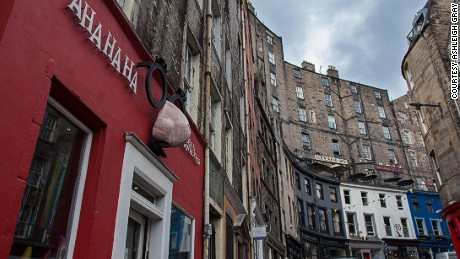

The curving Victoria Street with its colorful shops is said to be the inspiration for Diagon Alley.

The architecture of Edinburgh is a stunning juxtaposition of narrow medieval buildings, Victorian turrets, Gothic spires and Georgian grandeur.

Every turn presents an impressive new view, but Victoria Street is one of the city's most photographed spots for a reason.

This dual-level, curved street is home to many independent shops with colorful facades.

The perfect place to pick up souvenirs, it's a winsome highlight of Edinburgh's Old Town.

Shops such as novelty joke shop [Aha Ha Ha Jokes](http://hijinks.me/) (*Aha Ha Ha Jokes, 99 West Bow, Edinburgh) *and rare second-hand book store [The Old Town Bookshop](http://www.oldtownbookshop-edinburgh.co.uk/) wouldn't look out of place on Diagon Alley, the fictional thoroughfare where wizards purchase magical accoutrements.

At sunrise, the street looks truly magical.

In fact, the entirety of this quirky street looks straight out of the Potter universe.

Unsurprisingly, Victoria Street and its surrounding area are said to have inspired Rowling's cobbled alley.

In fact adjacent Candlemaker Row has a plaque commemorating this Potter link.

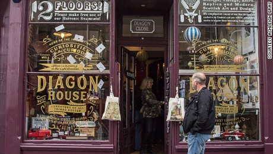

There are even Potter-themed shops on Victoria Street.

Victoria Street also has a darker side. The street was the 17th-century site of Major Thomas Weir's house, an Edinburgh man known as the Wizard of the West Bow.

Weir was executed for witchcraft in 1670 and is sometimes cited as the inspiration for Robert Louis Stevenson's "Dr Jekyll and Mr Hyde."

Victoria Street leads to the Grassmarket area of Edinburgh -- now the bustling home of much of the city's nightlife but once the location for executions. (*Victoria Street, Edinburgh, EH1 2JW)*

The name of local pub [The Last Drop](http://www.nicholsonspubs.co.uk/restaurants/scotlandandnorthernireland/thelastdropgrassmarketedinburgh) (*The Last Drop, 74-78 Grassmarket, Edinburgh EH1 2JR) *refers not to ale but to blood. It was at this site that the last hanging took place.

### 6. Spend a night in the Balmoral Hotel

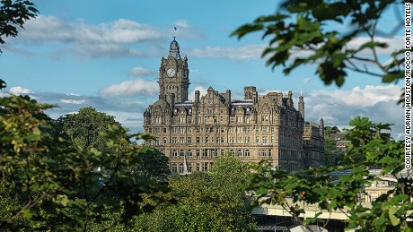

The celebrated Edinburgh hotel where J. K. Rowling penned the final chapters of "Harry Potter and the Deathly Hallows."

By the time Rowling concluded her Potter series with 2007's "Harry Potter and the Deathly Hallows," she was a far cry from the fledgling author writing in corners of coffee shops.

Rowling is private about her fortune, but a[recent estimate by The New York Times](https://www.nytimes.com/2016/11/24/business/in-the-chamber-of-secrets-jk-rowlings-net-worth.html?partner=rss&emc=rss&smid=tw-nytimes&smtyp=cur&_r=1) suggested that the author could now be a billionaire.

Whilst Rowling was completing her final Potter novel, she sought refuge in Edinburgh landmark [The Balmoral Hotel](https://www.roccofortehotels.com/hotels-and-resorts/the-balmoral-hotel/), room 552 to be exact, now renamed [The Rowling Suite.](https://www.roccofortehotels.com/hotels-and-resorts/the-balmoral-hotel/rooms-and-suites/grand-suite/)

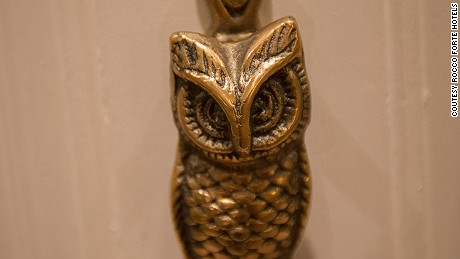

The door knocker for the JK Rowling Suite is a brass owl in Rowling's honor.

The Balmoral Hotel is a familiar site from Edinburgh postcards, its iconic clock tower (famously set two minutes fast -- to ensure travelers at neighboring Waverley Station don't miss their trains) has been a staple of the city skyline since 1902. (*The Balmoral Hotel, 1 Princes Street, Edinburgh EH2 2EQ)*

The Rowling Suite contains the writing desk on which Rowling wrote the book and a marble bust of Hermes, the Greek god of travel, signed by the author.

A night in the hotel costs in excess of £1,000 ($1,290.93).

### 7. Find Rowling's hand prints on the Royal Mile

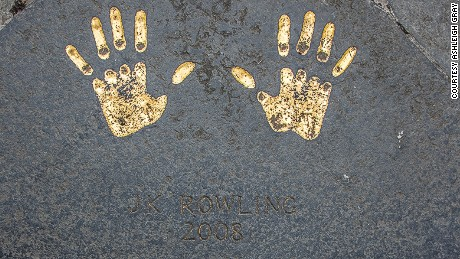

Don't miss J. K. Rowling's handprints on the Royal Mile.

In 2008, the City of Edinburgh awarded Rowling[The Edinburgh Award](http://www.edinburgh.gov.uk/info/20008/events_and_venues/652/public_honours/3): an annual award given to individuals who have made a positive impact on the city.

The handprints of each winner are reproduced outside the[City Chambers](http://www.edinburgh.gov.uk/info/20195/venues/158/city_chambers_-_conference_and_event_facilities) building.

Rowling is in good company: the 2007 winner was fellow Edinburgh author Ian Rankin, and the 2009 award went to Olympian Chris Hoy.

"I think it is particularly appropriate for a writer's hands to be represented, so I am deeply honored to have my keyboard-chipped fingernails, not to mention my pen-induced friction callous, commemorated in the place where I produced Harry Potter," said Rowling of the accolade.

Edinburgh's City Chambers is no ordinary council building: designed by John Adam, it is an historic landmark completed in 1761. (*Edinburgh City Chambers, 253 High Street, Edinburgh EH1 1YJ)*

### 8. Catch the Hogwarts Express to the Highlands

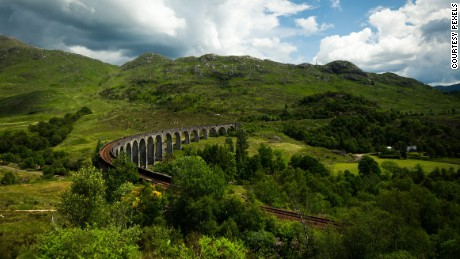
Recognize this iconic viaduct from "Harry Potter and the Chamber of Secrets"?

Rowling may have been inspired by Edinburgh's cityscape when she was inventing her magical world, but Hogwarts is located in a remote, secret location -- not a busy capital city.

When the Harry Potter books were adapted for film in 2001 the producers chose to shoot many of the exterior shots in the spectacular Scottish Highlands.

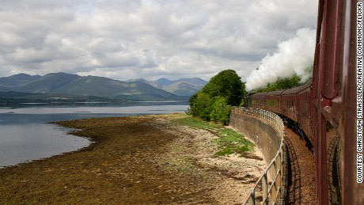

The Jacobite Steam Train offers stunning views of the Scottish countryside.

When Harry gets on the Hogwarts Express at [Platform 9 and 3/4](https://www.harrypotterplatform934.com/pages/about-platform-934) at London King's Cross, he heads northwards on the Hogwarts Express steam train.

Fans wanting to follow in Harry's footsteps can board the [Jacobite Steam Train](http://www.westcoastrailways.co.uk/jacobite/jacobite-steam-train-details.cfm) in Fort William, Scotland. It might not begin in London, but its tour of the west of Scotland will be familiar to all Potterheads.

The company running the Jacobite service provided Warner Brothers with the Hogwarts Express train in all eight of the films.

The company also allowed the filmmakers to use the route for filming.

When the movies depict the Hogwarts Express steaming across an elevated bridge, surrounded by misty, rugged Scottish scenery, that's the [Glenfinnan Viaduct](https://www.visitscotland.com/info/towns-villages/glenfinnan-p236571), a large concrete structure built in the 1890s.

The bridge is memorably used in the movie adaptation of "Harry Potter and the Chamber of Secrets": Harry and Ron fly over the viaduct in Ron's magical car, attempting to catch up with the train below.

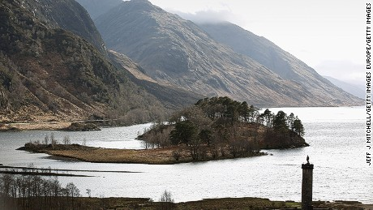

The Glenfinnan Monument with Loch Shiel behind -- Loch Shiel stood in for the Black Lake in the Harry Potter movies.

Those who who don't want to ride the train can still get a stunning view from the hills surrounding nearby Loch Shiel and the [Glenfinnan Visitor Centre](https://www.visitscotland.com/info/see-do/glenfinnan-monument-visitor-centre-p246521). (*Glenfinnan Visitor Centre, Glenfinnan Highlands PH37 4LT) *Loch Shiel is the stand in for the Black Lake in the Potter series.

This area has another significance: the loch is the site of the [Glenfinnan Monument,](http://www.nts.org.uk/Visit/Glenfinnan-Monument) a 60-foot memorial to the 1745 Jacobite rising, when Bonnie Prince Charlie tried to regain the British throne.

Other Harry Potter Highlands filming locations include the remarkable landscape around Glen Coe and the picturesque Loch Etive.

*(The Jacobite Steam Train begins its journey at Fort William Station, Tom-na-Faire Station Square, Fort William Highland PH33 6EN)*

[MORE: Has Scotland created the greatest road trip ever?](http://edition.cnn.com/2016/06/13/travel/scotland-north-coast-road-trip-nc500/index.html?sr=cnnitw)