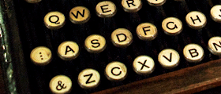
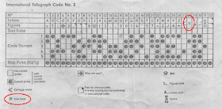
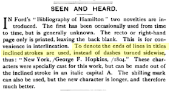
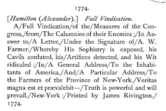

The Lost Key of QWERTY

### The Lost Key of QWERTY

So I was on twitter last month when [Marcin Wichary asked](https://twitter.com/mwichary/status/689157311353368576) “Any ideas on what this key/glyph was for in the early Sholes Glidden typewriter?”

This image is from a U.S. patent, applied for before the typewriter went to market, but it was definitely there on the first models.

|     |
| --- |
|  |
| Cropped from an [image of the first typewriter model](http://media.jrn.com/images/typewriter-sholes.jpg). |

And as he pointed out in his tweet, the key produced a typed character that matched the key:

We also know because Mark Twain's daughter was kind enough to type it for us, in some gibberish at the head of a [letter he typed for his brother](http://www.lettersofnote.com/2015/10/new-fangled-writing-machine.html), and leave us with another sample:

These samples eliminate some suggestions that the key served some mechanical purpose, like advancing the paper, or as a shift key (which the first model lacked, as it could only type capitals).

The Sholes and Glidden typewriter (sometimes called the Remington No. 1) was the first successful typewriter ever brought to market (in 1873), and the forerunner of most other successful typewriters.  The unidentified key was, as far as I can tell, on this model and only this model.  It was gone on the Remington No. 2 introduced in 1878, never to appear again (in this form), and as far as I know never found on competitors either.

So what the heck is it?  One option is to work the problem from the modern end, and see what's in Unicode.  We find four characters that look like this:

- ⁝ - U+205D tricolon
- ⋮ - U+22EE vertical ellipsis
- ⫶ - U+2AF6 triple colon operator
- ︙- U+FE19 presentation form for vertical horizontal ellipsis

Some of these are a bit hard to parse.  The vertical ellipsis makes perfect sense, as it is used to show several rows of ommitted information.  But there's nothing in 19th century typography about vertical ellipses, and I haven't even found them in use yet.  Besides, with such a limited keyboard, lacking so many basic characters, why provide this when the colon could serve a similar purpose?  Even if this existed back then, I don't think this was the purpose on this keyboard.  “Tricolon” appears in 19th century sources as a name for one type of verse structure found in the bible, so that isn't so helpful.  “Triple colon operator” unsurprisingly turns up many pages of medical sources, but I found nothing about symbols, characters, etc.

So really Unicode was no help to me.

Next, Marcin Wichary found this character in [*On the Prehistory of QWERTY*](http://repository.kulib.kyoto-u.ac.jp/dspace/bitstream/2433/139379/1/42_161.pdf).

This is a paper I know well, and have many problems with.  It promotes a new theory that the QWERTY keyboard layout is based on preventing transcription errors by telegraph operators receiving messages.  Given that I've pretty much [proven that typebar jams were the primary design goal of QWERTY](http://widespacer.blogspot.com/2015/11/the-hidden-secrets-of-qwerty.html), we already have problems.  I've promised to write a more thorough debunking of their claims, but it's still on my to-do list.

At any rate, this new claim links to that idea.  The idea here is that telegraph operators needed a way to transcribe the telegraph code for “new paragraph”.  I have confirmed that this telegraph code does predate the typewriter, [dating back at least to 1854](https://books.google.com/books?id=jUBTAAAAcAAJ&dq=telegraph%20code%20paragraph%20italics&pg=PA416#v=onepage&q=new%20paragraph&f=false), but there's still a big problem with this notion.  Our mystery symbol was clearly intended to be typed, however the person transcribing incoming telegrams could just make a new paragraph on receipt of that code, rather than typing a special character.  There appears to be no reason to ever put the symbol on paper.  It's also problematic because it is an incredibly usage-specific character, on a machine that didn't even include parentheses.

I did find a vaguely similar usage of a vaguely similar symbol, in the International Telegraph Code No. 2, which was approved by the CCITT back in 1932.  Many sources use a particular symbol for the line feed character, which looks somewhat like our mysterious three dots, as seen in [this document](https://archive.org/stream/Communication-BaudotCode#page/n1/mode/2up):

But again we have the same problem - there's no reason to ever use this symbol in print, outside of ITA2 documentation.  And we already know the key does not produce a line feed.

A few days ago, the Shady Characters blog [picked up this story](http://www.shadycharacters.co.uk/2016/02/typewriters-and-pilcrows/) and ran with the paragraph separator idea that I tend to discredit.  This was followed by a great discussion in the comments section of all sorts of different ideas on the origin, but perhaps the most interesting tidbit came in when a typewriter expert mentioned that his Remington No. 1 produced a slash “/” when this key was typed, rather than three vertical periods.  He referred to it as a “virgule”, which left me a bit confused, as I have Google Books permanently locked in to the 19th century, and the meaning of virgule during that time was just the french word for comma.

So virgule was a dead end, but then Keith Houston who runs Shady Characters (and published a book by the same name), added that it's also called a “solidus”, which lead me to find out that it was even more commonly called a “shilling mark”, and was used in currency, where you'd write “5/” for something that cost 5 shillings, and 5/8 for five shillings and 8 pence (although if something was 3 pounds, 5 shillings, and 8 pence, you wouldn't use / in that case you'd write “£3 5s 8d”, or “£3,,5,,8” or a few other choices).  This was interesting, but it hardly explained why typewriter inventor Christopher Latham Sholes and his cohorts would put a shilling mark on a keyboard that doesn't even have a dollar sign (although you can make a dollar sign by combining S and I).  British currency did last a long time into the 19th century in the United States, but it was certainly not the dominant currency by the time Sholes designed the typewriter.

Moreover, three dots are not a shilling mark, so clearly this was not its initial intent.  But the original three dot pattern did seem to have some kind of relationship with the shilling mark, so I kept digging.

Then I found something really interesting:

|     |
| --- |
|  |
| [*The American Bookmaker*, September 1887](https://books.google.com/books?id=SH_nAAAAMAAJ&dq=shilling%20mark%20stroke&pg=PA93#v=onepage&q&f=false) |

So while I'm maintaining that a character for the end of the line or paragraph is never used, here's a source saying you need a character for that.  The context for this is the formatting of bibliographies.  In the 19th century books tended to have ridiculously long titles, and bibliographies tended to list the entire contents of the title page.  To do this, multiple lines were joined together, usually (according to this source) with “sidewise” dashes, but in this case also with slashes.  (There's also an implicit reference to letter-cutting, the practice of carving down sorts of various letters to create your own symbols.)

The text above is describing a book called *[Bibliotecha Hamiltonia](https://books.google.com/books?id=VTNCAAAAIAAJ&dq=Bibliotheca%20Hamiltoniana%20ford&pg=PA6-IA1#v=onepage&q&f=false),* published in 1886:

The slash is being used as a representation for line separators.  I've seen similar usage for condensing a few lines of a poem into a single line.  So here in 1886, we have slash meaning the same thing that three vertical dashes meant 45 years later in the 1930s.  Well, kind of coincidental, but not that exciting.  But there was also this note that the “inclined strokes” were used in place of the more common “dashes turned sidewise”.  Like a vertical bar, maybe?  And so, I was able to find in fairly short order, a vertical bar used like the slashes used in the above bibliography.

|     |
| --- |
|  |
| *[A Century of Printing / The Issues of the Press in Pennsylvania 1685-1784](https://books.google.com/books?id=UcQ3AQAAMAAJ&dq=printing%20dashed%20lines%20poetry&pg=PA370#v=onepage&q&f=false)*, 1886 |

But in another entry in the same book, I found something else:

There it is.

This is the same three dot symbol used by Sholes on his typewriter, in a context where it is used identically to a slash, also used on the same typewriter by the same key.  In this case, the three dots (which they call here “dotted lines”) are used to show an alternate set of line breaks.  This seems to be a less common usage than the vertical line for this purpose.

This leads me to the following working theory.  Sholes, or one of his testers, wanted a vertical bar character on the typewriter for situations like this one, with a bibliography.  It could be useful for borders and other things too.  But the typography of that first typewriter was stone simple.  It was a sans serif font, and the letter “I” was already a vertical bar.  Given that Sholes doubled up “1” and “I”, there's no point in adding a relatively obscure symbol that was identical.  To be useful it would have to look different than an “I”.  So Sholes simply used an existing alternate form.  Later, when it turned out to be less useful, it was changed to a slash which carried the same function, but could also be used to write fractions, and the percent sign, and to double up with “c” to make “¢”, as well as a number of abbreviations common in that era that used a slash.

It's not a perfect theory.  I have no smoking gun, and I still find some issues with this theory.  But right now, its the best thing we've got that (now) has actual evidence behind it.

The biggest problem is that this is still a relatively obscure usage.  Yes, Sholes was a trained compositor, and would likely have been familiar with all of these symbols, but you'd think he'd also realize these are relatively obscure symbols.  The first keyboard had no at sign, number sign, no parenthesis or brackets, no equal sign, no asterisk, no percent.  This usage doesn't seem to justify this key.  Perhaps there are other usages for the same group of symbols?

One of the big contributors to the development of the typewriter was James O. Clephane, a court reporter who became their best product tester and critic.  His testing lead to a rapid series of changes in design to make the machine more reliable and easier to use.  Perhaps this was a common and essential symbol used in court reporting?  I've searched a bit but come up empty, but it's definitely worth pursuing further.

Still this is all very intriguing.  Is that 1930s document related to this?  It seems to carry the exact same meaning.  And it's only 55 years later, still within the memory of some.   If I'm on the right track, this mysterious key could have lead to the inclusion of slash on the keyboard and in ASCII, and as well as both the vertical bar, and the broken vertical bar (which was [created for ASCII in the 1960s to avoid confusion with the mathematical “or” operator](http://www.trafficways.org/ascii/ascii.pdf)).

There's even a tie-in with the pound sign.  In part two of my examination of that character, [*Britain on Hash*](http://widespacer.blogspot.com/2015/10/britain-on-hash.html), one of the possible-but-unlikely origins of the name hash for the pound sign was a practice of using slashes and dashes in a new piece of computer technology called KWIC indexing, where the separator usage of slashes and dashes seems very much related to this old usage.

The “lost” key might not be lost at all, just changed over time.

Of course we have to be realistic.  This is all just guesswork — the ramblings of a madman.  The only thing we can really say for sure, which is still a step forward, is that a symbol just like the original three dot typewriter symbol was used to indicate line separations in typography, and that this symbol was replaced on the keyboard with a slash, which was also used in typography for the same purpose.

The truth may still be out there.  There is supposedly an original catalogue that came out with the first Remington typewriter, a multipage pamphlet called *The Type-Writer: A Machine to Supercede the Pen*, which may well describe this key and its purpose.  So far all I've been able to find are simple single-page ads with that text.

### Update: November 2019

In April of this year additional information came to light from [Eric Fischer in a Twitter thread](https://twitter.com/enf/status/1115317624928231430)(started by Mr. Wichary) suggesting that the symbol was a substitute for parenthesis and braces.  The source provided is from 1887, by which time I would have thought the key had already been replace.  Wichary says he found another source that backs this up, but also suggest that the tricolon could be used as a combining character with S to make a dollar sign—though he rightly questions why you wouldn't just combine with the "I" as was common known practice, and which was even mentioned in his source.

I had found an early hint that this key was in fact meant to be used a both left and right parenthesis, and even though [I tweeted about it at the time](https://twitter.com/WideSpacer/status/873759895874621440), didn't think it was likely enough to merit a mention in this article.  Yet another lesson that you should always include everything.

[Thomas A. Fine](https://www.blogger.com/profile/15734341507092908270)at[7:12 PM](http://widespacer.blogspot.com/2016/03/the-lost-key-of-qwerty.html?m=1)

[Share](#)