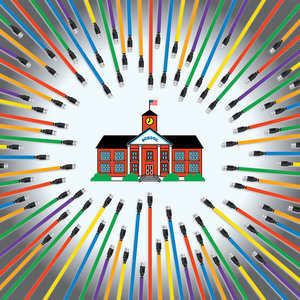
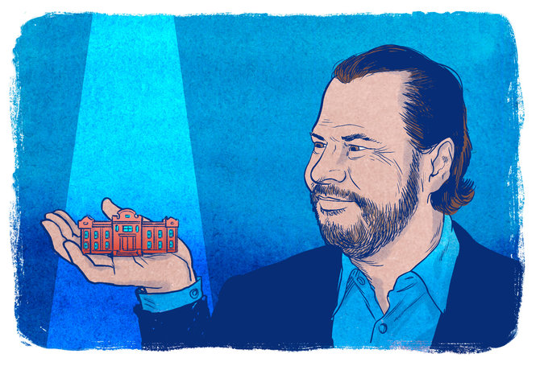
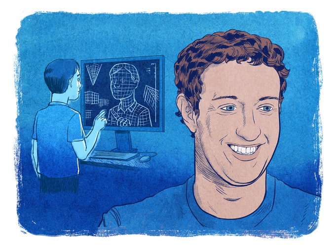

The Silicon Valley Billionaires Remaking America’s Schools

The involvement by some of the wealthiest and most influential titans of the 21st century amounts to a singular experiment in education, with millions of students serving as de facto beta testers for their ideas. Some tech leaders believe that applying an engineering mind-set can improve just about any system, and that their business acumen qualifies them to rethink American education.

“They are experimenting collectively and individually in what kinds of models can produce better results,” said Emmett D. Carson, chief executive of [Silicon Valley Community Foundation](https://www.siliconvalleycf.org/), which manages donor funds for [Mr. Hastings](http://philanthropynewsdigest.org/news/reed-hastings-creates-100-million-education-fund), Mr. Zuckerberg and others. “Given the changes in innovation that are underway with artificial intelligence and automation, we need to try everything we can to find which pathways work.”

But the philanthropic efforts are taking hold so rapidly that there has been little public scrutiny.

 

###### Education Disrupted

A series examining how Silicon Valley is gaining influence in public schools.
-

###### Read Part 1

[## How Google Took Over the ClassroomMay 13](https://www.nytimes.com/2017/05/13/technology/google-education-chromebooks-schools.html)

Tech companies and their founders have been rolling out programs in America’s public schools with relatively few checks and balances, The New York Times found in interviews with more than 100 company executives, government officials, school administrators, researchers, teachers, parents and students.

“They have the power to change policy, but no corresponding check on that power,” said [Megan Tompkins-Stange](http://fordschool.umich.edu/news/2016/megan-tompkins-stange-addresses-influence-private-foundations-education-policy), an assistant professor of public policy at the University of Michigan. “It does subvert the democratic process.”

Furthermore, there is only limited research into whether the tech giants’ programs have actually improved students’ educational results.

One of the broadest philanthropic initiatives directly benefits the tech industry.

Code.org, a major nonprofit group [financed with more than $60 million from Silicon Valley luminaries and their companies](https://code.org/about/donors), has the stated goal of getting every public school in the United States to teach computer science. Its argument is twofold: Students would benefit from these classes, and companies need more programmers.

Together with Microsoft and other partners, Code.org has barnstormed the country, pushing states to change education laws and fund computer science courses. It has also helped more than 120 districts to introduce such curriculums, the group said, and has facilitated training workshops for more than 57,000 teachers. And Code.org’s free coding programs, [called Hour of Code](https://hourofcode.com/files/hoc-one-pager.pdf), have become wildly popular, drawing more than 100 million students worldwide.

Mr. Hastings of Netflix and other tech executives rejected the idea that they wielded significant influence in education. The mere fact that classroom internet access has improved, Mr. Hastings said, has had a much greater impact in schools than anything tech philanthropists have done.

“In our society as a democracy, I think it is healthy that there is a debate about what are the goals of public education,” Mr. Hastings added.

Captains of American industry have long used their private wealth to remake public education, with lasting and not always beneficial results.

What is different today is that some technology giants have begun pitching their ideas directly to students, teachers and parents — using social media to rally people behind their ideas. Some companies also cultivate teachers to spread the word about their products.

Such strategies help companies and philanthropists alike influence public schools far more quickly than in the past, by creating legions of supporters who can sway legislators and education officials.

Another difference: Some tech moguls are taking a hands-on role in nearly every step of the education supply chain by financing campaigns to alter policy, building learning apps to advance their aims and subsidizing teacher training. This end-to-end influence represents an “almost monopolistic approach to education reform,” said [Larry Cuban, an emeritus professor](https://larrycuban.wordpress.com/) of education at Stanford University. “That is starkly different to earlier generations of philanthropists.”

These efforts coincide with a larger Silicon Valley push to sell computers and software to American schools, a lucrative market projected to reach $21 billion by 2020. Already, [more than half](https://www.nytimes.com/2017/05/13/technology/google-education-chromebooks-schools.html) of the primary- and secondary-school students in the United States use Google services like Gmail in school.

But many parents and educators said in interviews that they were unaware of the Silicon Valley personalities and money influencing their schools. Among them was [Rafranz Davis, executive director](http://rafranzdavis.com/about/) of professional and digital learning at Lufkin Independent School District, a public school system in Lufkin, Tex., where students regularly use DreamBox Learning, the math program that Mr. Hastings subsidized, and have tried Code.org’s coding lessons.

“We should be asking a lot more questions about who is behind the curtain,” Ms. Davis said.

#### ‘Think Bigger!’

 Photo
 
**

 Marc Benioff, chief executive of Salesforce.

Mr. Benioff, the billionaire behind Salesforce, had a blunt message for San Francisco’s mayor and its schools superintendent.

It was 2013, and the two city officials had approached Mr. Benioff hoping to persuade him to pony up a few million dollars to install Wi-Fi in schools and buy some classroom laptops. But the request seemed too penny-ante to the software mogul.

“That’s when I had to say, ‘You guys need to think bigger!’” Mr. Benioff recalled in an interview in his San Francisco home. He urged the superintendent to imagine “what nirvana would look like” in his schools, if money were no object.

With that conversation, Mr. Benioff set in motion a transformation of the relationship between philanthropist and public education. He has emerged as a kind of personal venture capitalist to the city’s public schools — one intent on remaking a traditional school bureaucracy in Silicon Valley’s entrepreneurial image.

Mr. Benioff ultimately pledged $100 million over a decade to the San Francisco Unified School District through his company’s nonprofit arm, [Salesforce.org](http://salesforce.org/). Unlike conventional benefactors, he is hands-on: School district administrators now submit an annual grant wish list to the Salesforce.org board for review. And Mr. Benioff dispenses not just money, but also management prescriptions.

“He’s almost a public-sector V.C.,” said Richard A. Carranza, who was then the superintendent of San Francisco schools.

Mr. Benioff rejected the notion that his approach to education philanthropy was venture-capitalist-like. “We are not giving them a new religion,” Mr. Benioff said. “We are trying to work with them in a smart way and augment what they are doing.”

The partnership with the district kicked off in 2012 when San Francisco’s mayor, Edwin M. Lee, asked Mr. Benioff to help the city’s middle schools. The mayor wanted to give students a better chance at landing tech jobs. And he wanted Mr. Benioff to pay for it.

“I would like to give our kids the opportunity, when they graduate, to see themselves working at those tech companies,” Mr. Lee recalled telling Mr. Benioff.

The idea appealed to Mr. Benioff. At Salesforce, the [leading maker of cloud-based customer-relationship](https://www.appsruntheworld.com/top-10-crm-software-vendors-and-market-forecast-2015-2020/)[management software](https://www.appsruntheworld.com/top-10-crm-software-vendors-and-market-forecast-2015-2020/), he had developed [his own model of corporate philanthropy](https://www.salesforce.com/company/salesforceorg/): donating 1 percent of company equity, products and employee time to community programs. A school project would let him test it on a larger stage.

The district has used money from Salesforce.org to hire math teachers and [develop a comprehensive computer science curriculum](http://blogs.edweek.org/edweek/DigitalEducation/2017/04/computer_science_for_all_san_francisco_7_takeaways.html) for prekindergarten through 12th grade. Funds have also gone toward installing Wi-Fi in middle schools and hiring tech coaches for teachers.

But Mr. Benioff’s “think bigger” mandate also led to culture clashes. Chief among these: He established a Principal’s Innovation Fund, which awards annual unrestricted grants of $100,000 to the principal at each of the district’s 21 middle and K-8 schools.

The superintendent initially worried that principals might squander the money. In Silicon Valley, “they fully expect nine out of 10 of their innovations to fail,” said Mr. Carranza, who is now [superintendent of the much larger Houston public school system](http://www.houstonisd.org/Page/151977). “We don’t have the luxury of failing with people’s kids.”

Administrators subsequently asked principals to select projects that fit with the district’s priorities. Principals have used the grants to start robotics clubs, provide English-tutoring programs for immigrant students and redesign a school library with hangout zones where children can sit with their laptops.

Mr. Benioff said he knew that his methods pushed some administrators beyond their comfort zones. “You’d have the same issue at Salesforce if somebody from the outside came in and said, ‘We’re going to help you to blah-blah-blah,’” he said. “Bureaucrats would try to stop them.”

So far, Salesforce.org has provided about $20 million to the schools. By hiring additional teachers, schools reduced the average class size across eighth-grade math to 24 students from 33 — enabling teachers to give more individualized instruction, district officials said.

“People think school districts are too bureaucratic, can’t be nimble and can’t innovate,” Mr. Carranza said. “We are proving that this is just not true.”

There are limits to Mr. Benioff’s approach: Most school districts will not be able to secure their own billionaire benefactors. But Mr. Benioff said he intended to keep working with local schools for decades to come.

## Newsletter Sign Up

 [Continue reading the main story](https://www.nytimes.com/2017/06/06/technology/tech-billionaires-education-zuckerberg-facebook-hastings.html?emc=edit_ne_20170607&nl=evening-briefing&nlid=72982178&te=1#continues-post-newsletter)

### Get the Morning Briefing by Email

What you need to know to start your day, delivered to your inbox Monday through Friday.

 Receive occasional updates and special offers for The New York Times's products and services.

Recaptcha requires verification

I'm not a robot

reCAPTCHA

[Privacy](https://www.google.com/intl/en/policies/privacy/) - [Terms](https://www.google.com/intl/en/policies/terms/)

- [See Sample](http://www.nytimes.com/newsletters/sample/morning-briefing?pgtype=subscriptionspage&version=new&contentId=NN&eventName=sample&module=newsletter-sign-up)

- [Manage Email Preferences](https://www.nytimes.com/mem/email.html)

- [Privacy Policy](https://www.nytimes.com/privacy)

- Opt out or [contact us](https://www.nytimes.com/help/index.html) anytime

“This is not just a sea gull strategy where we are dumping a bunch of money and leaving town,” Mr. Benioff said. “We are in the trenches.”

#### Trust the Algorithm

 Photo
 
**

 Reed Hastings, chief executive of Netflix.

What does Netflix have in common with a math-teaching program called [DreamBox Learning](http://www.dreambox.com/company)? Both services use algorithms to predict what’s good for their users.

They also share a guardian angel: Mr. Hastings, Netflix’s chief executive.

In 2009, he heard about a start-up that used artificial intelligence to adapt math lessons to students. The math program worked a bit like the software Netflix used to customize its video recommendations.

“It is probably fair to say I recognized the power of personalization maybe more than other people, because I had seen it in my own working life,” Mr. Hastings said in an interview at Netflix’s Los Angeles office.

There was just one problem: DreamBox Learning was running low on cash. So Mr. Hastings stepped in, donating about $11 million to a nonprofit charter-school fund so it could buy the math platform.

Today, more than two million students use the program for supplemental math instruction.

DreamBox takes elements from animated video games, with some math lessons populated by aliens that whoosh about and animals that cluck. When students complete a math lesson successfully, they earn points that they can use to unlock virtual rewards.

Administrators in some districts said that students so enjoyed the math program that some had begged their parents to let them play DreamBox even during trips to the supermarket. But four parents with children in public schools in Baltimore County, Md., said the program was so stimulating that they had curbed its use at home.

“It really can suck a kid in,” said Brenda Peiffer, a former school counselor, whose son, a third grader, was assigned DreamBox for homework. After noticing that he seemed more interested in spending points to customize his avatar than in actually doing math, she put the kibosh on DreamBox. “He’s not doing it at home,” she said.

[Jessie Woolley-Wilson, the chief executive of DreamBox](https://www.nytimes.com/2017/03/31/business/jessie-woolley-wilson-dreambox-learning.html), said such concerns were rare. But she recalled a mother once asking if the program was habit-forming, because her daughter was waking her up at 5:30 a.m. asking to play DreamBox. Ms. Woolley-Wilson recommended that parents oversee their children’s screen time.

“There’s no perfect solution for everyone,” she said.

And some experienced teachers said it was preposterous to think that algorithms could be better than skilled teachers at adapting to students’ abilities. “What you are seeing right now is a heavy push to disrupt and diminish the role of teachers as experts,” said Arienne Adamcikova, a high school teacher in San Mateo, Calif.

Mr. Hastings saw it differently.

DreamBox Learning tracks a student’s every click, correct answer, hesitation and error — collecting about 50,000 data points per student per hour — and uses those details to adjust the math lessons it shows. And it uses data to help teachers pinpoint which math concepts students may be struggling with.

Mr. Hastings described DreamBox as a tool teachers could use to gain greater insights into their students, much the way that physicians use medical scans to treat individual patients. “A doctor without an X-ray machine is not as good a doctor,” Mr. Hastings said.

So far there is little proof that such technologies significantly improve achievement. Adaptive learning courseware, for instance, generally did not improve college students’ grades or their likelihood of completing a course, according to [a 2016 report](https://www.sri.com/sites/default/files/brochures/almap_final_report.pdf) on some of these programs by the S.R.I. Education research group.

Is DreamBox effective?

DreamBox is among the minority of digital learning start-ups that have allowed independent academic researchers to examine and publicly report on their data. Still, the platform’s effectiveness is difficult to gauge.

A report from Harvard University’s Center for Education Policy Research concluded that DreamBox use correlated with some improved math scores. But, the researchers cautioned, if those students had more effective teachers even without the technology, [“then](http://cepr.harvard.edu/files/cepr/files/dreambox-key-findings.pdf)[we might be falsely attributing”](http://cepr.harvard.edu/files/cepr/files/dreambox-key-findings.pdf) student achievement gains “to the software, rather than to the teacher.”

Even so, Ms. Woolley-Wilson, DreamBox’s chief executive, described the study as good news, saying it confirmed encouraging reports from teachers. She pointed out that, unlike DreamBox, many other education start-ups lacked research to prove even the most basic assumption: that their apps did not harm students’ educational results.

“That sounds like a low bar,” Ms. Woolley-Wilson said. “But with the history of education technology, it is not.”

Mr. Hastings (who is a company director but has no financial interest in the math company) said he was enthusiastic about DreamBox’s potential and predicted wider classroom use for the technology as artificial intelligence improved.

Still, he emphasized that he did not view technology generally as a panacea for education. “I’ve always been a little cynical and jaundiced about technology,” Mr. Hastings said. “The tech can help, but it is often oversold.”

#### Student, Teach Thyself

 Photo
 
**

 Mark Zuckerberg, chief executive of Facebook.

If Facebook’s Mr. Zuckerberg has his way, children the world over will soon be teaching themselves — using software his company helped build.

It’s a conception that upends a longstanding teaching dynamic. Now educators are no longer classroom leaders, but helpmates.

In public remarks and Facebook posts, Mr. Zuckerberg has described how it works. Students cluster together, working at laptops. They use software to select their own assignments, working at their own pace. And, should they struggle at teaching themselves, teachers are on hand to guide them.

“When you visit a school like this, it feels like the future — it feels like a start-up,” Mr. Zuckerberg told an audience last fall in Peru. “You get the feeling this is how more of the education system should work.”

He is well on his way to achieving this vision. In 2015, 19 American schools introduced the software that Facebook helped develop. This school year, more than 100 schools use it. Next fall, Mr. Zuckerberg said, he expects that “many hundreds of more schools will upgrade.”

The effort began a few years ago with visits by Mr. Zuckerberg and Dr. Priscilla Chan, a pediatrician who is his wife, to Summit Denali, a middle school in Sunnyvale, Calif. There, classrooms lack walls, and students with laptops often zoom around on caster chairs.

“It looks more like a Google or a Facebook than a school,” said Diane Tavenner, chief executive of [Summit Public Schools](http://www.summitps.org/approach), a nonprofit charter-school network that runs the school.

Mr. Zuckerberg, she said, admired the software that Summit had created for its schools. He offered Ms. Tavenner a team of Facebook engineers to further develop it and make it available free to schools nationwide.

Summit developed its student-directed learning approach after administrators there discovered that their teachers had been so supportive of students, Ms. Tavenner said, that many of its graduates were struggling in college, unprepared to pace themselves or seek help.

That is how Summit’s platform came to show students every lesson they will need to complete for the year. They may tackle lessons in any order. At the end of each unit, they take a 10-question multiple-choice test.

Teachers use the software to track students’ work and may intervene when a child is struggling. One-on-one mentoring helps students make choices and evaluate their progress. In [a Facebook post](https://www.facebook.com/zuck/posts/10102342632826831) in 2015, Mr. Zuckerberg said that this learning approach “frees up time for teachers to do what they do best — mentor students.”

Not all educators agree. Four former Summit teachers said they found the system problematic. They asked that their names be withheld, saying they feared repercussions for their careers.

At Summit, they said, they were required to teach students cognitive skills (like how to construct an argument) while making students responsible for teaching themselves underlying lesson material (like how diverse plants and animals coexist). But some students raced through lessons without actually understanding basic facts, the teachers said, making it difficult to help them structure arguments on specific topics, like climate change.

Ms. Tavenner of Summit, however, said that was exactly the point: to make students discover for themselves that they cannot succeed on applied projects without learning the fundamentals.

Students think to themselves, “‘Oh, I’ve got to actually go back and deeply understand it,’” Ms. Tavenner said. “Those are the habits of success that we are trying to instill in kids that simply don’t get instilled in the normal system.”

It can be a steep learning curve.

In 2015, [Urban Promise Academy](http://www.urbanpromiseacademy.org/our-learning-model.html), a public middle school in Oakland, Calif., introduced the platform for its sixth graders. But students, accustomed to having a teacher’s guidance, did not know how to pace themselves, said Claire Fisher, the school’s principal.

“Kids were self-pacing to failure,” Ms. Fisher said.

Teachers remedied that by helping students set realistic goals. The school is now happy with the program, she said, and has expanded it to the seventh grade. Even so, Ms. Fisher said, “We definitely have a concern about the quality of the assessments in the curriculum and whether it actually promotes deeper learning.”

[The Chan Zuckerberg Initiative](https://www.facebook.com/chanzuckerberginitiative/posts/775068959309411:0)[,](https://www.facebook.com/chanzuckerberginitiative/posts/775068959309411:0)  [a](https://www.nytimes.com/2015/12/03/technology/zuckerbergs-philanthropy-uses-llc-for-more-control.html?_r=0)[n organization](https://www.nytimes.com/2015/12/03/technology/zuckerbergs-philanthropy-uses-llc-for-more-control.html?_r=0) set up by Dr. Chan and Mr. Zuckerberg to manage their projects in education and other areas, plans to take over Facebook’s engineering role in developing the education software by the end of this year.

Mr. Zuckerberg has big plans in mind for the program. In [his Peru speech](https://www.youtube.com/watch?v=zUtsQLDJsBc), he noted that there were only about 25,000 public secondary schools in the United States.

“Our hope over the next decade is to help upgrade a majority of these schools to personalized learning and then start working globally as well,” Mr. Zuckerberg told the audience. “Giving a billion students a personalized education is a great thing to do.”

Mike Isaac contributed reporting. Doris Burke contributed research.

A version of this article appears in print on June 7, 2017, on Page A1 of the New York edition with the headline: Tech Billionaires Reinvent Schools, With Students as Beta Testers.   [Order Reprints](http://www.nytreprints.com/)|  [Today's Paper](http://www.nytimes.com/pages/todayspaper/index.html)|[Subscribe](http://www.nytimes.com/subscriptions/Multiproduct/lp839RF.html?campaignId=48JQY)

 [Continue reading the main story](https://www.nytimes.com/2017/06/06/technology/tech-billionaires-education-zuckerberg-facebook-hastings.html?emc=edit_ne_20170607&nl=evening-briefing&nlid=72982178&te=1#whats-next)