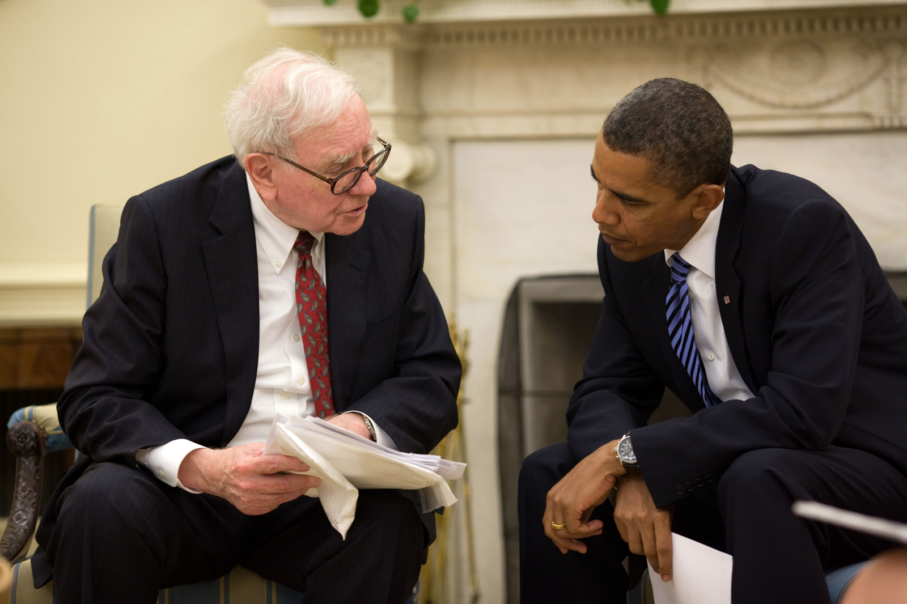
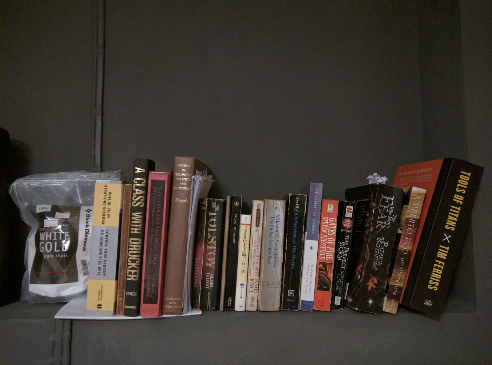
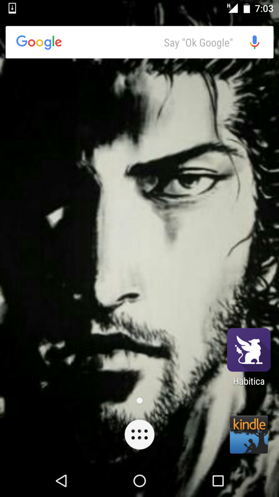
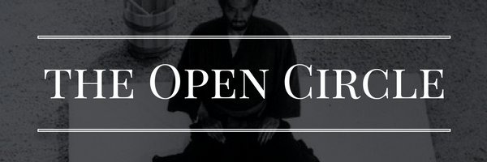

The Simple Truth Behind Reading 200 Books a Year – Better Humans

Source: [Wikimedia Commons](https://upload.wikimedia.org/wikipedia/commons/3/35/Buffett_%26_Obama.jpg)

# The Simple Truth Behind Reading 200 Books a Year

Somebody once asked Warren Buffett about his secret to success. Buffett pointed to a stack of books and said,

> “**> Read 500 pages like this every day. **> That’s how knowledge works. It builds up, like compound interest. **> All of you can do it, but I guarantee not many of you will...**> ”

When I first found this quote of Buffett’s two years ago, something was wrong.

It was December 2014. I’d found my dream job. Some days, I would be there, sitting at my dream job, and I would think. *My god what if I’m still here in 40 years? I don’t want to die like this…*

Something wasn’t right. I’d followed the prescription. *Good grades. Leadership. Recommendations. College. Dream Job.* I was a winner. I’d finished the race. Here I was in the land of dreams. But something was terribly, terribly wrong.

Every day, from my dream job desk, I looked out into their eyes. Empty, empty eyes.

There were no answers.

In January of 2015, I found Buffett’s quote. I decided to read. I was going to read and read and read and never stop until I got some damn answers.

I didn’t quite make 500 pages a day, but, in these last 2 years, I’ve read over 400 books cover to cover. That decision to start reading was one of the most important decisions in my life.

Books gave me the courage to travel. Books gave me the conviction to quit my job. Books gave me role models and heroes and meaning in a world where I had none.

I want to say reading 200 books a year is an amazing thing. But the truth is, it’s not. Anybody can do it.

All it takes is some simple math and the right tools.

* * *

*...*

### 1. Do Not Quit Before You Start

When average Joe hears the advice “Read 500 pages like this every day”*,* his snap reaction is to say, “No way! That’s impossible!”

Joe will then go on to make up reasons to justify his belief without doing any deep thinking at all. These might include “I’m too busy”, “I’m not smart enough”, or “Books just aren’t for me.”

But what if we go a little deeper? For example, what does it *actually* take to read 200 books a year? Two years ago, I stopped to do the simple math. Here’s what I found: **Reading 200 books a year isn’t hard at all.**

It’s just like Buffett says. Anyone can do it, but most people won’t.

* * *

*...*

### 2. Do The Simple Math

How much time does it take to read 200 books a year?
First, let’s look at two quick statistics:

- •The average American reads 200–400 words per minute. (Since you’re on Medium, I’m going to assume you read 400 wpm like me)
- •Typical non-fiction books have ~50,000 words.

Now, all we need are some quick calculations…
200 books * 50,000 words / book = 10 million words
10 million words / 400 wpm = 25,000 minutes
25,000 minutes / 60 = 417 hours

That’s all there is to it. **To read 200 books, simply spend 417 hours a year reading.**

I know, I know. If your brain is like mine, it probably saw “417 hours” and immediately tried to shut off. Most people only work 40 hours a week! How can we possibly read for 417 *hours*?

Don’t let your monkey brain turn you away yet. Let’s do a quick reframe for what 417 hours really means…

* * *

*...*

### 3. Find The Time

Wowsers, 417 hours. That sure feels like a lot. But what does 417 hours really mean? Let’s try to get some more perspective.

Here’s how much time a single American spends on social media and TV in a year:

- •608 hours on social media
- •1642 hours on TV

Wow. That’s 2250 hours a year spent on TRASH. If those hours were spent reading instead, **you could be reading over 1000 books a year!**

Here’s the simple truth behind reading a lot of books: It’s not that hard. We have all the time we need. The scary part — the part we all ignore — is that we are too addicted, too weak and too distracted to do what we all know is important…

All it takes to start reading a lot more is to take “empty time” spent Twitter-stalking celebrities or watching Desperate Housewives and convert some of it to reading time.

The theory is simple. It’s the *execution* that’s hard.

* * *

*...*

### 4. Execute

We all know reading is important. We all know we should do more of it. But we don’t. The main reason this happens is a *failure to execute*.

I’m not so perfect at it yet, but here are some tactics that have helped me get results.

#### I. Use Environmental Design

If you were quitting cocaine, would you keep it lying around the house? Of course not. Media is designed to be addictive. Moving away from media addiction can be as difficult as quitting drugs.

The biggest bang-for-buck changes here are *environmental*.

If you want to read, make sure (1) you remove all distractions from your environment and (2) you make books as easy to access as possible.

As an example, here’s my immediate environment:

I travel a lot. That doesn’t stop me from reading. The picture on the left is of my “bookshelf” in Thailand. I try to keep books everywhere so I can just pick one up and start reading.

The picture on the right is my smartphone desktop. Notice there are only two apps. One of them — the Kindle app — is for reading. The other is for habits… Which brings me to my next point.

#### II. Upload Habits

Willpower is not a good tool for lifestyle change. It always fails you when you need it most. Instead of relying on strength of mind, build a fortress of habits — these are what will keep you resilient in tough times.

If you’re not familiar with habit science, my favorite book on the subject is Tynan’s [Superhuman by Habit](http://amzn.to/2jiYwDl). It’s infinitely practical, and practical is all I care about.

Getting good at habit formation took me years. Many of the mistakes I made were avoidable. If I could go back, I’d [find a habit coach](https://www.coach.me/?ref=kvAdO). Here’s how I see it. One game-changing idea from a good book is worth thousands of dollars. If a coach helps you read ONE more good book a year, you already get your money’s worth.

(A shout out to [Cherry Jeffs](https://www.coach.me/GrowWings/427900?ref=kvAdO#goal) and [Nathan Sudds](https://www.coach.me/nathansudds?ref=kvAdO), two coaches that have helped me out a lot.)

#### III. Go Multi-Medium

When it comes to reading, be a jack of all trades, not a specialist.

If your goal is to read more, you can’t be picky about where you read or what mediums you use. I read paper books. I read on my phone. I listen to audiobooks. And I do these things everywhere — on park benches, in buses, in the toilet… Wherever I can.

Make your reading opportunistic. If you have a chance, take it. If you don’t have a chance, find one.

* * *

*...*
> “I read a book one day and my whole life was changed.” — Orhan Pamuk

If I hadn’t started reading, perhaps I’d still be at my dream job. Perhaps I’d still be at my desk, taking peeks at the clock and wondering if that was how I was going to die…

If you’re looking for answers, give reading a try. You may find much, much more than what you were looking for.

* * *

*...*

**Want more?** Join 9000 readers getting [The Open Circle](http://bit.ly/2g31cn2), a weekly dose of my best ideas. I’ll also send you 200+ pages from my private notebooks and 24 of my favorite books. [**Get it here**](http://bit.ly/2g31cn2)**.**

