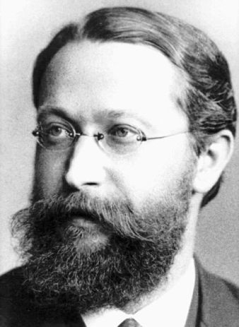
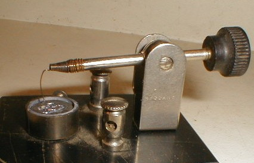
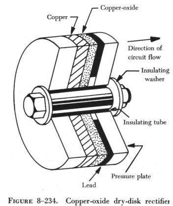
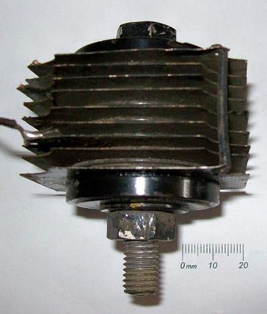
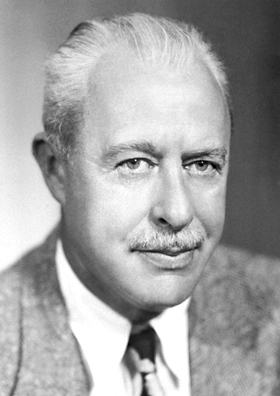

The Transistor, Part 1: Groping in the Dark

# The Transistor, Part 1: Groping in the Dark

The road to a solid-state switch was a long and complex one. It began with the discovery that certain materials behaved oddly with respect to electricity – differently than any existing theory said they ought to. What followed is a story that reveals the “scienceification” and “instutionalization” of technology in the twentieth century. Dilettantes, amateurs and professional inventors with little or no formal scientific training made major contributions to telegraphy, telephony, and radio. As we shall see, however, almost every advance in the history of solid-state electronics came from a university-trained scientist (typically with a Ph.D. in physics) working at a major university or corporate research lab.

Anyone with access to a machine shop and some basic mechanical skills could construct a relay from wire, metal, and wood. The vacuum tube requires more specialized tools to make and evacuate a glass envelope. Solid-state devices, however, disappeared down a rabbit hole from which the digital switch has never returned, descending ever deeper into worlds comprehensible only by abstract mathematics, and accessible only by a panoply of tremendously expensive equipment.

## Galena

In 1874, Ferdinand Braun, a 24-year-old physicist at the Thomas Gymnasium[1](https://technicshistory.wordpress.com/2018/01/20/the-transistor-part-1-groping-in-the-dark/#fn-12961-7)in Leipzig, produced the first of many important scientific publications in his long career. “On the Conduction of Electrical Currents through Metal Sulfides” was accepted by Pogendorff’s *Annalen*, the premier journal for work in the physical sciences. Despite its dull title, Braun’s paper described a series of fascinating and perplexing experimental results.

Ferdinand Braun

Braun became intrigued by the sulfides – mineral crystals consisting of sulfur bound to some metal – from the work of Johann Hitorff. As far back as 1833, Michael Faraday had noted that the conductivity of  silver sulfide *increased* with temperature, the exact opposite of the behavior of metallic conductors. Hitorff had reported his meticulous quantitative measurements of this effect in the 1850s, in both silver and copper sulfides. Now Braun, using a clever experimental apparatus that pressed a metal wire into the sulfide crystal with a spring in order to ensure good contact, found something far stranger. The conductivity of his crystals was *directional* – that is to say, current would flow well in one direction, but if he reversed the polarity on the battery, suddenly the current dropped dramatically. The crystals acted more like conductors (such as normal metals) in one direction but more like insulators (such as glass or rubber) in the other. This property was known as *rectification*, for its ability to straighten (rectify) a “wiggly” alternating current into a “flat” direct current.

Around the same time, researchers discovered other strange properties in materials such as selenium, which could be smelted out from some metal sulfide ores. Selenium increased in conductivity or even generated voltage when exposed to light, and could also be used to rectify current. Was there any connection to the sulfide crystals? Without any theoretical model to explain what was happening, confusion reigned.

But the lack of a theory was no obstacle to practical applications. By the late 1890s, Braun had become a full professor at the University of Strasbourg – recently annexed from France in the Franco-Prussian War and rechristened the Kaiser-Wilhelm University. There he became enmeshed in the exciting new world of radiotelegraphy, or wireless. Approached by a group of entrepreneurs, he agreed to join their venture to build a wireless system based on transmission through the water. But he and his partners soon abandoned their original idea in favor of the aerial transmission used by Marconi and others.

Among the aspects of radio which Braun’s group sought to improve was the then-standard wireless receiver, the coherer. It relied on the fact that Hertzian waves would cause metal filings to cohere into a clump, allowing current from a battery to pass through to a signaling device. It worked, but responded only to relatively strong signals, and required constant tapping to decohere the filings. Braun remembered his old experiments with sulfide crystals, and in 1899, he reconstructed his old experimental apparatus with a new purpose – as a detector of wireless signals. It used the rectification effect to transform the tiny, oscillating current produced by passing radio waves into a direct current that could drive a small speaker, producing audible crackles with each dot and dash. This device later became known as the “cat’s whisker” detector, after the appearance of the twist of wire used to lightly touch the top of the crystal. In British India (modern Bangladesh), the scientist and inventor Jagadish Bose built a similar device, perhaps as early as 1894. Others soon followed with detectors based on silicon and carborundum (silicon carbide).

But it was galena, or lead sulfide, which has been smelted for lead since ancient times, that became the preferred material for these crystal detectors. Cheap and easy to construct, they became wildly popular among early radio hobbyists. Moreover, unlike the strictly binary coherer (the filings were either cohered or not), the crystal rectifier could reproduce a continuous signal. And so it could render audible transmissions of voice and music, not just Morse code dots and dashes.

A galena cat’s whisker detector. The small bit of wire on the left is the ‘whisker’ and chunk of silver material below it is the galena crystal.

However, as many a frustrated hobbyist would learn, it could take minutes or even hours of tedious hunting around on the surface of the crystal to find that magic spot that would produce good rectification. And the unamplified sounds they produced were feeble and tinny. By the 1920s, vacuum tube receivers with triode amplifiers had made crystal detectors all but obsolete for most purposes. Only their low cost remained an attraction.

This brief interlude as a radio receiver seemed to be the extent of the practical value of the curious electrical properties that Braun and others had uncovered.

## Copper Oxide

Then, in 1920, another physicist, named Lars Grondahl,[2](https://technicshistory.wordpress.com/2018/01/20/the-transistor-part-1-groping-in-the-dark/#fn-12961-1) found something odd in his experimental apparatus. Grondahl, the first of several bright and restless men from the American West in our story, was the son of a civil engineer. His father, who immigrated from Norway in 1880, spent decades working on the new railroads of California, Oregon, and Washington. Grondahl seemed at first to leave his father’s world of engineering behind, pursuing a Ph.D. in physics at Johns Hopkins, and going into academia. But then he, too, found his way into the railroad business, taking a position as director of research for Union Switch and Signal, a subsidiary of industrial giant Westinghouse that supplied equipment to the railroad industry.

Different accounts provide contradictory reasons for Grondahl’s initial motivation for his investigations, but whatever the reason, he began experimenting with disks of copper that had been heated on one side to create an oxidized layer. While testing out the disks, he noticed an asymmetry in the current flows – the resistance was three times as strong in one direction as in the other. The copper/copper-oxide disk was *rectifying *current, just like a sulfide crystal.

Schematic of a copper-oxide rectifier

Grondahl spent the next six years developing this phenomenon into a production-ready rectifier, with the help of another Union Switch researcher, Paul Geiger, before filing a patent and announcing his find to the American Physical Society in 1926. It was an immediate commercial hit. With no fragile filament, it was far more reliable than a vacuum tube rectifier based on Fleming’s “valve” principle, and could be made more cheaply. Unlike Braun’s crystal rectifiers, it worked on the first try, and, because of the much larger contact area between metal and oxide, it worked across a much greater range of currents and voltages. It could charge batteries, detect signals in a variety of electrical systems, and act as a safety bypass in high-power generators. When used as a photocell rather than a rectifier, the disks could act as light meters, and were especially useful in photography. Other researchers developed selenium rectifiers around the same time, which found similar applications.

A copper-oxide rectifier stack. Putting multiple copper/copper-oxide discs in series increased their resistance to backpressure, making them suitable in higher-voltage applications.

A few years later, two Bell Labs physicists, Joseph Becker and Walter Brattain, took up the topic of the copper rectifier – they wanted to know how it worked, and how it could be put to work for the Bell System.

Brattain in later years – circa 1950

Brattain hailed from the same part of the country as Grondahl, the Pacific Northwest, where he grew up on a farm just miles from the Canadian border. In high school he developed an interest in physics, showed an aptitude for it, and eventually took his Ph.D. at the University of Minnesota in the late 1920s, arriving at Bell Labs in 1929. Among other coursework, he had studied the newest theoretical physics emerging from Europe, known as quantum mechanics.[3](https://technicshistory.wordpress.com/2018/01/20/the-transistor-part-1-groping-in-the-dark/#fn-12961-8)

## The Quantum Revolution

This new theoretical armature had slowly evolved over the previous three decades, and would, in due time, help to explain all the strange phenomena that had been observed over the years in materials like galena, selenium and copper oxide*. *A cohort of mostly young scientists, mostly from Germany or its neighbors, had created a great quantum upheaval in physics. Everywhere they looked they found, not the smooth, continuous world that they had been taught of, but strange, discrete lumps.

It began in the 1890s. Max Planck, a highly renowned full professor at the University of Berlin, had decided to tackle a well-known but still unsolved problem: how does a “black-body” (an ideal substance that absorbs all incoming energy without reflection) emit radiation across the electromagnetic spectrum? Various models had been tried, none of which matched the experimental results – they failed at either the low or at the high end of the spectrum. Planck found that if he assumed that energy was emitted from the body in little “packets” of discrete size, he could make a simple law for the relationship between frequency and energy that perfectly matched all the empirical results.

Shortly thereafter, Einstein found the same to be true for the *absorption *of light (the first hint of the *photon*), and J.J. Thomson showed that electricity, too, was not carried by a continuous fluid or wave but by a discrete particle – the *electron*. Niels Bohr then created a model that explained the radiation given off by excited atoms by positing distinct electron orbits in the atom, each with its own energy level. The name is misleading, for they behaved nothing like macroscopic planetary orbits – in Bohr’s model electrons moved instantaneously from one orbit, or energy level, to the next, without passing through any intermediate point. Finally, in the 1920s, Erwin Schrödinger, Werner Heisenberg, Max Born, and others built a general mathematical framework known as *quantum mechanics*, which subsumed all the ad hoc quantum models that had been built over the previous two decades.

By this time also, physicists had become fairly confident that materials like selenium and galena, that displayed rectifying and photovoltaic properties, belonged to a distinct class of materials that they dubbed *semiconductors*. This classification took so long for several reasons: First, insulators and conductors were themselves expansive categories. So-called “conductors” vary greatly in their conductivity, and likewise (to a less degree) with insulators, and it was not obvious that any given semiconductor could not be assigned to one class or the other. Moreover, until the middle of the twentieth century, it was not possible to obtain or create highly purified materials, and any strangeness in the conductive properties of a natural mineral could always be attributed to impurities.

Now physicists had available both the mathematical tools of quantum mechanics and a new distinctive class of materials to apply them to. British theorist Alan Wilson was the first to effectively put these together to provide an overall model of what semiconductors are and how they work, in 1931.

Wilson first argued that conducting materials are distinguished from insulating ones by the state of their energy bands. Quantum mechanics had posited that electrons can only exist in a finite number of energy levels, which in a single atom are carved into shells or orbitals. When those atoms are compressed together in a material structure, however, it is better to think of continuous energy *bands *that run through the material. In conductors, there are empty slots available in the material’s highest energy band, and an electrical force can easily jostle electrons up into these free spaces. In insulators, by contrast, the band is full, and it is a long climb up to the next, *conduction*band, where electricity could move freely.

This led him to the conclusion that *impurities* –foreign atoms in the material’s structure – must contribute to semi-conduction. They could either contribute excess electrons to the material, electrons that could easily jump up into the conduction band, or contribute *holes* – a lack of electrons relative to the rest of the material – creating empty energy slots into which free electrons could move. The former later became known as *n-type *semiconductors (for their excess negative charge), and latter *p-type. *

Wilson finally proposed that the rectification of current by semiconductors could be explained terms of *quantum* *tunneling*, the sudden jump of electrons across a thin electrical barrier within the material. The theory seemed plausible, yet it predicted that current in a rectifier would flow from copper oxide to copper, when in fact it did just the opposite.[4](https://technicshistory.wordpress.com/2018/01/20/the-transistor-part-1-groping-in-the-dark/#fn-12961-5)

Thus, despite the advances made by Wilson, semiconducting materials still proved extremely resistant to explanation. As was slowly becoming apparent, microscopic changes in their crystalline structure and the concentrations of impurities could have outsize effects on their macroscopic electrical behaviors. Undeterred by this lack of understanding – for indeed no one could yet explain the experimental phenomena observed by Braun some 60 years prior – Brattain and Becker developed an efficient production process for copper-oxide rectifiers for their employer. The Bell System quickly moved to replace vacuum tube rectifiers throughout its system with this new device, which its engineers dubbed the *varistor*, since its resistance varied with direction.

## The Golden Prize

Mervin Kelly, a physicist and former head of Bell Labs’ vacuum tube department, was fired up by this accomplishment. Electronic vacuum tubes had proved invaluable to Bell over the previous twenty years or so, and could perform functions impossible for the earlier generation of mechanical and electro-mechanical components. But they ran hot, burned out regularly, consumed large amounts of power, and were a huge maintenance burden. Kelly meant to reconstruct the Bell system yet again on more reliable and durable electronic components – *solid-state* components like the varistor, which require no sealed gas or vacuum envelope to function, nor any heated filament. In 1936 he became head of research for Bell Labs as a whole, and began to redirect his organization towards this vision.

With a solid-state rectifier in hand, the obvious next step for the field was a solid-state *amplifier. *Coincidentally, of course, just like the vacuum tube amplifier, such a device could also function as a digital switch. This was of particular interest to Bell, which still had vast numbers of electro-mechanical digital switches in its telephone exchanges. But more widely sought after was a more reliable and compact, less-power-hungry and cooler replacement for the vacuum tube in telephone systems, radios, radars and other analog equipment, where it was used to amplify feeble signals into something perceptible by human ears or eyes.

In 1936, Bell Labs finally lifted the hiring freeze that it had imposed during the Great Depression. Kelly immediately began acquiring experts in quantum mechanics to help fuel his solid-state research program, among them William (Bill) Shockley, another Westerner, from Palo Alto, California.  The topic of his freshly minted thesis from MIT could not have better suited Kelly’s needs: “Electronic Bands in Sodium Chloride.”

At the same time, Brattain and Becker continued their investigation of the copper-oxide rectifier, in pursuit of the greater prize of a solid-state amplifier. The most obvious way to make one was by analogy to the vacuum tube. Just as Lee De Forest had taken a vacuum tube rectifier and placed an electrified grid between the source and the sink of the current, so did Brattain and Becker imagine inserting a grid into the interface between the copper and copper oxide, where the act of rectification was presumed to occur. However, given the thinness of this layer, it seemed to them impossible to actually do this, and they made no real headway.

Meanwhile, developments elsewhere showed that Bell Labs was not the only party interested in solid-state electronics. In 1938, Rudolf Hilsch and Robert Pohl published the results of their experiments at the University of Göttingen with a working solid-state amplifier, created by inserting a grid into a crystal of potassium bromide. It was a laboratory device of no practical value – most notably, it operated at frequencies of one hertz or less.[5](https://technicshistory.wordpress.com/2018/01/20/the-transistor-part-1-groping-in-the-dark/#fn-12961-6) Still, such a milestone could not fail to excite anyone interested in the world of solid-state. That same year, Kelly placed Shockley in a new independent solid-state research group, and gave him and his colleagues – Foster Nix and Dean Wooldridge – free reign to explore the possibilities of the medium.

Shockley’s first major inspiration in this new role came from reading British physicist Nevill Mott’s 1938 “Theory of Crystal Rectifiers,” which finally explained how Grondahl’s copper-oxide rectifier worked. Mott used the mathematics of quantum mechanics to work out how an electrical field formed at the junction of conducting metal and semiconducting oxide, and how electrons ‘jump’ over this electric barrier, rather than tunneling through it as Wilson had proposed. Current flows more easily from metal to semi-conductor than vice-versa because the metal has many more free electrons available.[6](https://technicshistory.wordpress.com/2018/01/20/the-transistor-part-1-groping-in-the-dark/#fn-12961-4)

This led Shockley to exactly the same idea that Brattain and Becker had considered and rejected years earlier – to make a solid-state amplifier by inserting a piece of oxidized copper mesh into the copper-oxide interface. He hoped that applying current to the mesh would grow the barrier, constricting the flow of current from copper to oxide and thus creating an inverted, amplified version of the signal on the mesh. His first, crude effort was an utter failure, so he went for help to someone with more highly-polished laboratory skills who was very familiar with rectifiers – Walter Brattain. Though he had no doubts about the outcome, Brattain agreed to humor Shockley, and built a much more sophisticated version of the ‘mesh’ amplifier. It, too, failed utterly.

Then war intervened, leaving Kelly’s new research program in disarray. Kelly himself took charge of the radar working group at Bell Labs, under the auspices of the main American radar research center at MIT. Brattain worked under him for a short time before moving on to study the magnetic detection of submarines for the Navy. Wooldridge worked on fire-control systems[7](https://technicshistory.wordpress.com/2018/01/20/the-transistor-part-1-groping-in-the-dark/#fn-12961-9), Nix on gaseous diffusion for the Manhattan Project, and Shockley went into operations research, in support first of the antisubmarine campaign in the Atlantic, then the strategic bombing campaign in the Pacific.

Despite this short-term disruption, however, the war proved no impediment to the growth of solid-state electronics. On the contrary, it brought a massive new influx of resources to the field, and a new focus on two materials in particular: germanium and silicon.

## Further Reading

Ernest Bruan and Stuart MacDonald, *Revolution in Miniature *(1978)
Friedrich Kurylo and Charles Susskind, *Ferdinand Braun *(1981)

G. L. Pearson and W. H. Brattain, “History of Semiconductor Research,” *Proceedings of the IRE* (December 1955).

Michael Riordan and Lillian Hoddeson, *Crystal Fire *(1997)

* * *

1. Unlike most of this blog, this is based on primary source research (to the extent that such is possible from one’s living room couch), since next to no secondary sources on Grondahl and his work exist. I have extracted some scanty information on the invention itself from L. O. Grondahl and P. H. Geiger, “A New Electronic Rectifier,” *Journal of the A.I.E.E *46, 3 (1927);  “News,” *Railway Signaling and Communications*, Volume 24 (1932), 362. Grondahl’s background is gleaned from “News of the Month”, *Railway Signaling and Communications*, Volume 31 (1939), 362, and *Engineering News*, vol. 73 (1915), 143. That William was Lars’ father is an inference based on timing, geography, and similarity of careers. The only biographical information I have found on Paul Geiger comes from “Paul Geiger, U-M Physicist, Dies at 57,” *Ann Arbor News *(January 28, 1954).

2. Brattain studied quantum mechanics under John Van Vleck, who was also at that time supervising John Atansoff’s thesis.

3. Peter Morris, *A History of the World Semiconductor Industry *(1990), 16. At least two others may have created solid-state amplifiers before World War II: Soviet engineer Oleg Losev published his successes with a zincite amplifiers in 1922. However, his work seems not to have gained the notice of the Western scientific community, and had no influence on the events that followed. In 1926, American inventor Julius Lillenfeld filed a patent for a solid-state amplifier, but there’s no evidence that he got it to work (and indeed it’s very improbable given his design and the materials and resources he had access to). Thomas H. Lee, “The (Pre-) History of the Integrated Circuit: A Random Walk,” *IEEE SSCS News *(Spring 2007).

4. Nevill Mott, “The Theory of Crystal Rectifiers,” *Proceedings of the Royal Society of London* (1939). Walter Schottky published a similar theory in 1938, but it was in German and thus Schockley and his colleagues heard of Mott’s work first.

5. Wooldridge stayed in aerospace after the war, and co-founded Ramo-Wooldridge, which later became TRW.

Advertisements