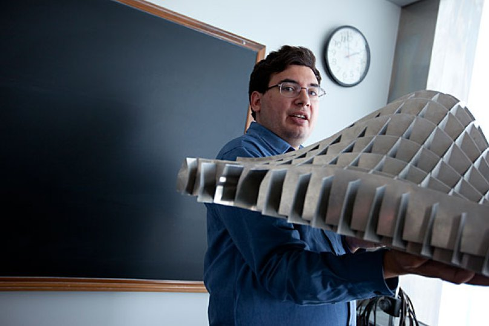

The lasting lure of logic

# The lasting lure of logic

Joseph K. Blitzstein, a new professor of statistics and an award-winning teacher, holds a two-dimensional normal distribution built by Fred Mosteller, who founded the department in 1957. Bending it illustrates different correlations.

Rose Lincoln/Harvard Staff Photographer

## Statistics professor specializes in making a complex subject understandable

Ask Harvard statistician [Joseph K. Blitztstein](http://www.stat.harvard.edu/faculty_page.php?page=blitzstein.html) about chess, probability, logic puzzles, network theory, combinatorics, the novels of George R.R. Martin, and even cats. He’s your man, and you’ll learn something.

Harvard seniors think so. This month they voted Blitzstein a “favorite professor” — the fourth senior class in a row to so anoint his kinetic and sweeping introductory course, Statistics 110. He has also won Harvard’s Phi Beta Kappa teaching prize (2009), headlined the first [David K. Pickard Memorial Lecture](http://www.stat.harvard.edu/?page=Pickard_Lecture.html) (2010), and won the 2010-2011 Levenson Prize for teaching.

The California native is the latest senior professor in Harvard’s small but influential [Department of Statistics](http://www.stat.harvard.edu/). (Its graduate students, like Blitzstein, win teaching awards with metronome regularity.) He is also the department’s first professor of the practice, a senior position.

Blitzstein will admit that statistics — a subject widely feared and widely required — is “difficult to teach well. Not many people are trained in statistics education, which is still in its infancy.” The science of confounding variables and regression analysis “often turns into this ugly cookbook thing, with ugly formulas,” said Blitzstein. But if it’s taught as a real-world science, with elegant principles, he said, students go beyond fragmentary facts into a world of  “expert knowledge.”

Blitzstein has co-taught Stat 303 many times with department chair [Xiao-Li Meng](http://www.stat.harvard.edu/faculty_page.php?page=meng.html). It’s a course required of all first-year Ph.D. statistics students. The intention is to make young scholars good teachers and communicators in general, and to remind them that teaching and research are interwoven. To impart the fundamentals of statistics, a graduate student has to have a grasp of more than formulas. They practice-teach, said Blitzstein, and “Xiao-Li and I ask very hard questions.”

When news of his appointment arrived earlier this year, Blitzstein would have celebrated, he said, “but I have too much work to do.” This semester, he is teaching three courses: Stat 110 with 280 students (it had 80 registrants when he took over in 2006); Stat 210, a Ph.D.-level probability course with 54 students; and a graduate seminar on reading landmark statistician and geneticist Ronald A. Fisher (1890-1962) in the original, right back to journals from the 1920s. “You can see all the brilliance there,” said Blitzstein. Then there are this semester’s advisement obligations. He oversees four Ph.D. dissertations and two undergraduate theses, and co-advises 50 undergraduate concentrators — many of them drawn in by Stat 110.

But nothing these days matches the stress of his last and sixth year as a mathematics Ph.D. student at [Stanford University](http://www.stanford.edu/). “I was desperately trying to finish my thesis, look for jobs, and teach,” said Blitzstein. “In my life, I’ve been pretty lucky — I don’t get stressed out. But the stress was really getting to me.” To wind down every night, he gave himself 30 minutes to read from George R.R. Martin’s “A Song of Ice and Fire” fantasy series — mystical, dark novels set in a Middle Ages that never was. Despite the brooding subject matter, he said, “I started having very sweet dreams.”

The sweetest of them for young Blitzstein came in March 2006, in the form of a late-night phone call from Meng. Did he want a job at Harvard? “It was incredibly exciting news,” he said, and it took him quickly from a lifetime in California to a fresh start in New England. “I made three simultaneous life transitions,” said Blitzstein: moving from west to east; moving from student to faculty; and moving from mathematics to statistics. “I’ve really engaged all three of them.

Of the first, he said: No California house ever needed heat, but it could get cold. “Here,” said a cheerful Blitzstein, “there is always heat.” Of the last, he said that statistics satisfied an urge he acquired as a graduate student in mathematics to engage the world in practical ways, beyond pure numbers. As an undergraduate at the [California Institute of Technology](http://www.caltech.edu/), Blitzstein considered a career in astronomy and physics before settling on mathematics.  He admired the “brilliant, intuitive arguments” physicists made, but “felt more comfortable with things I could prove.”

At Stanford, Blitzstein discovered the world of probability theory, an interface between mathematics and statistics and one way a mathematician can address real-world problems. He was helped by Ph.D. adviser Persi Diaconis, a magician-turned-scholar famous for proving theorems about card shuffling and coin flips.

Blitzstein specializes in the statistics of networks, developing models and methods for studying vastly complicated “natural” patterns of interdependency and connection at the heart of social networks, ecology, biology, information systems, and even disease patterns. Social scientists and others are confronted with masses of data, said Blitzstein, but so far there is “little statistical theory” about how to analyze it.

Is there life outside Harvard? “I have cats,” said Blitzstein, as if that answered everything. His website — illustrated by M.C. Escher drawings, formulas, and diagrams — includes the sentiment, “Books, cats. Life is sweet.”