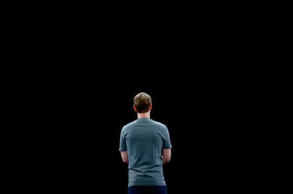
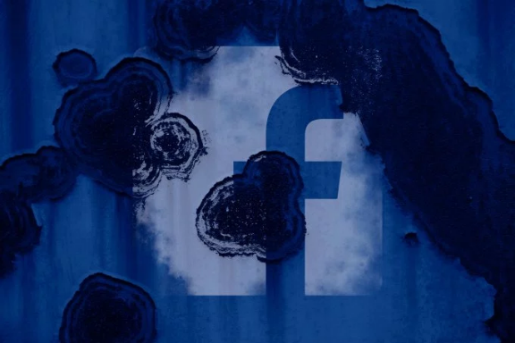
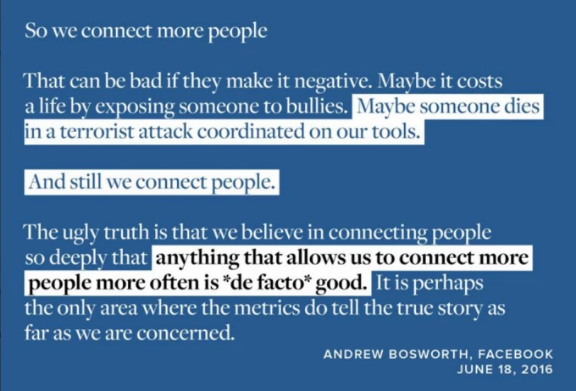
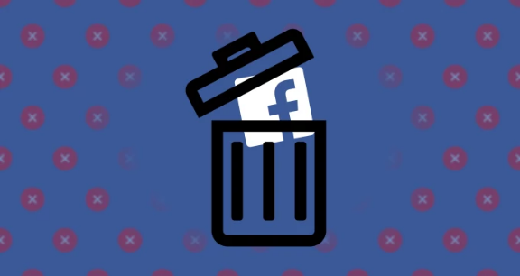
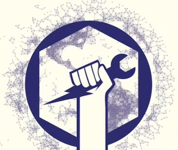

The real threat to Facebook is the Kool-Aid turning sour

# The real threat to Facebook is the Kool-Aid turning sour

## Who wants to work on a weapon?

These kinds of leaks didn’t happen when I started reporting on Facebook eight years ago. It was a tight-knit cult convinced of its mission to connect everyone, but with the discipline of a military unit where everyone knew loose lips sink ships. Motivational posters with bold corporate slogans dotted its offices, rallying the troops. Employees were happy to be evangelists.

But then came the fake news, News Feed addiction, violence on [Facebook](https://www.crunchbase.com/organization/facebook/) Live, cyberbullying, abusive ad targeting, election interference and, most recently, the Cambridge Analytica app data privacy scandals. All the while, Facebook either willfully believed the worst case scenarios could never come true, was naive to their existence or calculated the benefits and growth outweighed the risks. And when finally confronted, Facebook often dragged its feet before admitting the extent of the issues.

Inside the social network’s offices, the bonds began to fray. An ethics problem metastisized into a morale problem. Slogans took on sinister second meanings. The Kool-Aid tasted different.

Some hoped they could right the ship but couldn’t. Some craved the influence and intellectual thrill of running one of humanity’s most popular inventions, but now question if that influence and their work is positive. Others surely just wanted to collect salaries, stock and resumé highlights, but lost the stomach for it.

Now the convergence of scandals has come to a head in the form of constant leaks.

## The trouble tipping point

The more benign leaks merely cost Facebook a bit of competitive advantage. We’ve learned it’s building a [smart speaker](https://www.bloomberg.com/news/articles/2017-08-01/facebook-is-said-to-work-on-video-chat-device-in-hardware-push), a [standalone VR headset](https://www.bloomberg.com/news/articles/2017-07-13/facebook-said-to-plan-200-wireless-oculus-vr-headset-for-2018) and a [Houseparty split-screen video chat clone](https://www.theverge.com/2017/7/5/15916850/facebook-houseparty-clone-bonfire-group-video-chat).

Yet policy-focused leaks have exacerbated the backlash against Facebook, putting more pressure on the conscience of employees. As blame fell to Facebook for Trump’s election, word of[Facebook prototyping a censorship tool](https://www.nytimes.com/2016/11/22/technology/facebook-censorship-tool-china.html) for operating in China escaped, triggering questions about its respect for human rights and free speech.[Facebook’s content rulebook](https://www.theguardian.com/news/2017/may/21/revealed-facebook-internal-rulebook-sex-terrorism-violence?CMP=share_btn_tw)got out alongside disturbing tales of the filth the company’s contracted moderators have to sift through. Its ad targeting was revealed to be able to[pinpoint emotionally vulnerable teens](https://www.csoonline.com/article/3193382/security/leaked-document-shows-how-facebook-can-target-emotionally-vulnerable-teens-for-ads.html).

In recent weeks, the leaks have [accelerated](https://www.techmeme.com/search/query?q=Facebook+cambridge&wm=false) to a maddening pace in the wake of Facebook’s soggy apologies regarding the Cambridge Analytica debacle. Its weak policy enforcement left the door open to exploitation of data users gave third-party apps, deepening the perception that Facebook doesn’t care about privacy.

And it all culminated with [BuzzFeed](https://www.buzzfeed.com/ryanmac/growth-at-any-cost-top-facebook-executive-defended-data?utm_term=.oenWnyQrW#.trJAv2GZA) publishing a leaked “growth at all costs” internal post from Facebook VP Andrew “Boz” Bosworth that substantiated people’s worst fears about the company’s disregard for user safety in pursuit of world domination. Even the ensuing [internal discussion about the damage caused by leaks](https://www.theverge.com/2018/3/30/17179100/facebook-memo-leaks-boz-andrew-bosworth) and how to prevent them…leaked.

But the leaks are not the disease, just the symptom. Sunken morale is the cause, and it’s dragging down the company. Former Facebook employee and Wired writer Antonio Garcia Martinez sums it up, saying this kind of vindictive, intentionally destructive leak fills Facebook’s leadership with “horror”:

And that sentiment was confirmed by Facebook’s VP of News Feed Adam Mosseri, who [tweeted](https://twitter.com/mosseri/status/979776914935242752) that leaks “create strong incentives to be less transparent internally and they certainly slow us down,” and will make it tougher to deal with the big problems.

Those thoughts weigh heavy on Facebook’s team. A source close to several Facebook executives tells us they feel “embarrassed to work there” and are increasingly open to other job opportunities. One current employee told us to assume anything certain execs tell the media is “100% false.”

If Facebook can’t internally discuss the problems it faces without being exposed, how can it solve them?

## Implosion

The consequences of Facebook’s failures are typically pegged as external hazards.

You might assume the government will finally step in and regulate Facebook. But the Honest Ads Act and other rules about ads transparency and data privacy could [end up protecting Facebook](https://techcrunch.com/2018/03/25/the-regulation-moat/)by being simply a paperwork speed bump for it while making it tough for competitors to build a rival database of personal info. In our corporation-loving society, it seems unlikely that the administration would go so far as to split up Facebook, Instagram and WhatsApp — one of the few feasible ways to limit the company’s power.

Users have watched Facebook make misstep after misstep over the years, but can’t help but stay glued to its feed. Even those who don’t scroll rely on it as a fundamental utility for messaging and login on other sites. Privacy and transparency are too abstract for most people to care about. Hence, first-time Facebook downloads [held steady](https://www.buzzfeed.com/alexkantrowitz/nothing-is-going-to-happen-to-facebook-or-mark-zuckerberg?utm_term=.xya78jAG7#.qrv6zVM76) and its App Store rank actually rose in the week after the Cambridge Analytica fiasco broke. In regards to the #DeleteFacebook movement, Mark Zuckerberg himself said “I don’t think we’ve seen a meaningful number of people act on that.” And as long as they’re browsing, advertisers will keep paying Facebook to reach them.

That’s why the greatest threat of the scandal convergence comes from inside. The leaks are the canary in the noxious blue coal mine.

## Can Facebook survive slowing down?

If employees wake up each day unsure whether Facebook’s mission is actually harming the world, they won’t stay. Facebook doesn’t have the same internal work culture problems as some giants like Uber. But there are plenty of other tech companies with less questionable impacts. Some are still private and offer the chance to win big on an IPO or acquisition. At the very least, those in the Bay could find somewhere to work without a spending hours a day on the traffic-snarled 101 freeway.

If they do stay, they won’t work as hard. It’s tough to build if you think you’re building a weapon. Especially if you thought you were going to be making helpful tools. The melancholy and malaise set in. People go into rest-and-vest mode, living out their days at Facebook as a sentence not an opportunity. The next killer product Facebook needs a year or two from now might never coalesce.

And if they do work hard, a culture of anxiety and paralysis will work against them. No one wants to code with their hands tied, and some would prefer a less scrutinized environment. Every decision will require endless philosophizing and risk-reduction. Product changes will be reduced to the lowest common denominator, designed not to offend or appear too tyrannical.

Source: Volkan Furuncu/Anadolu Agency + David Ramos/Getty Images

In fact, that’s partly how Facebook got into this whole mess. A leak by an anonymous former contractor led Gizmodo to report Facebook was[suppressing conservative news](https://gizmodo.com/former-facebook-workers-we-routinely-suppressed-conser-1775461006) in its Trending section. Terrified of appearing liberally biased, [Facebook reportedly hesitated](https://www.wired.com/story/inside-facebook-mark-zuckerberg-2-years-of-hell/) to take decisive action against fake news. That hands-off approach led to the post-election criticism that degraded morale and pushed the growing snowball of leaks down the mountain.

It’s still rolling.

How to stop morale’s downward momentum will be one of Facebook’s greatest tests of leadership. This isn’t a bug to be squashed. It can’t just roll back a feature update. And an apology won’t suffice. It will have to expel or reeducate the leakers and those disloyal without instilling a witch hunt’s sense of dread. Compensation may have to jump upwards to keep talent aboard[like Twitter did](https://www.nytimes.com/2016/09/27/business/dealbook/twitters-steep-premium-the-cost-of-employee-stock-grants.html) when it was floundering. Its top brass will need to show candor and accountability without fueling more indiscretion. And it may need to make a shocking, landmark act of contrition to convince employees its capable of change.

When asked how Facebook could address the morale problem, Mosseri [told me](https://twitter.com/mosseri/status/979835261134700544) “it starts with owning our mistakes and being very clear about what we’re doing now” and [noted](https://twitter.com/mosseri/status/979843095285129216) that “it took a while to get into this place and I think it’ll take a while to work our way out . . . Trust is lost quickly, and takes a long time to rebuild.”

This isn’t about whether Facebook will disappear tomorrow, but whether it will remain unconquerable for the forseeable future.

Growth has been the driving mantra for Facebook since its inception. No matter how employees are evaluated, it’s still the underlying ethos. Facebook has poised itself as a mission-driven company. The implication was always that connecting people is good so connecting more people is better. The only question was how to grow faster.

Now Zuckerberg will have to figure out how to get Facebook to cautiously foresee the consequences of what it says and does while remaining an appealing place to work. “Move slow and think things through” just doesn’t have the same ring to it.

*If you’re a Facebook employee or anyone else that has information to share with TechCrunch, you can contact us at Tips@techcrunch.com or this article’s author [Josh Constine’s DMs are open on Twitter](https://twitter.com/JoshConstine). Here are some of our feature stories on Facebook’s recent issues:*

**Image Credits: **David Ramos / Getty Images