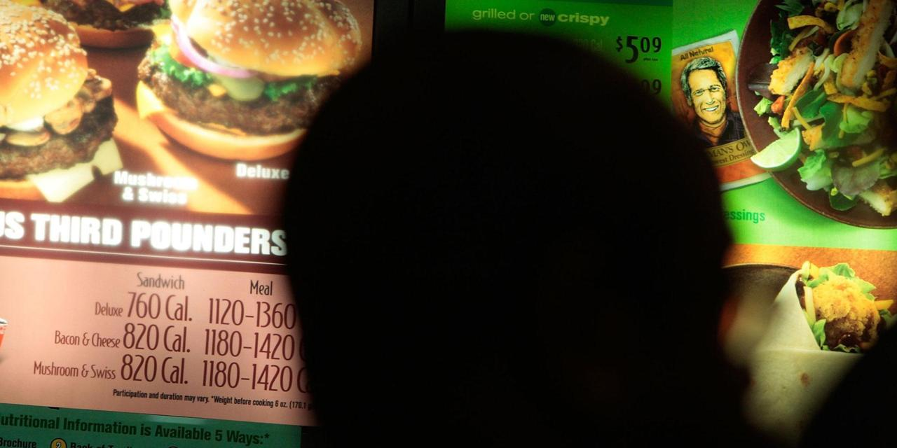
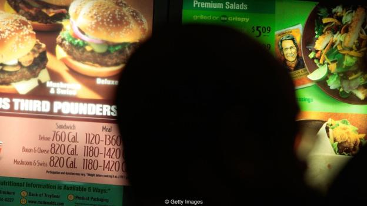
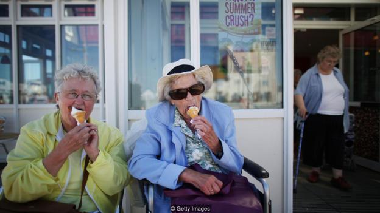
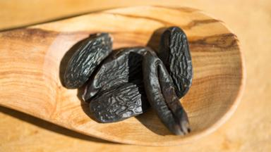
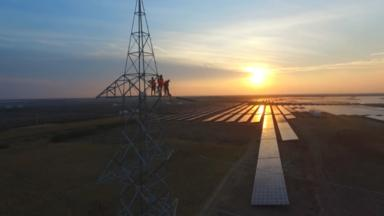

The secret to a long and healthy life? Eat less

 

- [In Depth](http://www.bbc.com/future/columns/in-depth)

- [Food](http://www.bbc.com/future/tags/food)

- [Biology](http://www.bbc.com/future/tags/biology)

# The secret to a long and healthy life? Eat less

Permanently cutting the daily calories you consume may turn out to have a profound effect on your future life, according to some tantalising scientific studies.

- [    .  Share on Facebook](https://www.facebook.com/sharer/sharer.php?u=http%3A%2F%2Fwww.bbc.com%2Ffuture%2Fstory%2F20170601-the-secret-to-a-long-and-healthy-life-eat-less%3Focid%3Dww.social.link.facebook&t=The%20secret%20to%20a%20long%20and%20healthy%20life%3F%20Eat%20less)

- [    .  Share on Twitter](https://twitter.com/intent/tweet?text=The%20secret%20to%20a%20long%20and%20healthy%20life%3F%20Eat%20less&url=http%3A%2F%2Fwww.bbc.com%2Ffuture%2Fstory%2F20170601-the-secret-to-a-long-and-healthy-life-eat-less%3Focid%3Dww.social.link.twitter&via=BBC_Future)

- [    .  Share on Reddit](https://www.reddit.com/submit?url=http%3A%2F%2Fwww.bbc.com%2Ffuture%2Fstory%2F20170601-the-secret-to-a-long-and-healthy-life-eat-less%3Focid%3Dww.social.link.reddit&title=The%20secret%20to%20a%20long%20and%20healthy%20life%3F%20Eat%20less)

- [    .  Share on WhatsApp](http://www.bbc.com/future/story/20170601-the-secret-to-a-long-and-healthy-life-eat-lesswhatsapp://send?text=The%20secret%20to%20a%20long%20and%20healthy%20life%3F%20Eat%20less: http%3A%2F%2Fwww.bbc.com%2Ffuture%2Fstory%2F20170601-the-secret-to-a-long-and-healthy-life-eat-less%3Focid%3Dww.social.link.whatsapp)

- [    .  Share on Google+](https://plus.google.com/share?url=http%3A%2F%2Fwww.bbc.com%2Ffuture%2Fstory%2F20170601-the-secret-to-a-long-and-healthy-life-eat-less%3Focid%3Dww.social.link.googleplus)

- [    .  Share by Email](http://www.bbc.com/future/story/20170601-the-secret-to-a-long-and-healthy-life-eat-lessmailto:?subject=Shared%20from%20BBC:The%20secret%20to%20a%20long%20and%20healthy%20life%3F%20Eat%20less&body=http%3A%2F%2Fwww.bbc.com%2Ffuture%2Fstory%2F20170601-the-secret-to-a-long-and-healthy-life-eat-less%3Focid%3Dww.social.link.email)

- By Alex Riley

 1 June 2017

In a restaurant setting sometime in the not-too distant future, a man and a woman are on their first date. After the initial nerves subside, all is going well.

The man is 33, he says, has been single for most of those years, and, although he doesn’t mention it, knows he is looking to settle down and have a family. The woman replies that she is 52, has been married, divorced, and has children in their early 20s. He had no idea – she looked his age, or younger.

This is a dream of Julie Mattison from the National Institute on Ageing (NIA) in the United States. She envisions a time when chronological age ticks by with every year, but biological age can be set to a different timer, where elderly doesn’t mean what it does now.

It sounds far-fetched, but our society has already made great strides towards that goal, thanks to advances in medicine and improvements in healthy living. In 2014, for instance, the United States Health Interview Survey reported that 16% of people aged between 50 and 64 were impaired every day with chronic illness. Three decades earlier that number was 23%. In other words, as well as benefiting from longer lifespans, we are also experiencing longer “healthspans” – and the latter is proving to be even more malleable. To paraphrase and update a speech from John F Kennedy given at the first White House Conference on Ageing in 1961, life can indeed be added to years, rather than just years added to life.

> \
>  Healthspan is proving to be even more malleable than lifespan

So, what do we need to do to enhance the length and quality of our lives even more? Researchers worldwide are [pursuing various ideas](http://www.bbc.co.uk/science/0/22019289), but for Mattison and colleagues, the answer is a simple change in diet. They believe that the key to a better old age may be to reduce the amount of food on our plates, via an approach called “calorie restriction”. This diet goes further than cutting back on fatty foods from time-to-time; it’s about making gradual and careful reductions in portion size permanently. Since the early 1930s, a 30% reduction in the amount of food consumed per day has been linked to longer, more active lives in worms, flies, rats, mice, and monkeys. Across the animal kingdom, in other words, calorie restriction has proven the best remedy for the ravages of life. And it’s possible that humans have just as much to gain.

   **

High calorie foods can be hard to avoid today (Credit: Getty Images)

The idea that what a person eats influences their health no doubt predates any historical accounts that remain today. But, as is often the case for any scientific discipline, the first detailed accounts come from Ancient Greece. Hippocrates, one of the first physicians to claim diseases were natural and not supernatural, observed that many ailments were associated with gluttony; obese Greeks tended to die younger than slim Greeks, that was clear and written down on papyrus.

Spreading from this epicentre of science, these ideas were adopted and adapted over the centuries. And at the end of the 15th Century, Alvise Cornaro, an infirm aristocrat from a small village near Venice in Italy, turned the prevailing wisdom on its head, and on himself.

If indulgence was harmful, would dietary asceticism be helpful? To find out, Cornaro, aged 40, ate only 350g (12oz) of food per day, roughly 1000 calories according to recent estimates. He ate bread, panatela or broth, and eggs. For meat he chose veal, goat, beef, partridge, thrush, and any poultry that was available. He bought fish caught from the local rivers.

Restricted in amount but not variety, Cornaro claimed to have achieved “perfect health” up until his death more than 40 years later. Although he changed his birthdate as he aged, claiming that he had reached his 98th year, it is thought that he was around 84 when he died – still an impressive feat in the 16th Century, a time when 50 or 60 years old was considered elderly. In 1591, his grandson published his posthumous three-volume tome entitled “Discourses on the Sober Life,” pushing dietary restriction into the mainstream, and redefining ageing itself.

With an additional boost of health into the evening of life, the elderly, in full possession of their mental capacities, would be able to put decades of amassed knowledge to good use, Carnaro claimed. With his diet, beauty became the aged, not the youthful.

**Longevity trials**

Cornaro was an interesting man but his findings are not to be taken as fact by any branch of science. Even if he was true to his word and did not suffer ill health for nearly half a century, which seems unlikely, he was a case study of one – not representative of humans as a whole.

But since a foundational study in 1935 in white rats, a dietary restriction of between 30-50% has been shown to extend lifespan, delaying death from age-related disorders and disease. Of course, what works for a rat or any other laboratory organism might not work for a human.

   **

It may sound obvious, but what you choose to put in your trolley can have a profound effect on the length and quality of your life (Credit: Getty Images)

Long-term trials, following humans from early adulthood to death, are a rarity. “I don’t see a human study of longevity as something that would be a fundable research programme,” says Mattison. “Even if you start humans at 40 or 50 years old, you’re still looking at potentially 40 or 50 more years [of study].” Plus, she adds, ensuring that extraneous factors – exercise, smoking, medical treatments, mental wellbeing – don’t influence the trial’s end results is near impossible for our socially and culturally complex species.

That’s why, in the late 1980s, two independent long-term trials – one at NIA and the other at the University of Wisconsin – were set up to study calorie restriction and ageing in Rhesus monkeys. Not only do we share 93% of our DNA with these primates, we age in the same way too.

Slowly, after middle age (around 15 years in Rhesus monkeys) the back starts to hunch, the skin and muscles start to sag, and, where it still grows, hair goes from gingery brown to grey. The similarities go deeper. In these primates, the occurrence of cancer, diabetes, and heart disease increases in frequency and severity with age. “They’re an excellent model to study ageing,” says Rozalyn Anderson, a gerontologist from the University of Wisconsin.

> \

>  Sherman is the oldest Rhesus monkey ever recorded, nearly 20 years older than the average lifespan for his species in captivity

And they’re easy to control. Fed with specially made biscuits, the diets of the 76 monkeys at the University of Wisconsin and the 121 at NIA are tailored to their age, weight, and natural appetite. All monkeys receive the full complement of nutrients and minerals that their bodies crave. It’s just that half of the monkeys, the calorie restricted (or CR) group, eat 30% less.

They are far from malnourished or starving. Take Sherman, a 43-year-old monkey from NIA. Mattison says that since being placed on the CR diet in 1987, aged 16, Sherman hasn’t shown any overt signs of hunger that are well characterised in his species.

   **

Rhesus monkeys given a stricter, low calorie diet lived longer (Credit: Getty Images)

Sherman is the oldest Rhesus monkey ever recorded, nearly 20 years older than the average lifespan for his species in captivity. As younger monkeys were developing diseases and dying, he seemed to be immune to ageing. Even into his 30s he would have been considered an old monkey, but he didn’t look or act like one.

The same is true, to varying extents, for the rest of his experimental troop at NIA. “We have a lower incidence of diabetes, and lower incidence of cancer in the CR groups,” says Mattison. In 2009, the University of Wisconsin trial published similarly spectacular results.

Not only did their CR monkeys look remarkably younger – with more hair, less sag, and brown instead of grey – than monkeys that were fed a standard diet, they were healthier on the inside too, free from pathology. Cancers, such as the common intestinal adenocarcinoma, were reduced by over 50%. The risk of heart disease was similarly halved. And while 11 of the *ad libitum* (“at one’s pleasure,” in Latin) monkeys developed diabetes and five exhibited signs that they were pre-diabetic, the blood glucose regulation seemed healthy in all CR monkeys. For them, diabetes wasn’t a thing.

Overall, only 13% of the monkeys in the CR group had died of age-related causes in 20 years. In the *ad libitum* group, 37% had died, nearly three times as many. In an update study from the University of Wisconsin in 2014, this percentage remained stable.

> \

>  The results show that ageing itself is a reasonable target for clinical intervention and medical treatment – Rozalyn Anderson

“We have demonstrated that ageing can be manipulated in primates,” says Anderson. “It kind of gets glossed over because it’s obvious, but conceptually that’s hugely important; it means that ageing itself is a reasonable target for clinical intervention and medical treatment.”

If ageing can be delayed, in other words, all of the diseases associated with it will follow suit. “Going after each disease one at a time isn’t going to significantly extend lifespan for people because they’ll die of something else,” says Anderson. “If you cured all cancers, you wouldn’t offset death due to cardiovascular disease, or dementia, or diabetes-associated disorders. Whereas if you go after ageing you can offset the lot in one go.”

   **

Calorie restriction involves a permanent reduction in a diet (Credit: Getty Images)

Eating less certainly seemed to help the monkeys, but calorie restriction is much tougher for people out in the real world. For one, our access to regular, high-calorie meals is now easier than ever; with companies like Deliveroo and UberEats, there is no longer a need to walk to the restaurant anymore. And two, gaining weight simply comes more naturally to some people.

“There’s a huge genetic component to all of this and its much harder work for some people than it is for others to stay trim,” says Anderson. “We all know someone who can eat an entire cake and nothing happens, they look the exact same. And then someone else walks past a table with a cake *on it* and they have to go up a pant size.”

Ideally, the amount and types of food we eat should be tailored to who we are – our genetic predisposition to gaining weight, how we metabolise sugars, how we store fat, and other physiological fluxes that are beyond the scope of scientific instruction at the moment, and perhaps forever.

But a predisposition to obesity can be used as a guide to life choices rather than an inevitability. “I personally have a genetic history of obesity running through my family, and I practice a flexible form of caloric restriction,” says [Susan Roberts](http://hnrca.tufts.edu/people/scientists/q-z/susan-b-roberts-ph-d/) a dietary scientist at Tufts University in Boston. “I keep my BMI at 22, and [have calculated] that that requires eating 80% of what I would eat if my BMI was at 30 like every other member of my family.” Roberts stresses that it isn’t hard – she follows her own weight management programme using [a tool called iDiet](http://theidiet.com/) to help her eat less but avoid feeling hungry or deprived of enjoyment. If this wasn’t possible, she adds, she wouldn’t practise calorie restriction.

Not only has Roberts seen the problems of obesity first-hand in her family, she knows the benefits of CR better than most. For over 10 years she has been a leading scientist in the Comprehensive Assessment of Long-Term Effects of Reducing Intake of Energy trial, also known as Calerie. Over two years, 218 healthy men and women aged between 21 and 50 years were split into two groups.  In one, people were allowed to eat as they normally would (*ad libitum*), while the other ate 25% less (CR). Both had health checks every six months.

Unlike in the Rhesus monkey trials, tests over two years can’t determine whether CR reduces or delays age-related diseases. There simply isn’t enough time for their development. But the Calerie trials tested for the next best thing: the early biological signs of heart disease, cancer, and diabetes.

Published in 2015, the results after two years were very positive. In the blood of calorie-restricted people, the ratio of “good” cholesterol to “bad” cholesterol had increased, molecules associated with tumour formation – called tumour necrosis factors (TNFs) – were reduced by around 25%, and levels of insulin resistance, a sure sign of diabetes, fell by nearly 40% compared to people who ate their normal diets. Overall, the blood’s pressure was lower.

> \

>  Significant health benefits may be garnered in an already healthy body, but further trials are needed

Admittedly, some benefits may come from weight-loss. Earlier trials from Calerie had included people that were obese as well as those with a healthy body mass index (BMI) of 25 or below, and slimming down would have certainly improved the welfare of the heavier participants. “One thing that’s been very clear for a long time is that being overweight or obese is bad for you,” says Roberts. Diseases and disorders previously thought to be age-associated diseases are now popping up in the obese population, she adds.

But the latest results suggested that significant health benefits can be garnered in an already healthy body – a person who isn’t underweight or obese. That is, someone whose BMI lies between 18.5 and 25.

Despite these results, evidence from further trials will be needed before someone with an already healthy BMI should be advised to reduce their calorie intake. (And anyone wanting to change their diet would be advised to consult a medical professional beforehand.)

   **

Elderly life need not be one of disease and illness (Credit: Getty Images)

In the meantime, the scientists will be hoping that their rhesus macaques may help us to understand exactly why calories restriction may have these effects. With nearly 30 years of data on lives and deaths, and blood and tissue samples, from nearly 200 monkeys, the work at NIA and the University of Wisconsin aim to shine a light into the black box of calorie restriction, illuminating just how it delays ageing.

With less food, is the metabolism forced to be more efficient with what it has? Is there a common molecular switch regulating ageing that is turned on (or off) with fewer calories? Or is there an as of yet unknown mechanism underpinning our lives and deaths? The importance of monkeys like Sherman far outspans their lives.

> \

>  Calorie restriction may be one of the most promising avenues for improving health and how long it lasts in our lives

Answers to such questions might be long in coming. “If I cloned 10 of myself and we all worked furiously, I don’t think we’d have it solved,” says Anderson. “The biology is inordinately complicated.” It’s a worthwhile undertaking – understand how CR works and other treatments could then be used to target that specific part of our biology. Ageing could be treated directly, that is, without the need of calorie restriction. “And I think that’s really the golden ticket,” says Anderson.

Although lacking a neat explanation, calorie restriction is one of the most promising avenues for improving health and how long it lasts in our lives. “There was nothing in what we saw that made us think caloric restriction doesn’t work in people,” says Roberts, from the Calerie trial. And, unlike drug-based treatments, it doesn’t come with a long list of possible side effects. “Our people were not hungrier, their mood was fine, their sexual function was fine. We looked pretty hard for bad things and didn’t find them,” says Roberts.

One expected issue was a slight decrease in bone density that is often tied to gradual weight loss, says Roberts. But as a precaution, volunteers were provided with small calcium supplements throughout the trial.

Even with such promising findings, “this [the Calerie trial] is the first study of its kind, and I don’t think that any of us would feel confident in saying, ‘okay, we’re going to recommend this to everyone in the world,’” says Roberts. “But it’s a really exciting prospect. I think that delaying the progression of chronic diseases is something that everyone can get behind and get excited about, because nobody wants to live life with one of those.”

*Alex Riley is a writer based in Berlin, Germany. He tweets as *[***@riley__alex***](https://twitter.com/riley__alex)*.*

*Disclaimer**

 **All content within this story is provided for general information only, and should not be treated as a substitute for the medical advice of your own doctor or any other health care professional. The BBC is not responsible or liable for any diagnosis made by a user based on the content of this site. The BBC is not liable for the contents of any external internet sites listed, nor does it endorse any commercial product or service mentioned or advised on any of the sites. Always consult your own GP if you're in any way concerned about your health.*

*Join 800,000+ Future fans by liking us on *[***Facebook***](https://www.facebook.com/BBCFuture)*, or follow us on *[***Twitter***](https://twitter.com/bbc_future)*.*

## Share this article:

- [    .  Share on Facebook](https://www.facebook.com/sharer/sharer.php?u=http%3A%2F%2Fwww.bbc.com%2Ffuture%2Fstory%2F20170601-the-secret-to-a-long-and-healthy-life-eat-less%3Focid%3Dww.social.link.facebook&t=The%20secret%20to%20a%20long%20and%20healthy%20life%3F%20Eat%20less)

- [    .  Share on Twitter](https://twitter.com/intent/tweet?text=The%20secret%20to%20a%20long%20and%20healthy%20life%3F%20Eat%20less&url=http%3A%2F%2Fwww.bbc.com%2Ffuture%2Fstory%2F20170601-the-secret-to-a-long-and-healthy-life-eat-less%3Focid%3Dww.social.link.twitter&via=BBC_Future)

- [    .  Share on Reddit](https://www.reddit.com/submit?url=http%3A%2F%2Fwww.bbc.com%2Ffuture%2Fstory%2F20170601-the-secret-to-a-long-and-healthy-life-eat-less%3Focid%3Dww.social.link.reddit&title=The%20secret%20to%20a%20long%20and%20healthy%20life%3F%20Eat%20less)

- [    .  Share on WhatsApp](http://www.bbc.com/future/story/20170601-the-secret-to-a-long-and-healthy-life-eat-lesswhatsapp://send?text=The%20secret%20to%20a%20long%20and%20healthy%20life%3F%20Eat%20less: http%3A%2F%2Fwww.bbc.com%2Ffuture%2Fstory%2F20170601-the-secret-to-a-long-and-healthy-life-eat-less%3Focid%3Dww.social.link.whatsapp)

- [    .  Share on Google+](https://plus.google.com/share?url=http%3A%2F%2Fwww.bbc.com%2Ffuture%2Fstory%2F20170601-the-secret-to-a-long-and-healthy-life-eat-less%3Focid%3Dww.social.link.googleplus)

- [    .  Share by Email](http://www.bbc.com/future/story/20170601-the-secret-to-a-long-and-healthy-life-eat-lessmailto:?subject=Shared%20from%20BBC:The%20secret%20to%20a%20long%20and%20healthy%20life%3F%20Eat%20less&body=http%3A%2F%2Fwww.bbc.com%2Ffuture%2Fstory%2F20170601-the-secret-to-a-long-and-healthy-life-eat-less%3Focid%3Dww.social.link.email)

## Related Stories

- 

 [ ### The secrets of living to 200](http://www.bbc.com/future/story/20150915-the-secrets-of-living-to-200-years-old)

- 

 [ ### Can meditation delay ageing?](http://www.bbc.com/future/story/20140701-can-meditation-delay-ageing)

- 

 [ ### Why do women live longer than men?](http://www.bbc.com/future/story/20151001-why-women-live-longer-than-men)

## Follow BBC Future

- [   Facebook](https://www.facebook.com/BBCFuture)

- [   Twitter](https://twitter.com/BBC_FUTURE)

## The Best Of Future

 

 [ ### How Western civilisation could collapse](http://www.bbc.com/future/story/20170418-how-western-civilisation-could-collapse)

 

 [ ### The habits that reveal personalities](http://www.bbc.com/future/story/20170518-the-everyday-habits-that-reveal-our-personalities)

 

 [ ### The world's most beautiful language?](http://www.bbc.com/future/story/20170525-the-people-who-speak-in-whistles)

 

 [ ### Miami’s fight against rising seas](http://www.bbc.com/future/story/20170403-miamis-fight-against-sea-level-rise)

## More amazing Future stories

- 

 [ ### The flavour that’s illegal](http://www.bbc.com/future/story/20170620-the-delicious-flavour-with-a-toxic-secret)

- 

 [ ### Is nuclear power worth it?](http://www.bbc.com/future/story/20170622-how-will-we-manage-nuclear-energy-in-the-21st-century)

- [     **](http://www.bbc.com/future/story/20170621-meet-the-worlds-most-powerful-computer)

 [ ### The world’s most powerful computer](http://www.bbc.com/future/story/20170621-meet-the-worlds-most-powerful-computer)

- 

 [ ### The hidden treasures of a jet scrapyard](http://www.bbc.com/future/story/20170620-the-place-where-airplanes-go-to-die)

- [     **](http://www.bbc.com/future/gallery/20170619-inside-indias-humungous-solar-plant)

 [ ### Inside India’s humongous solar plant](http://www.bbc.com/future/gallery/20170619-inside-indias-humungous-solar-plant)

- 

 [ ### The man who makes you see the invisible](http://www.bbc.com/future/story/20170614-thermal-imaging-reveals-the-hidden-heat-lost-from-your-home)