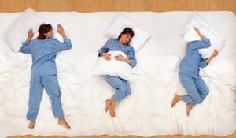
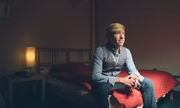
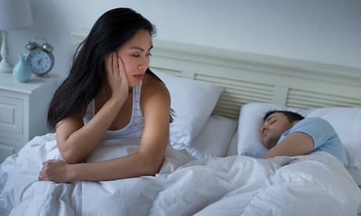
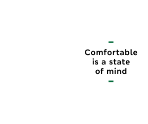

The shorter your sleep, the shorter your life: the new sleep science

Scientists count anything less than seven hours’ sleep as sleep deprivation. Photograph: Ian Hooton/Science Photo Library/Getty Images/Science Photo Library RF

[Sleep](https://www.theguardian.com/lifeandstyle/sleep)
[The Observer](https://www.theguardian.com/observer)

# The shorter your sleep, the shorter your life: the new sleep science

Leading neuroscientist Matthew Walker on why sleep deprivation is increasing our risk of cancer, heart attack and Alzheimer’s – and what you can do about it

- [(L)](https://www.facebook.com/dialog/share?app_id=180444840287&href=https%3A%2F%2Fwww.theguardian.com%2Flifeandstyle%2F2017%2Fsep%2F24%2Fwhy-lack-of-sleep-health-worst-enemy-matthew-walker-why-we-sleep%3FCMP%3Dshare_btn_fb)
- [(L)](https://twitter.com/intent/tweet?text=The%20shorter%20your%20sleep%2C%20the%20shorter%20your%20life%3A%20the%20new%20sleep%20science&url=https%3A%2F%2Fwww.theguardian.com%2Flifeandstyle%2F2017%2Fsep%2F24%2Fwhy-lack-of-sleep-health-worst-enemy-matthew-walker-why-we-sleep%3FCMP%3Dshare_btn_tw)
- [(L)](https://www.theguardian.com/lifeandstyle/2017/sep/24/why-lack-of-sleep-health-worst-enemy-matthew-walker-why-we-sleep?utm_source=nextdraft&utm_medium=emailmailto:?subject=The%20shorter%20your%20sleep%2C%20the%20shorter%20your%20life%3A%20the%20new%20sleep%20science&body=https%3A%2F%2Fwww.theguardian.com%2Flifeandstyle%2F2017%2Fsep%2F24%2Fwhy-lack-of-sleep-health-worst-enemy-matthew-walker-why-we-sleep%3FCMP%3Dshare_btn_link)

-

### Shares

125,738

[ ###   Comments   1,290](https://www.theguardian.com/lifeandstyle/2017/sep/24/why-lack-of-sleep-health-worst-enemy-matthew-walker-why-we-sleep?utm_source=nextdraft&utm_medium=email#comments)

[Rachel Cooke](https://www.theguardian.com/profile/rachelcooke)
[@msrachelcooke](https://twitter.com/msrachelcooke)
Sunday 24 September 2017 08.00 BST

Matthew Walker has learned to dread the question “What do you do?” At parties, it signals the end of his evening; thereafter, his new acquaintance will inevitably cling to him like ivy. On an aeroplane, it usually means that while everyone else watches movies or reads a thriller, he will find himself running an hours-long salon for the benefit of passengers and crew alike. “I’ve begun to lie,” he says. “Seriously. I just tell people I’m a dolphin trainer. It’s better for everyone.”

Walker is a sleep scientist. To be specific, he is the director of the Center for Human [Sleep](https://www.theguardian.com/lifeandstyle/sleep) Science at the University of California, Berkeley, a research institute whose goal – possibly unachievable – is to understand everything about sleep’s impact on us, from birth to death, in sickness and health. No wonder, then, that people long for his counsel. As the line between work and leisure grows ever more blurred, rare is the person who *doesn’t* worry about their sleep. But even as we contemplate the shadows beneath our eyes, most of us don’t know the half of it – and perhaps this is the real reason he has stopped telling strangers how he makes his living. When Walker talks about sleep he can’t, in all conscience, limit himself to whispering comforting nothings about camomile tea and warm baths. It’s his conviction that we are in the midst of a “catastrophic sleep-loss epidemic”, the consequences of which are far graver than any of us could imagine. This situation, he believes, is only likely to change if government gets involved.

 

#   [The Guardian's Science Weekly/ A neuroscientist explains: the need for ‘empathetic citizens’ - podcast]()

What is the neuroscience behind empathy? When do children develop it? And can it be taught?

Listen

 [(L)](https://www.theguardian.com/science/audio/2017/feb/05/a-neuroscientist-explains-the-need-for-empathetic-citizens-podcast)

Walker has spent the last four and a half years writing [*Why We Sleep*](https://www.penguin.co.uk/books/295665/why-we-sleep/), a complex but urgent book that examines the effects of this epidemic close up, the idea being that once people know of the powerful links between sleep loss and, among other things, Alzheimer’s disease, cancer, diabetes, obesity and poor mental health, they will try harder to get the recommended eight hours a night (sleep deprivation, amazing as this may sound to Donald Trump types, constitutes anything less than seven hours). But, in the end, the individual can achieve only so much. Walker wants major institutions and law-makers to take up his ideas, too. “No aspect of our biology is left unscathed by sleep deprivation,” he says. “It sinks down into every possible nook and cranny. And yet no one is doing anything about it. Things have to change: in the workplace and our communities, our homes and families. But when did you ever see an NHS poster urging sleep on people? When did a doctor prescribe, not sleeping pills, but sleep itself? It needs to be prioritised, even incentivised. Sleep loss costs the UK economy over £30bn a year in lost revenue, or 2% of GDP. I could double the NHS budget if only they would institute policies to mandate or powerfully encourage sleep.”

> I get on a flight at 10am when people should be at peak alert, and half of the plane has immediately fallen asleep

Why, exactly, are we so sleep-deprived? What has happened over the course of the last 75 years? In 1942, less than 8% of the population was trying to survive on six hours or less sleep a night; in 2017, almost one in two people is. The reasons are seemingly obvious. “First, we electrified the night,” Walker says. “Light is a profound degrader of our sleep. Second, there is the issue of work: not only the porous borders between when you start and finish, but longer commuter times, too. No one wants to give up time with their family or entertainment, so they give up sleep instead. And anxiety plays a part. We’re a lonelier, more depressed society. Alcohol and caffeine are more widely available. All these are the enemies of sleep.”

But Walker believes, too, that in the developed world sleep is strongly associated with weakness, even shame. “We have stigmatised sleep with the label of laziness. We want to seem busy, and one way we express that is by proclaiming how little sleep we’re getting. It’s a badge of honour. When I give lectures, people will wait behind until there is no one around and then tell me quietly: ‘I seem to be one of those people who need eight or nine hours’ sleep.’ It’s embarrassing to say it in public. They would rather wait 45 minutes for the confessional. They’re convinced that they’re abnormal, and why wouldn’t they be? We chastise people for sleeping what are, after all, only sufficient amounts. We think of them as slothful. No one would look at an infant baby asleep, and say ‘What a lazy baby!’ We know sleeping is non-negotiable for a baby. But that notion is quickly abandoned [as we grow up]. Humans are the only species that deliberately deprive themselves of sleep for no apparent reason.” In case you’re wondering, the number of people who can survive on five hours of sleep or less without any impairment, expressed as a percent of the population and rounded to a whole number, is zero.

The world of sleep science is still relatively small. But it is growing exponentially, thanks both to demand (the multifarious and growing pressures caused by the epidemic) and to new technology (such as electrical and magnetic brain stimulators), which enables researchers to have what Walker describes as “VIP access” to the sleeping brain. Walker, who is 44 and was born in Liverpool, has been in the field for more than 20 years, having published his first research paper at the age of just 21. “I would love to tell you that I was fascinated by conscious states from childhood,” he says. “But in truth, it was accidental.” He started out studying for a medical degree in Nottingham. But having discovered that doctoring wasn’t for him – he was more enthralled by questions than by answers – he switched to neuroscience, and after graduation, began a PhD in neurophysiology supported by the Medical Research Council. It was while working on this that he stumbled into the realm of sleep.

  Matthew Walker photographed in his sleep lab. Photograph: Saroyan Humphrey for the Observer

“I was looking at the brainwave patterns of people with different forms of dementia, but I was failing miserably at finding any difference between them,” he recalls now. One night, however, he read a scientific paper that changed everything. It described which parts of the brain were being attacked by these different types of dementia: “Some were attacking parts of the brain that had to do with controlled sleep, while other types left those sleep centres unaffected. I realised my mistake. I had been measuring the brainwave activity of my patients while they were awake, when I should have been doing so while they were asleep.” Over the next six months, Walker taught himself how to set up a sleep laboratory and, sure enough, the recordings he made in it subsequently spoke loudly of a clear difference between patients. Sleep, it seemed, could be a new early diagnostic litmus test for different subtypes of dementia.

Advertisement

After this, sleep became his obsession. “Only then did I ask: what is this thing called sleep, and what does it do? I was always curious, annoyingly so, but when I started to read about sleep, I would look up and hours would have gone by. No one could answer the simple question: why do we sleep? That seemed to me to be the greatest scientific mystery. I was going to attack it, and I was going to do that in two years. But I was naive. I didn’t realise that some of the greatest scientific minds had been trying to do the same thing for their entire careers. That was two decades ago, and I’m still cracking away.” After gaining his doctorate, he moved to the US. Formerly a professor of psychiatry at Harvard Medical School, he is now professor of neuroscience and psychology at the University of California.

Does his obsession extend to the bedroom? Does he take his own advice when it comes to sleep? “Yes. I give myself a non-negotiable eight-hour sleep opportunity every night, and I keep very regular hours: if there is one thing I tell people, it’s to go to bed and to wake up at the same time every day, no matter what. I take my sleep incredibly seriously because I have seen the evidence. Once you know that after just one night of only four or five hours’ sleep, your natural killer cells – the ones that attack the cancer cells that appear in your body every day – drop by 70%, or that a lack of sleep is linked to cancer of the bowel, prostate and breast, or even just that the World Health Organisation has classed any form of night-time shift work as a probable carcinogen, how could you do anything else?”

There is, however, a sting in the tale. Should his eyelids fail to close, Walker admits that he can be a touch “Woody Allen-neurotic”. When, for instance, he came to London over the summer, he found himself jet-lagged and wide awake in his hotel room at two o’clock in the morning. His problem then, as always in these situations, was that he knew too much. His brain began to race. “I thought: my orexin isn’t being turned off, the sensory gate of my thalamus is wedged open, my dorsolateral prefrontal cortex won’t shut down, and my melatonin surge won’t happen for another seven hours.” What did he do? In the end, it seems, even world experts in sleep act just like the rest of us when struck by the curse of insomnia. He turned on a light and read for a while.

 

#   [Can too little sleep ruin your relationship?]()

Read more

 [(L)](https://www.theguardian.com/lifeandstyle/2017/sep/11/too-little-sleep-ruins-relationships)

Will *Why We Sleep* have the impact its author hopes? I’m not sure: the science bits, it must be said, require some concentration. But what I can tell you is that it had a powerful effect on me. After reading it, I was absolutely determined to go to bed earlier – a regime to which I am sticking determinedly. In a way, I was prepared for this. I first encountered Walker some months ago, when he spoke at an event at Somerset House in London, and he struck me then as both passionate and convincing (our later interview takes place via Skype from the basement of his “sleep centre”, a spot which, with its bedrooms off a long corridor, apparently resembles the ward of a private hospital). But in another way, it was unexpected. I am mostly immune to health advice. Inside my head, there is always a voice that says “just enjoy life while it lasts”.

Advertisement

The evidence Walker presents, however, is enough to send anyone early to bed. It’s no kind of choice at all. Without sleep, there is low energy and disease. With sleep, there is vitality and health. More than 20 large scale epidemiological studies all report the same clear relationship: the shorter your sleep, the shorter your life. To take just one example, adults aged 45 years or older who sleep less than six hours a night are 200% more likely to have a heart attack or stroke in their lifetime, as compared with those sleeping seven or eight hours a night (part of the reason for this has to do with blood pressure: even just one night of modest sleep reduction will speed the rate of a person’s heart, hour upon hour, and significantly increase their blood pressure).

A lack of sleep also appears to hijack the body’s effective control of blood sugar, the cells of the sleep-deprived appearing, in experiments, to become less responsive to insulin, and thus to cause a prediabetic state of hyperglycaemia. When your sleep becomes short, moreover, you are susceptible to weight gain. Among the reasons for this are the fact that inadequate sleep decreases levels of the satiety-signalling hormone, leptin, and increases levels of the hunger-signalling hormone, ghrelin. “I’m not going to say that the obesity crisis is caused by the sleep-loss epidemic alone,” says Walker. “It’s not. However, processed food and sedentary lifestyles do not adequately explain its rise. Something is missing. It’s now clear that sleep is that third ingredient.” Tiredness, of course, also affects motivation.

Sleep has a powerful effect on the immune system, which is why, when we have flu, our first instinct is to go to bed: our body is trying to sleep itself well. Reduce sleep even for a single night, and your resilience is drastically reduced. If you are tired, you are more likely to catch a cold. The well-rested also respond better to the flu vaccine. As Walker has already said, more gravely, studies show that short sleep can affect our cancer-fighting immune cells. A number of epidemiological studies have reported that night-time shift work and the disruption to circadian sleep and rhythms that it causes increase the odds of developing cancers including breast, prostate, endometrium and colon.

Getting too little sleep across the adult lifespan will significantly raise your risk of developing Alzheimer’s disease. The reasons for this are difficult to summarise, but in essence it has to do with the amyloid deposits (a toxin protein) that accumulate in the brains of those suffering from the disease, killing the surrounding cells. During deep sleep, such deposits are effectively cleaned from the brain. What occurs in an Alzheimer’s patient is a kind of vicious circle. Without sufficient sleep, these plaques build up, especially in the brain’s deep-sleep-generating regions, attacking and degrading them. The loss of deep sleep caused by this assault therefore lessens our ability to remove them from the brain at night. More amyloid, less deep sleep; less deep sleep, more amyloid, and so on. (In his book, Walker notes “unscientifically” that he has always found it curious that Margaret Thatcher and Ronald Reagan, both of whom were vocal about how little sleep they needed, both went on to develop the disease; it is, moreover, a myth that older adults need less sleep.) Away from dementia, sleep aids our ability to make new memories, and restores our capacity for learning.

Advertisement

And then there is sleep’s effect on mental health. When your mother told you that everything would look better in the morning, she was wise. Walker’s book includes a long section on dreams (which, says Walker, contrary to Dr Freud, cannot be analysed). Here he details the various ways in which the dream state connects to creativity. He also suggests that dreaming is a soothing balm. If we sleep to remember (see above), then we also sleep to forget. Deep sleep – the part when we begin to dream – is a therapeutic state during which we cast off the emotional charge of our experiences, making them easier to bear. Sleep, or a lack of it, also affects our mood more generally. Brain scans carried out by Walker revealed a 60% amplification in the reactivity of the amygdala – a key spot for triggering anger and rage – in those who were sleep-deprived. In children, sleeplessness has been linked to aggression and bullying; in adolescents, to suicidal thoughts. Insufficient sleep is also associated with relapse in addiction disorders. A prevailing view in psychiatry is that mental disorders cause sleep disruption. But Walker believes it is, in fact, a two-way street. Regulated sleep can improve the health of, for instance, those with bipolar disorder.

I’ve mentioned deep sleep in this (too brief) summary several times. What is it, exactly? We sleep in 90-minute cycles, and it’s only towards the end of each one of these that we go into deep sleep. Each cycle comprises two kinds of sleep. First, there is NREM sleep (non-rapid eye movement sleep); this is then followed by REM (rapid eye movement) sleep. When Walker talks about these cycles, which still have their mysteries, his voice changes. He sounds bewitched, almost dazed.

#           [The real marker of adulthood is admitting you need sleep]()

Nosheen Iqbal

 

Read more

 [(L)](https://www.theguardian.com/commentisfree/2017/sep/19/marker-adulthood-need-sleep-new-report-happiness-bed-boring-obsession)

“During NREM sleep, your brain goes into this incredible synchronised pattern of rhythmic chanting,” he says. “There’s a remarkable unity across the surface of the brain, like a deep, slow mantra. Researchers were once fooled that this state was similar to a coma. But nothing could be further from the truth. Vast amounts of memory processing is going on. To produce these brainwaves, hundreds of thousands of cells all sing together, and then go silent, and on and on. Meanwhile, your body settles into this lovely low state of energy, the best blood-pressure medicine you could ever hope for. REM sleep, on the other hand, is sometimes known as paradoxical sleep, because the brain patterns are identical to when you’re awake. It’s an incredibly active brain state. Your heart and nervous system go through spurts of activity: we’re still not exactly sure why.”

Does the 90-minute cycle mean that so-called power naps are worthless? “They can take the edge off basic sleepiness. But you need 90 minutes to get to deep sleep, and one cycle isn’t enough to do all the work. You need four or five cycles to get all the benefit.” Is it possible to have too much sleep? This is unclear. “There is no good evidence at the moment. But I do think 14 hours is too much. Too much water can kill you, and too much food, and I think ultimately the same will prove to be true for sleep.” How is it possible to tell if a person is sleep-deprived? Walker thinks we should trust our instincts. Those who would sleep on if their alarm clock was turned off are simply not getting enough. Ditto those who need caffeine in the afternoon to stay awake. “I see it all the time,” he says. “I get on a flight at 10am when people should be at peak alert, and I look around, and half of the plane has immediately fallen asleep.”

Advertisement

 

 

    

So what can the individual do? First, they should avoid pulling “all-nighters”, at their desks or on the dancefloor. After being awake for 19 hours, you’re as cognitively impaired as someone who is drunk. Second, they should start thinking about sleep as a kind of work, like going to the gym (with the key difference that it is both free and, if you’re me, enjoyable). “People use alarms to wake up,” Walker says. “So why don’t we have a bedtime alarm to tell us we’ve got half an hour, that we should start cycling down?” We should start thinking of midnight more in terms of its original meaning: as the middle of the night. Schools should consider later starts for students; such delays correlate with improved IQs. Companies should think about rewarding sleep. Productivity will rise, and motivation, creativity and even levels of honesty will be improved. Sleep can be measured using tracking devices, and some far-sighted companies in the US already give employees time off if they clock enough of it. Sleeping pills, by the way, are to be avoided. Among other things, they can have a deleterious effect on memory.

Those who are focused on so-called “clean” sleep are determined to outlaw mobiles and computers from the bedroom – and quite right, too, given the effect of LED-emitting devices on melatonin, the sleep-inducing hormone. Ultimately, though, Walker believes that technology will be sleep’s saviour. “There is going to be a revolution in the quantified self in industrial nations,” he says. “We will know everything about our bodies from one day to the next in high fidelity. That will be a seismic shift, and we will then start to develop methods by which we can amplify different components of human sleep, and do that from the bedside. Sleep will come to be seen as a preventive medicine.”

What questions does Walker still most want to answer? For a while, he is quiet. “It’s so difficult,” he says, with a sigh. “There are so many. I would still like to know where we go, psychologically and physiologically, when we dream. Dreaming is the second state of human consciousness, and we have only scratched the surface so far. But I would also like to find out when sleep emerged. I like to posit a ridiculous theory, which is: perhaps sleep did not evolve. Perhaps it was the thing from which wakefulness emerged.” He laughs. “If I could have some kind of medical Tardis and go back in time to look at that, well, I would sleep better at night.”

*• Why We Sleep: The New Science of Sleep and Dreams* by Matthew Walker is published by Allen Lane (£20). To order a copy for £17 go to [guardianbookshop.com](https://www.guardianbookshop.com/why-we-sleep.html) or call 0330 333 6846. Free UK p&p over £10, online orders only. Phone orders min p&p of £1.99

## Sleep in numbers

■ Two-thirds of adults in developed nations fail to obtain the nightly eight hours of sleep recommended by the World Health Organisation.

Advertisement

■ An adult sleeping only 6.75 hours a night would be predicted to live only to their early 60s without medical intervention.

■ A 2013 study reported that men who slept too little had a sperm count 29% lower than those who regularly get a full and restful night’s sleep.

■ If you drive a car when you have had less than five hours’ sleep, you are 4.3 times more likely to be involved in a crash. If you drive having had four hours, you are 11.5 times more likely to be involved in an accident.

■ A hot bath aids sleep not because it makes you warm, but because your dilated blood vessels radiate inner heat, and your core body temperature drops. To successfully initiate sleep, your core temperature needs to drop about 1C.

■ The time taken to reach physical exhaustion by athletes who obtain anything less than eight hours of sleep, and especially less than six hours, drops by 10-30%.

■ There are now more than 100 diagnosed sleep disorders, of which insomnia is the most common.

■ Morning types, who prefer to awake at or around dawn, make up about 40% of the population. Evening types, who prefer to go to bed late and wake up late, account for about 30%. The remaining 30% lie somewhere in between.

##  Since you’re here …

… we have a small favour to ask. More people are reading the Guardian than ever but advertising revenues across the media are falling fast. And unlike many news organisations, we haven’t put up a paywall – we want to keep our journalism as open as we can. So you can see why we need to ask for your help. The Guardian’s independent, investigative journalism takes a lot of time, money and hard work to produce. But we do it because we believe our perspective matters – because it might well be your perspective, too.

>  I appreciate there not being a paywall: it is more democratic for the media to be available for all and not a commodity to be purchased by a few. I’m happy to make a contribution so others with less means still have access to information. >  Thomasine F-R. >

If everyone who reads our reporting, who likes it, helps to support it, our future would be much more secure.

 [Become a supporter](https://membership.theguardian.com/supporter?REFPVID=j83ho21ynyj1f8c6y38r&INTCMP=gdnwb_copts_memco_kr1_epic_ask_four_earning_control&acquisitionData=%7B%22source%22%3A%22GUARDIAN_WEB%22%2C%22componentId%22%3A%22gdnwb_copts_memco_kr1_epic_ask_four_earning_control%22%2C%22componentType%22%3A%22ACQUISITIONS_EPIC%22%2C%22referrerPageviewId%22%3A%22j83ho21ynyj1f8c6y38r%22%2C%22campaignCode%22%3A%22gdnwb_copts_memco_kr1_epic_ask_four_earning_control%22%2C%22abTest%22%3A%7B%22name%22%3A%22ContributionsEpicAskFourEarning%22%2C%22variant%22%3A%22control%22%7D%7D)

 [Make a contribution](https://contribute.theguardian.com/?REFPVID=j83ho21ynyj1f8c6y38r&INTCMP=gdnwb_copts_memco_kr1_epic_ask_four_earning_control&acquisitionData=%7B%22source%22%3A%22GUARDIAN_WEB%22%2C%22componentId%22%3A%22gdnwb_copts_memco_kr1_epic_ask_four_earning_control%22%2C%22componentType%22%3A%22ACQUISITIONS_EPIC%22%2C%22referrerPageviewId%22%3A%22j83ho21ynyj1f8c6y38r%22%2C%22campaignCode%22%3A%22gdnwb_copts_memco_kr1_epic_ask_four_earning_control%22%2C%22abTest%22%3A%7B%22name%22%3A%22ContributionsEpicAskFourEarning%22%2C%22variant%22%3A%22control%22%7D%7D)

Topics

- [Sleep/](https://www.theguardian.com/lifeandstyle/sleep)
- [The Observer/](https://www.theguardian.com/observer)
- [Science and nature/](https://www.theguardian.com/books/scienceandnature)
- [Health & wellbeing/](https://www.theguardian.com/lifeandstyle/health-and-wellbeing)
- [Neuroscience/](https://www.theguardian.com/science/neuroscience)
- [features/](https://www.theguardian.com/tone/features)
- [(L)](https://www.facebook.com/dialog/share?app_id=180444840287&href=https%3A%2F%2Fwww.theguardian.com%2Flifeandstyle%2F2017%2Fsep%2F24%2Fwhy-lack-of-sleep-health-worst-enemy-matthew-walker-why-we-sleep%3FCMP%3Dshare_btn_fb)
- [(L)](https://twitter.com/intent/tweet?text=The%20shorter%20your%20sleep%2C%20the%20shorter%20your%20life%3A%20the%20new%20sleep%20science&url=https%3A%2F%2Fwww.theguardian.com%2Flifeandstyle%2F2017%2Fsep%2F24%2Fwhy-lack-of-sleep-health-worst-enemy-matthew-walker-why-we-sleep%3FCMP%3Dshare_btn_tw)
- [(L)](https://www.theguardian.com/lifeandstyle/2017/sep/24/why-lack-of-sleep-health-worst-enemy-matthew-walker-why-we-sleep?utm_source=nextdraft&utm_medium=emailmailto:?subject=The%20shorter%20your%20sleep%2C%20the%20shorter%20your%20life%3A%20the%20new%20sleep%20science&body=https%3A%2F%2Fwww.theguardian.com%2Flifeandstyle%2F2017%2Fsep%2F24%2Fwhy-lack-of-sleep-health-worst-enemy-matthew-walker-why-we-sleep%3FCMP%3Dshare_btn_link)
- [Share on LinkedIn](http://www.linkedin.com/shareArticle?mini=true&title=The%20shorter%20your%20sleep%2C%20the%20shorter%20your%20life%3A%20the%20new%20sleep%20science&url=https%3A%2F%2Fwww.theguardian.com%2Flifeandstyle%2F2017%2Fsep%2F24%2Fwhy-lack-of-sleep-health-worst-enemy-matthew-walker-why-we-sleep)
- [Share on Pinterest](http://www.pinterest.com/pin/find/?url=https%3A%2F%2Fwww.theguardian.com%2Flifeandstyle%2F2017%2Fsep%2F24%2Fwhy-lack-of-sleep-health-worst-enemy-matthew-walker-why-we-sleep)
- [Share on Google+](https://plus.google.com/share?url=https%3A%2F%2Fwww.theguardian.com%2Flifeandstyle%2F2017%2Fsep%2F24%2Fwhy-lack-of-sleep-health-worst-enemy-matthew-walker-why-we-sleep%3FCMP%3Dshare_btn_gp&amp;hl=en-GB&amp;wwc=1)
- [Share on WhatsApp](https://www.theguardian.com/lifeandstyle/2017/sep/24/why-lack-of-sleep-health-worst-enemy-matthew-walker-why-we-sleep?utm_source=nextdraft&utm_medium=emailwhatsapp://send?text=%22The%20shorter%20your%20sleep%2C%20the%20shorter%20your%20life%3A%20the%20new%20sleep%20science%22%20https%3A%2F%2Fwww.theguardian.com%2Flifeandstyle%2F2017%2Fsep%2F24%2Fwhy-lack-of-sleep-health-worst-enemy-matthew-walker-why-we-sleep%3FCMP%3Dshare_btn_wa)
- [Share on Messenger](https://www.theguardian.com/lifeandstyle/2017/sep/24/why-lack-of-sleep-health-worst-enemy-matthew-walker-why-we-sleep?utm_source=nextdraft&utm_medium=emailfb-messenger://share?link=https%3A%2F%2Fwww.theguardian.com%2Flifeandstyle%2F2017%2Fsep%2F24%2Fwhy-lack-of-sleep-health-worst-enemy-matthew-walker-why-we-sleep%3FCMP%3Dshare_btn_me&app_id=180444840287)