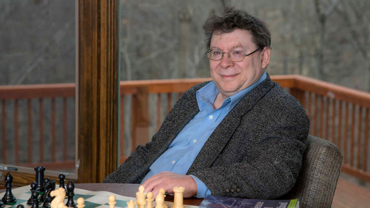
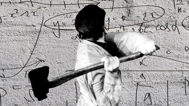
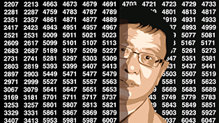
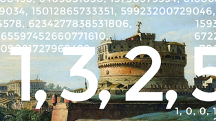

This Man Is About to Blow Up Mathematics - Issue 45: Power - Nautilus

Resume Reading — This Man Is About to Blow Up Mathematics
Close

|     |     |     |
| --- | --- | --- |
| [Numbers](http://nautil.us/term/l/Numbers) |     | [Math](http://nautil.us/term/f/Math) |

# This Man Is About to Blow Up Mathematics

## Harvey Friedman is about to bring incompleteness and infinity out of quarantine.

By Jordana CepelewiczFebruary 23, 2017

- [*c* Add a comment](http://nautil.us/issue/45/power/this-man-is-about-to-blow-up-mathematics#comm)

- [*f* Facebook](https://www.facebook.com/sharer/sharer.php?s=100&p%5Bsite_name%5D=Nautilus&p%5Btype%5D=website&p%5Burl%5D=http%3A%2F%2Fnautil.us%2Fissue%2F45%2Fpower%2Fthis-man-is-about-to-blow-up-mathematics&p%5Btitle%5D=This+Man+Is+About+to+Blow+Up+Mathematics+-+Issue+45%3A+Power+-+Nautilus&p%5Bsummary%5D=It+is+7+o%E2%80%99clock+in+the+morning+and+Harvey+Friedman+has+just+sent+an+email+to+an+unspecified+number+of+recipients+with+the+subject%26%238230%3B&p%5Bimages%5D%5B0%5D=http%3A%2F%2Fstatic.nautil.us%2F11732_3a97a9a154f2f62638393446815456fd.png)

- [*t* Twitter](https://twitter.com/share?url=http%3A%2F%2Fnautil.us%2Fissue%2F45%2Fpower%2Fthis-man-is-about-to-blow-up-mathematics&text=This+Man+Is+About+to+Blow+Up+Mathematics&via=NautilusMag)

- [*m* Email](http://nautil.us/issue/45/power/this-man-is-about-to-blow-up-mathematicsmailto:?subject=Nautilus:%20This%20Man%20Is%20About%20to%20Blow%20Up%20Mathematics&body=I%20saw%20this%20article%20on%20Nautil.us%20and%20wanted%20to%20share%20it%20with%20you.%0D%0A---------------------------%0D%0AThis%20Man%20Is%20About%20to%20Blow%20Up%20Mathematics%0D%0AMath:Harvey%20Friedman%20is%20about%20to%20bring%20incompleteness%20and%20infinity%20out%20of%20quarantine.%0D%0A%0D%0AIt%20is%207%20o%E2%80%99clock%20in%20the%20morning%20and%20Harvey%20Friedman%20has%20just%20sent%20an%20email%20to%20an%20unspecified%20number%20of%20recipients%20with%20the%20subject%20line%20%E2%80%9Cstop%20what%20you%20are%20doing.%0D%0A%0D%0Ahttp://nautil.us/issue/45/power/this-man-is-about-to-blow-up-mathematics)

- [*U* Sharing]()
- [*X* Reddit](http://www.reddit.com/submit?title=This+Man+Is+About+to+Blow+Up+Mathematics&url=http%3A%2F%2Fnautil.us%2Fissue%2F45%2Fpower%2Fthis-man-is-about-to-blow-up-mathematics)

- [*Y* Stumbleupon](http://www.stumbleupon.com/badge/?url=http%3A%2F%2Fnautil.us%2Fissue%2F45%2Fpower%2Fthis-man-is-about-to-blow-up-mathematics)

- [*V* Tumblr](http://tumblr.com/share?s=&v=3&t=This+Man+Is+About+to+Blow+Up+Mathematics&u=http%3A%2F%2Fnautil.us%2Fissue%2F45%2Fpower%2Fthis-man-is-about-to-blow-up-mathematics)

- [*L* Pocket](https://getpocket.com/save?url=http%3A%2F%2Fnautil.us%2Fissue%2F45%2Fpower%2Fthis-man-is-about-to-blow-up-mathematics&title=This+Man+Is+About+to+Blow+Up+Mathematics)

It is 7 o’clock in the morning and Harvey Friedman has just sent an email to an unspecified number of recipients with the subject line “stop what you are doing.” It features a YouTube link to a live 1951 broadcast of a concert by the famous Russian pianist Vladimir Horowitz. “There is a pattern on YouTube of priceless gems getting taken down by copyright claims,” Friedman writes, “so I demand (smile) that you stop everything you are doing, including breathing, eating, thinking, sleeping, and so forth, to listen to this before it disappears.”

His comment takes its place at the top of a chain of emails stretching back months, with roughly as many messages sent at 3 a.m. as at noon or 9 p.m. The haphazard correspondence covers a wide range of topics, from electronic music editing to an interdisciplinary field Friedman calls “ChessMath.” At one point, he proposes to record at home, by himself, a three-part “Emotion Concert.” Anonymous piano players on the email thread discuss their own thoughts on the lineup.

Krista Boccio

As diverse as the topics in the email history are, Friedman asks the same question of them all: What are their basic constituents and what laws govern them? He seems to be searching for the right vocabulary—“the right way,” he says, “of talking about what the fundamental ideas are, to black-box the ad hoc technicalities and get to the real meat of the thing.”

That is not to say all of these topics are equal. There is one that is nearest and dearest to Friedman’s heart: the foundations of mathematics, which concerns itself with the consistency, unity, and structure of mathematics itself. The field has occupied Friedman since his teenage years, when he first read Bertrand Russell’s *Introduction to Mathematical Philosophy*. (If you’re thinking it’s not an easy read, you’re right: “Given any class of mutually exclusive classes, of which none is null, there is at least one class which has exactly one term in common with each of the given classes…”)  And it consumes him still as a 68-year-old retired math professor living on a leafy street in suburban Columbus, Ohio, sleeping for a few hours at a time, twice a day, so as to free up time to think.

The foundations of mathematics is also a field—in stark contrast to the casual and light tone of Friedman’s emails—that has been in crisis for nearly a century. In 1931, the Austrian mathematician and philosopher Kurt Gödel proved that any logical system adequate to develop basic arithmetic gives rise to statements that cannot be proven true or false within that system. One such statement: that the system itself is consistent. In other words, no system can ever prove itself to be free of contradiction. The result seemed to present an insurmountable problem for mathematicians, not so much because it prevented them from ever knowing whether the system their work is built on is consistent (so far there haven’t been inconsistencies), but because it meant their fundamental logic had significant limitations.

> Think of set theory as a hinterland containing strange creatures capable of doing unknown things.

>

Any hope for a unified formal theory of mathematics, an endeavor championed by the mathematician David Hilbert in the 19th century and into the 20th (and taken up by many others), was dashed. The foundations of mathematics could never be as secure as Hilbert wanted: Gödel had effectively shown that every axiomatic system, no matter how comprehensive, is vulnerable to irreparable holes. Filling those holes by creating a stronger system would only yield new statements that cannot be proven—so that an even stronger system would be needed, and so on, ad infinitum.

And so something odd happened: Mathematicians chose to move on. Incompleteness, they decided, had no direct bearing on their own work. The axioms commonly known as ZFC (the Zermelo-Fraenkel axioms plus the axiom of choice) that constitute today’s most commonly used foundation of mathematics provides a rigorous framework for proving theorems. In fact, ZFC turned out to be so comprehensive that most mathematicians today don’t use the entire extent of its machinery anyway. “You can carry out Hilbert’s program in a pretty sweeping way,” says Stephen Simpson, a mathematician at Vanderbilt University, “for something like 85 percent of mathematics.” Statements whose proofs do require something stronger than ZFC are long-winded and esoteric—contrived, artificial renderings of the self-referential sentence “I am not provable” and the like. Philosophically interesting, but safely ignored when doing “core” mathematics.

Left out in the cold, Gödel’s incompleteness made its home in set theory, the formalized study of collections of objects and different levels of infinity. All other branches of mathematics can be expressed in the language of set theory—that’s how anything is formally proven—but set theory itself stretches far beyond ZFC. Think of it as a hinterland containing strange creatures capable of doing unknown things—the land beyond the wall, if you’re a *Game of Thrones* fan. Set theorists can construct proofs using large cardinals, which deal with higher levels of infinity and are too large to be proven to exist within ZFC. They can dive headfirst into paradoxes, proving, say, that a three-dimensional sphere can be decomposed into pieces that, when put back together, form two spheres identical to the original.

As powerful and potentially disruptive as mathematics outside the wall is, its concepts are so abstract that, like incompleteness, they have been largely ignored by the rest of the mathematical community. Some even refer to them as “unnatural.” Most mathematicians would never consider crossing the wall between ZFC and the rest of mathematics.

But that is exactly what Friedman has done. What’s more, he wants to bring back what he’s found, and break incompleteness out of its quarantine. For the past 50 years—more than 100,000 hours, he’s fond of saying—he has searched for a new theory, one that will introduce “natural” ways for incompleteness and large cardinals to become entangled in the everyday workings of finite mathematics.

Now, he believes he’s finally broken through.

When he was just starting to read, at age 4 or 5, Friedman remembers pointing to a dictionary and asking his mother what it was. It’s used to find out what words mean, she explained. A few days later, he returned to her with his verdict: The volume was completely worthless. For every word he’d looked up, the dictionary had taken him in circles: from “large” to “big” to “great” and so on, until he eventually arrived back at “large” again. “She just looked at me as if I were a really strange, peculiar child,” Friedman laughs.

That was Friedman’s first brush with foundational thinking. It would continue cropping up in innocuous places: Shortly after his introduction to the dictionary, for example, he noticed that changing the order of the items listed on his parents’ grocery bill didn’t affect the total price they ended up paying. He didn’t yet know the name for this property, but it struck a chord.

[Also in Math](http://nautil.us/term/f/Math)

#### [Science’s Significant Stats Problem](http://nautil.us/issue/4/The%20Unlikely/sciences-significant-stats-problem)

By Tom Siegfried

In 2009, researchers working in Thailand made headlines with a small success in a trial of an HIV vaccine. It reduced the rate of infection by 31 percent, the scientists calculated. That may not sound impressive, but in the fight...**[READ MORE](http://nautil.us/issue/4/The%20Unlikely/sciences-significant-stats-problem)**

It didn’t take long for his parents, who both worked in the photo typesetting business and never graduated from college, to recognize his aptitude for math. His father, Friedman says, initially had hopes of his becoming an engineer—but more than happily encouraged his budding interest in mathematics. One day, Friedman’s father came home with a ninth-grade algebra textbook he’d asked to borrow from the son of a family friend who lived down the street. Go ahead and learn this, he told his own son. Friedman quickly devoured the material. He was 9 years old.

His two siblings also demonstrated a keen quantitative sense early on. His younger sister went on to study engineering, just as their father had hoped, later working as a computer programmer at IBM; his younger brother, five years his junior, also studies mathematical logic.

Friedman found himself on the fast track to foundational pursuits. He skipped two grades, attended college-run summer programs for gifted students, and absorbed everything he could get his hands on—ultimately leading him to Russell’s introductory text. Decades later, Friedman still remembers its final sentences. “As the above hasty survey must have made evident,” Russell had written, “there are innumerable unsolved problems in the subject, and much work needs to be done. If any student is led into a serious study of mathematical logic by this little book, it will have served the chief purpose for which it has been written.”

> No system can ever prove itself to be free of contradiction.
>

The book certainly served its purpose with Friedman, who eventually decided that he had to solve those “innumerable unsolved problems.” At age 16, he passed over college altogether to enter graduate school at the Massachusetts Institute of Technology, where he immediately sought out mathematician Hilary Putnam. The following semester, he took one of Putnam’s classes, and by his third and final year, he had formulated an agenda of sorts. He would start by working on the foundations of mathematics, he told himself, and then, after spending a few years on that, would move on to other disciplines: the foundations of mechanics, of statistics, of law, of music. The foundations of everything.

After earning his doctorate in mathematics at the age of 18, he became the world’s youngest professor, according to the *Guinness Book of World Records*. Friedman went on to teach philosophy and math at various universities, including Stanford University and Ohio State, before retiring in 2012. He now lives in Columbus, Ohio, with his wife of 24 years, Judith Schwartz, a retired psychotherapist. This July, he’ll head to Philadelphia, where researchers at the University of Pennsylvania’s Imagination Institute will scan his brain, along with those of another half a dozen polymaths.

Throughout his extraordinary career, Friedman has never forgotten his first step toward the foundations of mathematics, which proved to be richer (a greater “thrill,” in his words) than he imagined.

Early on, Friedman understood that discovering concrete examples of mathematical incompleteness among already-existing statements would be an arduous task. There’s the continuum hypothesis, the Paris-Harrington theorem, some types of determinacy—but they’re few and far between. So he set out to write his own using a theory he built, called emulation theory. It uses objects from the natural core of mathematics: rational numbers, or fractions of two integers. Rational numbers exist at a very low level of the set-theoretic universe, and mathematicians feel perfectly comfortable with them. But through emulation theory, Friedman revealed a stunning, hidden complexity in them—and a path to the land beyond ZFC.

He forged that path by comparing sets of points whose coordinates are rational numbers between zero and 1. One set is said to “emulate” another if both share certain patterns and symmetries; the set is a “maximal emulation” if new points can’t be added to it without breaking its emulation of the other set. This relatively simple platform of normal-looking numbers is Friedman’s launching pad for math beyond ZFC.

For example, Friedman has shown that proving theorems about which kinds of sets have maximal emulations requires math beyond ZFC. One such theorem has to do with a type of symmetry called drop symmetry, which concerns itself with the kinds of points encountered by dropping a line from a given point. Two “drops” are symmetric if the points encountered by those lines share certain patterns.

**Large cardinals are coming:** Understanding and describing higher infinities, known as large cardinals, has been kept separate from most modern mathematics. Friedman is working to make large cardinals broadly relevant, entangling even pedestrian mathematics with foundational questions.Photofest

Friedman proved that for any set in the rational cube (from three to an arbitrary number of dimensions), there is a maximal emulation with drop symmetry between specific pairs of points. To prove that theorem and identify the points for which it holds, he had to rely on a system stronger than ZFC. That is to say, it cannot be refuted, nor can it be proven, in ZFC.

Showing the theorem is not refutable is a pretty standard (although certainly not simple) process: Demonstrate that it logically follows from the consistency of large cardinal axioms. Showing it’s not provable, on the other hand, is more difficult. He did this with a proof by contradiction: He began with the assumption that he *could* prove his theorem in ZFC, and then constructed from it a system of objects in which ZFC holds. Which means that if his theorem holds true, then ZFC is consistent—and, transitively, that ZFC has proven its own consistency. But by Gödel’s incompleteness theorem, that cannot possibly be the case. And so, the theorem cannot be proven in ZFC. He’s working to extend the theory to other types of symmetries, other definitions of “maximal,” and other types of objects.

> Friedman’s project is as much about the philosophy of math as it is about math itself.

>

“He created a sophisticated state-of-the-art machinery to turn combinatorial objects into universes,” says Andrey Bovykin, a mathematician at the Federal University of Bahia in Brazil. “In a manner of speaking, Friedman gives meaning and then existence to originally meaningless chaos.”

By moving from simple lists of pairs of rational coordinates to something involving large cardinal hypotheses, Friedman moved from something that seems like it should lie safely inside the scope of ZFC to something well outside of it. In other words, he crossed the wall.

“The idea that you can actually see the structure of an extremely large set-theoretical universe in these simple statements about sets of *k*-tuples of rational numbers between zero and 1 is really quite amazing,” says Warren Goldfarb, a philosopher and mathematician at Harvard University. It’s one step toward Friedman’s ultimate goal. “This has the capacity to alter the fundamental attitude that mathematicians have toward their subject,” Friedman says. “The idea that there’s absolute solidity, a right and wrong, in mathematics—that mathematics has no real conceptual philosophical issues that have to be dealt with … I’m interested in completely blowing that up.” He wants emulation theory to be the mathematical equivalent of Beethoven’s fifth symphony, which the composer Leonard Bernstein once called “inevitable.” Hopefully, he says, it will root itself into the consciousness of the mathematical community.

In this sense, Friedman’s project is as much about the philosophy of math as it is about math itself. If Friedman’s theory unfolds the way he hopes, mathematicians will become entangled with foundational questions, not because of some prior commitment to set theory, but because those questions will emerge naturally in their work. “One goal here,” says Andrew Arana, a philosopher at Pantheon-Sorbonne University in Paris, “is a break between old mathematics, which didn’t regularly encounter results independent of set theory and require large cardinals, and new mathematics in the future, which does.” Higher notions of infinity, and statements about their consistency, would be relevant to mathematicians not otherwise studying infinity—and it could inform their work. Juliet Floyd, a philosopher at Boston University, describes it as bringing philosophy to life. “It makes it something more than just an opinion,” she says.

With a broadened foundational diversity may come new opportunities to solve old problems. In his 1960 essay “The Unreasonable Effectiveness of Mathematics in the Natural Sciences,” physicist Eugene Wigner recalls a student asking a perspicacious question: “How do we know that, if we made a theory which focuses its attention on phenomena we disregard and disregards some of the phenomena now commanding our attention, that we could not build another theory which has little in common with the present one but which, nonetheless, explains just as many phenomena as the present theory.” Wigner goes on to note that the idea is a valid one—or, at least, that there’s never been any evidence to suggest this wouldn’t happen.

> Simplicity is key, because it is tied up with being fundamental.
>

The same potential may be present in emulation theory. Although ZFC has more than sufficed, so far, for much of what mathematicians are interested in, that doesn’t mean it’s the best framework at their disposal. The solution of mathematics’ greatest unsolved problems (Goldbach’s conjecture, the Riemann hypothesis, the twin prime conjecture, among others) could require something beyond ZFC—namely, large cardinals and equivalencies to Gödel-esque statements. “Even ordinary statements like the Riemann hypothesis could be equivalent to meta-mathematical statements,” Arana says (although for his part, Friedman does not believe this to be likely).

While Friedman has so far been working with the rational cube, he says it’s feasible that emulation theory could be applied to almost anything in mathematics. In fact, he adds, its metaphorical content could be of interest for topics beyond mathematics. “The symmetry and growth going on could resonate with people from unexpected subjects,” he says. “As the history of math shows, people don’t try to force those connections. They just develop the thing mathematically, and the connections come later.”

Friedman’s work has gathered many admirers. “I’ve been a fan of [his] program for many, many years,” says mathematician Martin Davis. “I’m convinced that there are problems that mathematicians care deeply about that aren’t going to get solved without using some of these higher infinity methods being pioneered.” Friedman recognizes, though, that the cultural change he wants will be difficult. “A lot of mathematicians don’t want this to happen,” Friedman says, “because it goes right to the heart of: What actions do we want in mathematics? What is a legitimate proof? Many mathematicians like mathematics particularly because those issues are never present.”

In 2009, unsatisfied with his technical skill on the piano, Friedman decided to get to the bottom of its most fundamental parts—its foundations, so to speak, rooted in the axioms of note, timing and intensity. He began working on pieces purely electronically, using editing software to experiment with time variation and note intensity. His goal: to create recordings of the perfect piano performance without ever requiring the presence of a piano player, even on a digital keyboard. He made hundreds of edits for each minute of music he recorded, matching the computer-generated product with how the piece sounded in his head. The end result, a series of 12 “hyper-edited electronic piano pieces” that make up the bulk of his modest YouTube channel’s content, “completely fooled some major piano professionals,” he says.

When he returned later that year to a physical piano, he found, to his surprise, that his playing had improved dramatically—something he’s been fascinated with ever since, and which he attributes to how he had to think about his editing process. “I am deeply interested in what a pianist is doing at the microstructure level to evoke such intense emotions [in an audience],” he wrote in one email about his upcoming “Emotion Concert” solo performance (which he’ll also upload to YouTube, once finished). His playing of Mozart’s “Eine kleine Nachtmusik” and Verdi’s “Triumphal March” is designed, he says, to elicit “optimism and joy;” Rachmaninoff’s “Vocalise” and Albinoni’s “Adagio in G” should reflect “pessimism and death.” How can he play these pieces, he asks, to achieve such an emotional response in a way that is “maximally expressive”—and what is it that allows that to happen?

[Fur Elise](https://www.youtube.com/watch?v=0OKAg6_7Iqo)

**Digitally remastered** Friedman created this rendition of Beethoven’s “Für Elise” by playing it on a digital keyboard, then editing the recording with software. He made as many as hundreds of edits for each minute of music.Harvey Friedman

He looks back to his electronic editing project for clues: There, after all, he had to find a way to produce music that would resonate with anyone in tune with “musical culture.” “You can stick sheet music into a computer and it’ll be played perfectly,” he says, “but it won’t have any of the cultural trappings someone who listens to music would think of when thinking of the ‘perfect performance.’ It wouldn’t be interesting, or considered valuable. It wouldn’t have anything to do with musical culture.”

The same intersection of simplicity and culture drives his work in the foundations of mathematics. Emulation theory, he says, “needs to have all the trappings of current mathematical culture. There is, under the surface, an unspoken sense of what interesting, good, and even great mathematics looks like, feels like.” It’s not easy to pin down, in part because not everyone agrees on these unspoken virtues. There do seem to be certain necessary ingredients: definitions and laws that are fundamental, general, and nonarbitrary; proofs of existence and uniqueness; questions about classifications; potential connections with the physical world, even if only metaphorically; and, Friedman’s favorite, a sense of concreteness and “simplicity.”

It’s this last one that’s kept Friedman at work on various versions of emulation theory for 50 years—nearly three-quarters of his life, and seven times longer than Andrew Wiles spent on his proof of one of the most well-known problems in mathematics, Fermat’s Last Theorem. “He shows it’s a lie,” says Goldfarb, “the myth that mathematicians can’t do anything after 28. Harvey turned 68 this year.” Simplicity is key, Friedman says, because it is tied up with being fundamental. “There’s a lot of important, complicated stuff out there, from relativity theory and quantum mechanics to how a computer gets built,” he adds. “My long-term goal is to make all this simple.”

A previous version of emulation theory, called “Boolean Relation Theory,” took an overwhelming 819 pages for him to delineate in a manuscript he [posted](http://u.osu.edu/friedman.8/files/2014/01/0EntireBook061311-wh0yjy.pdf) on his website. It was never published in a peer-reviewed journal. Its content wasn’t down-to-earth or concrete enough, Friedman explains; it was an imperfect vessel for delivering incompleteness to every mathematician’s doorstep, for ensuring that incompleteness be “inexorably woven into the mathematical culture.” Emulation theory, Friedman says, is finally about to achieve what its previous iterations could not. He promises that this year he will send a completed version out for publication.

Until then, his work continues steadfastly. He regularly posts updates to his website and listserv, and calls peers to discuss his most recent findings. “He’s a solo voice in the wilderness,” one of his colleagues says, “but if you look at any of his postings, if you chat with him, his enthusiasm is so enormous it makes you want to try to learn it.”

*Jordana Cepelewicz is an editorial fellow at *Nautilus.

Lead image collage credits: Archive Photos / Stringer / Getty Images; Peshkova / Shutterstock

Get the Nautilus newsletter
The newest and most popular articles delivered right to your inbox!

- ***New Chapters**   Thursdays*
- ***Editor's Picks**   Sundays*

## Issue 045

### Power

#### [Explore This Issue](http://nautil.us/issue/45/power)

- Chapter four

Unreal

    - [  Math   This Man Is About to Blow Up Mathematics](http://nautil.us/issue/45/power/this-man-is-about-to-blow-up-mathematics)

    - [  Psychology   Ingenious: Carl Erik Fisher](http://nautil.us/issue/45/power/ingenious-carl-erik-fisher)
    - [  Psychology   Why the Dark Side of the Force Had to Be Dark](http://nautil.us/issue/45/power/why-the-dark-side-of-the-force-had-to-be-dark)
    - [  Science Practice   Why These Researchers Are Drawn to the World’s Edge](http://nautil.us/issue/45/power/why-these-researchers-are-drawn-to-the-worlds-edge)

Join the Discussion

## Next Article:

[P](http://nautil.us/issue/45/power/ingenious-carl-erik-fisher)Culture

### [Ingenious: Carl Erik Fisher](http://nautil.us/issue/45/power/ingenious-carl-erik-fisher)

*By Michael Segal*

## Related Articles:

- Numbers

### [The Twin Prime Hero](http://nautil.us/issue/5/fame/the-twin-prime-hero)

*By Michael Segal*

- Numbers

### [How to Build a Search Engine for Mathematics](http://nautil.us/issue/29/scaling/how-to-build-a-search-engine-for-mathematics)

*By Siobhan Roberts*

- Numbers

### [How Math’s Most Famous Proof Nearly Broke](http://nautil.us/issue/24/error/how-maths-most-famous-proof-nearly-broke)

*By Peter Brown*