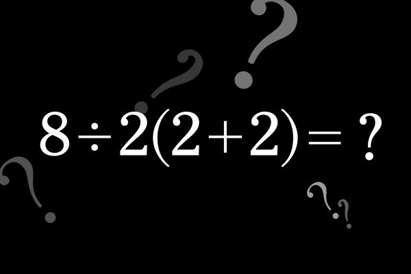
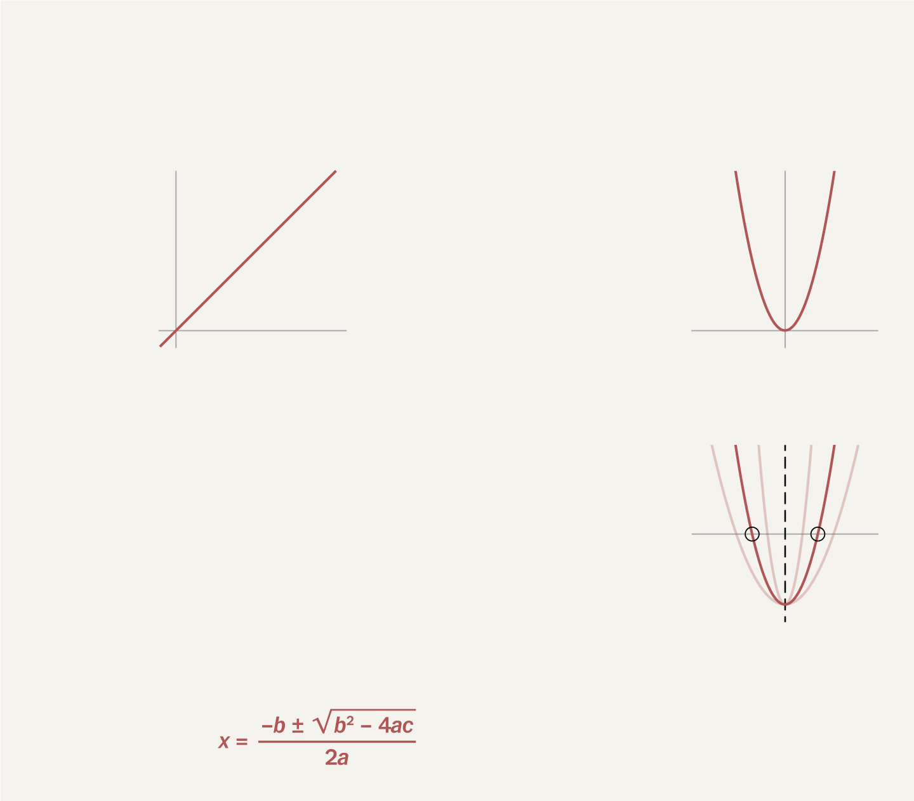
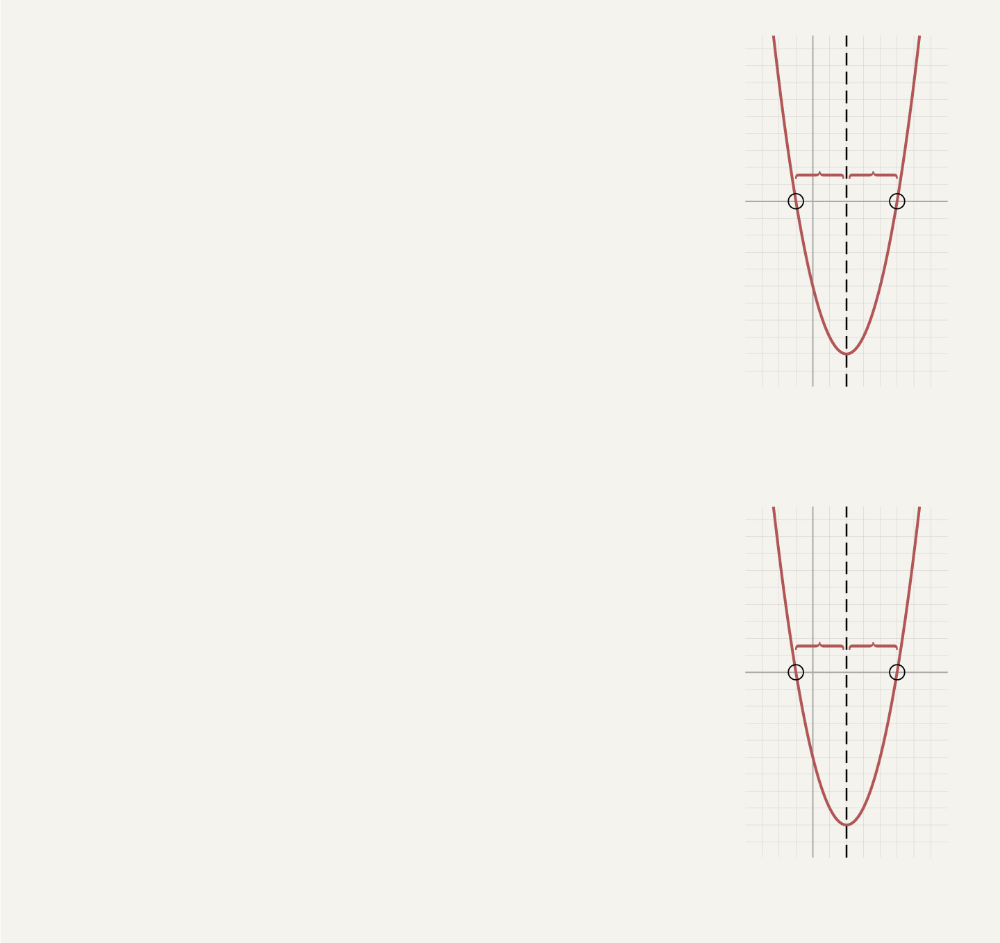
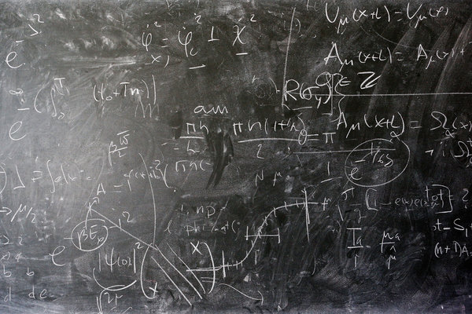
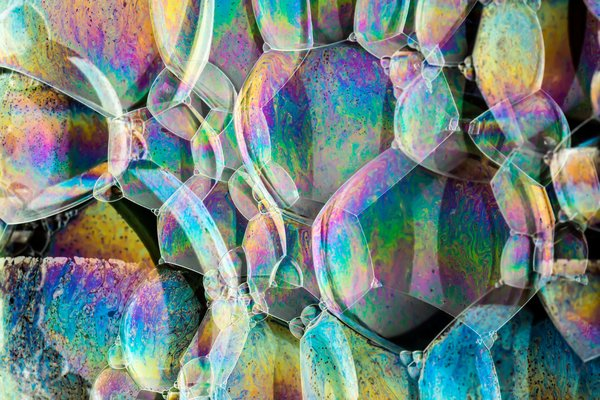
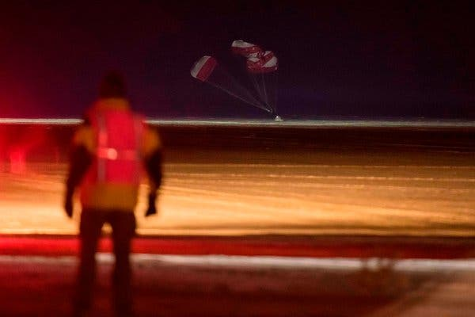
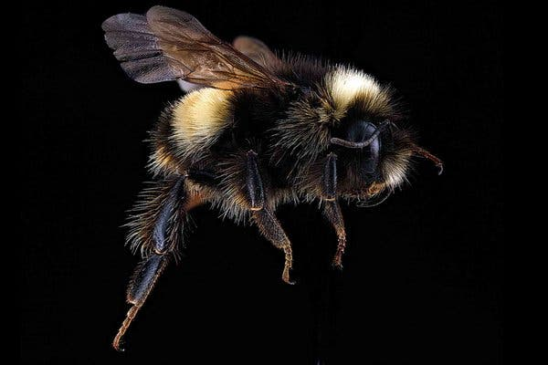
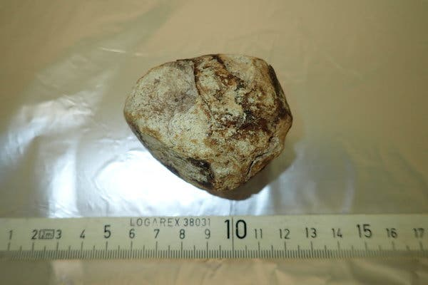

This Professor’s ‘Amazing’ Trick Makes Quadratic Equations Easier - The New York Times

Advertisement

[Continue reading the main story](https://www.nytimes.com/2020/02/05/science/quadratic-equations-algebra.html?algo=top_conversion&fellback=false&imp_id=462877159&imp_id=962627580&action=click&module=trending&pgtype=Article&region=Footer#after-top)

# This Professor’s ‘Amazing’ Trick Makes Quadratic Equations EasierThis Professor’s ‘Amazing’ Trick Makes Quadratic Equations Easier

Looking for the answers to ax² + bx + c = 0? A mathematician has rediscovered a technique that the ancient Babylonians used.

Po-Shen Loh in 2016, giving a talk on puzzles at MoMath in New York. “To find out that there’s this trick from thousands of years ago that you can import into here is amazing to me,” he said.Credit...Christian Hansen for The New York Times

By [Kenneth Chang](https://www.nytimes.com/by/kenneth-chang) and [Jonathan Corum](https://www.nytimes.com/by/jonathan-corum)

- Published Feb. 5, 2020Updated Feb. 6, 2020

-

    - 
    - 
    - [](https://www.nytimes.com/2020/02/05/science/quadratic-equations-algebra.html?algo=top_conversion&fellback=false&imp_id=462877159&imp_id=962627580&action=click&module=trending&pgtype=Article&region=Footermailto:?subject=NYTimes.com%3A%20This%20Professor%E2%80%99s%20%E2%80%98Amazing%E2%80%99%20Trick%20Makes%20Quadratic%20Equations%20Easier&body=From%20The%20New%20York%20Times%3A%0A%0AThis%20Professor%E2%80%99s%20%E2%80%98Amazing%E2%80%99%20Trick%20Makes%20Quadratic%20Equations%20Easier%0A%0ALooking%20for%20the%20answers%20to%20ax%C2%B2%20%2B%20bx%20%2B%20c%20%3D%200%3F%20A%20mathematician%20has%20rediscovered%20a%20technique%20that%20the%20ancient%20Babylonians%20used.%0A%0Ahttps%3A%2F%2Fwww.nytimes.com%2F2020%2F02%2F05%2Fscience%2Fquadratic-equations-algebra.html)

    -
    -
    -

The quadratic equation has frustrated math students for millenniums. But a math professor at Carnegie Mellon University in Pittsburgh may have come up with a better way of solving it.

“When I stumbled on this, I was just completely shocked,” said the professor, Po-Shen Loh.

Quadratics, which are introduced in elementary algebra classes, pop up often in physics and engineering in the calculating of trajectories, even in sports. If, while watching the Super Bowl, you had wanted to estimate how far a pass thrown by Patrick Mahomes traveled through the air, you would have been solving a quadratic equation. The equations also show up in calculations for maximizing profit, a key consideration for anyone who wants to succeed in business.

Dr. Loh has not discovered something entirely new. Indeed, his method mixes together ideas dating back thousands of years to the Babylonians. But this is not how modern algebra textbooks present the topic.

“To find out that there’s this trick from thousands of years ago that you can import into here is amazing to me,” Dr. Loh said. “I wanted to share that as widely as possible.”

[ The Math Equation That Tried to Stump the Internet Aug. 2, 2019  ](https://www.nytimes.com/2019/08/02/science/math-equation-pedmas-bemdas-bedmas.html?action=click&module=RelatedLinks&pgtype=Article)

Dr. Loh mentors some of the top high school math students in the country as coach of the United States Mathematical Olympiad team. But he also wants to improve the teaching of all math students.

“Everyone assumes the only people I work with are Olympiad students,” said Dr. Loh, who is the founder of the educational website [Expii](https://www.expii.com/). “That’s not true. My passion is everyone.”

A few months ago, Dr. Loh posted online [a paper describing his method](https://www.poshenloh.com/quadraticdetail/), and teachers have already tried it in their classrooms.

“I was really surprised that most of them were getting it,” said Bobson Wong, a math teacher at Bayside High School in Queens, New York, who [used the approach in an algebra class](http://bobsonwong.com/blog/27-on-a-different-method-for-solving-quadratic-equations) where many students fear math. “They were able to do it on their own.”

The burst of pedagogical discussion about quadratic equations highlights the ability of the internet to spread new teaching ideas quickly.

“It’s innovation in education that’s being pursued the right way,” said [Michael Driskill](https://www.mathforamerica.org/about/team/michael-driskill), chief operating officer of Math for America, an organization that recognizes top teachers and provides forums for them to exchange ideas. (Mr. Wong is one of the people that Math for America has designated as a master teacher.)

Mr. Driskill said Dr. Loh did not proclaim that he had something definitively better, but instead, “He put it out to teachers and asked, ‘Does it work in classroom?’”

##   Quadratics and Parabolas 101

First, a quick review about quadratic equations and parabolas.

## Editors’ Picks

[### ‘The Scream’ Is Fading. New Research Reveals Why.](https://www.nytimes.com/2020/02/07/arts/design/the-scream-edvard-munch-science.html?algo=bandit-story&fellback=false&imp_id=591813789&imp_id=729698638&action=click&module=editorContent&pgtype=Article&region=CompanionColumn&contentCollection=Trending)

[### The Unhealthy Math of Skinny + Pretty = Good](https://www.nytimes.com/2020/02/07/style/the-unhealthy-math-of-skinny-pretty-good.html?algo=bandit-story&fellback=false&imp_id=758420030&imp_id=812701520&action=click&module=editorContent&pgtype=Article&region=CompanionColumn&contentCollection=Trending)

[### Roommates Forever](https://www.nytimes.com/2020/01/31/realestate/roommates-forever.html?algo=bandit-story&fellback=false&imp_id=180152904&imp_id=599297517&action=click&module=editorContent&pgtype=Article&region=CompanionColumn&contentCollection=Trending)

[Continue reading the main story](https://www.nytimes.com/2020/02/05/science/quadratic-equations-algebra.html?algo=top_conversion&fellback=false&imp_id=462877159&imp_id=962627580&action=click&module=trending&pgtype=Article&region=Footer&action=click&module=editorContent&pgtype=Article&region=CompanionColumn&contentCollection=Trending#after-pp_edpick)

 [ PAID POST: The Macallan](https://adclick.g.doubleclick.net/pcs/click?xai=AKAOjstr_Dyjt19OtA286F_z5Jo4mgwZSQ84MfjUSuTkBzVlifm9rLrrXsLaUN-13YKuoe4DNu2EqSG7bZDZmKcAAENfVKrsWbWLSOuoW6cZu52ZH5jn-GM9pCW3K8OMV1N3Z-1LDJOnEz6TBFLDGtASb1FPS5TdZeLymwvh3EynuanjTdiXZEyA4lG_tPuyHsfzSK1QZtxY98ywrO5kjsrzwGrl0WIqHcF3g-SwDz7h9_HGha6u1pGnfpiqUKjDscT-3g4&sig=Cg0ArKJSzG3NmztkujiZEAE&urlfix=1&adurl=https://www.nytimes.com/paidpost/the-macallan/a-recipe-for-bold-decision-making.html%3Fcpv_ap_id%3D50031612%26sr_source%3Dlift_ed%26tbs_nyt%3D2020-Feb-nytnative_ed)[ From Wall Street to Iron Chef U.K.: Meet Chef Judy Joo](https://adclick.g.doubleclick.net/pcs/click?xai=AKAOjstr_Dyjt19OtA286F_z5Jo4mgwZSQ84MfjUSuTkBzVlifm9rLrrXsLaUN-13YKuoe4DNu2EqSG7bZDZmKcAAENfVKrsWbWLSOuoW6cZu52ZH5jn-GM9pCW3K8OMV1N3Z-1LDJOnEz6TBFLDGtASb1FPS5TdZeLymwvh3EynuanjTdiXZEyA4lG_tPuyHsfzSK1QZtxY98ywrO5kjsrzwGrl0WIqHcF3g-SwDz7h9_HGha6u1pGnfpiqUKjDscT-3g4&sig=Cg0ArKJSzG3NmztkujiZEAE&urlfix=1&adurl=https://www.nytimes.com/paidpost/the-macallan/a-recipe-for-bold-decision-making.html%3Fcpv_ap_id%3D50031612%26sr_source%3Dlift_ed%26tbs_nyt%3D2020-Feb-nytnative_ed)

A parabola is a symmetrical curve that can describe the path of a projectile, like a thrown football, or the curve of a suspension bridge.

Parabolas are defined with variations on the equation *y* = *x*2.
y
y
Line:
*y* = *x*
Parabola:
*y* = *x*2
x
x
A more general equation for a parabola is a quadratic function:
◀ *a* ▶
*y* = *ax*2 + *bx* + *c*

Where *a* changes the width of the curve, *b* shifts the axis of symmetry to the left or right, and *c* slides the curve up or down.

The quadratic formula learned by generations of math students is difficult to remember, but it can be used to solve quadratic equations where *y* = 0. Solving the equation gives the two points where the parabola crosses the *x*-axis (the two values of *x* when *y* = 0):

x
▲
c
▼
◀ *b* ▶
Axis of
symmetry

##   What algebra students currently learn

Before students are presented with the quadratic formula, they’re taught a simpler method to solve certain equations. For simplicity, we’ll consider an equation where *a *= 1.

### *x*² – 4*x* – 5 = 0

You might recall your teacher asking you to factor the jumble of symbols. That is, you hoped to find two numbers *r* and *s *such that

### *x*² – 4*x* – 5 = (*x* – *r*)(*x* – *s*) = 0

Multiplying out (*x* – *r*)(*x* – *s*) produces *x*² – (*r + s*)*x + rs.*

The key is to find *r* and *s *such that the sum of *r* and *s *equals 4 (that is, *r + *s = 4)*, *and multiplying *r* and *s* produces –5 (*r *× *s *= –5). If they exist, then *r* and *s *are the two and only two solutions.

Figuring out the factors that work is essentially trial and error. “The fact that you suddenly have to switch into a guessing mode makes you feel like maybe math is confusing or not systematic,” Dr. Loh said.

Guessing also becomes cumbersome for quadratics with large numbers, and it only works neatly for problems that are contrived to have integer answers.

Dr. Loh’s method eliminates this guessing game. But for many algebra students, the jumble of algebraic symbols is still confusing. So Mr. Wong tells them to sketch a parabola.

“If you graph it, it’s much easier for the kids to understand what’s going on,” he said.

##   How the new method works

This alternate method for solving quadratic equations uses the fact that parabolas are symmetrical.

For example, in this parabola:

*y* = *x*2 – 4*x* – 5

The two solutions when *y* = 0 are the symmetrical points *r* and *s*, where the parabola crosses the *x*-axis.

The midpoint, or average, of *r* and *s* is the axis of symmetry of the parabola. We want *r* + *s* = –*b*, which happens when the average of *r* and *s* is –*b* ÷ 2. In this example: 4 ÷ 2 = 2.

The two solutions to the quadratic equation will be the axis of symmetry plus or minus an unknown amount, which we’ll call *u*. In this example:

*r* = 2 – *u* and  *s* = 2 + *u*

To find *u*, we want the product of *r* and *s* to be equal to *c*, which in this example is –5. Rewriting *r* and *s* in terms of *u*:

*r* × *s* = –5
(2 – *u*) × (2 + *u*) = –5

Solving that yields 22 – *u*2 = –5 or *u*2 = 9, so *u* = 3 works.

The two solutions to this quadratic equation are 2 – *u* and 2 + *u*, or –1 and 5. In other words, this parabola intersects the *x*-axis when *x* = –1 and *x* =  5.

–u
+u
*r*=2–*u*
*s*=2+*u*
2
Axis of symmetry
–3
+3
–1
5
2
The same method also works for equations that are not readily factorable.

That’s when students turn to the quadratic formula. But they often misremember it — the usual derivation is a bit convoluted involving a technique called “completing the square” — and get the wrong answers.

Dr. Loh’s method allows people to calculate the answers without remembering the exact formula. (It also provides a more straightforward proof.)

“Math is not about memorizing formulas without meaning, but rather about learning how to reason logically through precise statements,” Dr. Loh said.

Mr. Wong said Dr. Loh’s version is easier for students because it, “provides one method for solving all kinds of quadratic equations.”

##   A technique with ancient roots

Dr. Loh delved into mathematics history to find that the Babylonians and Greeks had the same insights, although their understanding was limited because their math was limited to positive numbers. It was only later that people came up with the concepts of negative numbers, zero and even more esoteric concepts like imaginary numbers — the square roots of negative numbers.

He even found out that a math teacher in Sudbury, Canada, named John Savage came up with [a similar approach](https://www.jstor.org/stable/27966090?seq=1) 30 years ago. An article by Mr. Savage in the journal The Mathematics Teacher in 1989 laid out almost the same procedure, although Dr. Loh filled in some nuances of logic in explaining why it works.

“I honestly can’t remember exactly where the eureka moment was,” Mr. Savage said in a phone interview. But it seemed to be an improvement over the usual way of teaching the subject.

He continued using that approach, as did some other teachers he knew. But the internet was still in its infancy, and the idea faded away.

“It never caught on,” Mr. Savage said. “Looking back on it, I should have pushed it a little more. I think it’s so much easier than the traditional way.”

Mr. Savage said he was excited to see the same idea revived 22 years after he had retired. “I was quite interested to read it now,” he said of Dr. Loh’s paper. “It’s quite interesting that he basically came up with the same idea.”

More Math

[ That Vexing Math Equation? Here’s an Addition Aug. 5, 2019  ](https://www.nytimes.com/2019/08/05/science/math-equation-pemdas-bodmas.html?action=click&module=RelatedLinks&pgtype=Article)

[ Why Mathematicians Hate That Viral Equation Aug. 6, 2019  ](https://www.nytimes.com/2019/08/06/science/math-equation-pemdas.html?action=click&module=RelatedLinks&pgtype=Article)

[ For a Black Mathematician, What It’s Like to Be the ‘Only One’ Feb. 18, 2019  ](https://www.nytimes.com/2019/02/18/us/edray-goins-black-mathematicians.html?action=click&module=RelatedLinks&pgtype=Article)

[ Pi Day: How One Irrational Number Made Us Modern March 14, 2019  ](https://www.nytimes.com/2019/03/14/science/pi-math-geometry-infinity.html?action=click&module=RelatedLinks&pgtype=Article)

[ Beyond ‘Hidden Figures’: Nurturing New Black and Latino Math Whizzes Feb. 17, 2017  ](https://www.nytimes.com/2017/02/17/nyregion/new-york-math-camp.html?action=click&module=RelatedLinks&pgtype=Article)

[ In Bubbles, She Sees a Mathematical Universe April 8, 2019  ](https://www.nytimes.com/2019/04/08/science/uhlenbeck-bubbles-math-physics.html?action=click&module=RelatedLinks&pgtype=Article)

[ Solving a Leafy Mathematical Mystery June 6, 2019  ](https://www.nytimes.com/2019/06/06/science/leaves-math-phyllotaxis.html?action=click&module=RelatedLinks&pgtype=Article)

Kenneth Chang has been at The Times since 2000, writing about physics, geology, chemistry, and the planets. Before becoming a science writer, he was a graduate student whose research involved the control of chaos.   [@kchangnyt](https://twitter.com/kchangnyt)

Jonathan Corum is the science graphics editor for The New York Times.   [@13pt](https://twitter.com/13pt)

- 
- 
- [](https://www.nytimes.com/2020/02/05/science/quadratic-equations-algebra.html?algo=top_conversion&fellback=false&imp_id=462877159&imp_id=962627580&action=click&module=trending&pgtype=Article&region=Footermailto:?subject=NYTimes.com%3A%20This%20Professor%E2%80%99s%20%E2%80%98Amazing%E2%80%99%20Trick%20Makes%20Quadratic%20Equations%20Easier&body=From%20The%20New%20York%20Times%3A%0A%0AThis%20Professor%E2%80%99s%20%E2%80%98Amazing%E2%80%99%20Trick%20Makes%20Quadratic%20Equations%20Easier%0A%0ALooking%20for%20the%20answers%20to%20ax%C2%B2%20%2B%20bx%20%2B%20c%20%3D%200%3F%20A%20mathematician%20has%20rediscovered%20a%20technique%20that%20the%20ancient%20Babylonians%20used.%0A%0Ahttps%3A%2F%2Fwww.nytimes.com%2F2020%2F02%2F05%2Fscience%2Fquadratic-equations-algebra.html)

-

## [More in Science](https://www.nytimes.com/section/science?action=click&module=MoreInSection&pgtype=Article&region=Footer&contentCollection=Science)

[### Meet the Bird Medics of New Delhi](https://www.nytimes.com/2020/02/07/science/kites-birds-conservation-india.html?action=click&module=MoreIn&pgtype=Article&region=Footer&action=click&module=MoreInSection&pgtype=Article&region=Footer&contentCollection=Science)Feb. 7

[   Aubrey Gemignani/NASA, via Agence France-Presse — Getty Images](https://www.nytimes.com/2020/02/07/science/boeing-starliner-nasa.html?action=click&module=MoreIn&pgtype=Article&region=Footer&action=click&module=MoreInSection&pgtype=Article&region=Footer&contentCollection=Science)

[### Boeing Starliner Flight’s Flaws Show ‘Fundamental Problem,’ NASA Says](https://www.nytimes.com/2020/02/07/science/boeing-starliner-nasa.html?action=click&module=MoreIn&pgtype=Article&region=Footer&action=click&module=MoreInSection&pgtype=Article&region=Footer&contentCollection=Science)Feb. 7

[Continue reading the main story](https://www.nytimes.com/2020/02/05/science/quadratic-equations-algebra.html?algo=top_conversion&fellback=false&imp_id=462877159&imp_id=962627580&action=click&module=trending&pgtype=Article&region=Footer&action=click&module=MoreInSection&pgtype=Article&region=Footer&contentCollection=Science#after-pp_morein)

[   NASA](https://www.nytimes.com/2020/02/06/science/christina-koch-nasa-astronaut.html?action=click&module=MoreIn&pgtype=Article&region=Footer&action=click&module=MoreInSection&pgtype=Article&region=Footer&contentCollection=Science)

[### Christina Koch Lands on Earth, and Crosses a Threshold for Women in Space](https://www.nytimes.com/2020/02/06/science/christina-koch-nasa-astronaut.html?action=click&module=MoreIn&pgtype=Article&region=Footer&action=click&module=MoreInSection&pgtype=Article&region=Footer&contentCollection=Science)Feb. 6

[### Climate Change: It’s a Buzzkill for Bumblebees, Study Finds](https://www.nytimes.com/interactive/2020/02/06/climate/bumblebees-extreme-heat-weather.html?action=click&module=MoreIn&pgtype=Article&region=Footer&action=click&module=MoreInSection&pgtype=Article&region=Footer&contentCollection=Science)Feb. 6

[   Ruairidh Macleod](https://www.nytimes.com/2020/02/04/science/ambergris-sperm-whales-dna.html?action=click&module=MoreIn&pgtype=Article&region=Footer&action=click&module=MoreInSection&pgtype=Article&region=Footer&contentCollection=Science)

[### New Origin Story for Gross Blobs That Wash Up on Beaches](https://www.nytimes.com/2020/02/04/science/ambergris-sperm-whales-dna.html?action=click&module=MoreIn&pgtype=Article&region=Footer&action=click&module=MoreInSection&pgtype=Article&region=Footer&contentCollection=Science)Feb. 4

## Most Popular

### [New Report on 138 Coronavirus Cases Reveals Disturbing Details](https://www.nytimes.com/2020/02/07/health/coronavirus-patients.html?algo=top_conversion&fellback=false&imp_id=908950964&imp_id=316834041&action=click&module=trending&pgtype=Article&region=Footer)

### [Opinion: Winners and Losers of the Democratic Debate](https://www.nytimes.com/interactive/2020/02/08/opinion/who-won-democratic-debate.html?algo=top_conversion&fellback=false&imp_id=274939336&imp_id=81436633&action=click&module=trending&pgtype=Article&region=Footer)

### [What It Was Like to Work for Andrew Yang](https://www.nytimes.com/2020/02/07/us/politics/andrew-yang-president-campaign.html?algo=top_conversion&fellback=false&imp_id=830291970&imp_id=777042092&action=click&module=trending&pgtype=Article&region=Footer)

### [MAGA War on Architectural Diversity Weaponizes Greek Columns](https://www.nytimes.com/2020/02/07/arts/design/federal-building-architecture.html?algo=top_conversion&fellback=false&imp_id=280263304&imp_id=186945437&action=click&module=trending&pgtype=Article&region=Footer)

### [Victors in Iowa, Sanders and Buttigieg Are Targets in Democratic Debate](https://www.nytimes.com/2020/02/07/us/politics/democratic-debate-recap.html?algo=top_conversion&fellback=false&imp_id=633439312&imp_id=600980930&action=click&module=trending&pgtype=Article&region=Footer)

### [‘The Scream’ Is Fading. New Research Reveals Why.](https://www.nytimes.com/2020/02/07/arts/design/the-scream-edvard-munch-science.html?algo=top_conversion&fellback=false&imp_id=885347737&imp_id=474271155&action=click&module=trending&pgtype=Article&region=Footer)

### [Analysis of the Feb. 7 New Hampshire Debate](https://www.nytimes.com/interactive/2020/02/07/us/politics/democratic-debate-live.html?algo=top_conversion&fellback=false&imp_id=76413508&imp_id=610694108&action=click&module=trending&pgtype=Article&region=Footer)

### [7 Takeaways From the Democratic Debate in New Hampshire](https://www.nytimes.com/2020/02/07/us/politics/democratic-debate-tonight.html?algo=top_conversion&fellback=false&imp_id=592429930&imp_id=907349711&action=click&module=trending&pgtype=Article&region=Footer)

### [Rush Limbaugh in His Own Words](https://www.nytimes.com/2020/02/07/sunday-review/rush-limbaugh-trump-medal.html?algo=top_conversion&fellback=false&imp_id=381118842&imp_id=999834006&action=click&module=trending&pgtype=Article&region=Footer)

### [Opinion: How Trump Wins Again](https://www.nytimes.com/2020/02/06/opinion/trump-democrats-2020.html?algo=top_conversion&fellback=false&imp_id=348612034&imp_id=103116757&action=click&module=trending&pgtype=Article&region=Footer)

Advertisement

[Continue reading the main story](https://www.nytimes.com/2020/02/05/science/quadratic-equations-algebra.html?algo=top_conversion&fellback=false&imp_id=462877159&imp_id=962627580&action=click&module=trending&pgtype=Article&region=Footer#after-bottom)