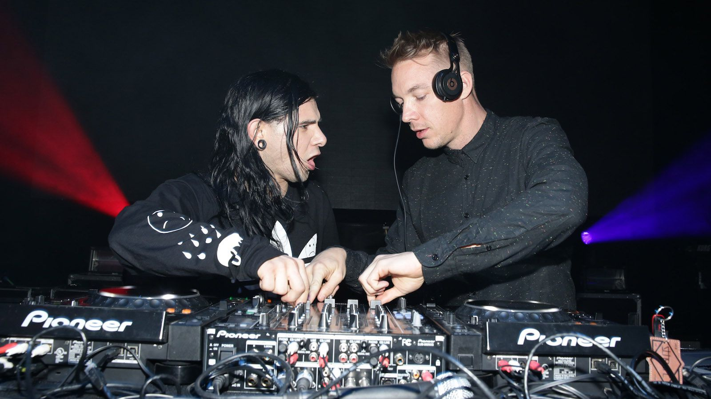

This music production tool is the reason why all new music sounds the same

"THE CLICK"

# This music production tool is the reason why all new music sounds the same

****Skrillex and Diplo... or Skriplo and Dillex? (Eric Charbonneau/AP mages)

##### Share

 [](https://twitter.com/intent/tweet?url=https%3A%2F%2Fqz.com%2F1044781&text=This%20music%20production%20tool%20is%20the%20reason%20why%20all%20new%20music%20sounds%20the%20same&via=qz) [](https://www.facebook.com/sharer.php?u=https%3A%2F%2Fqz.com%2F1044781%2Fthis-music-production-tool-is-the-reason-why-all-new-music-sounds-the-same%2F&caption=qz.com%20%7C%20By%20Shelby%20Hartman) [](https://www.linkedin.com/shareArticle?mini=true&url=https%3A%2F%2Fqz.com%2F1044781%2Fthis-music-production-tool-is-the-reason-why-all-new-music-sounds-the-same%2F&title=This%20music%20production%20tool%20is%20the%20reason%20why%20all%20new%20music%20sounds%20the%20same&summary=Imagine%20music%20as%20a%20recipe.%20Would%20you%20be%20able%20tell%20whether%20it%20had%20been%20made%20with%20artificially%20engineered%20ingredients%20or%20fresh%20produce%20from%20the%20farmer%E2%80%99s%E2%80%A6&source=Quartz) [](https://qz.com/1044781/this-music-production-tool-is-the-reason-why-all-new-music-sounds-the-same/?utm_source=nextdraft&utm_medium=emailmailto:?subject=Quartz%3A%20This%20music%20production%20tool%20is%20the%20reason%20why%20all%20new%20music%20sounds%20the%20same&body=https%3A%2F%2Fqz.com%2F1044781%2Fthis-music-production-tool-is-the-reason-why-all-new-music-sounds-the-same%2F%0A%0AImagine%20music%20as%20a%20recipe.%20Would%20you%20be%20able%20tell%20whether%20it%20had%20been%20made%20with%20artificially%20engineered%20ingredients%20or%20fresh%20produce%20from%20the%20farmer%E2%80%99s%E2%80%A6%0A%0ASign%20up%20for%20the%20Quartz%20Daily%20Brief%3A%20https%3A%2F%2Fbit.ly%2Fquartzdailybrief.)

##### Written by

[Shelby Hartman](https://qz.com/1044781/this-music-production-tool-is-the-reason-why-all-new-music-sounds-the-same/?utm_source=nextdraft&utm_medium=email#)

August 03, 2017

Imagine music as a recipe. Would you be able tell whether it had been made with artificially engineered ingredients or fresh produce from the farmer’s market? Canned tomatoes might work just fine—but maybe you wouldn’t know what you had been missing until you tried the same dish with heirlooms, each beautifully misshapen with unique streaks of sunburst yellow.

Drummer Greg Ellis wants listeners to begin thinking about sound like food—as something they physically ingest that has a quantifiable impact on their wellbeing. These days, he believes most people are consuming the musical equivalent of McDonalds: processed, mass produced, and limited in flavor.

A lot of this aural blandness has to do with technology. It begins with the producer who relies on a computer rather than live instrumentalists and ends with the devices we use to consume our music, which cut out the dynamics captured in the recording studio. Ellis, a session drummer who can be heard in the background of Hollywood blockbusters such as *Argo, Godzilla, *and *The Matrix *series, is exploring this phenomena in a forthcoming documentary, *[The Click](https://www.indiegogo.com/projects/the-click-music-film--2#/)*.

04:10

normal

## **What is “the click”?**

The “click” is a digital metronome that musicians listen to while recording to ensure their rhythm is exactly in time with the tempo. A simple and now nearly ubiquitous part of the recording process, it has had a profound effect on the music we listen to.

While the click was originally intended as a tool for precision and cohesion, Ellis says its perfect uniformity ushered in an expectation that the rest of musical parts should follow. Suddenly singers, instrumentalists, and drummers were expected to sound like machines. When vocalists were slightly off key, they could be auto-tuned. If a bass player wasn’t perfectly in-time with the drummer, their parts could be processed in a recording program that syncs them up. Of course, that’s if a live musician is used at all—many producers in pop, hip hop, and R&B now use samples or synthetic sounds generated by computers instead of using their human progenitors.

These days, Ellis says he’s not given space to create most drumming parts. Although he’s played drums with greats including Billy Idol, Mickey Hart, and Beck, a producer who knows little about drumming will often create his part for him before he gets into the studio—and expects him to play it precisely on the click. He sometimes doesn’t even play through the entire song any more: He’s often asked to play just a couple measures, which are then repeated using a copy-paste function that prevents variation, dynamic, or embellishment.

And that could be having an effect on our enjoyment of the music: There is some scientific evidence on the value of giving listeners something they’re not expecting. “Music that’s inventive excites neural circuits in the prefrontal cortex,” says Daniel Levitin, a neuroscientist and author of *This is Your Brain on Music.* “It’s the job of the composer to bring us pleasure through choices we didn’t expect.”

## **Is technology making music more creative, or less?**

Ellis says this popular method of production stifles creativity. “I’m not calling out anyone who uses the gear, I’m calling out the gear itself, which we’ve let dictate our sense of music and time,” Ellis says. “There’s a sense that when you’re faced with the real thing, it actually feels wrong to people.”

“Everyone’s used to hearing everything precisely on the click and with autotune,” agrees Petros, a producer in Los Angeles who has worked with hit-makers such as One Direction, Enrique Iglesias, and Dillon Francis. “So if a recording is not done that way, it will sound off.” However, Petros and other music producers are welcoming these new technological advances as a positive, not a negative. He says completely automating drum tracks is cheaper, easier, and more precise—and, in some ways, it allows for *more* creativity, not less.

With a live drummer, producers have a limited number of sounds to choose from, but with a program, they can quickly and easily experiment with dozens of different options until they find the one that sounds right. Petros says that most of his friends who are producers in the music industry don’t even know how to record a live drum set, and that a significant number of people who have songs in the Billboard Hot 100 don’t have any formal music training. But do they need to, any more?

Edward Sharpe and the Magnetic Zeros’ singer Alex Ebert says it’s become *too *easy for anyone to make music with a computer and free software. Consequently, there’s been an “undeniable loss of mastery” among a significant percentage of the musicians and producers making hits now. He’s says he’s not anti-technology: Technological experimentation, after all, is what allowed for the birth of revelatory albums including The Beatles’ *Sgt. Pepper’s Lonely Hearts Club Band*, Jimi Hendrix’ *The Jimi Hendrix Experience*, and Pink Floyd’s *The Dark Side of the Moon*. Instead, he’s against technology being used as a crutch rather than a tool for invention. “Musical successes are just being regurgitated in refinement,” he says.

 Robert Margouleff, a recording engineer who revolutionized the synthesizer on Stevie Wonder’s albums, has called the laptop “the folk instrument of our time.”  Not everyone agrees. Robert Margouleff, a recording engineer most known for revolutionizing the use of the synthesizer on Stevie Wonder’s albums, has called the laptop “the folk instrument of our time.” It’s allowed for innovators like St. Vincent and Bon Iver to create new sonic experiences and entire albums by themselves, and has lowered the barrier for new artists to create masterpieces in their bedrooms.

But what about the consumers? As music becomes more mechanized, how is this trend affecting the experience for the people paying for it with their Spotify subscriptions?

## **How does the device we listen to music on change what we hear?**

This technological wedge doesn’t stop at the act of music creation itself: Ellis believes that the way it’s packaged and then listened to only further separates us from the warm, feel-good vibrations we originally turned to music for. “There’s all kinds of losses that happen after music leaves the studio,” says USC professor of electrical engineering Chris Kyriakakis. “It’s basically all downhill from there.”

 It’s like “a palette that’s shrunk down to primary colors.” Engineers compress tunes in order to convert them to files compatible with our multitude of devices. Information is immediately lost during compression, and then even more information is lost depending on what system we then play that file through. It’s like “a palette that’s shrunk down to primary colors,” Ellis says. Listening to music through headphones that don’t perfectly fit into our ears, for example, or smartphone speakers that cut out frequencies emanating from the guitar, bass, and drums means we end up hearing an even more dumbed-down version of the sonic vibrancy the composer originally intended.

Some efforts are being made to mitigate these effects. For example, Spotify recently [tweaked the volume of their entire song library](https://motherboard.vice.com/en_us/article/ywgeek/why-spotify-lowered-the-volume-of-songs-and-ended-hegemonic-loudness) in order to try and bring some of the original subtlety back that was stolen from their compression. As Bruno Romani writes on Motherboard, “When compression occurs in an exaggerated way, it makes everything louder, which ends up stealing the dynamics away from the music itself. It’s like listening to that one loud friend of yours who always yells when they’re drunk. In addition to being bothersome, it also becomes monotonous after awhile.”

## **Which type of music is better for us?**

We may not be experiencing the full gamut of potential expression, but does mechanized music have a different effect on our brains?

Neuroscientist Levitin says we don’t know if music created with live instrumentation has more healing potential than its click-y counterpart. What we do know is that whether it’s created on a click or not, a steady rhythm is more likely to put people in a trance because the neurons in our brains start firing in synchronicity with the beat. Levitin says this trance can “help you to relax or achieve some insights you wouldn’t otherwise.”

Levitin has also co-authored a [study](https://www.ncbi.nlm.nih.gov/pubmed/23578016) that found people who listen to music together have synchronized brain waves. He hypothesizes that, at least in the case of a concert, audience members might feel more empathy and bonding if they’re able to see the musician. This is something Ellis argues we’re sorely lacking in our lives today, opting to watch YouTube footage of a live gig on our tiny screens on the way to work instead.

* * *

In *The Click*, Ellis will travel around the world from Sado Island in Japan to South America, trying to answer some of these questions. By visiting with master drummers and communities still deeply committed to drumming as a form of catharsis and ritual, he aims to illuminate what’s lost when our radio waves are dominated by music that’s too perfect.

*You can follow Shelby on [Twitter](https://twitter.com/shelbyannehart). Learn how to [write for Quartz Ideas](https://qz.com/635686/the-complete-guide-to-writing-for-quartz-ideas/). We welcome your comments at [ideas@qz.com](https://qz.com/1044781/this-music-production-tool-is-the-reason-why-all-new-music-sounds-the-same/?utm_source=nextdraft&utm_medium=emailmailto:ideas@qz.com).*

#### Most Popular

### [Hurricane scientists have never seen an image like this before](https://qz.com/1072166/irma-jose-and-katia-three-hurricanes-in-one-satellite-image/)

 [](https://twitter.com/intent/tweet?url=https%3A%2F%2Fqz.com%2F1044781&text=This%20music%20production%20tool%20is%20the%20reason%20why%20all%20new%20music%20sounds%20the%20same&via=qz) [](https://www.facebook.com/sharer.php?u=https%3A%2F%2Fqz.com%2F1044781%2Fthis-music-production-tool-is-the-reason-why-all-new-music-sounds-the-same%2F&caption=qz.com%20%7C%20By%20Shelby%20Hartman) [](https://www.linkedin.com/shareArticle?mini=true&url=https%3A%2F%2Fqz.com%2F1044781%2Fthis-music-production-tool-is-the-reason-why-all-new-music-sounds-the-same%2F&title=This%20music%20production%20tool%20is%20the%20reason%20why%20all%20new%20music%20sounds%20the%20same&summary=Imagine%20music%20as%20a%20recipe.%20Would%20you%20be%20able%20tell%20whether%20it%20had%20been%20made%20with%20artificially%20engineered%20ingredients%20or%20fresh%20produce%20from%20the%20farmer%E2%80%99s%E2%80%A6&source=Quartz) [](https://qz.com/1044781/this-music-production-tool-is-the-reason-why-all-new-music-sounds-the-same/?utm_source=nextdraft&utm_medium=emailmailto:?subject=Quartz%3A%20This%20music%20production%20tool%20is%20the%20reason%20why%20all%20new%20music%20sounds%20the%20same&body=https%3A%2F%2Fqz.com%2F1044781%2Fthis-music-production-tool-is-the-reason-why-all-new-music-sounds-the-same%2F%0A%0AImagine%20music%20as%20a%20recipe.%20Would%20you%20be%20able%20tell%20whether%20it%20had%20been%20made%20with%20artificially%20engineered%20ingredients%20or%20fresh%20produce%20from%20the%20farmer%E2%80%99s%E2%80%A6%0A%0ASign%20up%20for%20the%20Quartz%20Daily%20Brief%3A%20https%3A%2F%2Fbit.ly%2Fquartzdailybrief.)