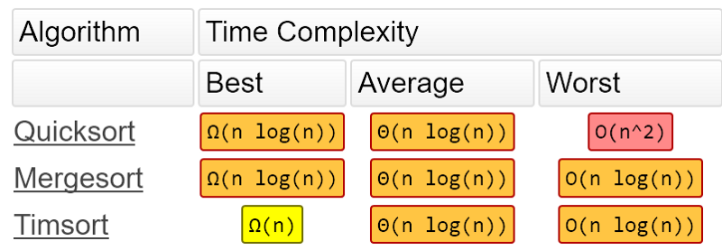
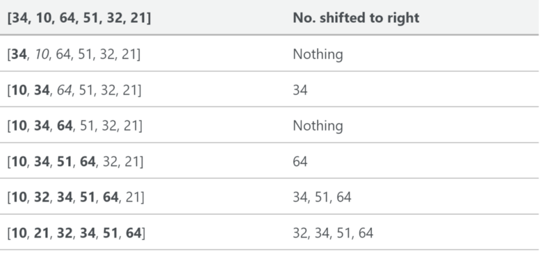
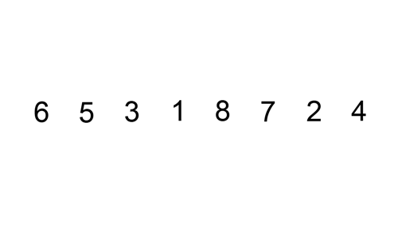
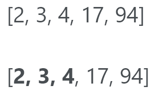
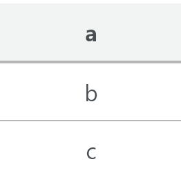
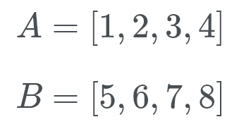

Timsort — the fastest sorting algorithm you’ve never heard of

 11 January 2019  /  [Computer Science](https://skerritt.blog/tag/computer-science/)

# Timsort — the fastest sorting algorithm you’ve never heard of

 

Timsort: A very fast , O(n log n), stable sorting algorithm built for the real world — not constructed in academia.

Image of Tim Peter from [here](https://www.youtube.com/watch?v=1wAOy88WxmY)

Timsort is a sorting algorithm that is efficient for real-world data and not created in an academic laboratory. Tim Peters created Timsort for the Python programming language in 2001. Timsort first analyses the list it is trying to sort and then chooses an approach based on the analysis of the list.

Since the algorithm has been invented it has been used as the default sorting algorithm in Python, [Java](https://bugs.java.com/bugdatabase/view_bug.do?bug_id=6804124), the [Android](http://www.kiwidoc.com/java/l/x/android/android/5/p/java.util/c/TimSort)Platform, and in GNU Octave.

Timsort’s big O notation is O(n log n). To learn about Big O notation, read [this](https://hackernoon.com/you-need-to-understand-big-o-notation-now-4ada3d2ec93a).

From [here](http://bigocheatsheet.com/)

Timsort’s sorting time is the same as Mergesort, which is faster than most of the other sorts you might know. Timsort actually makes use of Insertion sort and Mergesort, as you’ll see soon.

Peters designed Timsort to use already-ordered elements that exist in most real-world data sets. It calls these already-ordered elements “natural runs”. It iterates over the data collecting the elements into runs and simultaneously merging those runs together into one.

* * *

### **The array has fewer than 64 elements in it**

If the array we are trying to sort has fewer than 64 elements in it, Timsort will execute an insertion sort.

An insertion sort is a simple sort which is most effective on small lists. It is quite slow at larger lists, but very fast with small lists. The idea of an insertion sort is as follows:

- Look at elements one by one
- Build up sorted list by inserting the element at the correct location

Image taken by me, from my website [skerritt.tech](https://skerritt.tech/)

In this instance we are inserting the newly sorted elements into a new sub-array, which starts at the start of the array.

Here’s a gif showing insertion sort:

Taken from [here](https://upload.wikimedia.org/wikipedia/commons/9/9c/Insertion-sort-example.gif)

* * *

### **More about runs**

If the list is larger than 64 elements than the algorithm will make a first pass through the list looking for parts that are strictly increasing or decreasing. If the part is decreasing, it will reverse that part.

So if the run is decreasing, it’ll look like this (where the run is in bold):

Image from my website, [skerritt.tech](https://skerritt.tech/)
If not decreasing, it’ll look like this:

Image from my website, [skerritt.tech](https://skerritt.tech/)

The minrun is a size which is determined based on the size of the array. The algorithm selects it so that most runs in a random array are, or become minrun, in length. Merging 2 arrays is more efficient when the number of runs is equal to, or slightly less than, a power of two. Timsort chooses minrun to try to ensure this efficiency, by making sure minrun is equal to or less than a power of two.

The algorithm chooses minrun from the range 32 to 64 inclusive. It chooses minrun such that the length of the original array, when divided by minrun, is equal to or slightly less than a power of two.

If the length of the run is less than minrun, you calculate the length of that run away from minrun. Using this new number, you grab that many items ahead of the run and perform an insertion sort to create a new run.

So if minrun is 63 and the length of the run is 33, you do 63–33 = 30. You then grab 30 elements from in front of the end of the run, so this is 30 items from run[33] and then perform an insertion sort to create a new run.

After this part has completed we should now have a bunch of sorted runs in a list.

* * *

### **Merging**

 [  [giphy.webp](../_resources/e6deaecdf5dd9a81d418fb7ebdd93134.webp) ''](https://giphy.com/gifs/dragon-ball-z-dbz-UfaSEmvHQtrEI?utm_source=iframe&utm_medium=embed&utm_campaign=Embeds&utm_term=)

 [(L)](https://giphy.com/gifs/dragon-ball-z-dbz-UfaSEmvHQtrEI?utm_source=iframe&utm_medium=embed&utm_campaign=Embeds&utm_term=)

 

  

Continue Watching on GIPHY

 

[(L)](https://giphy.com/gifs/dragon-ball-z-dbz-UfaSEmvHQtrEI)

Timsort now performs mergesort to merge the runs together. However, Timsort makes sure to maintain stability and merge balance whilst merge sorting.

To maintain stability we should not exchange 2 numbers of equal value. This not only keeps their original positions in the list but enables the algorithm to be faster. We will shortly discuss the merge balance.

As Timsort finds runs, it adds them to a stack. A simple stack would look like this:

Image from my website, [skerritt.tech](https://skerritt.tech/)

Imagine a stack of plates. You cannot take plates from the bottom, so you have to take them from the top. The same is true about a stack.

Timsort tries to balance two competing needs when mergesort runs. On one hand, we would like to delay merging as long as possible in order to exploit patterns that may come up later. But we would like even more to do the merging as soon as possible to exploit the run that the run just found is still high in the memory hierarchy. We also can’t delay merging “too long” because it consumes memory to remember the runs that are still unmerged, and the stack has a fixed size.

To make sure we have this compromise, Timsort keeps track of the three most recent items on the stack and creates two laws that must hold true of those items:

1. A > B + C
2. B > C
Where A, B and C are the three most recent items on the stack.
In the words of Tim Peters himself:

*> What turned out to be a good compromise maintains two invariants on the stack entries, where A, B and C are the lengths of the three righmost not-yet merged slices*

Usually, merging adjacent runs of different lengths in place is hard. What makes it even harder is that we have to maintain stability. To get around this, Timsort sets aside temporary memory. It places the smaller (calling both runs A and B) of the two runs into that temporary memory.

* * *

### **Galloping**

 [  [giphy.webp](../_resources/b6b04153ce986135abee9f44d1bd8b6e.webp) ''](https://giphy.com/gifs/horse-riding-yNldIEA9XD7TW?utm_source=iframe&utm_medium=embed&utm_campaign=Embeds&utm_term=)

 [(L)](https://giphy.com/gifs/horse-riding-yNldIEA9XD7TW?utm_source=iframe&utm_medium=embed&utm_campaign=Embeds&utm_term=)

Related Gifs

 

  

Continue Watching on GIPHY

 

[(L)](https://giphy.com/gifs/horse-riding-yNldIEA9XD7TW)

While Timsort is merging A and B, it notices that one run has been “winning” many times in a row. If it turned out that the run A consisted of entirely smaller numbers than the run B then the run A would end up back in its original place. Merging the two runs would involve a lot of work to achieve nothing.

More often than not, data will have some preexisting internal structure. Timsort assumes that if a lot of run A’s values are lower than run B’s values, then it is likely that A will continue to have smaller values than B.

Image of 2 example runs, A and B. Runs have to be strictly increasing or decreasing, hence why these numbers were picked.

Timsort will then enter galloping mode. Instead of checking A[0] and B[0] against each other, Timsort performs a binary search for the appropriate position of b[0] in a[0]. This way, Timsort can move a whole section of A into place. Then Timsort searches for the appropriate location of A[0] in B. Timsort will then move a whole section of B can at once, and into place.

Let’s see this in action. Timsort checks B[0] (which is 5) and using a binary search it looks for the correct location in A.

Well, B[0] belongs at the back of the list of A. Now Timsort checks for A[0] (which is 1) in the correct location of B. So we’re looking to see where the number 1 goes. This number goes at the start of B. We now know that B belongs at the end of A and A belongs at the start of B.

It turns out, this operation is not worth it if the appropriate location for B[0] is very close to the beginning of A (or vice versa). so gallop mode quickly exits if it isn’t paying off. Additionally, Timsort takes note and makes it harder to enter gallop mode later by increasing the number of consecutive A-only or B-only wins required to enter. If gallop mode is paying off, Timsort makes it easier to reenter.

In short, Timsort does 2 things incredibly well:

- Great performance on arrays with preexisting internal structure
- Being able to maintain a stable sort

Previously, in order to achieve a stable sort, you’d have to zip the  items in your list up with integers, and sort it as an array of tuples.

* * *

### **Code**

If you’re not interested in the code, feel free to skip this part. There’s some more information below this section.

The source code below is based on mine and Nanda Javarma’s work. The source code is not complete, nor is it similar to Python’s offical sorted() source code. This is just a dumbed-down Timsort I implemented to get a general feel of Timsort. If you want to see Timsort’s original source code in all its glory, check it out [here](https://github.com/python/cpython/blob/master/Objects/listobject.c). Timsort is offically implemented in C, not Python.

|     |     |
| --- | --- |
| 1   | # based off of this code https://gist.github.com/nandajavarma/a3a6b62f34e74ec4c31674934327bbd3 |
| 2   | # Brandon Skerritt |
| 3   | # https://skerritt.tech |
| 4   |     |
| 5   | def  binary_search(the_array, item, start, end): |
| 6   |  if start == end: |
| 7   |  if the_array[start] > item: |
| 8   |  return start |
| 9   |  else: |
| 10  |  return start +  1 |
| 11  |  if start > end: |
| 12  |  return start |
| 13  |     |
| 14  | mid =  round((start + end)/  2) |
| 15  |     |
| 16  |  if the_array[mid] < item: |
| 17  |  return binary_search(the_array, item, mid +  1, end) |
| 18  |     |
| 19  |  elif the_array[mid] > item: |
| 20  |  return binary_search(the_array, item, start, mid -  1) |
| 21  |     |
| 22  |  else: |
| 23  |  return mid |
| 24  |     |
| 25  | """ |
| 26  | Insertion sort that timsort uses if the array size is small or if |
| 27  | the size of the "run" is small |
| 28  | """ |
| 29  | def  insertion_sort(the_array): |
| 30  | l =  len(the_array) |
| 31  |  for index in  range(1, l): |
| 32  | value = the_array[index] |
| 33  | pos = binary_search(the_array, value, 0, index -  1) |
| 34  | the_array = the_array[:pos] + [value] + the_array[pos:index] + the_array[index+1:] |
| 35  |  return the_array |
| 36  |     |
| 37  | def  merge(left, right): |
| 38  |  """Takes two sorted lists and returns a single sorted list by comparing the |
| 39  | elements one at a time. |
| 40  | [1, 2, 3, 4, 5, 6] |
| 41  |  """ |
| 42  |  if  not left: |
| 43  |  return right |
| 44  |  if  not right: |
| 45  |  return left |
| 46  |  if left[0] < right[0]: |
| 47  |  return [left[0]] + merge(left[1:], right) |
| 48  |  return [right[0]] + merge(left, right[1:]) |
| 49  |     |
| 50  | def  timsort(the_array): |
| 51  | runs, sorted_runs = [], [] |
| 52  | length =  len(the_array) |
| 53  | new_run = [the_array[0]] |
| 54  |     |
| 55  |  # for every i in the range of 1 to length of array |
| 56  |  for i in  range(1, length): |
| 57  |  # if i is at the end of the list |
| 58  |  if i == length -  1: |
| 59  | new_run.append(the_array[i]) |
| 60  | runs.append(new_run) |
| 61  |  break |
| 62  |  # if the i'th element of the array is less than the one before it |
| 63  |  if the_array[i] < the_array[i-1]: |
| 64  |  # if new_run is set to None (NULL) |
| 65  |  if  not new_run: |
| 66  | runs.append([the_array[i]]) |
| 67  | new_run.append(the_array[i]) |
| 68  |  else: |
| 69  | runs.append(new_run) |
| 70  | new_run = [] |
| 71  |  # else if its equal to or more than |
| 72  |  else: |
| 73  | new_run.append(the_array[i]) |
| 74  |     |
| 75  |  # for every item in runs, append it using insertion sort |
| 76  |  for item in runs: |
| 77  | sorted_runs.append(insertion_sort(item)) |
| 78  |     |
| 79  |  # for every run in sorted_runs, merge them |
| 80  | sorted_array = [] |
| 81  |  for run in sorted_runs: |
| 82  | sorted_array = merge(sorted_array, run) |
| 83  |     |
| 84  |  print(sorted_array) |
| 85  |     |
| 86  | timsort([2, 3, 1, 5, 6, 7]) |

 [view raw](https://gist.github.com/brandonskerritt/f6ccc000ab6527769999fd0a9ebf59de/raw/481dc8e4e851cff375b20428ed8d45a501b6097c/timsort.py)  [timsort.py](https://gist.github.com/brandonskerritt/f6ccc000ab6527769999fd0a9ebf59de#file-timsort-py) hosted with ❤ by [GitHub](https://github.com/)

Timsort is actually built right into Python, so this code only serves as an explainer. To use Timsort simply write:

`list.sort()`
Or
`sorted(list)`

If you want to master how Timsort works and get a feel for it, I highly suggest you try to implement it yourself!

This article is based on Tim Peters’ original introduction to Timsort, found [here](https://bugs.python.org/file4451/timsort.txt).

* * *

Hey Want to subscribe to my blog and stay up to date with posts similar to this one? Subscribe to my email list below. I won't spam you. I will only send you posts similar to this one ✨

# Like this article?

Sign up and get more content like this ✨

We won't send you spam. Unsubscribe at any time.

[Powered By ConvertKit](https://convertkit.com/?utm_source=dynamic&utm_medium=referral&utm_campaign=poweredby&utm_content=form)

If you're feeling extra generous, I have a [PayPal](https://www.paypal.me/BrandonSkerritt) and even a [Patreon](https://www.patreon.com/user?u=15993188). I'm  a university student who writes these blogs in their spare time. This blog is my full time job, so any and all donations are appreciated!

 

#### [Brandon Skerritt](https://skerritt.blog/author/brandon/)

Bee Keeper, Karateka, Writer with a love for books & dogs

 [Read More](https://skerritt.blog/author/brandon/)

Login

Comment anonymously
[**M ↓**   Markdown]()

D
[Daniel Sanderson](https://plus.google.com/105544483141063691943)
0 points
5 months ago
This looks effective. I will try it out and thanks for posting.

S
Stream Hunter
0 points
13 hours ago

And then 3 years later we have [0] and 6 years after that we have [1]. I appreciate Masters of the Universe types like Bloch and Lea contributing wickedly-efficient code, but somehow it's always mere mortals who end up mopping things up after the fact. Whether it's a bug in the actual algorithm or a "Comparison method violates its general contract!" exception that happens once in a blue moon, I think putting TimSort in Java was a mistake.

[Commento](https://commento.io/)