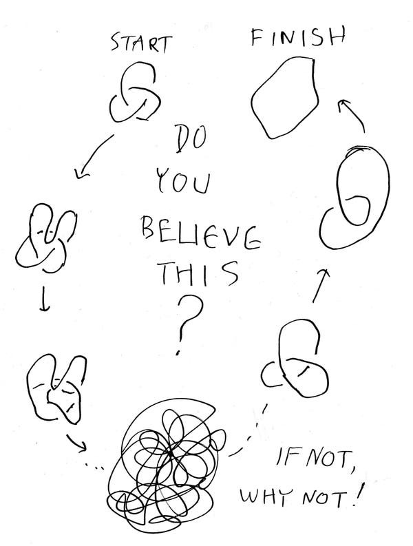
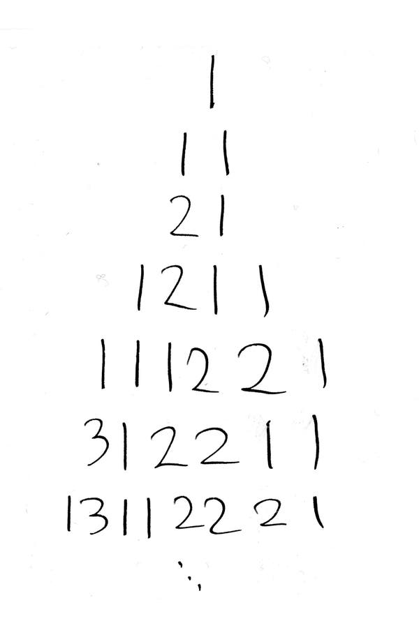
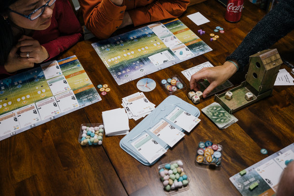
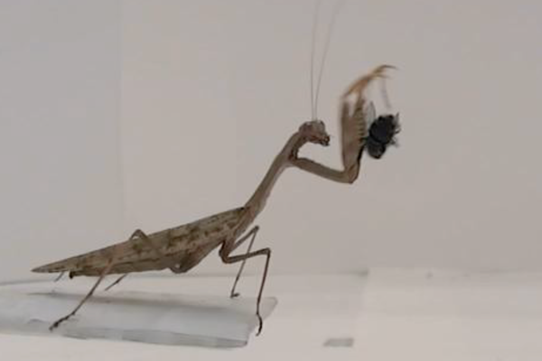
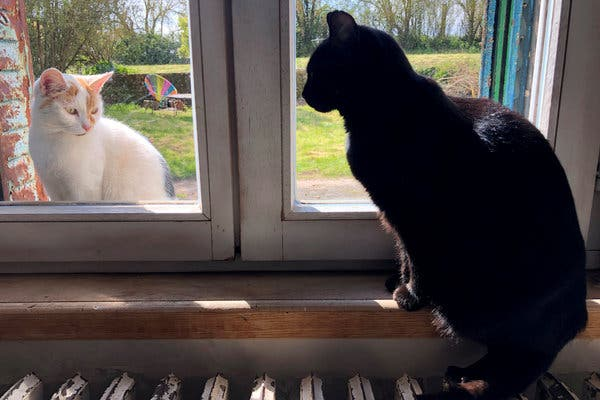
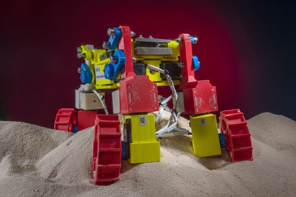

Travels with John Conway, in 258 Septillion Dimensions - The New York Times

Credit...John Horton Conway

[Skip to content](https://www.nytimes.com/2020/05/16/science/john-conway-math.html#site-content)[Skip to site index](https://www.nytimes.com/2020/05/16/science/john-conway-math.html#site-index)

[![](data:image/svg+xml,%3csvg xmlns='http://www.w3.org/2000/svg' viewBox='0 0 184 25' fill='%23000'%3e%3cpath d='M13.8 2.9c0-2-1.9-2.5-3.4-2.5v.3c.9 0 1.6.3 1.6 1 0 .4-.3 1-1.2 1-.7 0-2.2-.4-3.3-.8C6.2 1.4 5 1 4 1 2 1 .6 2.5.6 4.2c0 1.5 1.1 2 1.5 2.2l.1-.2c-.2-.2-.5-.4-.5-1 0-.4.4-1.1 1.4-1.1.9 0 2.1.4 3.7.9 1.4.4 2.9.7 3.7.8v3.1L9 10.2v.1l1.5 1.3v4.3c-.8.5-1.7.6-2.5.6-1.5 0-2.8-.4-3.9-1.6l4.1-2V6l-5 2.2C3.6 6.9 4.7 6 5.8 5.4l-.1-.3c-3 .8-5.7 3.6-5.7 7 0 4 3.3 7 7 7 4 0 6.6-3.2 6.6-6.5h-.2c-.6 1.3-1.5 2.5-2.6 3.1v-4.1l1.6-1.3v-.1l-1.6-1.3V5.8c1.5 0 3-1 3-2.9zm-8.7 11l-1.2.6c-.7-.9-1.1-2.1-1.1-3.8 0-.7 0-1.5.2-2.1l2.1-.9v6.2zm10.6 2.3l-1.3 1 .2.2.6-.5 2.2 2 3-2-.1-.2-.8.5-1-1V9.4l.8-.6 1.7 1.4v6.1c0 3.8-.8 4.4-2.5 5v.3c2.8.1 5.4-.8 5.4-5.7V9.3l.9-.7-.2-.2-.8.6-2.5-2.1L18.5 9V.8h-.2l-3.5 2.4v.2c.4.2 1 .4 1 1.5l-.1 11.3zM34 15.1L31.5 17 29 15v-1.2l4.7-3.2v-.1l-2.4-3.6-5.2 2.8v6.6l-1 .8.2.2.9-.7 3.4 2.5 4.5-3.6-.1-.4zm-5-1.7V8.5l.2-.1 2.2 3.5-2.4 1.5zM53.1 2c0-.3-.1-.6-.2-.9h-.2c-.3.8-.7 1.2-1.7 1.2-.9 0-1.5-.5-1.9-.9l-2.9 3.3.2.2 1-.9c.6.5 1.1.9 2.5 1v8.3L44 3.2c-.5-.8-1.2-1.9-2.6-1.9-1.6 0-3 1.4-2.8 3.6h.3c.1-.6.4-1.3 1.1-1.3.5 0 1 .5 1.3 1v3.3c-1.8 0-3 .8-3 2.3 0 .8.4 2 1.6 2.3v-.2c-.2-.2-.3-.4-.3-.7 0-.5.4-.9 1.1-.9h.5v4.2c-2.1 0-3.8 1.2-3.8 3.2 0 1.9 1.6 2.8 3.4 2.7v-.2c-1.1-.1-1.6-.6-1.6-1.3 0-.9.6-1.3 1.4-1.3.8 0 1.5.5 2 1.1l2.9-3.2-.2-.2-.7.8c-1.1-1-1.7-1.3-3-1.5V5l8 14h.6V5c1.5-.1 2.9-1.3 2.9-3zm7.3 13.1L57.9 17l-2.5-2v-1.2l4.7-3.2v-.1l-2.4-3.6-5.2 2.8v6.6l-1 .8.2.2.9-.7 3.4 2.5 4.5-3.6-.1-.4zm-5-1.7V8.5l.2-.1 2.2 3.5-2.4 1.5zM76.7 8l-.7.5-1.9-1.6-2.2 2 .9.9v7.5l-2.4-1.5V9.6l.8-.5-2.3-2.2-2.2 2 .9.9V17l-.3.2-2.1-1.5v-6c0-1.4-.7-1.8-1.5-2.3-.7-.5-1.1-.8-1.1-1.5 0-.6.6-.9.9-1.1v-.2c-.8 0-2.9.8-2.9 2.7 0 1 .5 1.4 1 1.9s1 .9 1 1.8v5.8l-1.1.8.2.2 1-.8 2.3 2 2.5-1.7 2.8 1.7 5.3-3.1V9.2l1.3-1-.2-.2zm18.6-5.5l-1 .9-2.2-2-3.3 2.4V1.6h-.3l.1 16.2c-.3 0-1.2-.2-1.9-.4l-.2-13.5c0-1-.7-2.4-2.5-2.4s-3 1.4-3 2.8h.3c.1-.6.4-1.1 1-1.1s1.1.4 1.1 1.7v3.9c-1.8.1-2.9 1.1-2.9 2.4 0 .8.4 2 1.6 2V13c-.4-.2-.5-.5-.5-.7 0-.6.5-.8 1.3-.8h.4v6.2c-1.5.5-2.1 1.6-2.1 2.8 0 1.7 1.3 2.9 3.3 2.9 1.4 0 2.6-.2 3.8-.5 1-.2 2.3-.5 2.9-.5.8 0 1.1.4 1.1.9 0 .7-.3 1-.7 1.1v.2c1.6-.3 2.6-1.3 2.6-2.8s-1.5-2.4-3.1-2.4c-.8 0-2.5.3-3.7.5-1.4.3-2.8.5-3.2.5-.7 0-1.5-.3-1.5-1.3 0-.8.7-1.5 2.4-1.5.9 0 2 .1 3.1.4 1.2.3 2.3.6 3.3.6 1.5 0 2.8-.5 2.8-2.6V3.7l1.2-1-.2-.2zm-4.1 6.1c-.3.3-.7.6-1.2.6s-1-.3-1.2-.6V4.2l1-.7 1.4 1.3v3.8zm0 3c-.2-.2-.7-.5-1.2-.5s-1 .3-1.2.5V9c.2.2.7.5 1.2.5s1-.3 1.2-.5v2.6zm0 4.7c0 .8-.5 1.6-1.6 1.6h-.8V12c.2-.2.7-.5 1.2-.5s.9.3 1.2.5v4.3zm13.7-7.1l-3.2-2.3-4.9 2.8v6.5l-1 .8.1.2.8-.6 3.2 2.4 5-3V9.2zm-5.4 6.3V8.3l2.5 1.8v7.1l-2.5-1.7zm14.9-8.4h-.2c-.3.2-.6.4-.9.4-.4 0-.9-.2-1.1-.5h-.2l-1.7 1.9-1.7-1.9-3 2 .1.2.8-.5 1 1.1v6.3l-1.3 1 .2.2.6-.5 2.4 2 3.1-2.1-.1-.2-.9.5-1.2-1V9c.5.5 1.1 1 1.8 1 1.4.1 2.2-1.3 2.3-2.9zm12 9.6L123 19l-4.6-7 3.3-5.1h.2c.4.4 1 .8 1.7.8s1.2-.4 1.5-.8h.2c-.1 2-1.5 3.2-2.5 3.2s-1.5-.5-2.1-.8l-.3.5 5 7.4 1-.6v.1zm-11-.5l-1.3 1 .2.2.6-.5 2.2 2 3-2-.2-.2-.8.5-1-1V.8h-.1l-3.6 2.4v.2c.4.2 1 .3 1 1.5v11.3zM143 2.9c0-2-1.9-2.5-3.4-2.5v.3c.9 0 1.6.3 1.6 1 0 .4-.3 1-1.2 1-.7 0-2.2-.4-3.3-.8-1.3-.4-2.5-.8-3.5-.8-2 0-3.4 1.5-3.4 3.2 0 1.5 1.1 2 1.5 2.2l.1-.2c-.3-.2-.6-.4-.6-1 0-.4.4-1.1 1.4-1.1.9 0 2.1.4 3.7.9 1.4.4 2.9.7 3.7.8V9l-1.5 1.3v.1l1.5 1.3V16c-.8.5-1.7.6-2.5.6-1.5 0-2.8-.4-3.9-1.6l4.1-2V6l-5 2.2c.5-1.3 1.6-2.2 2.6-2.9l-.1-.2c-3 .8-5.7 3.5-5.7 6.9 0 4 3.3 7 7 7 4 0 6.6-3.2 6.6-6.5h-.2c-.6 1.3-1.5 2.5-2.6 3.1v-4.1l1.6-1.3v-.1L140 8.8v-3c1.5 0 3-1 3-2.9zm-8.7 11l-1.2.6c-.7-.9-1.1-2.1-1.1-3.8 0-.7.1-1.5.3-2.1l2.1-.9-.1 6.2zm12.2-12h-.1l-2 1.7v.1l1.7 1.9h.2l2-1.7v-.1l-1.8-1.9zm3 14.8l-.8.5-1-1V9.3l1-.7-.2-.2-.7.6-1.8-2.1-2.9 2 .2.3.7-.5.9 1.1v6.5l-1.3 1 .1.2.7-.5 2.2 2 3-2-.1-.3zm16.7-.1l-.7.5-1.1-1V9.3l1-.8-.2-.2-.8.7-2.3-2.1-3 2.1-2.3-2.1L154 9l-1.8-2.1-2.9 2 .1.3.7-.5 1 1.1v6.5l-.8.8 2.3 1.9 2.2-2-.9-.9V9.3l.9-.6 1.5 1.4v6l-.8.8 2.3 1.9 2.2-2-.9-.9V9.3l.8-.5 1.6 1.4v6l-.7.7 2.3 2.1 3.1-2.1v-.3zm8.7-1.5l-2.5 1.9-2.5-2v-1.2l4.7-3.2v-.1l-2.4-3.6-5.2 2.8v6.8l3.5 2.5 4.5-3.6-.1-.3zm-5-1.7V8.5l.2-.1 2.2 3.5-2.4 1.5zm14.1-.9l-1.9-1.5c1.3-1.1 1.8-2.6 1.8-3.6v-.6h-.2c-.2.5-.6 1-1.4 1-.8 0-1.3-.4-1.8-1L176 9.3v3.6l1.7 1.3c-1.7 1.5-2 2.5-2 3.3 0 1 .5 1.7 1.3 2l.1-.2c-.2-.2-.4-.3-.4-.8 0-.3.4-.8 1.2-.8 1 0 1.6.7 1.9 1l4.3-2.6v-3.6h-.1zm-1.1-3c-.7 1.2-2.2 2.4-3.1 3l-1.1-.9V8.1c.4 1 1.5 1.8 2.6 1.8.7 0 1.1-.1 1.6-.4zm-1.7 8c-.5-1.1-1.7-1.9-2.9-1.9-.3 0-1.1 0-1.9.5.5-.8 1.8-2.2 3.5-3.2l1.2 1 .1 3.6z'%3e%3c/path%3e%3c/svg%3e)](https://www.nytimes.com/)

# Travels with John Conway, in 258 Septillion Dimensions

The Princeton mathemagician, who died in April, left an engaging legacy of numerical gamesmanship.

Credit...John Horton Conway
By Siobhan Roberts

- May 16, 2020

-

    - 
    - 
    - [](https://www.nytimes.com/2020/05/16/science/john-conway-math.htmlmailto:?subject=NYTimes.com%3A%20Travels%20with%20John%20Conway%2C%20in%20258%20Septillion%20Dimensions&body=From%20The%20New%20York%20Times%3A%0A%0ATravels%20with%20John%20Conway%2C%20in%20258%20Septillion%20Dimensions%0A%0AThe%20Princeton%20mathemagician%2C%20who%20died%20in%20April%2C%20left%20an%20engaging%20legacy%20of%20numerical%20gamesmanship.%0A%0Ahttps%3A%2F%2Fwww.nytimes.com%2F2020%2F05%2F16%2Fscience%2Fjohn-conway-math.html%3Fsmid%3Dem-share)

    -
    -

When John Horton Conway, the Princeton “mathemagician” who died [in April](https://www.nytimes.com/2020/04/15/technology/john-horton-conway-dead-coronavirus.html) at age 82, first found fame in the late 1960s and early ’70s, he joined the academic equivalent of the jet set. Then at the University of Cambridge, he would fly to Montreal or New York, deliver a lecture on his Conway group — an entity in the realm of mathematical symmetry that inhabits 24 dimensions — and return home all within the space of a day.

Occasionally, he made a detour to visit Martin Gardner, the mathematical games columnist for Scientific American, at his house in Hastings-on-Hudson, just north of New York. Mr. Gardner taught him magic tricks: Try tying a knot while holding onto both ends of the string, without ever letting go. Dr. Conway, in turn, regaled Mr. Gardner with puzzles and games — [Sprouts](http://library.msri.org/books/Book63/files/131105-LeMoine.pdf), for instance, a pencil-and-paper game he had invented with Michael Paterson, a grad student, and which quickly charmed the entire math department, administrative staff included.

Image

John Conway sent this diagram of Sprouts to Martin Gardner in 1967, with the following instructions: “We start with n spots on a piece of paper. The move is to join two of these spots — which are allowed to be the same spot — by a curve, and then to create a new spot on this curve. The curve must not pass through old spots, nor may it cross old curves, and at no time may any spot have more than three arcs emanating from it. In normal sprouts a player who cannot make a move loses, so that the object is to move last — in misère sprouts, the last player loses.”Credit...via James Gardner, Martin Gardner Papers, Special Collections, Stanford University Libraries

Later, Mr. Gardner marveled at the fireworks that Dr. Conway displayed “in such bewildering profusion,” he said in a letter. “I still have my head spinning.”

Writing Dr. Conway’s biography, I spent many mind-bending hours trying to keep up. His office at Princeton University was a perpetual mess, so he had relocated to a hallway adjacent to the math department common room. The corridor was lined with window alcoves, each furnished with two armchairs and a chalkboard. In Dr. Conway’s alcove, loose-leaf works in progress were filed beneath a seat cushion.

From there, he delivered a master class, to a parade of visitors, on how to spend all of one’s time — as he would boast — doing nothing, being lazy and playing games. His syllabus might include a riff on the science of rainbows (primary, secondary, tertiary), or “[chemical π](https://link.springer.com/article/10.1007%2Fs00283-016-9658-x)” (memorizing pi using a mnemonic based on the periodic table of elements), or his [Doomsday rule](https://mattbaker.blog/2020/04/26/mental-math-and-calendar-calculations/https://mattbaker.blog/2020/04/26/mental-math-and-calendar-calculations/) for speedily calculating the day of the week for any given date.

Sometimes we ventured out. Once, we took the train to Poughkeepsie to meet George Odom, an accomplished amateur geometer and an inpatient at the Hudson River Psychiatric Center. Mr. Odom had made a few discoveries pertaining to the golden ratio — a ratio describing aesthetically pleasing proportions of certain shapes, usually rectangular. Mr. Odom’s discoveries intrigued Dr. Conway because they related the golden ratio specifically to the cube. “I’ve always felt the primacy of the cube,” Mr. Odom told him.

Dr. Conway was partial to the [triangle](https://link.springer.com/content/pdf/10.1007/s00283-014-9463-3.pdf), for which he discovered the [Conway circle](https://mathworld.wolfram.com/ConwayCircle.html) theorem: If you extend the sides of any triangle beyond each vertex, at a distance equal to the length of the opposite side, the resulting six points lie on a circle. (A “proof without words” was recently featured in “[The Big Lock-Down Math-Off](https://aperiodical.com/2020/05/the-big-lock-down-math-off-match-14/).”)

Image

Dr. Conway in his Princeton office in 1993.Credit...Dith Pran/The New York Times

We went to Kashiwa, near Tokyo, to the Kavli Institute for the Physics and Mathematics of the Universe. Dr. Conway was the keynote speaker at a workshop about the Monster group, a collection of symmetries of an object that lives most accessibly in 196,883 dimensions — that’s the “smallest nontrivial” place that the Monster lives, Dr. Conway clarified. There is another representation in 21,296,876 dimensions, and a larger one still in 27-digit-number-dimensional space: 258,823,477,531,055,064,045,234,375.

And Dr. Conway correctly predicted that this behemoth possesses symmetries numbering roughly 808 sexdecillion, or exactly:

808,017,424,794,512,875,886,459,904,961,710,757,005,754,368,000,000,000

“These things are so beautiful,” he told me. “I mean, it’s a kind of beauty that exists in the abstract, but we poor mortals will never see it. We can just get vague glimmerings.” (For example, see the 248-dimensional group [E8](https://aimath.org/E8/mcmullen.html).)

Dr. Conway believed that the [Monster](https://www.youtube.com/watch?v=jsSeoGpiWsw) couldn’t exist without a reason. “But I don’t have any idea what that reason is,” he told the audience in Kashiwa. “Before I die, I really want to understand why the Monster exists. But I’m almost certain I won’t.”

## From Phutball to the Game of Life

Image

At Cambridge, Dr. Conway’s students tested him with the “Look-and-Say Sequence.” The challenge: determine the next line in the sequence.Credit...John Horton Conway

Image

A young John Conway in 1957 with his water computer, WINNIE, for Water Initiated Numerical Number Integrating Engine.Credit...Peter Evennett

In September 2009, with his son Gareth, then 8, we traveled to Liverpool, England, Dr. Conway’s hometown, and Cambridge, his alma mater, to clear up some counterfactuals. (He was a notoriously unreliable narrator of his own life.)

During our visit with his daughters from his first marriage — Annie, Ellie, Rosie and Susie — we played his One Bit Word Game: Try conversing using words containing only one syllable or “bit.” (When an opponent slips up, shout “Bang!”) Dr. Conway once challenged himself to deliver a number theory class in one-bit words, no small feat given the word “number” itself: “Those things you count with — you know, 1, 2, 3, 4, 5, 6, or more….”

Cambridge was peak Conway, especially with regard to games. With his collaborators, Elwyn Berlekamp and [Richard Guy](https://think.taylorandfrancis.com/richard-guy-and-john-conway/) (who died in March at 103), he purportedly invented or reinvented 10 games a day, assisted by a regular rotation of students: Simon Norton devised the game Tribulations; Mike Guy countered with Fibulations. (Both are [Nim](https://en.wikipedia.org/wiki/Nim)-like games based on triangle numbers and Fibonacci numbers.) The group amassed folders of “games without names” and “names without games.” In 1981, after 15 years, they published the multivolume, best-selling book “Winning Ways for Your Mathematical Plays.”

Chapter 22 contained [Phutball](https://arxiv.org/abs/cs/0008025), short for Philosopher’s Football, a two-player board game with stones, driven by negative feedback. “Every move is bad,” Dr. Conway warned. Chapter 25 covered Dr. Conway’s Game of Life, prefaced by Oscar Wilde’s advice that “Life is too important to be taken seriously.”

First published in Mr. Gardner’s October 1970 column, the Game of Life is a “no-player, never-ending” game, as Dr. Conway liked to say, and it is considered one of the earliest, most remarkable and most popular examples of a cellular automaton — according to only a few simple rules, cells on the screen evolve from iteration to iteration to produce an astoundingly complex bestiary of “Life-forms.”

“LIFE IS UNIVERSAL,” Dr. Conway wrote to Mr. Gardner in December 1970, in all caps. That is, the Game of Life could be programmed to do any calculation; it was a metaphor for, and contained, all of mathematics. “The Game of Life has contributed to the public perception of mathematics in a way that few mathematical discoveries in modern history have,” said Manjul Bhargava, a mathematician and a colleague of Dr. Conway’s at Princeton.

All of this gaming could be classified as serious research, of course; as both player and spectator, Dr. Conway was analyzing games, observing strategy and classifying the moves available to each player. He noticed that games behaved like numbers, and numbers like games. This led to his theory of surreal numbers — a huge new number system containing not only all the real numbers, but also a boggling collection of infinites and infinitesimals, like π minus 1 divided by the cube root of infinity.

Image

Dr. Conway, third from right, playing Backgammon at Cambridge circa 1978.Credit...Pelham Wilson

To explain his theory, Dr. Conway wrote a book, “On Numbers and Games,” and two papers, “[All Games Bright and Beautiful](https://www.jstor.org/stable/2321899?seq=1)” and “All Numbers Great and Small.” He told me, “You know the hymn: ‘All things bright and beautiful, all creatures great and small.’ But in the case of this theory, it’s all games bright and beautiful that come first. The games are logically prior to the numbers.”

He viewed this discovery as so fundamental that he named it simply “**No**,” in bold, meaning all numbers, capital N. Donald Knuth, the Stanford computer scientist and author of “The Art of Computer Programming,” came up with the more enduring name while writing the novelette “[Surreal Numbers: How Two Ex-Students Turned On to Pure Mathematics and Found Total Happiness](http://people.math.harvard.edu/~knill/teaching/mathe320_2015_fall/blog15/surreal1.pdf).”

On hearing of his friend’s death, Dr. Knuth said that Dr. Conway was his second favorite mathematician, outshone only by the 18th-century Swiss mathematician Leonhard Euler. “John gave pleasure to connoisseurs who appreciate deep thinking. That’s real beauty, for me, and touches off deep emotions.” He noted that Dr. Conway has been mentioned more than 25 times so far in “The Art of Computer Programming,” for different contributions: “I expect the citings to continue long after his death (as happened to Elvis).”

## How to beat children at their own games

In March of 2010, we set out for “G4G9,” the ninth biennial gathering honoring Mr. Gardner, in Atlanta. Over five days, 10-minute presentations followed one after another. Dr. Conway offered an “Untitled Talk,” in which he lectured (during a special 25-minute session) on “The Lexicode Theorem — Or Is It?”

“I’ll cast some doubt on this theorem, to say the very least, but all turns out well in the end,” he told the audience, and proceeded to convert his work with sphere-packing into game theory (drawing from a paper written with Neil Sloane, “[Lexicographic Codes: Error-Correcting Codes from Game Theory](http://neilsloane.com/doc/Me122.pdf)”).

“Conway is the rare sort of mathematician whose ability to connect his pet mathematical interests makes one wonder if he isn’t, at some level, shaping mathematical reality and not just exploring it,” James Propp, a mathematician at the University of Massachusetts Lowell, said afterward. Sphere-packing and games are two separate realms that Dr. Conway had investigated on different paths, with no obvious intersection, said Dr. Propp. “But somehow, through the force of his personality and the intensity of his passion, he bent the mathematical universe to his will.”

Our mathematical journey continued that August at Canada/USA Mathcamp, an international summer program for high-school students keen on math, which was being held that year at Mount Holyoke College in South Hadley, Mass. Dr. Conway was a perennial star attraction; I first met him at Mathcamp in 2003 — he was doing his signature trick, spinning a wire hanger above his head with a penny balanced on the hook — and every summer he bestowed and inflicted his usual bewildering repertoire.

He displayed a special fanaticism for Dots and Boxes, a 19th-century pencil-and-paper game.

Image

Dots and Boxes, invented in the 19th century, was among Dr. Conway’s favorite games. On a grid of dots, two players take turns making a single horizontal or vertical line between two unjoined adjacent dots. When a player completes a box, she earns a point and marks her initial inside the box and then must take another turn. The winner is the player who takes the most boxes.Credit...Erik Demaine

Image

Ten finished games of Dots and Boxes between Dr. Conway and the author. Dr. Conway won nearly all.Credit...John Horton Conway

He gave a camp lecture on “How To Beat Children At Their Own Games,” and accepted a challenge to play a dozen or so campers in parallel; if they won a single game, he would declare the campers victorious. At one point, the campers were horrified to discover that he had borrowed a copy of his “Winning Ways” from the camp office to brush up on strategy. But, circling the table of opponents, he made math camp history, losing three times. “Wait a minute,” he said. “What’s happened here? You seem to have won!”

For Jamin Liu, a former Mathcamper and counselor and now a bioengineering grad student at the University of California, San Francisco, Dr. Conway’s perpetual dragooning with games was more than just fun. “They were well disguised as cool tricks that I could share without necessarily getting into underlying mathematical ideas, which were interesting to me but not to my friends,” Ms. Liu said. She added that she never managed to beat Dr. Conway at Dots and Boxes: “I always got too greedy in the early game!”

By contrast, Dr. Bhargava, a 2014 Fields Medalist, was victorious against Conway. “Once, by accident,” he said. Dr. Bhargava worked and played a great deal with Dr. Conway, who served as his first-year graduate studies adviser. “His attitude affirmed my own thoughts about math as play, though he took this attitude far beyond what I ever expected from a Princeton math professor, and I loved it,” he said.

## A final trick

Image

Dr. Conway in 2012, playing Dots and Boxes at Princeton.Credit...Siobhan Roberts

Our last trip together was in January of 2019. We headed out from Dr. Conway’s Princeton care residence — he lived there after suffering a number of strokes — to a favorite restaurant, Tomo Sushi, with mathematicians Joseph Kohn and Simon Kochen and the New York magician Mark Mitton. (Dick Esterle, the inventor of [geometric](http://rmm.ludus-opuscula.org/PDF_Files/ConwayEsterle_Tetraball_5_10(4_2015)_high.pdf) toys like the “Icosa” fidget ball, joined by text.)

While waiting for lunch, Dr. Conway recalled a visit with Mr. Gardner. During dinner at a restaurant, the waitress had dealt plates onto the table with a clatter. Mr. Gardner responded with a sleight-of-hand gag: He dropped his cutlery straight through his plate. The waitress screamed, and then Mr. Gardner repeated the trick around the table.

Sitting there at the sushi joint, Mr. Mitton grabbed a plate and knife and improvised an encore on the spot. Dr. Conway was appreciatively agog; 50 years earlier, he had asked Mr. Gardner to teach him that trick. “Later,” Mr. Gardner promised. But “later” proved elusive.

***[*****[*Like the Science Times page on Facebook.*](http://on.fb.me/1paTQ1h)*****  ****| Sign up for the ***[*Science Times newsletter.*](http://nyti.ms/1MbHaRU)*****]***

Mathematics, Games and Algorithmic Diversions

[ John Horton Conway, a ‘Magical Genius’ in Math, Dies at 82 April 15, 2020  ](https://www.nytimes.com/2020/04/15/technology/john-horton-conway-dead-coronavirus.html?action=click&module=RelatedLinks&pgtype=Article)

[ The Yoda of Silicon Valley Dec. 17, 2018  ](https://www.nytimes.com/2018/12/17/science/donald-knuth-computers-algorithms-programming.html?action=click&module=RelatedLinks&pgtype=Article)

[ She Invented a Board Game With Scientific Integrity. It’s Taking Off. March 11, 2019  ](https://www.nytimes.com/2019/03/11/science/wingspan-board-game-elizabeth-hargrave.html?action=click&module=RelatedLinks&pgtype=Article)

[ ‘Knitting Is Coding’ and Yarn Is Programmable in This Physics Lab May 17, 2019  ](https://www.nytimes.com/2019/05/17/science/math-physics-knitting-matsumoto.html?action=click&module=RelatedLinks&pgtype=Article)

- 
- 
- [](https://www.nytimes.com/2020/05/16/science/john-conway-math.htmlmailto:?subject=NYTimes.com%3A%20Travels%20with%20John%20Conway%2C%20in%20258%20Septillion%20Dimensions&body=From%20The%20New%20York%20Times%3A%0A%0ATravels%20with%20John%20Conway%2C%20in%20258%20Septillion%20Dimensions%0A%0AThe%20Princeton%20mathemagician%2C%20who%20died%20in%20April%2C%20left%20an%20engaging%20legacy%20of%20numerical%20gamesmanship.%0A%0Ahttps%3A%2F%2Fwww.nytimes.com%2F2020%2F05%2F16%2Fscience%2Fjohn-conway-math.html%3Fsmid%3Dem-share)

-

## [More in Science](https://www.nytimes.com/section/science)

[   James Reardon](https://www.nytimes.com/2020/05/15/science/monitor-lizards-invasive-species.html?action=click&block=more_in_recirc&impression_id=479605413&index=0&pgtype=Article&region=footer)

[### These Large Carnivorous Lizards Are Right Where They Belong](https://www.nytimes.com/2020/05/15/science/monitor-lizards-invasive-species.html?action=click&block=more_in_recirc&impression_id=479605413&index=0&pgtype=Article&region=footer)May 15

[### Praying Mantises: More Deadly Than We Knew](https://www.nytimes.com/2020/05/14/science/praying-mantis-strike.html?action=click&block=more_in_recirc&impression_id=568098048&index=1&pgtype=Article&region=footer)May 14

[Continue reading the main story](https://www.nytimes.com/2020/05/16/science/john-conway-math.html#after-pp_morein)

 [   PAID POST: Wellcome Trust](https://adclick.g.doubleclick.net/pcs/click?xai=AKAOjsuEsUSu2Y68cBcY7vScS6gMaAGaQMnDbmT3W7MGDsDw2Wz8Y06O2FwAgdVaebppFLbK8GB7ZDhHcpcjcPW_LYe6kBVp_MaRN2-ioOmu8_ZHizgxFsfTSLctCTt3gCSrIkAPzz26ddKTjD_vkRrNS9cncOcbaV7_qaijLwCAGxH1GfvKtpRhPFi1_A3RakwxElwC_P5VA_xL7aFnzKjWsuKhVKriEwY9lf_ETuSaTToly4HrC-GkGFiBbIp6Vi2hQ40&sig=Cg0ArKJSzDWp9NxUktFjEAE&urlfix=1&adurl=https://www.nytimes.com/paidpost/wellcome-trust/why-funding-the-covid-19-response-could-be-the-best-investment-a-business-can-make.html%3Fcpv_ap_id%3D50038089%26sr_source%3Dlift_morein%26tbs_nyt%3D2020-April-nytnative_morein)  [Funding Covid-19 Response Could Be the Best Investment a Business Can Make](https://adclick.g.doubleclick.net/pcs/click?xai=AKAOjsuEsUSu2Y68cBcY7vScS6gMaAGaQMnDbmT3W7MGDsDw2Wz8Y06O2FwAgdVaebppFLbK8GB7ZDhHcpcjcPW_LYe6kBVp_MaRN2-ioOmu8_ZHizgxFsfTSLctCTt3gCSrIkAPzz26ddKTjD_vkRrNS9cncOcbaV7_qaijLwCAGxH1GfvKtpRhPFi1_A3RakwxElwC_P5VA_xL7aFnzKjWsuKhVKriEwY9lf_ETuSaTToly4HrC-GkGFiBbIp6Vi2hQ40&sig=Cg0ArKJSzDWp9NxUktFjEAE&urlfix=1&adurl=https://www.nytimes.com/paidpost/wellcome-trust/why-funding-the-covid-19-response-could-be-the-best-investment-a-business-can-make.html%3Fcpv_ap_id%3D50038089%26sr_source%3Dlift_morein%26tbs_nyt%3D2020-April-nytnative_morein)

[](https://adclick.g.doubleclick.net/pcs/click?xai=AKAOjsuEsUSu2Y68cBcY7vScS6gMaAGaQMnDbmT3W7MGDsDw2Wz8Y06O2FwAgdVaebppFLbK8GB7ZDhHcpcjcPW_LYe6kBVp_MaRN2-ioOmu8_ZHizgxFsfTSLctCTt3gCSrIkAPzz26ddKTjD_vkRrNS9cncOcbaV7_qaijLwCAGxH1GfvKtpRhPFi1_A3RakwxElwC_P5VA_xL7aFnzKjWsuKhVKriEwY9lf_ETuSaTToly4HrC-GkGFiBbIp6Vi2hQ40&sig=Cg0ArKJSzDWp9NxUktFjEAE&urlfix=1&adurl=https://www.nytimes.com/paidpost/wellcome-trust/why-funding-the-covid-19-response-could-be-the-best-investment-a-business-can-make.html%3Fcpv_ap_id%3D50038089%26sr_source%3Dlift_morein%26tbs_nyt%3D2020-April-nytnative_morein)

[   Pascal Rossignol/Reuters](https://www.nytimes.com/2020/05/13/science/cats-coronavirus.html?action=click&block=more_in_recirc&impression_id=548402834&index=3&pgtype=Article&region=footer)

[### Cats Can Transmit the Coronavirus to Each Other, but They Probably Won’t Get Sick From It](https://www.nytimes.com/2020/05/13/science/cats-coronavirus.html?action=click&block=more_in_recirc&impression_id=548402834&index=3&pgtype=Article&region=footer)May 13

[   Shrivastava et al., Sci. Robot. 5 (2020)](https://www.nytimes.com/2020/05/13/science/nasa-rovers.html?action=click&block=more_in_recirc&impression_id=929945820&index=4&pgtype=Article&region=footer)

[### Watch These Rover Models Wiggle Out of Alien Sand Traps](https://www.nytimes.com/2020/05/13/science/nasa-rovers.html?action=click&block=more_in_recirc&impression_id=929945820&index=4&pgtype=Article&region=footer)May 13

[   NASA/JHUAPL](https://www.nytimes.com/2020/05/13/science/meteor-shower-nasa-dart.html?action=click&block=more_in_recirc&impression_id=203298012&index=5&pgtype=Article&region=footer)

[### This NASA Mission May Cause an Artificial Meteor Shower](https://www.nytimes.com/2020/05/13/science/meteor-shower-nasa-dart.html?action=click&block=more_in_recirc&impression_id=203298012&index=5&pgtype=Article&region=footer)May 13

## Editors’ Picks

[   Eric Striffler for The New York Times](https://www.nytimes.com/2020/05/13/realestate/virus-rentals-hamptons.html?action=click&algo=bandit-story_desk_filter&block=editors_picks_recirc&fellback=false&imp_id=214356973&impression_id=907126701&index=0&pgtype=Article&region=footer)

[### As Summer Nears, the Hamptons Face a ‘Feeding Frenzy’](https://www.nytimes.com/2020/05/13/realestate/virus-rentals-hamptons.html?action=click&algo=bandit-story_desk_filter&block=editors_picks_recirc&fellback=false&imp_id=214356973&impression_id=907126701&index=0&pgtype=Article&region=footer)May 14

[   Enda Bowe/Hulu](https://www.nytimes.com/2020/05/15/books/normal-people-sally-rooney-hulu-adaptation.html?action=click&algo=bandit-story_desk_filter&block=editors_picks_recirc&fellback=false&imp_id=402640906&impression_id=427844761&index=1&pgtype=Article&region=footer)

[### Bringing ‘Normal People’ to Sexy, Soundtracked Life](https://www.nytimes.com/2020/05/15/books/normal-people-sally-rooney-hulu-adaptation.html?action=click&algo=bandit-story_desk_filter&block=editors_picks_recirc&fellback=false&imp_id=402640906&impression_id=427844761&index=1&pgtype=Article&region=footer)May 15

[   Cari Vander Yacht](https://www.nytimes.com/2020/05/11/arts/social-distance-shaming.html?action=click&algo=bandit-story_desk_filter&block=editors_picks_recirc&fellback=false&imp_id=297163943&impression_id=57567780&index=2&pgtype=Article&region=footer)

[### The Social-Distancing Shamers Are Watching](https://www.nytimes.com/2020/05/11/arts/social-distance-shaming.html?action=click&algo=bandit-story_desk_filter&block=editors_picks_recirc&fellback=false&imp_id=297163943&impression_id=57567780&index=2&pgtype=Article&region=footer)May 11

## Most Popular

### [Where New Yorkers Moved to Escape Coronavirus](https://www.nytimes.com/interactive/2020/05/16/nyregion/nyc-coronavirus-moving-leaving.htmlaction=click&algo=top_conversion&block=trending_recirc&fellback=false&imp_id=474813265&impression_id=506314797&index=0&pgtype=Article&region=footer)

### [Obama Says U.S. Lacks Leadership on Virus in Commencement Speeches](https://www.nytimes.com/2020/05/16/us/barack-obama-2020-commencement-graduation-speech.html?action=click&algo=top_conversion&block=trending_recirc&fellback=false&imp_id=369301358&impression_id=396789051&index=1&pgtype=Article&region=footer)

### [What We Know About Your Chances of Catching the Virus Outdoors](https://www.nytimes.com/2020/05/15/us/coronavirus-what-to-do-outside.html?action=click&algo=top_conversion&block=trending_recirc&fellback=false&imp_id=223400111&impression_id=897488356&index=2&pgtype=Article&region=footer)

### [These No-Bake Bars Are the Next Best Thing to a Peanut Butter Cup](https://www.nytimes.com/2020/05/15/dining/peanut-butter-bars-recipe-coronavirus.html?action=click&algo=top_conversion&block=trending_recirc&fellback=false&imp_id=265566876&impression_id=810754574&index=3&pgtype=Article&region=footer)

### [Donald Trump Jr. Smears Biden With Baseless Instagram Post](https://www.nytimes.com/2020/05/16/us/donald-trump-jr-biden-smear.html?action=click&algo=top_conversion&block=trending_recirc&fellback=false&imp_id=363999187&impression_id=32056943&index=4&pgtype=Article&region=footer)

### [Coronavirus Cases Slow in U.S., but the Big Picture Remains Tenuous](https://www.nytimes.com/2020/05/16/us/coronavirus-united-states.html?action=click&algo=top_conversion&block=trending_recirc&fellback=false&imp_id=431879539&impression_id=656436972&index=5&pgtype=Article&region=footer)

### [Several Surfers Are Found Dead in the Netherlands](https://www.nytimes.com/2020/05/12/world/europe/surfers-netherlands-dead.html?action=click&algo=top_conversion&block=trending_recirc&fellback=false&imp_id=395837007&impression_id=300097218&index=6&pgtype=Article&region=footer)

### [The Richest Neighborhoods Emptied Out Most as Coronavirus Hit New York City](https://www.nytimes.com/interactive/2020/05/15/upshot/who-left-new-york-coronavirus.htmlaction=click&algo=top_conversion&block=trending_recirc&fellback=false&imp_id=27727039&impression_id=951780687&index=7&pgtype=Article&region=footer)

### [How (and Why) to Use Native Plants](https://www.nytimes.com/2020/05/15/realestate/how-and-why-to-use-native-plants.html?action=click&algo=top_conversion&block=trending_recirc&fellback=false&imp_id=625575558&impression_id=773072538&index=8&pgtype=Article&region=footer)

### [F.D.A. Halts Coronavirus Testing Program Backed by Bill Gates](https://www.nytimes.com/2020/05/15/us/coronavirus-testing-seattle-bill-gates.html?action=click&algo=top_conversion&block=trending_recirc&fellback=false&imp_id=885815519&impression_id=872449983&index=9&pgtype=Article&region=footer)

Advertisement

[Continue reading the main story](https://www.nytimes.com/2020/05/16/science/john-conway-math.html#after-bottom)