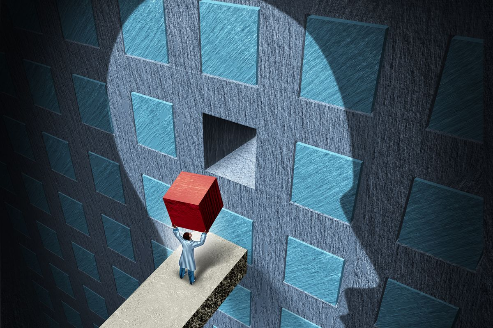
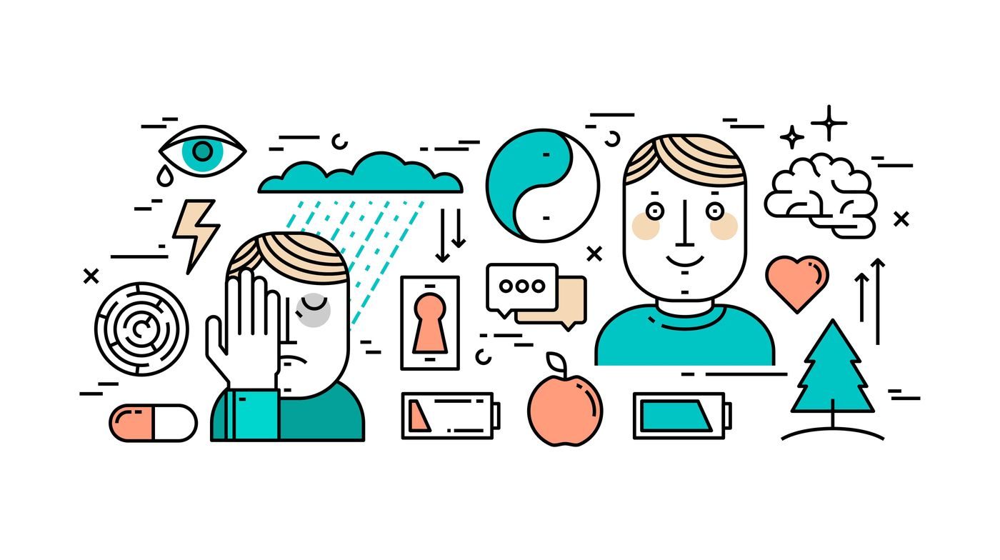
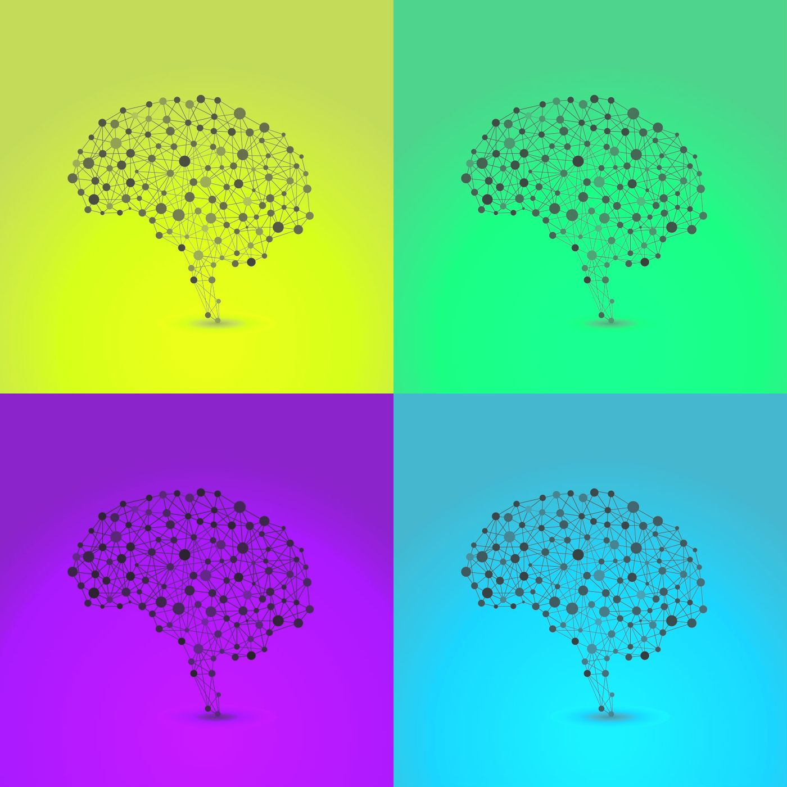
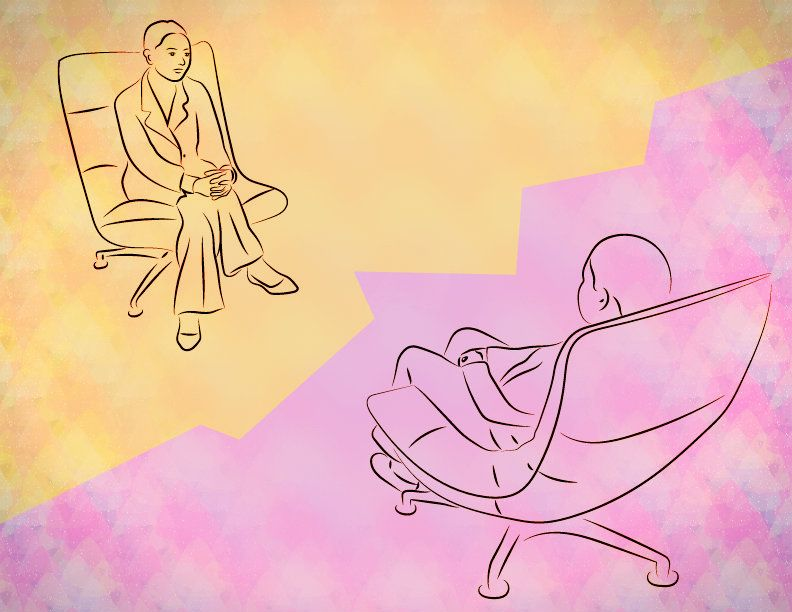

Treating depression is guesswork. Psychiatrists are beginning to crack the code.

# Treating depression is guesswork. Psychiatrists are beginning to crack the code.

## Brain scans and machine learning programs are paving the way for a breakthrough.

Updated by   [Brian Resnick](http://www.vox.com/authors/brian-resnick)[@B_resnick](http://www.twitter.com/B_resnick)[brian@vox.com](http://www.vox.com/science-and-health/2017/4/4/15073652/precision-psychiatry-depressionmailto:brian@vox.com)     Apr 4, 2017, 2:40pm EDT

- [  tweet](https://twitter.com/intent/tweet?counturl=http%3A%2F%2Fwww.vox.com%2Fscience-and-health%2F2017%2F4%2F4%2F15073652%2Fprecision-psychiatry-depression&text=Treating+depression+is+guesswork.+Psychiatrists+are+beginning+to+crack+the+code.&url=http%3A%2F%2Fwww.vox.com%2Fscience-and-health%2F2017%2F4%2F4%2F15073652%2Fprecision-psychiatry-depression&via=voxdotcom)

- [  share](https://www.facebook.com/sharer/sharer.php?text=Treating+depression+is+guesswork.+Psychiatrists+are+beginning+to+crack+the+code.&u=http%3A%2F%2Fwww.vox.com%2Fscience-and-health%2F2017%2F4%2F4%2F15073652%2Fprecision-psychiatry-depression)

             [Lightspring](https://www.shutterstock.com/g/Lightspring) / Shutterstock

Here’s a frustrating fact for anyone who has been prescribed medication or therapy for depression: Your doctor doesn’t know what treatment will work for you.

“It is currently complete primitive guesswork,” Leanne Maree Williams, a professor at Stanford University, says. “It’s hard to imagine how you can do worse than the current situation, to be honest.”

Depression means being stuck in a chronic state of sad mood or lack of enjoyment in life, to a degree where it starts to degrade quality of life. The two main treatments are cognitive behavioral therapy (CBT), a talk-centered approach that gets patients to readjust their habits, and antidepressant medications.

"**“A lot of our work is trial and error. And so it’s frustrating to not have more objective data.”**"

Both are about equally effective. Around 40 percent of patients will get better on either.

But no one treatment reliably works for everyone. And it’s not just about talk therapy versus drugs. Even in the realm of medication, available drugs like Zoloft and [Cymbalta](http://www.healthline.com/drugs/duloxetine/oral-capsule?brand=cymbalta) will work for some but not others.

Enter “precision psychiatry.” Inspired in part by “[precision medicine](http://www.vox.com/2015/1/21/7866153/obama-precision-medicine),” which changed the way doctors treat certain kinds of cancer, psychiatric researchers are hoping to bring a “precision” approach to diagnosing and treating depression using brain scans and machine learning algorithms. Too many patients are left frustrated after treatments fail. These scientists think they can do better.

### There is no “one size fits all” for the experience of depression

         [Keep Calm and Vector](https://www.shutterstock.com/g/Keep+Calm+and+Vector) / Shutterstock

For someone to get a formal diagnosis of depression, the *Diagnostic and Statistical Manual of Mental Disorders* says they need to meet five of nine criteria — which include depressed mood, decreased pleasure, weight change (positive or negative), and changes in sleep or activity levels.

A diagnosis could be any combination of the criteria.

So someone who is an insomniac, sleeping only four or five hours a night, who is exhausted, fatigued, and anxious and has lost a lot of weight, gets the diagnosis. So does someone who is oversleeping, has gained 30 pounds, and is not anxious but feels a profound sense of displeasure in activities he used to enjoy.

No one thinks those two people have the same biological problem, Conor Liston, a research psychiatrist at Weill Cornell Medical College says. “And yet those two people get the same label.”

Depression has been a hard problem for psychiatry to crack because it’s caused by both biological and experiential factors. But it’s such an important problem: 6.7 percent of Americans [will have at least one](https://www.nimh.nih.gov/health/statistics/prevalence/major-depression-among-adults.shtml) major depressive episode a year.

One type of depression may emerge from a [misalignment](https://www.nytimes.com/2017/03/10/opinion/sunday/can-sleep-deprivation-cure-depression.html) of our body’s biological clock. Another might be the result of a recurrent personal trauma. Yet another might be predominantly caused by hereditary factors. Or the answer can be all of the above.

Confusing matters: Two people can show the same symptoms of depression but they may have differing biological causes. “It may be the case that, yes, perhaps there are hundreds of kinds of depression,” Liston says.

And many may require different courses of treatment.

### Brain scans and machine learning are figuring out just how many types of depression there are

         Adapted from [Anita Ponne](https://www.shutterstock.com/g/Anita+Ponne) / Shutterstock

“There’s a feeling of frustration that I share with most psychiatrists that a lot of our work is trial and error,” Liston, who sees patients in clinical practice, says. “And so it’s frustrating to not have more objective data to drive our decision-making.”

That frustration is fueling his work. Since the ’80s, neuroscientists’ ability to peer into the brain has improved dramatically. These days, more are using the tools of big data science — like machine learning and other forms of artificial intelligence — to “look” at brain scans and find the nuanced patterns of[activity that predict our behavior](http://www.vox.com/science-and-health/2016/12/29/13967966/machine-learning-neuroscience).

Using these techniques, Liston has been able to start searching for subtypes of depression.

Liston and a team of scientists across the country and Canada recently turned those tools on brains dealing with depression and collected what’s known as “resting state” brain scans of participants.

In these experiments, participants are brought into the lab, loaded into an MRI, and told to, well, do nothing. The scan isn’t looking for a particular area of the brain that “lights up” when a participant completes an activity. It’s looking to create an overall map of how the participant’s brain works. The resting-state scan identifies regions of the brain that tend to light up at the same time. The more strongly those areas correlate, the more strongly connected they’re believed to be.

The scientists believe it’s the differing patterns of connectivity that, in part, cause the wide range of symptoms seen in depression.

Liston and his collaborator collected 1,118 of these scans, 458 of which were of people with diagnosed depression. (Note: This is a huge sample size for a brain scan study. The fMRIs can cost $500 an hour to operate, so lately, more labs have been pooling their data into large-scale projects.)

Liston and his team asked the computer if it could, first, distinguish the brain pattern of people who were depressed and those who were not. It did this correctly 84 percent of the time. The program then dug deeper, looking only at the patients with depression. Again, the computer examined the same question: Are there patterns of brain activity that distinguish the depressed patient?

The four subtypes differed with respect to how a particular brain region called the dorsal medial prefrontal cortex — believed [to play a role in self-referential](https://www.ncbi.nlm.nih.gov/pubmed/21185083) thinking — is connected to other areas of the brain.

And the four subtypes differed in how patients experienced two depression symptoms -- anxiety and anhedonia (lack of pleasure). “One subtype was anhedonic and anxious, another was mostly just anhedonic, another was mostly just anxious,” Liston says.

Even bigger sample sizes might yield even more depression subtypes, or more strongly define the lines among the ones they’ve already identified. And more than one network of brain regions is believed to be useful in distinguishing depressions. But what’s promising is that Liston and his team ran the predictions made from one group of participants in a replication in a completely new group. The same pattern of four subtypes held up.

It’s more evidence that depression isn’t one thing. And that insight may change the way it’s treated.

### If you can diagnose depression with a brain scan, you can tailor treatment

         [Anysh](https://www.shutterstock.com/g/Anysh) / Shutterstock

With depression, it’s important to get treatment right the first time. When a treatment fails, “it’s demoralizing to someone who is already depressed,” says W. Edward Craighead, a psychologist at Emory University. It adds fuel to the cycle of negative thought that makes the disease so unbearable.

Recently Craighead, along with Emory’s Helen Mayberg and colleagues, [published results](http://ajp.psychiatryonline.org/doi/10.1176/appi.ajp.2016.16050518)of an experiment that suggest they can do one better for their patients.

In their study, 122 depression patients were randomly assigned to either undergo cognitive behavioral therapy or take medication — either an SSRI or an SNRI, two of the most common drug treatments for depression. The patients were tracked over the course of 12 weeks and were carefully monitored for improvements.

As in Liston’s study, Mayberg and Craighead ran resting-state fMRI scans on all the study participants before they started treatment. After 12 weeks, and collecting data on who got better, they “asked” the computer whether there was any pattern of brain activity that can predict who gets better on drugs and who gets better on CBT.

“The type of brain that responds to psychotherapy is where there’s a strong pattern of connectivity between the frontal areas of the brain, which are involved more in thinking, talking, and problem solving, etc., with other portions of the brain,” Craighead explains. “Whereas people who have low connectivity — the opposite pattern — respond to the medication.”

Mayberg explains it like this: “If the brain connections are preserved, that network is available for talk therapy.” Drugs, on the other hand, seem to strengthen those connections.

(Note: The patterns of connectivity identified in this study are not the same as those identified in the Liston study. Again, scientists believe there are many overlapping biomarkers of depression.)

In all, people who showed this strong pattern of connection had around a 76 percent chance of responding to talk therapy, and around a 5 to 10 percent chance of responding to medication, Craighead explains. For people with the opposite pattern, they had around a 50 percent shot of getting better with meds but just a 5 percent shot of getting better with talk therapy. (Around 30 percent of the total participants in the study didn’t have a clear remission or worsening of their symptoms.)

Russell Poldrack, a psychologist at Stanford not involved in the study, cautions that these results may not be generalizable to a larger population. Because the prediction analysis was conducted after the data collection was finished, that’s “bound to give one [an inflated estimate](https://www.ncbi.nlm.nih.gov/pmc/articles/PMC4287988/) of prediction accuracy,” he says in an email.

He adds: “The use of imaging to predict treatment outcomes is definitely promising, but the studies so far have been too small.” That include this one: Here, only 58 participants out of 122 got better in the course of treatment. It’s hard to make solid conclusions from just a few dozen people.

But the nice thing about predictions is they can be tested.

### Where this research is heading

         Adapted from [Lightspring](https://www.shutterstock.com/g/Lightspring) / Shutterstock

A future study can have participants’ brains scanned and then either assign patients to the treatment indicated by the brain scan or not. Craighead and Mayberg say this work is underway. If people who were assigned to the matching treatment do much better, that would be an indication that this helps. That depression can be better treated with a look inside the brain.

And the study jibes with the big idea found in Liston’s study — that people with different brain types respond to different types of treatment. In his study, Liston found that the four subtypes of depression responded differently to a therapy called [transcranial magnetic stimulation](http://www.mayoclinic.org/tests-procedures/transcranial-magnetic-stimulation/home/ovc-20163795), which is often used when drugs or talk therapy fail.

The stimulation helped 82 percent of people who fell under the first depression subtype. But it only helped 25 percent in subtype 2, 61 percent in subtype 3, and 29.6 percent in subtype 4. (“Patients need to understand this is very early stage,” Liston stresses. “There’s a lot of work that still needs to be done to validate this and replicate this.”)

Ultimately, the goal isn’t to get every depression patient into a brain scanner, Mayberg explains. “Maybe there’s a bedside [evaluation] that tracks with the brain type; we have to look for it,” she says. Most people with mental health problems see a family physician first. A bedside test — perhaps something involving reacting to an emotional video, or a blood test to find genetic correlates — would allow doctors to better direct their patients to treatments that will work.

The scientists involved in this research are proceeding with cautious optimism. It’s too early to put this to widespread clinical use. But at the very least, this work should lend some reassurance to depressed patients who can’t find the right treatment.

“If you’re getting treated, and don’t get better, it’s *not* because it’s impossible for you to get better,” Craighead says. “It might be because your treatment doesn’t match the kind of depression you have.”

#### Was this article helpful?

###   Next Up In  [Science & Health](http://www.vox.com/science-and-health)

- [Should you walk or run for exercise? Here's what the science says.](http://www.vox.com/2015/8/4/9091093/walking-versus-running)

- [Pepsi’s pulled protest ad is part of a long history of big soda exploiting black and Latino youth](http://www.vox.com/science-and-health/2017/4/5/15192838/pepsi-ad-racial-health-disparities)

- [“We’re going out in a blaze of glory” — why NASA is crashing a 20-year-old spacecraft into Saturn](http://www.vox.com/science-and-health/2016/12/11/13858448/cassini-saturn-rings-nasa)

- [Astronomers just turned on a planet-size telescope to take a picture of a black hole](http://www.vox.com/science-and-health/2017/4/5/15182142/event-horizon-telescope-black-hole)

- [A beginner’s guide to the debate over 100% renewable energy](http://www.vox.com/energy-and-environment/2017/4/4/14942764/100-renewable-energy-debate)

- [The opioid epidemic: America's deadliest drug overdose crisis](http://www.vox.com/science-and-health/2017/4/3/15164822/opioid-epidemic-addiction-drug-abuse)

This Article has a component height of 65. The sidebar size is long.

Recommended

- [       Incubation : A YA distopian novel. "a YA sci-fi novel, which might appeal to readers of the Hunger Games..." (Book Review)  Sponsored | Bookangel.co.uk](http://bookangel.co.uk/review/incubation/?utm_source=outbrain&utm_medium=web&utm_content=review&utm_campaign=sfM2017)
- [       Discover Los Angeles  Sponsored | Discover Los Angeles](http://r1.zemanta.com/r/u1szp2bwoikg/outbrain/8784/267918/?_r_outbrainpubid=00e2e723139b7fbb599ba46e58869cac2e#discoverLosAngeles.com)
- [             'My life is ruined' Camerawoman who tripped migrants forced into hiding by death threats  Sponsored | The Express](http://www.express.co.uk/news/uk/753705/My-life-is-ruined-says-Camerawoman-who-tripped-migrants?utm_source=externaloutbrain&utm_medium=recommendations&utm_term=paid&utm_content=news&utm_campaign=2016&utm_term=00e2e723139b7fbb599ba46e58869cac2e)
- [             BREXIT THREAT: EU exit could be BLOCKED by 'unavoidable' referendum in Republic of Ireland  Sponsored | The Express](http://www.express.co.uk/news/world/759400/brexit-ireland-referendum-article-50?utm_source=externaloutbrain&utm_medium=recommendations&utm_term=paid&utm_content=news&utm_campaign=2016&utm_term=00e2e723139b7fbb599ba46e58869cac2e)
- [       The Ultimate Guide to Landing Pages  Sponsored | LeadPages](https://www.leadpages.net/landing-pages?utm_source=outbrain&utm_medium=cpc&utm_campaign=LP-Lpages)
- [       Are ‘Micro-Mansions’ the Next Big Thing?  Sponsored | Mansion Global](http://www.mansionglobal.com/articles/23527-are-frank-mckinney-s-micro-mansions-the-next-big-thing?mod=mansion_global_articles_en_wsj_home&mod=mansiongl_edit_outbrain_Dec)

[Recommended by](http://www.outbrain.com/what-is/default/en)

##   The Latest

 

## [The Pottery Barn theory of Obamacare](http://www.vox.com/policy-and-politics/2017/4/5/15199302/obamacare-popularity-poll-freedom-caucus)

by   [Sarah Kliff](http://www.vox.com/authors/sarah-kliff)

 [(L)](http://www.vox.com/2015/8/4/9091093/walking-versus-running)

## [Should you walk or run for exercise? Here's what the science says.](http://www.vox.com/2015/8/4/9091093/walking-versus-running)

by   [Julia Belluz](http://www.vox.com/authors/julia-belluz)

 [(L)](http://www.vox.com/culture/2017/4/5/15162370/8-pieces-cant-miss-pop-culture-catch-up)

## [8 pieces of can’t-miss pop culture to catch up on this weekend](http://www.vox.com/culture/2017/4/5/15162370/8-pieces-cant-miss-pop-culture-catch-up)

by   [Constance Grady](http://www.vox.com/authors/constance-grady), [Caroline Framke](http://www.vox.com/authors/caroline-framke), and 3 Others

 [(L)](http://www.vox.com/conversations/2017/4/5/15190448/sexual-harassment-fox-bill-oreilly-trump)

## [The unique challenges that low-wage women face when they're sexually harassed at work](http://www.vox.com/conversations/2017/4/5/15190448/sexual-harassment-fox-bill-oreilly-trump)

by   [Karen Turner](http://www.vox.com/authors/karen-turner)

 [(L)](http://www.vox.com/science-and-health/2017/4/5/15192838/pepsi-ad-racial-health-disparities)

## [Pepsi’s pulled protest ad is part of a long history of big soda targeting black and Latino youth](http://www.vox.com/science-and-health/2017/4/5/15192838/pepsi-ad-racial-health-disparities)

by   [Julia Belluz](http://www.vox.com/authors/julia-belluz)

 [(L)](http://www.vox.com/world/2017/4/5/15190796/rex-tillerson-north-korea-statement-huh)

## [The Trump White House’s rhetoric on North Korea is aggressive. Their policy isn’t.](http://www.vox.com/world/2017/4/5/15190796/rex-tillerson-north-korea-statement-huh)

by   [Zack Beauchamp](http://www.vox.com/authors/zack-beauchamp)