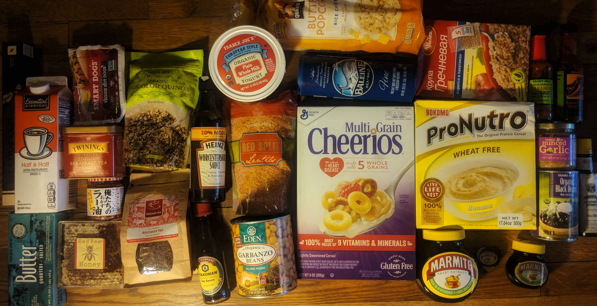
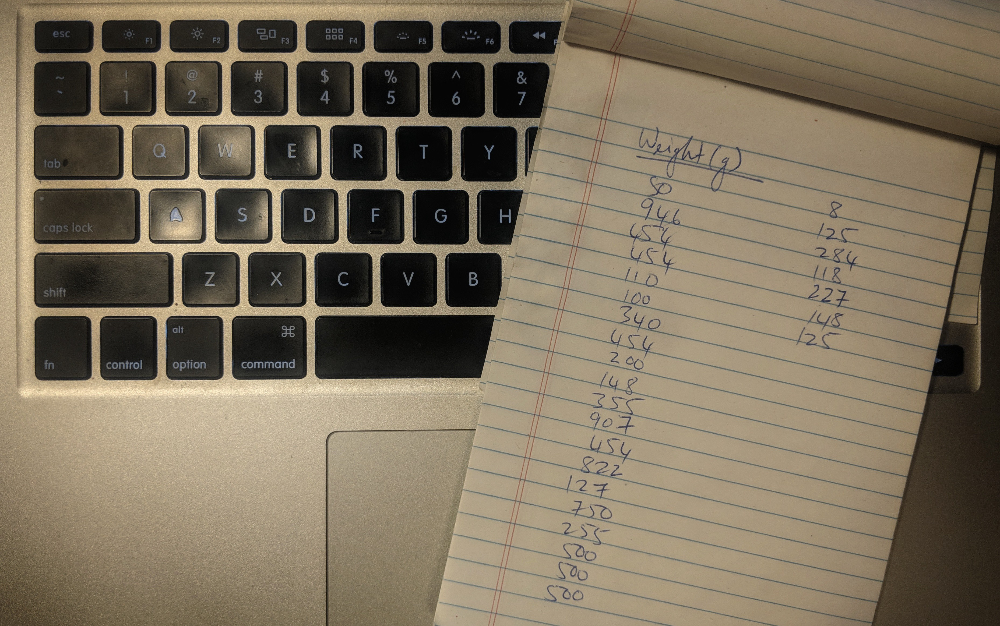
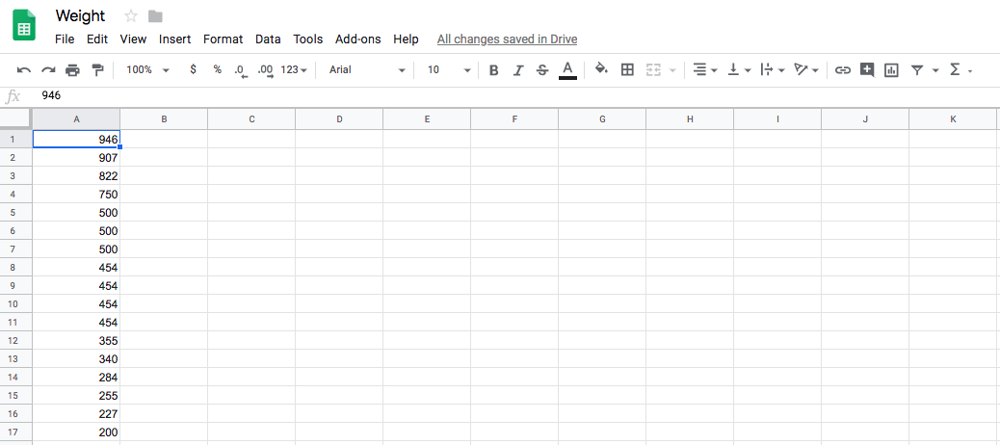
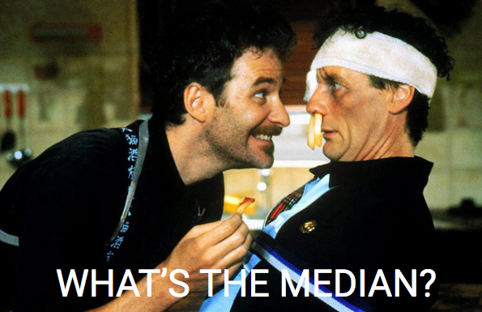
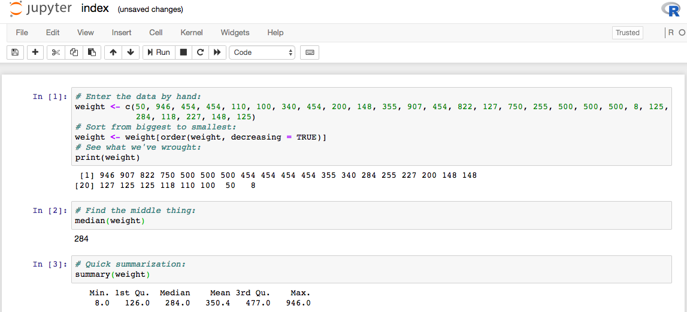
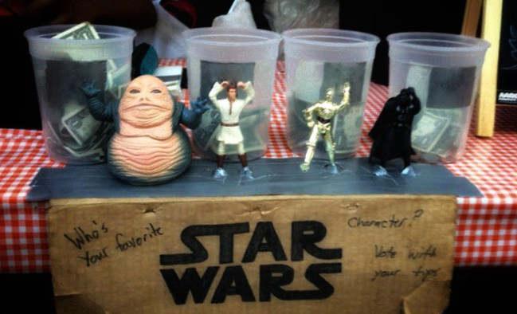
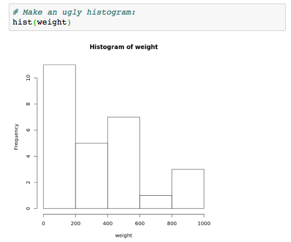
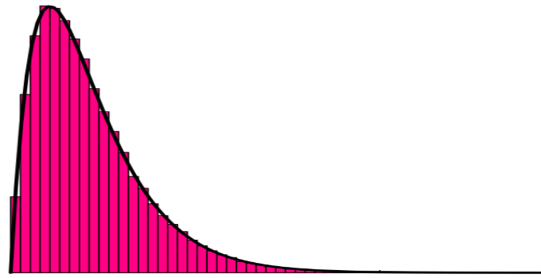
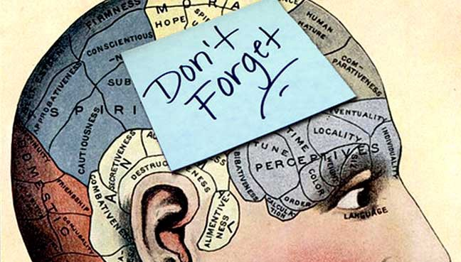

Understanding data

# Understanding data

## Musings on information, memory, analytics, and distributions

[Cassie Kozyrkov](https://towardsdatascience.com/@kozyrkov?source=post_page-----8f94ae3a56b4----------------------)

[Jan 18](https://towardsdatascience.com/what-is-data-8f94ae3a56b4?source=post_page-----8f94ae3a56b4----------------------) · 9 min read

Everything our senses perceive is data, though its storage in our cranial wet stuff leaves something to be desired. Writing it down is a bit more reliable, especially when we write it down on a computer. When those notes are well-organized, we call them ***data***... though I’ve seen some awfully messy electronic scribbles get the same name. I’m not sure why some people pronounce the word ***data*** like it has a capital D in it.

> Why do we pronounce data with a capital D?

We need to learn to be irreverently pragmatic about data, so this is an article to help beginners see behind the curtain and to help practitioners explain the basics to newcomers who show symptoms of data-worship.

# Sense and senses

If you start your journey by shopping for [datasets online](http://bit.ly/gcp-publicdata), you’re in danger of forgetting where they come form. I’m going to start from absolute scratch to show you that you can make data anytime, anywhere.

Here are some perennial denizens of my larder, arranged on my floor.

My life is pretty much a Marmite commercial. Three sizes; Goldilocks would be happy here.

This photograph is data — it’s stored as information that your device uses to show you pretty colors. (If you’re curious to know what images look like when you can see the matrix, glance at [my intro to supervised learning](http://bit.ly/quaesita_slkid).)

Let’s make some sense out of what we’re looking at. We have infinite options about what to pay attention to and remember. Here’s something I see when I look at the foodstuffs.

There’s no universal law that says that this, the weight in grams, is the best thing to pay attention to. We‘re allowed to prefer volume, price, country of origin, or anything else that suits our mood.

If you close your eyes, do you remember every detail of what you just saw? No? Me neither. That’s pretty much the reason we collect data. If we could remember and process it flawlessly in our heads, there’d be no need. The internet could be one hermit in a cave, recounting all the tweets of humankind and perfectly rendering each of our billions of cat photos.

# Writing and durability

Because human memory is a leaky bucket, it would be an improvement to jot the information down the way we used to when I went to school for [statistics](http://bit.ly/quaesita_statistics), back in the dark ages. That’s right, my friends, I still have paper around here somewhere!

This is data. Remind me why we’re worshipping it? Data are always a caricature of reality made to the tastes of a human author. This one’s full of subtle choice — shall we record dry weight or wet weight? What to do with volume units? Also, I might have made mistakes. If you inherit my data, you can’t trust your eyes unless you know what exactly happened in the data collection.

What’s great about this version — relative to what’s in my hippocampus or on my floor — is that it’s more durable and reliable.

> Human memory is a leaky bucket.

We take the memory revolution for granted since it started millenia ago with merchants needing a reliable record of who sold whom how many bushels of what. Take a moment to realize how glorious it is to have a universal system of writing that stores numbers better than our brains do. When we record data, we produce an unfaithful corruption of our richly perceived realities, but after that we can transfer uncorrupted copies of the result to other members of our species with perfect fidelity. Writing is amazing! Little bits of mind and memory that get to live outside our bodies.

> When we analyze data, we’re accessing someone else’s memories.

Worried about machines outperforming our brains? Even paper can do that! These 27 little numbers are a big lift for your brain to store, but durability is guaranteed if you have a writing implement at hand.

While this is a durability win, working with paper is annoying. For example, what if a whim strikes me to rearrange them from biggest to smallest? *Abracadabra, paper, show me a better order! *No? Darn.

# Computers and magic spells

You know what’s awesome about software? The abracadabra actually works! So let’s upgrade from paper to a computer.

Ah, spreadsheets. Baby’s first data wrangling software. If you meet them early enough, they seem friendly by dint of mere exposure. Spreadsheets are relatively limited in their functionality, though, which is why data analysts prefer to strut their stuff in Python or R.

Spreadsheets leave me lukewarm. They’re very limited compared with modern data science tools. I prefer to oscillate between R and Python, so let’s give R a whirl this time around. You can [follow along in your browser with Jupyter](http://bit.ly/jupyter_try): click on the [*“with R”* box](http://bit.ly/jupyter_try), then hit the scissors icon a few times until everything is deleted. Congrats, it took 5 seconds and you’re all set to paste in my code snippets and run [Shift+Enter] them.

weight <- c(50, 946, 454, 454, 110, 100, 340, 454, 200, 148, 355, 907, 454, 822, 127, 750, 255, 500, 500, 500, 8, 125, 284, 118, 227, 148, 125)

weight <- weight[order(weight, decreasing = TRUE)]
print(weight)

What you’ll notice is that R’s abracadabra for sorting your data is not obvious if you’re new around here.

Well, that’s true of the word “abracadabra” itself and also true of the menus in spreadsheet software. You only know those things because you were exposed to them, not because they’re universal laws. To get things done with a computer, you need to ask your resident soothsayer for the magic words/gestures and then practice using them. My favorite sage is called The Internet and knows all the things.

Here’s what it looks like when you run that code snippet in Jupyter in your browser. I added [comments](http://bit.ly/code_comments) to explain what each line does because I’m polite sometimes.

To accelerate your wizard training, don’t just paste the magic words — try altering them and see what happens. For example, what changes if you turn TRUE into FALSE in the snippet above?

Isn’t it amazing how quickly you get the answer? One reason I love programming is that it’s a cross between magic spells and LEGO.

> If you’ve ever wished you could do magic, just learn to write code.

Here’s programming in a nutshell: ask the internet how to do something, take the magic words you just learned, see what happens when you adjust them, then put them together like LEGO blocks to do your bidding.

# Analytics and summarization

The trouble with these 27 numbers is that even if they’re sorted, they don’t mean much to us. As we read them, we forget what we just read a second ago. That’s human brains for you; tell us to read a sorted list of a million numbers and at best we’ll remember the last few. We need a quick way to sort and summarize so we can get a handle on what we’re looking at.

That’s what [analytics](http://bit.ly/quaesita_datasci) is for!
median(weight)

With the right incantation, we can instantly know what the median weight is. (Median means “middle thing.”)

This is for the three of you who share my taste in [movies](http://bit.ly/fish_called_wanda).

Turns out the answer is 284g. Who doesn’t love instant gratification? There are all kinds of summary options: *min(), max(), mean(), median(), mode(), variance()*… try them all! Or try this single magic word to find out what happens.

summary(weight)

By the way, these things are called ***statistics***. A statistic is any way of mushing up your data. That’s not what the field of statistics is about — [here’s an 8min intro to the academic discipline](http://bit.ly/quaesita_statistics).

# Plotting and visualization

This section isn’t about the kind of plotting that involves world domination (stay tuned for that article). It’s about summarizing data with pictures. Turns out a picture can be worth more than a thousand words — one per datapoint and then some. (In this case we’ll make one that’s only worth 27 weights.)

Tip jars are nature’s [bar charts](http://bit.ly/bar_wiki), pun intended. More height means more popularity in that category. Histograms are almost the same thing, except that the categories are ordered.

If we want to know how the weights are ***distributed*** in our data — for example, are there more items between 0 and 200g or between 600g and 800g? — a ***histogram*** is our best friend.

Nature’s histogram.

Histograms are one way (among many) of summarizing and displaying our sample data. Their blocks are taller for more popular values of the data.

> Think of bar charts and histograms as popularity contests.

To make one in spreadsheet software, the magic spell is a long series of clicking on various menus. In R, it’s faster:

hist(weight)
Here’s what our one-liner got us:

This is one ugly histogram — but then I’m used to the finer things in life and know the [beauty of what you can do with a few more lines of code in R](http://bit.ly/histogram_tutorial). Eyesore or not, it’s worth knowing how easy the basics are.

What are we looking at?

On the horizontal axis, we have bins (or tip jars, if you prefer). They’re set to 200g increments by default, but we’ll change that in a moment. On the vertical axis are the counts: how many times did we see a weight between 0g and 200g? The plot says 11. How about between 600g and 800g? Only one (that’s the table salt, if memory serves).

We can choose our bin size — the default we got without fiddling with code is 200g bins, but maybe we want to use 100g bins instead. No problem! Magicians-in-training can tinker with my incantation to discover how it works.

hist(weight, col = "salmon2", breaks = seq(0, 1000, 100))
Here’s the result:

Now we can clearly see that the two most common categories are 100–200 and 400–500. Does anybody care? Probably not. We only did this because we could. A real analyst, on the other hand, excels at the science of looking at data quickly *and* the art of looking where the interesting nuggets lie. If they’re [good their craft](http://bit.ly/quaesita_analysts), they’re worth their weight in gold.

# What is a distribution?

If these 27 items are the [everything we care about](http://bit.ly/quaesita_popwrong), then this sample histogram I’ve just made also happens to be the population distribution.

That’s pretty much what a ***distribution*** is: it’s the histogram you’d get if you applied *hist()* to the whole [population](http://bit.ly/quaesita_statistics) (all the information you care about), not just the [sample](http://bit.ly/quaesita_statistics) (the data you happen to have on hand). There are a few footnotes, such as the scale on the *y*-axis, but we’ll leave those for another blog post — please don’t hurt me, mathematicians!

A distribution gives you popularity contest results for your whole [population](http://bit.ly/quaesita_popwrong). It’s basically the population histogram. Horizontal axis: population data values. Vertical axis: relative popularity.

If our population is *all* packaged foods ever, the distribution would be shaped like the histogram of *all* their weights. That distribution exists only in our imaginations as a theoretical idea — some packaged food products are lost to the mists of time. We can’t make that dataset even if we wanted to, so the best we can do is make guesses about it using a good sample.

# What is data science?

There’s a variety of opinions, but the definition I favor is this one: “[**Data science**](http://bit.ly/quaesita_datasci)** is the discipline of making data useful**.” Its three subfields involve mining large amounts of information for inspiration ([analytics](http://bit.ly/quaesita_analysts)), making decisions wisely based on limited information ([statistics](http://bit.ly/quaesita_statistics)), and using patterns in data to automate tasks ([ML/AI](http://bit.ly/quaesita_emperor)).

> All of data science boils down to this: knowledge is power.

The universe is full of information waiting to be harvested and put to good use. While our brains are amazing at navigating our realities, they’re not so good at storing and processing some types of very useful information.

That’s why humanity turned first to clay tablets, then to paper, and eventually to silicon for help. We developed software for looking at information quickly and these days the people who know how to use it call themselves [data scientists](http://bit.ly/quaesita_bubble) or [data analysts](http://bit.ly/quaesita_analysts). The real heroes are those who build the tools that allow these practitioners to get a grip on information better and faster. By the way, even the [internet is an analytics tool](http://bit.ly/quaesita_versus) — we just rarely think of it that way because even children can do that kind of data analysis.

# Memory upgrades for all

Everything we perceive is stored somewhere, at least temporarily. There’s nothing magical about data except that it’s written down more reliably than brains manage. Some information is useful, some is misleading, the rest is in the middle. The same goes for data.

> We’re all data analysts and always have been.

We take our amazing biological capabilities for granted and exaggerate the difference between our innate information processing and the machine-assisted variety. The difference is durability, speed, and scale… but the same rules of common sense apply in both. Why do those rules go out the window at the first sign of an equation?

Still looking for Data to pronounce with a capital D? [Well, there it sits.](http://bit.ly/startrek_capitaldata)

I’m glad we celebrate information as fuel for progress, but worshipping data as something mystical makes no sense to me. It’s better to speak about data simply, since we’re all data analysts and always have been. Let’s empower everyone to see themselves that way!