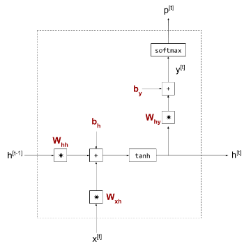

Understanding how to implement a character-based RNN language model - Eli Bendersky's website

Understanding how to implement a character-based RNN language model - Eli Bendersky's website

https://eli.thegreenplace.net/2018/understanding-how-to-implement-a-character-based-rnn-language-model/

Understanding how to implement a character-based RNN language model May 25, 2018 at 05:20 Tags Math , Machine Learning , Python In a single gist , Andrej Karpathy did something truly impressive. In a little over 100 lines of Python - without relying on any heavy-weight machine learning frameworks - he presents a fairly complete implementation of training a character-based recurrent neural network (RNN) language model; this includes the full backpropagation learning with Adagrad optimization. I love such minimal examples because they allow me to understand some topic in full depth, connecting the math to the code and having a complete picture of how everything works. In this post I want to present a companion explanation to Karpathy's gist, showing the diagrams and math that hide in its Python code.