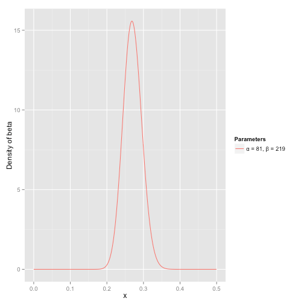
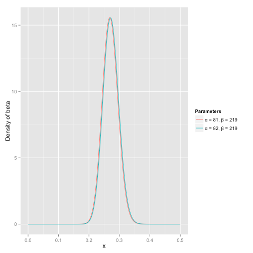
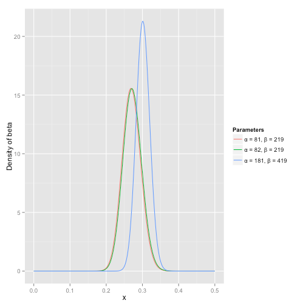

Understanding the beta distribution (using baseball statistics)

# [Understanding the beta distribution (using baseball statistics)](http://varianceexplained.org/statistics/beta_distribution_and_baseball/)

*Note: I originally published a version of this post as an answer to [this Cross Validated question](http://stats.stackexchange.com/a/47782/8373).*

Some distributions, like the normal, the binomial, and the uniform, are described in statistics education alongside their real world interpretations and applications, which means beginner statisticians usually gain a solid understanding of them. But I’ve found that the [beta distribution](http://en.wikipedia.org/wiki/Beta_distribution) is rarely explained in these intuitive terms- if its usefulness is addressed at all, it’s often with dense terms like “conjugate prior and “order statistic.” This is a shame, because the intuition behind the beta is pretty cool.

In short, the beta distribution can be understood as representing a probability distribution *of probabilities*- that is, it represents all the possible values of a probability when we don’t know what that probability is. Here is my favorite explanation of this:

Anyone who follows baseball is familiar with [batting averages](http://en.wikipedia.org/wiki/Batting_average#Major_League_Baseball)- simply the number of times a player gets a base hit divided by the number of times he goes up at bat (so it’s just a percentage between 0 and 1). .266 is in general considered an average batting average, while .300 is considered an excellent one.

Imagine we have a baseball player, and we want to predict what his season-long batting average will be. You might say we can just use his batting average so far- but this will be a very poor measure at the start of a season! If a player goes up to bat once and gets a single, his batting average is briefly 1.000, while if he strikes out or walks, his batting average is 0.000. It doesn’t get much better if you go up to bat five or six times- you could get a lucky streak and get an average of 1.000, or an unlucky streak and get an average of 0, neither of which are a remotely good predictor of how you will bat that season.

Why is your batting average in the first few hits not a good predictor of your eventual batting average? When a player’s first at-bat is a strikeout, why does no one predict that he’ll never get a hit all season? Because we’re going in with *prior expectations.* We know that in history, most batting averages over a season have hovered between something like .215 and .360, with some extremely rare exceptions on either side. We know that if a player gets a few strikeouts in a row at the start, that might indicate he’ll end up a bit worse than average, but we know he probably won’t deviate from that range.

Given our batting average problem, which can be represented with a [binomial distribution](http://en.wikipedia.org/wiki/Binomial_distribution) (a series of successes and failures), the best way to represent these prior expectations (what we in statistics just call a [prior](http://en.wikipedia.org/wiki/Prior_probability)) is with the beta distribution- it’s saying, before we’ve seen the player take his first swing, what we roughly expect his batting average to be. The domain of the beta distribution is (0,1)(0,1), just like a probability, so we already know we’re on the right track- but the appropriateness of the beta for this task goes far beyond that.

We expect that the player’s season-long batting average will be most likely around .27, but that it could reasonably range from .21 to .35. This can be represented with a beta distribution with parameters α=81α=81 and β=219β=219:

I came up with these parameters for two reasons:

- The mean is αα+β=8181+219=.270αα+β=8181+219=.270

- As you can see in the plot, this distribution lies almost entirely within (.2,.35)(.2,.35)- the reasonable range for a batting average.

You asked what the x axis represents in a beta distribution density plot- here it represents his batting average. Thus notice that in this case, not only is the y-axis a probability (or more precisely a probability density), but the x-axis is as well (batting average is just a probability of a hit, after all)! The beta distribution is representing a probability distribution *of probabilities*.

But here’s why the beta distribution is so appropriate. Imagine the player gets a single hit. His record for the season is now “1 hit; 1 at bat.” We have to then *update* our probabilities- we want to shift this entire curve over just a bit to reflect our new information. While the math for proving this is a bit involved ([it’s shown here](http://en.wikipedia.org/wiki/Conjugate_prior#Example)), the result is *very simple*. The new beta distribution will be:

Beta(α0+hits,β0+misses)Beta(α0+hits,β0+misses)

Where α0α0 and β0β0 are the parameters we started with- that is, 81 and 219. Thus, in this case, αα has increased by 1 (his one hit), while ββ has not increased at all (no misses yet). That means our new distribution is Beta(81+1,219)Beta(81+1,219). Let’s compare that to the original:

Notice that it has barely changed at all- the change is indeed invisible to the naked eye! (That’s because one hit doesn’t really mean anything).

However, the more the player hits over the course of the season, the more the curve will shift to accommodate the new evidence, and furthermore the more it will narrow based on the fact that we have more proof. Let’s say halfway through the season he has been up to bat 300 times, hitting 100 out of those times. The new distribution would be beta(81+100,219+200)beta(81+100,219+200):

Notice the curve is now both thinner and shifted to the right (higher batting average) than it used to be- we have a better sense of what the player’s batting average is.

One of the most interesting outputs of this formula is the expected value of the resulting beta distribution, which is basically your new estimate. Recall that the expected value of the beta distribution is αα+βαα+β. Thus, after 100 hits of 300 *real* at-bats, the expected value of the new beta distribution is 82+10082+100+219+200=.30382+10082+100+219+200=.303- notice that it is lower than the naive estimate of 100100+200=.333100100+200=.333, but higher than the estimate you started the season with (8181+219=.2708181+219=.270). You might notice that this formula is equivalent to adding a “head start” to the number of hits and non-hits of a player- you’re saying “start him off in the season with 81 hits and 219 non hits on his record”).

Thus, the beta distribution is best for representing a probabilistic distribution *of probabilities*- the case where we don’t know what a probability is in advance, but we have some reasonable guesses.

* * *

**Understanding the beta distribution (using baseball statistics)** was published on December 20, 2014.